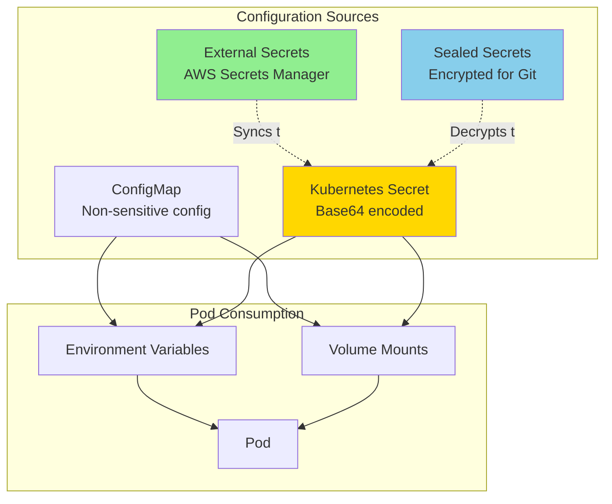
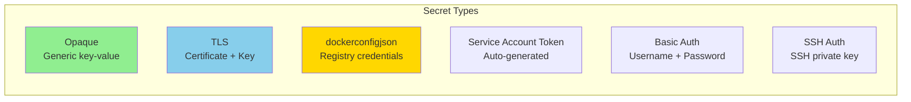
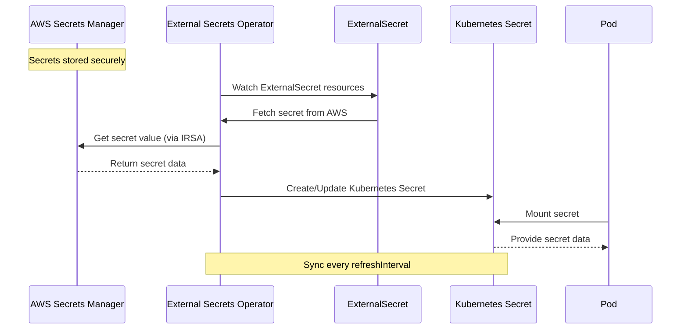
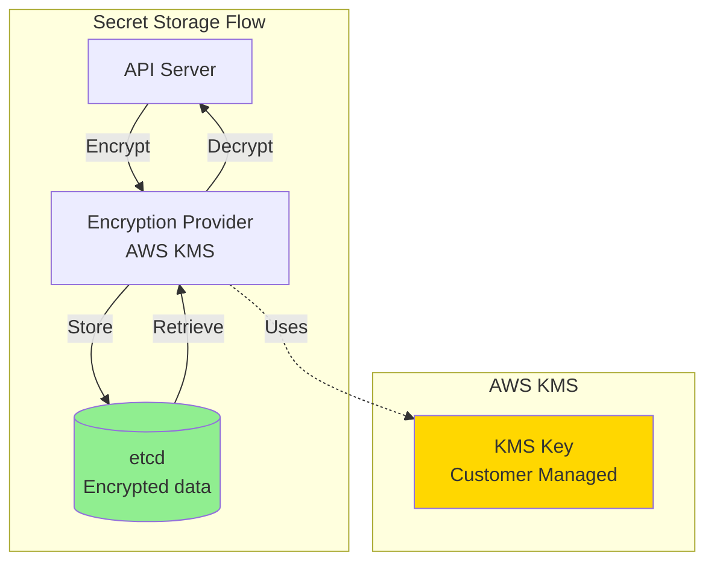
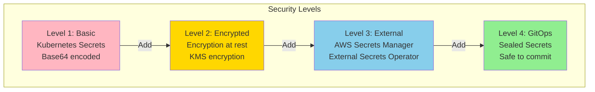
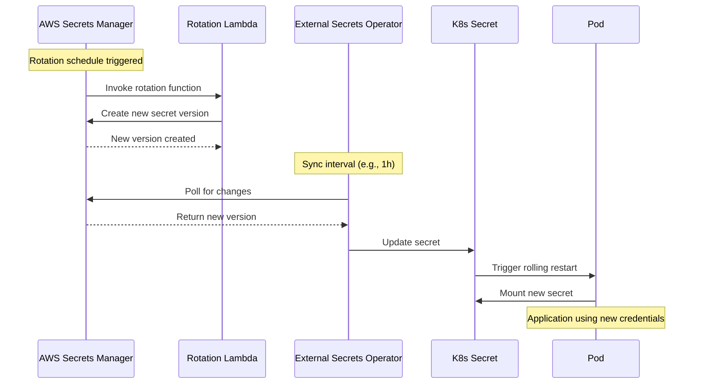

# Secrets and Configuration Management

## Configuration Architecture



## ConfigMap

### ConfigMap Creation

```yaml
# Method 1: Literal values
apiVersion: v1
kind: ConfigMap
metadata:
  name: app-config
  namespace: ecommerce-prod
data:
  database.host: "postgres.ecommerce-prod.svc.cluster.local"
  database.port: "5432"
  database.name: "orders"
  log.level: "info"
  feature.newCheckout: "true"

---
# Method 2: File contents
apiVersion: v1
kind: ConfigMap
metadata:
  name: app-config-files
  namespace: ecommerce-prod
data:
  # YAML file
  application.yaml: |
    server:
      port: 8080
      contextPath: /api
    spring:
      datasource:
        url: jdbc:postgresql://postgres:5432/orders
        username: orderuser
      kafka:
        bootstrap-servers: kafka:9092
    logging:
      level:
        root: INFO
        com.example: DEBUG

  # Properties file
  application.properties: |
    server.port=8080
    database.host=postgres
    database.port=5432

  # JSON file
  config.json: |
    {
      "feature_flags": {
        "new_checkout": true,
        "recommended_products": false
      },
      "limits": {
        "max_items_per_order": 100,
        "session_timeout_seconds": 3600
      }
    }

  # Script file
  init.sh: |
    #!/bin/bash
    echo "Initializing application..."
    ./wait-for-it.sh postgres:5432 --timeout=60
    ./run-migrations.sh
```

### Using ConfigMap

```yaml
apiVersion: v1
kind: Pod
metadata:
  name: order-service
  namespace: ecommerce-prod
spec:
  containers:
  - name: order-service
    image: order-service:latest

    # Method 1: Individual environment variables
    env:
    - name: DB_HOST
      valueFrom:
        configMapKeyRef:
          name: app-config
          key: database.host
    - name: DB_PORT
      valueFrom:
        configMapKeyRef:
          name: app-config
          key: database.port
    - name: LOG_LEVEL
      valueFrom:
        configMapKeyRef:
          name: app-config
          key: log.level

    # Method 2: All keys as environment variables
    envFrom:
    - configMapRef:
        name: app-config
        # Optional prefix
        prefix: CONFIG_

    # Method 3: Mount as files
    volumeMounts:
    - name: config-volume
      mountPath: /etc/config
      readOnly: true
    # Results in:
    # /etc/config/application.yaml
    # /etc/config/application.properties
    # /etc/config/config.json

    # Method 4: Mount single file
    - name: config-volume
      mountPath: /app/config/application.yaml
      subPath: application.yaml
      readOnly: true

  volumes:
  - name: config-volume
    configMap:
      name: app-config-files
      # Optional: Select specific items
      items:
      - key: application.yaml
        path: app.yaml
        mode: 0644
```

### ConfigMap from CLI

```bash
# From literal values
kubectl create configmap app-config \
  --from-literal=db.host=postgres \
  --from-literal=db.port=5432 \
  -n ecommerce-prod

# From file
kubectl create configmap app-config \
  --from-file=application.yaml \
  -n ecommerce-prod

# From directory
kubectl create configmap app-config \
  --from-file=config/ \
  -n ecommerce-prod

# From env file
kubectl create configmap app-config \
  --from-env-file=config.env \
  -n ecommerce-prod
```

## Kubernetes Secrets



### Opaque Secrets

```yaml
apiVersion: v1
kind: Secret
metadata:
  name: db-credentials
  namespace: ecommerce-prod
type: Opaque
data:
  # Base64 encoded values (echo -n 'value' | base64)
  username: b3JkZXJ1c2Vy        # orderuser
  password: cGFzc3dvcmQxMjM=    # password123
  api-key: YWJjZGVmZ2hpamts    # abcdefghijkl

---
# Alternative: stringData (plain text, auto-encoded)
apiVersion: v1
kind: Secret
metadata:
  name: db-credentials
  namespace: ecommerce-prod
type: Opaque
stringData:
  username: orderuser
  password: password123
  api-key: abcdefghijkl
```

### TLS Secrets

```yaml
apiVersion: v1
kind: Secret
metadata:
  name: tls-secret
  namespace: ecommerce-prod
type: kubernetes.io/tls
data:
  tls.crt: LS0tLS1CRUdJTi...  # Base64 encoded certificate
  tls.key: LS0tLS1CRUdJTi...  # Base64 encoded private key
```

```bash
# Create TLS secret from files
kubectl create secret tls tls-secret \
  --cert=path/to/cert.crt \
  --key=path/to/cert.key \
  -n ecommerce-prod
```

### Docker Registry Secrets

```yaml
apiVersion: v1
kind: Secret
metadata:
  name: ecr-credentials
  namespace: ecommerce-prod
type: kubernetes.io/dockerconfigjson
data:
  .dockerconfigjson: eyJhdXRocyI6eyJodHRwczovLzEyMzQ1Njc4OTAxMi5ka3IuZWNyLnVzLWVhc3QtMS5hbWF6b25hd3MuY29tIjp7InVzZXJuYW1lIjoiQVdTIiwicGFzc3dvcmQiOiJ0b2tlbiIsImF1dGgiOiJRVmRUT25SdmEyVnUifX19
```

```bash
# Create from Docker config
kubectl create secret docker-registry ecr-credentials \
  --docker-server=123456789012.dkr.ecr.us-east-1.amazonaws.com \
  --docker-username=AWS \
  --docker-password=$(aws ecr get-login-password --region us-east-1) \
  -n ecommerce-prod

# Use in pod spec
spec:
  imagePullSecrets:
  - name: ecr-credentials
  containers:
  - name: app
    image: 123456789012.dkr.ecr.us-east-1.amazonaws.com/app:latest
```

### Using Secrets

```yaml
apiVersion: v1
kind: Pod
metadata:
  name: order-service
  namespace: ecommerce-prod
spec:
  containers:
  - name: order-service
    image: order-service:latest

    # Method 1: Individual environment variables
    env:
    - name: DB_USERNAME
      valueFrom:
        secretKeyRef:
          name: db-credentials
          key: username
    - name: DB_PASSWORD
      valueFrom:
        secretKeyRef:
          name: db-credentials
          key: password
    - name: STRIPE_API_KEY
      valueFrom:
        secretKeyRef:
          name: payment-secrets
          key: stripe-api-key

    # Method 2: All keys as environment variables
    envFrom:
    - secretRef:
        name: db-credentials

    # Method 3: Mount as files
    volumeMounts:
    - name: db-secrets
      mountPath: /etc/secrets/db
      readOnly: true
    # Results in:
    # /etc/secrets/db/username
    # /etc/secrets/db/password

    - name: tls-certs
      mountPath: /etc/tls
      readOnly: true
    # Results in:
    # /etc/tls/tls.crt
    # /etc/tls/tls.key

  volumes:
  - name: db-secrets
    secret:
      secretName: db-credentials
      defaultMode: 0400  # Read-only by owner

  - name: tls-certs
    secret:
      secretName: tls-secret
      items:
      - key: tls.crt
        path: server.crt
      - key: tls.key
        path: server.key
        mode: 0400
```

## External Secrets Operator (Production Approach)



### Install External Secrets Operator

```bash
# Add Helm repository
helm repo add external-secrets https://charts.external-secrets.io

# Install
helm install external-secrets \
  external-secrets/external-secrets \
  -n external-secrets-system \
  --create-namespace
```

### SecretStore (AWS Secrets Manager)

```yaml
# Namespace-scoped SecretStore
apiVersion: external-secrets.io/v1beta1
kind: SecretStore
metadata:
  name: aws-secrets-manager
  namespace: ecommerce-prod
spec:
  provider:
    aws:
      service: SecretsManager
      region: us-east-1
      # Use IAM Role for Service Account (IRSA)
      auth:
        jwt:
          serviceAccountRef:
            name: external-secrets-sa

---
# Cluster-wide SecretStore
apiVersion: external-secrets.io/v1beta1
kind: ClusterSecretStore
metadata:
  name: aws-secrets-manager-global
spec:
  provider:
    aws:
      service: SecretsManager
      region: us-east-1
      auth:
        jwt:
          serviceAccountRef:
            name: external-secrets-sa
            namespace: external-secrets-system

---
# Service Account with IRSA
apiVersion: v1
kind: ServiceAccount
metadata:
  name: external-secrets-sa
  namespace: ecommerce-prod
  annotations:
    eks.amazonaws.com/role-arn: arn:aws:iam::123456789012:role/EKSExternalSecretsRole
```

### ExternalSecret

```yaml
apiVersion: external-secrets.io/v1beta1
kind: ExternalSecret
metadata:
  name: order-service-external-secret
  namespace: ecommerce-prod
spec:
  # Refresh interval
  refreshInterval: 1h

  # SecretStore reference
  secretStoreRef:
    name: aws-secrets-manager
    kind: SecretStore

  # Target Kubernetes Secret
  target:
    name: order-service-secrets
    creationPolicy: Owner  # or Merge, None
    deletionPolicy: Retain  # or Delete

  # Data mapping
  data:
  # Simple mapping
  - secretKey: db-password      # Key in K8s secret
    remoteRef:
      key: prod/ecommerce/order-service  # AWS secret name
      property: db_password              # JSON property

  - secretKey: stripe-api-key
    remoteRef:
      key: prod/ecommerce/order-service
      property: stripe_api_key

  # Version-specific
  - secretKey: api-token
    remoteRef:
      key: prod/ecommerce/order-service
      version: AWSCURRENT  # or version ID
      property: api_token

---
# Alternative: dataFrom (entire secret)
apiVersion: external-secrets.io/v1beta1
kind: ExternalSecret
metadata:
  name: complete-secret
  namespace: ecommerce-prod
spec:
  refreshInterval: 1h
  secretStoreRef:
    name: aws-secrets-manager
    kind: SecretStore
  target:
    name: complete-k8s-secret

  # Import entire secret
  dataFrom:
  - extract:
      key: prod/ecommerce/all-secrets
```

### AWS Secrets Manager Secret Structure

```json
{
  "name": "prod/ecommerce/order-service",
  "value": {
    "db_password": "secure_password_123",
    "stripe_api_key": "sk_live_abc123def456",
    "api_token": "token_xyz789",
    "jwt_secret": "super_secret_jwt_key"
  }
}
```

### IAM Role for IRSA

```json
{
  "Version": "2012-10-17",
  "Statement": [
    {
      "Effect": "Allow",
      "Action": [
        "secretsmanager:GetSecretValue",
        "secretsmanager:DescribeSecret"
      ],
      "Resource": [
        "arn:aws:secretsmanager:us-east-1:123456789012:secret:prod/ecommerce/*"
      ]
    }
  ]
}
```

## Sealed Secrets (GitOps Approach)

```mermaid
graph LR
    DEV[Developer] -->|1. Create Secret| SECRET[Secret YAML]
    SECRET -->|2. kubeseal| SEALED[SealedSecret<br/>Encrypted]
    SEALED -->|3. Git Commit| GIT[Git Repository]
    GIT -->|4. ArgoCD/Flux| CLUSTER[Kubernetes Cluster]
    CONTROLLER[Sealed Secrets Controller] -.5. Decrypts.-> CLUSTER
    CLUSTER -->|6. Creates| K8SSEC[Kubernetes Secret]

    style SEALED fill:#90EE90
    style K8SSEC fill:#87CEEB
```

### Install Sealed Secrets

```bash
# Install controller
kubectl apply -f https://github.com/bitnami-labs/sealed-secrets/releases/download/v0.24.0/controller.yaml

# Install kubeseal CLI
wget https://github.com/bitnami-labs/sealed-secrets/releases/download/v0.24.0/kubeseal-0.24.0-linux-amd64.tar.gz
tar xfz kubeseal-0.24.0-linux-amd64.tar.gz
sudo install -m 755 kubeseal /usr/local/bin/kubeseal
```

### Create SealedSecret

```bash
# 1. Create regular secret (DO NOT COMMIT)
kubectl create secret generic db-credentials \
  --from-literal=username=orderuser \
  --from-literal=password=password123 \
  --dry-run=client -o yaml > secret.yaml

# 2. Encrypt with kubeseal (SAFE TO COMMIT)
kubeseal --format yaml < secret.yaml > sealed-secret.yaml

# 3. Commit sealed-secret.yaml to Git
git add sealed-secret.yaml
git commit -m "Add encrypted database credentials"
```

### SealedSecret YAML

```yaml
apiVersion: bitnami.com/v1alpha1
kind: SealedSecret
metadata:
  name: db-credentials
  namespace: ecommerce-prod
spec:
  encryptedData:
    username: AgBy3i4OJSWK+PiTySYZZA9rO43cGDEq...
    password: AgBkHT0qhFXJxNzL3kM8YHGpkZkL5FG...
  template:
    metadata:
      name: db-credentials
      namespace: ecommerce-prod
    type: Opaque

# Controller automatically decrypts this into a regular Secret
```

## Encryption at Rest (EKS)



### Enable Encryption at Rest

```yaml
# encryption-config.yaml
apiVersion: apiserver.config.k8s.io/v1
kind: EncryptionConfiguration
resources:
  - resources:
      - secrets
    providers:
      - kms:
          name: aws-kms
          endpoint: unix:///var/run/kmsplugin/socket.sock
          cachesize: 1000
          timeout: 3s
      - identity: {}  # Fallback to unencrypted
```

```bash
# Create EKS cluster with encryption
eksctl create cluster \
  --name prod-cluster \
  --region us-east-1 \
  --encryption-config encryption-config.yaml

# Or enable on existing cluster
aws eks update-cluster-config \
  --name prod-cluster \
  --resources-vpc-config encryptionConfig=[{resources=[secrets],provider={keyArn=arn:aws:kms:us-east-1:123456789012:key/abc-123}}]
```

## Secrets Management Best Practices



### Security Checklist

| Practice | Description | Implementation |
|----------|-------------|----------------|
| **Never commit secrets to Git** | Plain secrets in repos = compromised | Use Sealed Secrets or External Secrets |
| **Encryption at rest** | Protect secrets in etcd | Enable KMS encryption |
| **RBAC for secrets** | Limit who can read secrets | Role-based access control |
| **Short-lived credentials** | Rotate regularly | AWS Secrets Manager rotation |
| **Least privilege** | Apps get only needed secrets | Separate secrets per service |
| **Audit logging** | Track secret access | CloudTrail, K8s audit logs |
| **Separate environments** | Prod secrets ≠ dev secrets | Different namespaces/clusters |
| **Service Account tokens** | Limit scope and duration | IRSA with minimal permissions |

### RBAC for Secrets

```yaml
# Role: Read-only access to specific secrets
apiVersion: rbac.authorization.k8s.io/v1
kind: Role
metadata:
  name: secret-reader
  namespace: ecommerce-prod
rules:
- apiGroups: [""]
  resources: ["secrets"]
  resourceNames: ["db-credentials", "api-keys"]
  verbs: ["get"]

---
# RoleBinding
apiVersion: rbac.authorization.k8s.io/v1
kind: RoleBinding
metadata:
  name: read-secrets
  namespace: ecommerce-prod
subjects:
- kind: ServiceAccount
  name: order-service-sa
  namespace: ecommerce-prod
roleRef:
  kind: Role
  name: secret-reader
  apiGroup: rbac.authorization.k8s.io

---
# Deny direct secret access (except via service account)
apiVersion: rbac.authorization.k8s.io/v1
kind: Role
metadata:
  name: no-secret-access
  namespace: ecommerce-prod
rules:
- apiGroups: [""]
  resources: ["secrets"]
  verbs: []  # No permissions
```

## Secret Rotation



### AWS Secrets Manager Rotation

```bash
# Enable automatic rotation
aws secretsmanager rotate-secret \
  --secret-id prod/ecommerce/db-credentials \
  --rotation-lambda-arn arn:aws:lambda:us-east-1:123456789012:function:SecretsManagerRotation \
  --rotation-rules AutomaticallyAfterDays=30
```

### Force Pod Restart on Secret Change

```yaml
# Add annotation with secret hash to trigger restart
apiVersion: apps/v1
kind: Deployment
metadata:
  name: order-service
  namespace: ecommerce-prod
spec:
  template:
    metadata:
      annotations:
        # Change this when secret updates
        checksum/secret: {{ include (print $.Template.BasePath "/secret.yaml") . | sha256sum }}
    spec:
      containers:
      - name: order-service
        image: order-service:latest
        envFrom:
        - secretRef:
            name: order-service-secrets
```

## Configuration Patterns Comparison

| Approach | Security | GitOps | Complexity | Best For |
|----------|----------|--------|------------|----------|
| **ConfigMap** | Low | ✅ | Low | Non-sensitive config |
| **K8s Secret** | Medium | ❌ | Low | Basic secrets |
| **K8s Secret + KMS** | High | ❌ | Medium | Encrypted secrets |
| **External Secrets** | High | ✅ | Medium | AWS-native secrets |
| **Sealed Secrets** | High | ✅ | Medium | Git-based workflows |
| **Vault** | Very High | ✅ | High | Multi-cloud, advanced |

## Next Steps

- **[06-monitoring-observability.md](./06-monitoring-observability.md)**: Monitoring, logging, and tracing
- **[07-complete-example.md](./07-complete-example.md)**: Full application with all concepts
- **[08-best-practices.md](./08-best-practices.md)**: Production best practices
