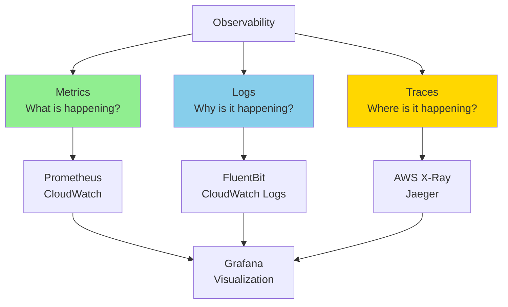
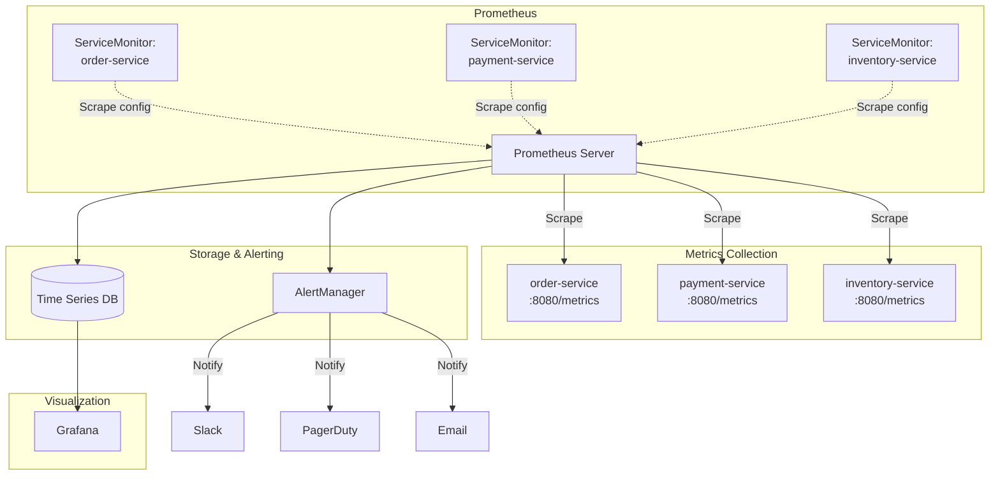
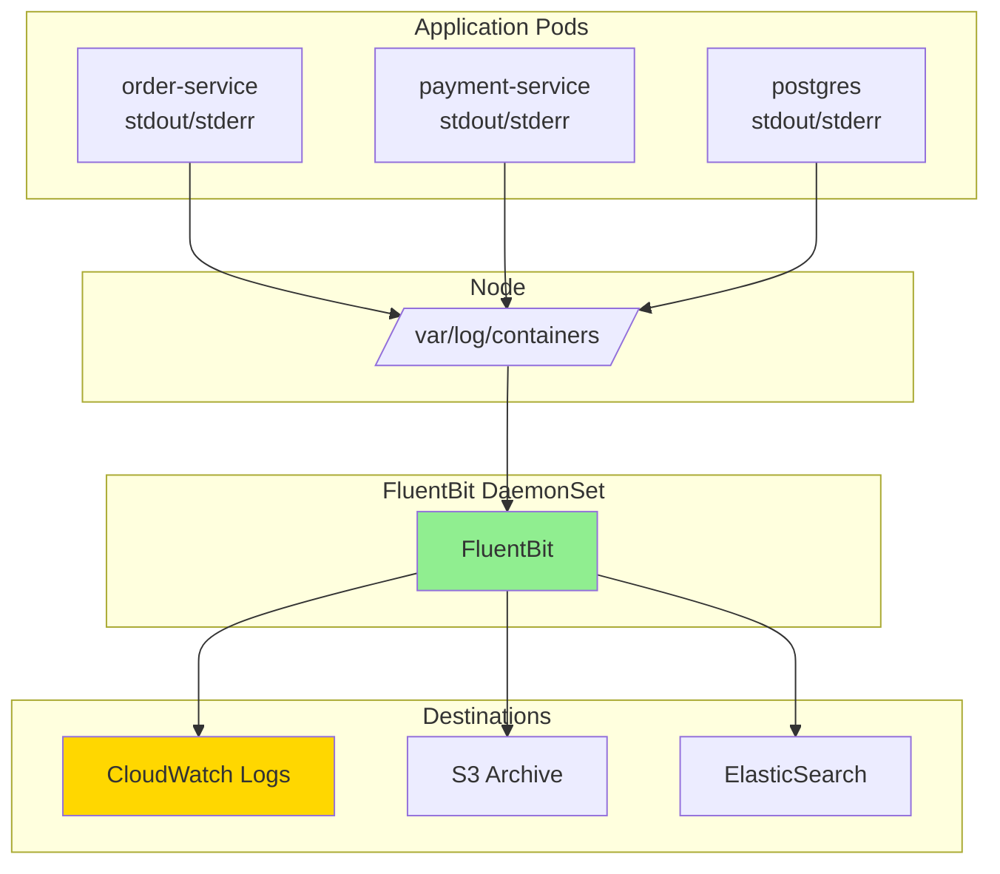
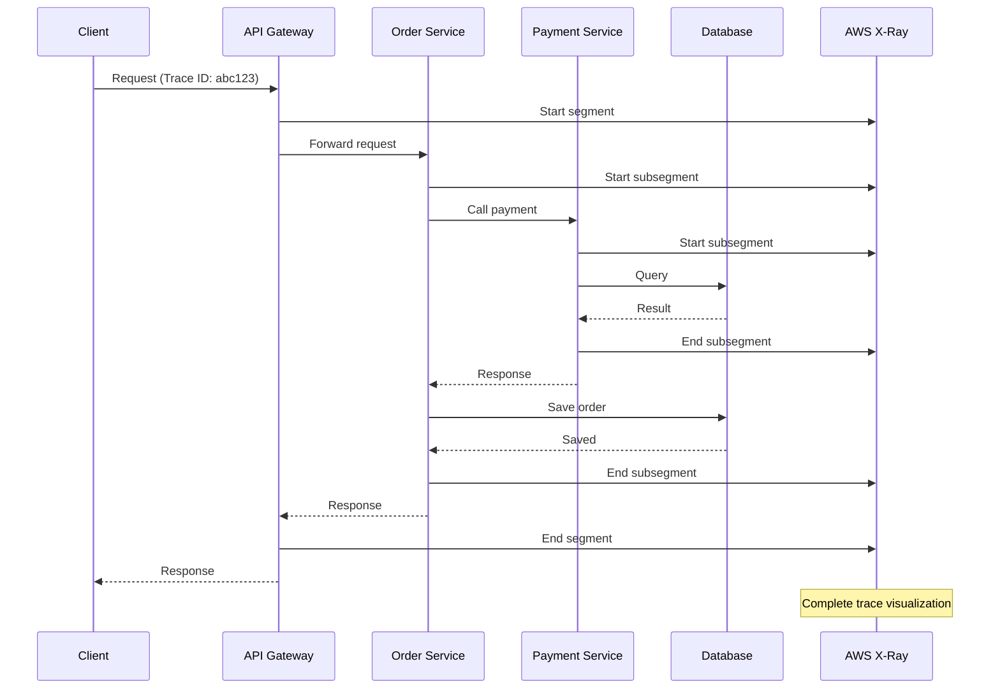
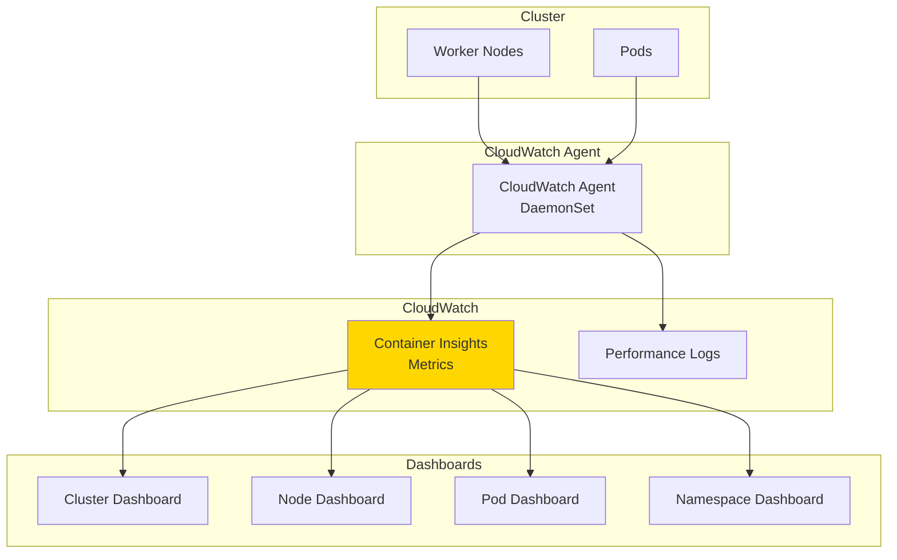
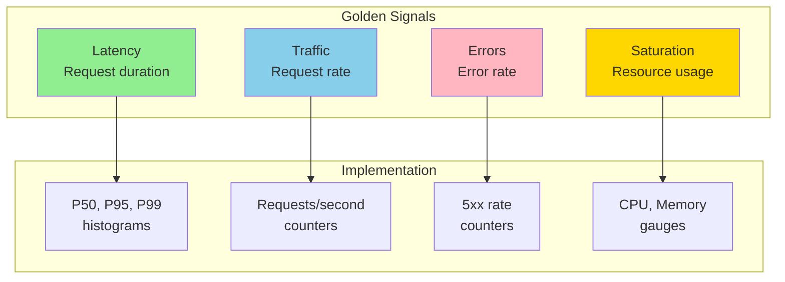

# Monitoring and Observability

## Observability Pillars



## Metrics with Prometheus



### Install Prometheus Stack

```bash
# Add Helm repository
helm repo add prometheus-community https://prometheus-community.github.io/helm-charts
helm repo update

# Install kube-prometheus-stack
helm install kube-prometheus prometheus-community/kube-prometheus-stack \
  --namespace monitoring \
  --create-namespace \
  --set prometheus.prometheusSpec.retention=15d \
  --set prometheus.prometheusSpec.storageSpec.volumeClaimTemplate.spec.resources.requests.storage=50Gi \
  --set grafana.adminPassword=admin123
```

### ServiceMonitor

```yaml
apiVersion: monitoring.coreos.com/v1
kind: ServiceMonitor
metadata:
  name: order-service-metrics
  namespace: ecommerce-prod
  labels:
    release: kube-prometheus  # Must match Prometheus selector
spec:
  # Select services to monitor
  selector:
    matchLabels:
      app: order-service

  # Namespace to watch (optional)
  namespaceSelector:
    matchNames:
    - ecommerce-prod

  # Endpoints to scrape
  endpoints:
  - port: metrics          # Port name from service
    interval: 30s         # Scrape interval
    path: /actuator/prometheus  # Metrics endpoint
    scheme: http
    # Optional: scrape timeout
    scrapeTimeout: 10s
    # Optional: relabeling
    relabelings:
    - sourceLabels: [__meta_kubernetes_pod_name]
      targetLabel: pod
    - sourceLabels: [__meta_kubernetes_namespace]
      targetLabel: namespace

---
# Service exposing metrics port
apiVersion: v1
kind: Service
metadata:
  name: order-service-metrics
  namespace: ecommerce-prod
  labels:
    app: order-service
spec:
  selector:
    app: order-service
  ports:
  - name: http
    port: 80
    targetPort: 8080
  - name: metrics  # Named port for ServiceMonitor
    port: 9090
    targetPort: 9090
```

### PrometheusRule (Alerts)

```yaml
apiVersion: monitoring.coreos.com/v1
kind: PrometheusRule
metadata:
  name: order-service-alerts
  namespace: ecommerce-prod
  labels:
    release: kube-prometheus
spec:
  groups:
  - name: order-service.rules
    interval: 30s
    rules:
    # Alert: Service down
    - alert: OrderServiceDown
      expr: up{job="order-service"} == 0
      for: 5m
      labels:
        severity: critical
        service: order-service
      annotations:
        summary: "Order service is down"
        description: "Order service has been down for more than 5 minutes"

    # Alert: High error rate
    - alert: HighErrorRate
      expr: |
        (
          sum(rate(http_server_requests_seconds_count{job="order-service",status=~"5.."}[5m]))
          /
          sum(rate(http_server_requests_seconds_count{job="order-service"}[5m]))
        ) > 0.05
      for: 5m
      labels:
        severity: critical
        service: order-service
      annotations:
        summary: "High 5xx error rate on order service"
        description: "Error rate is {{ $value | humanizePercentage }}"

    # Alert: High latency
    - alert: HighLatency
      expr: |
        histogram_quantile(0.99,
          sum(rate(http_server_requests_seconds_bucket{job="order-service"}[5m])) by (le)
        ) > 2
      for: 10m
      labels:
        severity: warning
        service: order-service
      annotations:
        summary: "High P99 latency on order service"
        description: "P99 latency is {{ $value }}s (threshold: 2s)"

    # Alert: Pod crash looping
    - alert: PodCrashLooping
      expr: |
        rate(kube_pod_container_status_restarts_total{
          namespace="ecommerce-prod",
          pod=~"order-service.*"
        }[15m]) > 0
      for: 5m
      labels:
        severity: critical
      annotations:
        summary: "Pod {{ $labels.pod }} is crash looping"
        description: "Pod has restarted {{ $value }} times in last 15 minutes"

    # Alert: High memory usage
    - alert: HighMemoryUsage
      expr: |
        (
          container_memory_working_set_bytes{
            namespace="ecommerce-prod",
            pod=~"order-service.*",
            container="order-service"
          }
          /
          container_spec_memory_limit_bytes{
            namespace="ecommerce-prod",
            pod=~"order-service.*",
            container="order-service"
          }
        ) > 0.9
      for: 10m
      labels:
        severity: warning
      annotations:
        summary: "High memory usage on {{ $labels.pod }}"
        description: "Memory usage is {{ $value | humanizePercentage }}"

    # Alert: High CPU usage
    - alert: HighCPUUsage
      expr: |
        (
          rate(container_cpu_usage_seconds_total{
            namespace="ecommerce-prod",
            pod=~"order-service.*",
            container="order-service"
          }[5m])
          /
          container_spec_cpu_quota{
            namespace="ecommerce-prod",
            pod=~"order-service.*",
            container="order-service"
          }
          * 100000
        ) > 0.8
      for: 10m
      labels:
        severity: warning
      annotations:
        summary: "High CPU usage on {{ $labels.pod }}"
        description: "CPU usage is {{ $value | humanizePercentage }}"

    # Recording rule: Request rate
    - record: job:http_requests:rate5m
      expr: |
        sum(rate(http_server_requests_seconds_count{job="order-service"}[5m]))
          by (job, status)
```

### Application Metrics (Spring Boot Example)

```yaml
# Deployment with metrics enabled
apiVersion: apps/v1
kind: Deployment
metadata:
  name: order-service
  namespace: ecommerce-prod
spec:
  template:
    metadata:
      annotations:
        prometheus.io/scrape: "true"
        prometheus.io/port: "9090"
        prometheus.io/path: "/actuator/prometheus"
    spec:
      containers:
      - name: order-service
        image: order-service:latest
        ports:
        - containerPort: 8080
          name: http
        - containerPort: 9090
          name: metrics
        env:
        - name: MANAGEMENT_ENDPOINTS_WEB_EXPOSURE_INCLUDE
          value: "health,info,prometheus,metrics"
        - name: MANAGEMENT_METRICS_EXPORT_PROMETHEUS_ENABLED
          value: "true"
```

### Common Metrics Queries

```promql
# Request rate
sum(rate(http_server_requests_seconds_count{job="order-service"}[5m])) by (status)

# P50, P95, P99 latency
histogram_quantile(0.50, sum(rate(http_server_requests_seconds_bucket[5m])) by (le))
histogram_quantile(0.95, sum(rate(http_server_requests_seconds_bucket[5m])) by (le))
histogram_quantile(0.99, sum(rate(http_server_requests_seconds_bucket[5m])) by (le))

# Error rate percentage
(
  sum(rate(http_server_requests_seconds_count{status=~"5.."}[5m]))
  /
  sum(rate(http_server_requests_seconds_count[5m]))
) * 100

# CPU usage by pod
sum(rate(container_cpu_usage_seconds_total{namespace="ecommerce-prod"}[5m])) by (pod)

# Memory usage by pod
sum(container_memory_working_set_bytes{namespace="ecommerce-prod"}) by (pod)

# Pod count
count(kube_pod_info{namespace="ecommerce-prod"}) by (deployment)

# Pod restart count
sum(kube_pod_container_status_restarts_total{namespace="ecommerce-prod"}) by (pod)
```

## Logging with FluentBit



### FluentBit ConfigMap

```yaml
apiVersion: v1
kind: ConfigMap
metadata:
  name: fluent-bit-config
  namespace: amazon-cloudwatch
data:
  fluent-bit.conf: |
    [SERVICE]
        Flush                     5
        Log_Level                 info
        Daemon                    off
        Parsers_File              parsers.conf
        HTTP_Server               On
        HTTP_Listen               0.0.0.0
        HTTP_Port                 2020

    [INPUT]
        Name                      tail
        Tag                       kube.*
        Path                      /var/log/containers/*.log
        Parser                    docker
        DB                        /var/fluent-bit/state/flb_kube.db
        Mem_Buf_Limit             50MB
        Skip_Long_Lines           On
        Refresh_Interval          10
        Rotate_Wait               30
        # Exclude system namespaces
        Exclude_Path              /var/log/containers/*_kube-system_*.log,/var/log/containers/*_kube-node-lease_*.log

    [FILTER]
        Name                      kubernetes
        Match                     kube.*
        Kube_URL                  https://kubernetes.default.svc:443
        Kube_CA_File              /var/run/secrets/kubernetes.io/serviceaccount/ca.crt
        Kube_Token_File           /var/run/secrets/kubernetes.io/serviceaccount/token
        Kube_Tag_Prefix           kube.var.log.containers.
        Merge_Log                 On
        Keep_Log                  Off
        K8S-Logging.Parser        On
        K8S-Logging.Exclude       On
        # Add labels as metadata
        Labels                    On
        Annotations               Off

    [FILTER]
        Name                      modify
        Match                     kube.*
        # Add cluster name
        Add                       cluster_name prod-eks-cluster
        # Add environment
        Add                       environment production

    [FILTER]
        Name                      grep
        Match                     kube.*
        # Only logs from production namespace
        Regex                     kubernetes.namespace_name ecommerce-prod

    [OUTPUT]
        Name                      cloudwatch_logs
        Match                     kube.*
        region                    us-east-1
        log_group_name            /aws/eks/prod-cluster/application
        log_stream_prefix         from-fluent-bit-
        auto_create_group         true
        log_retention_days        7

    [OUTPUT]
        Name                      s3
        Match                     kube.*
        region                    us-east-1
        bucket                    my-logs-archive-bucket
        total_file_size           100M
        upload_timeout            10m
        s3_key_format             /fluent-bit-logs/$TAG[2]/$TAG[0]/%Y/%m/%d/%H/%M/%S

  parsers.conf: |
    [PARSER]
        Name                      docker
        Format                    json
        Time_Key                  time
        Time_Format               %Y-%m-%dT%H:%M:%S.%L
        Time_Keep                 On
        # Decode log field if it's JSON
        Decode_Field_As           json log

    [PARSER]
        Name                      json
        Format                    json
        Time_Key                  timestamp
        Time_Format               %Y-%m-%dT%H:%M:%S.%L%z
```

### FluentBit DaemonSet

```yaml
apiVersion: apps/v1
kind: DaemonSet
metadata:
  name: fluent-bit
  namespace: amazon-cloudwatch
spec:
  selector:
    matchLabels:
      app: fluent-bit
  template:
    metadata:
      labels:
        app: fluent-bit
    spec:
      serviceAccountName: fluent-bit
      tolerations:
      - key: node-role.kubernetes.io/master
        effect: NoSchedule

      containers:
      - name: fluent-bit
        image: public.ecr.aws/aws-observability/aws-for-fluent-bit:latest
        resources:
          requests:
            memory: "128Mi"
            cpu: "100m"
          limits:
            memory: "256Mi"
            cpu: "200m"
        volumeMounts:
        - name: varlog
          mountPath: /var/log
          readOnly: true
        - name: varlibdockercontainers
          mountPath: /var/lib/docker/containers
          readOnly: true
        - name: fluent-bit-config
          mountPath: /fluent-bit/etc/
        - name: fluent-bit-state
          mountPath: /var/fluent-bit/state

      volumes:
      - name: varlog
        hostPath:
          path: /var/log
      - name: varlibdockercontainers
        hostPath:
          path: /var/lib/docker/containers
      - name: fluent-bit-config
        configMap:
          name: fluent-bit-config
      - name: fluent-bit-state
        hostPath:
          path: /var/fluent-bit/state

---
apiVersion: v1
kind: ServiceAccount
metadata:
  name: fluent-bit
  namespace: amazon-cloudwatch
  annotations:
    eks.amazonaws.com/role-arn: arn:aws:iam::123456789012:role/FluentBitRole
```

### Structured Logging (Application Side)

```java
// Spring Boot application - Structured JSON logging
@SpringBootApplication
public class OrderServiceApplication {
    public static void main(String[] args) {
        SpringApplication.run(OrderServiceApplication.class, args);
    }
}

// logback-spring.xml
<?xml version="1.0" encoding="UTF-8"?>
<configuration>
    <appender name="CONSOLE" class="ch.qos.logback.core.ConsoleAppender">
        <encoder class="net.logstash.logback.encoder.LogstashEncoder">
            <customFields>{"app":"order-service"}</customFields>
            <fieldNames>
                <timestamp>timestamp</timestamp>
                <message>message</message>
                <logger>logger</logger>
                <thread>thread</thread>
                <level>level</level>
            </fieldNames>
        </encoder>
    </appender>

    <root level="INFO">
        <appender-ref ref="CONSOLE" />
    </root>
</configuration>

// Example log output (JSON)
{
  "timestamp": "2026-01-22T10:30:45.123Z",
  "level": "INFO",
  "logger": "com.example.OrderController",
  "message": "Order created successfully",
  "app": "order-service",
  "trace_id": "abc123",
  "span_id": "xyz789",
  "order_id": "12345",
  "user_id": "user_456",
  "amount": 99.99
}
```

## Distributed Tracing with AWS X-Ray



### X-Ray DaemonSet

```yaml
apiVersion: apps/v1
kind: DaemonSet
metadata:
  name: xray-daemon
  namespace: amazon-cloudwatch
spec:
  selector:
    matchLabels:
      app: xray-daemon
  template:
    metadata:
      labels:
        app: xray-daemon
    spec:
      serviceAccountName: xray-daemon
      containers:
      - name: xray-daemon
        image: public.ecr.aws/xray/aws-xray-daemon:latest
        ports:
        - containerPort: 2000
          protocol: UDP
          name: xray-ingest
        - containerPort: 2000
          protocol: TCP
          name: xray-tcp
        resources:
          requests:
            memory: "128Mi"
            cpu: "50m"
          limits:
            memory: "256Mi"
            cpu: "100m"
        env:
        - name: AWS_REGION
          value: us-east-1

---
apiVersion: v1
kind: Service
metadata:
  name: xray-daemon
  namespace: amazon-cloudwatch
spec:
  selector:
    app: xray-daemon
  ports:
  - port: 2000
    protocol: UDP
    name: xray-ingest
  - port: 2000
    protocol: TCP
    name: xray-tcp

---
apiVersion: v1
kind: ServiceAccount
metadata:
  name: xray-daemon
  namespace: amazon-cloudwatch
  annotations:
    eks.amazonaws.com/role-arn: arn:aws:iam::123456789012:role/XRayDaemonRole
```

### Application with X-Ray

```yaml
apiVersion: apps/v1
kind: Deployment
metadata:
  name: order-service
  namespace: ecommerce-prod
spec:
  template:
    spec:
      containers:
      - name: order-service
        image: order-service:latest
        env:
        # X-Ray daemon address
        - name: AWS_XRAY_DAEMON_ADDRESS
          value: "xray-daemon.amazon-cloudwatch:2000"
        # Tracing name
        - name: AWS_XRAY_TRACING_NAME
          value: "order-service"
        # Enable X-Ray
        - name: AWS_XRAY_CONTEXT_MISSING
          value: "LOG_ERROR"
        # Sampling rate
        - name: AWS_XRAY_SAMPLING_RATE
          value: "0.1"  # 10% of requests
```

## CloudWatch Container Insights



### Install Container Insights

```bash
# Quick start
kubectl apply -f https://raw.githubusercontent.com/aws-samples/amazon-cloudwatch-container-insights/latest/k8s-deployment-manifest-templates/deployment-mode/daemonset/container-insights-monitoring/quickstart/cwagent-fluentd-quickstart.yaml
```

### Container Insights Metrics

```yaml
apiVersion: v1
kind: ConfigMap
metadata:
  name: cwagentconfig
  namespace: amazon-cloudwatch
data:
  cwagentconfig.json: |
    {
      "logs": {
        "metrics_collected": {
          "kubernetes": {
            "cluster_name": "prod-eks-cluster",
            "metrics_collection_interval": 60
          }
        },
        "force_flush_interval": 15
      },
      "metrics": {
        "namespace": "ContainerInsights",
        "metrics_collected": {
          "cpu": {
            "measurement": [
              {"name": "cpu_usage_total", "rename": "CPUUsage", "unit": "Percent"}
            ],
            "metrics_collection_interval": 60,
            "resources": ["*"]
          },
          "mem": {
            "measurement": [
              {"name": "mem_used_percent", "rename": "MemoryUtilization", "unit": "Percent"}
            ],
            "metrics_collection_interval": 60,
            "resources": ["*"]
          },
          "disk": {
            "measurement": [
              {"name": "used_percent", "rename": "DiskUtilization", "unit": "Percent"}
            ],
            "metrics_collection_interval": 60,
            "resources": ["*"]
          }
        }
      }
    }
```

## Grafana Dashboards

### Grafana Dashboard ConfigMap

```yaml
apiVersion: v1
kind: ConfigMap
metadata:
  name: order-service-dashboard
  namespace: monitoring
  labels:
    grafana_dashboard: "1"
data:
  order-service.json: |
    {
      "dashboard": {
        "title": "Order Service Metrics",
        "tags": ["kubernetes", "microservices"],
        "timezone": "browser",
        "panels": [
          {
            "title": "Request Rate",
            "type": "graph",
            "targets": [
              {
                "expr": "sum(rate(http_server_requests_seconds_count{job='order-service'}[5m])) by (status)",
                "legendFormat": "{{status}}"
              }
            ]
          },
          {
            "title": "P50/P95/P99 Latency",
            "type": "graph",
            "targets": [
              {
                "expr": "histogram_quantile(0.50, sum(rate(http_server_requests_seconds_bucket{job='order-service'}[5m])) by (le))",
                "legendFormat": "P50"
              },
              {
                "expr": "histogram_quantile(0.95, sum(rate(http_server_requests_seconds_bucket{job='order-service'}[5m])) by (le))",
                "legendFormat": "P95"
              },
              {
                "expr": "histogram_quantile(0.99, sum(rate(http_server_requests_seconds_bucket{job='order-service'}[5m])) by (le))",
                "legendFormat": "P99"
              }
            ]
          },
          {
            "title": "Error Rate",
            "type": "singlestat",
            "targets": [
              {
                "expr": "(sum(rate(http_server_requests_seconds_count{job='order-service',status=~'5..'}[5m])) / sum(rate(http_server_requests_seconds_count{job='order-service'}[5m]))) * 100"
              }
            ],
            "format": "percent"
          },
          {
            "title": "CPU Usage by Pod",
            "type": "graph",
            "targets": [
              {
                "expr": "sum(rate(container_cpu_usage_seconds_total{namespace='ecommerce-prod',pod=~'order-service.*'}[5m])) by (pod)"
              }
            ]
          },
          {
            "title": "Memory Usage by Pod",
            "type": "graph",
            "targets": [
              {
                "expr": "sum(container_memory_working_set_bytes{namespace='ecommerce-prod',pod=~'order-service.*'}) by (pod)"
              }
            ]
          }
        ]
      }
    }
```

## Monitoring Stack Comparison

| Feature | Prometheus + Grafana | CloudWatch Container Insights | ELK Stack | Datadog |
|---------|---------------------|-------------------------------|-----------|---------|
| **Metrics** | ✅ Excellent | ✅ Good | ⚠️ Limited | ✅ Excellent |
| **Logs** | ⚠️ Via Loki | ✅ Native | ✅ Excellent | ✅ Excellent |
| **Traces** | ⚠️ Via Tempo | ✅ X-Ray | ⚠️ APM | ✅ APM |
| **Cost** | Free (self-hosted) | AWS charges | Self-hosted | $$$ SaaS |
| **Setup** | Medium | Easy | Complex | Easy |
| **Retention** | Configurable | 15 months | Configurable | Configurable |
| **AWS Integration** | Manual | Native | Manual | Good |

## Best Practices



### Monitoring Checklist

| Layer | What to Monitor | Tools |
|-------|----------------|-------|
| **Application** | Request rate, latency, errors | Prometheus, CloudWatch |
| **Container** | CPU, memory, restarts | cAdvisor, Container Insights |
| **Pod** | Status, readiness, events | kube-state-metrics |
| **Node** | CPU, memory, disk, network | node-exporter |
| **Cluster** | API server, etcd, scheduler | kube-prometheus |
| **AWS** | ELB, EBS, RDS | CloudWatch |

## Next Steps

- **[07-complete-example.md](./07-complete-example.md)**: Full e-commerce application
- **[08-best-practices.md](./08-best-practices.md)**: Production best practices
