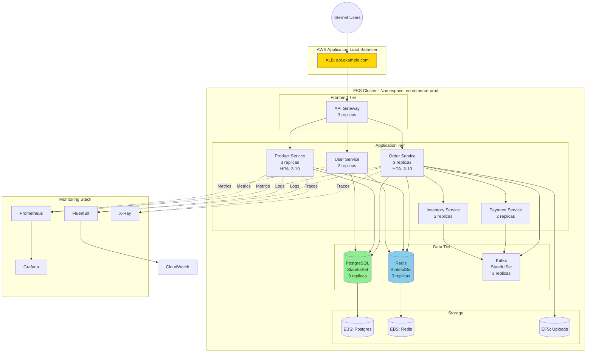

# Complete E-Commerce Microservices Example

## Architecture Overview



## Directory Structure

```
k8s-manifests/
├── namespace/
│   └── namespace.yaml
├── storage/
│   ├── storage-class-ebs.yaml
│   ├── storage-class-efs.yaml
│   └── pvc-efs-uploads.yaml
├── secrets/
│   ├── secret-store.yaml
│   ├── external-secret-postgres.yaml
│   ├── external-secret-redis.yaml
│   └── external-secret-services.yaml
├── config/
│   ├── configmap-order-service.yaml
│   ├── configmap-product-service.yaml
│   └── configmap-user-service.yaml
├── databases/
│   ├── postgres-statefulset.yaml
│   ├── redis-statefulset.yaml
│   └── kafka-statefulset.yaml
├── services/
│   ├── order-service/
│   │   ├── deployment.yaml
│   │   ├── service.yaml
│   │   ├── hpa.yaml
│   │   └── pdb.yaml
│   ├── product-service/
│   │   ├── deployment.yaml
│   │   ├── service.yaml
│   │   ├── hpa.yaml
│   │   └── pdb.yaml
│   └── ...
├── networking/
│   ├── ingress.yaml
│   └── network-policies.yaml
├── monitoring/
│   ├── servicemonitor-order.yaml
│   ├── servicemonitor-product.yaml
│   ├── prometheus-rules.yaml
│   └── grafana-dashboards.yaml
└── rbac/
    ├── service-accounts.yaml
    └── roles.yaml
```

## Complete Manifest Files

### 1. Namespace

```yaml
# namespace/namespace.yaml
apiVersion: v1
kind: Namespace
metadata:
  name: ecommerce-prod
  labels:
    environment: production
    team: platform
    monitoring: enabled
    istio-injection: disabled
```

### 2. Storage Classes

```yaml
# storage/storage-class-ebs.yaml
apiVersion: storage.k8s.io/v1
kind: StorageClass
metadata:
  name: ebs-gp3-encrypted
  annotations:
    storageclass.kubernetes.io/is-default-class: "true"
provisioner: ebs.csi.aws.com
parameters:
  type: gp3
  iops: "3000"
  throughput: "125"
  encrypted: "true"
  kmsKeyId: "arn:aws:kms:us-east-1:123456789012:key/abc-123"
volumeBindingMode: WaitForFirstConsumer
allowVolumeExpansion: true
reclaimPolicy: Retain

---
# storage/storage-class-efs.yaml
apiVersion: storage.k8s.io/v1
kind: StorageClass
metadata:
  name: efs-sc
provisioner: efs.csi.aws.com
parameters:
  provisioningMode: efs-ap
  fileSystemId: fs-abc12345
  directoryPerms: "700"
mountOptions:
  - tls

---
# storage/pvc-efs-uploads.yaml
apiVersion: v1
kind: PersistentVolumeClaim
metadata:
  name: shared-uploads
  namespace: ecommerce-prod
spec:
  accessModes:
    - ReadWriteMany
  storageClassName: efs-sc
  resources:
    requests:
      storage: 100Gi
```

### 3. Secrets Management

```yaml
# secrets/secret-store.yaml
apiVersion: external-secrets.io/v1beta1
kind: SecretStore
metadata:
  name: aws-secrets-manager
  namespace: ecommerce-prod
spec:
  provider:
    aws:
      service: SecretsManager
      region: us-east-1
      auth:
        jwt:
          serviceAccountRef:
            name: external-secrets-sa

---
# secrets/external-secret-postgres.yaml
apiVersion: external-secrets.io/v1beta1
kind: ExternalSecret
metadata:
  name: postgres-credentials
  namespace: ecommerce-prod
spec:
  refreshInterval: 1h
  secretStoreRef:
    name: aws-secrets-manager
    kind: SecretStore
  target:
    name: postgres-secrets
    creationPolicy: Owner
  data:
  - secretKey: password
    remoteRef:
      key: prod/ecommerce/postgres
      property: password
  - secretKey: replication-password
    remoteRef:
      key: prod/ecommerce/postgres
      property: replication_password

---
# secrets/external-secret-services.yaml
apiVersion: external-secrets.io/v1beta1
kind: ExternalSecret
metadata:
  name: order-service-secrets
  namespace: ecommerce-prod
spec:
  refreshInterval: 1h
  secretStoreRef:
    name: aws-secrets-manager
    kind: SecretStore
  target:
    name: order-service-secrets
  data:
  - secretKey: stripe-api-key
    remoteRef:
      key: prod/ecommerce/order-service
      property: stripe_api_key
  - secretKey: jwt-secret
    remoteRef:
      key: prod/ecommerce/order-service
      property: jwt_secret
```

### 4. ConfigMaps

```yaml
# config/configmap-order-service.yaml
apiVersion: v1
kind: ConfigMap
metadata:
  name: order-service-config
  namespace: ecommerce-prod
data:
  application.yaml: |
    server:
      port: 8080
      shutdown: graceful
    spring:
      application:
        name: order-service
      datasource:
        url: jdbc:postgresql://postgres.ecommerce-prod:5432/orders
        username: orderuser
      jpa:
        hibernate:
          ddl-auto: validate
      kafka:
        bootstrap-servers: kafka.ecommerce-prod:9092
        consumer:
          group-id: order-consumer-group
        producer:
          acks: all
          retries: 3
      redis:
        host: redis.ecommerce-prod
        port: 6379
    management:
      endpoints:
        web:
          exposure:
            include: health,info,prometheus,metrics
      metrics:
        export:
          prometheus:
            enabled: true
      health:
        livenessState:
          enabled: true
        readinessState:
          enabled: true
    logging:
      level:
        root: INFO
        com.example.order: DEBUG
      pattern:
        console: '{"timestamp":"%d{ISO8601}","level":"%p","logger":"%c","message":"%m"}%n'
```

### 5. PostgreSQL StatefulSet

```yaml
# databases/postgres-statefulset.yaml
apiVersion: apps/v1
kind: StatefulSet
metadata:
  name: postgres
  namespace: ecommerce-prod
spec:
  serviceName: postgres
  replicas: 3
  selector:
    matchLabels:
      app: postgres
  template:
    metadata:
      labels:
        app: postgres
    spec:
      serviceAccountName: postgres-sa

      affinity:
        podAntiAffinity:
          requiredDuringSchedulingIgnoredDuringExecution:
          - labelSelector:
              matchExpressions:
              - key: app
                operator: In
                values:
                - postgres
            topologyKey: topology.kubernetes.io/zone

      containers:
      - name: postgres
        image: postgres:14-alpine
        ports:
        - containerPort: 5432
          name: postgres
        env:
        - name: POSTGRES_DB
          value: orders
        - name: POSTGRES_USER
          value: orderuser
        - name: POSTGRES_PASSWORD
          valueFrom:
            secretKeyRef:
              name: postgres-secrets
              key: password
        - name: PGDATA
          value: /var/lib/postgresql/data/pgdata
        - name: POSTGRES_INITDB_ARGS
          value: "-E UTF8 --locale=en_US.UTF-8"

        volumeMounts:
        - name: postgres-data
          mountPath: /var/lib/postgresql/data
        - name: postgres-config
          mountPath: /etc/postgresql/postgresql.conf
          subPath: postgresql.conf

        resources:
          requests:
            memory: "1Gi"
            cpu: "500m"
          limits:
            memory: "2Gi"
            cpu: "1000m"

        livenessProbe:
          exec:
            command:
            - /bin/sh
            - -c
            - pg_isready -U orderuser -d orders
          initialDelaySeconds: 30
          periodSeconds: 10
          timeoutSeconds: 5
          failureThreshold: 3

        readinessProbe:
          exec:
            command:
            - /bin/sh
            - -c
            - pg_isready -U orderuser -d orders
          initialDelaySeconds: 5
          periodSeconds: 5
          timeoutSeconds: 3
          failureThreshold: 2

      volumes:
      - name: postgres-config
        configMap:
          name: postgres-config

  volumeClaimTemplates:
  - metadata:
      name: postgres-data
    spec:
      accessModes: ["ReadWriteOnce"]
      storageClassName: ebs-gp3-encrypted
      resources:
        requests:
          storage: 100Gi

---
apiVersion: v1
kind: Service
metadata:
  name: postgres
  namespace: ecommerce-prod
spec:
  clusterIP: None
  selector:
    app: postgres
  ports:
  - port: 5432
    targetPort: 5432
    name: postgres

---
apiVersion: v1
kind: Service
metadata:
  name: postgres-read
  namespace: ecommerce-prod
spec:
  selector:
    app: postgres
  ports:
  - port: 5432
    targetPort: 5432
    name: postgres
```

### 6. Order Service

```yaml
# services/order-service/deployment.yaml
apiVersion: apps/v1
kind: Deployment
metadata:
  name: order-service
  namespace: ecommerce-prod
  labels:
    app: order-service
    version: v1.0.0
spec:
  replicas: 3

  selector:
    matchLabels:
      app: order-service

  strategy:
    type: RollingUpdate
    rollingUpdate:
      maxSurge: 1
      maxUnavailable: 0

  minReadySeconds: 10

  template:
    metadata:
      labels:
        app: order-service
        version: v1.0.0
      annotations:
        prometheus.io/scrape: "true"
        prometheus.io/port: "9090"
        prometheus.io/path: "/actuator/prometheus"

    spec:
      serviceAccountName: order-service-sa

      topologySpreadConstraints:
      - maxSkew: 1
        topologyKey: topology.kubernetes.io/zone
        whenUnsatisfiable: DoNotSchedule
        labelSelector:
          matchLabels:
            app: order-service

      initContainers:
      - name: wait-for-postgres
        image: busybox:1.35
        command:
        - sh
        - -c
        - |
          until nc -z postgres.ecommerce-prod 5432; do
            echo "Waiting for postgres..."
            sleep 2
          done

      - name: db-migration
        image: 123456789012.dkr.ecr.us-east-1.amazonaws.com/order-service-migration:v1.0.0
        command: ['flyway', 'migrate']
        env:
        - name: FLYWAY_URL
          value: "jdbc:postgresql://postgres.ecommerce-prod:5432/orders"
        - name: FLYWAY_USER
          value: "orderuser"
        - name: FLYWAY_PASSWORD
          valueFrom:
            secretKeyRef:
              name: postgres-secrets
              key: password

      containers:
      - name: order-service
        image: 123456789012.dkr.ecr.us-east-1.amazonaws.com/order-service:v1.0.0
        imagePullPolicy: IfNotPresent

        ports:
        - containerPort: 8080
          name: http
          protocol: TCP
        - containerPort: 9090
          name: metrics
          protocol: TCP

        env:
        - name: SPRING_CONFIG_LOCATION
          value: /etc/config/application.yaml
        - name: SPRING_DATASOURCE_PASSWORD
          valueFrom:
            secretKeyRef:
              name: postgres-secrets
              key: password
        - name: STRIPE_API_KEY
          valueFrom:
            secretKeyRef:
              name: order-service-secrets
              key: stripe-api-key
        - name: JWT_SECRET
          valueFrom:
            secretKeyRef:
              name: order-service-secrets
              key: jwt-secret
        - name: AWS_XRAY_DAEMON_ADDRESS
          value: "xray-daemon.amazon-cloudwatch:2000"
        - name: POD_NAME
          valueFrom:
            fieldRef:
              fieldPath: metadata.name
        - name: POD_NAMESPACE
          valueFrom:
            fieldRef:
              fieldPath: metadata.namespace

        volumeMounts:
        - name: config
          mountPath: /etc/config
          readOnly: true
        - name: logs
          mountPath: /var/log/app
        - name: uploads
          mountPath: /mnt/uploads

        resources:
          requests:
            memory: "512Mi"
            cpu: "500m"
          limits:
            memory: "1Gi"
            cpu: "1000m"

        livenessProbe:
          httpGet:
            path: /actuator/health/liveness
            port: 8080
          initialDelaySeconds: 60
          periodSeconds: 10
          timeoutSeconds: 5
          failureThreshold: 3

        readinessProbe:
          httpGet:
            path: /actuator/health/readiness
            port: 8080
          initialDelaySeconds: 30
          periodSeconds: 5
          timeoutSeconds: 3
          failureThreshold: 2

        lifecycle:
          preStop:
            exec:
              command: ["/bin/sh", "-c", "sleep 15"]

      - name: fluent-bit
        image: public.ecr.aws/aws-observability/aws-for-fluent-bit:latest
        volumeMounts:
        - name: logs
          mountPath: /var/log/app
          readOnly: true
        env:
        - name: AWS_REGION
          value: us-east-1
        - name: CLUSTER_NAME
          value: prod-eks-cluster
        - name: LOG_GROUP_NAME
          value: /aws/eks/prod-cluster/order-service
        resources:
          requests:
            memory: "128Mi"
            cpu: "100m"
          limits:
            memory: "256Mi"
            cpu: "200m"

      volumes:
      - name: config
        configMap:
          name: order-service-config
      - name: logs
        emptyDir: {}
      - name: uploads
        persistentVolumeClaim:
          claimName: shared-uploads

      terminationGracePeriodSeconds: 30

---
# services/order-service/service.yaml
apiVersion: v1
kind: Service
metadata:
  name: order-service
  namespace: ecommerce-prod
  labels:
    app: order-service
spec:
  type: ClusterIP
  selector:
    app: order-service
  ports:
  - name: http
    port: 80
    targetPort: 8080
    protocol: TCP
  - name: metrics
    port: 9090
    targetPort: 9090
    protocol: TCP
  sessionAffinity: ClientIP
  sessionAffinityConfig:
    clientIP:
      timeoutSeconds: 3600

---
# services/order-service/hpa.yaml
apiVersion: autoscaling/v2
kind: HorizontalPodAutoscaler
metadata:
  name: order-service-hpa
  namespace: ecommerce-prod
spec:
  scaleTargetRef:
    apiVersion: apps/v1
    kind: Deployment
    name: order-service
  minReplicas: 3
  maxReplicas: 10
  metrics:
  - type: Resource
    resource:
      name: cpu
      target:
        type: Utilization
        averageUtilization: 70
  - type: Resource
    resource:
      name: memory
      target:
        type: Utilization
        averageUtilization: 80
  behavior:
    scaleDown:
      stabilizationWindowSeconds: 300
      policies:
      - type: Percent
        value: 50
        periodSeconds: 60
    scaleUp:
      stabilizationWindowSeconds: 0
      policies:
      - type: Percent
        value: 100
        periodSeconds: 15
      - type: Pods
        value: 4
        periodSeconds: 15
      selectPolicy: Max

---
# services/order-service/pdb.yaml
apiVersion: policy/v1
kind: PodDisruptionBudget
metadata:
  name: order-service-pdb
  namespace: ecommerce-prod
spec:
  minAvailable: 2
  selector:
    matchLabels:
      app: order-service
```

### 7. Ingress

```yaml
# networking/ingress.yaml
apiVersion: networking.k8s.io/v1
kind: Ingress
metadata:
  name: ecommerce-ingress
  namespace: ecommerce-prod
  annotations:
    kubernetes.io/ingress.class: alb
    alb.ingress.kubernetes.io/scheme: internet-facing
    alb.ingress.kubernetes.io/target-type: ip
    alb.ingress.kubernetes.io/listen-ports: '[{"HTTP": 80}, {"HTTPS": 443}]'
    alb.ingress.kubernetes.io/ssl-redirect: '443'
    alb.ingress.kubernetes.io/certificate-arn: arn:aws:acm:us-east-1:123456789012:certificate/abc-123
    alb.ingress.kubernetes.io/healthcheck-path: /actuator/health
    alb.ingress.kubernetes.io/healthcheck-interval-seconds: '15'
    alb.ingress.kubernetes.io/healthcheck-timeout-seconds: '5'
    alb.ingress.kubernetes.io/healthy-threshold-count: '2'
    alb.ingress.kubernetes.io/unhealthy-threshold-count: '2'
    alb.ingress.kubernetes.io/target-group-attributes: stickiness.enabled=true,stickiness.lb_cookie.duration_seconds=3600
    alb.ingress.kubernetes.io/wafv2-acl-arn: arn:aws:wafv2:us-east-1:123456789012:global/webacl/prod/abc-123
    alb.ingress.kubernetes.io/tags: Environment=prod,Team=platform
spec:
  rules:
  - host: api.example.com
    http:
      paths:
      - path: /api/v1/orders
        pathType: Prefix
        backend:
          service:
            name: order-service
            port:
              number: 80
      - path: /api/v1/products
        pathType: Prefix
        backend:
          service:
            name: product-service
            port:
              number: 80
      - path: /api/v1/users
        pathType: Prefix
        backend:
          service:
            name: user-service
            port:
              number: 80
```

### 8. Network Policies

```yaml
# networking/network-policies.yaml
apiVersion: networking.k8s.io/v1
kind: NetworkPolicy
metadata:
  name: order-service-netpol
  namespace: ecommerce-prod
spec:
  podSelector:
    matchLabels:
      app: order-service
  policyTypes:
  - Ingress
  - Egress
  ingress:
  - from:
    - podSelector:
        matchLabels:
          app: api-gateway
    ports:
    - protocol: TCP
      port: 8080
  - from:
    - namespaceSelector:
        matchLabels:
          name: monitoring
    ports:
    - protocol: TCP
      port: 9090
  egress:
  - to:
    - namespaceSelector:
        matchLabels:
          name: kube-system
    ports:
    - protocol: UDP
      port: 53
  - to:
    - podSelector:
        matchLabels:
          app: postgres
    ports:
    - protocol: TCP
      port: 5432
  - to:
    - podSelector:
        matchLabels:
          app: redis
    ports:
    - protocol: TCP
      port: 6379
  - to:
    - podSelector:
        matchLabels:
          app: kafka
    ports:
    - protocol: TCP
      port: 9092
  - ports:
    - protocol: TCP
      port: 443
```

### 9. Monitoring

```yaml
# monitoring/servicemonitor-order.yaml
apiVersion: monitoring.coreos.com/v1
kind: ServiceMonitor
metadata:
  name: order-service
  namespace: ecommerce-prod
  labels:
    release: kube-prometheus
spec:
  selector:
    matchLabels:
      app: order-service
  endpoints:
  - port: metrics
    interval: 30s
    path: /actuator/prometheus

---
# monitoring/prometheus-rules.yaml
apiVersion: monitoring.coreos.com/v1
kind: PrometheusRule
metadata:
  name: ecommerce-alerts
  namespace: ecommerce-prod
  labels:
    release: kube-prometheus
spec:
  groups:
  - name: ecommerce.rules
    interval: 30s
    rules:
    - alert: ServiceDown
      expr: up{namespace="ecommerce-prod"} == 0
      for: 5m
      labels:
        severity: critical
      annotations:
        summary: "Service {{ $labels.job }} is down"

    - alert: HighErrorRate
      expr: |
        (sum(rate(http_server_requests_seconds_count{namespace="ecommerce-prod",status=~"5.."}[5m])) by (job)
        / sum(rate(http_server_requests_seconds_count{namespace="ecommerce-prod"}[5m])) by (job)) > 0.05
      for: 5m
      labels:
        severity: critical
      annotations:
        summary: "High error rate on {{ $labels.job }}"
```

## Deployment Steps

```bash
# 1. Create namespace
kubectl apply -f namespace/

# 2. Install External Secrets Operator
helm install external-secrets external-secrets/external-secrets -n external-secrets-system --create-namespace

# 3. Create storage classes
kubectl apply -f storage/

# 4. Setup secrets
kubectl apply -f secrets/

# 5. Create config maps
kubectl apply -f config/

# 6. Deploy databases
kubectl apply -f databases/

# Wait for databases to be ready
kubectl wait --for=condition=ready pod -l app=postgres -n ecommerce-prod --timeout=300s

# 7. Deploy services
kubectl apply -f services/

# 8. Setup networking
kubectl apply -f networking/

# 9. Setup monitoring
kubectl apply -f monitoring/

# 10. Verify deployment
kubectl get all -n ecommerce-prod
```

## Testing the Deployment

```bash
# Get ALB URL
kubectl get ingress -n ecommerce-prod

# Test endpoints
curl https://api.example.com/api/v1/orders
curl https://api.example.com/api/v1/products

# Check metrics
kubectl port-forward -n ecommerce-prod svc/order-service 9090:9090
curl http://localhost:9090/actuator/prometheus

# View logs
kubectl logs -n ecommerce-prod -l app=order-service -f

# Check pod status
kubectl get pods -n ecommerce-prod -o wide
```

## Next Steps

- **[08-best-practices.md](./08-best-practices.md)**: Production best practices and optimization
