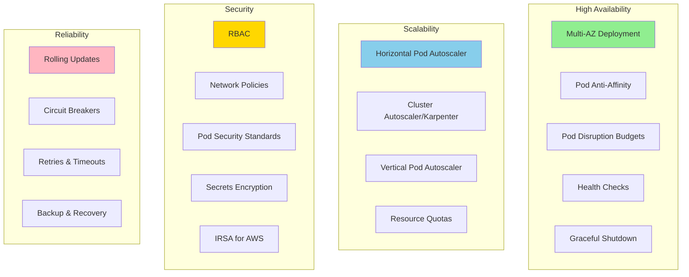
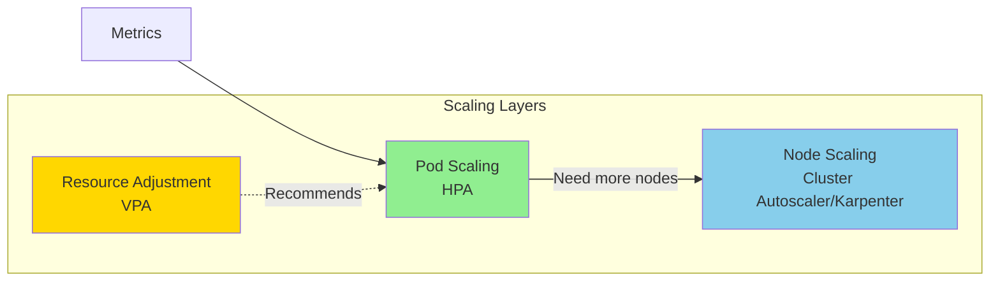
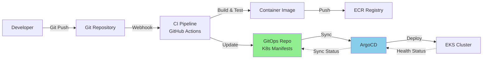
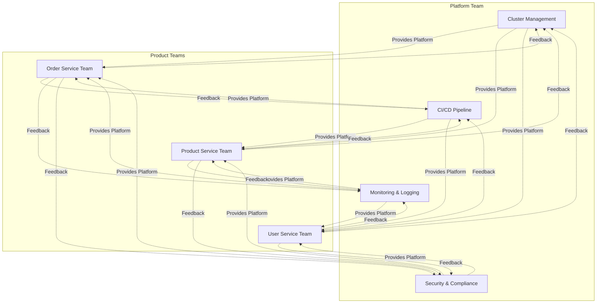

# Kubernetes Production Best Practices

## Architecture Decisions



## Deployment Patterns

### 1. Multi-AZ High Availability

```yaml
# Use topology spread constraints
apiVersion: apps/v1
kind: Deployment
metadata:
  name: order-service
spec:
  replicas: 6  # 2 per AZ

  template:
    spec:
      # Distribute across AZs
      topologySpreadConstraints:
      - maxSkew: 1
        topologyKey: topology.kubernetes.io/zone
        whenUnsatisfiable: DoNotSchedule
        labelSelector:
          matchLabels:
            app: order-service

      # Anti-affinity to avoid same node
      affinity:
        podAntiAffinity:
          preferredDuringSchedulingIgnoredDuringExecution:
          - weight: 100
            podAffinityTerm:
              labelSelector:
                matchExpressions:
                - key: app
                  operator: In
                  values:
                  - order-service
              topologyKey: kubernetes.io/hostname

      # Node affinity for specific instance types
      nodeAffinity:
        requiredDuringSchedulingIgnoredDuringExecution:
          nodeSelectorTerms:
          - matchExpressions:
            - key: node.kubernetes.io/instance-type
              operator: In
              values:
              - m5.xlarge
              - m5.2xlarge
```

### 2. Zero-Downtime Deployments

```yaml
apiVersion: apps/v1
kind: Deployment
metadata:
  name: order-service
spec:
  # Rolling update strategy
  strategy:
    type: RollingUpdate
    rollingUpdate:
      maxSurge: 1        # Create 1 extra pod during update
      maxUnavailable: 0  # Never have less than desired replicas

  # Wait before considering pod ready
  minReadySeconds: 10

  template:
    spec:
      containers:
      - name: order-service
        image: order-service:v2.0.0

        # Readiness probe - pod receives traffic only when ready
        readinessProbe:
          httpGet:
            path: /actuator/health/readiness
            port: 8080
          initialDelaySeconds: 30
          periodSeconds: 5
          timeoutSeconds: 3
          failureThreshold: 2
          successThreshold: 1

        # Liveness probe - restart unhealthy pods
        livenessProbe:
          httpGet:
            path: /actuator/health/liveness
            port: 8080
          initialDelaySeconds: 60
          periodSeconds: 10
          timeoutSeconds: 5
          failureThreshold: 3

        # Graceful shutdown
        lifecycle:
          preStop:
            exec:
              command:
              - /bin/sh
              - -c
              - |
                # Stop accepting new requests
                # Wait for in-flight requests to complete
                sleep 15

      terminationGracePeriodSeconds: 30

---
# Pod Disruption Budget
apiVersion: policy/v1
kind: PodDisruptionBudget
metadata:
  name: order-service-pdb
spec:
  minAvailable: 2  # Always keep at least 2 pods running
  selector:
    matchLabels:
      app: order-service
```

### 3. Resource Management

```yaml
apiVersion: apps/v1
kind: Deployment
metadata:
  name: order-service
spec:
  template:
    spec:
      containers:
      - name: order-service
        image: order-service:latest

        # ALWAYS set requests and limits
        resources:
          # Requests: Guaranteed resources (used for scheduling)
          requests:
            memory: "512Mi"
            cpu: "500m"      # 0.5 CPU cores
          # Limits: Maximum resources
          limits:
            memory: "1Gi"    # Killed if exceeded (OOM)
            cpu: "1000m"     # Throttled if exceeded

---
# Resource Quota per namespace
apiVersion: v1
kind: ResourceQuota
metadata:
  name: ecommerce-quota
  namespace: ecommerce-prod
spec:
  hard:
    requests.cpu: "50"
    requests.memory: 100Gi
    limits.cpu: "100"
    limits.memory: 200Gi
    persistentvolumeclaims: "10"
    services.loadbalancers: "3"

---
# Limit Range - default and constraints
apiVersion: v1
kind: LimitRange
metadata:
  name: ecommerce-limits
  namespace: ecommerce-prod
spec:
  limits:
  # Container limits
  - type: Container
    default:  # Default limits
      cpu: "1000m"
      memory: "1Gi"
    defaultRequest:  # Default requests
      cpu: "100m"
      memory: "128Mi"
    max:  # Maximum allowed
      cpu: "4000m"
      memory: "8Gi"
    min:  # Minimum required
      cpu: "50m"
      memory: "64Mi"

  # Pod limits
  - type: Pod
    max:
      cpu: "8000m"
      memory: "16Gi"

  # PVC limits
  - type: PersistentVolumeClaim
    max:
      storage: 1Ti
    min:
      storage: 1Gi
```

### 4. Auto-Scaling Strategy



```yaml
# Horizontal Pod Autoscaler
apiVersion: autoscaling/v2
kind: HorizontalPodAutoscaler
metadata:
  name: order-service-hpa
  namespace: ecommerce-prod
spec:
  scaleTargetRef:
    apiVersion: apps/v1
    kind: Deployment
    name: order-service

  minReplicas: 3
  maxReplicas: 20

  metrics:
  # CPU-based scaling
  - type: Resource
    resource:
      name: cpu
      target:
        type: Utilization
        averageUtilization: 70

  # Memory-based scaling
  - type: Resource
    resource:
      name: memory
      target:
        type: Utilization
        averageUtilization: 80

  # Custom metrics (from Prometheus)
  - type: Pods
    pods:
      metric:
        name: http_requests_per_second
      target:
        type: AverageValue
        averageValue: "1000"

  # Scale-down behavior
  behavior:
    scaleDown:
      stabilizationWindowSeconds: 300  # Wait 5 min before scaling down
      policies:
      - type: Percent
        value: 50  # Max 50% reduction per period
        periodSeconds: 60
      - type: Pods
        value: 2   # Max 2 pods per period
        periodSeconds: 60
      selectPolicy: Min  # Use most conservative

    # Scale-up behavior
    scaleUp:
      stabilizationWindowSeconds: 0  # Scale up immediately
      policies:
      - type: Percent
        value: 100  # Double the pods
        periodSeconds: 15
      - type: Pods
        value: 4    # Or add 4 pods
        periodSeconds: 15
      selectPolicy: Max  # Use most aggressive

---
# Vertical Pod Autoscaler (recommendations)
apiVersion: autoscaling.k8s.io/v1
kind: VerticalPodAutoscaler
metadata:
  name: order-service-vpa
  namespace: ecommerce-prod
spec:
  targetRef:
    apiVersion: apps/v1
    kind: Deployment
    name: order-service

  updatePolicy:
    updateMode: "Off"  # Only recommend, don't auto-update (use "Auto" for auto-update)

  resourcePolicy:
    containerPolicies:
    - containerName: order-service
      minAllowed:
        cpu: 100m
        memory: 128Mi
      maxAllowed:
        cpu: 4000m
        memory: 8Gi
```

## Security Best Practices

### 1. RBAC (Role-Based Access Control)

```yaml
# Service Account
apiVersion: v1
kind: ServiceAccount
metadata:
  name: order-service-sa
  namespace: ecommerce-prod
  annotations:
    eks.amazonaws.com/role-arn: arn:aws:iam::123456789012:role/OrderServiceRole

---
# Role (namespace-scoped)
apiVersion: rbac.authorization.k8s.io/v1
kind: Role
metadata:
  name: order-service-role
  namespace: ecommerce-prod
rules:
# Read secrets
- apiGroups: [""]
  resources: ["secrets"]
  resourceNames: ["order-service-secrets", "postgres-secrets"]
  verbs: ["get"]

# Read configmaps
- apiGroups: [""]
  resources: ["configmaps"]
  verbs: ["get", "list"]

# No write access to prevent privilege escalation
- apiGroups: [""]
  resources: ["pods", "services"]
  verbs: ["get", "list"]

---
# RoleBinding
apiVersion: rbac.authorization.k8s.io/v1
kind: RoleBinding
metadata:
  name: order-service-binding
  namespace: ecommerce-prod
subjects:
- kind: ServiceAccount
  name: order-service-sa
  namespace: ecommerce-prod
roleRef:
  kind: Role
  name: order-service-role
  apiGroup: rbac.authorization.k8s.io

---
# ClusterRole (cluster-wide, use sparingly)
apiVersion: rbac.authorization.k8s.io/v1
kind: ClusterRole
metadata:
  name: cluster-viewer
rules:
- apiGroups: [""]
  resources: ["namespaces", "nodes"]
  verbs: ["get", "list"]

---
# Deny direct secret access for users
apiVersion: rbac.authorization.k8s.io/v1
kind: Role
metadata:
  name: deny-secrets
  namespace: ecommerce-prod
rules:
- apiGroups: [""]
  resources: ["secrets"]
  verbs: []  # No permissions
```

### 2. Pod Security Standards

```yaml
# Enforce Pod Security Standards at namespace level
apiVersion: v1
kind: Namespace
metadata:
  name: ecommerce-prod
  labels:
    pod-security.kubernetes.io/enforce: restricted
    pod-security.kubernetes.io/audit: restricted
    pod-security.kubernetes.io/warn: restricted

---
# Secure Pod Template
apiVersion: v1
kind: Pod
metadata:
  name: secure-pod
spec:
  # Security Context at pod level
  securityContext:
    runAsNonRoot: true
    runAsUser: 1000
    runAsGroup: 3000
    fsGroup: 2000
    seccompProfile:
      type: RuntimeDefault

  containers:
  - name: app
    image: app:latest

    # Security Context at container level
    securityContext:
      allowPrivilegeEscalation: false
      readOnlyRootFilesystem: true
      runAsNonRoot: true
      runAsUser: 1000
      capabilities:
        drop:
        - ALL
        # Only add if absolutely necessary
        # add:
        # - NET_BIND_SERVICE

    # Use tmpfs for writable paths
    volumeMounts:
    - name: tmp
      mountPath: /tmp
    - name: cache
      mountPath: /app/cache

  volumes:
  - name: tmp
    emptyDir: {}
  - name: cache
    emptyDir: {}
```

### 3. Network Policies (Zero Trust)

```yaml
# Default deny all traffic
apiVersion: networking.k8s.io/v1
kind: NetworkPolicy
metadata:
  name: default-deny-all
  namespace: ecommerce-prod
spec:
  podSelector: {}
  policyTypes:
  - Ingress
  - Egress

---
# Allow specific ingress
apiVersion: networking.k8s.io/v1
kind: NetworkPolicy
metadata:
  name: order-service-ingress
  namespace: ecommerce-prod
spec:
  podSelector:
    matchLabels:
      app: order-service
  policyTypes:
  - Ingress
  ingress:
  # From API gateway only
  - from:
    - podSelector:
        matchLabels:
          app: api-gateway
    ports:
    - protocol: TCP
      port: 8080

  # From Prometheus (monitoring namespace)
  - from:
    - namespaceSelector:
        matchLabels:
          name: monitoring
      podSelector:
        matchLabels:
          app: prometheus
    ports:
    - protocol: TCP
      port: 9090

---
# Allow specific egress
apiVersion: networking.k8s.io/v1
kind: NetworkPolicy
metadata:
  name: order-service-egress
  namespace: ecommerce-prod
spec:
  podSelector:
    matchLabels:
      app: order-service
  policyTypes:
  - Egress
  egress:
  # DNS
  - to:
    - namespaceSelector:
        matchLabels:
          name: kube-system
    ports:
    - protocol: UDP
      port: 53

  # Postgres
  - to:
    - podSelector:
        matchLabels:
          app: postgres
    ports:
    - protocol: TCP
      port: 5432

  # External HTTPS (for APIs)
  - to:
    - namespaceSelector: {}
    ports:
    - protocol: TCP
      port: 443

  # AWS services (via VPC endpoints)
  - to:
    - ipBlock:
        cidr: 10.0.0.0/8  # VPC CIDR
    ports:
    - protocol: TCP
      port: 443
```

## Reliability Patterns

### 1. Health Checks

```yaml
apiVersion: v1
kind: Pod
metadata:
  name: reliable-pod
spec:
  containers:
  - name: app
    image: app:latest

    # Startup probe (for slow-starting apps)
    # Delays liveness/readiness checks
    startupProbe:
      httpGet:
        path: /actuator/health/startup
        port: 8080
      initialDelaySeconds: 0
      periodSeconds: 10
      failureThreshold: 30  # 30 * 10s = 5 minutes max startup

    # Liveness probe (restart if fails)
    livenessProbe:
      httpGet:
        path: /actuator/health/liveness
        port: 8080
      initialDelaySeconds: 60
      periodSeconds: 10
      timeoutSeconds: 5
      failureThreshold: 3   # Restart after 3 failures
      successThreshold: 1

    # Readiness probe (remove from service if fails)
    readinessProbe:
      httpGet:
        path: /actuator/health/readiness
        port: 8080
        httpHeaders:
        - name: Custom-Header
          value: HealthCheck
      initialDelaySeconds: 30
      periodSeconds: 5
      timeoutSeconds: 3
      failureThreshold: 2   # Remove after 2 failures
      successThreshold: 1   # Add back after 1 success

    # Alternative: Exec probe
    # livenessProbe:
    #   exec:
    #     command:
    #     - cat
    #     - /tmp/healthy

    # Alternative: TCP probe
    # livenessProbe:
    #   tcpSocket:
    #     port: 8080
```

### 2. Graceful Shutdown

```yaml
apiVersion: apps/v1
kind: Deployment
metadata:
  name: order-service
spec:
  template:
    spec:
      containers:
      - name: order-service
        image: order-service:latest

        lifecycle:
          preStop:
            exec:
              command:
              - /bin/sh
              - -c
              - |
                # 1. Stop accepting new requests
                echo "Shutting down gracefully..."

                # 2. Wait for in-flight requests (adjust based on your p99 latency)
                sleep 15

                # 3. Application cleanup (optional)
                # curl -X POST localhost:8080/actuator/shutdown

      # Total time before SIGKILL
      terminationGracePeriodSeconds: 30
```

### 3. Circuit Breakers & Retries (Application Level)

```java
// Spring Boot with Resilience4j
@Configuration
public class ResilienceConfig {

    @Bean
    public CircuitBreakerConfig circuitBreakerConfig() {
        return CircuitBreakerConfig.custom()
            .failureRateThreshold(50)                    // Open if 50% failure
            .waitDurationInOpenState(Duration.ofSeconds(30))  // Wait 30s before retry
            .slidingWindowSize(100)                      // Based on last 100 calls
            .minimumNumberOfCalls(10)                    // Need 10 calls before calculation
            .build();
    }

    @Bean
    public RetryConfig retryConfig() {
        return RetryConfig.custom()
            .maxAttempts(3)
            .waitDuration(Duration.ofMillis(500))
            .retryExceptions(TimeoutException.class, IOException.class)
            .build();
    }

    @Bean
    public TimeLimiterConfig timeLimiterConfig() {
        return TimeLimiterConfig.custom()
            .timeoutDuration(Duration.ofSeconds(2))
            .build();
    }
}

@Service
public class PaymentService {

    @CircuitBreaker(name = "payment", fallbackMethod = "paymentFallback")
    @Retry(name = "payment")
    @TimeLimiter(name = "payment")
    public CompletableFuture<PaymentResponse> processPayment(PaymentRequest request) {
        return CompletableFuture.supplyAsync(() ->
            restTemplate.postForObject("http://payment-service/process", request, PaymentResponse.class)
        );
    }

    public CompletableFuture<PaymentResponse> paymentFallback(PaymentRequest request, Exception e) {
        // Fallback logic
        return CompletableFuture.completedFuture(new PaymentResponse("QUEUED"));
    }
}
```

## Operational Excellence

### 1. Observability

```yaml
# Three pillars: Metrics, Logs, Traces
apiVersion: apps/v1
kind: Deployment
metadata:
  name: observable-service
spec:
  template:
    metadata:
      annotations:
        # Prometheus scraping
        prometheus.io/scrape: "true"
        prometheus.io/port: "9090"
        prometheus.io/path: "/actuator/prometheus"
    spec:
      containers:
      - name: app
        image: app:latest

        env:
        # Structured JSON logging
        - name: LOG_FORMAT
          value: json

        # Distributed tracing
        - name: AWS_XRAY_DAEMON_ADDRESS
          value: "xray-daemon.amazon-cloudwatch:2000"
        - name: OTEL_EXPORTER_OTLP_ENDPOINT
          value: "http://tempo.monitoring:4317"

        # Metrics
        - name: MANAGEMENT_METRICS_EXPORT_PROMETHEUS_ENABLED
          value: "true"

        ports:
        - containerPort: 8080
          name: http
        - containerPort: 9090
          name: metrics
```

### 2. GitOps Workflow



### 3. Backup & Disaster Recovery

```yaml
# Velero for cluster backups
apiVersion: velero.io/v1
kind: Schedule
metadata:
  name: daily-backup
  namespace: velero
spec:
  schedule: "0 2 * * *"  # Daily at 2 AM
  template:
    includedNamespaces:
    - ecommerce-prod
    includedResources:
    - '*'
    excludedResources:
    - events
    - events.events.k8s.io
    storageLocation: default
    volumeSnapshotLocations:
    - default
    ttl: 720h  # 30 days

---
# Volume snapshots
apiVersion: snapshot.storage.k8s.io/v1
kind: VolumeSnapshotClass
metadata:
  name: ebs-snapshot-class
driver: ebs.csi.aws.com
deletionPolicy: Retain
parameters:
  tags: "Environment=prod,Backup=true"

---
# CronJob for database backups
apiVersion: batch/v1
kind: CronJob
metadata:
  name: postgres-backup
  namespace: ecommerce-prod
spec:
  schedule: "0 */6 * * *"  # Every 6 hours
  successfulJobsHistoryLimit: 3
  failedJobsHistoryLimit: 1
  jobTemplate:
    spec:
      template:
        spec:
          serviceAccountName: backup-sa
          containers:
          - name: backup
            image: postgres:14
            command:
            - /bin/sh
            - -c
            - |
              TIMESTAMP=$(date +%Y%m%d-%H%M%S)
              pg_dump -h postgres -U orderuser orders | gzip > /tmp/backup-${TIMESTAMP}.sql.gz
              aws s3 cp /tmp/backup-${TIMESTAMP}.sql.gz s3://my-backups/postgres/${TIMESTAMP}.sql.gz
              # Cleanup old backups (keep 30 days)
              aws s3 ls s3://my-backups/postgres/ | \
                awk '{print $4}' | \
                head -n -30 | \
                xargs -I {} aws s3 rm s3://my-backups/postgres/{}
            env:
            - name: PGPASSWORD
              valueFrom:
                secretKeyRef:
                  name: postgres-secrets
                  key: password
            - name: AWS_REGION
              value: us-east-1
          restartPolicy: OnFailure
```

## Cost Optimization

### 1. Right-Sizing

```yaml
# Use VPA to get recommendations
apiVersion: autoscaling.k8s.io/v1
kind: VerticalPodAutoscaler
metadata:
  name: order-service-vpa
spec:
  targetRef:
    apiVersion: apps/v1
    kind: Deployment
    name: order-service
  updatePolicy:
    updateMode: "Off"  # Get recommendations without auto-update

# Check recommendations:
# kubectl describe vpa order-service-vpa
```

### 2. Cluster Autoscaling with Karpenter

```yaml
apiVersion: karpenter.sh/v1alpha5
kind: Provisioner
metadata:
  name: default
spec:
  # Requirements for nodes
  requirements:
  - key: karpenter.sh/capacity-type
    operator: In
    values: ["spot", "on-demand"]  # Use spot for cost savings
  - key: node.kubernetes.io/instance-type
    operator: In
    values: ["m5.large", "m5.xlarge", "m5.2xlarge"]
  - key: topology.kubernetes.io/zone
    operator: In
    values: ["us-east-1a", "us-east-1b", "us-east-1c"]

  # Limits
  limits:
    resources:
      cpu: 1000
      memory: 1000Gi

  # Consolidation (bin packing)
  consolidation:
    enabled: true

  # TTL for empty nodes
  ttlSecondsAfterEmpty: 30

  # Provider-specific config
  providerRef:
    name: default

---
apiVersion: karpenter.k8s.aws/v1alpha1
kind: AWSNodeTemplate
metadata:
  name: default
spec:
  subnetSelector:
    karpenter.sh/discovery: prod-eks-cluster
  securityGroupSelector:
    karpenter.sh/discovery: prod-eks-cluster
  instanceProfile: KarpenterNodeInstanceProfile
  amiFamily: AL2
  tags:
    Environment: production
    ManagedBy: karpenter
```

### 3. Resource Quotas by Team

```yaml
apiVersion: v1
kind: ResourceQuota
metadata:
  name: team-quota
  namespace: ecommerce-prod
spec:
  hard:
    requests.cpu: "50"
    requests.memory: 100Gi
    limits.cpu: "100"
    limits.memory: 200Gi
    persistentvolumeclaims: "10"
    services.loadbalancers: "2"
  scopeSelector:
    matchExpressions:
    - operator: In
      scopeName: PriorityClass
      values: ["high"]
```

## Checklist for Production

### Pre-Deployment

- [ ] All images scanned for vulnerabilities (Trivy, Snyk)
- [ ] Resource requests and limits set
- [ ] Health checks configured (liveness, readiness)
- [ ] Pod disruption budgets defined
- [ ] Network policies enforced
- [ ] Secrets encrypted (KMS, External Secrets)
- [ ] RBAC roles configured (least privilege)
- [ ] Multi-AZ deployment configured
- [ ] HPA and cluster autoscaling enabled
- [ ] Monitoring and alerting set up
- [ ] Backup strategy implemented
- [ ] GitOps workflow established

### Post-Deployment

- [ ] Verify all pods running across AZs
- [ ] Test failover scenarios
- [ ] Validate autoscaling triggers
- [ ] Verify metrics collection
- [ ] Test log aggregation
- [ ] Perform load testing
- [ ] Document runbooks
- [ ] Train on-call team
- [ ] Set up dashboards
- [ ] Review cost allocation

## Common Pitfalls to Avoid

| Pitfall | Impact | Solution |
|---------|--------|----------|
| No resource limits | Node instability, OOM kills | Always set requests & limits |
| Missing health checks | Failed pods receive traffic | Configure liveness & readiness |
| No PDB | All pods terminated during updates | Set minAvailable or maxUnavailable |
| Secrets in Git | Security breach | Use External Secrets or Sealed Secrets |
| Single AZ | Availability zone failure = outage | Multi-AZ with topology spread |
| No monitoring | Can't diagnose issues | Prometheus + Grafana + alerts |
| maxUnavailable: 1 with replicas: 2 | Can go to 50% capacity | Set maxUnavailable: 0 |
| Missing graceful shutdown | Requests fail during rollout | Configure preStop hook |
| No network policies | Unrestricted pod communication | Default deny + explicit allows |
| Excessive logging | High costs | Structured logging + filtering |

## Senior Engineering Manager Considerations

### Team Structure



### Decision Matrix

| Decision | Factors to Consider | Recommendation |
|----------|---------------------|----------------|
| **Cluster Strategy** | Team size, blast radius, cost | Multi-cluster for prod/non-prod, single cluster for small teams |
| **Service Mesh** | Complexity, observability needs | Start without, add when needed (traffic splitting, mTLS) |
| **GitOps** | Change management, auditability | Always use for production |
| **Monitoring** | Budget, expertise | Prometheus stack (free) or CloudWatch (managed) |
| **Secrets** | Security requirements | External Secrets Operator + AWS Secrets Manager |
| **Node Scaling** | Cost optimization | Karpenter > Cluster Autoscaler for flexibility |
| **Ingress** | Traffic patterns | ALB for HTTP(S), NLB for TCP/UDP |

This completes the comprehensive Kubernetes guide!
