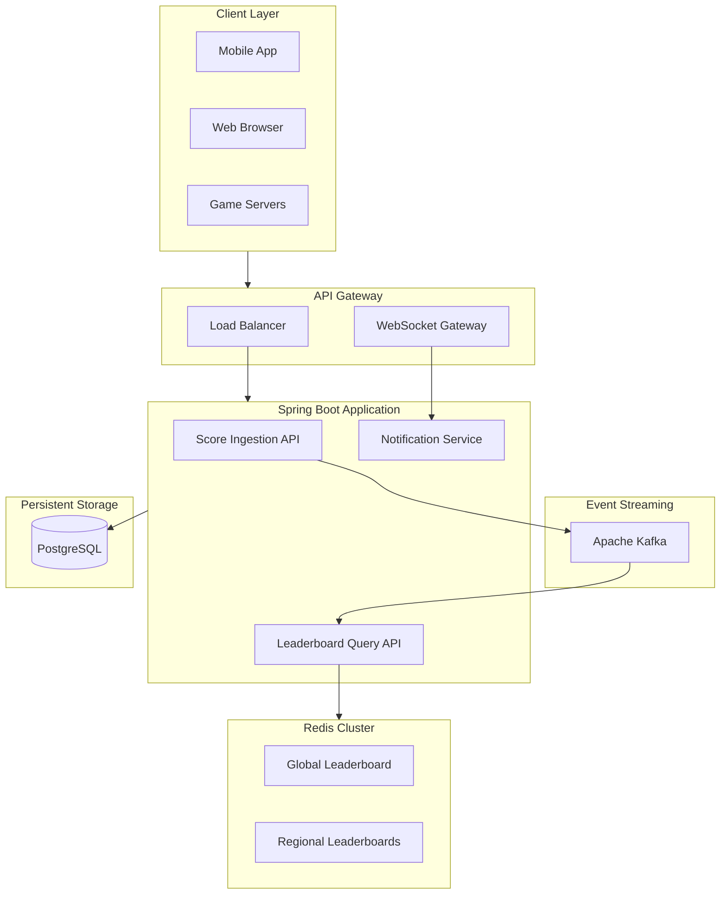

# Real-Time Leaderboard System

A production-grade real-time leaderboard system for online gaming platforms, supporting **100 million users** and **50 million DAU** with global, regional, and friend circle rankings.

## Features

- **Real-Time Rankings**: O(log N) operations using Redis Sorted Sets
- **Multiple Scopes**: Global, regional, and friend circle leaderboards
- **Time Windows**: Daily, weekly, monthly, rolling hours, and all-time
- **Push Notifications**: WebSocket-based real-time rank updates
- **Historical Data**: Periodic snapshots with PostgreSQL persistence
- **High Availability**: Circuit breakers, retries, and graceful degradation
- **Full Observability**: Prometheus metrics, health checks, distributed tracing

## Architecture



## Quick Start

### Prerequisites

- Java 21+
- Maven 3.9+
- Docker & Docker Compose

---

## Step-by-Step Demo Guide

Follow these steps to run a complete demo of the leaderboard system:

### Step 1: Start Infrastructure

```bash
cd leaderboard

# Start Redis, Kafka, Zookeeper, and PostgreSQL
docker-compose up -d redis zookeeper kafka postgres

# Verify all services are running
docker-compose ps

# Expected output:
# NAME                STATUS
# leaderboard-redis   Up (healthy)
# leaderboard-kafka   Up (healthy)
# leaderboard-postgres Up (healthy)
# leaderboard-zookeeper Up
```

**Wait for Kafka to be ready (~30 seconds)**:
```bash
# Check Kafka is ready
docker-compose logs kafka | grep "started"
```

### Step 2: Start the Application

**Option A: Run with Maven (Recommended for development)**
```bash
./mvnw spring-boot:run
```

**Option B: Run with Docker**
```bash
docker-compose --profile app up -d leaderboard
docker-compose logs -f leaderboard
```

### Step 3: Verify Application is Running

```bash
# Health check
curl http://localhost:8080/health
# Expected: {"status":"ok","timestamp":"..."}

# Readiness check
curl http://localhost:8080/ready
# Expected: {"status":"ready","components":{"redis":{"status":"healthy"...}}}
```

### Step 4: Load Demo Data

```bash
# Make script executable (first time only)
chmod +x ./scripts/demo-data.sh

# Generate 100 sample players + 10 elite players
./scripts/demo-data.sh
```

**Expected output:**
```
╔════════════════════════════════════════════════════════════╗
║       Real-Time Leaderboard - Demo Data Generator          ║
╚════════════════════════════════════════════════════════════╝

✓ Server is healthy
✓ Created 100 players
✓ Submitted 100 initial scores
✓ Created elite player: ProGamer2024 (Score: 50000)
...

╔════╦════════════════════════╦════════════╗
║ #  ║ Player                 ║ Score      ║
╠════╬════════════════════════╬════════════╣
║ 1  ║ ProGamer2024           ║      50000 ║
║ 2  ║ ChampionX              ║      48500 ║
...
```

### Step 5: Try the API Endpoints

```bash
# Get Top 10 Players
curl -s "http://localhost:8080/api/v1/leaderboard/top?scope=GLOBAL&period=DAILY&limit=10" | jq

# Get a Specific Player's Rank
curl -s "http://localhost:8080/api/v1/leaderboard/rank/elite_progamer2024?scope=GLOBAL&period=DAILY" | jq

# Get Surrounding Players (Relative Leaderboard)
curl -s "http://localhost:8080/api/v1/leaderboard/around/player_00050?scope=GLOBAL&period=DAILY&range=5" | jq

# Get Friend Leaderboard
curl -s "http://localhost:8080/api/v1/leaderboard/friends/player_00001?period=DAILY" | jq

# Submit a New Score
curl -X POST "http://localhost:8080/api/v1/scores" \
  -H "Content-Type: application/json" \
  -d '{"playerId":"player_00001","score":5000,"region":"US-EAST","updateMode":"INCREMENT"}'

# Check Updated Rank
curl -s "http://localhost:8080/api/v1/leaderboard/rank/player_00001?scope=GLOBAL&period=DAILY" | jq
```

### Step 6: Simulate Real-Time Gameplay (Optional)

Open a new terminal and run:
```bash
# Simulate 60 seconds of gameplay with score updates every second
./scripts/simulate-gameplay.sh

# Or customize duration
DURATION=120 INTERVAL=0.5 ./scripts/simulate-gameplay.sh
```

### Step 7: View Metrics (Optional)

```bash
# Start monitoring stack
docker-compose --profile monitoring up -d prometheus grafana

# Access Prometheus: http://localhost:9090
# Access Grafana: http://localhost:3000 (admin/admin)

# View raw metrics
curl http://localhost:8080/actuator/prometheus | grep leaderboard
```

### Step 8: Cleanup

```bash
# Stop all services
docker-compose --profile app --profile monitoring down

# Stop and remove volumes (clean slate)
docker-compose down -v
```

---

## Quick Commands Reference

| Action | Command |
|--------|---------|
| Start infrastructure | `docker-compose up -d redis zookeeper kafka postgres` |
| Start app (Maven) | `./mvnw spring-boot:run` |
| Start app (Docker) | `docker-compose --profile app up -d` |
| Load demo data | `./scripts/demo-data.sh` |
| Simulate gameplay | `./scripts/simulate-gameplay.sh` |
| Run load tests | `./scripts/load-test.sh` |
| View logs | `docker-compose logs -f` |
| Stop all | `docker-compose down` |
| Clean everything | `docker-compose down -v` |

---

## Test the API

```bash
# Health check
curl http://localhost:8080/health

# Submit a score
curl -X POST http://localhost:8080/api/v1/scores \
  -H "Content-Type: application/json" \
  -d '{
    "playerId": "player123",
    "score": 1500,
    "gameId": "game456",
    "region": "US-EAST"
  }'

# Get top 10 players
curl "http://localhost:8080/api/v1/leaderboard/top?scope=GLOBAL&period=DAILY&limit=10"

# Get player rank
curl "http://localhost:8080/api/v1/leaderboard/rank/player123?scope=GLOBAL&period=DAILY"

# Get surrounding players
curl "http://localhost:8080/api/v1/leaderboard/around/player123?scope=GLOBAL&period=DAILY&range=5"
```

## API Reference

### Score Submission

```http
POST /api/v1/scores
Content-Type: application/json

{
  "playerId": "player123",
  "score": 1500,
  "gameId": "game456",
  "region": "US-EAST",
  "updateMode": "INCREMENT"
}

Response: 202 Accepted
{
  "eventId": "evt_abc123",
  "status": "QUEUED",
  "receivedAt": "2026-01-12T10:30:00Z"
}
```

### Get Top Players

```http
GET /api/v1/leaderboard/top?scope=GLOBAL&period=DAILY&limit=10

Response: 200 OK
{
  "scope": "GLOBAL",
  "period": "DAILY",
  "entries": [
    {"rank": 1, "playerId": "p1", "playerName": "ProGamer", "score": 50000},
    {"rank": 2, "playerId": "p2", "playerName": "Champion", "score": 48500}
  ],
  "totalPlayers": 5000000
}
```

### Get Player Rank

```http
GET /api/v1/leaderboard/rank/{playerId}?scope=GLOBAL&period=DAILY

Response: 200 OK
{
  "playerId": "player123",
  "rank": 1234567,
  "score": 2500,
  "percentile": 97.5,
  "totalPlayers": 50000000
}
```

### Get Surrounding Players

```http
GET /api/v1/leaderboard/around/{playerId}?scope=GLOBAL&period=DAILY&range=5

Response: 200 OK
{
  "playerId": "player123",
  "playerRank": 1000,
  "entries": [
    {"rank": 995, "playerId": "p1", "score": 2510},
    {"rank": 1000, "playerId": "player123", "score": 2500, "isRequester": true},
    {"rank": 1005, "playerId": "p5", "score": 2492}
  ]
}
```

### Friend Leaderboard

```http
GET /api/v1/leaderboard/friends/{playerId}?period=DAILY&limit=10

Response: 200 OK
{
  "scope": "FRIENDS",
  "period": "DAILY",
  "entries": [...],
  "totalPlayers": 50
}
```

### Historical Leaderboard

```http
GET /api/v1/leaderboard/history/2026-01-10?scope=GLOBAL&period=DAILY

Response: 200 OK
{
  "scope": "GLOBAL",
  "period": "DAILY",
  "periodIdentifier": "2026-01-10",
  "entries": [...]
}
```

## WebSocket Notifications

Connect to `/ws/leaderboard` for real-time updates:

```javascript
const socket = new SockJS('/ws/leaderboard');
const stompClient = Stomp.over(socket);

stompClient.connect({}, function(frame) {
    // Subscribe to global daily leaderboard updates
    stompClient.subscribe('/topic/leaderboard/global/daily', function(message) {
        const update = JSON.parse(message.body);
        console.log('Leaderboard update:', update);
    });

    // Subscribe to player-specific updates
    stompClient.subscribe('/topic/player/player123', function(message) {
        const update = JSON.parse(message.body);
        console.log('Your rank changed:', update);
    });
});
```

## Configuration

### Environment Variables

| Variable | Default | Description |
|----------|---------|-------------|
| `REDIS_HOST` | `localhost` | Redis server host |
| `REDIS_PORT` | `6379` | Redis server port |
| `KAFKA_BOOTSTRAP_SERVERS` | `localhost:9092` | Kafka brokers |
| `DATABASE_URL` | `jdbc:postgresql://localhost:5432/leaderboard` | PostgreSQL URL |
| `SERVER_PORT` | `8080` | Application port |

### application.yml

```yaml
leaderboard:
  key-prefix: lb
  default-top-limit: 10
  max-top-limit: 100
  default-surrounding-range: 5
  max-surrounding-range: 50

  notifications:
    top-n-threshold: 100  # Notify when entering top 100

  snapshot:
    enabled: true
    cron: "0 0 * * * *"  # Every hour
```

## Metrics

Prometheus metrics available at `/actuator/prometheus`:

| Metric | Type | Description |
|--------|------|-------------|
| `leaderboard_score_submissions_total` | Counter | Total score submissions |
| `leaderboard_score_events_processed_total` | Counter | Processed Kafka events |
| `leaderboard_queries_total` | Counter | Leaderboard queries |
| `leaderboard_query_duration_seconds` | Histogram | Query latency |
| `leaderboard_cache_hits_total` | Counter | Cache hits |
| `leaderboard_redis_errors_total` | Counter | Redis errors |
| `leaderboard_websocket_active_connections` | Gauge | Active WebSocket connections |

## Performance

### Capacity Estimates

| Metric | Value |
|--------|-------|
| DAU | 50 million |
| Score updates/day | 1 billion |
| Peak write RPS | ~60K |
| Peak read RPS | ~30K |
| p99 query latency | <50ms |

### Redis Memory

```
100M players × 100 bytes/entry = ~10 GB per leaderboard
7 daily ZSETs = ~70 GB
Regional (5 regions) = ~50 GB
Total: ~125 GB → Redis Cluster with 6+ nodes
```

## Fault Tolerance

- **Circuit Breakers**: Resilience4j for Redis and Kafka
- **Retries**: Exponential backoff for transient failures
- **Graceful Degradation**: Empty responses when unavailable
- **Health Checks**: Liveness and readiness probes

## Demo Scripts

| Script | Description |
|--------|-------------|
| `./scripts/demo-data.sh` | Generate sample players and scores for demo |
| `./scripts/simulate-gameplay.sh` | Continuously generate score updates |
| `./scripts/load-test.sh` | Run load tests with Apache Benchmark |

```bash
# Generate demo data (100 players + 10 elite players)
./scripts/demo-data.sh

# Simulate real-time gameplay (60 seconds of score updates)
DURATION=60 ./scripts/simulate-gameplay.sh

# Run load tests
./scripts/load-test.sh
```

## Documentation

- [Architecture Design](docs/architecture.md)
- [API Reference](docs/api-reference.md)
- [Redis Deep Dive](docs/redis-deep-dive.md) - Detailed analysis of ZSET operations, queries, and replication
- [Scaling Strategy](docs/scaling-strategy.md)
- [Observability Guide](docs/observability.md)

## License

MIT License
