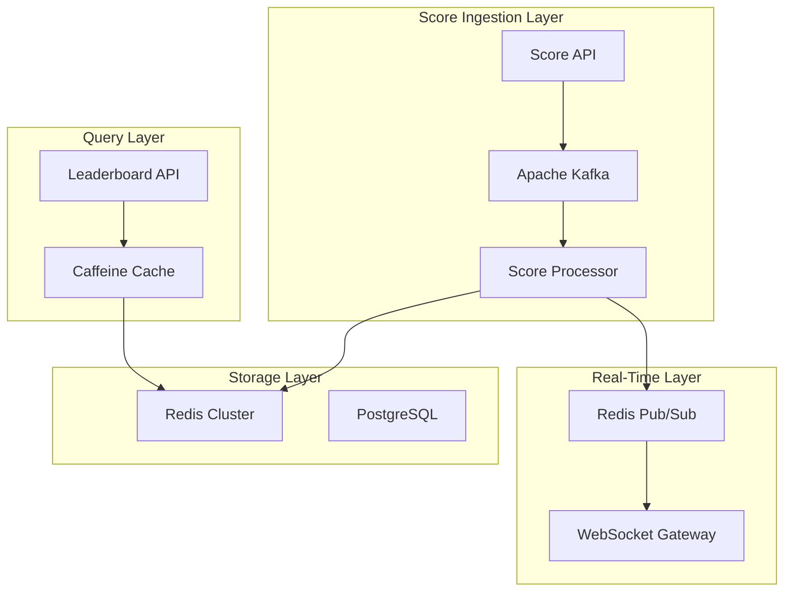
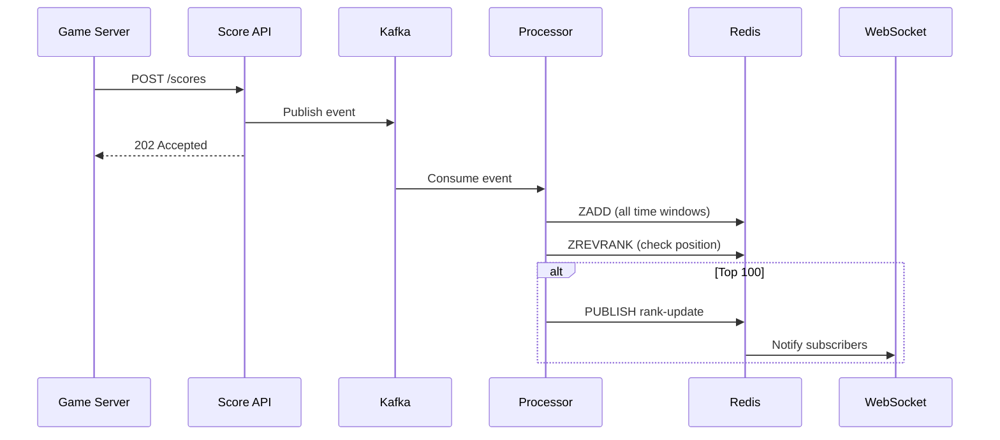
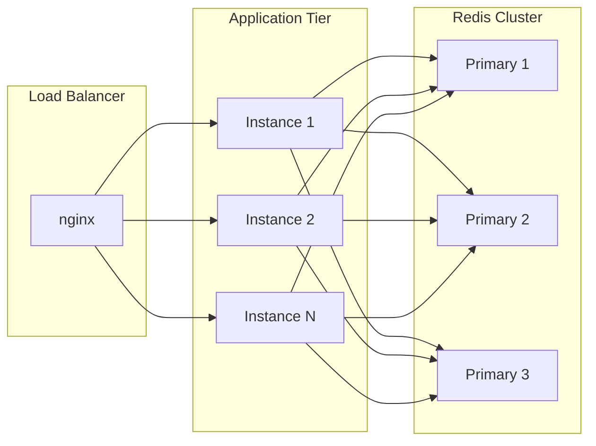

# Leaderboard System Architecture

## Overview

The Real-Time Leaderboard System is designed to handle the demanding requirements of a global gaming platform with 100 million users and 50 million daily active users. The architecture prioritizes low latency, high throughput, and eventual consistency.

## Core Components



## Data Flow

### Score Update Flow

1. **Ingestion**: Game server submits score via REST API
2. **Queuing**: Score event published to Kafka with player ID as partition key
3. **Processing**: Consumer updates Redis sorted sets for all time windows
4. **Notification**: If player enters top N, notification published via Pub/Sub
5. **Delivery**: WebSocket gateway pushes update to subscribed clients



### Query Flow

1. **Request**: Client queries leaderboard API
2. **Cache Check**: Caffeine local cache checked (1s TTL)
3. **Redis Query**: On cache miss, Redis ZREVRANGE executed
4. **Enrichment**: Player profiles batch-fetched from PostgreSQL
5. **Response**: Enriched leaderboard returned to client

## Technology Choices

### Redis Sorted Sets

The core data structure for leaderboard operations. Provides O(log N) complexity for all key operations:

| Operation | Command | Complexity | Use Case |
|-----------|---------|------------|----------|
| Update score | ZADD | O(log N) | Score submission |
| Get rank | ZREVRANK | O(log N) | Player position |
| Top N | ZREVRANGE | O(log N + M) | Leaderboard display |
| Score lookup | ZSCORE | O(1) | Current score |

### Apache Kafka

Chosen for score event streaming because:
- **Durability**: Events persisted to disk with replication
- **Ordering**: Per-partition ordering by player ID
- **Replay**: Ability to replay events for recovery
- **Scalability**: Horizontal scaling via partitions

### PostgreSQL

Used for:
- **Player profiles**: Display names, avatars, regions
- **Historical snapshots**: Archived leaderboard states
- **Friend relationships**: Social graph for friend leaderboards

## Key Design Decisions

### 1. Async Score Processing

Scores are processed asynchronously to achieve:
- Fast acknowledgment to game servers (<5ms)
- Backpressure handling during traffic spikes
- Retry capability for transient failures

### 2. Multi-Key Leaderboard Strategy

Separate Redis keys for each scope and time window:

```
lb:global:daily:2026-01-12
lb:global:weekly:2026-W02
lb:global:monthly:2026-01
lb:regional:US-EAST:daily:2026-01-12
```

Benefits:
- Independent TTL per time window
- Parallel queries across scopes
- Simplified key management

### 3. Local Caching for Top N

Top 10 queries are cached locally with 1-second TTL:
- Reduces Redis load by 90%+ for popular queries
- Sub-millisecond response times
- Acceptable staleness for leaderboard display

### 4. Friend Leaderboard Aggregation

Friend circle leaderboards are computed on-demand by:
1. Fetching friend list from PostgreSQL
2. Batch-querying scores from global leaderboard
3. Sorting and ranking in memory

This approach works because:
- Average friend list size is small (~50)
- Computation is O(N log N) for N friends
- Caching reduces repeated computations

## Scalability

### Horizontal Scaling



### Capacity Planning

| Component | Specification | Rationale |
|-----------|---------------|-----------|
| Redis Cluster | 6+ nodes, 128GB total | 100M users × 100 bytes × multiple windows |
| Kafka | 3 brokers, 6 partitions | ~60K peak RPS with headroom |
| App Servers | 10+ instances | Handle query + processing load |
| PostgreSQL | Primary + replica | Historical data and profiles |

## Fault Tolerance

### Circuit Breakers

Resilience4j circuit breakers protect against cascading failures:

```yaml
resilience4j:
  circuitbreaker:
    instances:
      redis:
        sliding-window-size: 10
        failure-rate-threshold: 50
        wait-duration-in-open-state: 10s
```

### Graceful Degradation

When Redis is unavailable:
- Top N queries return empty results
- Player rank queries throw ServiceUnavailableException
- Score submissions are queued for retry

### Recovery Procedures

1. **Kafka Replay**: Re-process events from last committed offset
2. **Redis Rebuild**: Replay events to rebuild sorted sets
3. **Snapshot Restore**: Load historical snapshot for point-in-time recovery

## Security Considerations

- Rate limiting on score submission endpoints
- Input validation for player IDs and scores
- Authentication for WebSocket connections
- Audit logging for administrative operations

## Monitoring

Key metrics to watch:
- Score ingestion rate and latency
- Kafka consumer lag
- Redis operation latency (p50, p99)
- Cache hit ratio
- WebSocket connection count
- Error rates by component
