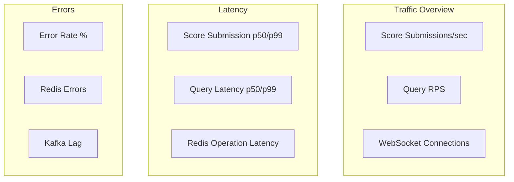
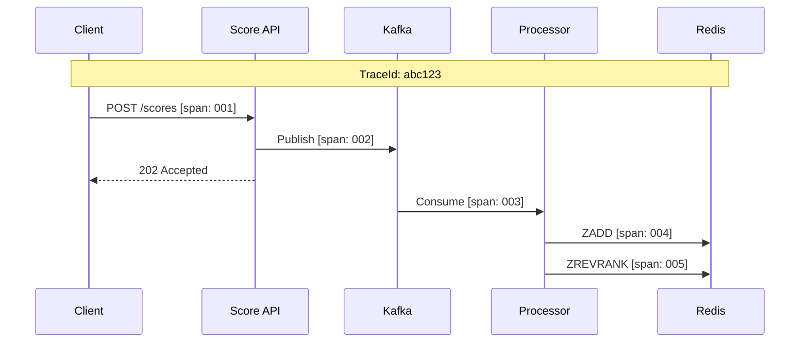

# Observability Guide

## Overview

The Leaderboard System implements comprehensive observability through metrics, logging, and distributed tracing to ensure operational visibility and rapid issue diagnosis.

## Metrics

### Prometheus Endpoints

```
GET /actuator/prometheus
```

### Key Business Metrics

| Metric | Type | Description |
|--------|------|-------------|
| `leaderboard_score_submissions_total` | Counter | Total score submissions received |
| `leaderboard_score_events_published_total` | Counter | Events published to Kafka |
| `leaderboard_score_events_processed_total` | Counter | Events processed from Kafka |
| `leaderboard_queries_total` | Counter | Leaderboard queries executed |
| `leaderboard_notifications_sent_total` | Counter | WebSocket notifications sent |

### Latency Metrics

| Metric | Type | Description |
|--------|------|-------------|
| `leaderboard_score_submission_duration_seconds` | Histogram | Score submission latency |
| `leaderboard_score_processing_duration_seconds` | Histogram | Event processing latency |
| `leaderboard_query_duration_seconds` | Histogram | Query response time |
| `leaderboard_redis_operation_duration_seconds` | Histogram | Redis operation latency |

### Infrastructure Metrics

| Metric | Type | Description |
|--------|------|-------------|
| `leaderboard_cache_hits_total` | Counter | Local cache hits |
| `leaderboard_cache_misses_total` | Counter | Local cache misses |
| `leaderboard_redis_errors_total` | Counter | Redis operation errors |
| `leaderboard_kafka_errors_total` | Counter | Kafka errors |
| `leaderboard_websocket_active_connections` | Gauge | Active WebSocket connections |
| `leaderboard_kafka_consumer_lag` | Gauge | Kafka consumer lag |

### Circuit Breaker Metrics

| Metric | Type | Description |
|--------|------|-------------|
| `leaderboard_redis_circuit_breaker_open_total` | Counter | Times Redis CB opened |
| `leaderboard_kafka_circuit_breaker_open_total` | Counter | Times Kafka CB opened |

## Grafana Dashboards

### Overview Dashboard



### Sample Queries

**Score Submission Rate:**
```promql
rate(leaderboard_score_submissions_total[5m])
```

**Query Latency p99:**
```promql
histogram_quantile(0.99,
  rate(leaderboard_query_duration_seconds_bucket[5m])
)
```

**Cache Hit Ratio:**
```promql
rate(leaderboard_cache_hits_total[5m]) /
(rate(leaderboard_cache_hits_total[5m]) + rate(leaderboard_cache_misses_total[5m]))
```

**Error Rate:**
```promql
rate(leaderboard_redis_errors_total[5m]) + rate(leaderboard_kafka_errors_total[5m])
```

## Alerting Rules

### Critical Alerts

```yaml
groups:
  - name: leaderboard-critical
    rules:
      - alert: HighErrorRate
        expr: |
          (rate(leaderboard_redis_errors_total[5m]) +
           rate(leaderboard_kafka_errors_total[5m])) > 10
        for: 2m
        labels:
          severity: critical
        annotations:
          summary: High error rate in leaderboard service

      - alert: KafkaConsumerLag
        expr: leaderboard_kafka_consumer_lag > 10000
        for: 5m
        labels:
          severity: critical
        annotations:
          summary: Kafka consumer lag is too high

      - alert: CircuitBreakerOpen
        expr: |
          increase(leaderboard_redis_circuit_breaker_open_total[5m]) > 0
        for: 1m
        labels:
          severity: critical
        annotations:
          summary: Redis circuit breaker has opened
```

### Warning Alerts

```yaml
  - name: leaderboard-warning
    rules:
      - alert: HighLatency
        expr: |
          histogram_quantile(0.99,
            rate(leaderboard_query_duration_seconds_bucket[5m])) > 0.1
        for: 5m
        labels:
          severity: warning
        annotations:
          summary: Query latency p99 exceeds 100ms

      - alert: LowCacheHitRatio
        expr: |
          rate(leaderboard_cache_hits_total[5m]) /
          (rate(leaderboard_cache_hits_total[5m]) +
           rate(leaderboard_cache_misses_total[5m])) < 0.8
        for: 10m
        labels:
          severity: warning
        annotations:
          summary: Cache hit ratio below 80%
```

## Logging

### Log Format

```
2026-01-12 10:30:00.123 [http-nio-8080-exec-1] [abc123,def456] INFO  c.l.s.LeaderboardService - Getting top 10 for GLOBAL/DAILY
```

Format: `timestamp [thread] [traceId,spanId] level logger - message`

### Log Levels

| Level | Usage |
|-------|-------|
| ERROR | Exceptions, failures requiring attention |
| WARN | Degraded behavior, retries, circuit breakers |
| INFO | Business events, lifecycle events |
| DEBUG | Detailed flow, request/response data |
| TRACE | Very detailed debugging |

### Structured Logging

```java
log.info("Processed score update",
    kv("playerId", event.getPlayerId()),
    kv("score", event.getScore()),
    kv("rank", result.rank()),
    kv("processingTimeMs", duration));
```

### Log Aggregation

Recommended stack:
- **Fluent Bit**: Log collection
- **Elasticsearch**: Log storage
- **Kibana**: Log analysis

## Distributed Tracing

### Trace Context

All requests include trace context headers:
- `X-B3-TraceId`
- `X-B3-SpanId`
- `X-B3-ParentSpanId`

### Trace Flow Example



### Integration

```yaml
management:
  tracing:
    sampling:
      probability: 0.1  # Sample 10% of requests
```

## Health Checks

### Liveness Probe

```bash
GET /health
```

Returns 200 if the application is running.

### Readiness Probe

```bash
GET /ready
```

Checks:
- Redis connectivity
- Kafka connectivity (via health indicator)
- Database connection pool

### Detailed Info

```bash
GET /info
```

Returns:
- Application version
- Memory usage
- Active connections
- Metrics snapshot

## Runbook

### High Kafka Consumer Lag

**Symptoms:**
- `leaderboard_kafka_consumer_lag` > 10,000
- Score updates delayed

**Investigation:**
1. Check consumer group status: `kafka-consumer-groups.sh --describe`
2. Check for processing errors in logs
3. Verify Redis connectivity

**Remediation:**
1. Scale up consumer instances
2. Check for poison messages
3. Increase partition count if needed

### Redis Circuit Breaker Open

**Symptoms:**
- `leaderboard_redis_circuit_breaker_open_total` increasing
- Queries returning empty results

**Investigation:**
1. Check Redis cluster status
2. Review Redis memory and CPU
3. Check network connectivity

**Remediation:**
1. Verify Redis is healthy
2. Check for memory pressure
3. Review slow log for problematic commands

### High Query Latency

**Symptoms:**
- Query p99 > 100ms
- User complaints about slow leaderboard

**Investigation:**
1. Check cache hit ratio
2. Review Redis operation latency
3. Check database connection pool

**Remediation:**
1. Increase cache TTL if appropriate
2. Scale read replicas
3. Optimize slow queries
