# Redis Sorted Sets Deep Dive

## Overview

This document provides an in-depth analysis of how Redis Sorted Sets (ZSET) are used to implement the real-time leaderboard system, including data structures, query patterns, performance characteristics, and replication strategies.

## Redis Sorted Set Fundamentals

### Data Structure

A Redis Sorted Set is a collection of unique members (strings) where each member is associated with a floating-point score. Internally, Redis implements ZSETs using two data structures:

1. **Skip List**: For ordered operations (range queries, rank lookups)
2. **Hash Table**: For O(1) score lookups by member

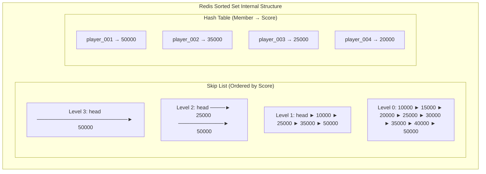

### Why ZSET for Leaderboards?

| Requirement | ZSET Capability | Complexity |
|-------------|-----------------|------------|
| Update score | ZADD/ZINCRBY | O(log N) |
| Get player rank | ZREVRANK | O(log N) |
| Get top N players | ZREVRANGE | O(log N + M) |
| Get player score | ZSCORE | O(1) |
| Count total players | ZCARD | O(1) |
| Range by score | ZRANGEBYSCORE | O(log N + M) |

With 100 million players, O(log N) = O(log 100,000,000) ≈ **27 operations** worst case.

---

## Key Schema Design

### Naming Convention

```
{prefix}:{scope}:{period}:{identifier}

Where:
- prefix: "lb" (configurable)
- scope: global | regional | friends
- period: daily | weekly | monthly | rolling_1h | rolling_24h | all_time
- identifier: date string or region code
```

### Key Examples

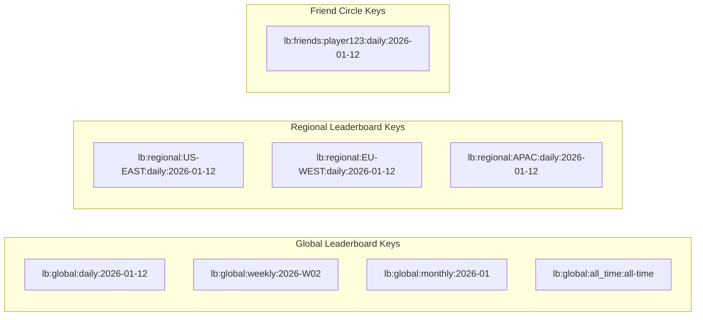

### Key Building Logic

```java
public String buildKey(LeaderboardScope scope, TimeWindow period,
                       Instant timestamp, String region) {
    String periodId = period.getIdentifier(timestamp);

    return switch (scope) {
        case GLOBAL -> String.format("%s:global:%s:%s",
            keyPrefix, period.name().toLowerCase(), periodId);
        case REGIONAL -> String.format("%s:regional:%s:%s:%s",
            keyPrefix, region, period.name().toLowerCase(), periodId);
        case FRIENDS -> String.format("%s:friends:%s:%s:%s",
            keyPrefix, region, period.name().toLowerCase(), periodId);
    };
}
```

---

## Data Storage

### What We Store in Each ZSET

Each ZSET entry contains:

| Field | Storage | Size |
|-------|---------|------|
| Member (playerId) | String | ~20 bytes |
| Score | 64-bit float | 8 bytes |
| Skip list overhead | Pointers | ~40 bytes |
| Hash table overhead | Bucket + pointer | ~32 bytes |
| **Total per entry** | | **~100 bytes** |

### Memory Calculation

```
100 million players × 100 bytes = 10 GB per leaderboard

Time Windows:
- 7 daily ZSETs × 10 GB = 70 GB
- 4 weekly ZSETs × 10 GB = 40 GB
- 12 monthly ZSETs × 10 GB = 120 GB
- 1 all-time ZSET × 10 GB = 10 GB

Regional (5 regions × daily only): 50 GB

Total: ~290 GB → Redis Cluster with sharding
```

### Entry Format

```
ZADD lb:global:daily:2026-01-12 1500 "player_abc123"
     ↑                          ↑     ↑
     Key                       Score  Member (playerId)
```

---

## Query Patterns

### 1. Score Update (Write Path)

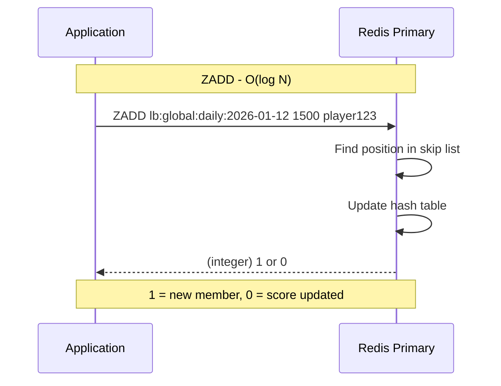

**Three Update Modes:**

```redis
# INCREMENT mode - Add to existing score
ZINCRBY lb:global:daily:2026-01-12 100 "player123"
→ Returns new score: "1600"

# SET mode - Replace score
ZADD lb:global:daily:2026-01-12 2000 "player123"
→ Returns 0 (member existed)

# MAX mode (application logic)
score = ZSCORE lb:global:daily:2026-01-12 "player123"
if new_score > score:
    ZADD lb:global:daily:2026-01-12 new_score "player123"
```

### 2. Get Top N Players (Absolute Leaderboard)

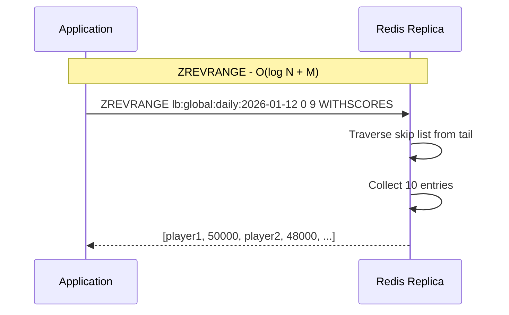

**Query Details:**

```redis
# Get top 10 with scores (highest first)
ZREVRANGE lb:global:daily:2026-01-12 0 9 WITHSCORES

Response:
1) "player_001"    ← Rank 1
2) "50000"         ← Score
3) "player_002"    ← Rank 2
4) "48500"
5) "player_003"
6) "47200"
... (20 elements total: 10 players × 2)
```

### 3. Get Player Rank

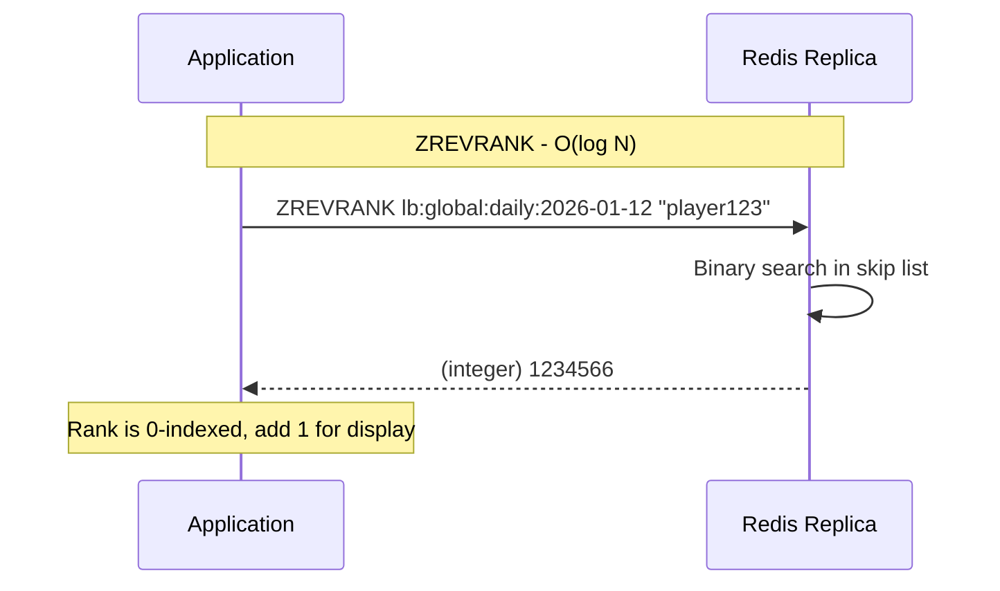

**Query Details:**

```redis
# Get rank (0-indexed, 0 = highest score)
ZREVRANK lb:global:daily:2026-01-12 "player123"
→ (integer) 1234566

# Get score
ZSCORE lb:global:daily:2026-01-12 "player123"
→ "2500"

# Get total players
ZCARD lb:global:daily:2026-01-12
→ (integer) 50000000
```

### 4. Get Surrounding Players (Relative Leaderboard)

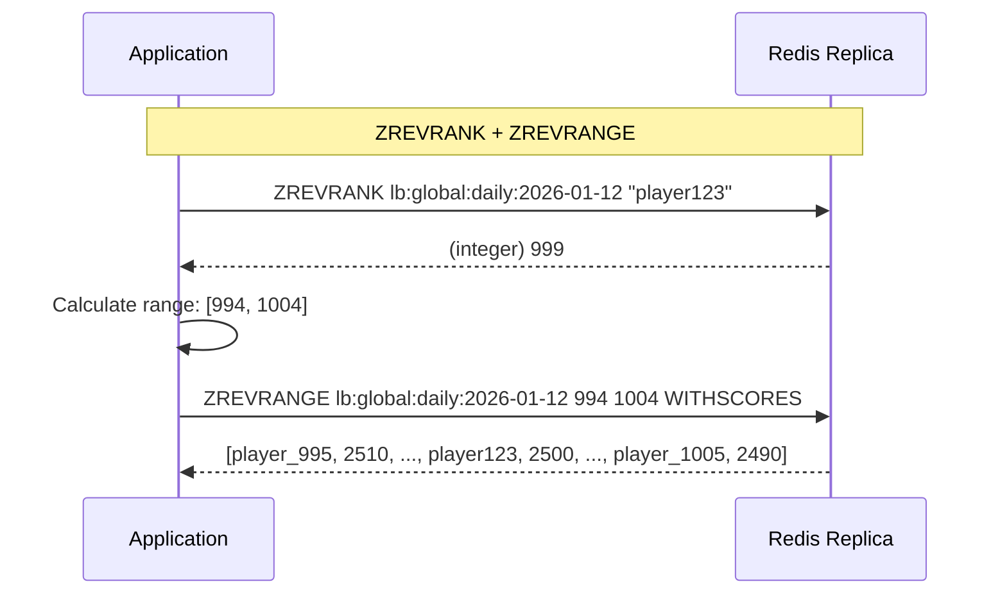

**Query Details:**

```redis
# Step 1: Get player's rank
ZREVRANK lb:global:daily:2026-01-12 "player123"
→ 999

# Step 2: Get range around player (±5 positions)
ZREVRANGE lb:global:daily:2026-01-12 994 1004 WITHSCORES
→ Returns 11 players with scores
```

### 5. Atomic Score Update with Rank Retrieval

For notifications, we need to update score AND get the new rank atomically:

```lua
-- Lua script: update_score_atomic.lua
local key = KEYS[1]
local playerId = ARGV[1]
local score = tonumber(ARGV[2])
local mode = ARGV[3]
local ttl = tonumber(ARGV[4])

-- Get current score
local currentScore = redis.call('ZSCORE', key, playerId)
local newScore = score

-- Apply update mode
if mode == 'INCREMENT' then
    if currentScore then
        newScore = tonumber(currentScore) + score
    end
elseif mode == 'MAX' then
    if currentScore and tonumber(currentScore) >= score then
        newScore = tonumber(currentScore)
    end
end

-- Update score
redis.call('ZADD', key, newScore, playerId)

-- Set TTL if needed
if ttl > 0 then
    redis.call('EXPIRE', key, ttl)
end

-- Get new rank and total
local rank = redis.call('ZREVRANK', key, playerId)
local total = redis.call('ZCARD', key)

return {tostring(newScore), tostring(rank), tostring(total)}
```

**Execution:**

```redis
EVALSHA <sha1> 1 lb:global:daily:2026-01-12 "player123" 500 "INCREMENT" 604800
→ ["2500", "999", "50000000"]
   ↑       ↑      ↑
   Score   Rank   Total
```

---

## Query Flow Diagrams

### Complete Write Path

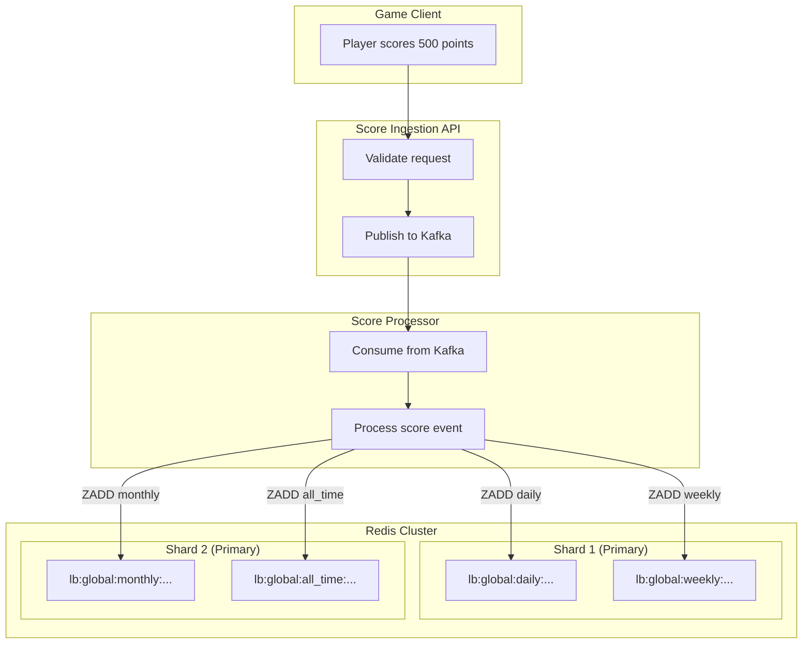

### Complete Read Path

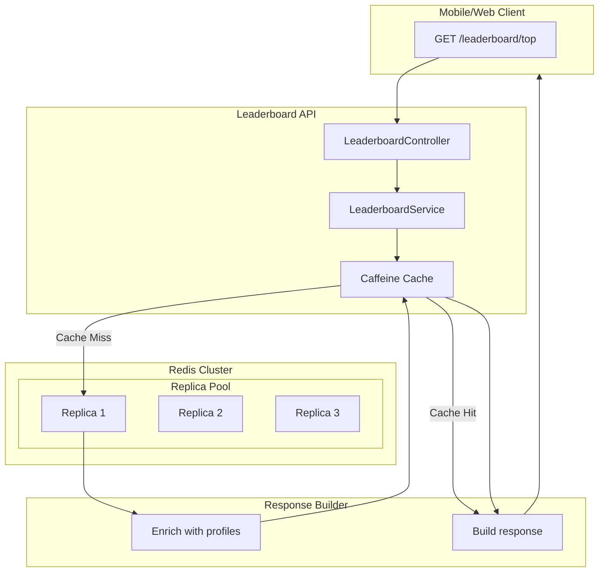

---

## Performance Analysis

### Operation Latency

| Operation | Command | Time Complexity | Expected Latency |
|-----------|---------|-----------------|------------------|
| Update score | ZADD | O(log N) | 0.1-0.5ms |
| Get player rank | ZREVRANK | O(log N) | 0.05-0.2ms |
| Get top 10 | ZREVRANGE 0 9 | O(log N + 10) | 0.1-0.3ms |
| Get surrounding 11 | ZREVRANGE ±5 | O(log N + 11) | 0.1-0.3ms |
| Get score | ZSCORE | O(1) | 0.02-0.1ms |
| Get total count | ZCARD | O(1) | 0.02-0.1ms |
| Lua script (atomic) | EVALSHA | O(log N) | 0.2-0.8ms |

### Latency Breakdown for Top 10 Query

```mermaid
gantt
    title Query Latency Breakdown (p50)
    dateFormat X
    axisFormat %L ms

    section Network
    Client to LB      :0, 2
    LB to App         :2, 3

    section Application
    Parse request     :3, 4
    Cache check       :4, 5

    section Redis
    App to Redis      :5, 6
    ZREVRANGE         :6, 7
    Redis to App      :7, 8

    section Enrichment
    Profile lookup    :8, 12

    section Response
    Build JSON        :12, 13
    App to Client     :13, 15
```

**Total p50: ~15ms** (with cache miss)
**Total p50: ~3ms** (with cache hit)

### Throughput Analysis

**Single Redis Node:**
- Read operations: ~100,000 ops/sec
- Write operations: ~50,000 ops/sec
- Memory bandwidth: ~1 GB/sec

**For 50M DAU (peak load):**
- Write RPS: 60,000 (score updates)
- Read RPS: 30,000 (leaderboard queries)

**Redis Cluster Sizing:**

| Nodes | Write Capacity | Read Capacity | Memory |
|-------|----------------|---------------|--------|
| 3P + 3R | 150K/s | 300K/s | 90 GB |
| 6P + 6R | 300K/s | 600K/s | 180 GB |
| 9P + 9R | 450K/s | 900K/s | 270 GB |

P = Primary, R = Replica

---

## Redis Replication Architecture

### Single Region Cluster

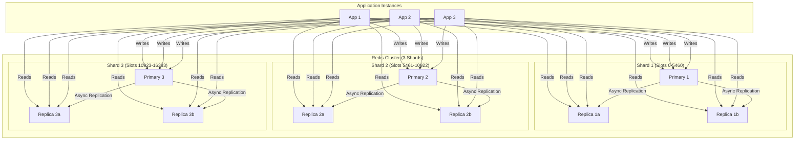

### Hash Slot Distribution

```
Key: lb:global:daily:2026-01-12
CRC16(key) = 12345
Slot = 12345 mod 16384 = 12345
→ Routes to Shard 3 (slots 10923-16383)
```

**Slot Assignment per Key Pattern:**

```redis
# Check slot for a key
CLUSTER KEYSLOT "lb:global:daily:2026-01-12"
→ (integer) 8234

# Keys hash to different shards based on content
lb:global:daily:2026-01-12  → Slot 8234  → Shard 2
lb:global:weekly:2026-W02   → Slot 3421  → Shard 1
lb:global:monthly:2026-01   → Slot 14892 → Shard 3
```

### Read/Write Splitting

```java
@Configuration
public class RedisConfig {

    @Bean
    public LettuceClientConfiguration lettuceConfig() {
        return LettuceClientConfiguration.builder()
            .readFrom(ReadFrom.REPLICA_PREFERRED)  // Read from replicas
            .build();
    }
}
```

**Read Strategies:**

| Strategy | Description | Use Case |
|----------|-------------|----------|
| MASTER | Always read from primary | Strong consistency needed |
| REPLICA_PREFERRED | Prefer replicas, fallback to primary | High read throughput |
| REPLICA | Only read from replicas | Maximum read scaling |
| NEAREST | Read from lowest latency node | Multi-AZ deployments |

### Replication Lag Handling

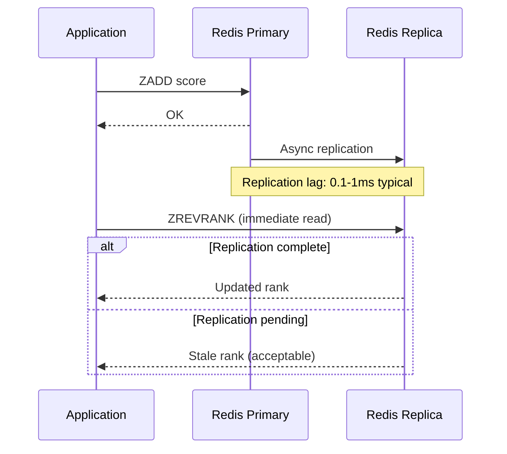

**Mitigation Strategies:**

1. **WAIT command** (for critical reads):
```redis
ZADD lb:global:daily:2026-01-12 1500 player123
WAIT 1 100  # Wait for 1 replica, max 100ms
```

2. **Read-your-writes** (application level):
```java
public ScoreUpdateResult updateScoreAndGetRank(...) {
    // Use Lua script on PRIMARY for atomic operation
    // Avoids replica lag for immediate rank retrieval
    return redisTemplate.execute(script, List.of(key), ...);
}
```

---

## Multi-Region Architecture

### Global Leaderboard Sync

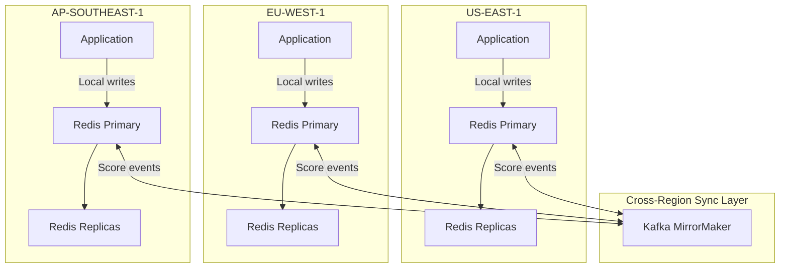

### Sync Strategy Options

**Option 1: Event-Driven Sync (Recommended)**
```
1. US player scores 500 points
2. US app publishes to local Kafka
3. Local consumer updates US Redis
4. MirrorMaker replicates event to EU/APAC Kafka
5. EU/APAC consumers update their Redis
```

**Latency:** 100-500ms cross-region

**Option 2: Redis Enterprise Active-Active**
```
1. Score written to any region
2. CRDT-based conflict resolution
3. Automatic bi-directional sync
```

**Latency:** 50-200ms cross-region

### Conflict Resolution

For leaderboards, conflicts are handled by:

1. **Last-Write-Wins (LWW):** Latest score update wins
2. **Maximum Score:** Keep highest score (for high-score leaderboards)
3. **Sum/Increment:** Aggregate increments (for cumulative scores)

```java
// MAX mode for cross-region sync
if (event.getUpdateMode() == ScoreUpdateMode.MAX) {
    Double currentScore = zSetOps.score(key, playerId);
    if (currentScore == null || event.getScore() > currentScore) {
        zSetOps.add(key, playerId, event.getScore());
    }
}
```

---

## Failure Scenarios and Recovery

### Primary Node Failure

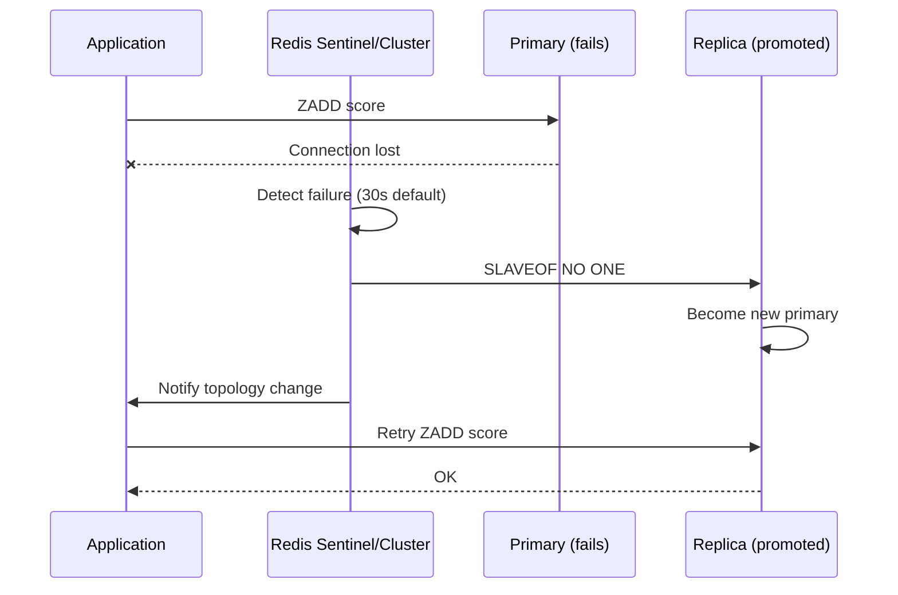

**Failover Timeline:**
- Detection: 5-30 seconds
- Promotion: 1-5 seconds
- Client reconnect: 1-5 seconds
- **Total:** 10-40 seconds

### Data Loss Window

```
Async replication means potential data loss on failover:

Primary → Replica replication: ~1ms typical
Worst case data loss: Last 1-10ms of writes

For leaderboards: Acceptable - score can be recalculated
```

### Recovery Procedures

**Scenario 1: Redis Node Restart**
```bash
# Data loaded from AOF/RDB
# Automatic rejoin to cluster
# Replica sync from primary
```

**Scenario 2: Full Cluster Recovery**
```bash
# 1. Start with RDB snapshot
redis-server --appendonly yes --dbfilename dump.rdb

# 2. Replay Kafka events from offset
# Consumer will catch up from last committed offset
```

**Scenario 3: Rebuild from Kafka**
```java
// Reset consumer offset to beginning
kafkaConsumer.seekToBeginning(partitions);

// Replay all score events
while (true) {
    ConsumerRecords<String, ScoreEvent> records = consumer.poll(Duration.ofSeconds(1));
    for (ConsumerRecord<String, ScoreEvent> record : records) {
        rankingEngine.processScoreUpdate(record.value());
    }
}
```

---

## Optimization Techniques

### 1. Pipelining for Batch Operations

```java
public void batchUpdateScores(List<ScoreEvent> events) {
    redisTemplate.executePipelined((RedisCallback<Object>) connection -> {
        for (ScoreEvent event : events) {
            String key = buildKey(GLOBAL, DAILY, event.getTimestamp(), null);
            connection.zAdd(key.getBytes(), event.getScore(),
                event.getPlayerId().getBytes());
        }
        return null;
    });
}
```

**Improvement:** 10x throughput for batch writes

### 2. Local Caching for Top N

```java
@Cacheable(cacheNames = "leaderboard-top",
           key = "#scope + ':' + #period + ':' + #limit",
           unless = "#result.entries.isEmpty()")
public LeaderboardResponse getTopN(LeaderboardScope scope,
                                   TimeWindow period, int limit) {
    // Only hits Redis on cache miss
    return fetchFromRedis(scope, period, limit);
}
```

**Cache Configuration:**
```yaml
spring:
  cache:
    caffeine:
      spec: maximumSize=1000,expireAfterWrite=1s
```

**Impact:** 90%+ cache hit rate for top 10 queries

### 3. Bloom Filter for Existence Check

Before querying rank for a player:
```java
// Quick check if player might be in leaderboard
if (!bloomFilter.mightContain(playerId)) {
    throw new PlayerNotFoundException(playerId);
}
// Proceed with ZREVRANK
```

### 4. Connection Pooling

```yaml
spring:
  data:
    redis:
      lettuce:
        pool:
          max-active: 50    # Max connections
          max-idle: 20      # Idle connections
          min-idle: 5       # Minimum ready connections
          max-wait: 1000ms  # Wait time for connection
```

---

## Monitoring Redis Performance

### Key Metrics to Watch

```redis
# Memory usage
INFO memory
→ used_memory: 15.2G
→ used_memory_peak: 18.1G
→ mem_fragmentation_ratio: 1.02

# Operations per second
INFO stats
→ instantaneous_ops_per_sec: 45000
→ total_commands_processed: 892341234

# Slow log (commands > 10ms)
SLOWLOG GET 10

# Client connections
INFO clients
→ connected_clients: 234
→ blocked_clients: 0
```

### Prometheus Metrics

```promql
# Operations per second
rate(redis_commands_processed_total[1m])

# Memory usage percentage
redis_memory_used_bytes / redis_memory_max_bytes * 100

# Command latency p99
histogram_quantile(0.99, rate(redis_command_duration_seconds_bucket[5m]))

# Replication lag
redis_connected_slaves_lag_seconds
```

---

## Summary

### Key Takeaways

1. **Redis ZSET is ideal for leaderboards** - O(log N) operations scale to 100M+ entries
2. **Smart key design** enables multi-scope, multi-period leaderboards
3. **Lua scripts** provide atomic score-update-and-rank operations
4. **Read replicas** scale read throughput linearly
5. **Local caching** reduces Redis load by 90%+ for hot queries
6. **Async replication** with Kafka enables eventual consistency across regions

### Performance Summary

| Metric | Value |
|--------|-------|
| Write latency (p99) | <1ms |
| Read latency (p99) | <0.5ms |
| Write throughput (single node) | 50K ops/sec |
| Read throughput (single node) | 100K ops/sec |
| Memory per 1M players | ~100 MB |
| Replication lag | <1ms (same region) |
| Cross-region sync | 100-500ms |
