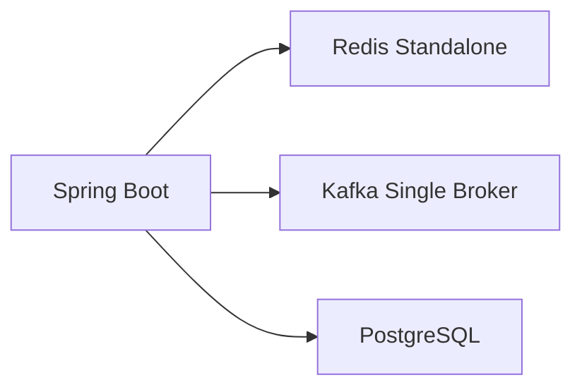
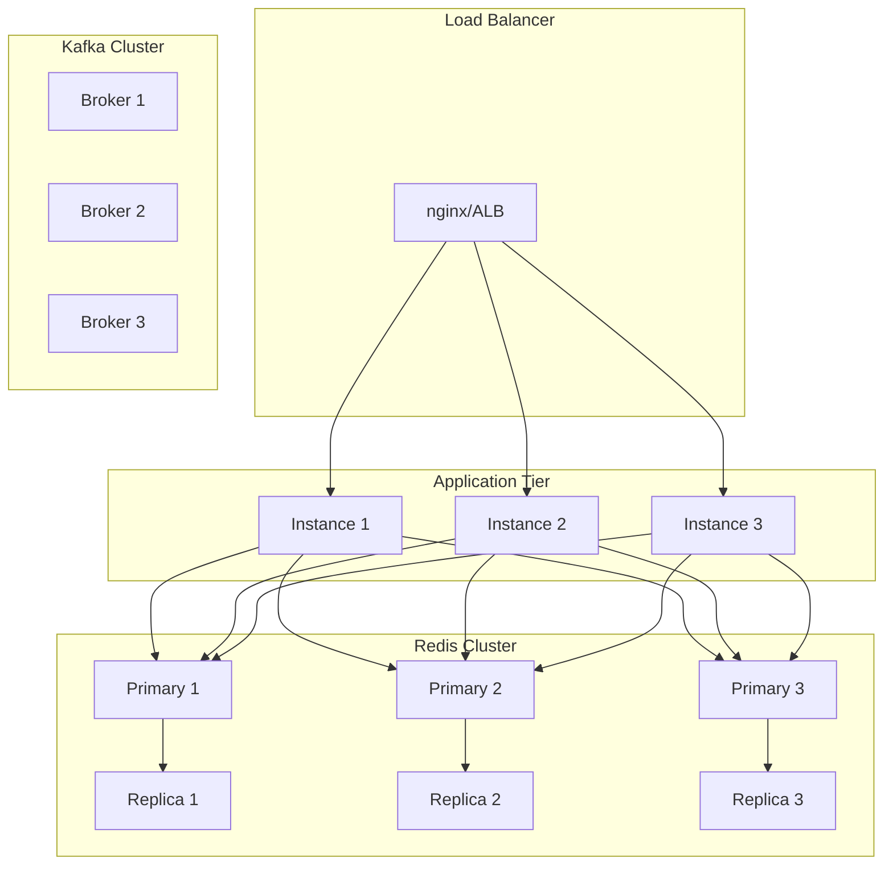
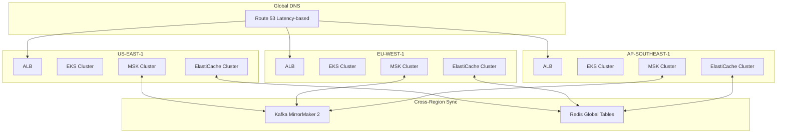
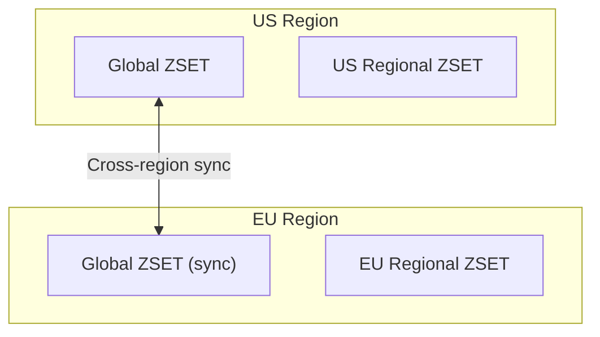

# Scaling Strategy

## Overview

This document outlines the scaling strategy for the Real-Time Leaderboard System to support 100 million users and 50 million daily active users globally.

## Traffic Analysis

### Capacity Estimates

| Metric | Calculation | Value |
|--------|-------------|-------|
| Daily Active Users | Given | 50M |
| Score updates per user/day | Medium frequency | 20 |
| Total score updates/day | 50M × 20 | 1 billion |
| Average RPS | 1B / 86400 | ~11,500 |
| Peak RPS (5x average) | 11,500 × 5 | ~60,000 |
| Leaderboard queries per user/day | Viewing frequency | 10 |
| Total queries/day | 50M × 10 | 500M |
| Query RPS (peak) | 500M / 86400 × 5 | ~30,000 |

### Data Volume

| Data Type | Calculation | Size |
|-----------|-------------|------|
| Per ZSET entry | Player ID + score + overhead | ~100 bytes |
| Global leaderboard | 100M players | ~10 GB |
| 7 daily ZSETs | 10 GB × 7 | ~70 GB |
| 5 regional leaderboards | 10 GB × 5 | ~50 GB |
| Total Redis memory | Sum + overhead | ~150 GB |

## Scaling Architecture

### Tier 1: Local Development



- Single instance of each component
- Suitable for development and testing
- Handles up to 1,000 concurrent users

### Tier 2: Single Region Production



- Horizontal scaling of application tier
- Redis Cluster with 3 primaries + 3 replicas
- Kafka cluster with replication factor 3
- Handles up to 10 million DAU

### Tier 3: Multi-Region Global



## Component Scaling

### Application Tier

**Scaling Triggers:**
- CPU utilization > 70%
- Memory utilization > 80%
- Request latency p99 > 100ms

**Kubernetes HPA Configuration:**

```yaml
apiVersion: autoscaling/v2
kind: HorizontalPodAutoscaler
metadata:
  name: leaderboard-hpa
spec:
  scaleTargetRef:
    apiVersion: apps/v1
    kind: Deployment
    name: leaderboard
  minReplicas: 3
  maxReplicas: 50
  metrics:
    - type: Resource
      resource:
        name: cpu
        target:
          type: Utilization
          averageUtilization: 70
    - type: Resource
      resource:
        name: memory
        target:
          type: Utilization
          averageUtilization: 80
```

### Redis Cluster

**Scaling Strategy:**
- Start with 3 primaries for 50M DAU
- Add shards as data volume grows
- Use read replicas for query scaling

**Sharding:**

```
Hash slot: CRC16(key) mod 16384
Key pattern: lb:{scope}:{period}:{id}
```

**Recommended Configuration:**

| DAU | Primaries | Replicas | Memory/Node |
|-----|-----------|----------|-------------|
| 10M | 3 | 3 | 16 GB |
| 25M | 6 | 6 | 32 GB |
| 50M | 9 | 9 | 32 GB |
| 100M | 15 | 15 | 32 GB |

### Kafka Cluster

**Partition Strategy:**
- Score events topic: 12 partitions per region
- Partition key: Player ID (ensures ordering per player)
- Consumer group: 1 consumer per partition

**Scaling Triggers:**
- Consumer lag > 10,000 messages
- Producer latency p99 > 50ms

### PostgreSQL

**Scaling Strategy:**
- Primary for writes (player updates, snapshots)
- Read replicas for profile queries
- Periodic archival to S3/cold storage

## Regional Leaderboards

### Architecture



### Sync Strategy

1. **Regional leaderboards**: Local to each region
2. **Global leaderboards**: Synchronized across regions
3. **Sync mechanism**: Kafka MirrorMaker for events

### Eventual Consistency

- Regional queries: Always consistent (local data)
- Global queries: Eventually consistent (sync delay ~100ms)
- Acceptable for leaderboard use case

## Performance Optimization

### Caching Layers

1. **L1 Cache (Caffeine)**: Top 10 queries, 1s TTL
2. **L2 Cache (Redis)**: Player profiles, 5min TTL
3. **CDN**: Static assets, API responses (future)

### Query Optimization

```
// Before: N+1 queries
for player in topPlayers:
    profile = db.getProfile(player.id)

// After: Batch query
profiles = db.getProfiles(topPlayers.ids)
```

### Connection Pooling

```yaml
# Redis
spring.data.redis.lettuce.pool.max-active: 50
spring.data.redis.lettuce.pool.max-idle: 20

# PostgreSQL
spring.datasource.hikari.maximum-pool-size: 20
spring.datasource.hikari.minimum-idle: 5
```

## Cost Optimization

### Right-sizing

| Component | Development | Production |
|-----------|-------------|------------|
| App instances | t3.medium (2) | c6i.xlarge (10+) |
| Redis | r6g.large (1) | r6g.2xlarge (6+) |
| Kafka | kafka.t3.small (3) | kafka.m5.xlarge (3) |
| RDS | db.t3.medium | db.r6g.xlarge |

### Reserved Capacity

- Reserve instances for baseline load
- Use spot instances for batch processing
- Savings Plans for predictable workloads

## Monitoring Thresholds

| Metric | Warning | Critical |
|--------|---------|----------|
| Redis memory | 70% | 85% |
| Redis CPU | 60% | 80% |
| Kafka consumer lag | 5,000 | 10,000 |
| App response time p99 | 50ms | 100ms |
| Error rate | 0.1% | 1% |

## Disaster Recovery

### RTO/RPO Targets

| Scenario | RTO | RPO |
|----------|-----|-----|
| Single node failure | 30s | 0 |
| AZ failure | 5min | 0 |
| Region failure | 30min | 1min |

### Backup Strategy

- Redis: AOF + RDB snapshots every 15 minutes
- Kafka: Log retention 7 days
- PostgreSQL: Daily backups, PITR enabled
