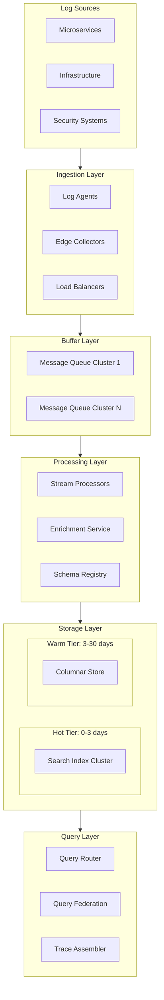
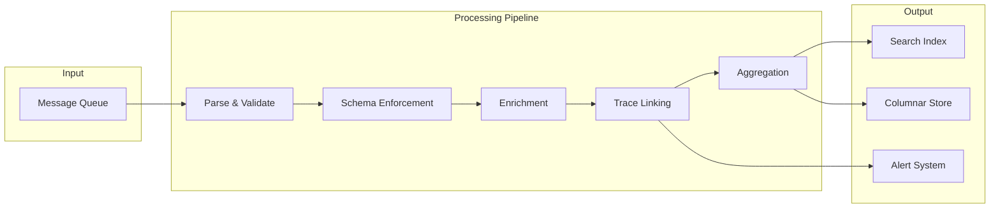
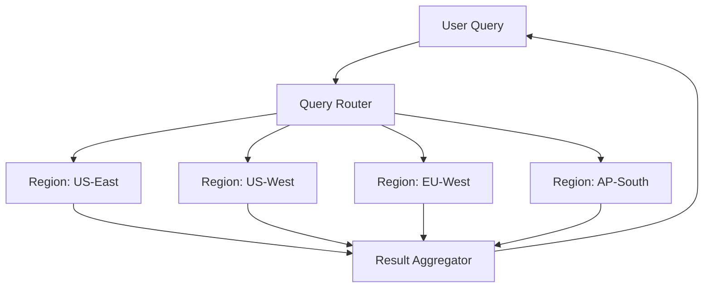
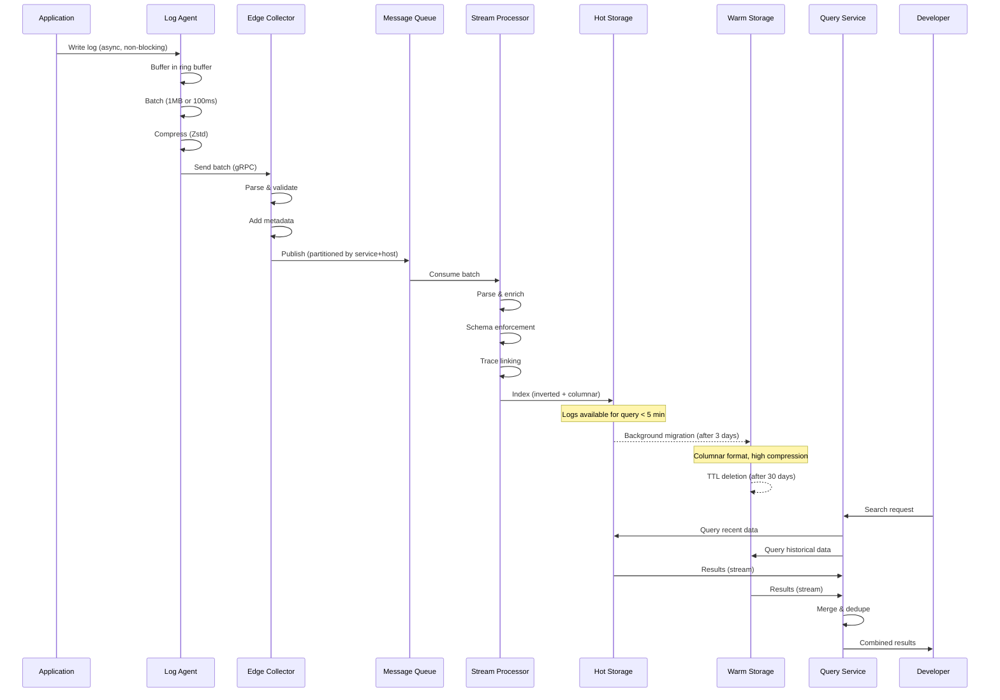

# Petabyte-Scale Log Ingestion System Design

> A distributed log ingestion system for FAANG-scale organizations

## Table of Contents

1. [Executive Summary](#executive-summary)
2. [Requirements](#requirements)
3. [Scale Analysis](#scale-analysis)
4. [High-Level Architecture](#high-level-architecture)
5. [Component Design](#component-design)
   - [Ingestion Layer](#1-ingestion-layer)
   - [Buffer Layer](#2-buffer-layer-message-queue)
   - [Processing Layer](#3-processing-layer)
   - [Storage Layer](#4-storage-layer)
   - [Query Layer](#5-query-layer)
6. [Supporting Systems](#6-supporting-systems)
7. [Data Flow](#data-flow-summary)
8. [Reliability & Failure Handling](#reliability--failure-handling)
9. [Capacity Planning](#capacity-planning-summary)
10. [Key Trade-offs](#key-trade-offs)
11. [Implementation Recommendations](#implementation-recommendations)
12. [Success Metrics](#success-metrics)

---

## Executive Summary

This document describes the architecture for a distributed log ingestion system capable of handling **10 petabytes per day** (~116 GB/s, ~230 million log events/second) across multiple regions. The system provides:

- **Near real-time queryability**: Logs available for search within 5 minutes of generation
- **Full-text + structured search**: Support for grep-like searches and field-based filtering
- **Distributed tracing**: Ability to follow requests across microservices
- **Multi-region federation**: Logs stay in origin region with cross-region query capability
- **Short-term retention**: 7-30 days with tiered storage for cost optimization

---

## Requirements

### Functional Requirements

| Requirement | Description |
|-------------|-------------|
| Log Collection | Collect logs from all microservices, infrastructure, and security systems |
| Full-Text Search | Grep-like search across log message content |
| Structured Queries | Filter by service, log level, timestamp, trace_id, etc. |
| Distributed Tracing | Reconstruct request flow across services using trace_id/span_id |
| Multi-Region Search | Query logs across all regions from any location |

### Non-Functional Requirements

| Requirement | Target |
|-------------|--------|
| Throughput | 10 PB/day (116 GB/s) |
| Latency to Query | < 5 minutes from log generation |
| Retention | 7-30 days |
| Availability | 99.9% for ingestion, 99.5% for query |
| Data Loss | < 0.001% |

---

## Scale Analysis

| Metric | Value |
|--------|-------|
| Daily Volume | 10 PB |
| Throughput | ~116 GB/s / ~925 Gbps |
| Events/Second | ~230 million (assuming 500 bytes avg) |
| Retention | 7-30 days |
| Storage Required | 70-300 PB raw (15-60 PB with compression) |

### Assumptions

- Average log event size: 500 bytes
- Compression ratio: 5:1 for hot tier, 10:1 for warm tier
- 5 geographic regions with roughly equal traffic distribution
- Peak traffic: 2x average

---

## High-Level Architecture



### Architecture Principles

1. **Horizontal Scalability**: Every component scales by adding more instances
2. **Decoupled Components**: Message queue buffers between layers for independent scaling
3. **Regional Isolation**: Logs processed and stored in their origin region
4. **Tiered Storage**: Hot tier for recent queries, warm tier for cost efficiency
5. **Stateless Processing**: Processing nodes are stateless for easy recovery

---

## Component Design

### 1. Ingestion Layer

**Purpose**: Collect logs from all sources with minimal overhead and guaranteed delivery.

#### 1.1 Log Agents

Lightweight agents deployed on every host, similar to Fluentd, Vector, or Fluent Bit.

**Responsibilities**:
- Collect logs from applications (stdout, files, sockets)
- Buffer logs locally to survive network issues
- Batch and compress logs before sending
- Handle backpressure from downstream systems

**Design Specifications**:

| Attribute | Value |
|-----------|-------|
| Buffer Size | 100MB memory-mapped ring buffer |
| Batch Size | 1MB or 100ms (whichever first) |
| Compression | Zstd (5:1 ratio) |
| CPU Overhead | < 1% per host |
| Disk Spillover | 1GB local disk buffer |

**Agent Architecture**:

```
┌─────────────────────────────────────────────────────────┐
│  Host                                                   │
│  ┌─────────┐    ┌──────────────────────────────────┐   │
│  │ App     │───>│ Log Agent                        │   │
│  └─────────┘    │                                  │   │
│                 │  ┌─────────────────────────────┐ │   │
│                 │  │ Input Plugins               │ │   │
│                 │  │ - File tail                 │ │   │
│                 │  │ - Stdout capture            │ │   │
│                 │  │ - Syslog receiver           │ │   │
│                 │  └─────────────────────────────┘ │   │
│                 │              │                   │   │
│                 │              ▼                   │   │
│                 │  ┌─────────────────────────────┐ │   │
│                 │  │ Ring Buffer (100MB mmap)    │ │   │
│                 │  └─────────────────────────────┘ │   │
│                 │              │                   │   │
│                 │              ▼                   │   │
│                 │  ┌─────────────────────────────┐ │   │
│                 │  │ Batcher + Compressor        │ │   │
│                 │  │ - Batch: 1MB or 100ms       │ │   │
│                 │  │ - Compress: Zstd            │ │   │
│                 │  └─────────────────────────────┘ │   │
│                 │              │                   │   │
│                 │              ▼                   │   │
│                 │  ┌─────────────────────────────┐ │   │
│                 │  │ Output (gRPC/HTTP)          │ │   │
│                 │  │ - Retry w/ exp backoff      │ │   │
│                 │  │ - Disk spillover on failure │ │   │
│                 │  └─────────────────────────────┘ │   │
│                 └──────────────────────────────────┘   │
└─────────────────────────────────────────────────────────┘
```

#### 1.2 Edge Collectors

Regional aggregation points deployed at the rack or pod level.

**Responsibilities**:
- Aggregate logs from multiple agents
- Protocol translation (syslog, OTLP, JSON, etc.)
- Initial parsing and validation
- Rate limiting per service (prevent noisy neighbor)
- Add metadata (region, AZ, rack info)

**Design Specifications**:

| Attribute | Value |
|-----------|-------|
| Deployment | 1 per rack/pod (~100 hosts) |
| Throughput | ~1 GB/s per collector |
| Rate Limit | Configurable per service (default: 10K logs/s) |
| Protocols | gRPC, HTTP/2, Syslog, OTLP |

#### 1.3 Design Decisions

| Decision | Alternative | Rationale |
|----------|-------------|-----------|
| Push-based model | Pull-based (Prometheus-style) | Lower latency, better for high-volume logs |
| Agent-side buffering | Central buffering only | Survives network partitions, guaranteed delivery |
| UDP for debug logs | TCP for all | Reduces overhead for non-critical high-volume logs |
| Client-side sampling | Server-side only | Reduces network bandwidth for verbose services |

---

### 2. Buffer Layer (Message Queue)

**Purpose**: Decouple ingestion from processing, provide durability and replay capability.

#### 2.1 Architecture Pattern

Distributed commit log, similar to Apache Kafka, Pulsar, or Redpanda.

**Key Properties**:
- Append-only, immutable log segments
- Partitioned for parallel processing
- Replicated for durability
- Ordered within partition

#### 2.2 Topic Design

```
logs.{region}.{tier}
├── logs.us-east.critical      (3x replication, acks=all)
├── logs.us-east.standard      (2x replication, acks=1)
└── logs.us-east.debug         (1x replication, fire-and-forget)
```

**Tier Definitions**:

| Tier | Replication | Acks | Use Case |
|------|-------------|------|----------|
| Critical | 3x | all | Security, audit, payment logs |
| Standard | 2x | leader | Application logs, errors |
| Debug | 1x | none | Verbose debugging, traces |

#### 2.3 Partitioning Strategy

**Partition Key**: `hash(service_id + host_id)`

**Rationale**:
- Logs from same service/host go to same partition
- Maintains ordering per host
- Even distribution across partitions
- Enables efficient compaction

**Partition Count**: 1000+ partitions per topic for parallelism

#### 2.4 Capacity Planning

| Metric | Per Region | Global |
|--------|------------|--------|
| Throughput | 23 GB/s | 116 GB/s |
| Broker Throughput | ~2 GB/s each | - |
| Brokers Needed | 20 (with headroom) | 100 |
| Retention | 24-72 hours | - |
| Storage per Broker | ~100 TB | - |

#### 2.5 Durability Guarantees

```
Producer → Broker Leader → Broker Followers → Consumer
              │                    │
              ▼                    ▼
         fsync to disk      replicate before ack
              │
              ▼
         ack to producer
```

- **Min In-Sync Replicas**: 2 for critical topics
- **Replication Lag Threshold**: 10 seconds max
- **Consumer Checkpointing**: Every 10K messages or 5 seconds

---

### 3. Processing Layer

**Purpose**: Parse, enrich, transform, and route logs in real-time.

#### 3.1 Stream Processing Architecture



#### 3.2 Processing Stages

**Stage 1: Parse & Validate**
- Extract structured fields from raw log strings
- Validate required fields are present
- Detect and parse common formats (JSON, logfmt, syslog)
- Drop malformed logs (emit metric for monitoring)

```
Input:  {"ts":"2024-01-15T10:30:00Z","level":"ERROR","msg":"Connection timeout","service":"api-gateway"}
Output: {timestamp: 1705315800, level: "ERROR", message: "Connection timeout", service: "api-gateway", raw: "..."}
```

**Stage 2: Schema Enforcement**
- Normalize field names to canonical schema
- Handle schema evolution (new fields, type changes)
- Register unknown fields with schema registry
- Type coercion and validation

**Canonical Schema**:
```
{
  "timestamp":    int64,      // Unix epoch milliseconds
  "level":        string,     // DEBUG, INFO, WARN, ERROR, FATAL
  "service":      string,     // Service identifier
  "host":         string,     // Hostname
  "message":      string,     // Log message
  "trace_id":     string?,    // Optional: Distributed trace ID
  "span_id":      string?,    // Optional: Span ID
  "parent_span":  string?,    // Optional: Parent span ID
  "attributes":   map<string, any>  // Additional fields
}
```

**Stage 3: Enrichment**
- Add infrastructure metadata (region, AZ, cluster)
- Resolve service names from service registry
- GeoIP lookup for access logs
- Add cost attribution tags
- Add ingestion timestamp

**Stage 4: Trace Linking**
- Extract trace context from logs
- Validate trace_id/span_id format
- Build parent-child relationships
- Route trace data to trace assembler
- Trigger alerts for error spans

**Stage 5: Aggregation (Optional)**
- Pre-compute common aggregates (error counts, latency percentiles)
- Cardinality reduction for metrics
- Adaptive sampling for high-volume debug logs

#### 3.3 Parallelism Model

| Metric | Value |
|--------|-------|
| Events/Second (Global) | 230 million |
| Events/Processor | ~100K/s |
| Processors Needed | 2,300+ |
| Per Region | ~500 processors |

**Scaling Strategy**:
- Partition-parallel: One consumer thread per partition
- Stateless processing: State stored in external systems
- Horizontal scaling: Add processors as load increases

#### 3.4 Processing Guarantees

- **At-least-once delivery**: May produce duplicates, never lose data
- **Checkpointing**: Consumer offsets stored every 5s or 10K messages
- **Idempotency**: Storage layer handles deduplication via log_id
- **Ordering**: Maintained within partition (per service+host)

---

### 4. Storage Layer

**Purpose**: Store logs for efficient querying with cost-effective tiering.

#### 4.1 Storage Tiers Overview

```
┌────────────────────────────────────────────────────────────┐
│                        Query Layer                         │
└────────────────────────────┬───────────────────────────────┘
                             │
         ┌───────────────────┴───────────────────┐
         │                                       │
         ▼                                       ▼
┌─────────────────────────┐         ┌─────────────────────────┐
│       HOT TIER          │         │       WARM TIER         │
│    (Search Index)       │         │    (Columnar Store)     │
├─────────────────────────┤         ├─────────────────────────┤
│ • Age: 0-3 days         │         │ • Age: 3-30 days        │
│ • Full-text search      │──────>  │ • Structured queries    │
│ • Inverted index        │ migrate │ • Columnar compression  │
│ • NVMe SSDs             │         │ • HDDs + SSD cache      │
│ • 2x replication        │         │ • 2x replication        │
└─────────────────────────┘         └─────────────────────────┘
         │                                       │
         │                                       │
         ▼                                       ▼
    Fast queries on                      Cost-effective storage
    recent data                          for historical analysis
```

#### 4.2 Hot Tier (0-3 days) - Search-Optimized

**Technology Pattern**: Inverted index + columnar storage (similar to Elasticsearch, Loki)

**Indexing Strategy**:

| Field Type | Index Type | Example Fields |
|------------|------------|----------------|
| Full-text | Inverted index with tokenization | message |
| High-cardinality | Inverted index (exact match) | trace_id, request_id, host |
| Low-cardinality | Columnar with bitmap | service, level, region |
| Timestamp | BKD tree (range queries) | timestamp |

**Sharding Strategy**:
- **Shard key**: `{service}_{timestamp_hour}`
- **Shard size**: Target 50GB per shard
- **Time-based rollover**: New shard every hour per service

**Write Path**:

```
Incoming Log
     │
     ▼
┌─────────────────────────────┐
│ Write Buffer (RAM)          │
│ - Batch writes in memory    │
│ - 256MB buffer per shard    │
└─────────────────────────────┘
     │
     ▼ (flush every 5s or 256MB)
┌─────────────────────────────┐
│ Segment (Immutable)         │
│ - Inverted index            │
│ - Columnar data             │
│ - Bloom filters             │
└─────────────────────────────┘
     │
     ▼ (background)
┌─────────────────────────────┐
│ Merge (LSM-tree style)      │
│ - Combine small segments    │
│ - Optimize for read         │
└─────────────────────────────┘
```

**Capacity for Hot Tier**:

| Metric | Value |
|--------|-------|
| Raw Data (3 days) | 30 PB |
| Compressed (5:1) | 6 PB |
| With 2x Replication | 12 PB |
| Per Region | 2.4 PB |
| Storage Type | NVMe SSD |

#### 4.3 Warm Tier (3-30 days) - Analytics-Optimized

**Technology Pattern**: Columnar store (similar to ClickHouse, Apache Druid)

**Design Optimizations**:
- Heavy compression (10:1 with columnar encoding)
- Sparse indexing (skip indices on time + service)
- Partition pruning for time-range queries
- Materialized aggregates for common queries

**Data Layout**:

```
Table: logs
├── Partition: 2024-01-15 / service=api-gateway
│   ├── timestamp.column (delta encoding)
│   ├── level.column (dictionary encoding)
│   ├── message.column (LZ4 compression)
│   └── attributes.column (sparse encoding)
├── Partition: 2024-01-15 / service=auth-service
│   └── ...
└── ...

Skip Index: (min_timestamp, max_timestamp, service) per data block
```

**Capacity for Warm Tier**:

| Metric | Value |
|--------|-------|
| Raw Data (27 days) | 270 PB |
| Compressed (10:1) | 27 PB |
| With Replication | 40-50 PB |
| Per Region | 8-10 PB |
| Storage Type | HDD + SSD cache |

#### 4.4 Data Migration

**Hot → Warm Migration**:
- Background job runs hourly
- Converts indexed format to columnar
- Applies aggressive compression
- Verifies data integrity before deletion from hot tier

**Warm → Delete**:
- TTL-based deletion after 30 days
- Partition-level drops (efficient)
- Tombstone compaction

---

### 5. Query Layer

**Purpose**: Unified query interface with federated search across regions.

#### 5.1 Query Router

Central entry point for all log queries.

**Responsibilities**:
- Parse and validate queries
- Determine which tier(s) to query
- Route to appropriate storage backend
- Merge results from multiple sources
- Apply authorization and rate limiting

**Query Routing Logic**:

```
Query received
     │
     ▼
┌─────────────────────────────┐
│ Parse & Validate            │
│ - Syntax check              │
│ - Extract time range        │
│ - Identify required fields  │
└─────────────────────────────┘
     │
     ▼
┌─────────────────────────────┐
│ Query Planning              │
│ - Determine target tier(s)  │
│ - Identify target shards    │
│ - Push down predicates      │
└─────────────────────────────┘
     │
     ├──────────────────┬───────────────────┐
     ▼                  ▼                   ▼
┌──────────┐    ┌──────────────┐    ┌──────────────┐
│ Hot Tier │    │  Warm Tier   │    │   Other      │
│          │    │              │    │   Regions    │
└──────────┘    └──────────────┘    └──────────────┘
     │                  │                   │
     └──────────────────┴───────────────────┘
                        │
                        ▼
               ┌──────────────────┐
               │ Merge & Sort     │
               │ - Dedup by log_id│
               │ - Sort by time   │
               │ - Apply limit    │
               └──────────────────┘
                        │
                        ▼
                    Response
```

#### 5.2 Query Patterns

| Query Type | Example | Optimized Path |
|------------|---------|----------------|
| Tail logs | Last 100 logs for service X | Hot tier, single shard, no index |
| Full-text search | ERROR logs containing "timeout" | Hot tier, inverted index |
| Trace lookup | All logs for trace_id=abc123 | Hot tier, trace_id index |
| Structured filter | service=auth AND level=ERROR last 1h | Hot tier, columnar scan |
| Aggregation | Error count by service last 24h | Warm tier, columnar aggregation |
| Cross-region | Search all regions for user_id=123 | Federated query |

#### 5.3 Federated Search



**Federation Strategy**:

| Aspect | Approach |
|--------|----------|
| Data Location | Logs stay in origin region (data sovereignty) |
| Query Fan-out | Parallel queries to all regions |
| Timeout Handling | Per-region timeout, partial results allowed |
| Result Merging | Sorted by timestamp, deduped by log_id |
| Caching | Query results cached at router level |

**Query Flow**:
1. User submits query to nearest query router
2. Router determines if federation is needed
3. If federated, parallel requests sent to all regions
4. Each region executes query locally
5. Results streamed back to router
6. Router merges, sorts, and returns results

#### 5.4 Distributed Tracing

**Trace Assembly Process**:

```
User: "Show trace abc-123"
          │
          ▼
┌─────────────────────────────┐
│ Query trace_id index        │
│ - Search all services       │
│ - May span multiple regions │
└─────────────────────────────┘
          │
          ▼
┌─────────────────────────────┐
│ Collect all matching logs   │
│ - Extract span_id           │
│ - Extract parent_span_id    │
│ - Extract timestamp         │
└─────────────────────────────┘
          │
          ▼
┌─────────────────────────────┐
│ Build trace tree            │
│ - Root: span with no parent │
│ - Children: by parent_span  │
│ - Sort by timestamp         │
└─────────────────────────────┘
          │
          ▼
      Trace Visualization
```

**Example Trace Output**:

```
trace_id: abc-123
│
├── [10:00:00.000] api-gateway (span: 001, duration: 100ms)
│   │
│   ├── [10:00:00.005] auth-service (span: 002, parent: 001, duration: 15ms)
│   │   └── [10:00:00.010] redis-cache (span: 005, parent: 002, duration: 2ms)
│   │
│   └── [10:00:00.025] user-service (span: 003, parent: 001, duration: 60ms)
│       │
│       └── [10:00:00.030] postgres-db (span: 004, parent: 003, duration: 45ms)
│
└── [10:00:00.100] response sent (total: 100ms)
```

---

### 6. Supporting Systems

#### 6.1 Schema Registry

**Purpose**: Central repository for log schemas with versioning and evolution.

**Capabilities**:
- Store and version log schemas
- Validate incoming logs against schemas
- Support schema evolution (add fields, deprecate fields)
- Auto-discovery of new fields
- Compatibility checking (backward, forward)

**Schema Evolution Rules**:

| Change Type | Allowed | Notes |
|-------------|---------|-------|
| Add optional field | Yes | Default to null |
| Add required field | No | Breaks existing producers |
| Remove field | Yes (deprecate first) | Mark deprecated, remove after 30 days |
| Change field type | Limited | String → Int not allowed, Int → Long allowed |

#### 6.2 Rate Limiting & Quota Management

**Purpose**: Prevent noisy neighbors from overwhelming the system.

**Rate Limiting Tiers**:

| Tier | Limit | Behavior on Exceed |
|------|-------|-------------------|
| Service Quota | Configurable per service | Queue → Sample → Drop |
| Burst Allowance | 2x quota for 60 seconds | Allow temporary spikes |
| Global Limit | System capacity | Backpressure to all |

**Quota Management**:
- Per-service ingestion quotas
- Cost attribution and chargeback
- Self-service quota increase requests
- Automatic alerting on quota usage > 80%

#### 6.3 Monitoring & Alerting

**Pipeline Health Metrics**:

| Metric | Alert Threshold |
|--------|----------------|
| Ingestion lag | > 1 minute |
| Processing lag | > 5 minutes |
| Error rate | > 1% |
| Queue depth | > 80% capacity |
| Storage utilization | > 85% |

**Data Quality Metrics**:
- Parse failure rate per service
- Schema validation failures
- Missing required fields
- Duplicate log rate

**End-to-End Latency Tracking**:
- Timestamp at each stage (agent → collector → queue → processor → storage)
- P50, P95, P99 latency metrics
- SLO: 99% of logs queryable within 5 minutes

---

## Data Flow Summary



---

## Reliability & Failure Handling

### Failure Modes & Mitigations

| Component | Failure Mode | Detection | Mitigation | Recovery Time |
|-----------|--------------|-----------|------------|---------------|
| Log Agent | Process crash | Supervisor watchdog | Auto-restart, disk buffer survives | < 5 seconds |
| Log Agent | Host failure | Missing heartbeat | Logs lost in memory buffer only | N/A |
| Edge Collector | Process crash | Load balancer health check | Traffic reroutes to other collectors | < 10 seconds |
| Message Queue | Broker failure | ZK/Raft leader election | Replica promotion, rebalance | < 30 seconds |
| Message Queue | Disk failure | RAID/replication | Read from replica, replace disk | Minutes |
| Stream Processor | Consumer crash | Consumer group protocol | Rebalance partitions | < 60 seconds |
| Hot Storage | Node failure | Cluster health check | Replica serves reads, replace node | < 60 seconds |
| Query Router | Process crash | Load balancer | Route to other instances | < 5 seconds |

### Durability Guarantees

**At-Least-Once Delivery**:
- Logs may be duplicated but never lost
- Deduplication at storage layer via log_id
- Acceptable trade-off for log data

**Checkpointing Strategy**:

```
Processor
    │
    ├─> Process batch of messages
    │
    ├─> Write to storage (async)
    │
    ├─> Wait for storage ack
    │
    └─> Commit consumer offset
```

- Checkpoint every 10K messages or 5 seconds
- On failure, replay from last checkpoint
- May produce duplicates (handled by storage)

### Disaster Recovery

| Scenario | RPO | RTO | Strategy |
|----------|-----|-----|----------|
| Single node failure | 0 | < 1 min | Replica failover |
| Rack failure | 0 | < 5 min | Cross-rack replication |
| AZ failure | 0 | < 15 min | Cross-AZ replication |
| Region failure | < 1 min | < 1 hour | Manual failover (logs stay regional) |

---

## Capacity Planning Summary

### Global Capacity

| Component | Per Region | Global (5 regions) |
|-----------|------------|-------------------|
| Ingestion Rate | 23 GB/s | 116 GB/s |
| Events/Second | 46 million | 230 million |
| Message Queue Brokers | 20 | 100 |
| Stream Processors | 500 | 2,500 |
| Hot Storage Nodes | 200 | 1,000 |
| Warm Storage Nodes | 400 | 2,000 |
| Hot Storage Capacity | 2.4 PB | 12 PB |
| Warm Storage Capacity | 10 PB | 50 PB |
| Total Storage | ~12.5 PB | ~62 PB |

### Hardware Specifications

**Message Queue Broker**:
- CPU: 16 cores
- RAM: 64 GB
- Storage: 10x 10TB NVMe SSD (100TB)
- Network: 25 Gbps

**Stream Processor**:
- CPU: 8 cores
- RAM: 32 GB
- Storage: 500 GB SSD (local state)
- Network: 10 Gbps

**Hot Storage Node**:
- CPU: 32 cores
- RAM: 256 GB
- Storage: 20x 2TB NVMe SSD (40TB)
- Network: 25 Gbps

**Warm Storage Node**:
- CPU: 16 cores
- RAM: 128 GB
- Storage: 20x 16TB HDD + 2TB SSD cache
- Network: 10 Gbps

---

## Key Trade-offs

| Decision | Trade-off | Rationale |
|----------|-----------|-----------|
| **Push vs Pull** | Push adds agent complexity | Lower latency, guaranteed delivery, better for high-volume |
| **At-least-once vs Exactly-once** | Potential duplicates | 10x simpler implementation, duplicates acceptable for logs |
| **Tiered storage** | Query complexity (multiple backends) | 10x cost savings on warm tier |
| **Regional isolation** | Cross-region queries slower | Data sovereignty compliance, reduced blast radius |
| **Time-based sharding** | Hot spots for recent data | Natural query patterns (recent logs queried most), easy TTL |
| **Inverted index on message** | High storage overhead | Required for full-text search use case |
| **Columnar warm tier** | Limited full-text search | Optimized for aggregation queries, lower cost |

---

## Implementation Recommendations

This design is technology-agnostic. For implementation, consider these options:

### Option 1: Open Source Stack

| Component | Technology |
|-----------|------------|
| Log Agent | Vector, Fluent Bit |
| Message Queue | Apache Kafka, Redpanda |
| Stream Processing | Apache Flink, Kafka Streams |
| Hot Storage | Elasticsearch, Grafana Loki |
| Warm Storage | ClickHouse, Apache Druid |
| Query Federation | Custom service, Presto/Trino |

### Option 2: Cloud-Native Stack (AWS Example)

| Component | Technology |
|-----------|------------|
| Log Agent | CloudWatch Agent, Fluent Bit |
| Message Queue | Amazon MSK (Kafka) |
| Stream Processing | Amazon Kinesis Data Analytics, Flink on EMR |
| Hot Storage | Amazon OpenSearch |
| Warm Storage | Amazon Athena + S3 (Parquet) |
| Query Federation | Custom Lambda/ECS service |

### Option 3: Hybrid Custom Stack

| Component | Technology |
|-----------|------------|
| Log Agent | Custom (Rust/Go for performance) |
| Message Queue | Redpanda (Kafka-compatible, simpler ops) |
| Stream Processing | Custom Go services |
| Hot Storage | Custom inverted index (like Loki) |
| Warm Storage | ClickHouse |
| Query Federation | Custom gRPC service |

---

## Success Metrics

### Performance SLOs

| Metric | Target | Measurement |
|--------|--------|-------------|
| Ingestion Latency (App → Queue) | P99 < 1 second | End-to-end timestamp delta |
| Processing Latency (Queue → Storage) | P99 < 4 minutes | Processing timestamp delta |
| Total Latency (App → Queryable) | P99 < 5 minutes | Query for recent log |
| Query Latency (Simple) | P50 < 500ms, P99 < 2s | Tail logs, single service |
| Query Latency (Complex) | P50 < 2s, P99 < 10s | Full-text search, aggregations |
| Query Latency (Federated) | P50 < 5s, P99 < 30s | Cross-region queries |

### Reliability SLOs

| Metric | Target |
|--------|--------|
| Ingestion Availability | 99.9% |
| Query Availability | 99.5% |
| Data Loss Rate | < 0.001% |
| Duplicate Rate | < 0.1% |

### Cost Efficiency

| Metric | Target |
|--------|--------|
| Cost per TB Ingested | < $0.10 |
| Storage Cost (Hot) | < $50/TB/month |
| Storage Cost (Warm) | < $10/TB/month |
| Compute Cost | < $0.05 per million logs |

---

## Appendix

### A. Log Format Specification

```json
{
  "log_id": "uuid-v4",
  "timestamp": 1705315800000,
  "level": "ERROR",
  "service": "api-gateway",
  "host": "api-gw-pod-abc123",
  "message": "Connection timeout to downstream service",
  "trace_id": "abc123def456",
  "span_id": "span-001",
  "parent_span_id": null,
  "attributes": {
    "downstream_service": "user-service",
    "timeout_ms": 5000,
    "retry_count": 3
  },
  "metadata": {
    "region": "us-east-1",
    "az": "us-east-1a",
    "cluster": "production",
    "ingested_at": 1705315801000
  }
}
```

### B. Query API Examples

**Tail Logs**:
```sql
SELECT * FROM logs
WHERE service = 'api-gateway'
ORDER BY timestamp DESC
LIMIT 100
```

**Full-Text Search**:
```sql
SELECT * FROM logs
WHERE message CONTAINS 'timeout'
  AND timestamp > NOW() - INTERVAL 1 HOUR
ORDER BY timestamp DESC
```

**Trace Lookup**:
```sql
SELECT * FROM logs
WHERE trace_id = 'abc123def456'
ORDER BY timestamp ASC
```

**Error Aggregation**:
```sql
SELECT service, COUNT(*) as error_count
FROM logs
WHERE level = 'ERROR'
  AND timestamp > NOW() - INTERVAL 24 HOUR
GROUP BY service
ORDER BY error_count DESC
```

### C. Glossary

| Term | Definition |
|------|------------|
| Hot Tier | Storage optimized for recent data with fast query performance |
| Warm Tier | Cost-optimized storage for older data |
| Inverted Index | Data structure mapping terms to documents containing them |
| Columnar Storage | Data organized by column rather than row for compression |
| Federation | Querying across multiple independent data stores |
| Trace ID | Unique identifier linking logs across a distributed request |
| Span | A unit of work within a trace |
| LSM Tree | Log-Structured Merge Tree, write-optimized data structure |
