# Log Ingestion System Architecture

## Executive Summary

This document describes the architecture for a log ingestion system capable of handling **10 petabytes per day** (~115 GB/s average, ~345 GB/s peak) for debugging/troubleshooting and compliance/audit trail use cases.

---

## Table of Contents

1. [Requirements](#requirements)
2. [High-Level Architecture](#high-level-architecture)
3. [Data Flow](#data-flow)
4. [Component Architecture](#component-architecture)
5. [Storage Tiers](#storage-tiers)
6. [Multi-Tenancy](#multi-tenancy)
7. [Failure Handling](#failure-handling)
8. [Security & Compliance](#security--compliance)
9. [Technology Stack](#technology-stack)

---

## Requirements

### Functional Requirements

| Dimension | Requirement |
|-----------|-------------|
| **Scale** | 10 PB/day ingestion, 2-3x peak ratio |
| **Use Cases** | Debugging, compliance/audit |
| **Sources** | Application logs (microservices), infrastructure logs |
| **Formats** | JSON (structured), plain text (unstructured) |
| **Latency** | 1-5 minutes end-to-end |
| **Retention** | Hot: 7 days, Warm: 30 days, Cold: 1 year |
| **Query Patterns** | Needle-in-haystack, aggregations, full-text search |

### Non-Functional Requirements

| Dimension | Requirement |
|-----------|-------------|
| **Availability** | 99.9% uptime |
| **Durability** | 99.999999% (eight nines) |
| **Throughput** | 115 GB/s sustained, 345 GB/s peak |
| **Query Latency** | Hot: < 10s p95, Cold: < 5min p95 |

---

## High-Level Architecture

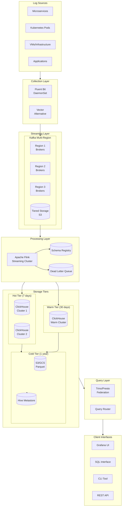
```mermaid
flowchart TB
    subgraph Sources["Log Sources"]
        MS[Microservices]
        K8S[Kubernetes Pods]
        VM[VMs/Infrastructure]
        APPS[Applications]
    end

    subgraph Collection["Collection Layer"]
        FB[Fluent Bit<br/>DaemonSet]
        VEC[Vector<br/>Alternative]
    end

    subgraph Streaming["Streaming Layer"]
        subgraph KafkaCluster["Kafka Multi-Region"]
            K1[Region 1<br/>Brokers]
            K2[Region 2<br/>Brokers]
            K3[Region 3<br/>Brokers]
            TS[(Tiered Storage<br/>S3)]
        end
    end

    subgraph Processing["Processing Layer"]
        FLINK[Apache Flink<br/>Streaming Cluster]
        SR[(Schema Registry)]
        DLQ[(Dead Letter Queue)]
    end

    subgraph Storage["Storage Tiers"]
        subgraph Hot["Hot Tier (7 days)"]
            CH1[(ClickHouse<br/>Cluster 1)]
            CH2[(ClickHouse<br/>Cluster 2)]
        end
        subgraph Warm["Warm Tier (30 days)"]
            CHW[(ClickHouse<br/>Warm Cluster)]
        end
        subgraph Cold["Cold Tier (1 year)"]
            S3[(S3/GCS<br/>Parquet)]
            HIVE[(Hive Metastore)]
        end
    end

    subgraph Query["Query Layer"]
        TRINO[Trino/Presto<br/>Federation]
        QR[Query Router]
    end

    subgraph Clients["Client Interfaces"]
        UI[Grafana UI]
        SQL[SQL Interface]
        CLI[CLI Tool]
        API[REST API]
    end

    Sources --> Collection
    Collection --> KafkaCluster
    KafkaCluster --> Processing
    FLINK --> SR
    FLINK --> DLQ
    Processing --> Hot
    Processing --> Warm
    Hot --> Cold
    Warm --> Cold
    Cold --> HIVE
    Storage --> Query
    Query --> Clients
```

---

## Data Flow

### Ingestion Pipeline

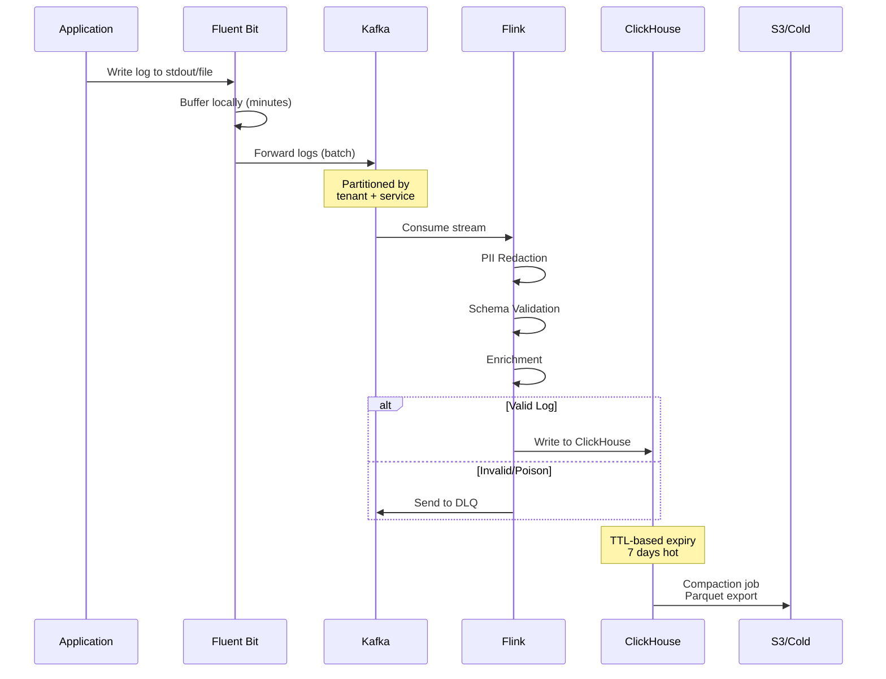
```mermaid
sequenceDiagram
    participant App as Application
    participant FB as Fluent Bit
    participant Kafka as Kafka
    participant Flink as Flink
    participant CH as ClickHouse
    participant S3 as S3/Cold

    App->>FB: Write log to stdout/file
    FB->>FB: Buffer locally (minutes)
    FB->>Kafka: Forward logs (batch)

    Note over Kafka: Partitioned by<br/>tenant + service

    Kafka->>Flink: Consume stream
    Flink->>Flink: PII Redaction
    Flink->>Flink: Schema Validation
    Flink->>Flink: Enrichment

    alt Valid Log
        Flink->>CH: Write to ClickHouse
    else Invalid/Poison
        Flink->>Kafka: Send to DLQ
    end

    Note over CH: TTL-based expiry<br/>7 days hot

    CH->>S3: Compaction job<br/>Parquet export
```

### Query Flow

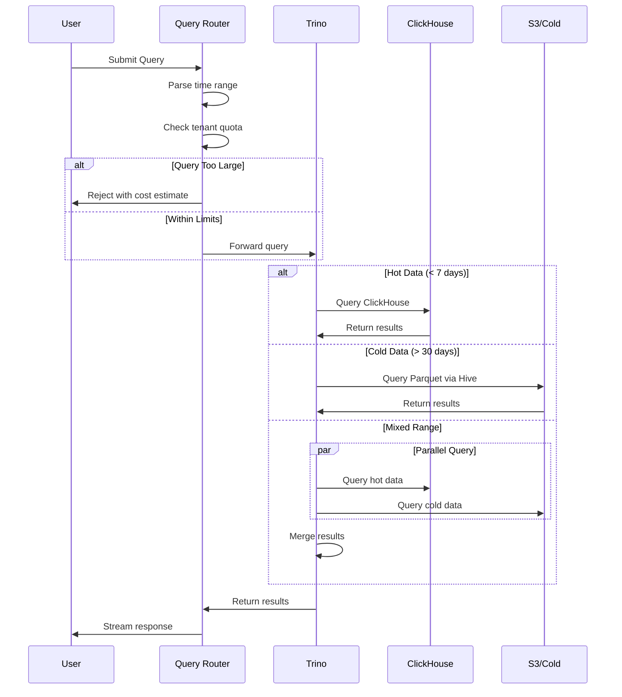
```mermaid
sequenceDiagram
    participant User as User
    participant QR as Query Router
    participant Trino as Trino
    participant CH as ClickHouse
    participant S3 as S3/Cold

    User->>QR: Submit Query
    QR->>QR: Parse time range
    QR->>QR: Check tenant quota

    alt Query Too Large
        QR->>User: Reject with cost estimate
    else Within Limits
        QR->>Trino: Forward query
    end

    alt Hot Data (< 7 days)
        Trino->>CH: Query ClickHouse
        CH->>Trino: Return results
    else Cold Data (> 30 days)
        Trino->>S3: Query Parquet via Hive
        S3->>Trino: Return results
    else Mixed Range
        par Parallel Query
            Trino->>CH: Query hot data
            Trino->>S3: Query cold data
        end
        Trino->>Trino: Merge results
    end

    Trino->>QR: Return results
    QR->>User: Stream response
```

---

## Component Architecture

### Collection Layer

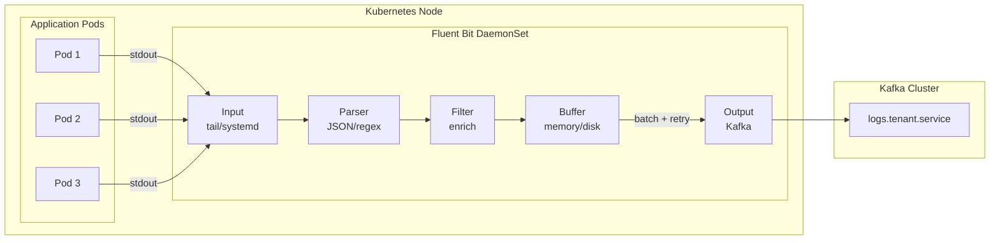
```mermaid
flowchart LR
    subgraph Node["Kubernetes Node"]
        subgraph Pods["Application Pods"]
            P1[Pod 1]
            P2[Pod 2]
            P3[Pod 3]
        end

        subgraph FluentBit["Fluent Bit DaemonSet"]
            INPUT[Input<br/>tail/systemd]
            PARSE[Parser<br/>JSON/regex]
            FILTER[Filter<br/>enrich]
            BUFFER[Buffer<br/>memory/disk]
            OUTPUT[Output<br/>Kafka]
        end
    end

    subgraph Kafka["Kafka Cluster"]
        TOPIC[logs.tenant.service]
    end

    P1 -->|stdout| INPUT
    P2 -->|stdout| INPUT
    P3 -->|stdout| INPUT
    INPUT --> PARSE
    PARSE --> FILTER
    FILTER --> BUFFER
    BUFFER -->|batch + retry| OUTPUT
    OUTPUT --> TOPIC
```

### Kafka Topology

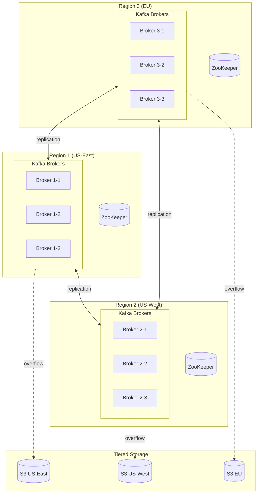
```mermaid
flowchart TB
    subgraph Region1["Region 1 (US-East)"]
        subgraph Brokers1["Kafka Brokers"]
            B1[Broker 1-1]
            B2[Broker 1-2]
            B3[Broker 1-3]
        end
        ZK1[(ZooKeeper)]
    end

    subgraph Region2["Region 2 (US-West)"]
        subgraph Brokers2["Kafka Brokers"]
            B4[Broker 2-1]
            B5[Broker 2-2]
            B6[Broker 2-3]
        end
        ZK2[(ZooKeeper)]
    end

    subgraph Region3["Region 3 (EU)"]
        subgraph Brokers3["Kafka Brokers"]
            B7[Broker 3-1]
            B8[Broker 3-2]
            B9[Broker 3-3]
        end
        ZK3[(ZooKeeper)]
    end

    subgraph TieredStorage["Tiered Storage"]
        S3_1[(S3 US-East)]
        S3_2[(S3 US-West)]
        S3_3[(S3 EU)]
    end

    Brokers1 -.->|overflow| S3_1
    Brokers2 -.->|overflow| S3_2
    Brokers3 -.->|overflow| S3_3

    Brokers1 <-->|replication| Brokers2
    Brokers2 <-->|replication| Brokers3
    Brokers3 <-->|replication| Brokers1
```

### Flink Processing Topology

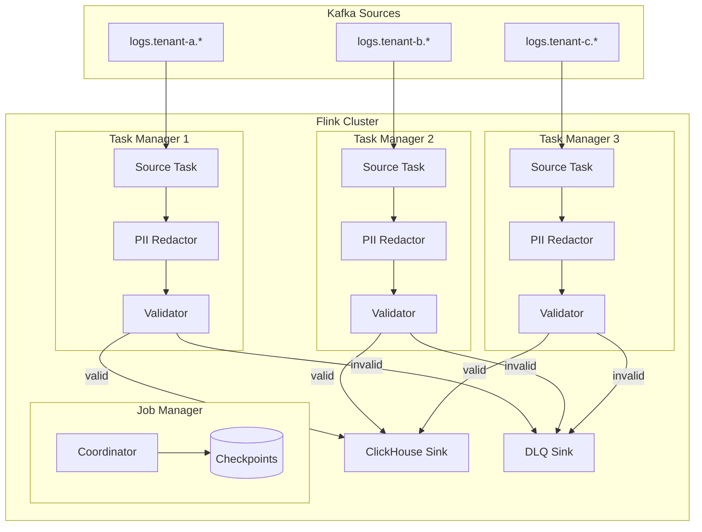
```mermaid
flowchart TB
    subgraph Sources["Kafka Sources"]
        T1[logs.tenant-a.*]
        T2[logs.tenant-b.*]
        T3[logs.tenant-c.*]
    end

    subgraph Flink["Flink Cluster"]
        subgraph JM["Job Manager"]
            COORD[Coordinator]
            CP[(Checkpoints)]
        end

        subgraph TM1["Task Manager 1"]
            S1[Source Task]
            PII1[PII Redactor]
            VAL1[Validator]
        end

        subgraph TM2["Task Manager 2"]
            S2[Source Task]
            PII2[PII Redactor]
            VAL2[Validator]
        end

        subgraph TM3["Task Manager 3"]
            S3[Source Task]
            PII3[PII Redactor]
            VAL3[Validator]
        end

        SINK1[ClickHouse Sink]
        SINK2[DLQ Sink]
    end

    T1 --> S1
    T2 --> S2
    T3 --> S3

    S1 --> PII1 --> VAL1
    S2 --> PII2 --> VAL2
    S3 --> PII3 --> VAL3

    VAL1 -->|valid| SINK1
    VAL2 -->|valid| SINK1
    VAL3 -->|valid| SINK1

    VAL1 -->|invalid| SINK2
    VAL2 -->|invalid| SINK2
    VAL3 -->|invalid| SINK2

    COORD --> CP
```

### ClickHouse Cluster Architecture

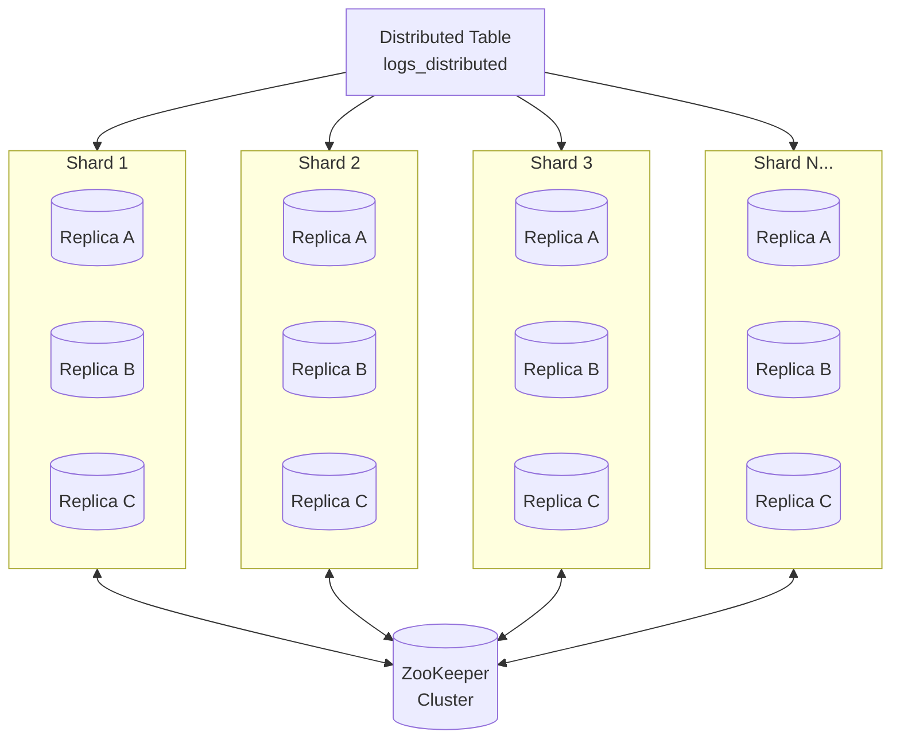
```mermaid
flowchart TB
    subgraph Shard1["Shard 1"]
        R1A[(Replica A)]
        R1B[(Replica B)]
        R1C[(Replica C)]
    end

    subgraph Shard2["Shard 2"]
        R2A[(Replica A)]
        R2B[(Replica B)]
        R2C[(Replica C)]
    end

    subgraph Shard3["Shard 3"]
        R3A[(Replica A)]
        R3B[(Replica B)]
        R3C[(Replica C)]
    end

    subgraph ShardN["Shard N..."]
        RNA[(Replica A)]
        RNB[(Replica B)]
        RNC[(Replica C)]
    end

    ZK[(ZooKeeper<br/>Cluster)]

    Shard1 <--> ZK
    Shard2 <--> ZK
    Shard3 <--> ZK
    ShardN <--> ZK

    DT[Distributed Table<br/>logs_distributed]

    DT --> Shard1
    DT --> Shard2
    DT --> Shard3
    DT --> ShardN
```

---

## Storage Tiers

### Tier Overview

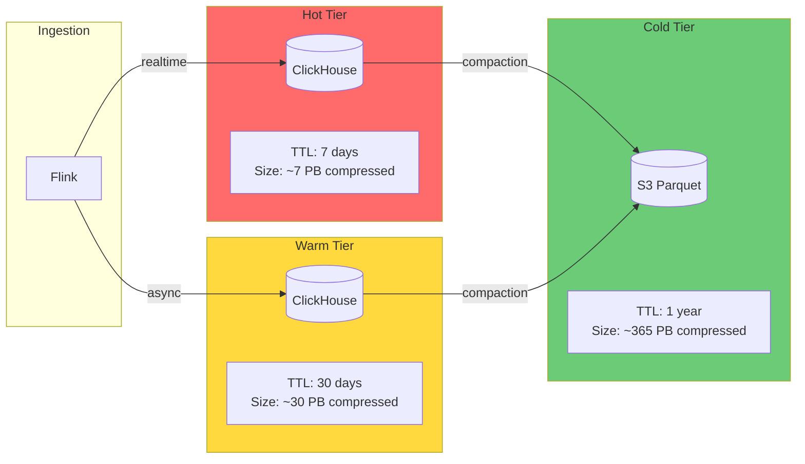
```mermaid
flowchart LR
    subgraph Ingestion
        FLINK[Flink]
    end

    subgraph Hot["Hot Tier"]
        direction TB
        CH_HOT[(ClickHouse)]
        HOT_TTL[TTL: 7 days<br/>Size: ~7 PB compressed]
    end

    subgraph Warm["Warm Tier"]
        direction TB
        CH_WARM[(ClickHouse)]
        WARM_TTL[TTL: 30 days<br/>Size: ~30 PB compressed]
    end

    subgraph Cold["Cold Tier"]
        direction TB
        S3[(S3 Parquet)]
        COLD_TTL[TTL: 1 year<br/>Size: ~365 PB compressed]
    end

    FLINK -->|realtime| CH_HOT
    FLINK -->|async| CH_WARM
    CH_HOT -->|compaction| S3
    CH_WARM -->|compaction| S3

    style Hot fill:#ff6b6b
    style Warm fill:#ffd93d
    style Cold fill:#6bcb77
```

### Data Lifecycle

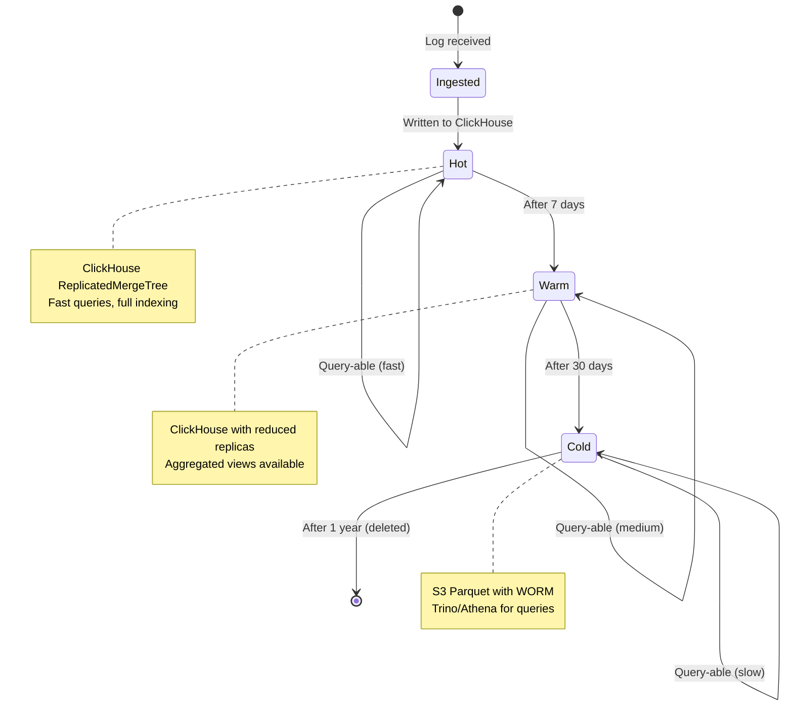
```mermaid
stateDiagram-v2
    [*] --> Ingested: Log received
    Ingested --> Hot: Written to ClickHouse
    Hot --> Hot: Query-able (fast)
    Hot --> Warm: After 7 days
    Warm --> Warm: Query-able (medium)
    Warm --> Cold: After 30 days
    Cold --> Cold: Query-able (slow)
    Cold --> [*]: After 1 year (deleted)

    note right of Hot
        ClickHouse ReplicatedMergeTree
        Fast queries, full indexing
    end note

    note right of Warm
        ClickHouse with reduced replicas
        Aggregated views available
    end note

    note right of Cold
        S3 Parquet with WORM
        Trino/Athena for queries
    end note
```

### ClickHouse Table Schema

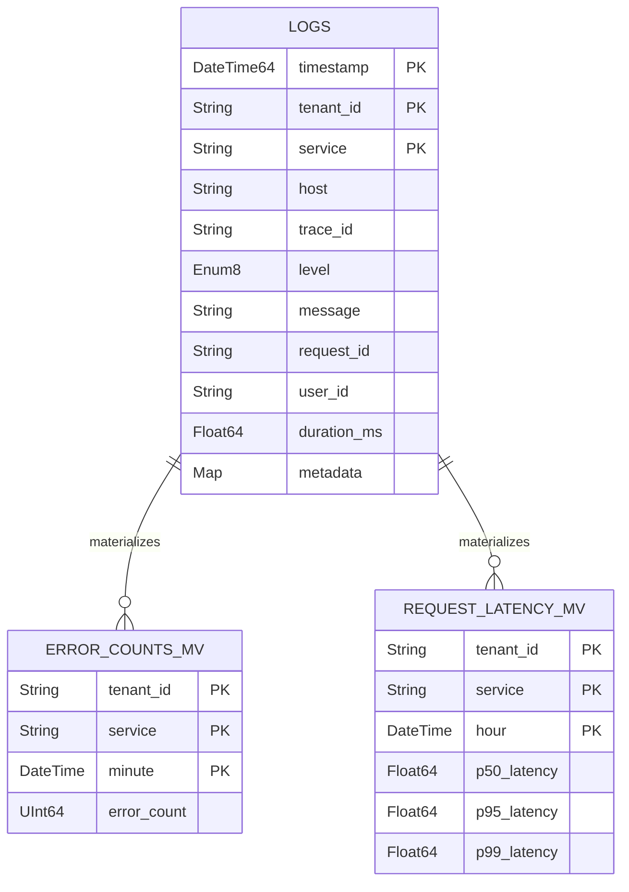
```mermaid
erDiagram
    LOGS {
        DateTime64 timestamp PK
        String tenant_id PK
        String service PK
        String host
        String trace_id
        Enum8 level
        String message
        String request_id
        String user_id
        Float64 duration_ms
        Map metadata
    }

    ERROR_COUNTS_MV {
        String tenant_id PK
        String service PK
        DateTime minute PK
        UInt64 error_count
    }

    REQUEST_LATENCY_MV {
        String tenant_id PK
        String service PK
        DateTime hour PK
        Float64 p50_latency
        Float64 p95_latency
        Float64 p99_latency
    }

    LOGS ||--o{ ERROR_COUNTS_MV : "materializes"
    LOGS ||--o{ REQUEST_LATENCY_MV : "materializes"
```

---

## Multi-Tenancy

### Isolation Model

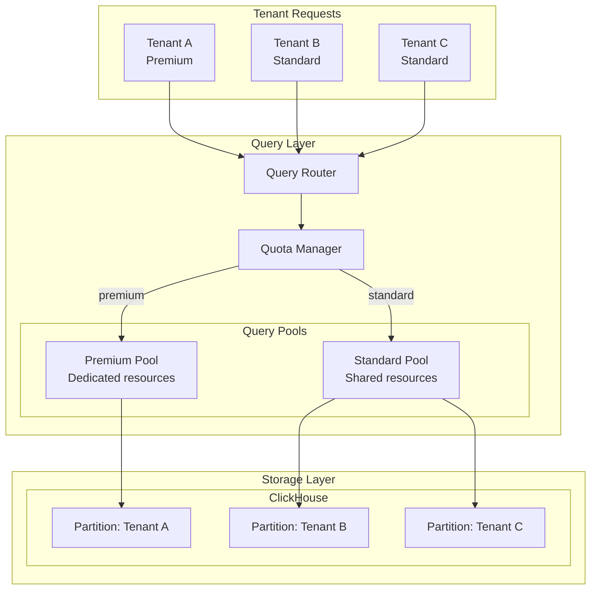
```mermaid
flowchart TB
    subgraph Tenants["Tenant Requests"]
        TA[Tenant A<br/>Premium]
        TB[Tenant B<br/>Standard]
        TC[Tenant C<br/>Standard]
    end

    subgraph QueryLayer["Query Layer"]
        QR[Query Router]

        subgraph Pools["Query Pools"]
            PP[Premium Pool<br/>Dedicated resources]
            SP[Standard Pool<br/>Shared resources]
        end

        QUOTA[Quota Manager]
    end

    subgraph Storage["Storage Layer"]
        subgraph CH["ClickHouse"]
            PART_A[Partition: Tenant A]
            PART_B[Partition: Tenant B]
            PART_C[Partition: Tenant C]
        end
    end

    TA --> QR
    TB --> QR
    TC --> QR

    QR --> QUOTA
    QUOTA -->|premium| PP
    QUOTA -->|standard| SP

    PP --> PART_A
    SP --> PART_B
    SP --> PART_C
```

### Quota Enforcement

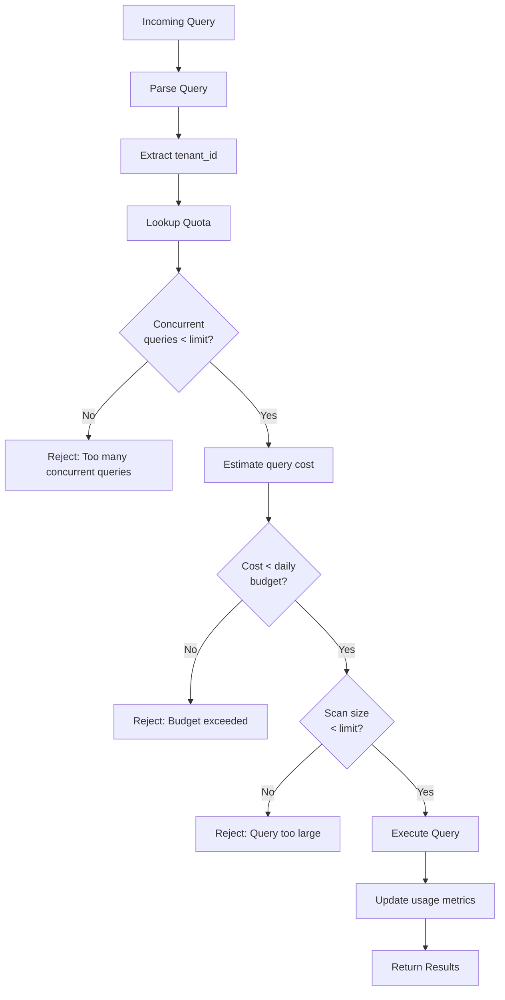
```mermaid
flowchart TB
    Query[Incoming Query]

    Query --> Parse[Parse Query]
    Parse --> Extract[Extract tenant_id]
    Extract --> Lookup[Lookup Quota]

    Lookup --> CheckConcurrent{Concurrent<br/>queries < limit?}

    CheckConcurrent -->|No| Reject1[Reject: Too many concurrent queries]
    CheckConcurrent -->|Yes| EstimateCost[Estimate query cost]

    EstimateCost --> CheckCost{Cost < daily<br/>budget?}

    CheckCost -->|No| Reject2[Reject: Budget exceeded]
    CheckCost -->|Yes| CheckScan{Scan size<br/>< limit?}

    CheckScan -->|No| Reject3[Reject: Query too large]
    CheckScan -->|Yes| Execute[Execute Query]

    Execute --> UpdateUsage[Update usage metrics]
    UpdateUsage --> Return[Return Results]
```

---

## Failure Handling

### Failure Scenarios

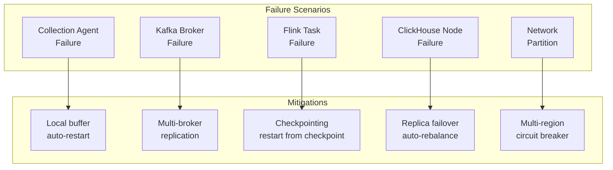
```mermaid
flowchart TB
    subgraph Failures["Failure Scenarios"]
        F1[Collection Agent<br/>Failure]
        F2[Kafka Broker<br/>Failure]
        F3[Flink Task<br/>Failure]
        F4[ClickHouse Node<br/>Failure]
        F5[Network<br/>Partition]
    end

    subgraph Mitigations["Mitigations"]
        M1[Local buffer<br/>auto-restart]
        M2[Multi-broker<br/>replication]
        M3[Checkpointing<br/>restart from checkpoint]
        M4[Replica failover<br/>auto-rebalance]
        M5[Multi-region<br/>circuit breaker]
    end

    F1 --> M1
    F2 --> M2
    F3 --> M3
    F4 --> M4
    F5 --> M5
```

### Circuit Breaker Pattern

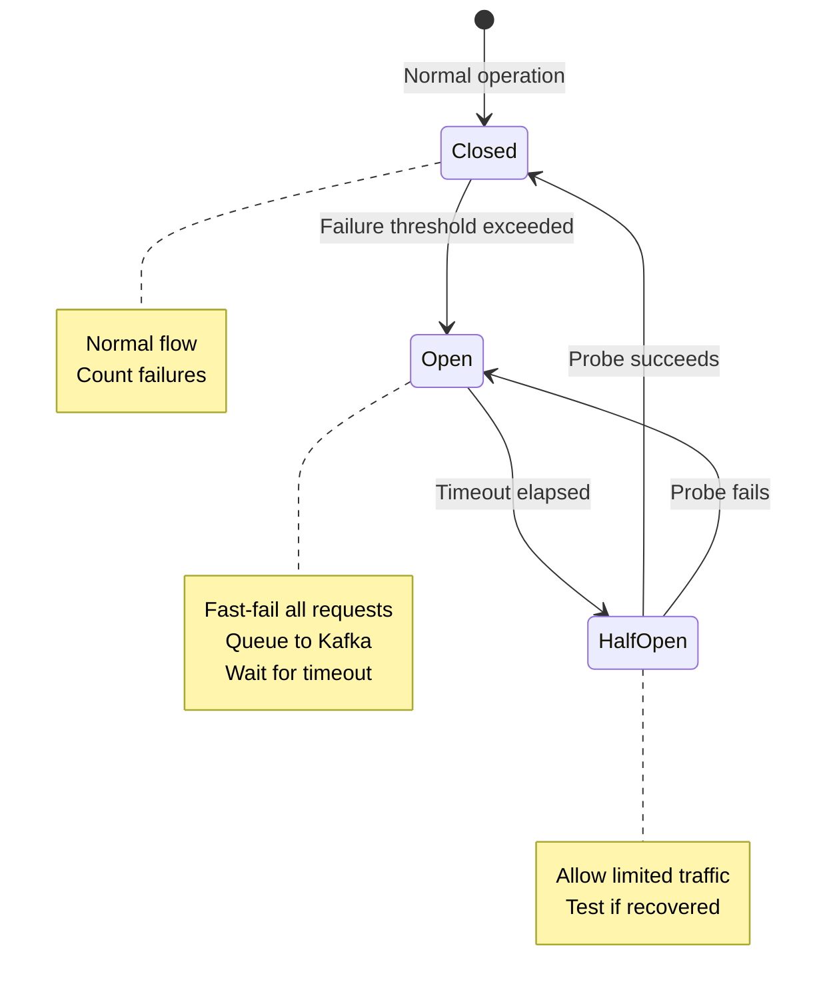
```mermaid
stateDiagram-v2
    [*] --> Closed: Normal operation

    Closed --> Open: Failure threshold exceeded
    Open --> HalfOpen: Timeout elapsed
    HalfOpen --> Closed: Probe succeeds
    HalfOpen --> Open: Probe fails

    note right of Closed
        Normal flow
        Count failures
    end note

    note right of Open
        Fast-fail all requests
        Queue to Kafka
        Wait for timeout
    end note

    note right of HalfOpen
        Allow limited traffic
        Test if recovered
    end note
```

### Backpressure Handling

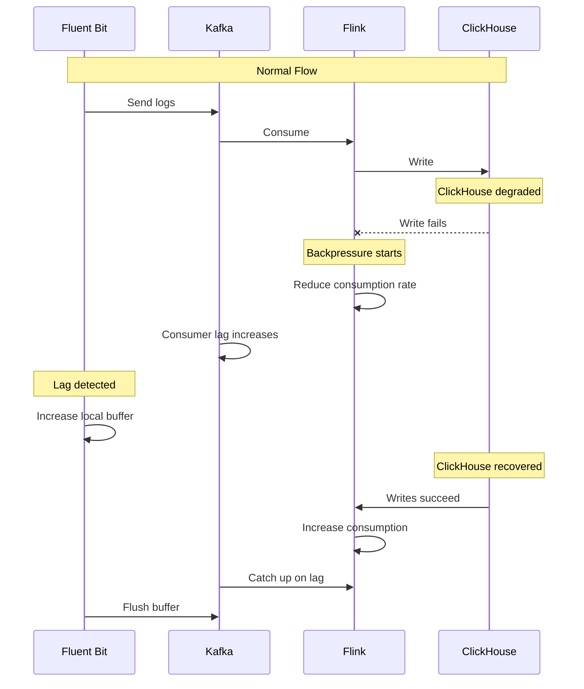
```mermaid
sequenceDiagram
    participant FB as Fluent Bit
    participant Kafka as Kafka
    participant Flink as Flink
    participant CH as ClickHouse

    Note over FB,CH: Normal Flow
    FB->>Kafka: Send logs
    Kafka->>Flink: Consume
    Flink->>CH: Write

    Note over CH: ClickHouse degraded
    CH--xFlink: Write fails

    Note over Flink: Backpressure starts
    Flink->>Flink: Reduce consumption rate
    Kafka->>Kafka: Consumer lag increases

    Note over FB: Lag detected
    FB->>FB: Increase local buffer

    Note over CH: ClickHouse recovered
    CH->>Flink: Writes succeed
    Flink->>Flink: Increase consumption
    Kafka->>Flink: Catch up on lag
    FB->>Kafka: Flush buffer
```

---

## Security & Compliance

### PII Handling Flow

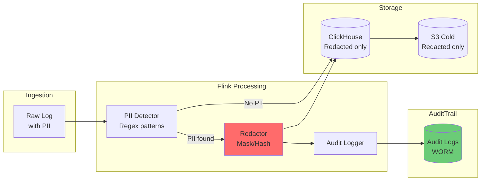
```mermaid
flowchart LR
    subgraph Ingestion
        LOG[Raw Log<br/>with PII]
    end

    subgraph Flink["Flink Processing"]
        DETECT[PII Detector<br/>Regex patterns]
        REDACT[Redactor<br/>Mask/Hash]
        AUDIT[Audit Logger]
    end

    subgraph Storage
        CH[(ClickHouse<br/>Redacted only)]
        S3[(S3 Cold<br/>Redacted only)]
    end

    subgraph AuditTrail
        AL[(Audit Logs<br/>WORM)]
    end

    LOG --> DETECT
    DETECT -->|PII found| REDACT
    DETECT -->|No PII| CH
    REDACT --> CH
    REDACT --> AUDIT
    AUDIT --> AL
    CH --> S3

    style REDACT fill:#ff6b6b
    style AL fill:#6bcb77
```

### Access Control Model

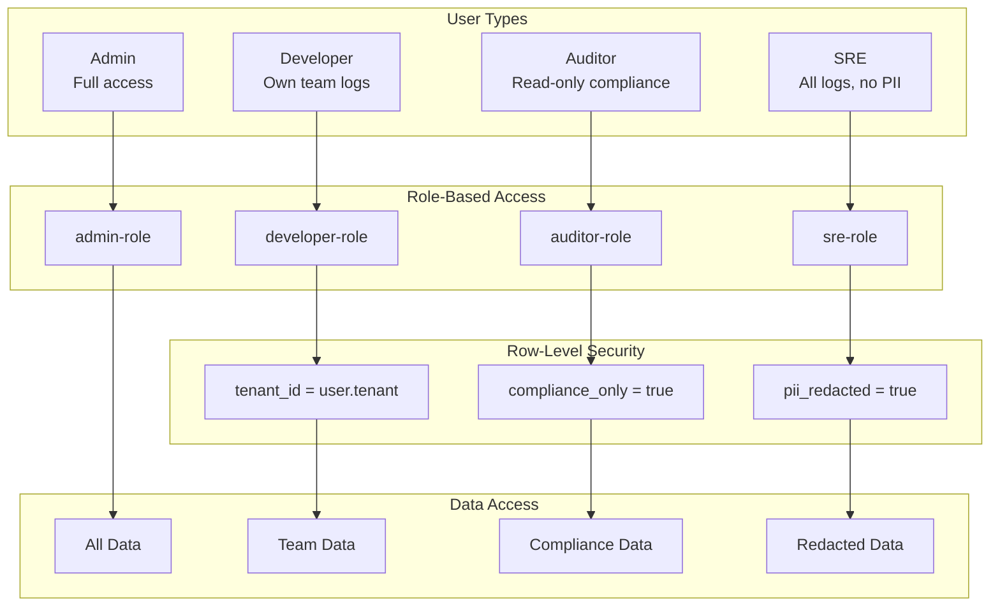
```mermaid
flowchart TB
    subgraph Users["User Types"]
        ADMIN[Admin<br/>Full access]
        DEV[Developer<br/>Own team logs]
        AUDIT[Auditor<br/>Read-only compliance]
        SRE[SRE<br/>All logs, no PII]
    end

    subgraph RBAC["Role-Based Access"]
        R1[admin-role]
        R2[developer-role]
        R3[auditor-role]
        R4[sre-role]
    end

    subgraph Policies["Row-Level Security"]
        P1[tenant_id = user.tenant]
        P2[compliance_only = true]
        P3[pii_redacted = true]
    end

    subgraph Data["Data Access"]
        ALL[All Data]
        TEAM[Team Data]
        COMP[Compliance Data]
        REDACTED[Redacted Data]
    end

    ADMIN --> R1 --> ALL
    DEV --> R2 --> P1 --> TEAM
    AUDIT --> R3 --> P2 --> COMP
    SRE --> R4 --> P3 --> REDACTED
```

### Compliance Architecture

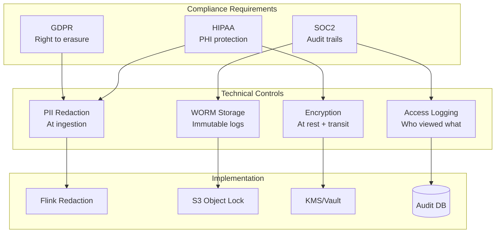
```mermaid
flowchart TB
    subgraph Requirements["Compliance Requirements"]
        GDPR[GDPR<br/>Right to erasure]
        SOC2[SOC2<br/>Audit trails]
        HIPAA[HIPAA<br/>PHI protection]
    end

    subgraph Controls["Technical Controls"]
        REDACT[PII Redaction<br/>At ingestion]
        WORM[WORM Storage<br/>Immutable logs]
        ENCRYPT[Encryption<br/>At rest + transit]
        ACCESS[Access Logging<br/>Who viewed what]
    end

    subgraph Implementation["Implementation"]
        FLINK[Flink Redaction]
        S3LOCK[S3 Object Lock]
        KMS[KMS/Vault]
        AUDITLOG[(Audit DB)]
    end

    GDPR --> REDACT --> FLINK
    SOC2 --> WORM --> S3LOCK
    SOC2 --> ACCESS --> AUDITLOG
    HIPAA --> REDACT
    HIPAA --> ENCRYPT --> KMS
```

---

## Technology Stack

### Component Selection

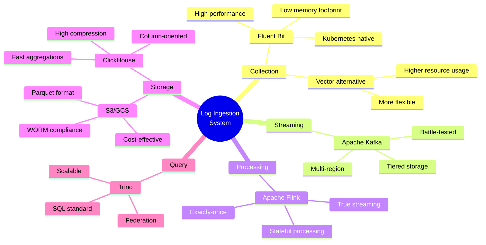
```mermaid
mindmap
    root((Log Ingestion<br/>System))
        Collection
            Fluent Bit
                Low memory footprint
                High performance
                Kubernetes native
            Vector alternative
                More flexible
                Higher resource usage
        Streaming
            Apache Kafka
                Battle-tested
                Tiered storage
                Multi-region
        Processing
            Apache Flink
                True streaming
                Exactly-once
                Stateful processing
        Storage
            ClickHouse
                Column-oriented
                High compression
                Fast aggregations
            S3/GCS
                Cost-effective
                WORM compliance
                Parquet format
        Query
            Trino
                SQL standard
                Federation
                Scalable
```

### Build vs Buy

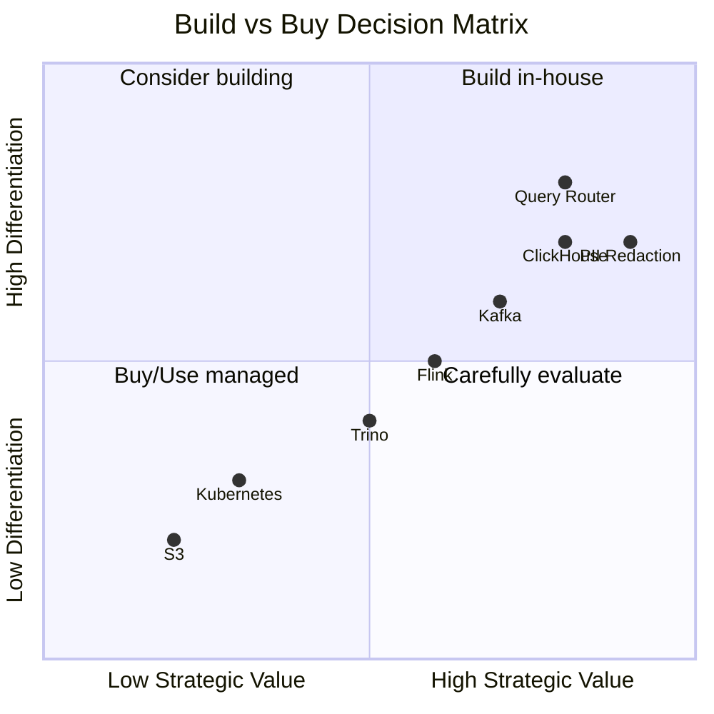
```mermaid
quadrantChart
    title Build vs Buy Decision Matrix
    x-axis Low Strategic Value --> High Strategic Value
    y-axis Low Differentiation --> High Differentiation
    quadrant-1 Build in-house
    quadrant-2 Consider building
    quadrant-3 Buy/Use managed
    quadrant-4 Carefully evaluate

    Kafka: [0.7, 0.6]
    ClickHouse: [0.8, 0.7]
    Flink: [0.6, 0.5]
    Trino: [0.5, 0.4]
    S3: [0.2, 0.2]
    Kubernetes: [0.3, 0.3]
    Query Router: [0.8, 0.8]
    PII Redaction: [0.9, 0.7]
```

---

## Deployment Architecture

### Multi-Region Deployment

```mermaid
flowchart TB
    subgraph US-East["US-East Region"]
        subgraph K8S-E["Kubernetes Cluster"]
            FB-E[Fluent Bit<br/>DaemonSet]
            FLINK-E[Flink Cluster]
            CH-E[(ClickHouse)]
            TRINO-E[Trino]
        end
        KAFKA-E[Kafka Cluster]
        S3-E[(S3)]
    end

    subgraph US-West["US-West Region"]
        subgraph K8S-W["Kubernetes Cluster"]
            FB-W[Fluent Bit<br/>DaemonSet]
            FLINK-W[Flink Cluster]
            CH-W[(ClickHouse)]
            TRINO-W[Trino]
        end
        KAFKA-W[Kafka Cluster]
        S3-W[(S3)]
    end

    subgraph EU["EU Region"]
        subgraph K8S-EU["Kubernetes Cluster"]
            FB-EU[Fluent Bit<br/>DaemonSet]
            FLINK-EU[Flink Cluster]
            CH-EU[(ClickHouse)]
            TRINO-EU[Trino]
        end
        KAFKA-EU[Kafka Cluster]
        S3-EU[(S3)]
    end

    subgraph Global["Global Services"]
        GLB[Global Load Balancer]
        META[(Global Metadata)]
    end

    KAFKA-E <-->|mirror| KAFKA-W
    KAFKA-W <-->|mirror| KAFKA-EU
    KAFKA-EU <-->|mirror| KAFKA-E

    GLB --> TRINO-E
    GLB --> TRINO-W
    GLB --> TRINO-EU
```

---

## Summary

This architecture provides:

1. **Scalability**: Handles 10 PB/day with horizontal scaling
2. **Durability**: Multi-region replication with tiered storage
3. **Query Flexibility**: Federated queries across all storage tiers
4. **Multi-tenancy**: Isolated quotas and dedicated resources
5. **Compliance**: PII redaction and WORM storage for audit trails
6. **Resilience**: Circuit breakers, backpressure, and graceful degradation
