# Capacity Planning

## Overview

This document details the capacity planning calculations for the 10 PB/day log ingestion system.

---

## Table of Contents

1. [Throughput Calculations](#throughput-calculations)
2. [Storage Requirements](#storage-requirements)
3. [Compute Requirements](#compute-requirements)
4. [Network Requirements](#network-requirements)
5. [Cost Estimates](#cost-estimates)

---

## Throughput Calculations

### Daily Volume Breakdown

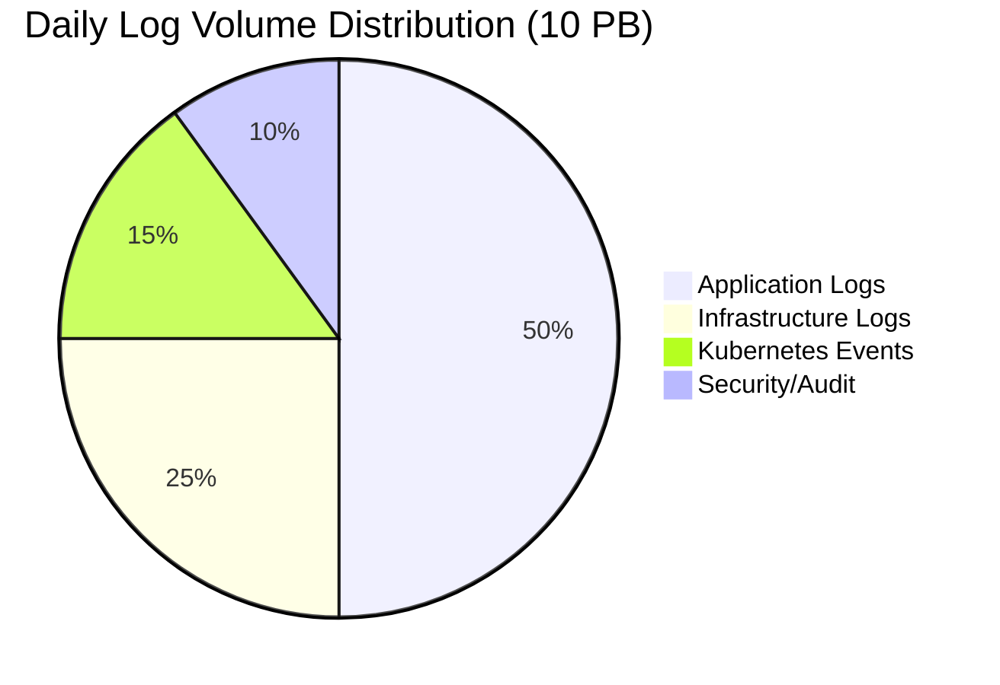

### Throughput Metrics

| Metric | Value | Calculation |
|--------|-------|-------------|
| Daily Volume | 10 PB | Requirement |
| Hourly Average | 416.67 TB | 10 PB / 24 |
| Per-Second Average | 115.74 GB/s | 10 PB / 86,400 |
| Peak Ratio | 3x | Industry standard |
| Peak Throughput | 347.22 GB/s | 115.74 × 3 |

### Time-of-Day Traffic Pattern

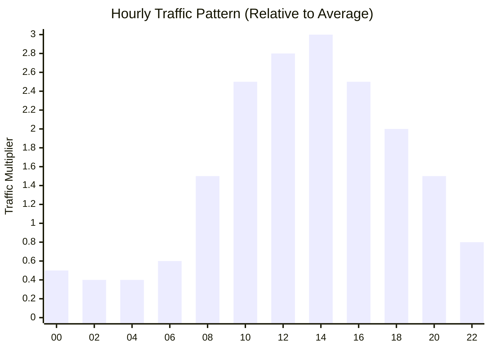

---

## Storage Requirements

### Compression Analysis

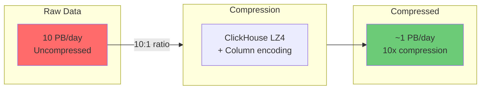

### Storage by Tier

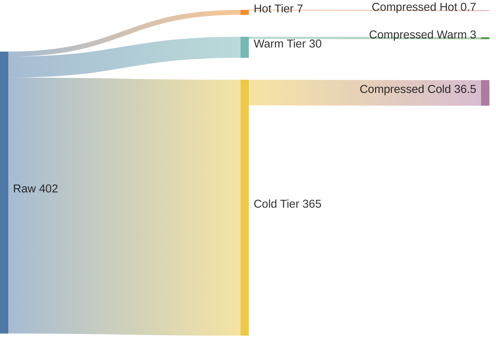

### Detailed Storage Calculations

| Tier | Retention | Raw Volume | Compression | Compressed Volume |
|------|-----------|------------|-------------|-------------------|
| **Hot** | 7 days | 70 PB | 10x | 7 PB |
| **Warm** | 30 days | 300 PB | 10x | 30 PB |
| **Cold** | 365 days | 3.65 EB | 10x | 365 PB |

### Storage Growth Projection

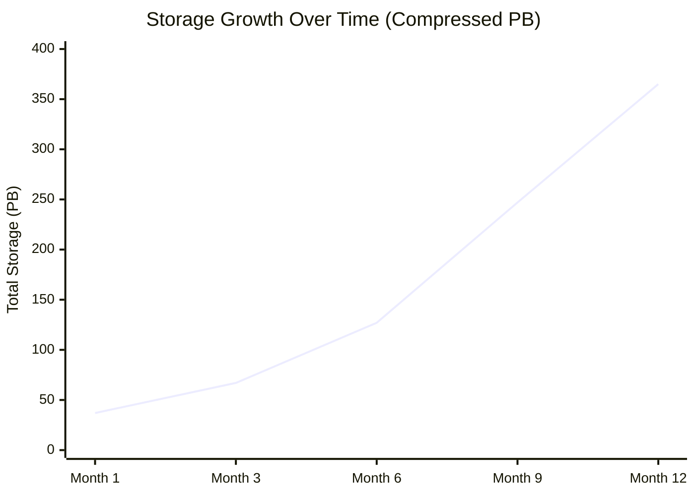

### ClickHouse Storage Layout

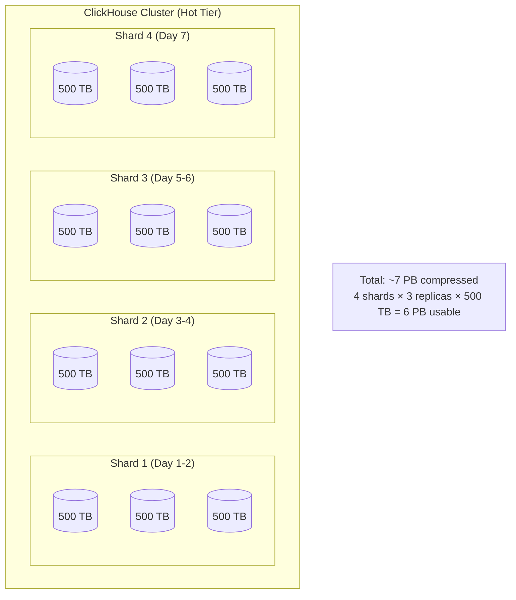

---

## Compute Requirements

### Kafka Cluster Sizing

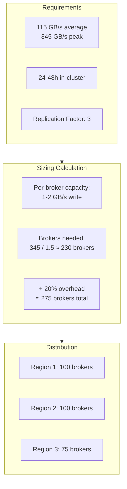

### Kafka Broker Specifications

| Component | Specification | Quantity per Broker |
|-----------|--------------|---------------------|
| **CPU** | 32 cores | 1 |
| **Memory** | 128 GB | 1 |
| **Storage** | NVMe SSD | 4 TB × 6 drives |
| **Network** | 25 Gbps | Dual-attached |

### Flink Cluster Sizing

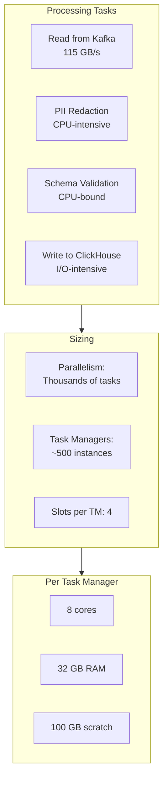

### ClickHouse Cluster Sizing

```mermaid
flowchart TB
    subgraph HotTier["Hot Tier Requirements"]
        STORAGE_H[7 PB storage]
        WRITE_H[115 GB/s write]
        READ_H[1000+ QPS]
    end

    subgraph Nodes["Node Calculation"]
        PER_NODE[Per-node capacity:<br/>- 50 TB storage<br/>- 2 GB/s write<br/>- 50 QPS]
        TOTAL_NODES[Nodes needed:<br/>max(7000/50, 115/2, 1000/50)<br/>= max(140, 58, 20)<br/>= 140 nodes minimum]
    end

    subgraph Config["Configuration"]
        SHARDS[Shards: 50]
        REPLICAS[Replicas: 3]
        TOTAL[Total: 150 nodes<br/>(50 × 3)]
    end

    HotTier --> Nodes --> Config
```

### ClickHouse Node Specifications

| Component | Hot Tier | Warm Tier |
|-----------|----------|-----------|
| **CPU** | 64 cores | 32 cores |
| **Memory** | 512 GB | 256 GB |
| **Storage** | 12 × 4 TB NVMe | 12 × 8 TB SSD |
| **Network** | 50 Gbps | 25 Gbps |

---

## Network Requirements

### Bandwidth by Component

```mermaid
flowchart LR
    subgraph Ingress["Ingress Traffic"]
        COLLECT[Collection Layer<br/>115 GB/s]
    end

    subgraph Internal["Internal Traffic"]
        K_REP[Kafka Replication<br/>230 GB/s (RF=3)]
        CH_REP[ClickHouse Replication<br/>230 GB/s (RF=3)]
        FLINK_K[Flink ↔ Kafka<br/>230 GB/s]
        FLINK_CH[Flink ↔ ClickHouse<br/>115 GB/s]
    end

    subgraph Egress["Egress Traffic"]
        QUERY[Query Results<br/>~10 GB/s]
        COLD[Cold Tier Export<br/>~15 GB/s]
    end

    COLLECT --> K_REP
    K_REP --> FLINK_K
    FLINK_K --> FLINK_CH
    FLINK_CH --> CH_REP
    CH_REP --> QUERY
    CH_REP --> COLD
```

### Total Network Capacity

| Traffic Type | Bandwidth | Notes |
|-------------|-----------|-------|
| **Ingestion** | 115 GB/s | From collectors to Kafka |
| **Kafka Internal** | 345 GB/s | Replication (3x) |
| **Processing** | 230 GB/s | Flink read + write |
| **ClickHouse** | 345 GB/s | Replication (3x) |
| **Cross-Region** | ~50 GB/s | Kafka MirrorMaker |
| **Query Egress** | ~10 GB/s | Query results |

---

## Cost Estimates

### Monthly Cost Breakdown

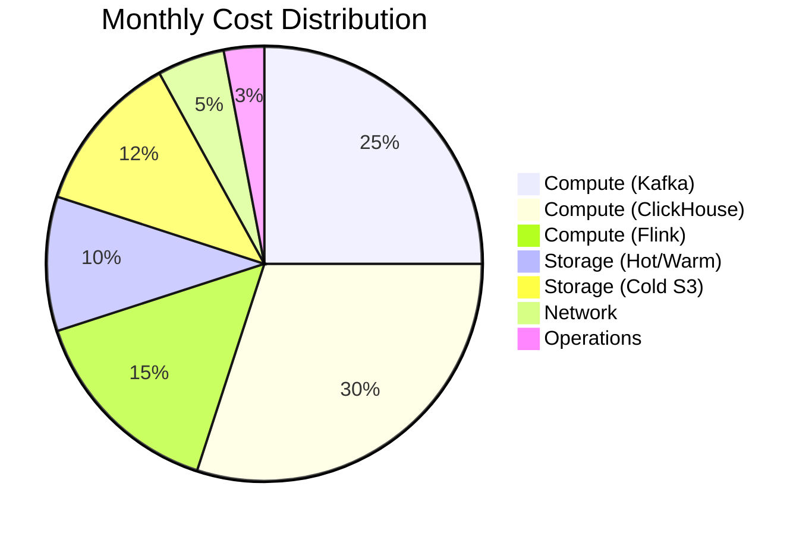

### Detailed Cost Estimate (AWS)

| Component | Quantity | Unit Cost | Monthly Cost |
|-----------|----------|-----------|--------------|
| **Kafka Brokers** | 275 × i3en.6xlarge | $1.90/hr | $380,000 |
| **ClickHouse Hot** | 150 × i3en.12xlarge | $4.00/hr | $430,000 |
| **ClickHouse Warm** | 100 × d3en.12xlarge | $3.50/hr | $250,000 |
| **Flink Cluster** | 500 × m5.2xlarge | $0.38/hr | $140,000 |
| **Trino Cluster** | 50 × r5.4xlarge | $1.00/hr | $36,000 |
| **S3 Cold Storage** | 365 PB | $21/TB/month | $7,665,000 |
| **Network Transfer** | ~500 TB/month | $0.02/GB | $10,000 |
| **Total** | | | **~$8.9M/month** |

### Cost Optimization Strategies

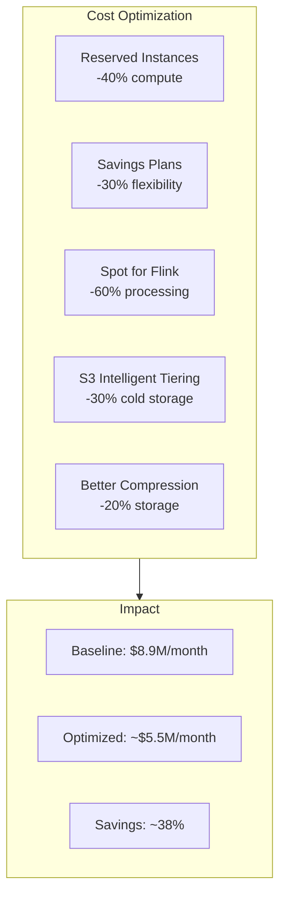

---

## Scaling Guidelines

### Horizontal Scaling Thresholds

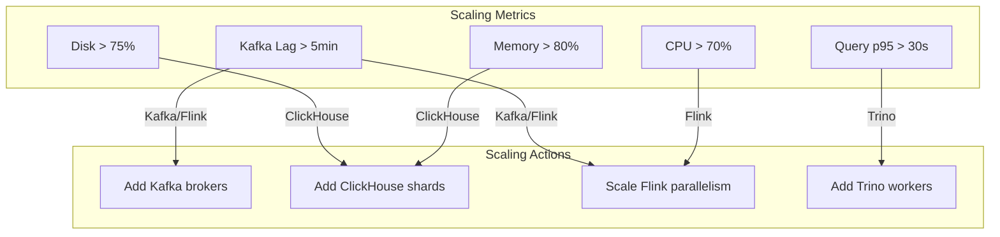

### Scaling Formula

| Component | Scale When | Add |
|-----------|-----------|-----|
| **Kafka** | Broker CPU > 70% | +10 brokers |
| **Flink** | Consumer lag > 5min | +50 task managers |
| **ClickHouse** | Query p95 > 10s | +1 shard (3 nodes) |
| **Trino** | Queue depth > 100 | +10 workers |

---

## Resource Summary

### Total Infrastructure

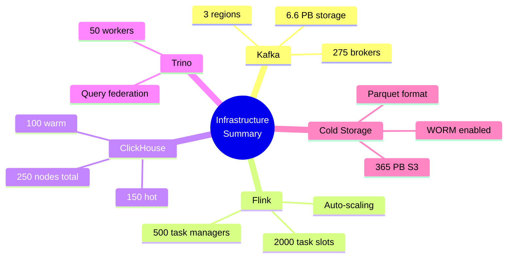

### Capacity Buffer

| Component | Current Need | Provisioned | Buffer |
|-----------|-------------|-------------|--------|
| **Ingestion** | 115 GB/s | 200 GB/s | 74% |
| **Hot Storage** | 7 PB | 9 PB | 29% |
| **Query** | 1000 QPS | 2500 QPS | 150% |

---

## Growth Planning

### 24-Month Projection

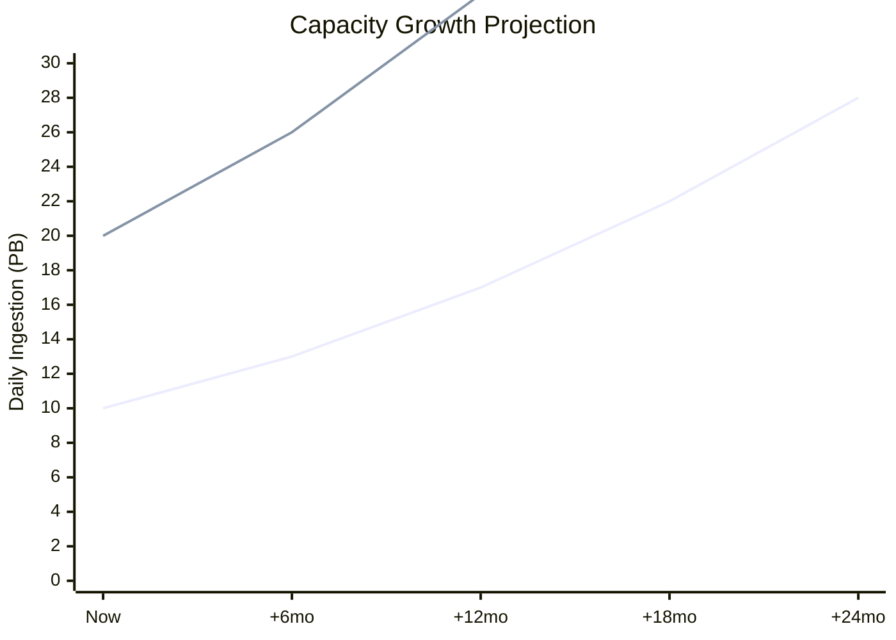

*Lines represent baseline (1.3x/year) and high (1.5x/year) growth scenarios*

### Capacity Expansion Plan

| Timeframe | Trigger | Action |
|-----------|---------|--------|
| **Now** | Baseline | Deploy initial capacity |
| **+6 months** | 30% growth | Add 2 ClickHouse shards |
| **+12 months** | 70% growth | Add 50 Kafka brokers |
| **+18 months** | 120% growth | Second cluster deployment |
| **+24 months** | 180% growth | Third region expansion |
