# ClickHouse Component Design

## Overview

ClickHouse serves as the primary storage engine for hot and warm tier data, providing columnar storage with excellent compression and fast analytical queries for the log ingestion system.

---

## Architecture

### Cluster Topology

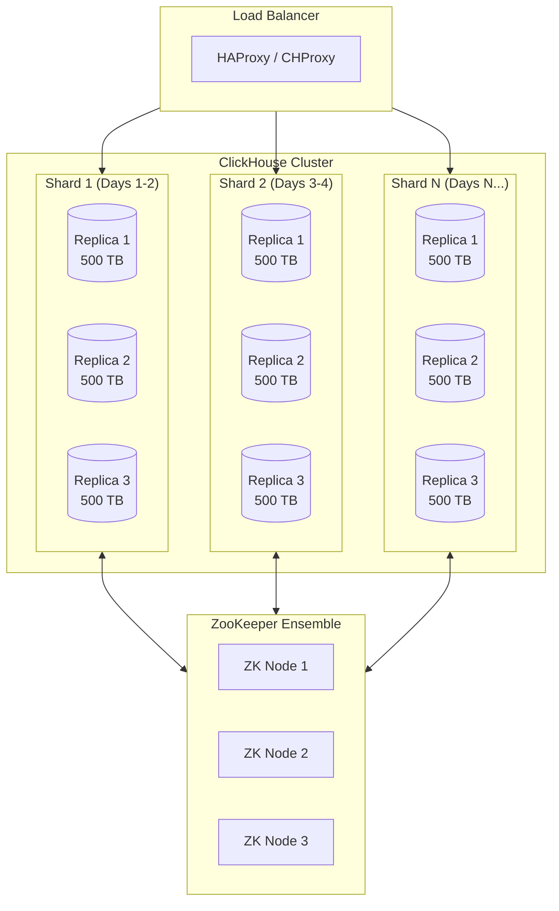

### Shard Distribution Strategy

```mermaid
flowchart LR
    subgraph Incoming["Incoming Data"]
        FLINK[Flink Writer]
    end

    subgraph Router["Shard Router"]
        HASH[Sharding Key:<br/>sipHash64(tenant_id, service)]
    end

    subgraph Shards["Distributed Table"]
        S1[Shard 1<br/>tenant_id hash 0-20]
        S2[Shard 2<br/>tenant_id hash 21-40]
        S3[Shard 3<br/>tenant_id hash 41-60]
        SN[Shard N<br/>tenant_id hash 61-100]
    end

    FLINK --> Router
    Router --> S1
    Router --> S2
    Router --> S3
    Router --> SN
```

---

## Schema Design

### Table Hierarchy

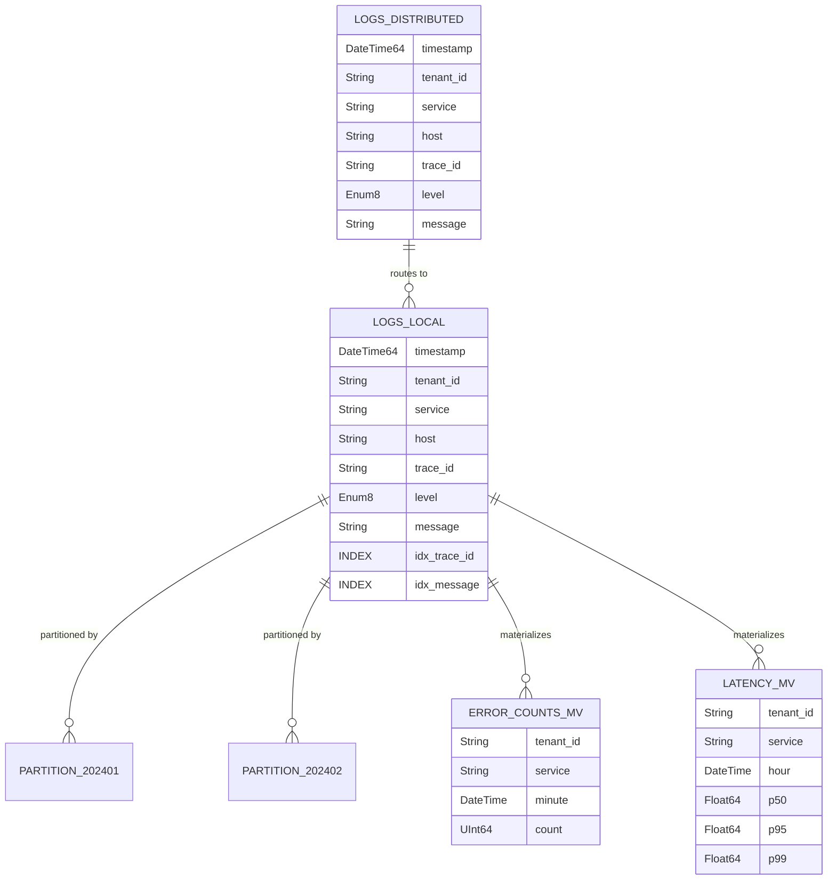

### Primary Table Schema

```sql
-- Local table on each shard
CREATE TABLE logs_local ON CLUSTER '{cluster}'
(
    -- Core fields
    timestamp DateTime64(3, 'UTC'),
    tenant_id LowCardinality(String),
    service LowCardinality(String),
    host LowCardinality(String),
    trace_id String,
    span_id String,
    level Enum8('DEBUG' = 0, 'INFO' = 1, 'WARN' = 2, 'ERROR' = 3, 'FATAL' = 4),

    -- Log content
    message String,

    -- Structured fields (nullable for schema flexibility)
    request_id Nullable(String),
    user_id Nullable(String),
    duration_ms Nullable(Float64),
    status_code Nullable(UInt16),
    method Nullable(LowCardinality(String)),
    path Nullable(String),
    error_type Nullable(LowCardinality(String)),
    error_message Nullable(String),

    -- Dynamic fields as Map
    labels Map(String, String),

    -- Ingestion metadata
    _ingested_at DateTime64(3) DEFAULT now64(3),

    -- Indexes for common query patterns
    INDEX idx_trace_id trace_id TYPE bloom_filter GRANULARITY 1,
    INDEX idx_span_id span_id TYPE bloom_filter GRANULARITY 1,
    INDEX idx_request_id request_id TYPE bloom_filter GRANULARITY 1,
    INDEX idx_user_id user_id TYPE bloom_filter GRANULARITY 1,
    INDEX idx_message message TYPE tokenbf_v1(32768, 3, 0) GRANULARITY 1,
    INDEX idx_error_message error_message TYPE tokenbf_v1(16384, 3, 0) GRANULARITY 1
)
ENGINE = ReplicatedMergeTree('/clickhouse/tables/{shard}/logs_local', '{replica}')
PARTITION BY toYYYYMMDD(timestamp)
ORDER BY (tenant_id, service, timestamp, trace_id)
TTL timestamp + INTERVAL 7 DAY
SETTINGS index_granularity = 8192;

-- Distributed table for queries
CREATE TABLE logs ON CLUSTER '{cluster}'
AS logs_local
ENGINE = Distributed('{cluster}', currentDatabase(), logs_local, sipHash64(tenant_id, service));
```

### Materialized Views

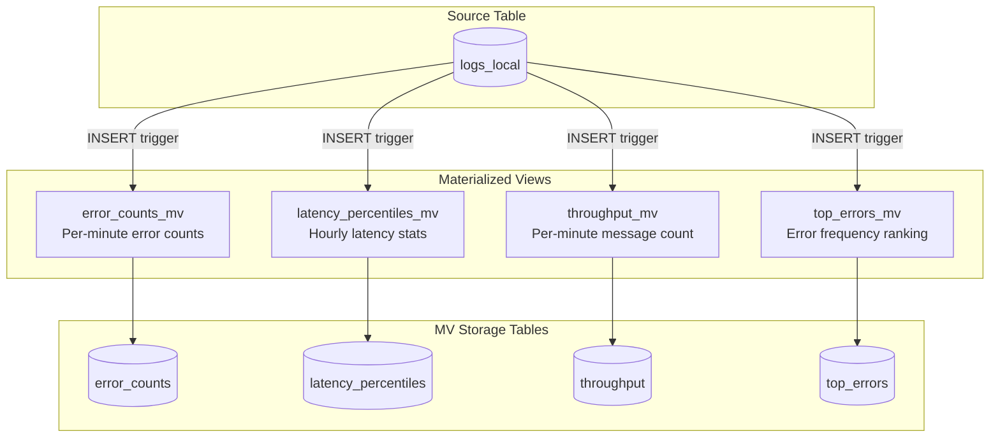

```sql
-- Error counts per minute
CREATE MATERIALIZED VIEW error_counts_mv ON CLUSTER '{cluster}'
TO error_counts
AS SELECT
    tenant_id,
    service,
    toStartOfMinute(timestamp) AS minute,
    count() AS error_count,
    uniqExact(trace_id) AS unique_traces
FROM logs_local
WHERE level >= 'ERROR'
GROUP BY tenant_id, service, minute;

CREATE TABLE error_counts ON CLUSTER '{cluster}'
(
    tenant_id LowCardinality(String),
    service LowCardinality(String),
    minute DateTime,
    error_count AggregateFunction(count),
    unique_traces AggregateFunction(uniqExact, String)
)
ENGINE = ReplicatedAggregatingMergeTree('/clickhouse/tables/{shard}/error_counts', '{replica}')
PARTITION BY toYYYYMM(minute)
ORDER BY (tenant_id, service, minute);

-- Latency percentiles per hour
CREATE MATERIALIZED VIEW latency_percentiles_mv ON CLUSTER '{cluster}'
TO latency_percentiles
AS SELECT
    tenant_id,
    service,
    toStartOfHour(timestamp) AS hour,
    quantileState(0.5)(duration_ms) AS p50,
    quantileState(0.95)(duration_ms) AS p95,
    quantileState(0.99)(duration_ms) AS p99,
    avg(duration_ms) AS avg_duration,
    max(duration_ms) AS max_duration
FROM logs_local
WHERE duration_ms IS NOT NULL
GROUP BY tenant_id, service, hour;
```

---

## Data Lifecycle

### Partition Management

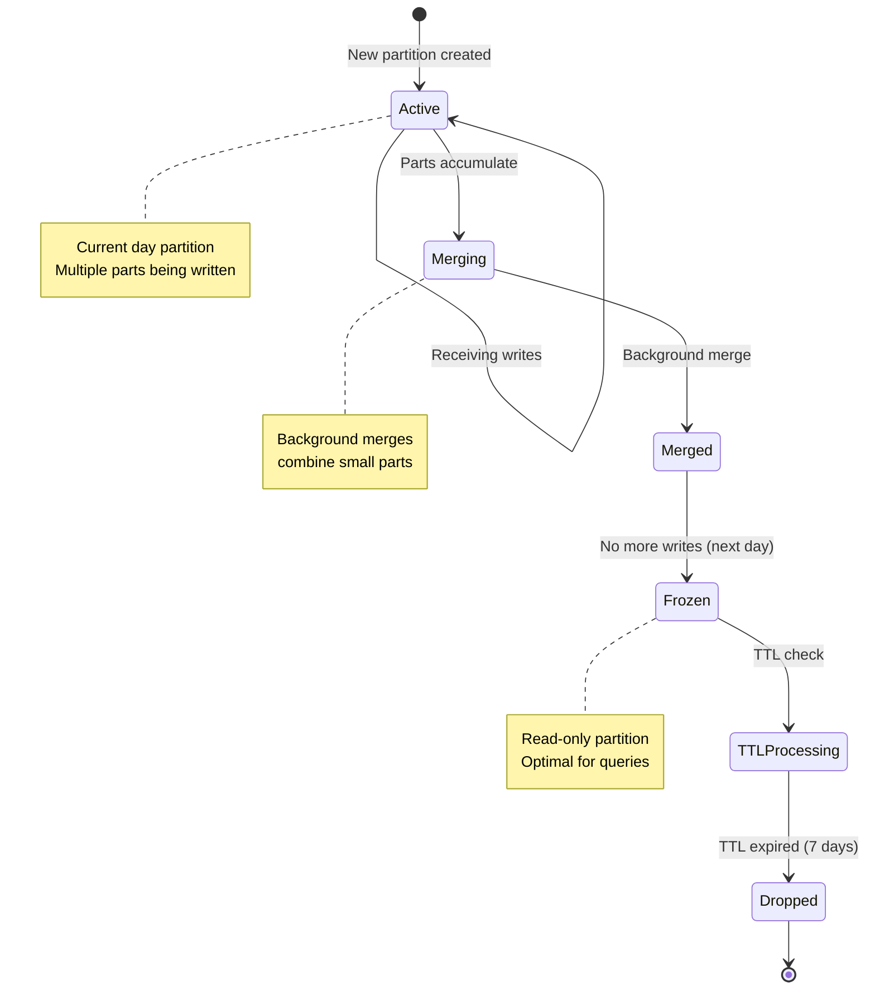

### Part Merging

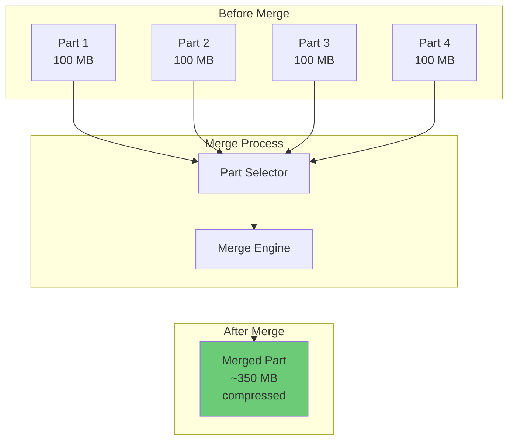

---

## Query Patterns

### Query Routing

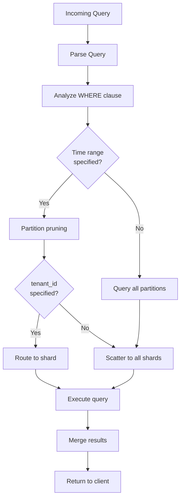

### Common Query Patterns

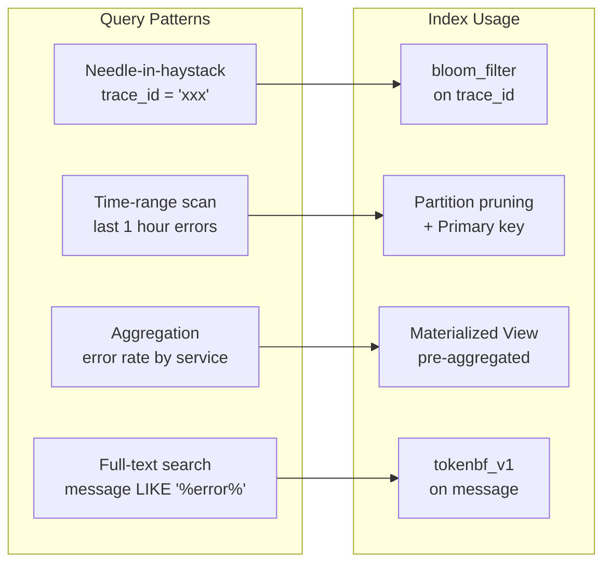

### Query Examples

```sql
-- Needle in haystack (uses bloom filter)
SELECT *
FROM logs
WHERE trace_id = 'abc-123-def-456'
  AND timestamp >= now() - INTERVAL 1 DAY
ORDER BY timestamp;

-- Time-range with aggregation (uses partition pruning + MV)
SELECT
    service,
    countMerge(error_count) AS errors,
    uniqMerge(unique_traces) AS affected_traces
FROM error_counts
WHERE tenant_id = 'acme-corp'
  AND minute >= now() - INTERVAL 1 HOUR
GROUP BY service
ORDER BY errors DESC;

-- Full-text search (uses tokenbf index)
SELECT timestamp, service, message
FROM logs
WHERE tenant_id = 'acme-corp'
  AND timestamp >= now() - INTERVAL 1 HOUR
  AND hasToken(message, 'NullPointerException')
LIMIT 100;

-- Complex aggregation
SELECT
    toStartOfMinute(timestamp) AS minute,
    service,
    countIf(level = 'ERROR') AS errors,
    countIf(level = 'WARN') AS warnings,
    quantile(0.95)(duration_ms) AS p95_latency
FROM logs
WHERE tenant_id = 'acme-corp'
  AND timestamp >= now() - INTERVAL 6 HOUR
GROUP BY minute, service
ORDER BY minute, service;
```

---

## Replication

### Replication Flow

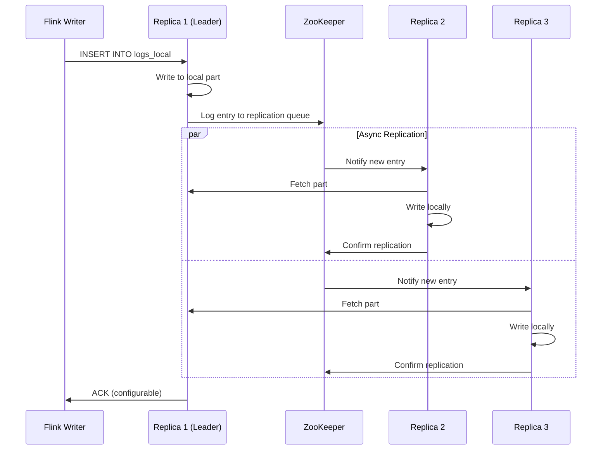

### Replica Failover

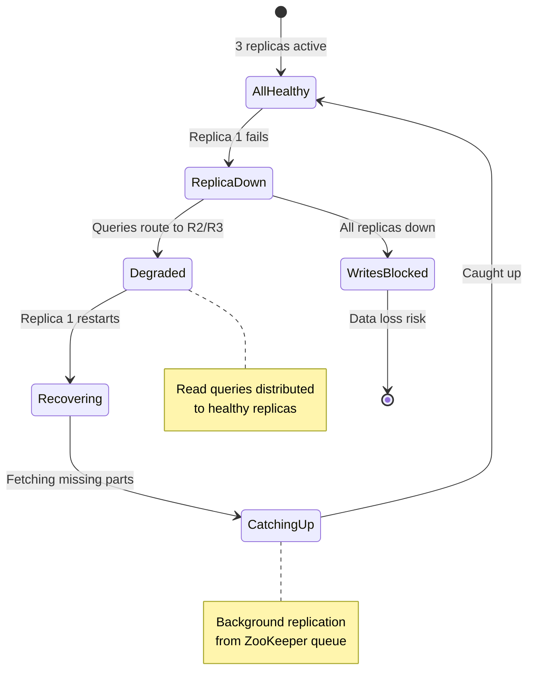

---

## Performance Optimization

### Index Types

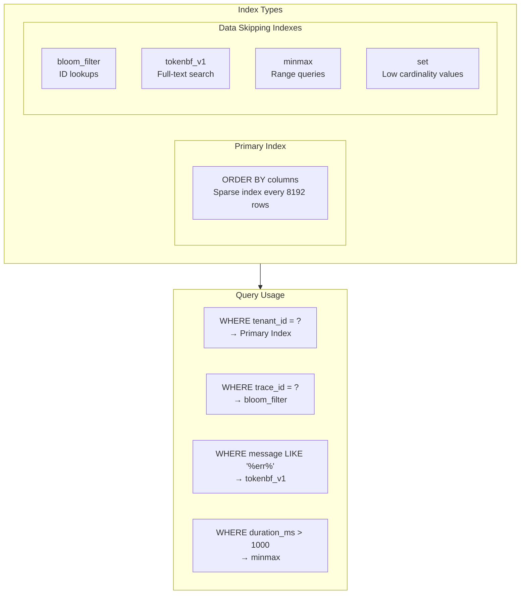

### Compression Settings

| Column Type | Codec | Compression Ratio |
|-------------|-------|-------------------|
| **timestamp** | Delta + LZ4 | 50:1 |
| **tenant_id** | LowCardinality + LZ4 | 100:1 |
| **service** | LowCardinality + LZ4 | 100:1 |
| **level** | Enum8 + LZ4 | 200:1 |
| **message** | ZSTD(3) | 5:1 |
| **trace_id** | LZ4 | 3:1 |
| **labels (Map)** | ZSTD(3) | 8:1 |

### Write Optimization

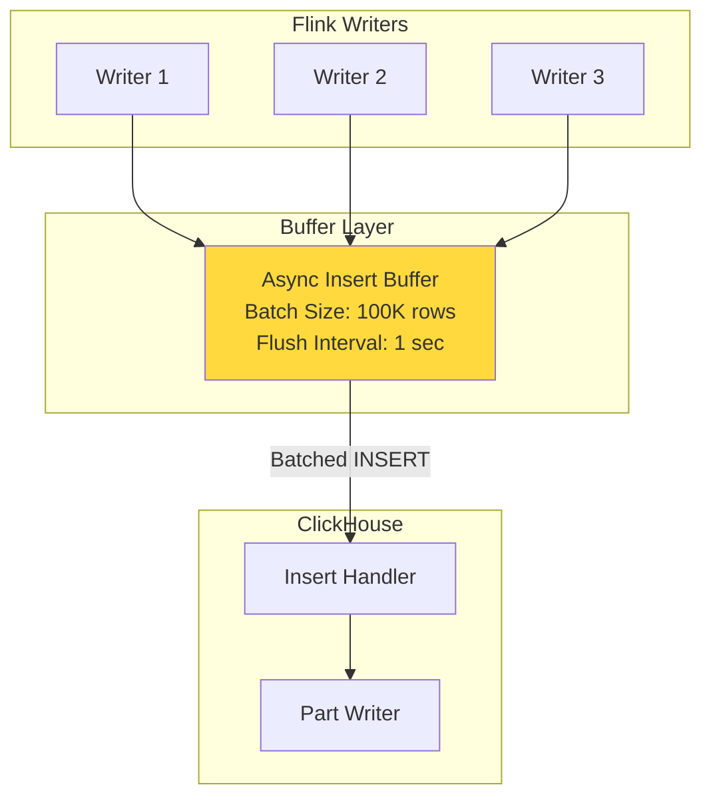

---

## Monitoring

### Key Metrics

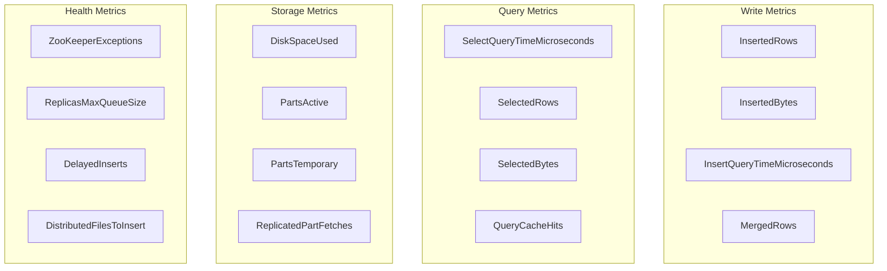

### Alert Thresholds

| Metric | Warning | Critical |
|--------|---------|----------|
| **ReplicationLag** | > 100 parts | > 1000 parts |
| **MergedPartSize** | > 100 GB | > 500 GB |
| **DelayedInserts** | > 100 | > 1000 |
| **QueryLatency p95** | > 10s | > 30s |
| **DiskUsage** | > 70% | > 85% |
| **ZooKeeperExceptions** | > 0 | > 10/min |

---

## Scaling Operations

### Adding a Shard

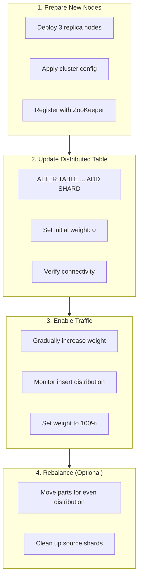

### Rolling Upgrade

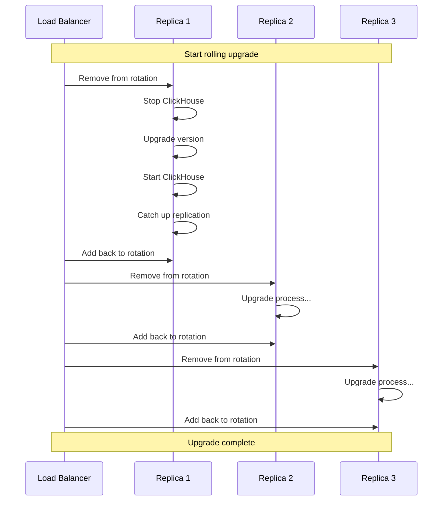

---

## Configuration Reference

### Server Settings

| Parameter | Value | Description |
|-----------|-------|-------------|
| `max_concurrent_queries` | 200 | Per-server query limit |
| `max_threads` | 64 | Query parallelism |
| `max_memory_usage` | 400 GB | Per-query memory limit |
| `max_bytes_before_external_sort` | 50 GB | Before spilling to disk |
| `max_insert_block_size` | 1,048,576 | Rows per insert block |
| `async_insert` | 1 | Enable async inserts |
| `async_insert_busy_timeout_ms` | 1000 | Batch wait time |
| `async_insert_max_data_size` | 10485760 | 10 MB batch size |

### MergeTree Settings

| Parameter | Value | Description |
|-----------|-------|-------------|
| `index_granularity` | 8192 | Rows per index entry |
| `min_bytes_for_wide_part` | 10485760 | 10 MB min for wide parts |
| `merge_with_ttl_timeout` | 14400 | TTL merge interval (4h) |
| `max_parts_in_total` | 100000 | Max parts before blocking |
| `parts_to_delay_insert` | 300 | Throttle inserts threshold |
| `parts_to_throw_insert` | 600 | Block inserts threshold |
