# Cold Storage Component Design

## Overview

The cold storage tier provides long-term (1 year) retention of log data using S3/GCS with Parquet format. This tier is optimized for cost efficiency and compliance requirements while maintaining query capability through Trino/Athena.

---

## Architecture

### Storage Hierarchy

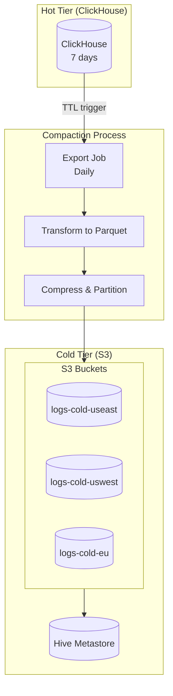

### Multi-Region Layout

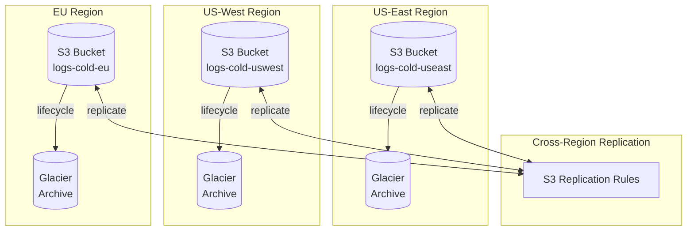

---

## Data Format

### Parquet Schema

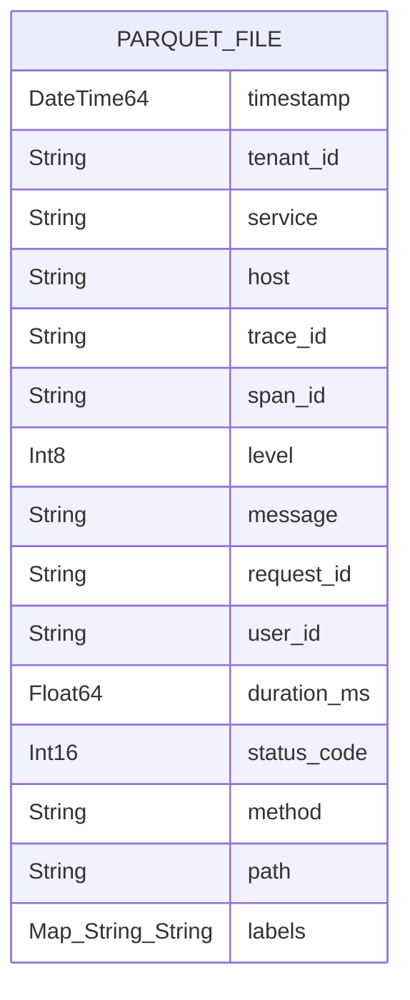

### Partition Strategy

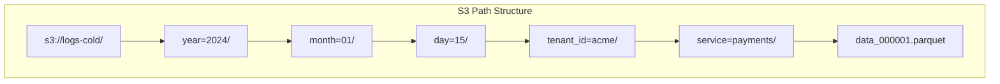

### Partition Example

```
s3://logs-cold-useast/
└── logs/
    └── year=2024/
        └── month=01/
            └── day=15/
                ├── tenant_id=acme-corp/
                │   ├── service=payment-service/
                │   │   ├── part-00000.parquet
                │   │   ├── part-00001.parquet
                │   │   └── _SUCCESS
                │   └── service=user-service/
                │       └── part-00000.parquet
                └── tenant_id=globex/
                    └── service=inventory/
                        └── part-00000.parquet
```

---

## Compaction Process

### Compaction Pipeline

```mermaid
flowchart TB
    subgraph Source["Source: ClickHouse"]
        CH[(logs_local<br/>Day N-7 partition)]
    end

    subgraph Export["Export Job"]
        QUERY[Query partition]
        BUFFER[Buffer in memory]
        BATCH[Batch by tenant/service]
    end

    subgraph Transform["Transform"]
        CONVERT[Convert to Parquet]
        COMPRESS[Compress (ZSTD)]
        PARTITION[Write partitioned]
    end

    subgraph Target["Target: S3"]
        S3[(S3 Bucket)]
        META[Update Hive Metastore]
    end

    Source --> Export --> Transform --> Target

    META --> S3
```

### Compaction Schedule

```mermaid
gantt
    title Daily Compaction Schedule
    dateFormat  HH:mm
    axisFormat %H:%M

    section Export
    Query ClickHouse     :a1, 02:00, 30m
    Buffer & Batch       :a2, after a1, 30m

    section Transform
    Convert to Parquet   :b1, after a2, 1h
    Compress ZSTD        :b2, after b1, 30m

    section Load
    Upload to S3         :c1, after b2, 30m
    Update Metastore     :c2, after c1, 15m
    Verify               :c3, after c2, 15m
```

### Compaction Job Configuration

```yaml
# compaction-job.yaml
apiVersion: batch/v1
kind: CronJob
metadata:
  name: log-compaction
  namespace: data-pipeline
spec:
  schedule: "0 2 * * *"  # Daily at 2 AM
  concurrencyPolicy: Forbid
  jobTemplate:
    spec:
      template:
        spec:
          containers:
          - name: compaction
            image: log-compaction:latest
            env:
            - name: CLICKHOUSE_HOST
              value: clickhouse-hot
            - name: S3_BUCKET
              value: logs-cold-useast
            - name: PARTITION_DATE
              value: "$(date -d 'yesterday' +%Y-%m-%d)"
            resources:
              requests:
                memory: "8Gi"
                cpu: "2"
              limits:
                memory: "16Gi"
                cpu: "4"
          restartPolicy: OnFailure
```

---

## Storage Classes

### Lifecycle Management

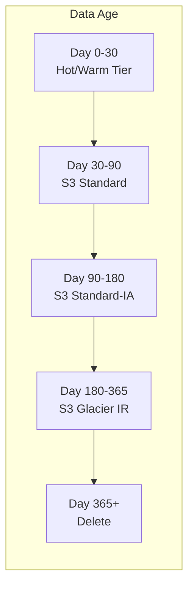

### S3 Lifecycle Policy

```json
{
  "Rules": [
    {
      "ID": "TransitionToIA",
      "Status": "Enabled",
      "Prefix": "logs/",
      "Transitions": [
        {
          "Days": 90,
          "StorageClass": "STANDARD_IA"
        },
        {
          "Days": 180,
          "StorageClass": "GLACIER_IR"
        }
      ],
      "Expiration": {
        "Days": 365
      }
    }
  ]
}
```

### Storage Class Comparison

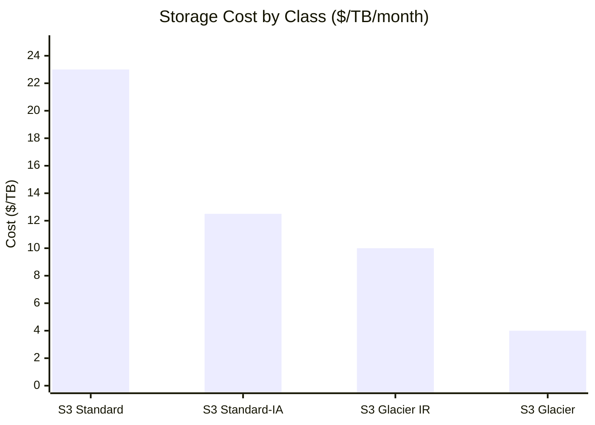

| Storage Class | Cost ($/TB/month) | Retrieval Time | Use Case |
|---------------|-------------------|----------------|----------|
| **S3 Standard** | $23 | Instant | Days 30-90 |
| **S3 Standard-IA** | $12.50 | Instant | Days 90-180 |
| **S3 Glacier IR** | $10 | Minutes | Days 180-365 |
| **S3 Glacier** | $4 | Hours | Archival (if needed) |

---

## Compliance Features

### WORM (Write-Once-Read-Many)

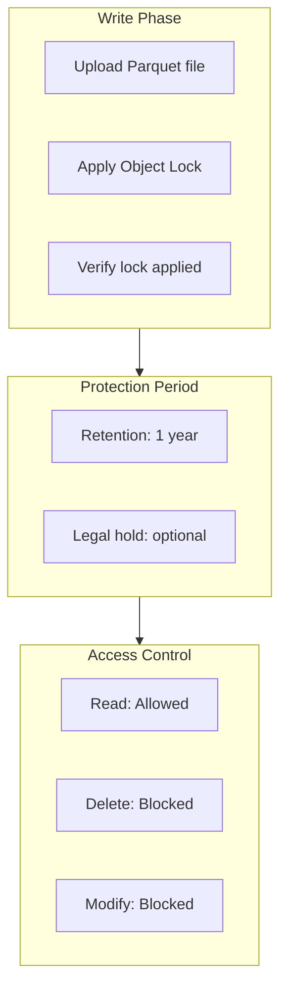

### S3 Object Lock Configuration

```bash
# Enable Object Lock on bucket (at creation time)
aws s3api create-bucket \
  --bucket logs-cold-compliance \
  --object-lock-enabled-for-bucket

# Set default retention
aws s3api put-object-lock-configuration \
  --bucket logs-cold-compliance \
  --object-lock-configuration '{
    "ObjectLockEnabled": "Enabled",
    "Rule": {
      "DefaultRetention": {
        "Mode": "COMPLIANCE",
        "Years": 1
      }
    }
  }'
```

### Audit Trail

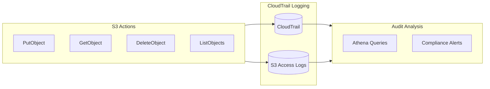

---

## Query Access

### Hive Metastore

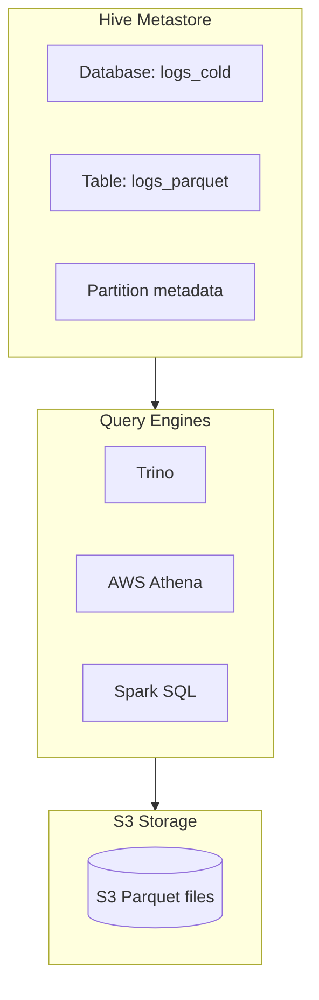

### Table Definition

```sql
-- Hive DDL for cold storage table
CREATE EXTERNAL TABLE logs_cold.logs_parquet (
    timestamp TIMESTAMP,
    tenant_id STRING,
    service STRING,
    host STRING,
    trace_id STRING,
    span_id STRING,
    level TINYINT,
    message STRING,
    request_id STRING,
    user_id STRING,
    duration_ms DOUBLE,
    status_code SMALLINT,
    method STRING,
    path STRING,
    labels MAP<STRING, STRING>
)
PARTITIONED BY (
    year INT,
    month INT,
    day INT,
    tenant_partition STRING,
    service_partition STRING
)
STORED AS PARQUET
LOCATION 's3://logs-cold-useast/logs/'
TBLPROPERTIES (
    'parquet.compression' = 'ZSTD',
    'projection.enabled' = 'true',
    'projection.year.type' = 'integer',
    'projection.year.range' = '2024,2030',
    'projection.month.type' = 'integer',
    'projection.month.range' = '1,12',
    'projection.day.type' = 'integer',
    'projection.day.range' = '1,31'
);
```

### Query Examples

```sql
-- Query cold data via Trino
SELECT
    date_trunc('hour', timestamp) as hour,
    service,
    count(*) as count,
    approx_percentile(duration_ms, 0.95) as p95_latency
FROM hive_cold.logs_cold.logs_parquet
WHERE year = 2024
  AND month = 1
  AND day BETWEEN 1 AND 15
  AND tenant_partition = 'acme-corp'
  AND level >= 2  -- WARN and above
GROUP BY 1, 2
ORDER BY 1, 2;

-- Full-text search in cold data
SELECT timestamp, service, message
FROM hive_cold.logs_cold.logs_parquet
WHERE year = 2024
  AND month = 1
  AND regexp_like(message, '(?i)error|exception|failed')
LIMIT 100;
```

---

## Data Recovery

### Recovery Scenarios

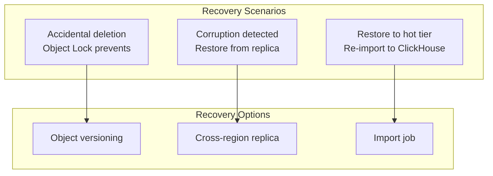

### Re-Import to ClickHouse

```sql
-- Re-import specific data from cold storage
INSERT INTO logs_local
SELECT *
FROM s3(
    'https://logs-cold-useast.s3.amazonaws.com/logs/year=2024/month=01/day=15/*.parquet',
    'PARQUET'
)
WHERE tenant_id = 'acme-corp';
```

---

## Monitoring

### Key Metrics

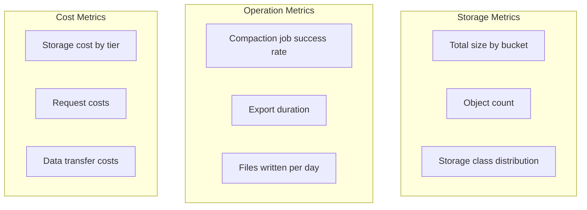

### CloudWatch Alarms

```yaml
# S3 monitoring alarms
Alarms:
  - Name: ColdStorageObjectCount
    Metric: NumberOfObjects
    Threshold: 10000000  # Alert if > 10M objects
    Action: SNS notification

  - Name: CompactionJobFailed
    Metric: kubernetes.job.failed
    Namespace: data-pipeline
    Threshold: 1
    Action: PagerDuty

  - Name: StorageGrowthAnomaly
    Metric: BucketSizeBytes
    AnomalyDetection: true
    Action: SNS notification
```

---

## Cost Optimization

### Storage Cost Breakdown

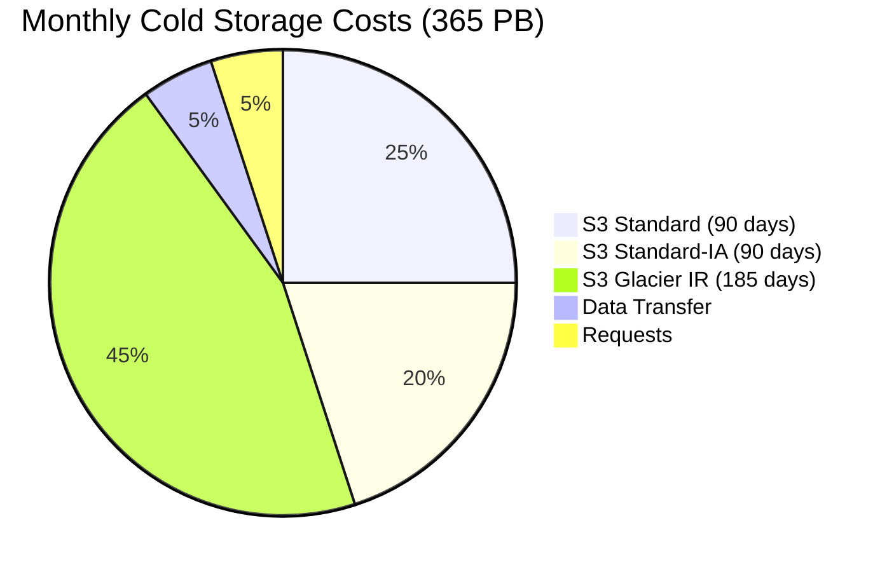

### Optimization Strategies

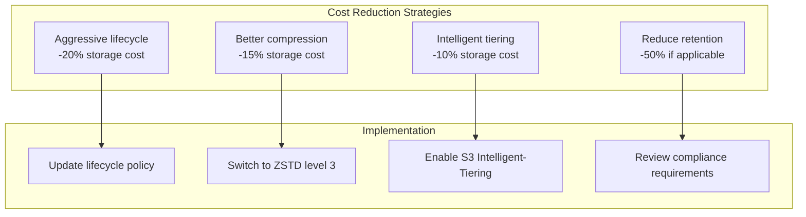

### Compression Comparison

| Codec | Compression Ratio | Write Speed | Read Speed |
|-------|------------------|-------------|------------|
| **Snappy** | 3:1 | Fast | Fast |
| **GZIP** | 6:1 | Slow | Medium |
| **ZSTD** | 5:1 | Medium | Fast |
| **ZSTD (level 3)** | 6:1 | Medium | Fast |

**Recommendation**: ZSTD level 3 for best balance of compression and performance.

---

## Configuration Reference

### S3 Bucket Configuration

| Setting | Value | Rationale |
|---------|-------|-----------|
| **Versioning** | Enabled | Accidental deletion protection |
| **Object Lock** | Compliance mode, 1 year | WORM compliance |
| **Encryption** | SSE-S3 | At-rest encryption |
| **Access Logging** | Enabled | Audit trail |
| **Lifecycle** | 90d → IA, 180d → Glacier IR | Cost optimization |

### Parquet Writer Settings

| Setting | Value | Rationale |
|---------|-------|-----------|
| **Row group size** | 128 MB | Balance read/write performance |
| **Page size** | 1 MB | Efficient predicate pushdown |
| **Compression** | ZSTD (level 3) | Best compression ratio |
| **Dictionary encoding** | Enabled | Low-cardinality columns |
| **Statistics** | Enabled | Query optimization |

### Hive Metastore Configuration

| Setting | Value | Rationale |
|---------|-------|-----------|
| **Partition projection** | Enabled | Faster partition pruning |
| **Table format** | Parquet | Columnar efficiency |
| **Partition scheme** | year/month/day/tenant/service | Query isolation |
