# Collection Layer Design

## Overview

The collection layer is responsible for gathering logs from all sources (applications, infrastructure, Kubernetes) and reliably forwarding them to Kafka. This layer uses lightweight agents deployed as DaemonSets on Kubernetes and agents on VMs.

---

## Architecture

### Deployment Topology

```mermaid
flowchart TB
    subgraph K8S["Kubernetes Cluster"]
        subgraph Node1["Node 1"]
            P1[Pod: app-1]
            P2[Pod: app-2]
            FB1[Fluent Bit<br/>DaemonSet]
        end

        subgraph Node2["Node 2"]
            P3[Pod: app-3]
            P4[Pod: app-4]
            FB2[Fluent Bit<br/>DaemonSet]
        end

        subgraph Node3["Node 3"]
            P5[Pod: app-5]
            P6[Pod: app-6]
            FB3[Fluent Bit<br/>DaemonSet]
        end
    end

    subgraph VMs["VM Fleet"]
        VM1[VM 1<br/>Vector Agent]
        VM2[VM 2<br/>Vector Agent]
        VM3[VM 3<br/>Vector Agent]
    end

    subgraph Kafka["Kafka Cluster"]
        TOPIC[logs.{tenant}.{service}]
    end

    FB1 & FB2 & FB3 --> Kafka
    VM1 & VM2 & VM3 --> Kafka
```

### Collection Pipeline

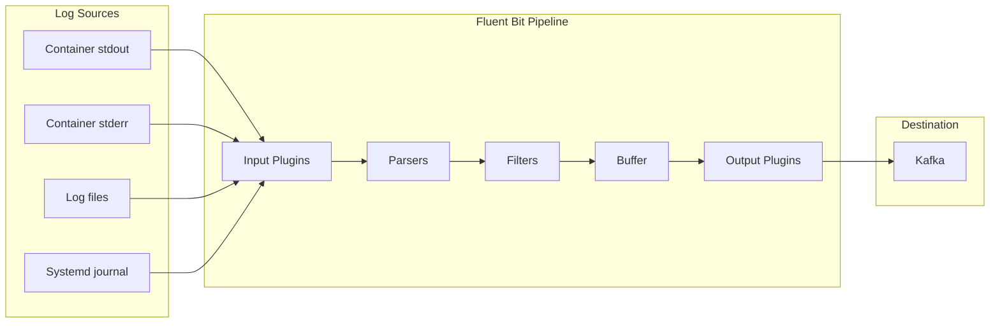

---

## Fluent Bit Configuration

### Plugin Pipeline

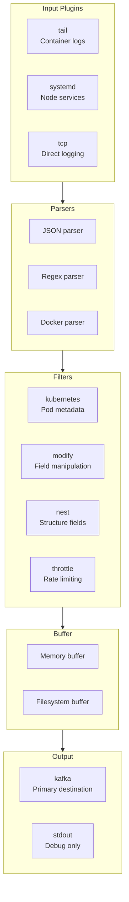

### Kubernetes Metadata Enrichment

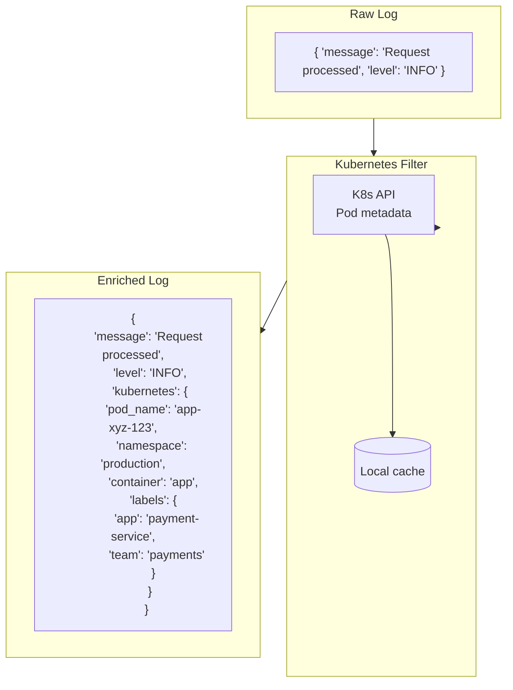

### Full Configuration

```yaml
[SERVICE]
    Flush         1
    Grace         30
    Log_Level     info
    Daemon        Off
    Parsers_File  parsers.conf
    HTTP_Server   On
    HTTP_Listen   0.0.0.0
    HTTP_Port     2020
    Health_Check  On
    storage.path  /var/log/flb-storage/
    storage.sync  normal
    storage.checksum off
    storage.max_chunks_up 128

[INPUT]
    Name              tail
    Tag               kube.*
    Path              /var/log/containers/*.log
    Parser            docker
    DB                /var/log/flb_kube.db
    Mem_Buf_Limit     50MB
    Skip_Long_Lines   On
    Refresh_Interval  10
    storage.type      filesystem

[INPUT]
    Name              systemd
    Tag               host.systemd
    Systemd_Filter    _SYSTEMD_UNIT=kubelet.service
    Systemd_Filter    _SYSTEMD_UNIT=docker.service
    Read_From_Tail    On
    Strip_Underscores On

[FILTER]
    Name                kubernetes
    Match               kube.*
    Kube_URL            https://kubernetes.default.svc:443
    Kube_CA_File        /var/run/secrets/kubernetes.io/serviceaccount/ca.crt
    Kube_Token_File     /var/run/secrets/kubernetes.io/serviceaccount/token
    Kube_Tag_Prefix     kube.var.log.containers.
    Merge_Log           On
    Merge_Log_Key       log_processed
    K8S-Logging.Parser  On
    K8S-Logging.Exclude Off
    Labels              On
    Annotations         Off
    Buffer_Size         32k

[FILTER]
    Name          modify
    Match         *
    Add           cluster ${CLUSTER_NAME}
    Add           region ${AWS_REGION}
    Rename        log message
    Remove        stream

[FILTER]
    Name          throttle
    Match         *
    Rate          10000
    Window        5
    Interval      1s
    Print_Status  false

[OUTPUT]
    Name           kafka
    Match          *
    Brokers        kafka-0:9092,kafka-1:9092,kafka-2:9092
    Topics         logs.${tenant_id}.${service}
    Timestamp_Key  timestamp
    Timestamp_Format iso8601
    Retry_Limit    False
    rdkafka.compression.type lz4
    rdkafka.batch.size 1000000
    rdkafka.linger.ms 10
    rdkafka.acks all
    rdkafka.enable.idempotence true
```

---

## Vector Alternative

### Vector Pipeline

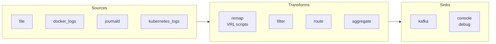

### Vector vs Fluent Bit

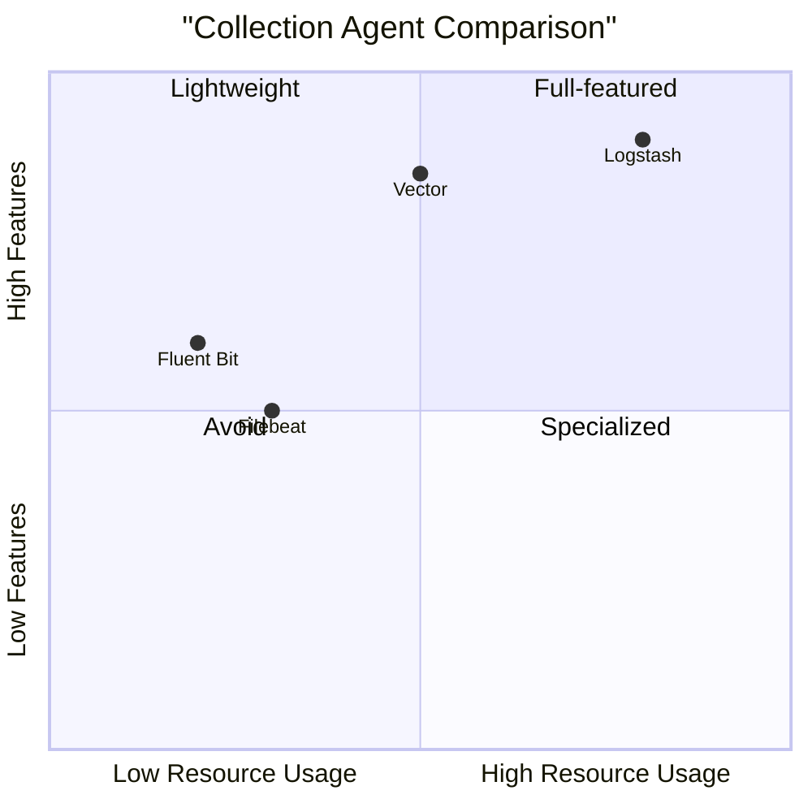

| Feature | Fluent Bit | Vector |
|---------|-----------|--------|
| **Memory Usage** | ~10 MB | ~50 MB |
| **CPU Usage** | Lower | Higher |
| **Configuration** | INI-based | TOML/YAML |
| **Transform Language** | Lua scripts | VRL (powerful) |
| **Kubernetes Native** | Excellent | Good |
| **Recommended For** | High-density K8s | Complex transforms |

---

## Buffering Strategy

### Buffer Architecture

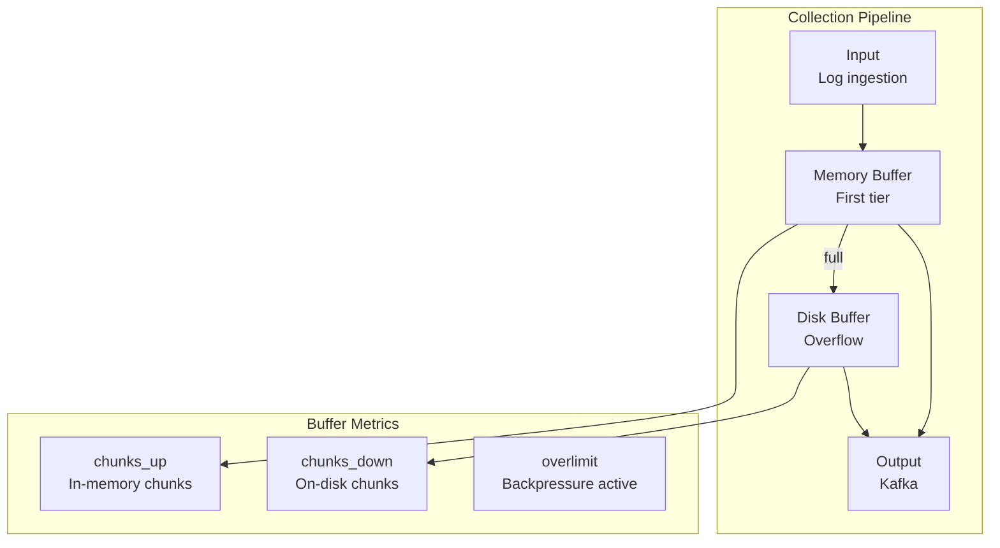

### Buffer Sizing

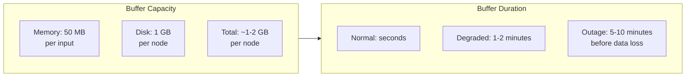

### Backpressure Handling

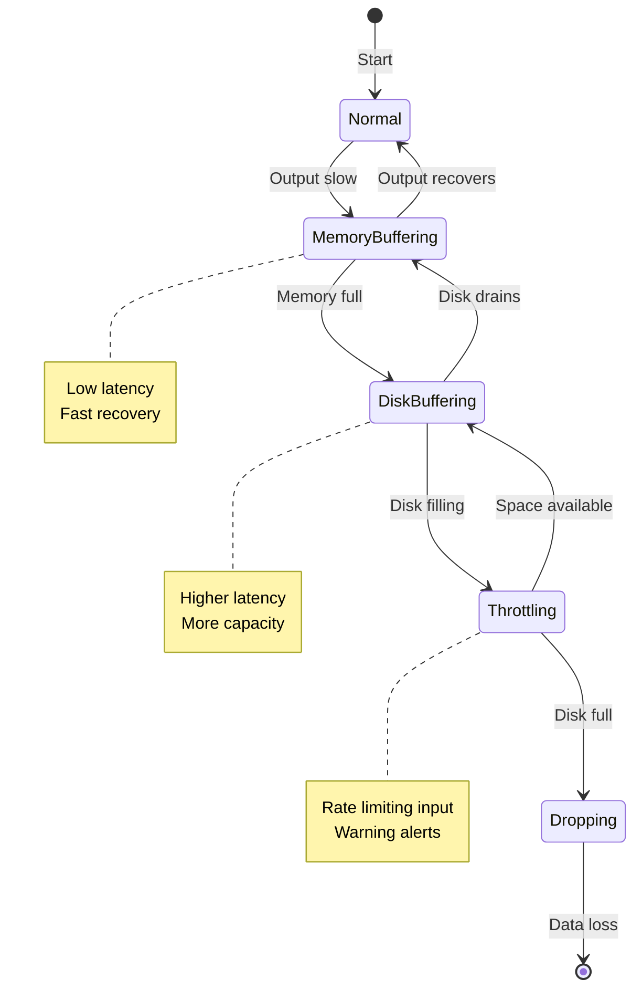

---

## High Availability

### DaemonSet Deployment

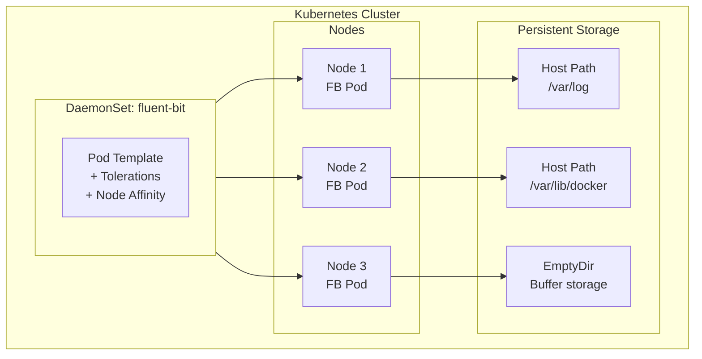

### Pod Spec

```yaml
apiVersion: apps/v1
kind: DaemonSet
metadata:
  name: fluent-bit
  namespace: logging
spec:
  selector:
    matchLabels:
      app: fluent-bit
  template:
    metadata:
      labels:
        app: fluent-bit
    spec:
      serviceAccountName: fluent-bit
      tolerations:
      - operator: Exists
        effect: NoSchedule
      - operator: Exists
        effect: NoExecute
      containers:
      - name: fluent-bit
        image: fluent/fluent-bit:2.2
        resources:
          requests:
            cpu: 100m
            memory: 128Mi
          limits:
            cpu: 500m
            memory: 256Mi
        volumeMounts:
        - name: varlog
          mountPath: /var/log
          readOnly: true
        - name: containers
          mountPath: /var/lib/docker/containers
          readOnly: true
        - name: config
          mountPath: /fluent-bit/etc
        - name: buffer
          mountPath: /var/log/flb-storage
        ports:
        - containerPort: 2020
          name: metrics
        livenessProbe:
          httpGet:
            path: /api/v1/health
            port: 2020
          initialDelaySeconds: 10
          periodSeconds: 10
        readinessProbe:
          httpGet:
            path: /api/v1/health
            port: 2020
          initialDelaySeconds: 5
          periodSeconds: 5
      volumes:
      - name: varlog
        hostPath:
          path: /var/log
      - name: containers
        hostPath:
          path: /var/lib/docker/containers
      - name: config
        configMap:
          name: fluent-bit-config
      - name: buffer
        emptyDir:
          sizeLimit: 1Gi
```

---

## Log Parsing

### Parser Configuration

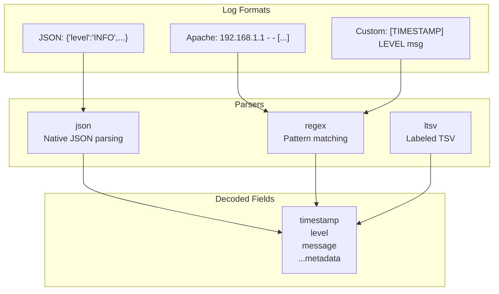

### Parser Definitions

```ini
[PARSER]
    Name        docker
    Format      json
    Time_Key    time
    Time_Format %Y-%m-%dT%H:%M:%S.%L
    Time_Keep   On
    Decode_Field_As escaped log

[PARSER]
    Name        json
    Format      json
    Time_Key    timestamp
    Time_Format %Y-%m-%dT%H:%M:%S.%LZ

[PARSER]
    Name        apache
    Format      regex
    Regex       ^(?<host>[^ ]*) [^ ]* (?<user>[^ ]*) \[(?<time>[^\]]*)\] "(?<method>\S+)(?: +(?<path>[^\"]*?)(?: +\S*)?)?" (?<code>[^ ]*) (?<size>[^ ]*)(?: "(?<referer>[^\"]*)" "(?<agent>[^\"]*)")?$
    Time_Key    time
    Time_Format %d/%b/%Y:%H:%M:%S %z

[PARSER]
    Name        syslog
    Format      regex
    Regex       ^\<(?<pri>[0-9]+)\>(?<time>[^ ]* {1,2}[^ ]* [^ ]*) (?<host>[^ ]*) (?<ident>[a-zA-Z0-9_\/\.\-]*)(?:\[(?<pid>[0-9]+)\])?(?:[^\:]*\:)? *(?<message>.*)$
    Time_Key    time
    Time_Format %b %d %H:%M:%S
```

---

## Retry Logic

### Retry Strategy

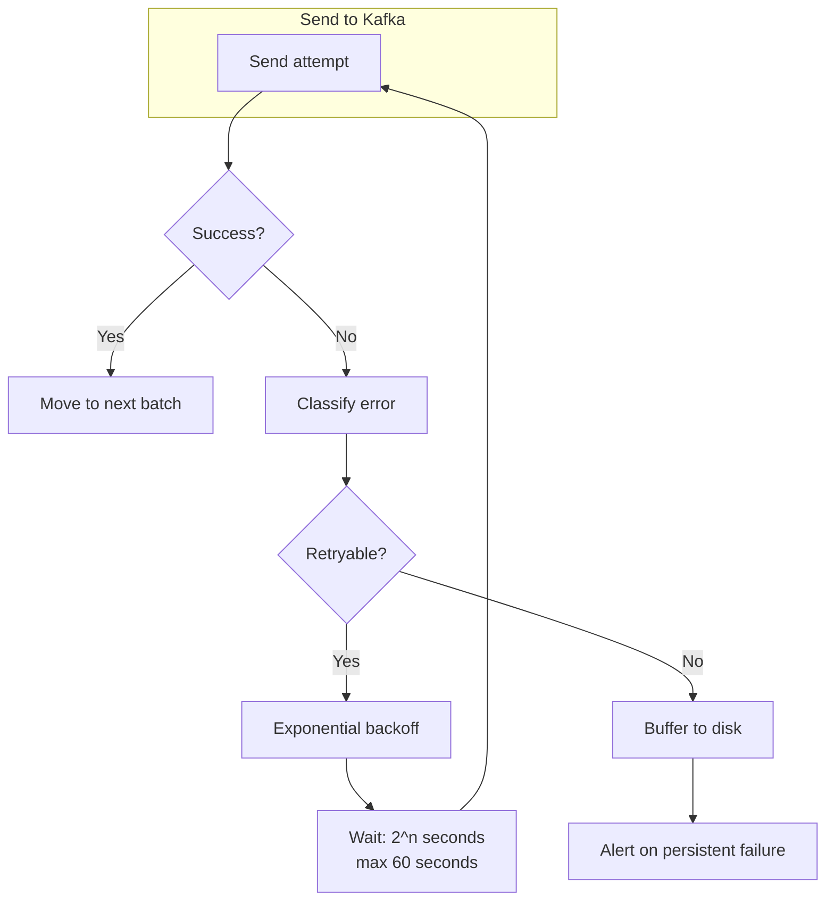

### Backoff Timeline

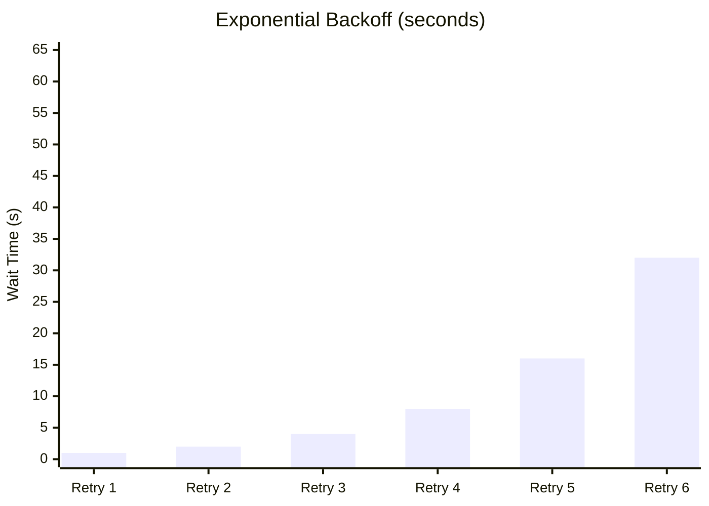

---

## Monitoring

### Key Metrics

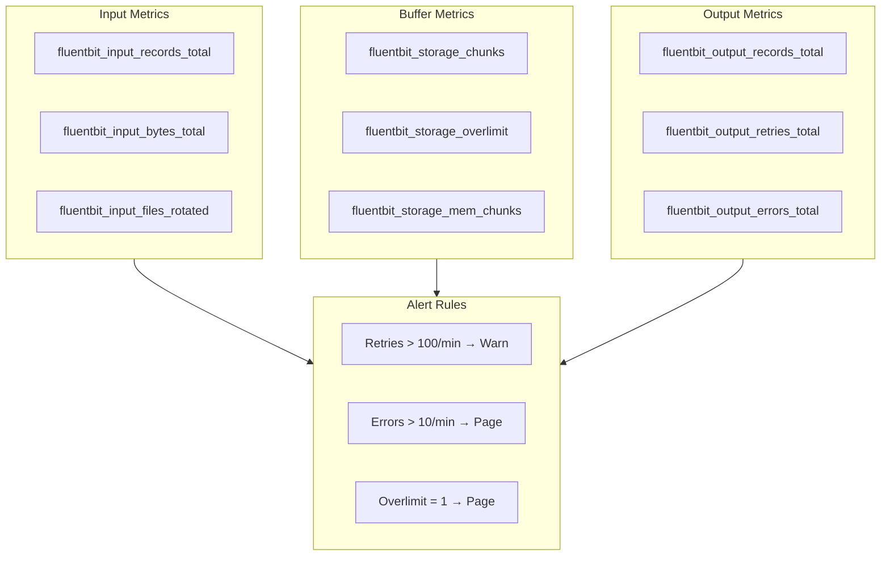

### Dashboard Layout

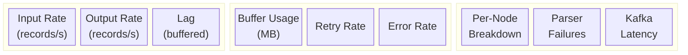

---

## Security

### RBAC Configuration

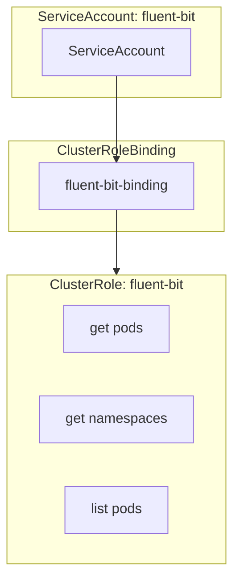

### Kafka Authentication

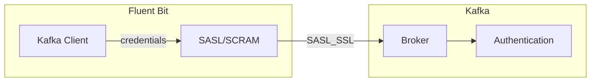

```ini
[OUTPUT]
    Name           kafka
    Match          *
    Brokers        kafka-bootstrap:9093
    Topics         logs.${tenant}.${service}
    rdkafka.security.protocol SASL_SSL
    rdkafka.sasl.mechanism SCRAM-SHA-512
    rdkafka.sasl.username ${KAFKA_USERNAME}
    rdkafka.sasl.password ${KAFKA_PASSWORD}
    rdkafka.ssl.ca.location /etc/kafka/ca.crt
```

---

## Troubleshooting

### Common Issues

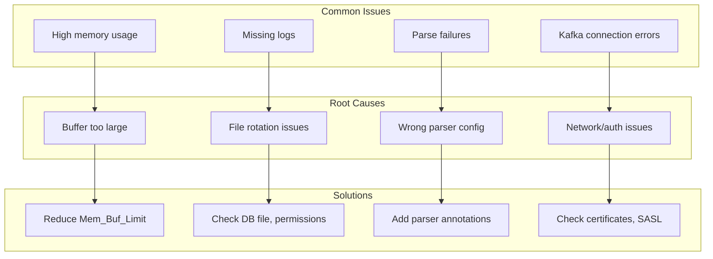

### Debug Commands

```bash
# Check Fluent Bit health
curl http://localhost:2020/api/v1/health

# View internal metrics
curl http://localhost:2020/api/v1/metrics

# Check storage status
curl http://localhost:2020/api/v1/storage

# View uptime
curl http://localhost:2020/api/v1/uptime

# Enable debug logging
[SERVICE]
    Log_Level    debug
```

---

## Configuration Reference

### Resource Limits

| Parameter | Minimum | Recommended | Maximum |
|-----------|---------|-------------|---------|
| **CPU** | 100m | 250m | 500m |
| **Memory** | 128Mi | 256Mi | 512Mi |
| **Disk Buffer** | 256Mi | 1Gi | 2Gi |

### Performance Tuning

| Parameter | Default | Tuned | Description |
|-----------|---------|-------|-------------|
| `Mem_Buf_Limit` | 5 MB | 50 MB | Memory buffer per input |
| `storage.max_chunks_up` | 128 | 256 | In-memory chunks |
| `Refresh_Interval` | 60 | 10 | File check interval (sec) |
| `Buffer_Chunk_Size` | 32 KB | 64 KB | Chunk size |
| `Buffer_Max_Size` | 32 KB | 256 KB | Max buffer per read |
| `rdkafka.batch.size` | 16 KB | 1 MB | Kafka batch size |
| `rdkafka.linger.ms` | 0 | 10 | Kafka batching delay |
