# Flink Processing Component Design

## Overview

Apache Flink serves as the stream processing engine, responsible for consuming logs from Kafka, applying transformations (PII redaction, schema validation, enrichment), and writing to ClickHouse.

---

## Architecture

### Cluster Topology

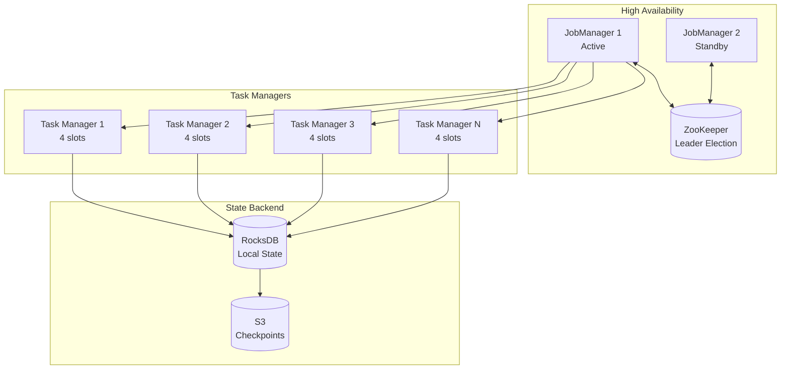

### Processing Pipeline

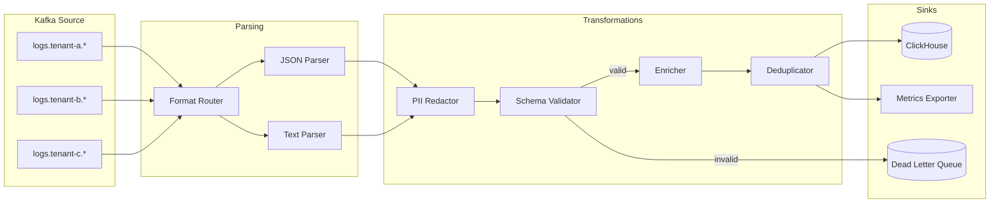

---

## Job Design

### Main Processing Job

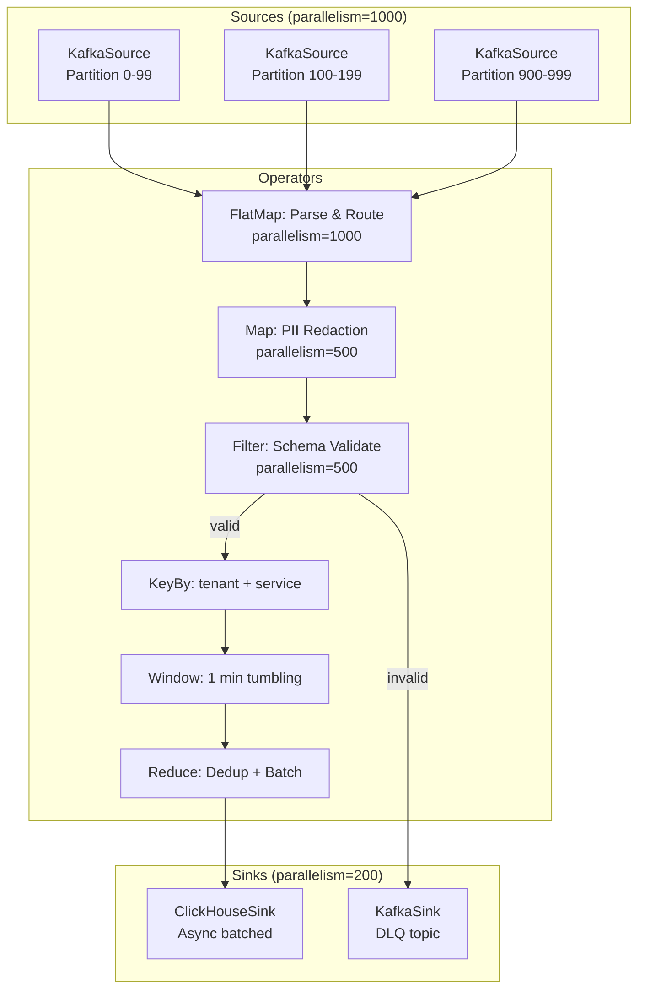

### Operator Chaining

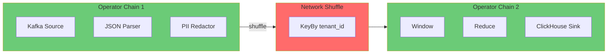

---

## PII Redaction

### Redaction Pipeline

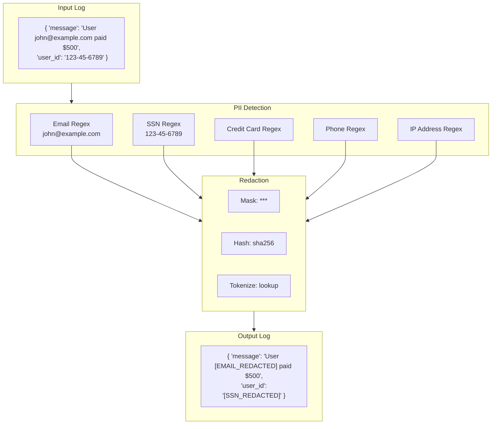

### PII Patterns

| PII Type | Regex Pattern | Redaction Strategy |
|----------|--------------|-------------------|
| **Email** | `[a-zA-Z0-9._%+-]+@[a-zA-Z0-9.-]+\.[a-zA-Z]{2,}` | `[EMAIL_REDACTED]` |
| **SSN** | `\d{3}-\d{2}-\d{4}` | `[SSN_REDACTED]` |
| **Credit Card** | `\d{4}[\s-]?\d{4}[\s-]?\d{4}[\s-]?\d{4}` | `****-****-****-XXXX` |
| **Phone** | `(\+\d{1,3})?[\s.-]?\(?\d{3}\)?[\s.-]?\d{3}[\s.-]?\d{4}` | `[PHONE_REDACTED]` |
| **IPv4** | `\d{1,3}\.\d{1,3}\.\d{1,3}\.\d{1,3}` | `X.X.X.X` |
| **JWT** | `eyJ[A-Za-z0-9_-]+\.eyJ[A-Za-z0-9_-]+\.[A-Za-z0-9_-]+` | `[JWT_REDACTED]` |

### Redaction Metrics

```mermaid
flowchart LR
    subgraph Metrics["PII Metrics"]
        TOTAL[Total logs processed]
        DETECTED[Logs with PII detected]
        BY_TYPE[Detections by type]
        FALSE_POS[False positive rate<br/>sampled]
    end

    subgraph Export["Prometheus Export"]
        pii_total[pii_logs_processed_total]
        pii_detected[pii_detected_total{type}]
        pii_rate[pii_detection_rate]
    end

    Metrics --> Export
```

---

## Schema Validation

### Validation Flow

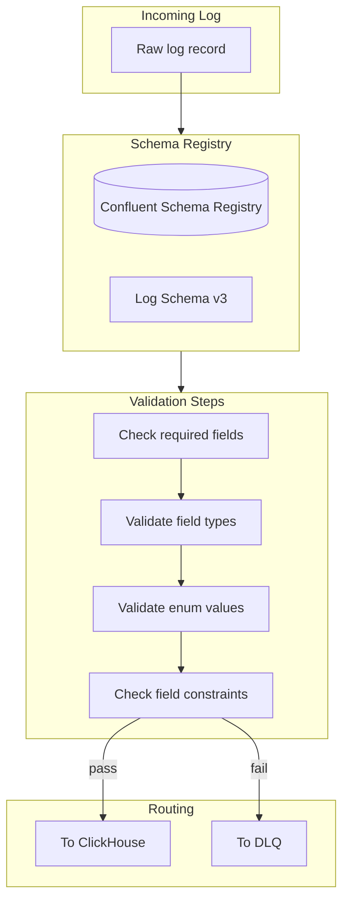

### Schema Definition

```json
{
  "type": "record",
  "name": "LogRecord",
  "namespace": "com.company.logs",
  "fields": [
    {"name": "timestamp", "type": "long", "logicalType": "timestamp-millis"},
    {"name": "tenant_id", "type": "string"},
    {"name": "service", "type": "string"},
    {"name": "host", "type": "string"},
    {"name": "trace_id", "type": ["null", "string"], "default": null},
    {"name": "level", "type": {"type": "enum", "name": "Level",
      "symbols": ["DEBUG", "INFO", "WARN", "ERROR", "FATAL"]}},
    {"name": "message", "type": "string"},
    {"name": "labels", "type": {"type": "map", "values": "string"}, "default": {}}
  ]
}
```

---

## Checkpointing

### Checkpoint Flow

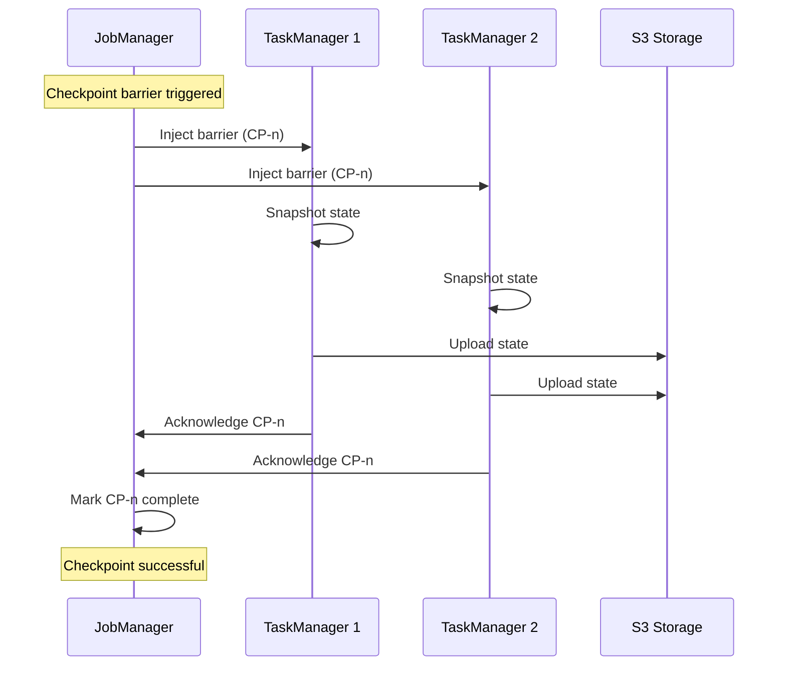

### Checkpoint Configuration

```mermaid
flowchart TB
    subgraph Config["Checkpoint Configuration"]
        INT[Interval: 60 seconds]
        TIMEOUT[Timeout: 10 minutes]
        MIN[Min pause: 30 seconds]
        MAX[Max concurrent: 1]
        MODE[Mode: EXACTLY_ONCE]
    end

    subgraph Backend["State Backend"]
        ROCKS[RocksDB<br/>Incremental checkpoints]
        S3[S3<br/>Checkpoint storage]
    end

    subgraph Recovery["Recovery"]
        RESTART[Restart strategy:<br/>Fixed delay (10s, 3 attempts)]
        SAVEPOINT[Savepoint restore<br/>for upgrades]
    end

    Config --> Backend --> Recovery
```

---

## Dead Letter Queue

### DLQ Flow

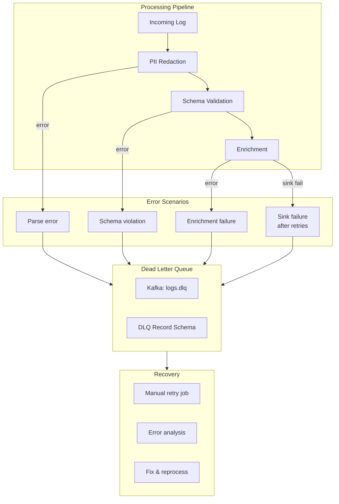

### DLQ Record Schema

```json
{
  "original_record": "base64-encoded original",
  "error_type": "SCHEMA_VALIDATION",
  "error_message": "Field 'timestamp' is required",
  "error_timestamp": 1704067200000,
  "source_topic": "logs.acme.payments",
  "source_partition": 42,
  "source_offset": 123456,
  "processing_stage": "schema_validation",
  "retry_count": 0,
  "stack_trace": "..."
}
```

---

## Backpressure Handling

### Backpressure Detection

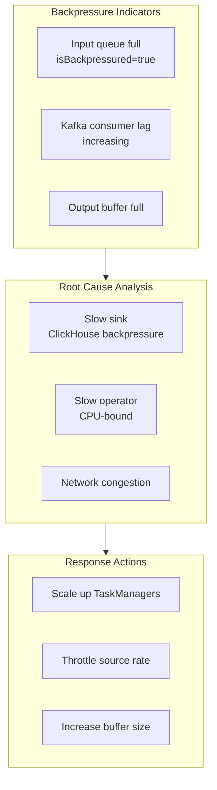

### Backpressure Metrics

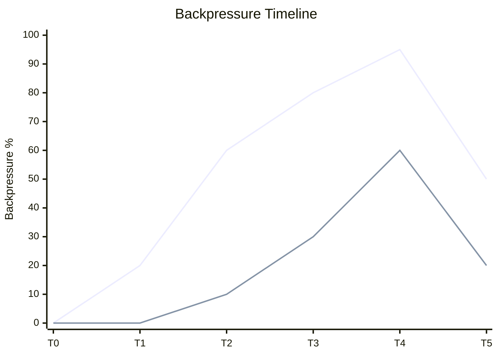

---

## Scaling

### Auto-Scaling Strategy

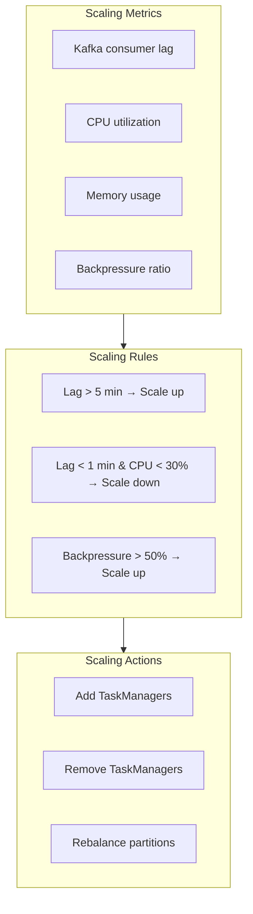

### Reactive Scaling

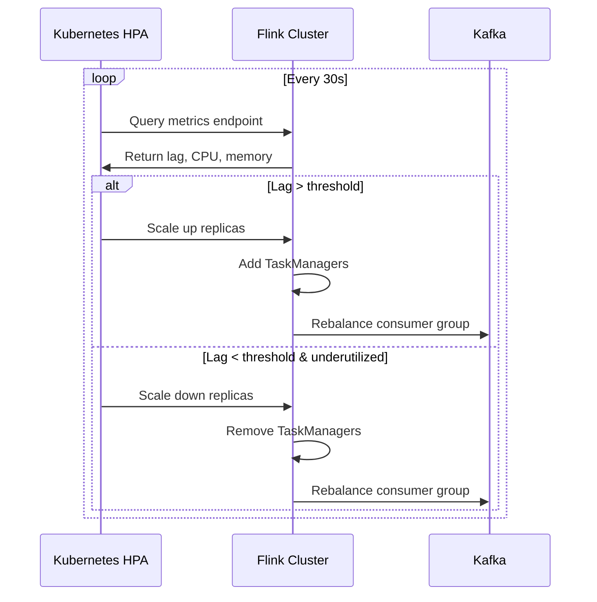

---

## Monitoring

### Key Metrics

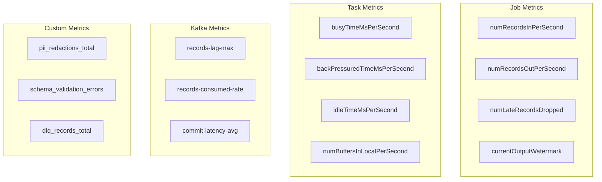

### Dashboard Layout

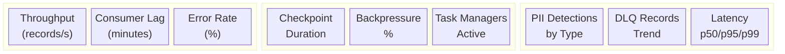

---

## Failure Recovery

### Recovery Scenarios

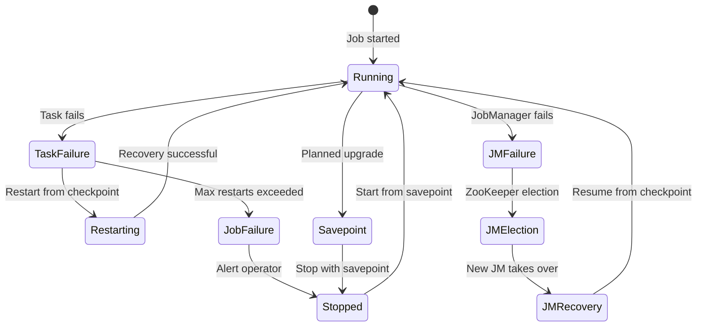

### Exactly-Once Guarantee

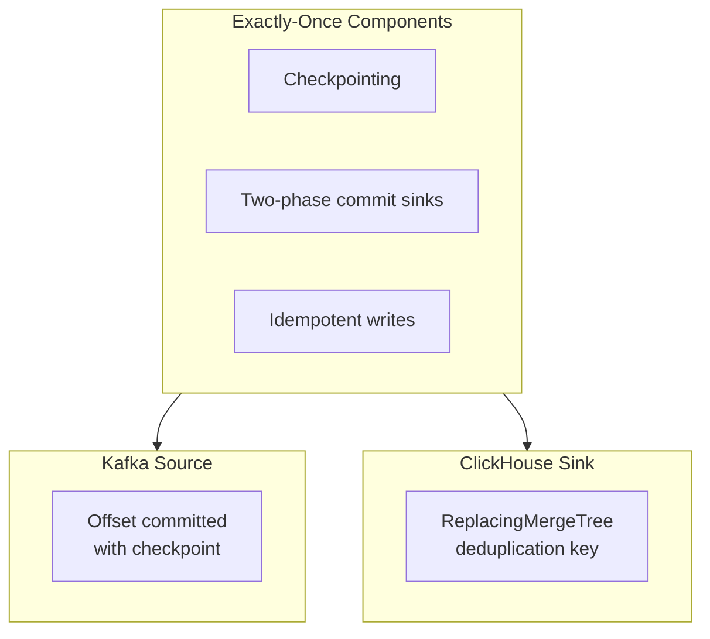

---

## Configuration Reference

### Job Configuration

| Parameter | Value | Description |
|-----------|-------|-------------|
| `parallelism.default` | 1000 | Default operator parallelism |
| `taskmanager.numberOfTaskSlots` | 4 | Slots per TaskManager |
| `taskmanager.memory.process.size` | 8 GB | Total TM memory |
| `state.backend` | rocksdb | State backend type |
| `state.checkpoints.dir` | s3://bucket/checkpoints | Checkpoint location |
| `execution.checkpointing.interval` | 60 s | Checkpoint frequency |
| `execution.checkpointing.timeout` | 10 min | Checkpoint timeout |

### Kafka Consumer Configuration

| Parameter | Value | Description |
|-----------|-------|-------------|
| `group.id` | flink-log-processor | Consumer group |
| `auto.offset.reset` | earliest | Start from beginning |
| `enable.auto.commit` | false | Managed by Flink |
| `max.poll.records` | 500 | Records per poll |
| `fetch.max.bytes` | 52428800 | 50 MB max fetch |

### ClickHouse Sink Configuration

| Parameter | Value | Description |
|-----------|-------|-------------|
| `batch.size` | 100000 | Rows per batch |
| `flush.interval.ms` | 1000 | Max time before flush |
| `max.retries` | 5 | Retry attempts |
| `retry.backoff.ms` | 1000 | Initial retry delay |
