# Kafka Component Design

## Overview

Apache Kafka serves as the central nervous system for log ingestion, providing durable, scalable message transport between collection agents and processing pipelines.

---

## Architecture

### Multi-Region Topology

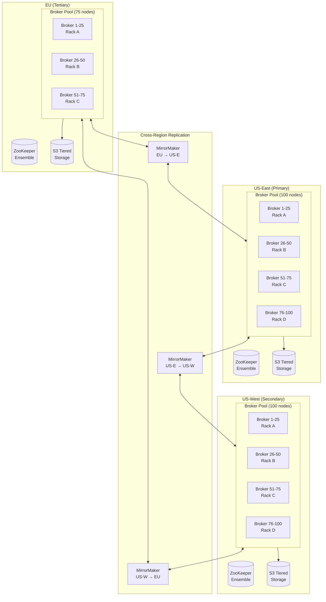

---

## Topic Design

### Topic Naming Convention

```
logs.{tenant_id}.{service_name}

Examples:
- logs.acme-corp.payment-service
- logs.globex.user-auth
- logs.initech.order-processor
```

### Partition Strategy

```mermaid
flowchart TB
    subgraph Producer["Log Producer"]
        LOG[Log Entry<br/>tenant: acme<br/>service: payments<br/>trace_id: abc123]
    end

    subgraph Partitioner["Custom Partitioner"]
        HASH[Hash Function:<br/>hash(trace_id) % partitions]
    end

    subgraph Topic["Topic: logs.acme.payments"]
        P0[Partition 0]
        P1[Partition 1]
        P2[Partition 2]
        PN[Partition N]
    end

    LOG --> Partitioner
    Partitioner -->|hash=0| P0
    Partitioner -->|hash=1| P1
    Partitioner -->|hash=2| P2
    Partitioner -->|hash=N| PN
```

### Partition Sizing

| Metric | Value | Rationale |
|--------|-------|-----------|
| **Partitions per topic** | 100-500 | Based on throughput needs |
| **Max partitions per broker** | 4,000 | Kafka recommendation |
| **Target partition throughput** | 50-100 MB/s | Optimal consumer performance |
| **Total partitions** | ~100,000 | 275 brokers × ~365 avg |

---

## Tiered Storage

### Storage Hierarchy

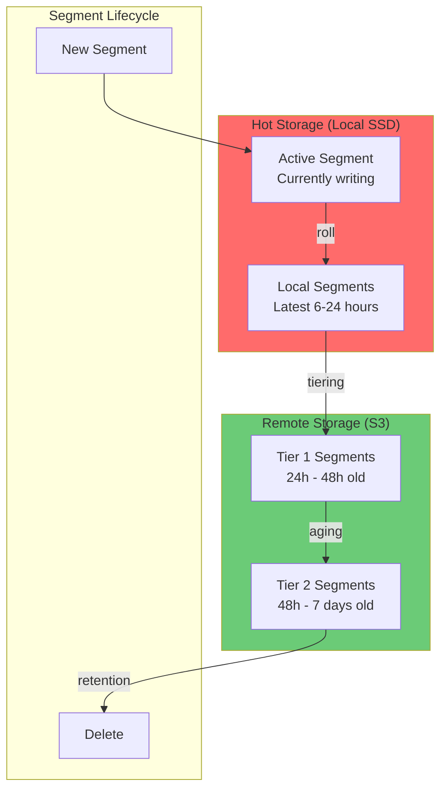

### Tiered Storage Configuration

```yaml
# Topic-level configuration
tiered.storage.enable: true
local.retention.ms: 86400000  # 24 hours local
retention.ms: 604800000       # 7 days total
remote.storage.manager.class: org.apache.kafka.tiered.storage.s3.S3RemoteStorageManager
```

---

## Replication

### Intra-Cluster Replication

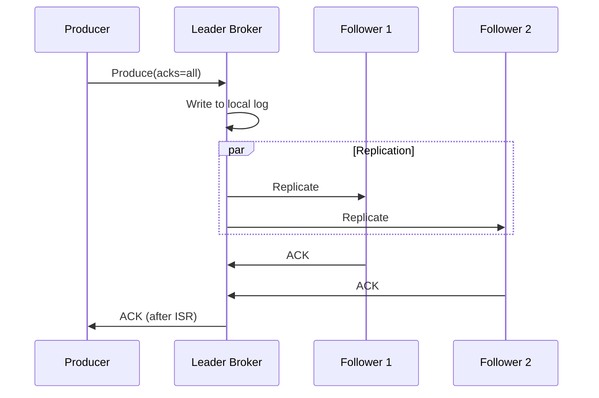

### Cross-Region Replication

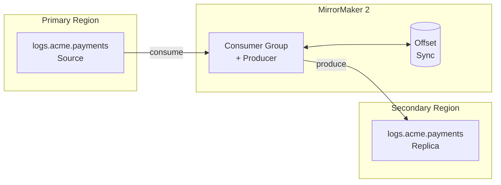

---

## Consumer Groups

### Consumer Group Architecture

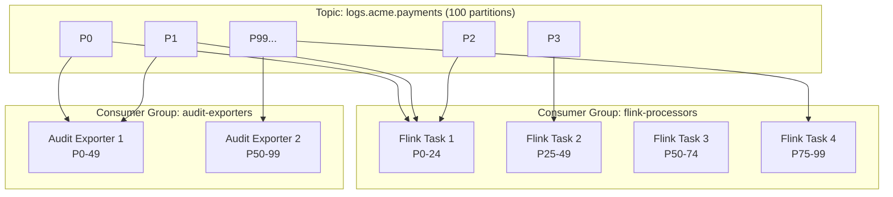

### Consumer Group Strategy

| Consumer Group | Purpose | Lag Tolerance |
|---------------|---------|---------------|
| `flink-processors` | Main processing pipeline | < 5 minutes |
| `audit-exporters` | Compliance archival | < 1 hour |
| `metrics-aggregators` | Real-time metrics | < 1 minute |
| `dlq-handlers` | Error recovery | Best effort |

---

## Producer Configuration

### Producer Settings

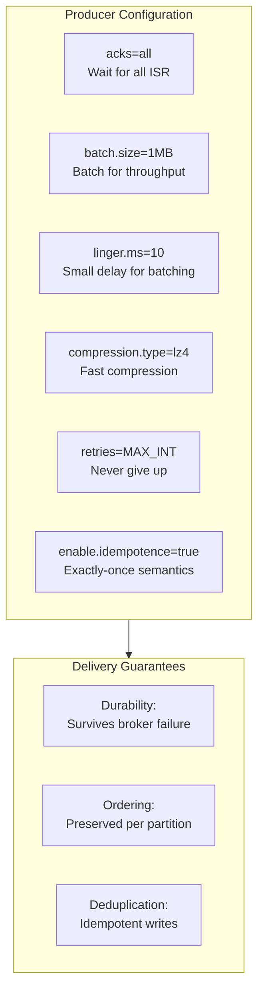

---

## Monitoring

### Key Metrics

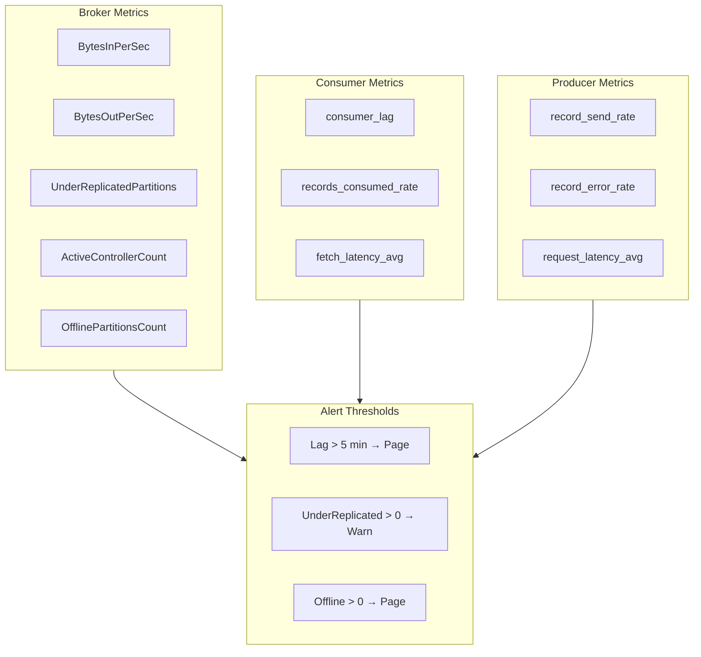

### Dashboard Layout

```mermaid
block-beta
    columns 3

    block:row1
        columns 3
        a["Throughput (GB/s)"]
        b["Consumer Lag (min)"]
        c["Error Rate (%)"]
    end

    block:row2
        columns 3
        d["Partition Distribution"]
        e["ISR Health"]
        f["Storage Usage"]
    end

    block:row3
        columns 3
        g["Topic Breakdown"]
        h["Consumer Groups"]
        i["Cross-Region Lag"]
    end
```

---

## Failure Scenarios

### Broker Failure

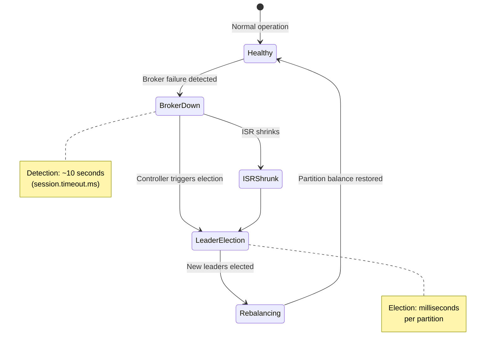

### Network Partition

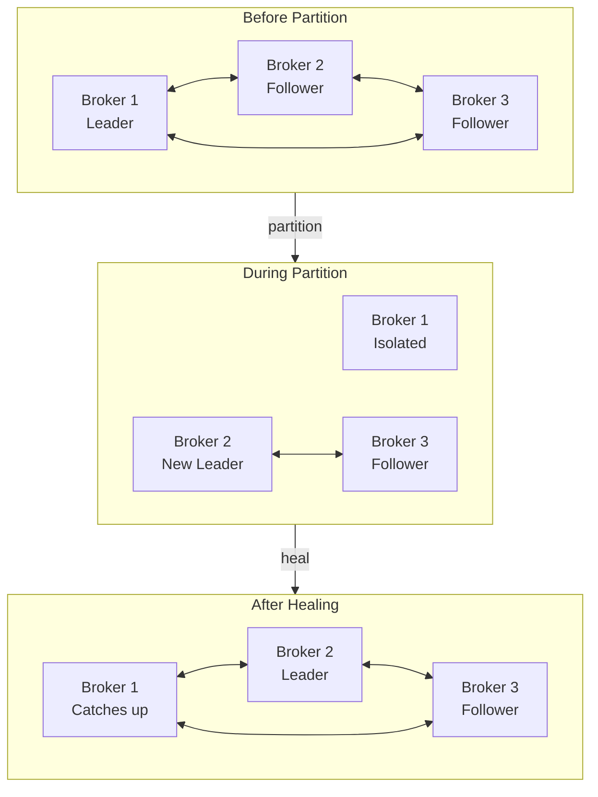

---

## Configuration Reference

### Broker Configuration

| Parameter | Value | Rationale |
|-----------|-------|-----------|
| `num.partitions` | 100 | Default for new topics |
| `default.replication.factor` | 3 | Durability |
| `min.insync.replicas` | 2 | Availability vs durability |
| `log.retention.hours` | 168 | 7 days |
| `log.segment.bytes` | 1073741824 | 1 GB segments |
| `num.io.threads` | 16 | I/O parallelism |
| `num.network.threads` | 8 | Network parallelism |
| `socket.send.buffer.bytes` | 1048576 | 1 MB send buffer |
| `socket.receive.buffer.bytes` | 1048576 | 1 MB receive buffer |

### Topic Configuration

| Parameter | Value | Rationale |
|-----------|-------|-----------|
| `retention.ms` | 604800000 | 7 days |
| `retention.bytes` | -1 | No size limit |
| `segment.ms` | 3600000 | 1 hour segments |
| `cleanup.policy` | delete | Time-based cleanup |
| `compression.type` | lz4 | Fast compression |

---

## Scaling Operations

### Adding Brokers

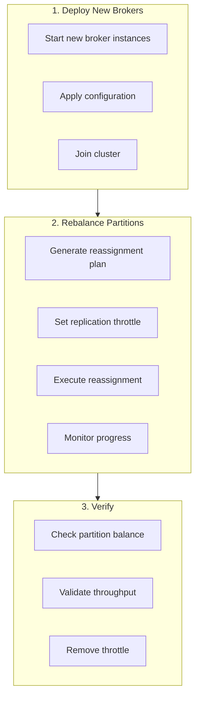

### Partition Expansion

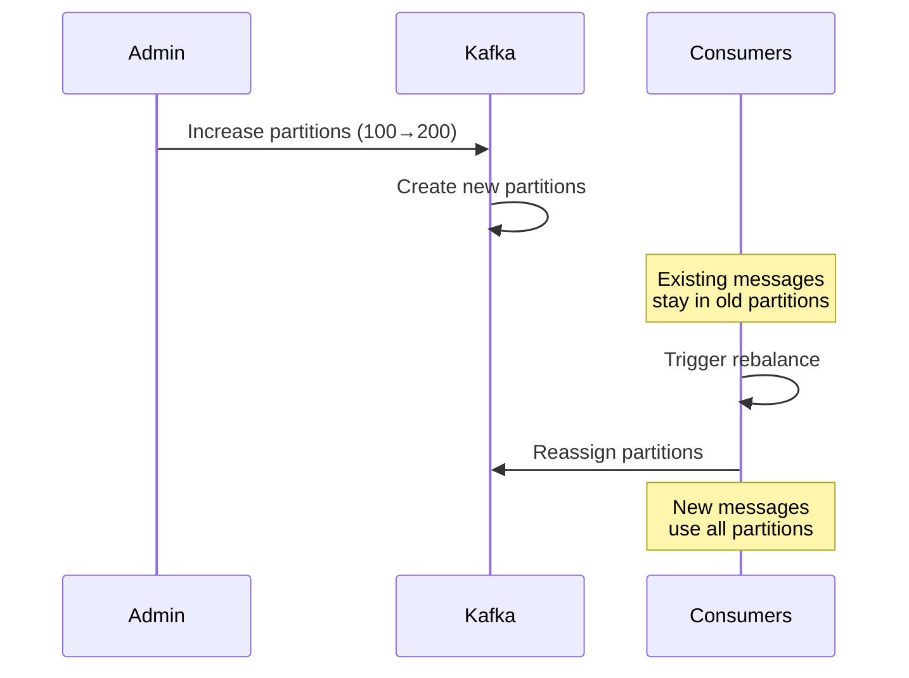

---

## Security

### Authentication & Authorization

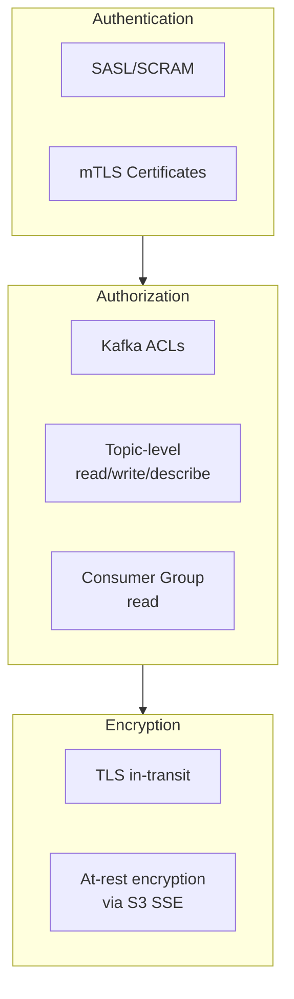

### ACL Structure

| Principal | Topic Pattern | Operation | Permission |
|-----------|--------------|-----------|------------|
| `user:fluent-bit` | `logs.*` | Write | Allow |
| `user:flink-processor` | `logs.*` | Read | Allow |
| `user:flink-processor` | `logs.dlq.*` | Write | Allow |
| `user:admin` | `*` | All | Allow |
