# Trino Query Layer Design

## Overview

Trino (formerly PrestoSQL) serves as the federated query engine, providing a unified SQL interface across hot tier (ClickHouse), warm tier, and cold tier (S3 Parquet) storage.

---

## Architecture

### Cluster Topology

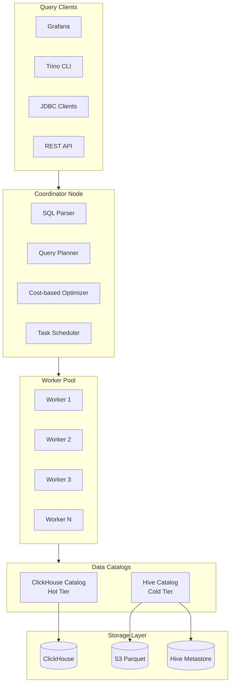
```mermaid
flowchart TB
    subgraph Clients["Query Clients"]
        UI[Grafana]
        CLI[Trino CLI]
        JDBC[JDBC Clients]
        API[REST API]
    end

    subgraph Coordinator["Coordinator Node"]
        PARSER[SQL Parser]
        PLANNER[Query Planner]
        OPTIMIZER[Cost-based Optimizer]
        SCHEDULER[Task Scheduler]
    end

    subgraph Workers["Worker Pool"]
        W1[Worker 1]
        W2[Worker 2]
        W3[Worker 3]
        WN[Worker N]
    end

    subgraph Catalogs["Data Catalogs"]
        CH_CAT[ClickHouse Catalog<br/>Hot Tier]
        HIVE_CAT[Hive Catalog<br/>Cold Tier]
    end

    subgraph Storage["Storage Layer"]
        CH[(ClickHouse)]
        S3[(S3 Parquet)]
        HIVE_META[(Hive Metastore)]
    end

    Clients --> Coordinator
    Coordinator --> Workers
    Workers --> Catalogs
    CH_CAT --> CH
    HIVE_CAT --> HIVE_META
    HIVE_CAT --> S3
```

### High Availability

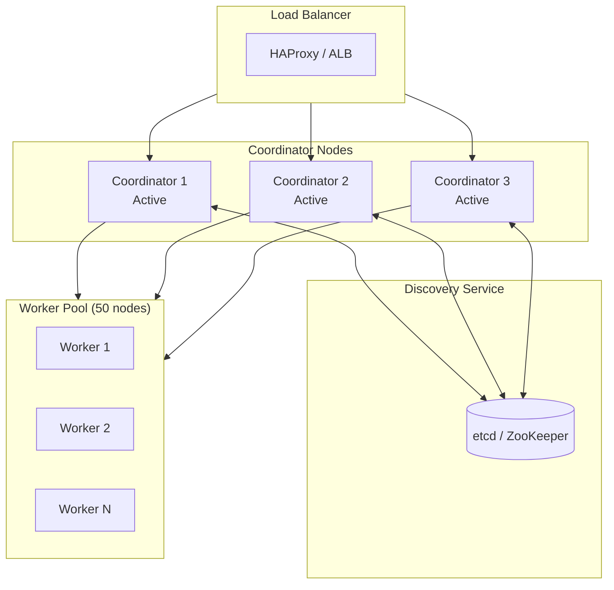
```mermaid
flowchart TB
    subgraph LB["Load Balancer"]
        HAP[HAProxy / ALB]
    end

    subgraph Coordinators["Coordinator Nodes"]
        C1[Coordinator 1<br/>Active]
        C2[Coordinator 2<br/>Active]
        C3[Coordinator 3<br/>Active]
    end

    subgraph Discovery["Discovery Service"]
        DS[(etcd / ZooKeeper)]
    end

    subgraph Workers["Worker Pool (50 nodes)"]
        W1[Worker 1]
        W2[Worker 2]
        WN[Worker N]
    end

    LB --> C1 & C2 & C3
    C1 & C2 & C3 <--> DS
    C1 --> Workers
    C2 --> Workers
    C3 --> Workers
```

---

## Catalog Configuration

### Multi-Catalog Setup

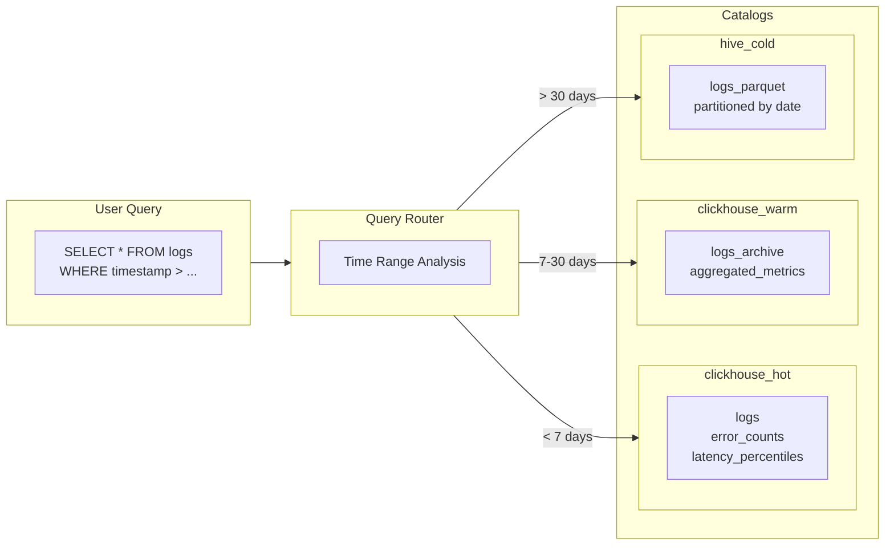
```mermaid
flowchart LR
    subgraph Query["User Query"]
        SQL["SELECT * FROM logs<br/>WHERE timestamp > ..."]
    end

    subgraph Router["Query Router"]
        TIME_FILTER[Time Range Analysis]
    end

    subgraph Catalogs["Catalogs"]
        subgraph Hot["clickhouse_hot"]
            CH_TABLES[logs<br/>error_counts<br/>latency_percentiles]
        end

        subgraph Warm["clickhouse_warm"]
            CHW_TABLES[logs_archive<br/>aggregated_metrics]
        end

        subgraph Cold["hive_cold"]
            HIVE_TABLES[logs_parquet<br/>partitioned by date]
        end
    end

    Query --> Router
    Router -->|< 7 days| Hot
    Router -->|7-30 days| Warm
    Router -->|> 30 days| Cold
```

### Catalog Definitions

```properties
# clickhouse_hot.properties
connector.name=clickhouse
connection-url=jdbc:clickhouse://clickhouse-hot:8123/logs_db
connection-user=trino
connection-password=${ENV:CH_PASSWORD}

# clickhouse_warm.properties
connector.name=clickhouse
connection-url=jdbc:clickhouse://clickhouse-warm:8123/logs_db
connection-user=trino
connection-password=${ENV:CH_PASSWORD}

# hive_cold.properties
connector.name=hive
hive.metastore.uri=thrift://hive-metastore:9083
hive.s3.path-style-access=true
hive.s3.endpoint=s3.us-east-1.amazonaws.com
hive.parquet.use-column-names=true
```

---

## Query Federation

### Cross-Catalog Query

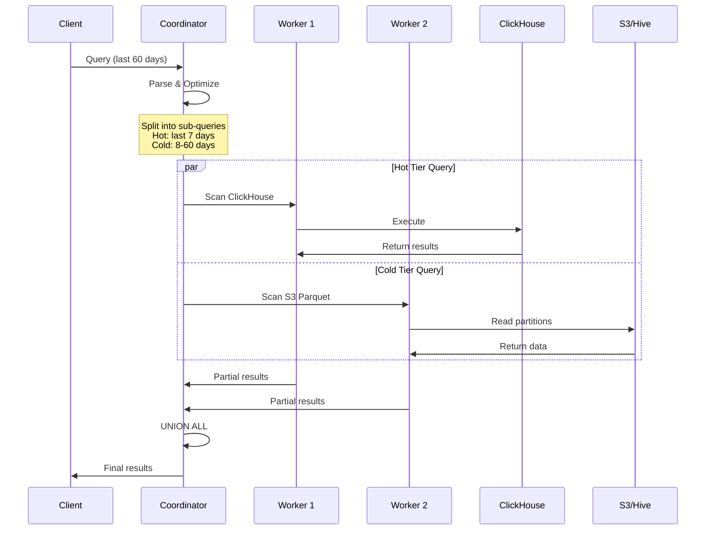
```mermaid
sequenceDiagram
    participant Client as Client
    participant Coord as Coordinator
    participant W1 as Worker 1
    participant W2 as Worker 2
    participant CH as ClickHouse
    participant S3 as S3/Hive

    Client->>Coord: Query (last 60 days)
    Coord->>Coord: Parse & Optimize

    Note over Coord: Split into sub-queries<br/>Hot: last 7 days<br/>Cold: 8-60 days

    par Hot Tier Query
        Coord->>W1: Scan ClickHouse
        W1->>CH: Execute
        CH->>W1: Return results
    and Cold Tier Query
        Coord->>W2: Scan S3 Parquet
        W2->>S3: Read partitions
        S3->>W2: Return data
    end

    W1->>Coord: Partial results
    W2->>Coord: Partial results
    Coord->>Coord: UNION ALL
    Coord->>Client: Final results
```

### Query Plan Example

```mermaid
flowchart TB
    subgraph Plan["Query Execution Plan"]
        OUTPUT[Output<br/>Final Results]

        UNION[Union All]

        subgraph Hot["Hot Tier Fragment"]
            SCAN_CH[TableScan<br/>clickhouse_hot.logs]
            FILTER_CH[Filter<br/>timestamp > now() - 7d]
            AGG_CH[Aggregate<br/>count(*)]
        end

        subgraph Cold["Cold Tier Fragment"]
            SCAN_S3[TableScan<br/>hive_cold.logs_parquet]
            FILTER_S3[Filter<br/>timestamp between -60d and -7d]
            AGG_S3[Aggregate<br/>count(*)]
        end
    end

    SCAN_CH --> FILTER_CH --> AGG_CH --> UNION
    SCAN_S3 --> FILTER_S3 --> AGG_S3 --> UNION
    UNION --> OUTPUT
```

---

## Query Routing

### Smart Routing Logic

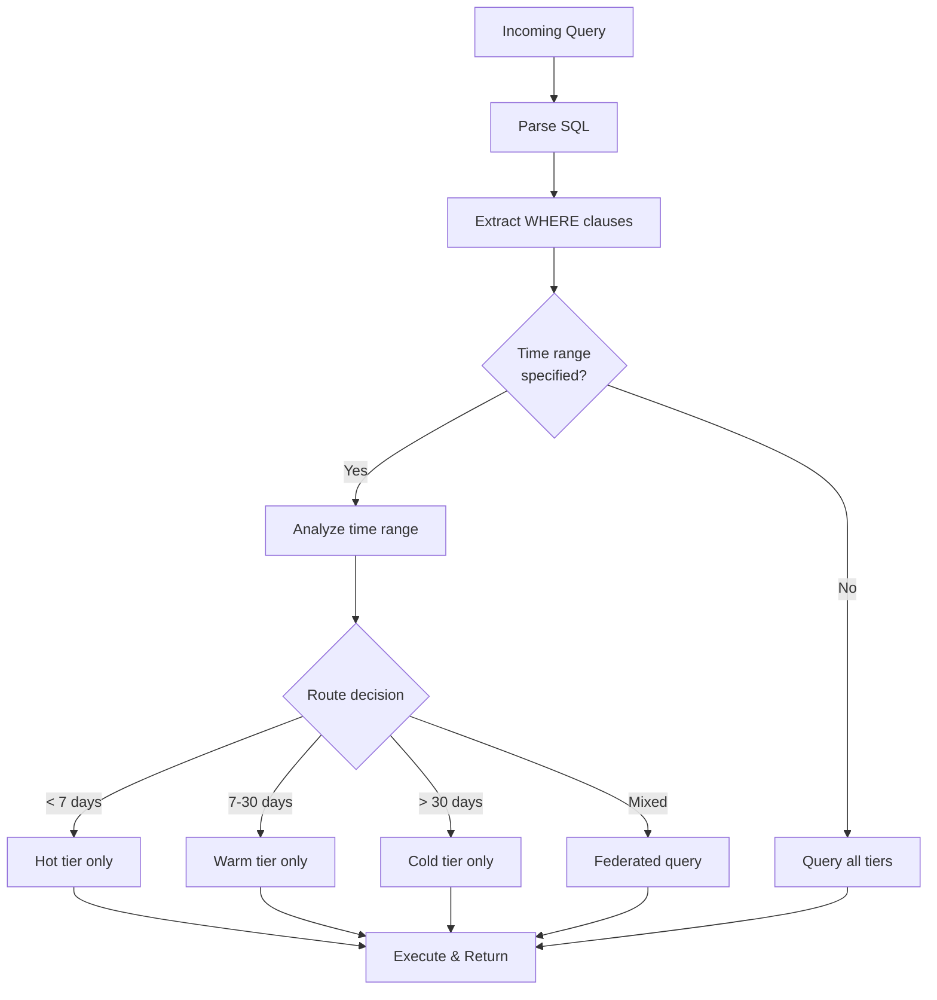
```mermaid
flowchart TB
    Query[Incoming Query]

    Query --> Parse[Parse SQL]
    Parse --> Extract[Extract WHERE clauses]

    Extract --> TimeCheck{Time range<br/>specified?}

    TimeCheck -->|No| AllTiers[Query all tiers]
    TimeCheck -->|Yes| Analyze[Analyze time range]

    Analyze --> Route{Route decision}

    Route -->|< 7 days| Hot[Hot tier only]
    Route -->|7-30 days| Warm[Warm tier only]
    Route -->|> 30 days| Cold[Cold tier only]
    Route -->|Mixed| Federation[Federated query]

    Hot --> Execute
    Warm --> Execute
    Cold --> Execute
    Federation --> Execute
    AllTiers --> Execute

    Execute[Execute & Return]
```

### Routing Configuration

```sql
-- View that automatically routes queries
CREATE VIEW logs_unified AS
SELECT * FROM clickhouse_hot.logs_db.logs
WHERE timestamp >= current_timestamp - INTERVAL '7' DAY
UNION ALL
SELECT * FROM clickhouse_warm.logs_db.logs_archive
WHERE timestamp >= current_timestamp - INTERVAL '30' DAY
  AND timestamp < current_timestamp - INTERVAL '7' DAY
UNION ALL
SELECT * FROM hive_cold.logs_db.logs_parquet
WHERE timestamp < current_timestamp - INTERVAL '30' DAY;
```

---

## Multi-Tenancy

### Tenant Isolation

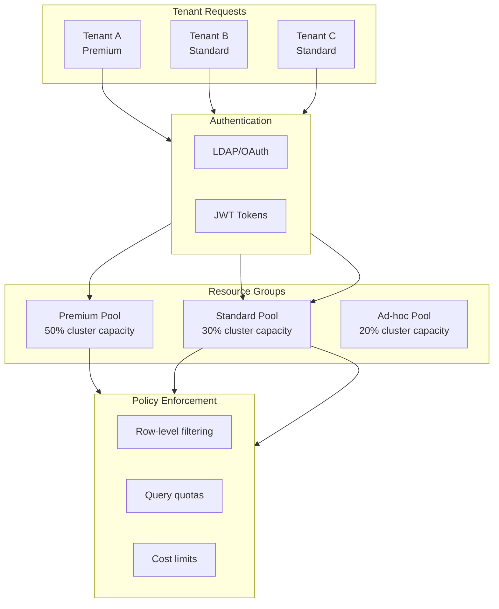
```mermaid
flowchart TB
    subgraph Tenants["Tenant Requests"]
        T1[Tenant A<br/>Premium]
        T2[Tenant B<br/>Standard]
        T3[Tenant C<br/>Standard]
    end

    subgraph Auth["Authentication"]
        LDAP[LDAP/OAuth]
        TOKEN[JWT Tokens]
    end

    subgraph Routing["Resource Groups"]
        RG1[Premium Pool<br/>50% cluster capacity]
        RG2[Standard Pool<br/>30% cluster capacity]
        RG3[Ad-hoc Pool<br/>20% cluster capacity]
    end

    subgraph Enforcement["Policy Enforcement"]
        ROW[Row-level filtering]
        QUOTA[Query quotas]
        COST[Cost limits]
    end

    T1 --> Auth --> RG1 --> Enforcement
    T2 --> Auth --> RG2 --> Enforcement
    T3 --> Auth --> RG2 --> Enforcement
```

### Resource Groups

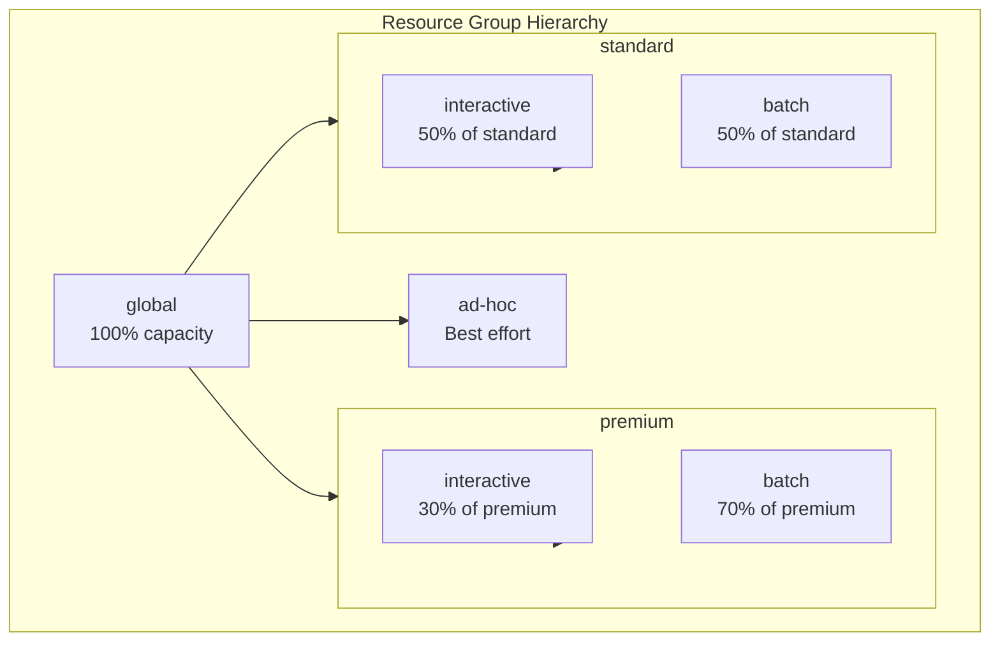
```mermaid
flowchart TB
    subgraph ResourceGroups["Resource Group Hierarchy"]
        ROOT[global<br/>100% capacity]

        subgraph Premium["premium"]
            P_INTER[interactive<br/>30% of premium]
            P_BATCH[batch<br/>70% of premium]
        end

        subgraph Standard["standard"]
            S_INTER[interactive<br/>50% of standard]
            S_BATCH[batch<br/>50% of standard]
        end

        ADHOC[ad-hoc<br/>Best effort]
    end

    ROOT --> Premium
    ROOT --> Standard
    ROOT --> ADHOC

    Premium --> P_INTER
    Premium --> P_BATCH
    Standard --> S_INTER
    Standard --> S_BATCH
```

### Resource Group Configuration

```json
{
  "rootGroups": [
    {
      "name": "global",
      "softMemoryLimit": "90%",
      "hardConcurrencyLimit": 500,
      "maxQueued": 1000,
      "subGroups": [
        {
          "name": "premium",
          "softMemoryLimit": "50%",
          "hardConcurrencyLimit": 200,
          "schedulingPolicy": "weighted_fair",
          "subGroups": [
            {
              "name": "interactive",
              "softMemoryLimit": "30%",
              "hardConcurrencyLimit": 50,
              "maxQueued": 100,
              "schedulingWeight": 10
            },
            {
              "name": "batch",
              "softMemoryLimit": "70%",
              "hardConcurrencyLimit": 150,
              "maxQueued": 500,
              "schedulingWeight": 5
            }
          ]
        },
        {
          "name": "standard",
          "softMemoryLimit": "30%",
          "hardConcurrencyLimit": 200,
          "maxQueued": 500
        },
        {
          "name": "adhoc",
          "softMemoryLimit": "20%",
          "hardConcurrencyLimit": 100,
          "maxQueued": 200
        }
      ]
    }
  ]
}
```

---

## Query Optimization

### Cost-Based Optimization

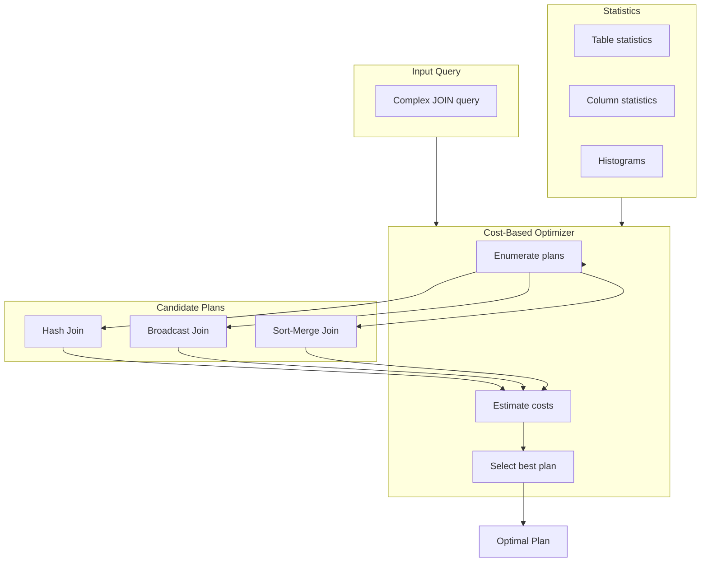
```mermaid
flowchart TB
    subgraph Input["Input Query"]
        SQL[Complex JOIN query]
    end

    subgraph Stats["Statistics"]
        TABLE_STATS[Table statistics]
        COL_STATS[Column statistics]
        HISTOGRAM[Histograms]
    end

    subgraph CBO["Cost-Based Optimizer"]
        ENUM[Enumerate plans]
        COST[Estimate costs]
        SELECT[Select best plan]
    end

    subgraph Plans["Candidate Plans"]
        PLAN1[Hash Join]
        PLAN2[Broadcast Join]
        PLAN3[Sort-Merge Join]
    end

    Input --> CBO
    Stats --> CBO
    CBO --> ENUM
    ENUM --> PLAN1 & PLAN2 & PLAN3
    PLAN1 & PLAN2 & PLAN3 --> COST
    COST --> SELECT
    SELECT --> Output[Optimal Plan]
```

### Pushdown Optimization

```mermaid
flowchart TB
    subgraph Original["Original Plan"]
        SCAN[Full Table Scan]
        FILTER[Filter: tenant='acme']
        PROJECT[Project: timestamp, message]
        AGG[Aggregate: count()]
    end

    subgraph Optimized["Optimized Plan"]
        PUSH_SCAN[Pushed-down Scan<br/>tenant='acme']
        PUSH_PROJECT[Pushed-down projection]
        PARTIAL_AGG[Partial aggregate]
        FINAL_AGG[Final aggregate]
    end

    Original -->|Pushdown| Optimized

    style Optimized fill:#6bcb77
```

### Partition Pruning

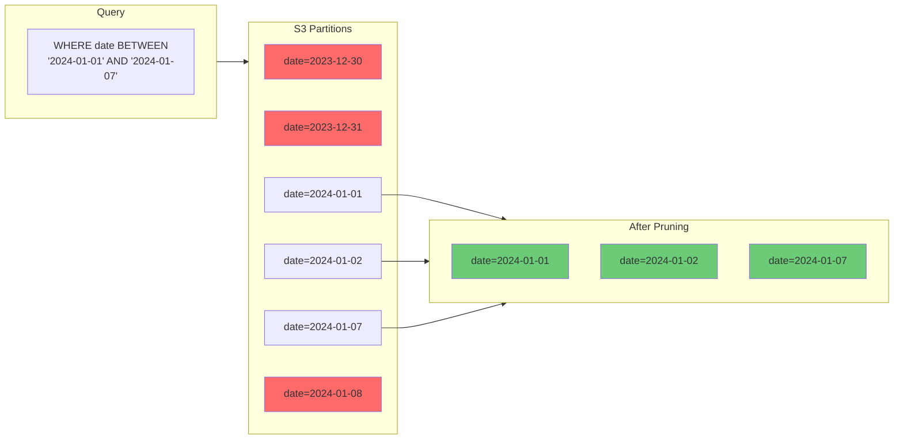
```mermaid
flowchart LR
    subgraph Query["Query"]
        WHERE[WHERE date BETWEEN<br/>'2024-01-01' AND '2024-01-07']
    end

    subgraph Partitions["S3 Partitions"]
        P1[date=2023-12-30]
        P2[date=2023-12-31]
        P3[date=2024-01-01]
        P4[date=2024-01-02]
        P5[date=2024-01-07]
        P6[date=2024-01-08]
    end

    subgraph Pruned["After Pruning"]
        PP3[date=2024-01-01]
        PP4[date=2024-01-02]
        PP5[date=2024-01-07]
    end

    Query --> Partitions
    P3 & P4 & P5 --> Pruned

    style P1 fill:#ff6b6b
    style P2 fill:#ff6b6b
    style P6 fill:#ff6b6b
    style PP3 fill:#6bcb77
    style PP4 fill:#6bcb77
    style PP5 fill:#6bcb77
```

---

## Query Lifecycle

### Request Processing

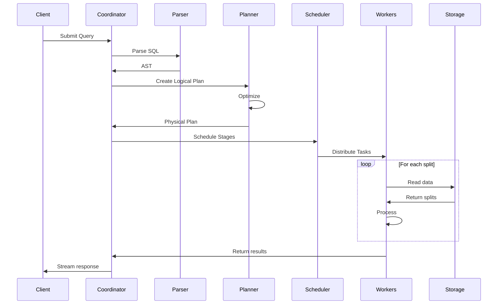
```mermaid
sequenceDiagram
    participant Client
    participant Coord as Coordinator
    participant Parser
    participant Planner
    participant Scheduler
    participant Workers
    participant Storage

    Client->>Coord: Submit Query
    Coord->>Parser: Parse SQL
    Parser->>Coord: AST

    Coord->>Planner: Create Logical Plan
    Planner->>Planner: Optimize
    Planner->>Coord: Physical Plan

    Coord->>Scheduler: Schedule Stages
    Scheduler->>Workers: Distribute Tasks

    loop For each split
        Workers->>Storage: Read data
        Storage->>Workers: Return splits
        Workers->>Workers: Process
    end

    Workers->>Coord: Return results
    Coord->>Client: Stream response
```

### Query States

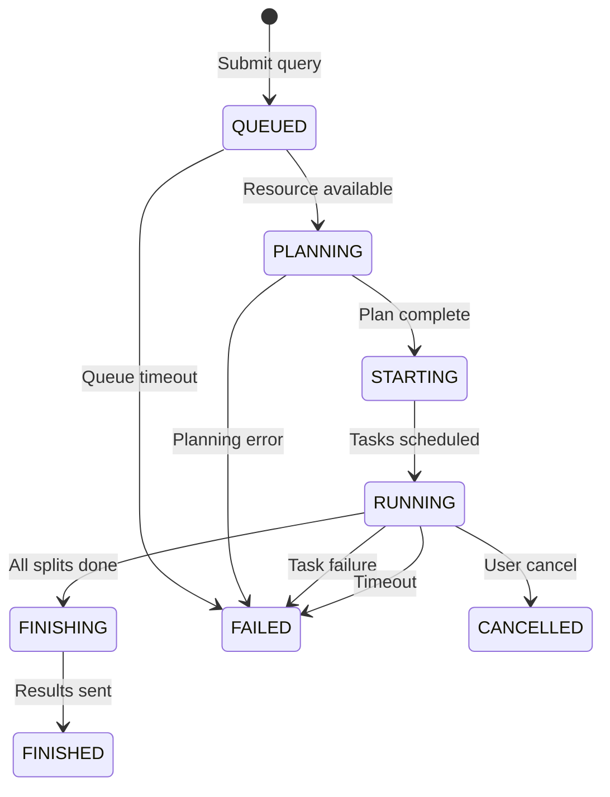
```mermaid
stateDiagram-v2
    [*] --> QUEUED: Submit query
    QUEUED --> PLANNING: Resource available
    PLANNING --> STARTING: Plan complete
    STARTING --> RUNNING: Tasks scheduled
    RUNNING --> FINISHING: All splits done
    FINISHING --> FINISHED: Results sent

    QUEUED --> FAILED: Queue timeout
    PLANNING --> FAILED: Planning error
    RUNNING --> FAILED: Task failure
    RUNNING --> FAILED: Timeout

    RUNNING --> CANCELLED: User cancel
```

---

## Result Handling

### Large Result Sets

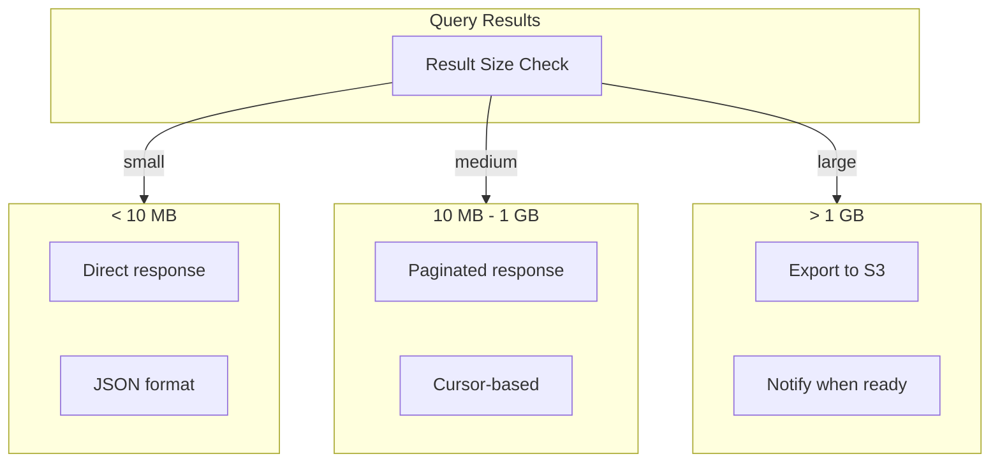
```mermaid
flowchart TB
    subgraph Query["Query Results"]
        SIZE[Result Size Check]
    end

    subgraph Small["< 10 MB"]
        DIRECT[Direct response]
        JSON[JSON format]
    end

    subgraph Medium["10 MB - 1 GB"]
        PAGINATE[Paginated response]
        CURSOR[Cursor-based]
    end

    subgraph Large["> 1 GB"]
        EXPORT[Export to S3]
        NOTIFY[Notify when ready]
    end

    SIZE -->|small| Small
    SIZE -->|medium| Medium
    SIZE -->|large| Large
```

### Pagination Flow

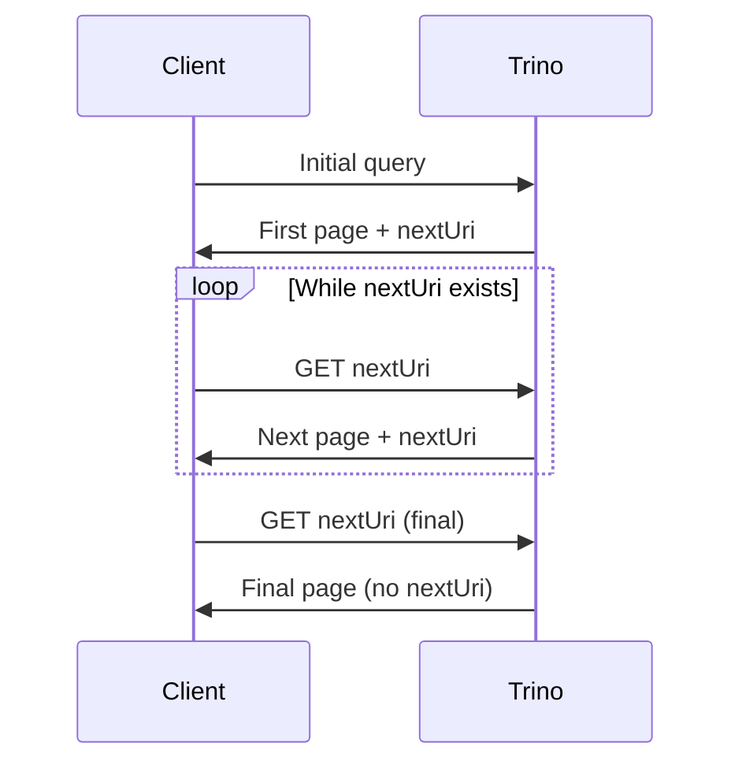
```mermaid
sequenceDiagram
    participant Client
    participant Trino

    Client->>Trino: Initial query
    Trino->>Client: First page + nextUri

    loop While nextUri exists
        Client->>Trino: GET nextUri
        Trino->>Client: Next page + nextUri
    end

    Client->>Trino: GET nextUri (final)
    Trino->>Client: Final page (no nextUri)
```

---

## Monitoring

### Key Metrics

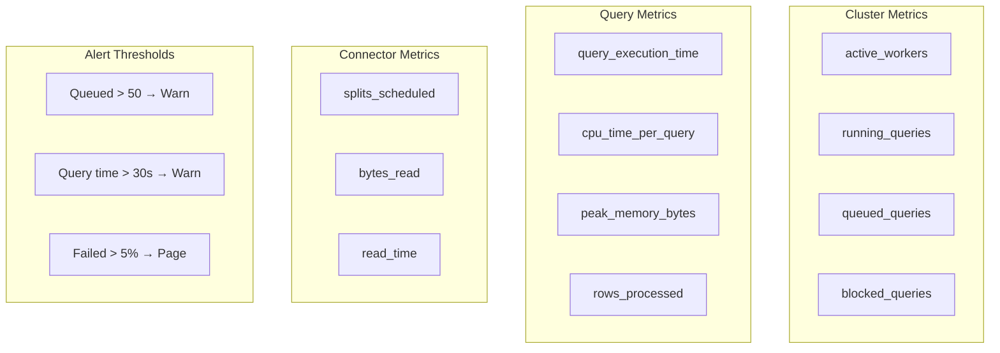
```mermaid
flowchart TB
    subgraph Cluster["Cluster Metrics"]
        CM1[active_workers]
        CM2[running_queries]
        CM3[queued_queries]
        CM4[blocked_queries]
    end

    subgraph Query["Query Metrics"]
        QM1[query_execution_time]
        QM2[cpu_time_per_query]
        QM3[peak_memory_bytes]
        QM4[rows_processed]
    end

    subgraph Connector["Connector Metrics"]
        CON1[splits_scheduled]
        CON2[bytes_read]
        CON3[read_time]
    end

    subgraph Alerts["Alert Thresholds"]
        A1[Queued > 50 → Warn]
        A2[Query time > 30s → Warn]
        A3[Failed > 5% → Page]
    end
```

### Dashboard Layout

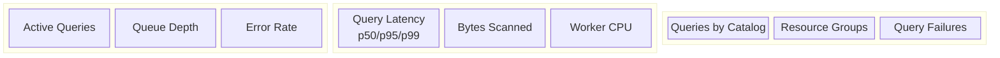
```mermaid
block-beta
    columns 3

    block:row1
        columns 3
        a["Active Queries"]
        b["Queue Depth"]
        c["Error Rate"]
    end

    block:row2
        columns 3
        d["Query Latency<br/>p50/p95/p99"]
        e["Bytes Scanned"]
        f["Worker CPU"]
    end

    block:row3
        columns 3
        g["Queries by Catalog"]
        h["Resource Groups"]
        i["Query Failures"]
    end
```

---

## Failure Handling

### Query Retry Strategy

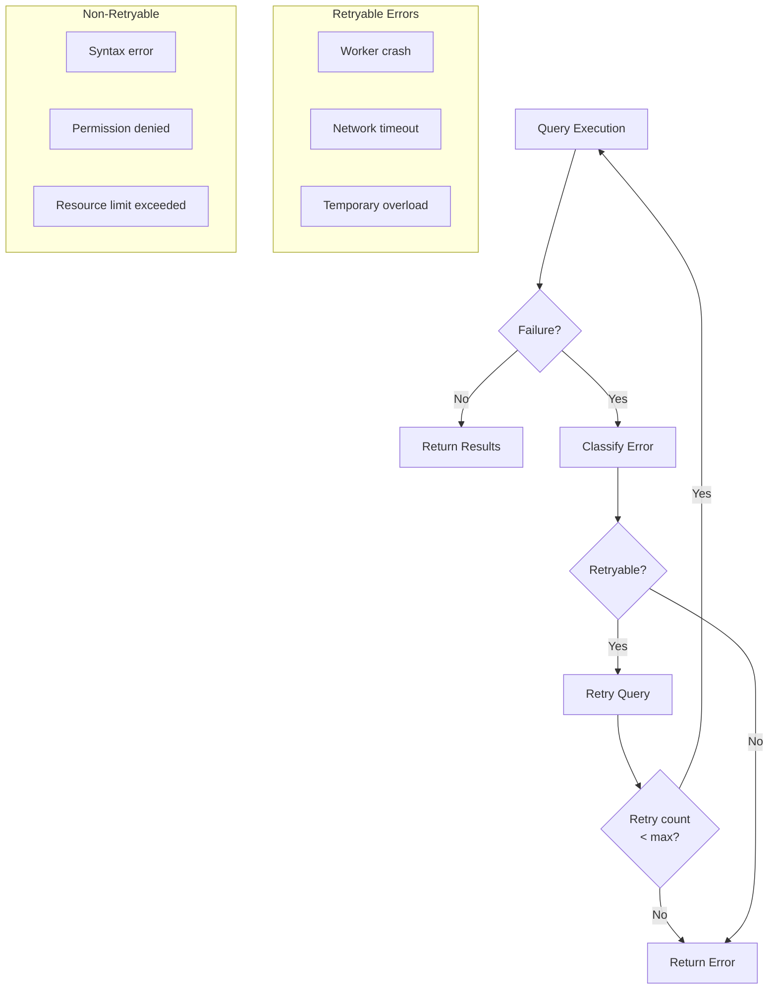
```mermaid
flowchart TB
    Query[Query Execution]

    Query --> Check{Failure?}

    Check -->|No| Success[Return Results]

    Check -->|Yes| Classify[Classify Error]

    Classify --> Retryable{Retryable?}

    Retryable -->|Yes| Retry[Retry Query]
    Retry --> RetryCount{Retry count<br/>< max?}
    RetryCount -->|Yes| Query
    RetryCount -->|No| Fail[Return Error]

    Retryable -->|No| Fail

    subgraph RetryableErrors["Retryable Errors"]
        E1[Worker crash]
        E2[Network timeout]
        E3[Temporary overload]
    end

    subgraph NonRetryable["Non-Retryable"]
        NE1[Syntax error]
        NE2[Permission denied]
        NE3[Resource limit exceeded]
    end
```

### Worker Failure

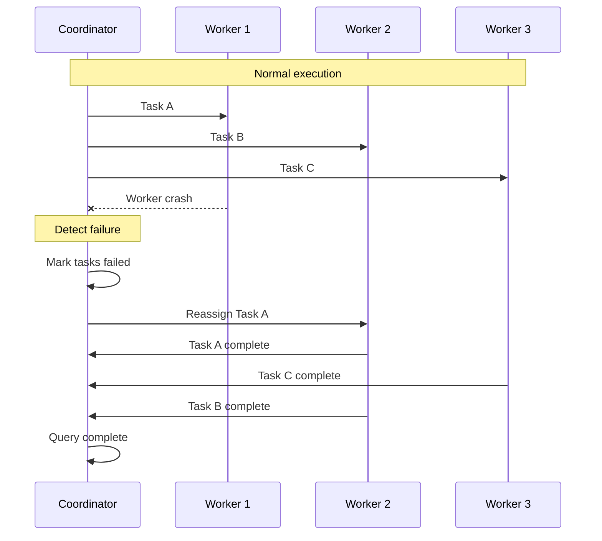
```mermaid
sequenceDiagram
    participant Coord as Coordinator
    participant W1 as Worker 1
    participant W2 as Worker 2
    participant W3 as Worker 3

    Note over Coord,W3: Normal execution
    Coord->>W1: Task A
    Coord->>W2: Task B
    Coord->>W3: Task C

    W1--xCoord: Worker crash

    Note over Coord: Detect failure
    Coord->>Coord: Mark tasks failed
    Coord->>W2: Reassign Task A
    W2->>Coord: Task A complete
    W3->>Coord: Task C complete
    W2->>Coord: Task B complete

    Coord->>Coord: Query complete
```

---

## Security

### Authentication Flow

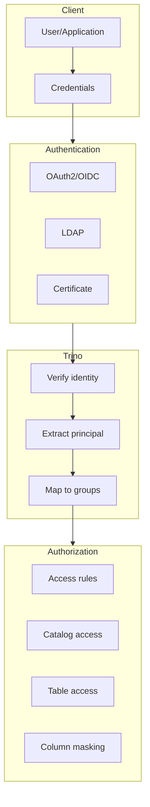
```mermaid
flowchart TB
    subgraph Client["Client"]
        USER[User/Application]
        CREDS[Credentials]
    end

    subgraph Auth["Authentication"]
        OAUTH[OAuth2/OIDC]
        LDAP[LDAP]
        CERT[Certificate]
    end

    subgraph Trino["Trino"]
        VERIFY[Verify identity]
        PRINCIPAL[Extract principal]
        GROUPS[Map to groups]
    end

    subgraph Authz["Authorization"]
        RULES[Access rules]
        CATALOG[Catalog access]
        TABLE[Table access]
        COLUMN[Column masking]
    end

    USER --> CREDS --> Auth
    Auth --> VERIFY --> PRINCIPAL --> GROUPS
    GROUPS --> Authz
```

### Column-Level Security

```mermaid
flowchart LR
    subgraph Original["Original Data"]
        FULL[user_id: 'john@example.com'<br/>ssn: '123-45-6789'<br/>amount: 500]
    end

    subgraph Rules["Masking Rules"]
        RULE1[SSN → masked]
        RULE2[email → hashed]
    end

    subgraph Result["Query Result"]
        MASKED[user_id: 'a1b2c3...'<br/>ssn: '***-**-****'<br/>amount: 500]
    end

    Original --> Rules --> Result
```

---

## Configuration Reference

### Coordinator Configuration

| Parameter | Value | Description |
|-----------|-------|-------------|
| `query.max-memory` | 50 GB | Max memory per query |
| `query.max-memory-per-node` | 10 GB | Max memory per node |
| `query.max-total-memory` | 100 GB | Total query memory |
| `query.max-execution-time` | 30 min | Query timeout |
| `query.max-run-time` | 1 hour | Total run time |

### Worker Configuration

| Parameter | Value | Description |
|-----------|-------|-------------|
| `task.concurrency` | 16 | Parallel tasks per worker |
| `task.max-worker-threads` | 64 | Worker thread pool |
| `memory.heap-headroom-per-node` | 2 GB | Reserved heap |
| `exchange.http-client.max-connections` | 250 | Connection pool |

### Session Properties

| Property | Default | Description |
|----------|---------|-------------|
| `query_max_run_time` | 30 min | Per-query override |
| `distributed_join` | true | Enable distributed joins |
| `push_aggregation_through_outer_join` | true | Optimization |
| `dictionary_aggregation` | false | For low-cardinality |
