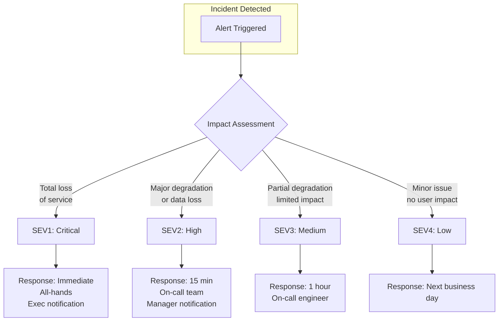
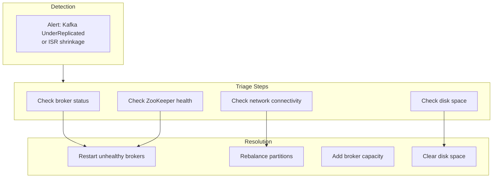
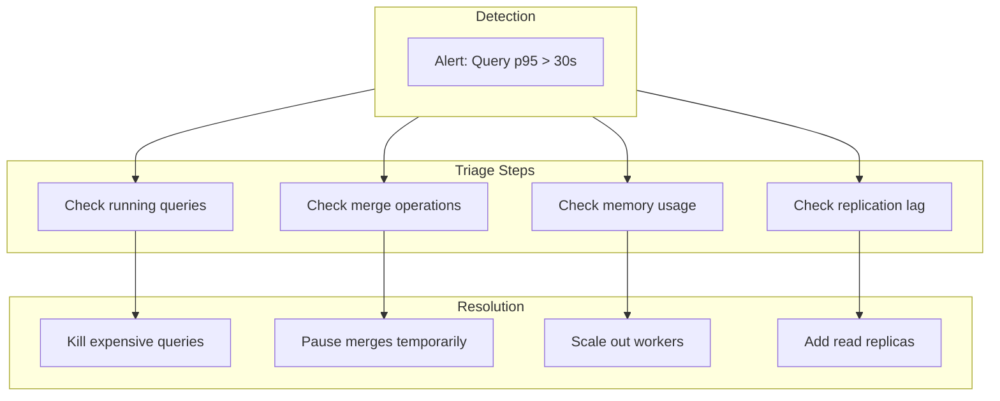
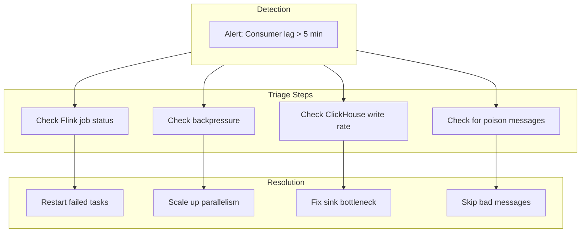
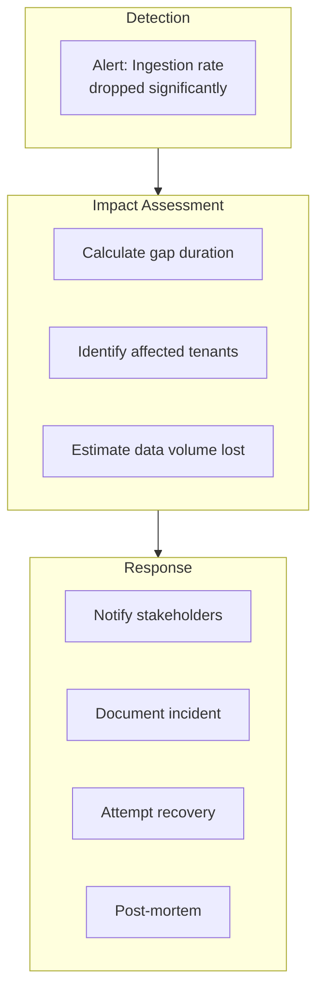
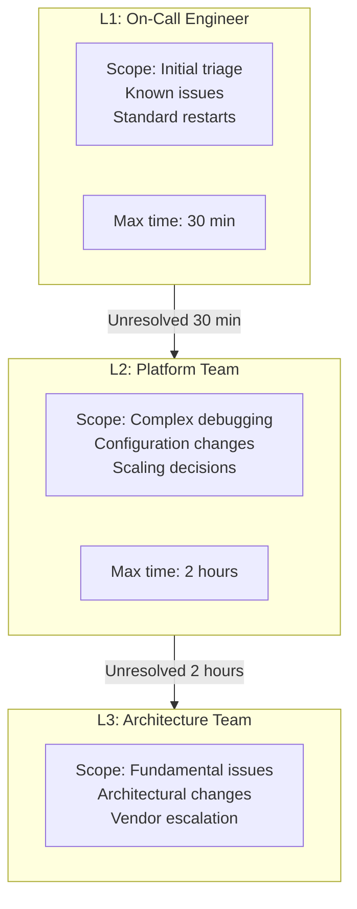
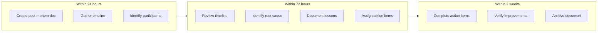
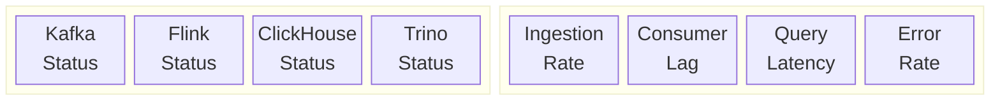

# Incident Response Runbook

## Overview

This runbook provides procedures for responding to incidents in the log ingestion system. All incidents should be classified by severity and handled according to these procedures.

---

## Severity Classification



### Severity Definitions

| Severity | Definition | Response Time | Escalation |
|----------|------------|---------------|------------|
| **SEV1** | Total ingestion failure, complete query outage | Immediate | VP Engineering |
| **SEV2** | >50% ingestion failure, data loss occurring | 15 minutes | Engineering Manager |
| **SEV3** | Single region degraded, minor data delay | 1 hour | Tech Lead |
| **SEV4** | Non-critical component issue, no user impact | Next business day | On-call |

---

## Common Incidents

### 1. Kafka Cluster Degraded



#### Diagnostic Commands

```bash
# Check broker status
kubectl get pods -n kafka -l app=kafka

# Check under-replicated partitions
kafka-topics.sh --describe --under-replicated-partitions \
  --bootstrap-server kafka:9092

# Check consumer lag
kafka-consumer-groups.sh --describe --all-groups \
  --bootstrap-server kafka:9092

# Check ZooKeeper status
echo stat | nc zookeeper:2181
```

#### Resolution Steps

1. **Identify unhealthy brokers**
   ```bash
   kubectl logs -n kafka kafka-0 --tail=100
   ```

2. **Check disk usage**
   ```bash
   kubectl exec -n kafka kafka-0 -- df -h /var/lib/kafka
   ```

3. **Restart broker if needed**
   ```bash
   kubectl rollout restart statefulset/kafka -n kafka
   ```

4. **Rebalance partitions**
   ```bash
   kafka-reassign-partitions.sh --execute \
     --reassignment-json-file rebalance.json \
     --bootstrap-server kafka:9092
   ```

---

### 2. ClickHouse Query Latency Spike



#### Diagnostic Queries

```sql
-- Check running queries
SELECT
    query_id,
    user,
    elapsed,
    read_rows,
    memory_usage,
    query
FROM system.processes
ORDER BY elapsed DESC
LIMIT 10;

-- Check merge status
SELECT
    database,
    table,
    elapsed,
    progress,
    is_mutation
FROM system.merges;

-- Check parts count
SELECT
    database,
    table,
    count() as parts,
    sum(rows) as total_rows,
    formatReadableSize(sum(bytes_on_disk)) as size
FROM system.parts
WHERE active
GROUP BY database, table
ORDER BY parts DESC;
```

#### Resolution Steps

1. **Kill expensive queries**
   ```sql
   KILL QUERY WHERE query_id = 'xxx';
   ```

2. **Identify hot tables**
   ```sql
   SELECT table, count() FROM system.query_log
   WHERE event_time > now() - INTERVAL 1 HOUR
   GROUP BY table ORDER BY count() DESC;
   ```

3. **Add temporary query limits**
   ```sql
   SET max_execution_time = 30;
   SET max_rows_to_read = 1000000000;
   ```

---

### 3. Flink Consumer Lag



#### Diagnostic Commands

```bash
# Check Flink job status
curl http://flink-jobmanager:8081/jobs

# Check job exceptions
curl http://flink-jobmanager:8081/jobs/{job-id}/exceptions

# Check consumer lag via Kafka
kafka-consumer-groups.sh --describe \
  --group flink-log-processor \
  --bootstrap-server kafka:9092
```

#### Resolution Steps

1. **Restart job from latest checkpoint**
   ```bash
   # Cancel current job
   flink cancel {job-id}

   # Restart from checkpoint
   flink run -s hdfs://checkpoints/latest \
     /opt/flink/jobs/log-processor.jar
   ```

2. **Scale up parallelism**
   ```bash
   # Modify Flink deployment
   kubectl scale deployment flink-taskmanager --replicas=100
   ```

3. **Check for stuck operators**
   ```bash
   curl http://flink-jobmanager:8081/jobs/{job-id}/vertices
   ```

---

### 4. Data Loss Event



#### Assessment Steps

1. **Identify time range**
   ```sql
   -- Find gap in data
   SELECT
       toStartOfMinute(timestamp) as minute,
       count() as records
   FROM logs
   WHERE tenant_id = 'affected-tenant'
     AND timestamp > now() - INTERVAL 2 HOUR
   GROUP BY minute
   ORDER BY minute;
   ```

2. **Estimate data loss**
   ```sql
   -- Compare to baseline
   SELECT
       avg(count) as baseline
   FROM (
       SELECT count() as count
       FROM logs
       WHERE timestamp > now() - INTERVAL 7 DAY
         AND timestamp < now() - INTERVAL 1 DAY
       GROUP BY toStartOfMinute(timestamp)
   );
   ```

3. **Check collection agents**
   ```bash
   # Check for buffered data
   kubectl exec -n logging fluent-bit-xxx -- \
     curl localhost:2020/api/v1/storage
   ```

#### Recovery Options

1. **Replay from Kafka** (if data still in retention)
   ```bash
   # Reset consumer offset
   kafka-consumer-groups.sh --reset-offsets \
     --to-datetime 2024-01-15T10:00:00.000 \
     --execute --group flink-log-processor \
     --topic logs.tenant.service
   ```

2. **Accept data loss**
   - Document in incident report
   - Notify affected users
   - Review buffer sizing

---

## Escalation Matrix



### Contact Information

| Role | Name | Phone | Slack |
|------|------|-------|-------|
| On-Call Primary | (Rotates) | +1-xxx-xxx-xxxx | @oncall-primary |
| On-Call Secondary | (Rotates) | +1-xxx-xxx-xxxx | @oncall-secondary |
| Platform Tech Lead | [Name] | +1-xxx-xxx-xxxx | @platform-lead |
| Engineering Manager | [Name] | +1-xxx-xxx-xxxx | @eng-manager |

---

## Communication Templates

### Initial Notification

```markdown
**INCIDENT: [Title]**
**Severity:** SEV[X]
**Time Detected:** [Timestamp]
**Impact:** [Description of user impact]

**Current Status:**
- [Symptom 1]
- [Symptom 2]

**Next Steps:**
- [Action 1]
- [Action 2]

**Updates will be posted every [15/30/60] minutes.**
```

### Resolution Notification

```markdown
**RESOLVED: [Title]**
**Duration:** [X hours Y minutes]
**Root Cause:** [Brief description]
**Resolution:** [What was done to fix]

**Impact Summary:**
- Affected tenants: [List or count]
- Data loss: [None / X hours for tenant Y]
- Query degradation: [Duration]

**Post-mortem scheduled for [Date].**
```

---

## Post-Mortem Process



### Post-Mortem Template

```markdown
# Post-Mortem: [Incident Title]

## Summary
[1-2 sentence summary]

## Timeline
| Time (UTC) | Event |
|------------|-------|
| HH:MM | First alert triggered |
| HH:MM | Engineer acknowledged |
| HH:MM | Root cause identified |
| HH:MM | Fix deployed |
| HH:MM | Incident resolved |

## Impact
- Duration: X hours Y minutes
- Affected users/tenants: [List]
- Data loss: [None / Details]

## Root Cause
[Detailed technical explanation]

## Resolution
[What was done to fix the immediate issue]

## Action Items
| Action | Owner | Due Date | Status |
|--------|-------|----------|--------|
| [Action 1] | [Name] | [Date] | Open |
| [Action 2] | [Name] | [Date] | Open |

## Lessons Learned
- What went well:
  - [Item]
- What went poorly:
  - [Item]
- Where we got lucky:
  - [Item]
```

---

## Health Checks

### Quick Health Verification

```bash
#!/bin/bash
# health-check.sh

echo "=== Kafka Health ==="
kafka-broker-api-versions.sh --bootstrap-server kafka:9092 > /dev/null && \
  echo "OK: Kafka responding" || echo "FAIL: Kafka not responding"

echo ""
echo "=== ClickHouse Health ==="
clickhouse-client --query "SELECT 1" > /dev/null && \
  echo "OK: ClickHouse responding" || echo "FAIL: ClickHouse not responding"

echo ""
echo "=== Flink Health ==="
curl -s http://flink-jobmanager:8081/jobs | jq -r '.jobs[0].status' | \
  grep -q "RUNNING" && \
  echo "OK: Flink job running" || echo "FAIL: Flink job not running"

echo ""
echo "=== Consumer Lag ==="
LAG=$(kafka-consumer-groups.sh --describe --group flink-log-processor \
  --bootstrap-server kafka:9092 2>/dev/null | \
  awk '{sum += $6} END {print sum}')
echo "Current lag: $LAG messages"
```

### System Dashboard Checks


