# Maintenance Operations Runbook

## Overview

This runbook covers routine maintenance operations including upgrades, backups, health checks, and scheduled maintenance windows.

---

## Maintenance Windows

```mermaid
gantt
    title Weekly Maintenance Schedule
    dateFormat  HH:mm
    axisFormat %H:%M

    section Primary Window
    US Low Traffic     :a1, 04:00, 2h

    section Secondary Window
    EU Low Traffic     :a2, 22:00, 2h

    section Monthly
    Full Maintenance   :a3, 02:00, 4h
```

### Maintenance Types

| Type | Frequency | Window | Notification |
|------|-----------|--------|--------------|
| **Routine Health Check** | Daily | Anytime | None |
| **Minor Updates** | Weekly | Primary window | 24 hours |
| **Major Upgrades** | Monthly | Full maintenance | 1 week |
| **Emergency Patches** | As needed | Immediate | Post-facto |

---

## Version Upgrades

### Kafka Upgrade

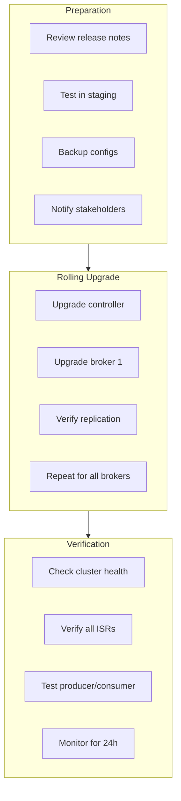

#### Procedure

1. **Pre-upgrade checks**
   ```bash
   # Check current version
   kafka-broker-api-versions.sh --bootstrap-server kafka:9092 | head -1

   # Ensure no under-replicated partitions
   kafka-topics.sh --describe --under-replicated-partitions \
     --bootstrap-server kafka:9092

   # Check consumer lag
   kafka-consumer-groups.sh --describe --all-groups \
     --bootstrap-server kafka:9092
   ```

2. **Rolling restart with new version**
   ```bash
   # For each broker (one at a time)
   kubectl set image statefulset/kafka kafka=kafka:new-version -n kafka

   # Wait for pod to be ready
   kubectl rollout status statefulset/kafka -n kafka --timeout=10m

   # Verify broker rejoined
   kafka-broker-api-versions.sh --bootstrap-server kafka-0:9092
   ```

3. **Post-upgrade verification**
   ```bash
   # Check all brokers running new version
   for i in 0 1 2; do
     echo "Broker $i:"
     kafka-broker-api-versions.sh --bootstrap-server kafka-$i:9092 | head -1
   done

   # Verify cluster health
   kafka-topics.sh --describe --under-replicated-partitions \
     --bootstrap-server kafka:9092
   ```

### ClickHouse Upgrade

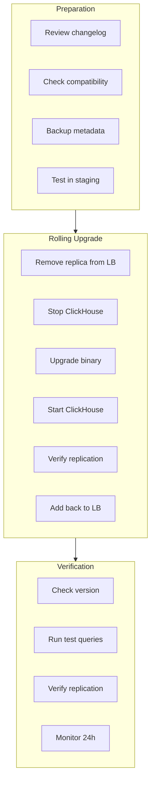

#### Procedure

1. **Pre-upgrade backup**
   ```sql
   -- Backup table definitions
   SELECT create_table_query
   FROM system.tables
   WHERE database = 'logs_db';

   -- Note current data sizes
   SELECT
       database,
       table,
       formatReadableSize(sum(bytes_on_disk)) as size
   FROM system.parts
   WHERE active
   GROUP BY database, table;
   ```

2. **Rolling upgrade per replica**
   ```bash
   # For each replica in each shard
   # 1. Remove from load balancer
   kubectl annotate pod clickhouse-0 \
     service.kubernetes.io/load-balancer-remove=true

   # 2. Wait for connections to drain
   sleep 30

   # 3. Upgrade
   kubectl set image statefulset/clickhouse \
     clickhouse=clickhouse/clickhouse-server:new-version

   # 4. Wait for ready
   kubectl rollout status statefulset/clickhouse --timeout=10m

   # 5. Add back to load balancer
   kubectl annotate pod clickhouse-0 \
     service.kubernetes.io/load-balancer-remove-
   ```

3. **Post-upgrade verification**
   ```sql
   -- Check version
   SELECT version();

   -- Verify replication
   SELECT database, table, replica_is_active
   FROM system.replicas;

   -- Test query performance
   SELECT count() FROM logs WHERE timestamp > now() - INTERVAL 1 HOUR;
   ```

### Flink Upgrade

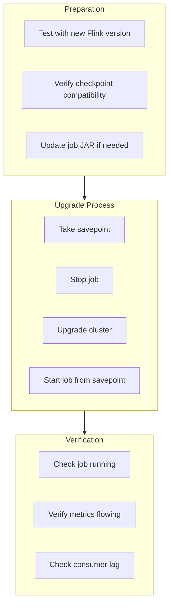

#### Procedure

1. **Take savepoint**
   ```bash
   # Create savepoint
   SAVEPOINT=$(flink savepoint {job-id} s3://bucket/savepoints/)
   echo "Savepoint: $SAVEPOINT"
   ```

2. **Stop job**
   ```bash
   flink cancel {job-id}
   ```

3. **Upgrade Flink cluster**
   ```bash
   # Update JobManager
   kubectl set image deployment/flink-jobmanager \
     flink=flink:new-version -n flink

   # Update TaskManagers
   kubectl set image deployment/flink-taskmanager \
     flink=flink:new-version -n flink

   # Wait for rollout
   kubectl rollout status deployment/flink-jobmanager -n flink
   kubectl rollout status deployment/flink-taskmanager -n flink
   ```

4. **Restart job from savepoint**
   ```bash
   flink run -s $SAVEPOINT /opt/flink/jobs/log-processor.jar
   ```

---

## Health Checks

### Daily Health Check

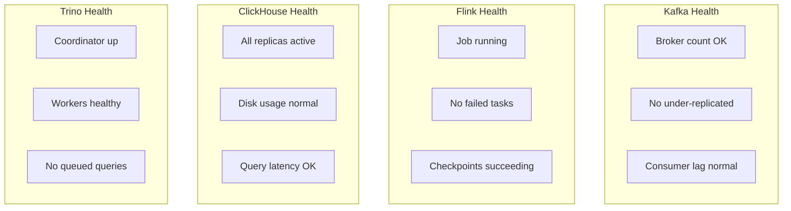

#### Automated Check Script

```bash
#!/bin/bash
# daily-health-check.sh

echo "====== DAILY HEALTH CHECK $(date) ======"

echo ""
echo "=== KAFKA ==="
echo "Brokers: $(kubectl get pods -n kafka -l app=kafka --no-headers | wc -l)"
echo "Under-replicated: $(kafka-topics.sh --describe --under-replicated-partitions --bootstrap-server kafka:9092 2>/dev/null | wc -l)"

echo ""
echo "=== FLINK ==="
JOB_STATUS=$(curl -s http://flink-jobmanager:8081/jobs | jq -r '.jobs[0].status')
echo "Job status: $JOB_STATUS"

echo ""
echo "=== CLICKHOUSE ==="
REPLICAS=$(clickhouse-client --query "SELECT count() FROM system.replicas WHERE is_readonly = 0")
echo "Active replicas: $REPLICAS"

echo ""
echo "=== TRINO ==="
WORKERS=$(curl -s http://trino-coordinator:8080/v1/cluster | jq '.runningWorkers')
echo "Running workers: $WORKERS"

echo ""
echo "=== SUMMARY ==="
if [[ "$JOB_STATUS" == "RUNNING" && $WORKERS -gt 0 ]]; then
    echo "STATUS: HEALTHY"
else
    echo "STATUS: DEGRADED - Manual review required"
fi
```

### Weekly Deep Health Check

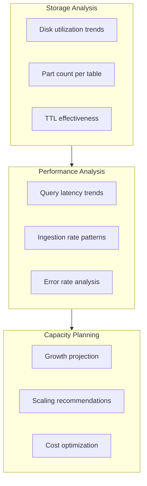

---

## Backup Procedures

### Configuration Backup

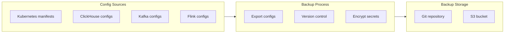

#### Procedure

```bash
#!/bin/bash
# backup-configs.sh

BACKUP_DIR="/backup/$(date +%Y%m%d)"
mkdir -p $BACKUP_DIR

# Kubernetes resources
kubectl get configmaps -n kafka -o yaml > $BACKUP_DIR/kafka-configmaps.yaml
kubectl get configmaps -n flink -o yaml > $BACKUP_DIR/flink-configmaps.yaml
kubectl get configmaps -n clickhouse -o yaml > $BACKUP_DIR/clickhouse-configmaps.yaml

# ClickHouse table schemas
clickhouse-client --query "SELECT create_table_query FROM system.tables" \
  > $BACKUP_DIR/clickhouse-schemas.sql

# Kafka topic configs
kafka-topics.sh --describe --bootstrap-server kafka:9092 \
  > $BACKUP_DIR/kafka-topics.txt

# Upload to S3
aws s3 sync $BACKUP_DIR s3://backup-bucket/configs/$(date +%Y%m%d)/
```

### ClickHouse Metadata Backup

```sql
-- Backup table definitions
SELECT
    database,
    name as table_name,
    create_table_query
FROM system.tables
WHERE database NOT IN ('system', 'INFORMATION_SCHEMA')
INTO OUTFILE '/backup/table_definitions.sql'
FORMAT TSVRaw;

-- Backup user/role definitions
SELECT create_query FROM system.users INTO OUTFILE '/backup/users.sql';
SELECT create_query FROM system.roles INTO OUTFILE '/backup/roles.sql';
```

---

## Disk Cleanup

### ClickHouse Cleanup

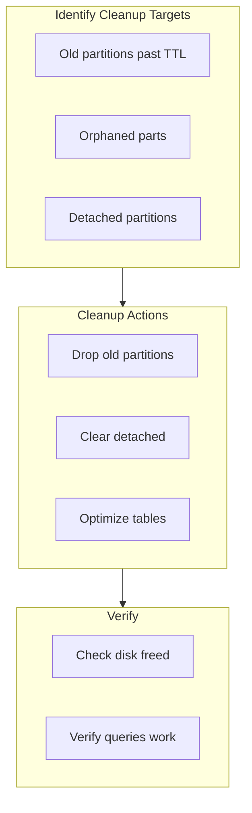

#### Procedure

```sql
-- Check TTL status
SELECT
    database,
    table,
    partition,
    min_date,
    max_date,
    formatReadableSize(sum(bytes_on_disk)) as size
FROM system.parts
WHERE table = 'logs_local'
  AND max_date < today() - 7
GROUP BY database, table, partition, min_date, max_date;

-- Force TTL cleanup (if behind)
ALTER TABLE logs_local MATERIALIZE TTL;

-- Check for detached partitions
SELECT * FROM system.detached_parts;

-- Clear old detached parts (careful!)
-- ALTER TABLE logs_local DROP DETACHED PARTITION 'xxx';

-- Optimize to merge small parts
OPTIMIZE TABLE logs_local FINAL;
```

### Kafka Cleanup

```bash
# Check disk usage per topic
kafka-log-dirs.sh --describe \
  --bootstrap-server kafka:9092 \
  --topic-list logs.tenant-a.service-1

# Force log segment deletion (if retention not working)
kafka-delete-records.sh --bootstrap-server kafka:9092 \
  --offset-json-file offsets.json
```

---

## Monitoring System Maintenance

### Prometheus Maintenance

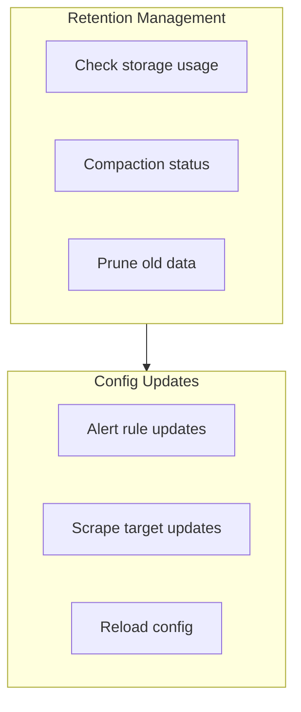

#### Procedure

```bash
# Check Prometheus disk usage
curl http://prometheus:9090/api/v1/status/tsdb | jq

# Reload configuration
curl -X POST http://prometheus:9090/-/reload

# Check targets
curl http://prometheus:9090/api/v1/targets | jq '.data.activeTargets | length'
```

### Grafana Maintenance

```bash
# Backup dashboards
for uid in $(curl -s http://grafana:3000/api/search | jq -r '.[].uid'); do
  curl -s "http://grafana:3000/api/dashboards/uid/$uid" \
    > "/backup/dashboards/$uid.json"
done

# Clear old annotations
curl -X POST http://grafana:3000/api/annotations/mass-delete \
  -d '{"dashboardId": null, "limit": 10000, "olderThan": "30d"}'
```

---

## Certificate Rotation

### TLS Certificate Renewal

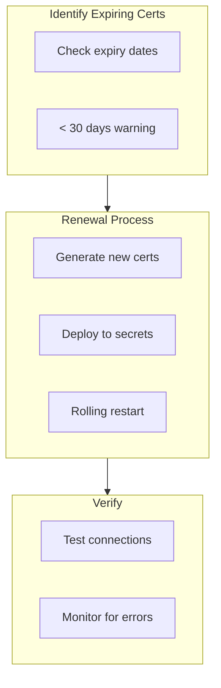

#### Check Certificate Expiry

```bash
#!/bin/bash
# check-certs.sh

echo "=== Certificate Expiry Check ==="

# Kafka
echo "Kafka:"
kubectl get secret kafka-tls -n kafka -o jsonpath='{.data.tls\.crt}' | \
  base64 -d | openssl x509 -noout -enddate

# ClickHouse
echo "ClickHouse:"
kubectl get secret clickhouse-tls -n clickhouse -o jsonpath='{.data.tls\.crt}' | \
  base64 -d | openssl x509 -noout -enddate

# Trino
echo "Trino:"
kubectl get secret trino-tls -n trino -o jsonpath='{.data.tls\.crt}' | \
  base64 -d | openssl x509 -noout -enddate
```

---

## Maintenance Checklist

### Pre-Maintenance

- [ ] Notify stakeholders (24h advance for major changes)
- [ ] Review change request
- [ ] Verify rollback procedure
- [ ] Check current system health
- [ ] Ensure backup is current
- [ ] Verify staging tests passed

### During Maintenance

- [ ] Update status page
- [ ] Follow documented procedure
- [ ] Monitor for unexpected issues
- [ ] Document any deviations
- [ ] Verify each step before proceeding

### Post-Maintenance

- [ ] Verify system health
- [ ] Run smoke tests
- [ ] Check monitoring for anomalies
- [ ] Update status page
- [ ] Notify stakeholders of completion
- [ ] Document lessons learned

---

## Emergency Maintenance

### Emergency Procedure

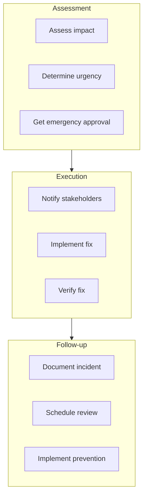

### Emergency Contacts

| Role | Contact | Authority |
|------|---------|-----------|
| On-Call Engineer | PagerDuty | Standard changes |
| Platform Lead | Direct | Emergency changes |
| VP Engineering | Direct | Service-affecting changes |
