# Scaling Operations Runbook

## Overview

This runbook provides procedures for scaling the log ingestion system to handle increased load or to optimize costs during low-traffic periods.

---

## Scaling Triggers

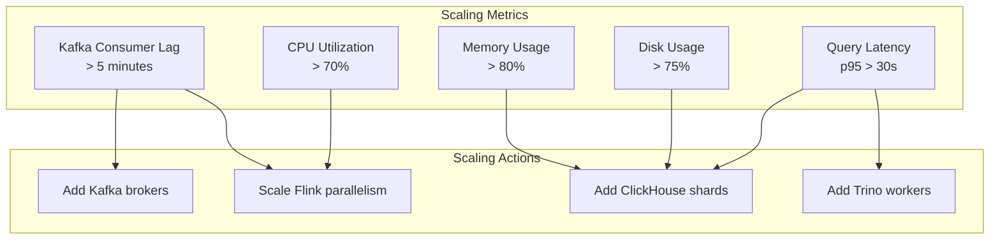

---

## Kafka Scaling

### Adding Brokers

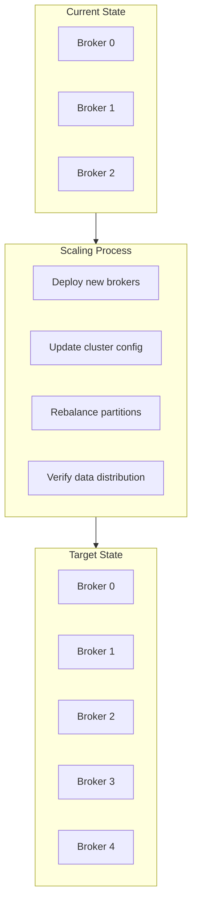

#### Procedure

1. **Verify current state**
   ```bash
   # Check current broker count
   kubectl get pods -n kafka -l app=kafka

   # Check partition distribution
   kafka-topics.sh --describe --topic logs.tenant.service \
     --bootstrap-server kafka:9092
   ```

2. **Scale StatefulSet**
   ```bash
   # Scale from 3 to 5 brokers
   kubectl scale statefulset kafka -n kafka --replicas=5

   # Wait for new brokers
   kubectl rollout status statefulset/kafka -n kafka
   ```

3. **Generate reassignment plan**
   ```bash
   # Create topics.json with topics to rebalance
   cat > topics.json << EOF
   {"topics": [
     {"topic": "logs.tenant-a.service-1"},
     {"topic": "logs.tenant-b.service-1"}
   ], "version": 1}
   EOF

   # Generate plan
   kafka-reassign-partitions.sh --generate \
     --topics-to-move-json-file topics.json \
     --broker-list "0,1,2,3,4" \
     --bootstrap-server kafka:9092 \
     > reassignment.json
   ```

4. **Execute reassignment with throttling**
   ```bash
   # Apply throttle to prevent overload
   kafka-reassign-partitions.sh --execute \
     --reassignment-json-file reassignment.json \
     --bootstrap-server kafka:9092 \
     --throttle 100000000  # 100 MB/s
   ```

5. **Monitor progress**
   ```bash
   # Check reassignment status
   kafka-reassign-partitions.sh --verify \
     --reassignment-json-file reassignment.json \
     --bootstrap-server kafka:9092
   ```

6. **Remove throttle**
   ```bash
   kafka-reassign-partitions.sh --verify \
     --reassignment-json-file reassignment.json \
     --bootstrap-server kafka:9092
   # Throttle automatically removed when complete
   ```

### Partition Expansion

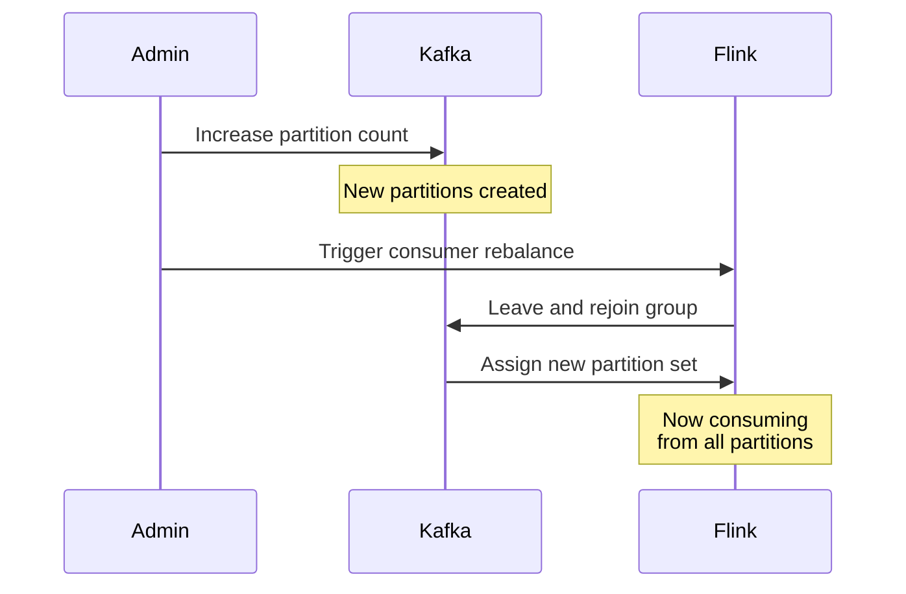

#### Procedure

```bash
# Increase partitions (100 -> 200)
kafka-topics.sh --alter \
  --topic logs.tenant-a.service-1 \
  --partitions 200 \
  --bootstrap-server kafka:9092

# Note: This will trigger Flink consumer rebalance automatically
```

---

## Flink Scaling

### Horizontal Scaling

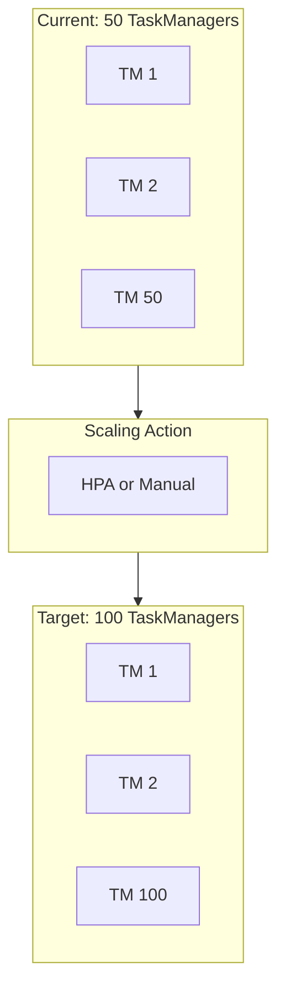

#### Procedure

1. **Check current state**
   ```bash
   # Current TaskManager count
   kubectl get pods -n flink -l component=taskmanager | wc -l

   # Check consumer lag
   curl http://flink-jobmanager:8081/jobs/{job-id}/metrics \
     | jq '.[] | select(.id | contains("lag"))'
   ```

2. **Scale TaskManagers**
   ```bash
   # Manual scaling
   kubectl scale deployment flink-taskmanager -n flink --replicas=100

   # Or update HPA limits
   kubectl patch hpa flink-taskmanager -n flink \
     -p '{"spec":{"maxReplicas":100}}'
   ```

3. **Trigger job rescale**
   ```bash
   # Take savepoint
   flink savepoint {job-id} s3://bucket/savepoints/

   # Cancel job
   flink cancel {job-id}

   # Restart with new parallelism
   flink run -p 400 -s s3://bucket/savepoints/latest \
     /opt/flink/jobs/log-processor.jar
   ```

4. **Verify scaling**
   ```bash
   # Check new parallelism
   curl http://flink-jobmanager:8081/jobs/{job-id}/vertices \
     | jq '.[].parallelism'

   # Monitor lag reduction
   watch -n 5 "kafka-consumer-groups.sh --describe \
     --group flink-log-processor --bootstrap-server kafka:9092"
   ```

### Parallelism Adjustment

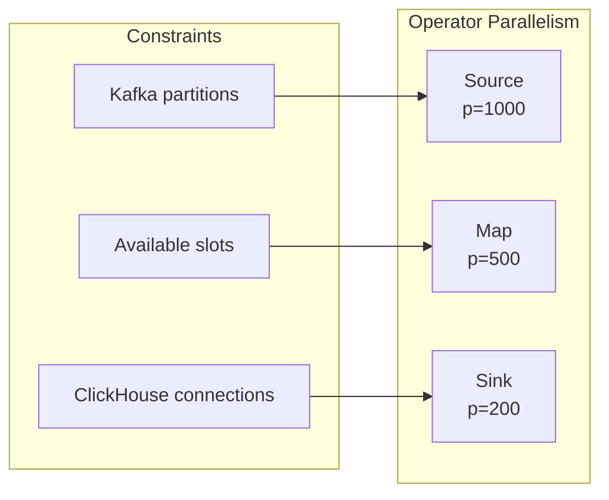

---

## ClickHouse Scaling

### Adding Shards

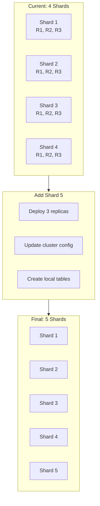

#### Procedure

1. **Deploy new shard nodes**
   ```bash
   # Update replica count
   kubectl scale statefulset clickhouse-shard-5 -n clickhouse --replicas=3

   # Wait for pods
   kubectl rollout status statefulset/clickhouse-shard-5 -n clickhouse
   ```

2. **Update cluster configuration**
   ```xml
   <!-- Add to config.xml on all nodes -->
   <remote_servers>
       <logs_cluster>
           <!-- Existing shards -->
           <shard>...</shard>

           <!-- New shard 5 -->
           <shard>
               <replica>
                   <host>clickhouse-shard-5-0</host>
                   <port>9000</port>
               </replica>
               <replica>
                   <host>clickhouse-shard-5-1</host>
                   <port>9000</port>
               </replica>
               <replica>
                   <host>clickhouse-shard-5-2</host>
                   <port>9000</port>
               </replica>
           </shard>
       </logs_cluster>
   </remote_servers>
   ```

3. **Create tables on new shard**
   ```sql
   -- On each new replica
   CREATE TABLE logs_local ON CLUSTER 'logs_cluster'
   (
       -- Same schema as existing
   ) ENGINE = ReplicatedMergeTree(...)
   ```

4. **Verify shard weight**
   ```sql
   -- Check data distribution
   SELECT
       hostName() as host,
       count() as rows
   FROM logs_distributed
   GROUP BY host;
   ```

### Adding Replicas

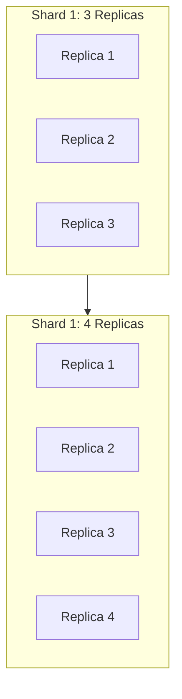

#### Procedure

```bash
# Scale up replicas for shard 1
kubectl scale statefulset clickhouse-shard-1 -n clickhouse --replicas=4

# The new replica will automatically sync from ZooKeeper
# Monitor replication progress
watch "clickhouse-client --query 'SELECT * FROM system.replicas'"
```

### Storage Expansion

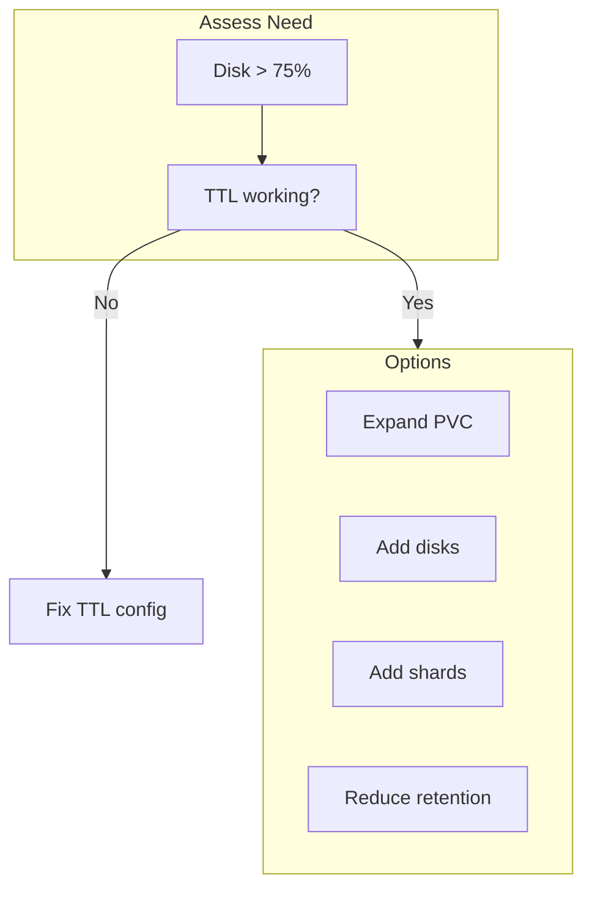

---

## Trino Scaling

### Adding Workers

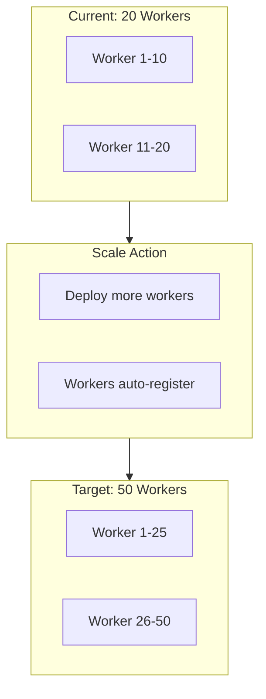

#### Procedure

1. **Check current state**
   ```bash
   # Current worker count
   curl http://trino-coordinator:8080/v1/cluster | jq '.runningWorkers'

   # Active queries
   curl http://trino-coordinator:8080/v1/query | jq 'length'
   ```

2. **Scale workers**
   ```bash
   # Scale deployment
   kubectl scale deployment trino-worker -n trino --replicas=50

   # Wait for workers to register
   watch "curl -s http://trino-coordinator:8080/v1/cluster | jq '.runningWorkers'"
   ```

3. **Verify capacity**
   ```bash
   # Check cluster status
   curl http://trino-coordinator:8080/v1/cluster | jq
   ```

### Resource Group Adjustment

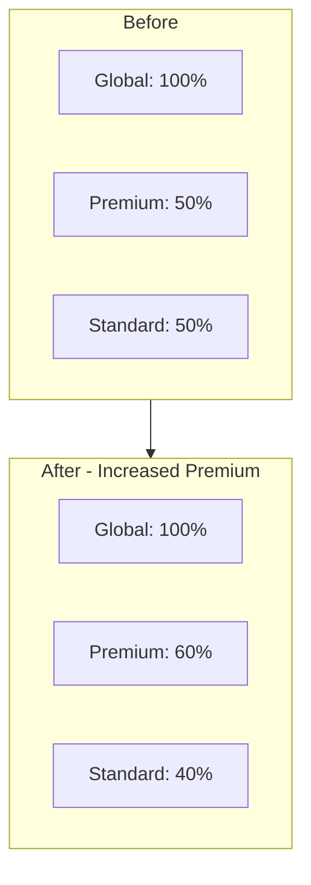

---

## Auto-Scaling Configuration

### Kubernetes HPA

```yaml
# Flink TaskManager HPA
apiVersion: autoscaling/v2
kind: HorizontalPodAutoscaler
metadata:
  name: flink-taskmanager
  namespace: flink
spec:
  scaleTargetRef:
    apiVersion: apps/v1
    kind: Deployment
    name: flink-taskmanager
  minReplicas: 50
  maxReplicas: 200
  metrics:
  - type: External
    external:
      metric:
        name: kafka_consumer_lag
        selector:
          matchLabels:
            consumer_group: flink-log-processor
      target:
        type: AverageValue
        averageValue: "1000000"  # 1M messages lag per pod
  behavior:
    scaleUp:
      stabilizationWindowSeconds: 60
      policies:
      - type: Percent
        value: 50
        periodSeconds: 60
    scaleDown:
      stabilizationWindowSeconds: 300
      policies:
      - type: Percent
        value: 10
        periodSeconds: 120
```

### KEDA Scaling

```yaml
# KEDA ScaledObject for Kafka lag
apiVersion: keda.sh/v1alpha1
kind: ScaledObject
metadata:
  name: flink-kafka-scaler
  namespace: flink
spec:
  scaleTargetRef:
    name: flink-taskmanager
  pollingInterval: 30
  cooldownPeriod: 300
  minReplicaCount: 50
  maxReplicaCount: 200
  triggers:
  - type: kafka
    metadata:
      bootstrapServers: kafka:9092
      consumerGroup: flink-log-processor
      topic: logs.*
      lagThreshold: "100000"
      offsetResetPolicy: earliest
```

---

## Scaling Decision Matrix

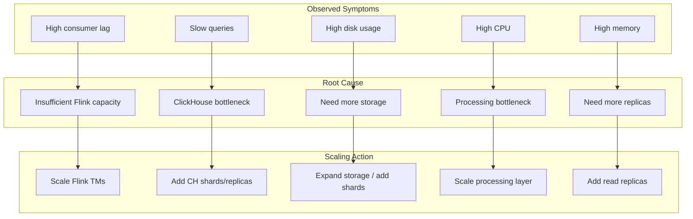

---

## Capacity Planning

### Growth Estimation

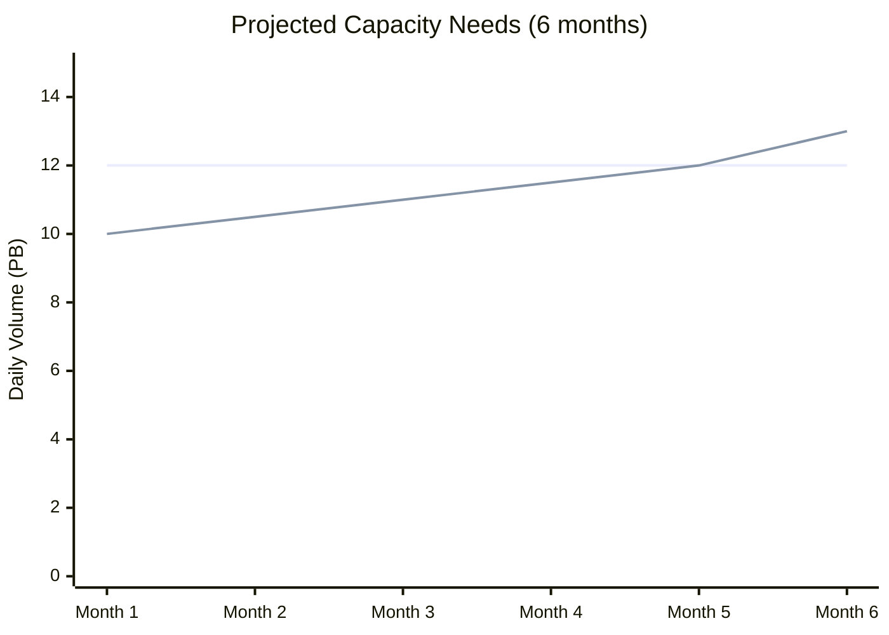

### Scaling Thresholds

| Metric | Warning (75%) | Scale Trigger (85%) | Critical (95%) |
|--------|---------------|---------------------|----------------|
| **Kafka disk** | 300 GB | 340 GB | 380 GB |
| **ClickHouse disk** | 37.5 TB | 42.5 TB | 47.5 TB |
| **Consumer lag** | 3 min | 5 min | 10 min |
| **Query latency p95** | 15 s | 20 s | 30 s |

---

## Scale-Down Procedures

### Flink Scale-Down

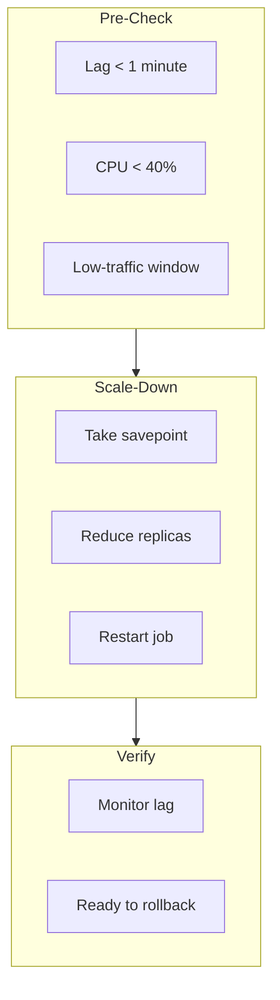

### Kafka Scale-Down

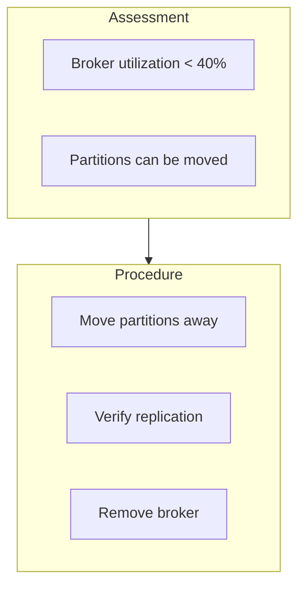

**Warning**: Kafka scale-down is complex and risky. Only perform during maintenance windows.
