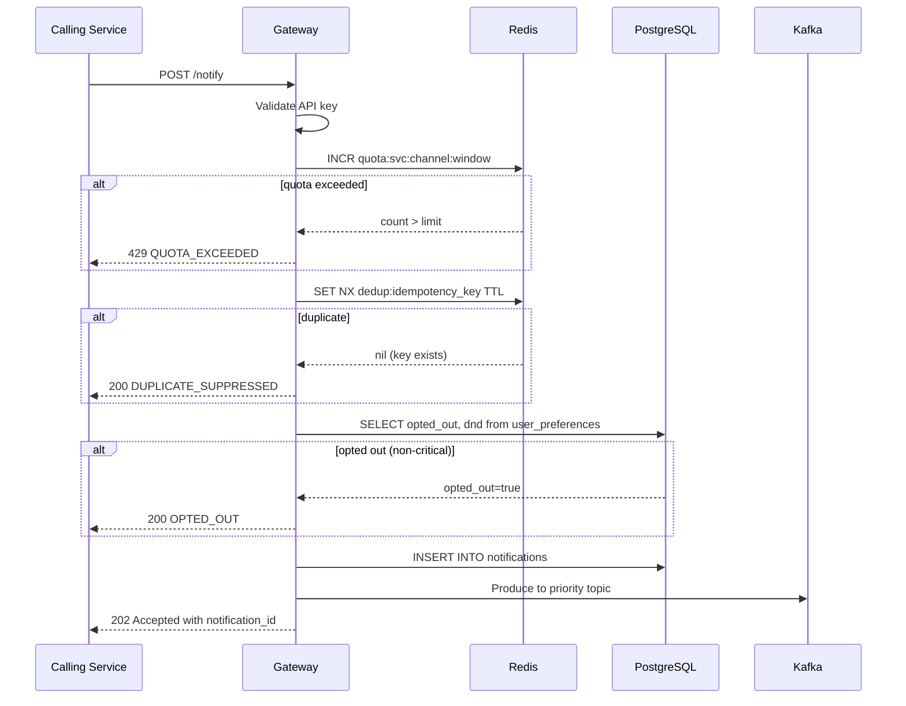
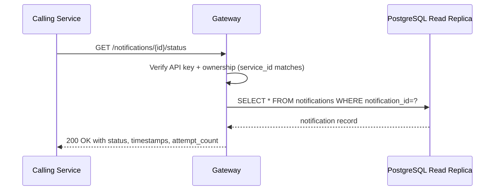
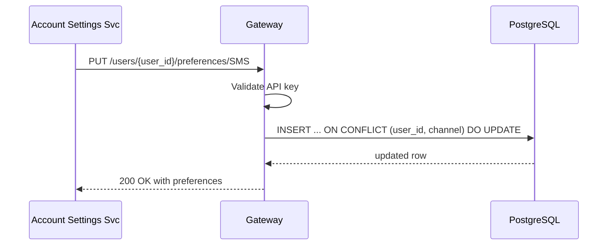
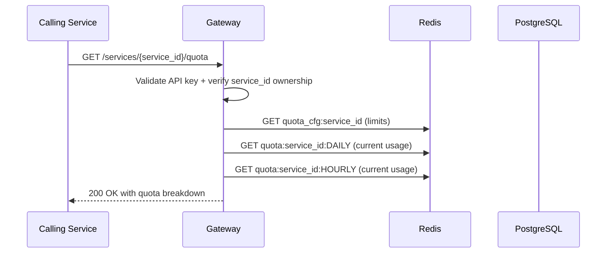

# API Contracts

All endpoints are internal-only, accessible via mTLS from within the e-commerce platform. External callers (user-facing) only interact with preference management.

**Base URL**: `https://notification-service.internal/v1`

**Authentication**: API key in header `X-Service-API-Key` (SHA-256 verified against `services.api_key_hash`).

---

## POST /notify

Send a notification. The gateway validates, deduplicates, checks quota, resolves DND, and enqueues. Returns immediately — delivery is asynchronous.

### Request

```json
{
  "user_id": "usr_abc123",
  "channel": "SMS",
  "priority": "CRITICAL",
  "template_id": "otp_verification_v2",
  "template_vars": {
    "otp_code": "847291",
    "expires_in_minutes": 5
  },
  "idempotency_key": "req_XyZ9k2mNpQ",
  "metadata": {
    "order_id": "ord_789",
    "trace_id": "trace_abc"
  }
}
```

| Field | Type | Required | Description |
|-------|------|----------|-------------|
| `user_id` | string | yes | Target user identifier |
| `channel` | enum | yes | `SMS`, `EMAIL`, `PUSH` |
| `priority` | enum | yes | `CRITICAL`, `TRANSACTIONAL`, `MARKETING` |
| `template_id` | string | yes | Pre-registered template ID |
| `template_vars` | object | no | Variables for template rendering |
| `idempotency_key` | string | no | Caller-supplied dedup key (max 128 chars); auto-generated if omitted |
| `metadata` | object | no | Pass-through context (stored, not used for routing) |

### Responses

**202 Accepted** — Notification queued for delivery:
```json
{
  "notification_id": "notif_a1b2c3d4",
  "status": "QUEUED",
  "idempotency_key": "req_XyZ9k2mNpQ"
}
```

**200 OK** — Duplicate suppressed (idempotency key already seen):
```json
{
  "notification_id": "notif_original",
  "status": "DUPLICATE_SUPPRESSED",
  "idempotency_key": "req_XyZ9k2mNpQ"
}
```

**200 OK** — User opted out (not an error — caller should not retry):
```json
{
  "notification_id": "notif_a1b2c3d4",
  "status": "OPTED_OUT"
}
```

**429 Too Many Requests** — Quota exceeded:
```json
{
  "error": "QUOTA_EXCEEDED",
  "detail": "Hourly SMS quota reached for service auth-service",
  "retry_after_seconds": 1847
}
```

**400 Bad Request** — Invalid payload:
```json
{
  "error": "VALIDATION_ERROR",
  "detail": "channel must be one of: SMS, EMAIL, PUSH"
}
```

**401 Unauthorized** — Invalid or missing API key:
```json
{
  "error": "UNAUTHORIZED"
}
```

### Sequence Diagram



---

## GET /notifications/{notification_id}/status

Poll the delivery status of a previously sent notification.

### Response

**200 OK**:
```json
{
  "notification_id": "notif_a1b2c3d4",
  "status": "DELIVERED",
  "channel": "SMS",
  "priority": "CRITICAL",
  "attempt_count": 1,
  "created_at": "2026-03-23T10:00:00Z",
  "queued_at": "2026-03-23T10:00:00.045Z",
  "delivered_at": "2026-03-23T10:00:01.230Z",
  "provider_message_id": "SM1a2b3c4d5e"
}
```

**Possible status values**: `QUEUED`, `DISPATCHING`, `DELIVERED`, `FAILED`, `OPTED_OUT`, `DUPLICATE_SUPPRESSED`, `DND_SUPPRESSED`, `QUOTA_EXCEEDED`

**404 Not Found** — notification_id does not exist or does not belong to calling service.

### Sequence Diagram



---

## PUT /users/{user_id}/preferences/{channel}

Update a user's opt-out or DND settings for a given channel. Typically called by the user-facing Account Settings service on behalf of the user.

### Request

```json
{
  "opted_out": false,
  "dnd_start": "22:00",
  "dnd_end": "08:00",
  "timezone": "Asia/Kolkata"
}
```

| Field | Type | Required | Description |
|-------|------|----------|-------------|
| `opted_out` | boolean | no | Set to `true` to opt the user out of this channel |
| `dnd_start` | time (HH:MM) | no | Start of do-not-disturb window in local time |
| `dnd_end` | time (HH:MM) | no | End of DND window |
| `timezone` | string | no | IANA timezone for DND calculation |

Note: `dnd_start` and `dnd_end` must both be provided together. DND does not apply to CRITICAL priority notifications.

### Response

**200 OK**:
```json
{
  "user_id": "usr_abc123",
  "channel": "SMS",
  "opted_out": false,
  "dnd_start": "22:00",
  "dnd_end": "08:00",
  "timezone": "Asia/Kolkata",
  "updated_at": "2026-03-23T10:05:00Z"
}
```

### Sequence Diagram



---

## GET /services/{service_id}/quota

Returns current quota usage for a calling service across all channels. Useful for monitoring dashboards and pre-flight checks.

### Response

**200 OK**:
```json
{
  "service_id": "svc-marketing",
  "quota": [
    {
      "channel": "EMAIL",
      "daily_limit": 5000000,
      "hourly_limit": 300000,
      "daily_used": 1823441,
      "hourly_used": 84291,
      "daily_reset_in_seconds": 43200,
      "hourly_reset_in_seconds": 1847
    },
    {
      "channel": "PUSH",
      "daily_limit": 10000000,
      "hourly_limit": 500000,
      "daily_used": 3421000,
      "hourly_used": 201000,
      "daily_reset_in_seconds": 43200,
      "hourly_reset_in_seconds": 1847
    }
  ]
}
```

### Sequence Diagram



---

## Error Codes Summary

| HTTP Status | Error Code | Description |
|------------|------------|-------------|
| 400 | `VALIDATION_ERROR` | Missing or invalid fields |
| 400 | `UNKNOWN_TEMPLATE` | template_id not registered |
| 400 | `UNKNOWN_CHANNEL` | channel not in SMS/EMAIL/PUSH |
| 401 | `UNAUTHORIZED` | Invalid or missing API key |
| 403 | `FORBIDDEN` | API key does not own requested service_id |
| 404 | `NOT_FOUND` | notification_id not found |
| 429 | `QUOTA_EXCEEDED` | Per-service hourly or daily quota hit |
| 500 | `INTERNAL_ERROR` | Gateway internal failure |
| 503 | `SERVICE_UNAVAILABLE` | Kafka or Redis unavailable |

---

## Rate Limiting (Gateway-Level)

Beyond per-service quotas, the gateway also enforces per-IP and global rate limits to protect against misconfigured callers:

| Limit | Value | Window |
|-------|-------|--------|
| Per service (SMS) | Configurable per service | Hourly + Daily |
| Per service (EMAIL) | Configurable per service | Hourly + Daily |
| Per service (PUSH) | Configurable per service | Hourly + Daily |
| Global gateway RPS | 100,000 req/s | Rolling 1s (shed at LB) |
| OTP to same user | 1 per 60s | Per user_id + channel |
| Marketing to same user | 3 per 24h | Per user_id + channel |
