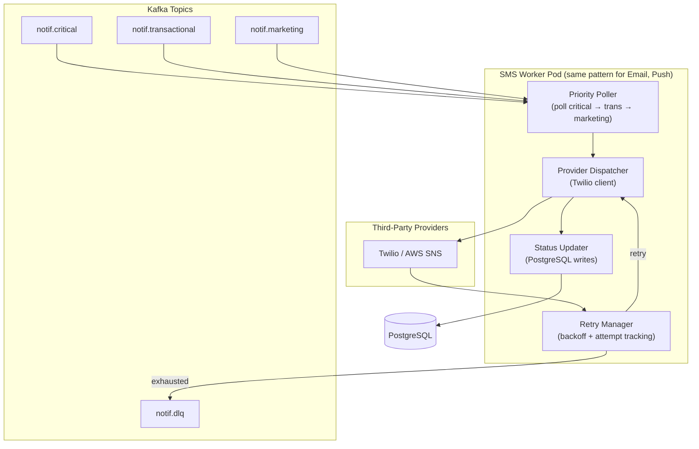
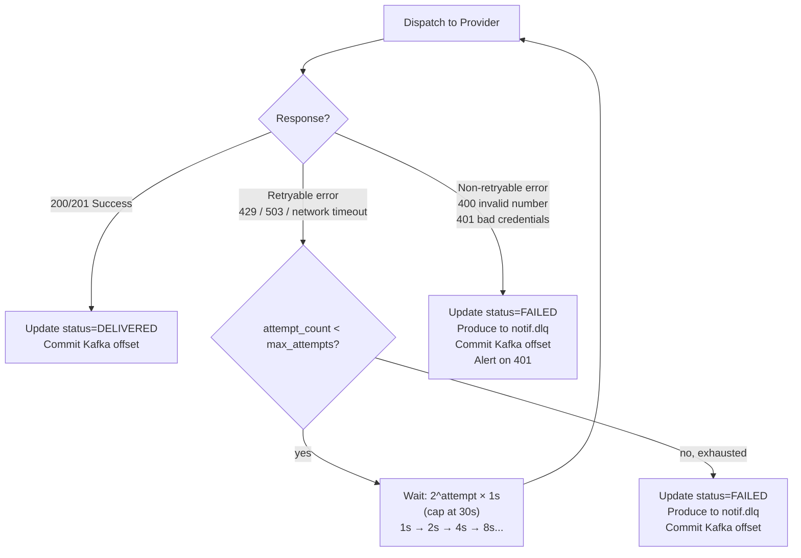
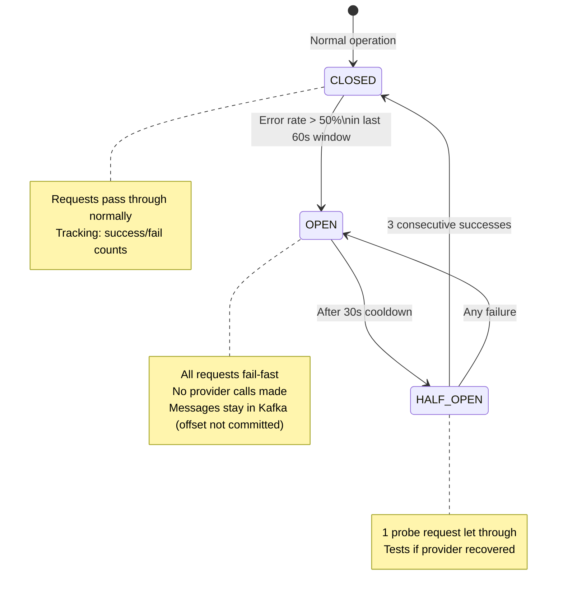
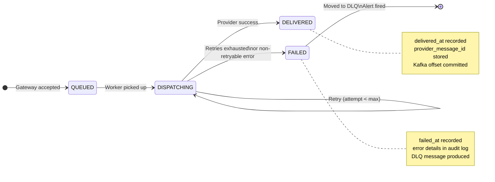
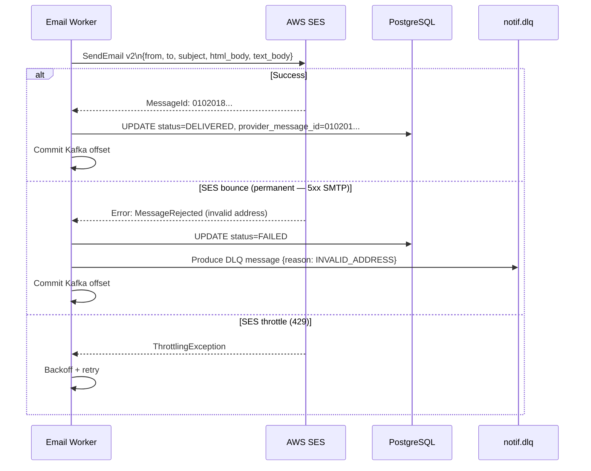
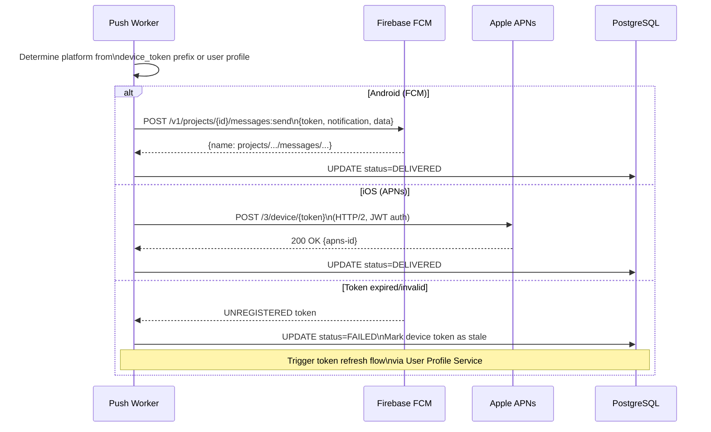
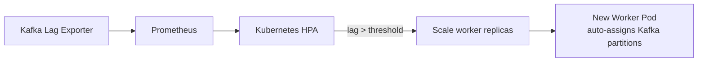

# Channel Workers

## Overview

Each channel (SMS, Email, Push) has an independent horizontally-scalable worker service. Workers consume from all three priority Kafka topics (polling critical first), render and dispatch notifications to third-party providers, handle retries with exponential backoff, update delivery status in PostgreSQL, and route permanently-failed messages to the DLQ.

Workers are **stateless** — all state lives in PostgreSQL and Kafka offsets. A worker pod crash results in re-delivery of unacknowledged messages.

---

## Worker Architecture



---

## Per-Channel Provider Mapping

| Channel | Primary Provider | SDK/API |
|---------|-----------------|---------|
| SMS | Twilio | REST API v2010 |
| Email | AWS SES | SES v2 SendEmail |
| Push (Android) | Firebase FCM | FCM HTTP v1 |
| Push (iOS) | Apple APNs | APNs HTTP/2 |

Each worker implements a `ProviderClient` interface:

```
interface ProviderClient {
  send(notification: Notification): Result<provider_message_id, ProviderError>
}
```

This abstraction allows swapping providers without changing retry/status logic.

---

## Retry Policy



### Retry Configuration

| Priority | Max Attempts | Backoff Base | Max Backoff | Total Max Wait |
|----------|-------------|-------------|-------------|---------------|
| CRITICAL | 3 | 1s | 4s | ~7s |
| TRANSACTIONAL | 3 | 2s | 16s | ~20s |
| MARKETING | 3 | 5s | 30s | ~35s |

CRITICAL retries faster because OTP expiry windows are tight (typically 5 minutes).

### Retryable vs Non-Retryable Errors

| Error | Type | Action |
|-------|------|--------|
| 429 Rate Limited by provider | Retryable | Retry with backoff |
| 503 Provider unavailable | Retryable | Retry with backoff |
| Network timeout | Retryable | Retry with backoff |
| 400 Invalid phone/email | Non-retryable | DLQ immediately |
| 401 Auth failure | Non-retryable | DLQ + alert (credential issue) |
| 404 Unknown recipient | Non-retryable | DLQ |

---

## Circuit Breaker

Each worker maintains a circuit breaker per provider to avoid hammering a failing provider during an outage.



**When circuit is OPEN**: Worker does not commit the Kafka offset — messages accumulate (Kafka retains them). Once circuit closes, workers resume processing from where they left off. This is safe because Kafka retention is 7 days (critical: 24h).

**Circuit state is local per pod** (not shared via Redis). Pods independently detect provider failures. This is intentional — a degraded provider may behave differently across network paths, and local circuit state prevents cascading if only some pods are affected.

---

## Notification Lifecycle State Machine



---

## Email Worker Specifics



**Email-specific handling**:
- SES delivery receipts (bounces, complaints) arrive via SNS webhook → update `notifications.status` asynchronously
- Soft bounces (mailbox full) → retry; hard bounces (invalid address) → DLQ + mark address invalid in user profile

---

## Push Worker Specifics



**Push-specific handling**:
- Device tokens expire — UNREGISTERED errors trigger token invalidation in the user profile system
- FCM supports topic messaging for bulk push (marketing tier), reducing API calls for broadcast notifications

---

## Worker Scaling



Kubernetes HPA scales based on **Kafka consumer lag** (custom metric via KEDA or prometheus-kafka-exporter), not CPU. This ensures scaling is driven by actual delivery backlog rather than compute usage.

| Worker | Min Replicas | Max Replicas | Scale Metric |
|--------|-------------|-------------|-------------|
| SMS Worker | 10 | 200 | notif.critical lag > 1K OR notif.transactional lag > 10K |
| Email Worker | 5 | 100 | notif.transactional lag > 50K OR notif.marketing lag > 200K |
| Push Worker | 10 | 500 | notif.critical lag > 1K OR notif.marketing lag > 500K |
