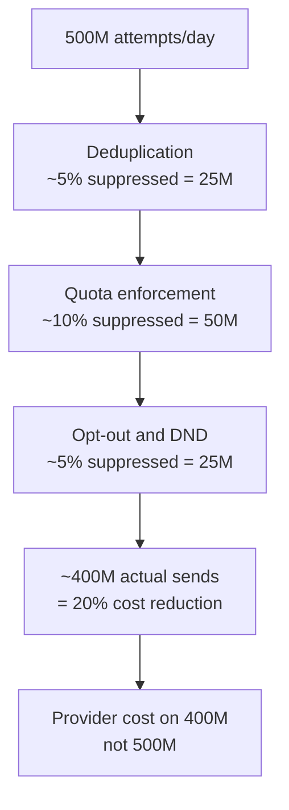

# Cost Model

## Overview

Running a notification service at 500M notifications/day involves two fundamentally different cost buckets:

1. **Provider costs** — fees paid to Twilio, AWS SES, FCM, Meta per message sent. These dwarf infrastructure costs by 10–100×.
2. **Infrastructure costs** — Kafka, Redis, PostgreSQL, compute, S3, networking.

Cost control at this scale is an engineering problem. Every architectural decision — deduplication, quota enforcement, template caching, Kafka message sizing — has a direct dollar impact. This document quantifies both buckets, identifies the biggest levers, and sizes the system honestly.

---

## Assumptions

| Parameter | Value |
|-----------|-------|
| Daily notification volume | 500M / day |
| Peak throughput | 50,000 / second (Black Friday 10×) |
| Channel mix | Push 50% · Email 30% · SMS 15% · WhatsApp 5% |
| Region | Primarily India + SEA (lower SMS costs than US/EU) |
| Suppression rate | ~20% of requests suppressed (dedup + quota + opt-out) |
| Actual sends | ~400M / day after suppression |

---

## Provider Costs

### SMS — Twilio / AWS SNS

SMS is the most expensive channel per message. Cost varies significantly by destination country.

| Region | Cost per SMS | 75M SMS/day | Monthly |
|--------|-------------|-------------|---------|
| India | ~$0.0015 | $112,500/day | ~$3.4M |
| US | ~$0.0079 | $592,500/day | ~$17.8M |
| UK | ~$0.0400 | $3,000,000/day | ~$90M |

**At the assumed 15% SMS share = 75M SMS/day at a blended India-heavy rate of ~$0.002:**
- ~$150,000/day → **~$4.5M/month**

Multi-segment SMS (body > 160 chars) is billed per segment. A 3-segment SMS costs 3× a single-segment SMS. Enforcing a 160-char hard limit on SMS templates saves up to 3× on SMS spend.

---

### Email — AWS SES

SES pricing is flat and low.

| Tier | Rate |
|------|------|
| First 62,000/month (from EC2) | Free |
| All additional | $0.10 per 1,000 messages |

**At 30% share = 150M emails/day:**
- 150M × $0.0001 = $15,000/day → **~$450,000/month**

Attachments and large emails do not change the per-message rate, but S3 staging adds storage costs (see below). SES also charges for data transfer out to recipients: $0.09/GB — negligible at these volumes since email bodies go directly to SMTP recipients, not through your egress.

**Bounce and complaint fees**: None directly, but high bounce rates (> 5%) can result in SES account suspension. Maintaining a suppression list (hard bounces are never retried) is cost-critical.

---

### Push — FCM / APNs

**Free.** Google FCM and Apple APNs charge nothing per push notification. The cost is purely compute and Kafka infrastructure for the Push Worker.

This makes Push the highest-value channel — at 250M push/day (50% of volume), the provider cost is $0.

---

### WhatsApp — Meta Business API

Meta's WhatsApp pricing is per **conversation** (24-hour session), not per message. A conversation is opened by the first message sent and covers all messages within 24 hours to that user.

**Conversation categories and pricing (approximate, India)**:

| Category | Rate (India) | Rate (US) |
|----------|-------------|-----------|
| Marketing | $0.0111 | $0.0250 |
| Utility (transactional) | $0.0014 | $0.0040 |
| Authentication (OTP) | $0.0014 | $0.0035 |
| Service (user-initiated) | $0.0000 | $0.0000 |

**At 5% share = 25M messages/day. Assuming one message per conversation per day:**
- Marketing mix (70%): 17.5M × $0.0111 = $194,250/day
- Utility mix (25%): 6.25M × $0.0014 = $8,750/day
- Authentication (5%): 1.25M × $0.0014 = $1,750/day
- **Total: ~$205,000/day → ~$6.1M/month**

WhatsApp can be more expensive than SMS for marketing messages. The free-tier window: 1,000 conversations/month per phone number are free — irrelevant at this scale.

---

### Provider Cost Summary

| Channel | Volume/day | Cost/day | Cost/month |
|---------|-----------|----------|------------|
| SMS (blended) | 75M | ~$150,000 | ~$4.5M |
| Email (SES) | 150M | ~$15,000 | ~$450K |
| Push (FCM/APNs) | 250M | $0 | $0 |
| WhatsApp (Meta) | 25M | ~$205,000 | ~$6.1M |
| **Total** | **500M** | **~$370,000** | **~$11M** |

**Provider costs are the dominant expenditure — ~$11M/month at 500M/day.** Infrastructure costs are ~1–2% of this.

---

## Infrastructure Costs

All estimates are AWS us-east-1 on-demand rates. Reserved instances reduce these by 30–40%.

### Kafka (Amazon MSK)

| Cluster | Brokers | Instance | Cost/month |
|---------|---------|----------|------------|
| Primary | 3 | m5.4xlarge | ~$2,100 |
| Storage (500M msgs/day × 7d retention) | — | ~5TB | ~$600 |
| Data transfer (inter-AZ) | — | ~50TB/month | ~$500 |
| **Total** | | | **~$3,200/month** |

Kafka cost scales with retention. Reducing marketing topic retention from 7 days to 3 days cuts storage by ~40%.

---

### Redis (ElastiCache)

| Cluster | Nodes | Instance | Cost/month |
|---------|-------|----------|------------|
| 6-node cluster (3 primary + 3 replica) | 6 | r6g.xlarge (13GB RAM) | ~$1,500 |

Redis memory usage at 500M/day:
- Quota keys: ~500 keys per service/channel/window × 200 services = ~100K keys × ~100 bytes = ~10MB (trivial)
- Dedup keys: 400M active keys × ~150 bytes = ~60GB — **this is the dominant Redis cost**

At 400M deduplicated notifications/day with a 24-hour max TTL, Redis needs to hold up to 400M keys simultaneously. Each key (~50-byte hash + ~40-byte value + Redis overhead) ≈ 150 bytes → ~60GB raw.

With 6 × 13GB = 78GB total cluster memory, this fits but is tight. Use 26GB nodes (r6g.2xlarge) or reduce dedup TTL for marketing (24h → 6h) to shrink key count:

| Node | Per-node | 6-node total | Cost/month |
|------|----------|-------------|------------|
| r6g.xlarge (13GB) | $180 | $1,080 | ~$1,100 |
| r6g.2xlarge (26GB) | $360 | $2,160 | ~$2,200 |

**Recommended: r6g.2xlarge → ~$2,200/month**

---

### PostgreSQL (RDS)

| Role | Instance | Storage | Cost/month |
|------|----------|---------|------------|
| Primary | db.r6g.2xlarge | 2TB gp3 | ~$600 |
| Read Replica 1 | db.r6g.xlarge | 2TB gp3 | ~$400 |
| Read Replica 2 | db.r6g.xlarge | 2TB gp3 | ~$400 |
| **Total** | | | **~$1,400/month** |

Storage grows at ~400M rows/day × ~500 bytes/row = ~200GB/day uncompressed. With 90-day hot retention and monthly partitioning, active DB size reaches ~6TB. Archive partitions to S3 as Parquet after 90 days — S3 costs ~$0.023/GB vs RDS at ~$0.115/GB.

---

### Compute (EKS)

| Service | Pods | Instance | Cost/pod/month | Total/month |
|---------|------|----------|---------------|-------------|
| Gateway | 20 (scales to 50) | c6g.xlarge | ~$110 | ~$2,200 |
| SMS Worker | 30 (scales to 200) | c6g.xlarge | ~$110 | ~$3,300 |
| Email Worker | 20 (scales to 100) | c6g.xlarge | ~$110 | ~$2,200 |
| Push Worker | 20 (scales to 200) | c6g.xlarge | ~$110 | ~$2,200 |
| WhatsApp Worker | 10 (scales to 100) | c6g.xlarge | ~$110 | ~$1,100 |
| Template Service | 10 (scales to 50) | c6g.xlarge | ~$110 | ~$1,100 |
| EKS control plane | 3 clusters | — | $73/cluster | ~$220 |
| **Steady-state total** | | | | **~$12,300/month** |

Peak Black Friday (10×): worker pods scale to maximums → compute triples to ~$35,000/month for that period (~2 weeks/year = +$15,000 annually, negligible at $11M/month provider cost).

---

### S3

| Use | Volume | Rate | Cost/month |
|-----|--------|------|------------|
| Email payloads (> 256KB emails, 7-day lifecycle) | ~5TB | $0.023/GB | ~$115 |
| PostgreSQL WAL archive | ~1TB/month | $0.023/GB | ~$23 |
| Notification archive (Parquet, post-90d) | ~200GB/month added | $0.023/GB | ~$5 |
| **Total** | | | **~$150/month** |

---

### Networking

| Item | Estimate/month |
|------|---------------|
| Inter-AZ data transfer (Kafka replication, Redis replication) | ~$500 |
| NAT gateway (outbound to providers) | ~$300 |
| CloudFront (template asset CDN) | ~$200 |
| **Total** | **~$1,000/month** |

---

### Monitoring Stack

| Tool | Cost/month |
|------|------------|
| Prometheus (self-hosted on EKS) | ~$0 (compute included above) |
| Grafana Cloud (managed) | ~$300 |
| Jaeger / Tempo (managed or self-hosted) | ~$200 |
| PagerDuty (Professional, 20 users) | ~$800 |
| **Total** | **~$1,300/month** |

---

### Infrastructure Cost Summary

| Component | Cost/month |
|-----------|------------|
| Kafka (MSK) | ~$3,200 |
| Redis (ElastiCache) | ~$2,200 |
| PostgreSQL (RDS) | ~$1,400 |
| Compute (EKS) | ~$12,300 |
| S3 | ~$150 |
| Networking | ~$1,000 |
| Monitoring | ~$1,300 |
| **Total infrastructure** | **~$21,550/month** |

---

## Total Cost of Ownership

| Category | Monthly | Annual |
|----------|---------|--------|
| Provider costs (SMS + Email + WhatsApp) | ~$11,000,000 | ~$132M |
| Infrastructure | ~$21,550 | ~$260K |
| **Total** | **~$11,021,550** | **~$132.3M** |

**Infrastructure is 0.2% of total cost. Provider fees are 99.8%.**

---

## Cost Per Notification (Unit Economics)

| Channel | Cost/notification | At 500M/day |
|---------|------------------|-------------|
| SMS | ~$0.002 | $300K/day |
| Email | ~$0.0001 | $15K/day |
| Push | ~$0.000 | $0/day |
| WhatsApp (marketing) | ~$0.0111/conv | $195K/day |
| Infrastructure (blended) | ~$0.000043 | $21.5K/day |

---

## Cost Control Levers

The three cost control gates in the gateway (quota, dedup, opt-out) are not just features — they are the primary cost management mechanism.



| Lever | Estimated Impact | Mechanism |
|-------|-----------------|-----------|
| Deduplication (5% suppression) | Saves ~$550K/month | Blocks duplicate sends before provider call |
| Quota enforcement (10% suppression) | Saves ~$1.1M/month | Prevents runaway services from over-sending |
| Opt-out / DND (5% suppression) | Saves ~$550K/month | Skips provider call for non-consenting users |
| Push over SMS where possible | Saves ~$0.002/notification | Push is free; SMS is expensive |
| SMS length control (< 160 chars) | Saves up to 3× on SMS | Prevents multi-segment billing |
| WhatsApp utility vs marketing category | ~8× cost difference | Route OTPs/transactional as utility, not marketing |
| Email over SMS for non-urgent | ~20× cheaper | $0.0001 vs $0.002 per send |
| Hard bounce suppression list | Prevents wasted SES sends | Never retry invalid email addresses |

### Channel Substitution Impact

Shifting 10M SMS/day to Push (where push token is available):
- SMS cost avoided: 10M × $0.002 = **$20,000/day saved**
- Push cost added: $0

Shifting 5M marketing SMS to WhatsApp (where WhatsApp opted in):
- SMS avoided: 5M × $0.002 = $10,000/day
- WhatsApp marketing added: 5M × $0.0111 = $55,500/day
- **Net: WhatsApp marketing is MORE expensive than SMS for India** — only substitute with utility-category WhatsApp

---

## Cost Attribution and Chargeback

The `notifications` table records `service_id` and `channel` on every row including suppressed notifications. This enables finance to produce a monthly chargeback report per calling service:

```sql
SELECT
    service_id,
    channel,
    COUNT(*) FILTER (WHERE status = 'DELIVERED') AS sent,
    COUNT(*) FILTER (WHERE status IN ('QUOTA_EXCEEDED', 'DUPLICATE_SUPPRESSED', 'OPTED_OUT', 'DND_SUPPRESSED')) AS suppressed,
    COUNT(*) FILTER (WHERE status = 'FAILED') AS failed
FROM notifications
WHERE created_at >= date_trunc('month', NOW())
GROUP BY service_id, channel
ORDER BY sent DESC;
```

Multiply `sent` by the per-channel unit cost to produce a provider cost attribution per service. This data feeds the Grafana Cost Control dashboard and monthly finance reporting.

---

## Cost Scaling Behaviour

| Volume | Provider Cost/month | Infrastructure/month | Notes |
|--------|--------------------|--------------------|-------|
| 50M/day | ~$1.1M | ~$8,000 | Infrastructure stays nearly flat |
| 500M/day | ~$11M | ~$21,500 | Infrastructure grows slowly |
| 5B/day | ~$110M | ~$80,000 | Infrastructure still < 0.1% |

Infrastructure is largely fixed-cost regardless of volume (Kafka, Redis, PostgreSQL are sized for peak, not average). The cost model is dominated entirely by provider pricing. Negotiating volume discounts with Twilio and Meta is more impactful than any infrastructure optimisation.

### Volume Discount Targets

| Provider | Typical volume discount threshold | Potential saving |
|----------|----------------------------------|-----------------|
| Twilio (SMS) | > 1M msgs/month | 10–30% off list rate |
| AWS SES | Included in Enterprise Support | Minimal |
| Meta WhatsApp | Negotiated at Business Solution Provider level | 10–20% |

At $11M/month provider spend, a 15% blended discount = **$1.65M/month saved** — far exceeding any infrastructure optimisation.
