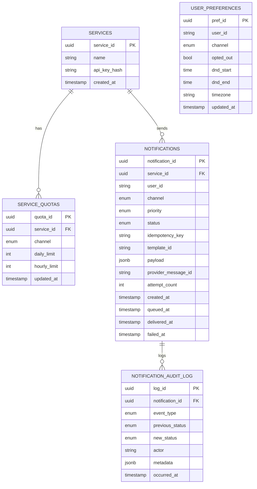
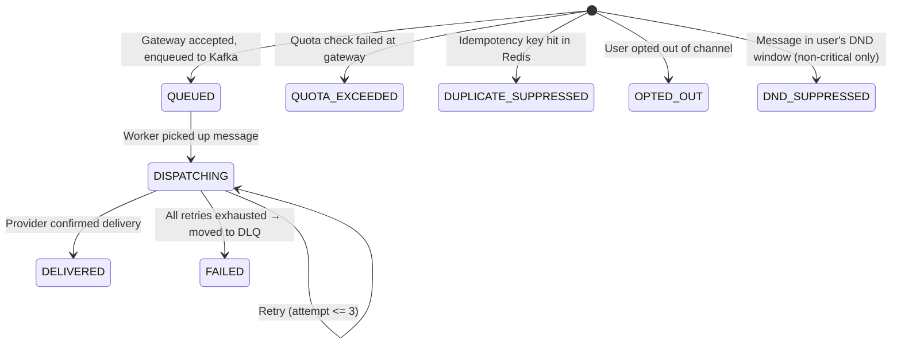

# Data Models

## Entity Relationship Diagram



---

## Table Definitions

### `services`

Registry of all internal services authorized to send notifications.

```sql
CREATE TABLE services (
    service_id      UUID PRIMARY KEY DEFAULT gen_random_uuid(),
    name            VARCHAR(100) NOT NULL UNIQUE,
    api_key_hash    VARCHAR(64) NOT NULL,  -- SHA-256 of API key
    created_at      TIMESTAMP NOT NULL DEFAULT NOW()
);
```

---

### `service_quotas`

Per-service, per-channel quota configuration. Enforced at gateway using Redis counters; this table is the source of truth for limits.

```sql
CREATE TYPE channel_type AS ENUM ('SMS', 'EMAIL', 'PUSH');

CREATE TABLE service_quotas (
    quota_id        UUID PRIMARY KEY DEFAULT gen_random_uuid(),
    service_id      UUID NOT NULL REFERENCES services(service_id),
    channel         channel_type NOT NULL,
    daily_limit     INTEGER NOT NULL DEFAULT 10000,
    hourly_limit    INTEGER NOT NULL DEFAULT 1000,
    updated_at      TIMESTAMP NOT NULL DEFAULT NOW(),
    UNIQUE(service_id, channel)
);

CREATE INDEX idx_quotas_service ON service_quotas(service_id);
```

---

### `notifications`

Central record for every notification accepted by the gateway. Status transitions are tracked here.

```sql
CREATE TYPE priority_type AS ENUM ('CRITICAL', 'TRANSACTIONAL', 'MARKETING');

CREATE TYPE notif_status AS ENUM (
    'QUEUED',
    'DISPATCHING',
    'DELIVERED',
    'FAILED',
    'OPTED_OUT',
    'DUPLICATE_SUPPRESSED',
    'DND_SUPPRESSED',
    'QUOTA_EXCEEDED'
);

CREATE TABLE notifications (
    notification_id     UUID PRIMARY KEY DEFAULT gen_random_uuid(),
    service_id          UUID NOT NULL REFERENCES services(service_id),
    user_id             VARCHAR(128) NOT NULL,
    channel             channel_type NOT NULL,
    priority            priority_type NOT NULL,
    status              notif_status NOT NULL DEFAULT 'QUEUED',
    idempotency_key     VARCHAR(64) NOT NULL,   -- SHA-256 hash
    template_id         VARCHAR(128),
    payload             JSONB NOT NULL,          -- rendered content + metadata
    provider_message_id VARCHAR(256),
    attempt_count       SMALLINT NOT NULL DEFAULT 0,
    created_at          TIMESTAMP NOT NULL DEFAULT NOW(),
    queued_at           TIMESTAMP,
    delivered_at        TIMESTAMP,
    failed_at           TIMESTAMP,
    UNIQUE(idempotency_key)
);

CREATE INDEX idx_notif_service_id     ON notifications(service_id);
CREATE INDEX idx_notif_user_id        ON notifications(user_id);
CREATE INDEX idx_notif_status         ON notifications(status) WHERE status IN ('QUEUED', 'DISPATCHING');
CREATE INDEX idx_notif_created        ON notifications(created_at DESC);
CREATE INDEX idx_notif_idempotency    ON notifications(idempotency_key);
```

**Idempotency Key Derivation**:
```
idempotency_key = SHA256(service_id + user_id + template_id + dedup_window_bucket)
```
Where `dedup_window_bucket = floor(unix_timestamp / window_seconds)` (default window: 300s for OTP, 3600s for marketing).

---

### `user_preferences`

DND and opt-out settings per user per channel. Queried by gateway before enqueue.

```sql
CREATE TABLE user_preferences (
    pref_id     UUID PRIMARY KEY DEFAULT gen_random_uuid(),
    user_id     VARCHAR(128) NOT NULL,
    channel     channel_type NOT NULL,
    opted_out   BOOLEAN NOT NULL DEFAULT FALSE,
    dnd_start   TIME,           -- e.g. 22:00 local time
    dnd_end     TIME,           -- e.g. 08:00 local time
    timezone    VARCHAR(64) NOT NULL DEFAULT 'UTC',
    updated_at  TIMESTAMP NOT NULL DEFAULT NOW(),
    UNIQUE(user_id, channel)
);

CREATE INDEX idx_prefs_user_id ON user_preferences(user_id);
```

**DND Logic**: `dnd_start` and `dnd_end` are local-time values. Gateway resolves current time in user's timezone to check if message falls within DND window. DND does NOT apply to CRITICAL priority (OTP always goes through).

---

### `notification_audit_log`

Append-only event log for every status transition. Used for debugging, compliance, and cost reconciliation.

```sql
CREATE TYPE audit_event_type AS ENUM (
    'ACCEPTED',
    'QUOTA_REJECTED',
    'DEDUP_SUPPRESSED',
    'DND_SUPPRESSED',
    'OPTED_OUT_SUPPRESSED',
    'QUEUED',
    'DISPATCH_ATTEMPT',
    'DELIVERED',
    'PROVIDER_ERROR',
    'RETRY_SCHEDULED',
    'MOVED_TO_DLQ'
);

CREATE TABLE notification_audit_log (
    log_id              UUID PRIMARY KEY DEFAULT gen_random_uuid(),
    notification_id     UUID REFERENCES notifications(notification_id),
    event_type          audit_event_type NOT NULL,
    previous_status     notif_status,
    new_status          notif_status,
    actor               VARCHAR(128),   -- e.g. 'gateway', 'sms-worker-pod-3'
    metadata            JSONB,          -- error details, provider response, etc.
    occurred_at         TIMESTAMP NOT NULL DEFAULT NOW()
);

CREATE INDEX idx_audit_notif_id   ON notification_audit_log(notification_id);
CREATE INDEX idx_audit_occurred   ON notification_audit_log(occurred_at DESC);

-- No UPDATE or DELETE allowed — enforced via role permissions
REVOKE UPDATE, DELETE ON notification_audit_log FROM notification_service_role;
```

---

## Redis Key Schemas

### Quota Counters (Fixed Window)

```
quota:{service_id}:{channel}:{window_type}:{bucket}
  window_type: HOURLY | DAILY
  bucket (HOURLY): floor(unix_timestamp / 3600)
  bucket (DAILY):  floor(unix_timestamp / 86400)

Type: STRING (integer counter)
TTL:  HOURLY=7200s (2x window), DAILY=172800s (2x window)
Op:   INCR → compare against limit from service_quotas table (cached)
```

Example:
```
quota:svc-auth:SMS:HOURLY:492836  = 342
quota:svc-marketing:EMAIL:DAILY:5694 = 8821
```

### Deduplication Keys

```
dedup:{idempotency_key}
  Value: notification_id (for returning to caller on duplicate)
  TTL:   300s for CRITICAL, 3600s for TRANSACTIONAL, 86400s for MARKETING
```

### Quota Config Cache (to avoid DB hit per request)

```
quota_cfg:{service_id}:{channel}
  Type: HASH  {daily_limit, hourly_limit}
  TTL:  300s (refreshed on config change via cache invalidation)
```

---

## Notification Status Lifecycle



---

## Data Retention Policy

| Table | Retention | Rationale |
|-------|-----------|-----------|
| `notifications` | 90 days hot, archive after | Debugging window + provider cost reconciliation |
| `notification_audit_log` | Indefinite | Compliance, cost disputes |
| `user_preferences` | Until user deletion | Active preference management |
| `service_quotas` | Indefinite | Config history |
| Redis quota keys | Auto-expire (2× window) | Self-cleaning via TTL |
| Redis dedup keys | Auto-expire per tier | Self-cleaning via TTL |
| Kafka topics | 7 days | Replay window for worker crashes |
