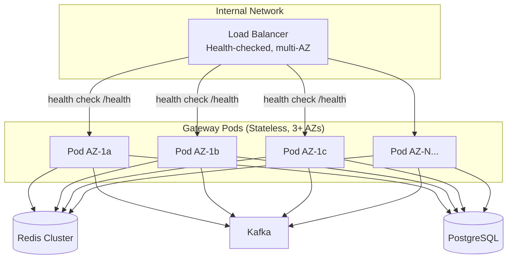
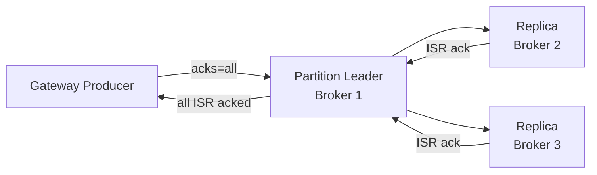
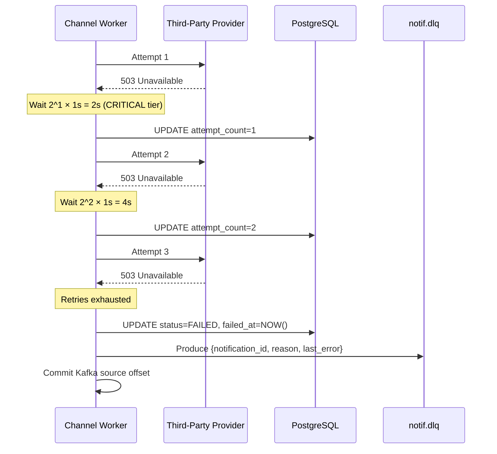
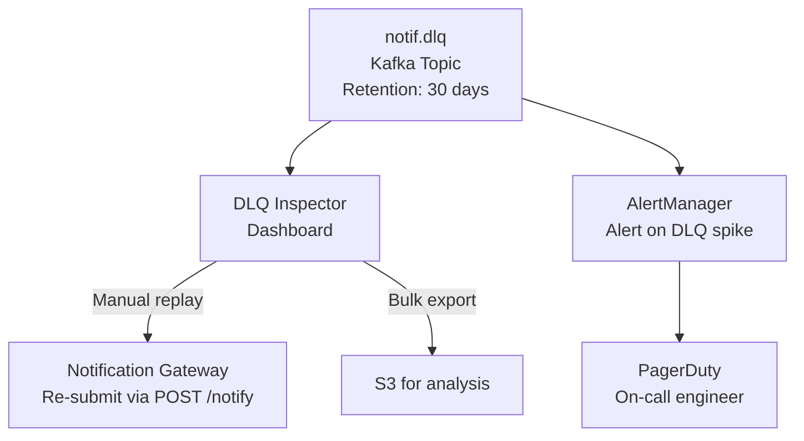
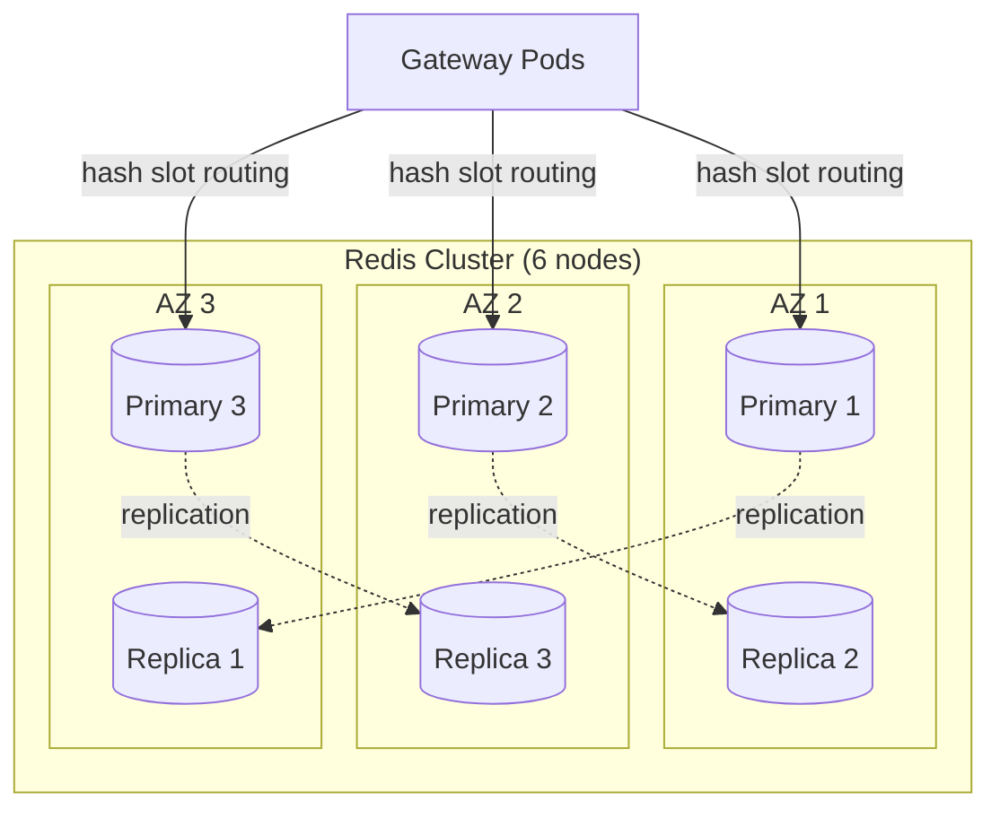

# Fault Tolerance

## Overview

The notification service is designed for 99.99% gateway availability and 99.9% end-to-end delivery success rate. Fault tolerance is achieved through stateless gateway pods, durable Kafka queuing, circuit breakers in workers, a Dead Letter Queue for permanently failed messages, and highly-available data stores.

---

## Gateway Availability



- **Stateless**: Gateway pods hold no in-memory state. Any pod can handle any request.
- **Multi-AZ**: Pods deployed across ≥3 availability zones. One AZ failure has no impact.
- **Health check**: `/health` returns 200 only if Redis, Kafka, and PostgreSQL are reachable. Unhealthy pods are removed from LB rotation within 10s.
- **Rolling deploys**: Gateway is deployed with `maxUnavailable=0, maxSurge=25%` — zero downtime deploys.

### Availability Target Breakdown

| Component | Target | Strategy |
|-----------|--------|----------|
| Gateway (API) | 99.99% (52m downtime/year) | Stateless pods, multi-AZ, rolling deploys |
| Kafka | 99.99% | RF=3, min ISR=2, multi-AZ brokers |
| Redis | 99.99% | Redis Cluster (6 nodes, 3 AZs) |
| PostgreSQL | 99.95% | Primary + 2 read replicas, automatic failover |
| Channel Workers | 99.9% | At-least-once via Kafka, circuit breakers |

---

## Kafka Durability



### Kafka Configuration

| Parameter | Value | Reason |
|-----------|-------|--------|
| `replication.factor` | 3 | Tolerate 1 broker failure |
| `min.insync.replicas` | 2 | Write fails if <2 replicas alive (no silent data loss) |
| Producer `acks` | `all` | Wait for all ISR to acknowledge |
| Producer `retries` | `2147483647` | Retry indefinitely on transient errors |
| Producer `enable.idempotence` | `true` | Exactly-once producer (dedup at Kafka level) |
| `unclean.leader.election.enable` | `false` | No out-of-sync replica becomes leader |

**Broker failure scenario**: With RF=3 and min ISR=2, one broker can fail completely. Kafka elects a new leader from in-sync replicas. No data loss, brief producer retry during election (~2-3s).

---

## Retry Sequence (Worker Level)



---

## Dead Letter Queue (DLQ)



### DLQ Message Schema

```json
{
  "notification_id": "notif_a1b2c3d4",
  "original_topic": "notif.critical",
  "channel": "SMS",
  "priority": "CRITICAL",
  "service_id": "svc-auth",
  "user_id": "usr_abc123",
  "attempt_count": 3,
  "failure_reason": "PROVIDER_UNAVAILABLE",
  "last_provider_error": "503 Service Unavailable from Twilio",
  "original_enqueued_at": "2026-03-23T10:00:00Z",
  "failed_at": "2026-03-23T10:00:22Z"
}
```

### DLQ Alerting Thresholds

| Channel | Alert Threshold | Severity |
|---------|----------------|----------|
| SMS (CRITICAL) | >10 DLQ messages in 5min | P1 — page on-call immediately |
| SMS (TRANSACTIONAL) | >100 DLQ messages in 15min | P2 |
| Email | >500 DLQ messages in 30min | P2 |
| Push | >1000 DLQ messages in 30min | P3 |

CRITICAL DLQ growth is a P1 incident — OTP delivery failure directly impacts authentication.

---

## Redis High Availability



- **Redis Cluster** with 3 primary shards + 3 replicas across AZs
- **Automatic failover**: If primary fails, replica promotes in ~1-5s
- **Impact of Redis failure**: Gateway can fall back to **allow-by-default** for quota (configurable) to avoid blocking all traffic. Dedup becomes best-effort during Redis downtime (logged for later reconciliation).

---

## PostgreSQL High Availability

```mermaid
flowchart TB
    Primary[(Primary\nAZ-1a)] -->|streaming replication| R1[(Read Replica 1\nAZ-1b)]
    Primary -->|streaming replication| R2[(Read Replica 2\nAZ-1c)]
    Primary -->|WAL archiving| S3[(S3 WAL Archive)]

    GW[Gateway Pods] -->|writes| Primary
    GW -->|reads\n(user_preferences)| R1
    GW -->|reads\n(user_preferences)| R2
    Workers[Channel Workers] -->|status updates| Primary
```

- **Streaming replication** to 2 read replicas (synchronous for R1, asynchronous for R2)
- **Automatic failover** via Patroni or AWS RDS Multi-AZ (RPO ~0s with sync replica, RTO ~30s)
- **WAL archiving** to S3 for point-in-time recovery
- **Gateway reads** (`user_preferences`, quota config) go to read replicas — primary handles only writes

---

## End-to-End Failure Scenarios

| Failure | Detection | Impact | Recovery |
|---------|-----------|--------|----------|
| Gateway pod crashes mid-request | LB health check, 10s | Request may 5xx | Caller retries; no data loss (no Kafka write yet) |
| Gateway pod crashes after Kafka produce | N/A | None — message in Kafka | Worker delivers normally |
| Kafka broker failure | Kafka metrics alert | Brief write retry (~3s) | Auto leader election, no data loss |
| Worker pod crash during dispatch | Kafka offset not committed | Message redelivered | Worker retries on restart — at-least-once |
| Provider outage (Twilio) | Circuit breaker (50% error rate) | Messages queue in Kafka | Circuit opens, messages buffered, DLQ after retries |
| Redis failure | Gateway health check | Quota/dedup degraded | Allow-by-default mode, alert fired |
| PostgreSQL primary failure | Health check, Patroni | Writes fail ~30s | Failover to sync replica, resume |

---

## Durability Guarantees

| Data | Guarantee | How |
|------|-----------|-----|
| Notification records | Durable once gateway returns 202 | PostgreSQL + Kafka both written before returning |
| Delivery status | Eventually consistent | Worker updates PG after provider confirms |
| Quota counters | Best-effort (Redis) | TTL-based, rebuilt on Redis restart |
| Dedup keys | Best-effort (Redis) | TTL-based; brief window after Redis restart may allow duplicates |
| Audit log | Permanent | Append-only PostgreSQL table, no DELETE permission |
| DLQ messages | 30-day Kafka retention | Time to investigate and replay |
