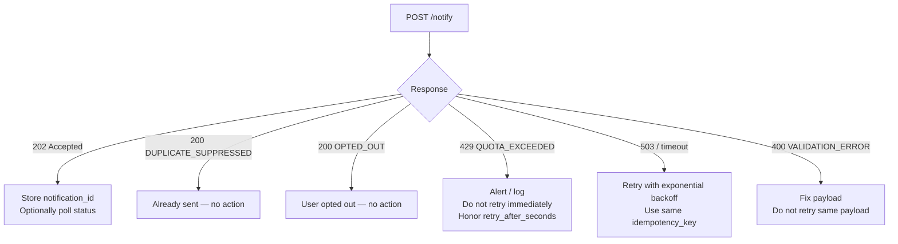
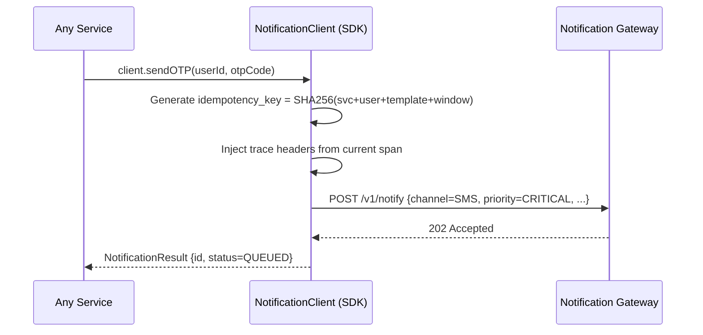
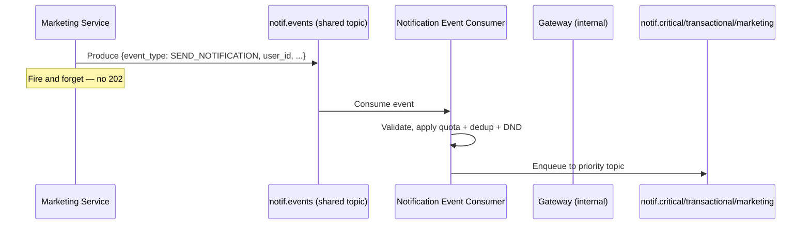
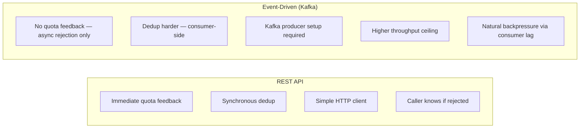
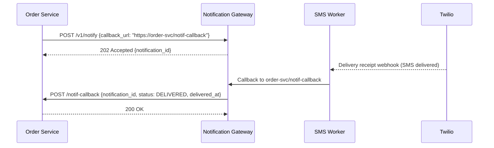

# Integration Patterns

## Overview

This document evaluates three ways other internal services at an e-commerce platform can integrate with the Notification Service, with trade-off analysis and guidance on when to use each.

The **primary pattern is REST API** (chosen for this system). The others are documented for completeness and for future use cases where REST is insufficient.

---

## Pattern Comparison

| Dimension | REST API | SDK / Client Library | Event-Driven (Kafka) |
|-----------|----------|---------------------|----------------------|
| **Coupling** | Loose (HTTP contract) | Loose (versioned SDK) | Very loose (topic schema) |
| **Caller simplicity** | Medium (HTTP client) | High (1-line call) | Low (Kafka producer setup) |
| **Latency to 202** | ~10-30ms | ~10-30ms + SDK overhead | ~1-5ms (fire-and-forget) |
| **Observability** | Per-request trace ID | Per-request trace ID | Event log, offset tracking |
| **Quota enforcement** | At gateway (per request) | At gateway (per request) | Harder (distributed consumers) |
| **Dedup enforcement** | At gateway (idempotency key) | SDK generates key automatically | Consumer-side, complex |
| **Priority routing** | Explicit in request | Explicit in SDK call | Separate topic per priority |
| **Failure visibility** | 429 / 5xx returned to caller | SDK exception | Consumer lag, DLQ |
| **Versioning** | URL versioning (/v1, /v2) | SDK major version | Schema registry |
| **Best for** | All teams, direct control | Teams with frequent sends | Very high throughput, decoupled |

---

## Pattern A: REST API (Primary — Chosen)

```mermaid
sequenceDiagram
    participant S as Order Service
    participant GW as Notification Gateway
    participant Kafka as Kafka
    participant Worker as SMS Worker
    participant Provider as Twilio

    S->>GW: POST /v1/notify\n{user_id, channel, priority, template_id, ...}
    GW->>GW: Auth, quota, dedup, DND
    GW->>Kafka: Produce to priority topic
    GW-->>S: 202 Accepted {notification_id}

    Note over S: Caller is free; delivery is async

    Kafka->>Worker: Consume
    Worker->>Provider: Send SMS
    Provider-->>Worker: OK

    Note over S: Optionally poll status
    S->>GW: GET /v1/notifications/{id}/status
    GW-->>S: {status: DELIVERED, delivered_at: ...}
```

### When to Use

- Default pattern for all internal services
- When the caller needs immediate confirmation that the request was accepted (or rejected with reason)
- When quota enforcement feedback is needed synchronously (e.g., caller wants to show "SMS limit reached" in UI)

### Integration Example

```python
# Order Service sending a delivery notification
response = requests.post(
    "https://notification-service.internal/v1/notify",
    headers={"X-Service-API-Key": NOTIF_API_KEY},
    json={
        "user_id": order.customer_id,
        "channel": "PUSH",
        "priority": "TRANSACTIONAL",
        "template_id": "order_shipped_v3",
        "template_vars": {
            "order_id": order.id,
            "tracking_url": order.tracking_url,
            "estimated_delivery": order.eta
        },
        "idempotency_key": f"order-shipped-{order.id}"
    },
    timeout=2.0
)

if response.status_code == 202:
    notification_id = response.json()["notification_id"]
elif response.status_code == 429:
    log.warn("Notification quota exceeded", reason=response.json())
```

### Failure Handling for Callers



---

## Pattern B: SDK / Client Library

An internal shared library (one per language — Java, Python, Go) that wraps the REST API with sensible defaults: automatic idempotency key generation, retry-with-backoff, tracing header propagation, and circuit breaking.



### SDK Responsibilities

```mermaid
flowchart LR
    Call[client.send\(\)] --> IdempotencyKey[Auto-generate\nidempotency_key]
    IdempotencyKey --> Tracing[Inject trace_id\nfrom current span]
    Tracing --> Timeout[Enforce 2s timeout]
    Timeout --> HTTP[POST /v1/notify]
    HTTP --> Retry{5xx or timeout?}
    Retry -->|yes, retryable| Backoff[Exponential backoff\nSame idempotency_key]
    Backoff --> HTTP
    Retry -->|no| Return[Return result\nto caller]
```

### When to Use

- Teams that send notifications frequently and want to reduce boilerplate
- When consistent timeout, retry, and tracing behavior is needed across all callers
- SDK is thin — it does NOT bypass quota or dedup; those are still enforced at the gateway

### SDK Interface (Python example)

```python
from notification_sdk import NotificationClient, Channel, Priority

client = NotificationClient(
    api_key=settings.NOTIFICATION_API_KEY,
    service_id="order-service"
)

# High-level helpers
result = client.send_otp(user_id="usr_abc", otp_code="847291", expires_in=300)

# Generic send
result = client.send(
    user_id="usr_abc",
    channel=Channel.EMAIL,
    priority=Priority.TRANSACTIONAL,
    template_id="order_confirmed_v2",
    template_vars={"order_id": "ord_789"}
)
```

---

## Pattern C: Event-Driven (Kafka Producer)

Calling services publish notification events to a shared Kafka topic. The Notification Service acts as a consumer of these events, processes them, and routes them through its normal pipeline.



### When to Use

- Extremely high-throughput use cases where the REST API would become a bottleneck (e.g., batch marketing sends of 100M+ notifications)
- When the caller is already producing Kafka events and adding a REST call would introduce latency
- When fire-and-forget semantics are acceptable (no synchronous quota feedback)

### Trade-offs vs REST



**Why REST was chosen over Event-Driven for this system**:
1. Quota enforcement requires synchronous feedback — callers need to know if their quota is exceeded before moving on
2. Dedup is cleaner at the REST gateway than in distributed consumers
3. REST is simpler to onboard for 10s of internal services
4. At 500M/day, REST at the gateway is not a bottleneck — the gateway is stateless and horizontally scalable

Event-driven may be added in a future phase for the marketing tier where bulk-send performance matters more than quota feedback.

---

## Pattern D: Webhook / Delivery Callback (Provider → Service)

Inbound pattern: the Notification Service calls back the originating service when delivery is confirmed or fails.



### When to Use

- When the calling service needs to react to delivery confirmation (e.g., mark "OTP sent" in DB only after confirmed delivery)
- Polled status (`GET /notifications/{id}/status`) is simpler and preferred; webhooks add operational complexity for the receiver

### Webhook Payload

```json
{
  "notification_id": "notif_a1b2c3d4",
  "status": "DELIVERED",
  "channel": "SMS",
  "delivered_at": "2026-03-23T10:00:01.230Z",
  "provider_message_id": "SM1a2b3c4d5e"
}
```

---

## Recommended Integration Decision Tree

```mermaid
flowchart TD
    Q1{Do you need synchronous\nquota/dedup feedback?}
    Q1 -->|yes| REST[Use REST API\nPOST /v1/notify]
    Q1 -->|no| Q2{Sending >1M/hour\nfrom this service?}
    Q2 -->|no| REST
    Q2 -->|yes| Q3{Already using Kafka\nin this service?}
    Q3 -->|yes| EventDriven[Consider Event-Driven\n(discuss with Notif team)]
    Q3 -->|no| SDK[Use SDK\n(wraps REST, simpler API)]

    REST --> Q4{Frequent sender\nwant less boilerplate?}
    Q4 -->|yes| SDK2[Use SDK on top of REST]
    Q4 -->|no| Done[Use raw REST]
```

**Summary**: Start with REST. Adopt SDK if your team sends notifications frequently and wants auto-retry/tracing. Propose event-driven only for bulk marketing sends at extreme volume.
