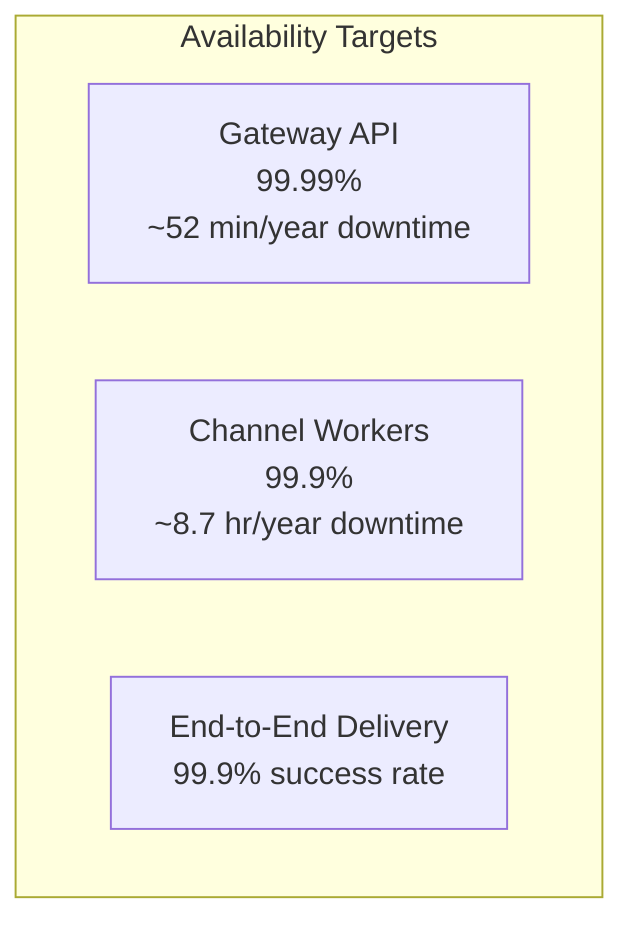
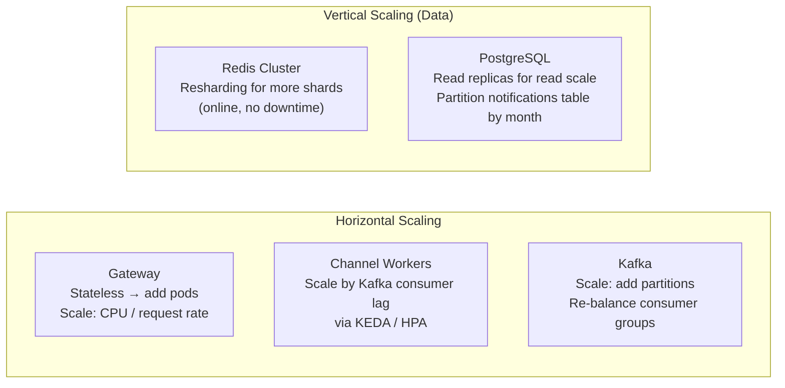
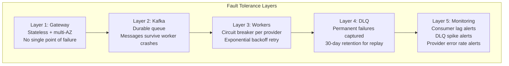
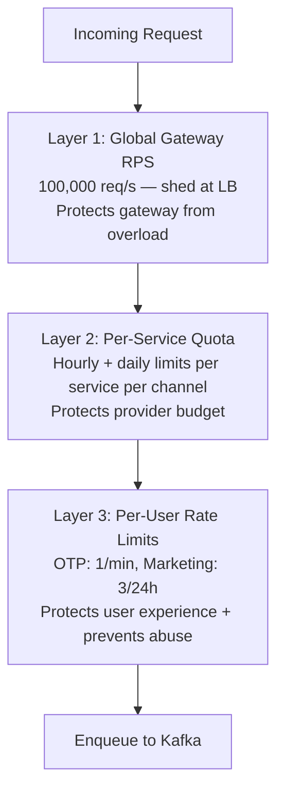
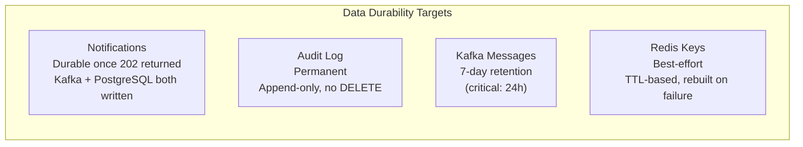
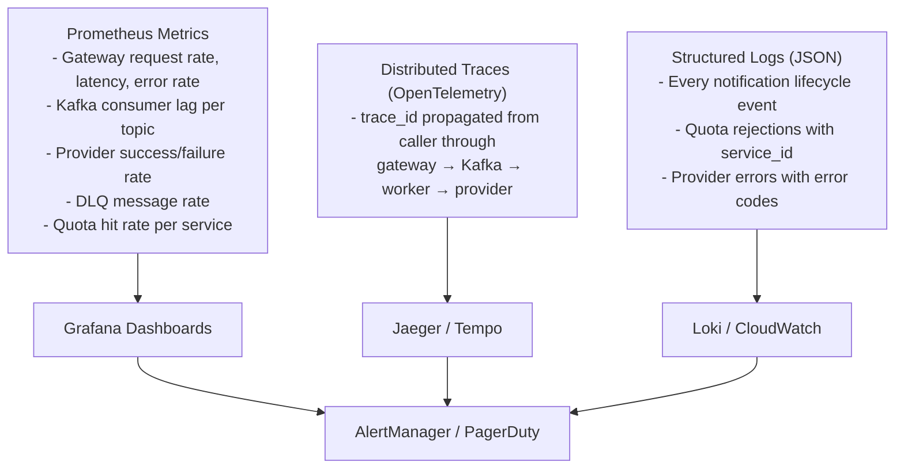

# Non-Functional Requirements

## Target Scale

| Metric | Target |
|--------|--------|
| Daily notification volume | 500M+ notifications/day |
| Peak throughput | ~50,000 notifications/second (Black Friday 10× normal) |
| Channels | SMS, Email, Push |
| Internal calling services | 50–200 |
| Users | 300M+ registered users |

---

## Availability



### How Achieved

| Component | Mechanism |
|-----------|-----------|
| Gateway | Stateless pods, multi-AZ deployment, rolling deploys (zero downtime), LB health checks remove unhealthy pods in <10s |
| Kafka | RF=3, min ISR=2, multi-AZ brokers — tolerates 1 broker failure with no data loss |
| Redis | 6-node cluster, 3 AZs — auto-failover in <5s on primary loss |
| PostgreSQL | Primary + sync replica, Patroni automatic failover — RTO <30s, RPO ~0 |
| Workers | Kafka offset not committed until delivery confirmed — pod crash → message redelivered |

### SLA per Notification Priority

| Priority | Gateway Acceptance Latency | Delivery SLA |
|----------|--------------------------|--------------|
| CRITICAL (OTP) | p99 < 50ms | Delivered in < 5s p95 |
| TRANSACTIONAL | p99 < 100ms | Delivered in < 30s p95 |
| MARKETING | p99 < 200ms | Delivered in < 10 min p95 |

---

## Scalability



### Kafka Partition Sizing

| Topic | Current Partitions | At 500M/day throughput | Peak (10×) |
|-------|--------------------|----------------------|------------|
| notif.critical | 60 | ~5,800 msg/s | ~58,000 msg/s |
| notif.transactional | 120 | ~11,600 msg/s | ~116,000 msg/s |
| notif.marketing | 240 | ~17,400 msg/s | ~174,000 msg/s |

Each partition handles ~1,000 msg/s sustained → headroom exists. Add partitions before hitting 80% capacity.

### PostgreSQL Partitioning

`notifications` table is partitioned by `created_at` (monthly range partitions) to keep working set small and enable fast archival:

```sql
CREATE TABLE notifications (...)
PARTITION BY RANGE (created_at);

CREATE TABLE notifications_2026_03 PARTITION OF notifications
FOR VALUES FROM ('2026-03-01') TO ('2026-04-01');
```

Old partitions (>90 days) are dropped or archived to S3.

---

## Fault Tolerance



### Retry Policy Summary

| Priority | Max Retries | Backoff | Max Delay |
|----------|-------------|---------|-----------|
| CRITICAL | 3 | 2^n × 1s | 4s total |
| TRANSACTIONAL | 3 | 2^n × 2s | ~28s total |
| MARKETING | 3 | 2^n × 5s | ~70s total |

### Circuit Breaker Thresholds

| Metric | Threshold | Action |
|--------|-----------|--------|
| Provider error rate | >50% in 60s window | Open circuit |
| Cooldown | 30s after open | Switch to half-open |
| Recovery | 3 consecutive successes | Close circuit |

---

## Rate Limiting

Three layers of rate limiting, each serving a different purpose:



### Per-User Rate Limits (Sliding Window)

| Type | Limit | Window | Notes |
|------|-------|--------|-------|
| OTP (SMS) | 1 per user | 60 seconds | Security: prevent OTP spam |
| OTP (Email) | 1 per user | 60 seconds | Security: prevent OTP spam |
| Marketing (any channel) | 3 per user | 24 hours | User experience |
| Transactional | No per-user limit | — | Order updates, delivery — no cap |

Sliding window uses Redis Sorted Sets (ZADD + ZREMRANGEBYSCORE + ZCARD).

### Per-Service Quota Defaults

| Service Type | SMS Daily | SMS Hourly | Email Daily | Push Daily |
|-------------|-----------|------------|-------------|------------|
| Auth Service (OTP) | 5M | 500K | 2M | 1M |
| Order Service | 2M | 100K | 10M | 20M |
| Marketing Service | 1M | 50K | 50M | 100M |
| Payment Service | 500K | 50K | 2M | 5M |

Quotas are configurable in the `service_quotas` table. Changes take effect within 5 minutes (cache TTL).

---

## Durability



### Storage Retention Policy

| Data | Hot Storage | Archival | Deletion |
|------|------------|---------|---------|
| Notifications table | 90 days (PostgreSQL) | S3 (Parquet) indefinite | Never deleted from S3 |
| Audit log | Indefinite (PostgreSQL) | — | Never |
| Kafka topics | 7 days (critical: 24h) | — | Auto-expiry |
| Redis quota keys | TTL auto-expire | — | Auto |
| Redis dedup keys | TTL auto-expire | — | Auto |

### Recovery Point Objective (RPO) / Recovery Time Objective (RTO)

| Component | RPO | RTO |
|-----------|-----|-----|
| Gateway | 0 (stateless) | <10s (LB removes failed pod) |
| Kafka | ~0 (RF=3, min ISR=2) | <30s (leader election) |
| PostgreSQL | ~0 (sync replica) | <30s (Patroni failover) |
| Redis | Seconds (async replication) | <5s (auto-failover) |

---

## Observability



### Key Alerts

| Alert | Condition | Severity |
|-------|-----------|----------|
| Critical DLQ spike | >10 CRITICAL messages in DLQ in 5min | P1 |
| Gateway error rate | >1% of requests returning 5xx | P1 |
| Kafka lag — critical | Consumer lag >5,000 on notif.critical | P1 |
| Provider auth failure | 401 from any provider | P1 |
| Quota hit rate | >80% of requests from any service hitting quota | P2 |
| Redis down | Gateway health check failing for >30s | P1 |
| PostgreSQL failover | Primary switched | P2 |
