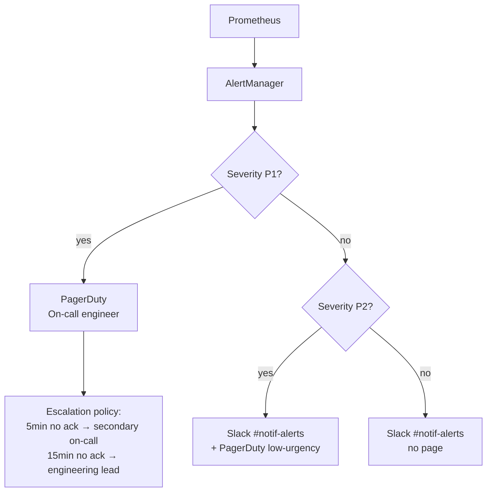
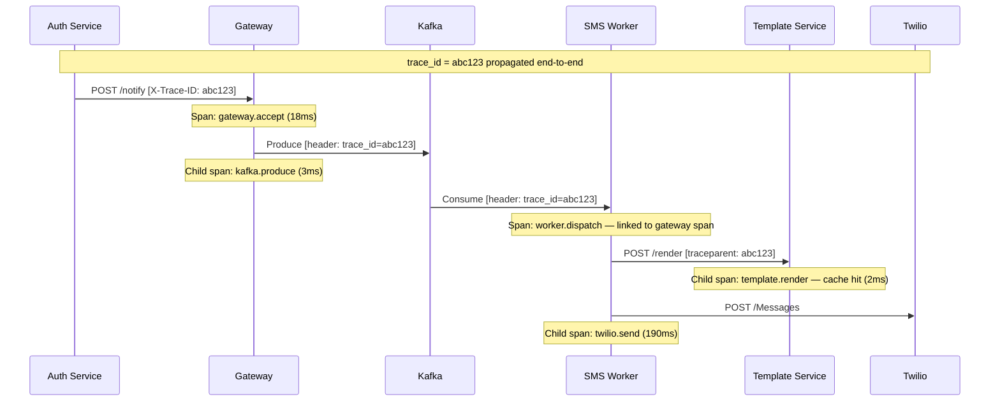

# Observability

## Overview

Observability for the Notification Service spans four pillars: **metrics**, **distributed tracing**, **structured logging**, and **alerting**. Each component emits signals that compose into a complete picture of system health, delivery performance, and cost control effectiveness.

The guiding principle: every notification has a traceable lifecycle from the caller's POST request through Kafka to provider delivery (or DLQ). Any break in that chain must be detectable within seconds, not minutes.

---

## Instrumentation by Component

### Notification Gateway

The gateway is the highest-value instrumentation point — it sees every request before any queuing.

**Metrics to emit (Prometheus)**:

| Metric | Type | Labels | Purpose |
|--------|------|--------|---------|
| `gateway_requests_total` | Counter | `channel`, `priority`, `status_code` | Request volume and error rate |
| `gateway_request_duration_seconds` | Histogram | `channel`, `priority` | p50/p95/p99 acceptance latency |
| `gateway_quota_checks_total` | Counter | `service_id`, `channel`, `result` (allowed/exceeded) | Quota hit rate per service |
| `gateway_dedup_checks_total` | Counter | `channel`, `priority`, `result` (new/duplicate) | Deduplication suppression rate |
| `gateway_dnd_suppressions_total` | Counter | `channel` | DND window block rate |
| `gateway_optout_suppressions_total` | Counter | `channel` | Opt-out block rate |
| `gateway_kafka_produce_duration_seconds` | Histogram | `topic` | Kafka produce latency |
| `gateway_kafka_produce_errors_total` | Counter | `topic`, `error_type` | Kafka produce failures |

**Traces (OpenTelemetry)**:
- Span per `POST /notify` request
- Child spans: auth check → quota check → dedup check → DND check → Kafka produce
- `trace_id` injected from caller's `X-Trace-ID` header if present; generated if absent
- `trace_id` propagated into the Kafka message header so workers continue the same trace

**Structured log fields on every gateway log line**:
```json
{
  "trace_id": "abc123",
  "service_id": "svc-order",
  "user_id": "usr_abc",
  "channel": "SMS",
  "priority": "TRANSACTIONAL",
  "notification_id": "notif_xyz",
  "outcome": "QUEUED",
  "quota_hourly_used": 14203,
  "quota_hourly_limit": 100000,
  "duration_ms": 18
}
```

---

### Channel Workers (SMS / Email / Push / WhatsApp)

Workers instrument the delivery path — the portion invisible to callers.

**Metrics to emit**:

| Metric | Type | Labels | Purpose |
|--------|------|--------|---------|
| `worker_messages_processed_total` | Counter | `channel`, `priority`, `outcome` (delivered/failed/retried) | Delivery throughput |
| `worker_dispatch_duration_seconds` | Histogram | `channel`, `provider` | Provider call latency |
| `worker_provider_errors_total` | Counter | `channel`, `provider`, `error_code` | Provider error breakdown |
| `worker_retry_attempts_total` | Counter | `channel`, `priority` | Retry volume |
| `worker_dlq_produces_total` | Counter | `channel`, `priority`, `reason` | DLQ routing rate |
| `worker_circuit_breaker_state` | Gauge | `channel`, `provider` | 0=closed, 1=open, 2=half-open |
| `worker_template_render_duration_seconds` | Histogram | `channel`, `cache_result` (hit/miss) | Template Service call latency |
| `worker_e2e_delivery_duration_seconds` | Histogram | `channel`, `priority` | Time from `enqueued_at` to delivery |

**Traces**:
- Span per Kafka message consumed, linked to the gateway span via `trace_id` from Kafka header
- Child spans: template render → provider dispatch → status write
- Provider HTTP call traced with `http.status_code` and `provider.message_id` as span attributes

**Structured log fields**:
```json
{
  "trace_id": "abc123",
  "notification_id": "notif_xyz",
  "channel": "SMS",
  "priority": "CRITICAL",
  "attempt": 1,
  "provider": "twilio",
  "provider_status": 201,
  "provider_message_id": "SM1a2b3c",
  "duration_ms": 210,
  "e2e_ms": 843
}
```

---

### Template Service

**Metrics to emit**:

| Metric | Type | Labels | Purpose |
|--------|------|--------|---------|
| `template_render_requests_total` | Counter | `channel`, `cache_result` | Render volume and cache effectiveness |
| `template_render_duration_seconds` | Histogram | `channel`, `cache_result` | Render latency by path |
| `template_cache_size` | Gauge | — | Current Redis cache entry count |
| `template_mjml_compile_duration_seconds` | Histogram | — | Mjml compilation latency (cache miss only) |
| `template_fallback_used_total` | Counter | `channel`, `fallback_level` (l1/redis/static) | Fallback activations |

---

### Kafka (via prometheus-kafka-exporter)

Deploy `prometheus-kafka-exporter` as a sidecar or standalone pod. No code changes required.

**Key metrics exposed**:

| Metric | Labels | Alert basis |
|--------|--------|-------------|
| `kafka_consumergroup_lag` | `consumergroup`, `topic`, `partition` | Core delivery SLA metric |
| `kafka_topic_partition_current_offset` | `topic`, `partition` | Producer throughput |
| `kafka_brokers` | — | Broker health |
| `kafka_topic_partition_under_replicated_partitions` | `topic` | Replication health |

---

### Redis (via redis-exporter)

Deploy `redis-exporter` alongside the Redis cluster. No code changes.

**Key metrics**:

| Metric | Purpose |
|--------|---------|
| `redis_memory_used_bytes` | Shard memory pressure |
| `redis_keyspace_hits_total` / `redis_keyspace_misses_total` | Cache hit rate |
| `redis_commands_duration_seconds_total` | Command latency |
| `redis_connected_slaves` | Replication health per shard |
| `redis_cluster_enabled` | Cluster mode verification |

---

### PostgreSQL (via pg_exporter)

Deploy `postgres_exporter` pointed at primary and read replicas.

**Key metrics**:

| Metric | Purpose |
|--------|---------|
| `pg_stat_replication_pg_wal_lsn_diff` | Replication lag (bytes behind primary) |
| `pg_stat_activity_count` | Active connection count |
| `pg_stat_user_tables_n_dead_tup` | Bloat — trigger vacuum alerting |
| `pg_stat_statements_mean_exec_time_ms` | Slow query detection |
| `pg_database_size_bytes` | Storage growth |

---

## Dashboards (Grafana)

### Dashboard 1: Gateway Overview

**Panels**:

```
Row 1 — Traffic
  ├── Request rate (req/s) — by channel
  ├── Request rate — by priority
  └── HTTP status code breakdown (202 / 200 / 429 / 5xx)

Row 2 — Latency
  ├── p50 / p95 / p99 acceptance latency — CRITICAL
  ├── p50 / p95 / p99 acceptance latency — TRANSACTIONAL
  └── p50 / p95 / p99 acceptance latency — MARKETING

Row 3 — Cost Control Gates
  ├── Quota hit rate by service (top 10 services)
  ├── Dedup suppression rate by channel
  └── DND + opt-out suppression rate

Row 4 — Kafka Produce
  ├── Produce latency p99 by topic
  └── Produce error rate
```

---

### Dashboard 2: Delivery Pipeline

**Panels**:

```
Row 1 — Kafka Consumer Lag (most important board)
  ├── notif.critical lag — all consumer groups
  ├── notif.transactional lag — all consumer groups
  └── notif.marketing lag — all consumer groups

Row 2 — Worker Throughput
  ├── Messages dispatched/s — by channel
  ├── Retry rate — by channel
  └── DLQ produce rate — by channel and reason

Row 3 — End-to-End Delivery Latency
  ├── CRITICAL: p50 / p95 / p99 (target: p95 < 5s)
  ├── TRANSACTIONAL: p50 / p95 / p99 (target: p95 < 30s)
  └── MARKETING: p50 / p95 / p99 (target: p95 < 10min)

Row 4 — DLQ Depth
  ├── DLQ message count by channel
  └── DLQ message count by failure reason
```

---

### Dashboard 3: Provider Health

**Panels**:

```
Row 1 — Success Rate
  ├── Twilio success rate (%)
  ├── AWS SES success rate (%)
  ├── FCM success rate (%)
  └── Meta WhatsApp success rate (%)

Row 2 — Error Breakdown
  ├── Provider error codes — Twilio (429 / 503 / 400 / 401)
  ├── Provider error codes — SES
  ├── Provider error codes — FCM (UNREGISTERED / etc.)
  └── Provider error codes — Meta (131056 / 132000 / 131026 / etc.)

Row 3 — Circuit Breakers
  ├── Circuit breaker state per provider per worker pod
  └── Circuit open duration — last 24h

Row 4 — Provider Latency
  ├── Twilio p99 call latency
  ├── SES p99 call latency
  ├── FCM p99 call latency
  └── Meta p99 call latency
```

---

### Dashboard 4: Cost Control

**Panels**:

```
Row 1 — Quota Usage by Service (heatmap)
  ├── SMS hourly quota % used — top 10 services
  ├── Email hourly quota % used — top 10 services
  └── Push / WhatsApp hourly quota % used

Row 2 — Suppression Volume
  ├── Notifications suppressed by type (quota/dedup/dnd/optout) — 24h rolling
  └── Estimated provider calls avoided — 24h (suppressed × cost_per_send)

Row 3 — Provider Spend Proxy
  ├── SMS sent count — by service (billing attribution)
  ├── Email sent count — by service
  ├── WhatsApp conversations opened — by service
  └── Cumulative daily send count vs quota ceiling
```

---

### Dashboard 5: SLA Compliance

**Panels**:

```
Row 1 — OTP SLA (p95 < 5s end-to-end)
  ├── OTP delivery p95 — rolling 1h
  ├── OTP delivery p95 — last 7 days trend
  └── OTP SLA breach count — last 24h

Row 2 — Transactional SLA (p95 < 30s)
  ├── Transactional delivery p95 — rolling 1h
  └── Transactional SLA breach count

Row 3 — Availability
  ├── Gateway uptime % — last 30 days
  ├── Gateway 5xx rate — rolling 5min
  └── Redis / PostgreSQL / Kafka health status (green/red)
```

---

## Alerting

### P1 — Page On-Call Immediately

| Alert | Condition | Rationale |
|-------|-----------|-----------|
| Critical DLQ spike | `notif.dlq` grows > 10 CRITICAL messages in 5 min | OTP delivery failure — authentication broken |
| Gateway 5xx rate | > 1% of requests return 5xx for > 2 min | Callers cannot send notifications |
| Critical Kafka lag | `notif.critical` consumer lag > 5,000 | OTP SLA breach imminent |
| Provider auth failure | Any `401` from Twilio / SES / FCM / Meta | Credential rotation needed immediately |
| Redis cluster down | Gateway health check failing > 30s | Quota and dedup degraded — allow-by-default mode active |
| PostgreSQL primary down | Primary unreachable > 30s | Writes failing; failover should be underway |
| WhatsApp account suspended | Meta error `131042` (business unsubscribed) | Entire WhatsApp channel dead |

### P2 — Respond Within 30 Minutes

| Alert | Condition | Rationale |
|-------|-----------|-----------|
| Transactional DLQ spike | > 100 TRANSACTIONAL DLQ in 15 min | Order / payment notifications failing |
| Transactional Kafka lag | > 50,000 messages | Transactional SLA at risk |
| High quota exhaustion | Any service hitting > 80% of hourly quota | Approaching suppression for a service |
| PostgreSQL replication lag | Read replica > 10s behind primary | Stale preference reads; dedup may fail |
| Template Service error rate | > 10% errors on `/render` for > 5 min | Workers falling back to static templates |
| Circuit breaker open | Any provider circuit open > 5 min | Provider outage not self-healing |
| WhatsApp tier limit hits | > 100 `131056` errors in 1h | Approaching Meta sending tier ceiling |

### P3 — Respond Within 2 Hours

| Alert | Condition | Rationale |
|-------|-----------|-----------|
| Marketing DLQ spike | > 500 MARKETING DLQ in 30 min | Marketing sends failing but not urgent |
| High retry rate | Worker retry rate > 20% for > 10 min | Provider instability |
| Redis memory pressure | Any shard > 75% memory used | Resharding needed soon |
| PostgreSQL table bloat | Dead tuples > 20% on `notifications` | Vacuum needed |
| Invalid recipient errors | FCM `UNREGISTERED` or Meta `131026` > 100/h | Caller data quality issue |
| SMS segment overrun | SMS body > 3 segments (> 480 chars) | Cost spike — alert template owners |

---

## Alert Routing



---

## Distributed Trace Flow

A single OTP notification produces a connected trace across all components:



The full trace from caller `POST /notify` to Twilio confirmation is visible in Jaeger/Tempo as a single waterfall, with every hop timed. OTP traces are the most important to watch — any span > 1s in the CRITICAL tier warrants investigation.

---

## Changes Required per Component

| Component | Change | Type |
|-----------|--------|------|
| Gateway | Add Prometheus client, instrument all request paths, emit structured JSON logs, inject/propagate trace_id | Code |
| Channel Workers | Add Prometheus histograms for dispatch and e2e latency, trace Kafka-to-provider span, log outcome per attempt | Code |
| Template Service | Instrument render endpoint with cache_result label, log fallback activations | Code |
| Kafka | Deploy `prometheus-kafka-exporter` | Infrastructure |
| Redis | Deploy `redis-exporter` per cluster | Infrastructure |
| PostgreSQL | Deploy `postgres_exporter` for primary + replicas | Infrastructure |
| Grafana | Create 5 dashboards above, set data source to Prometheus | Config |
| AlertManager | Configure alert rules (YAML), routing to PagerDuty + Slack | Config |
| PagerDuty | Configure escalation policy, on-call rotation | Config |
| OpenTelemetry Collector | Deploy as DaemonSet or sidecar, export traces to Jaeger/Tempo | Infrastructure |

No changes to PostgreSQL schema, Kafka topics, or Redis key structure are required for observability.
