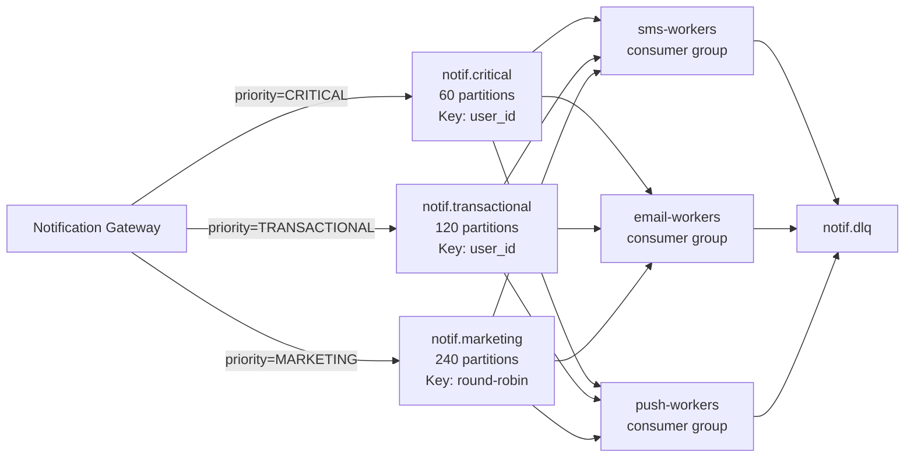
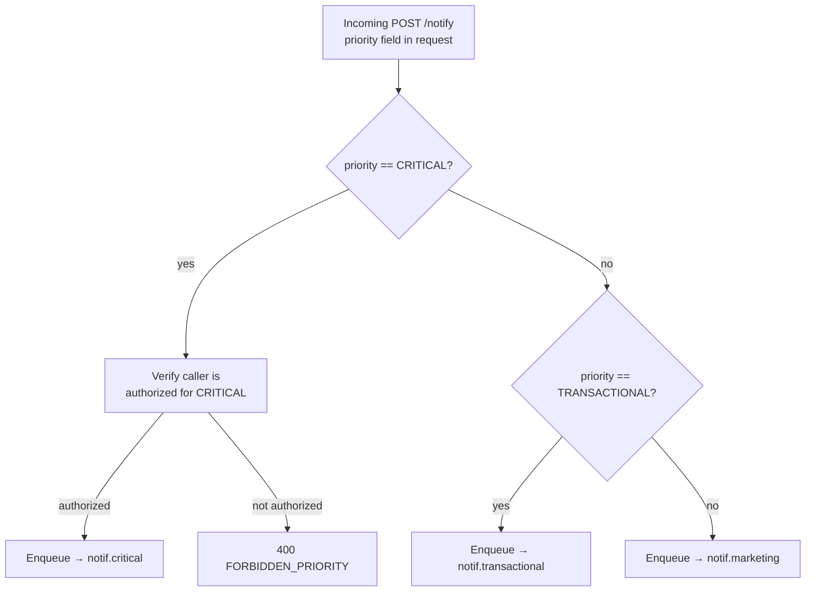
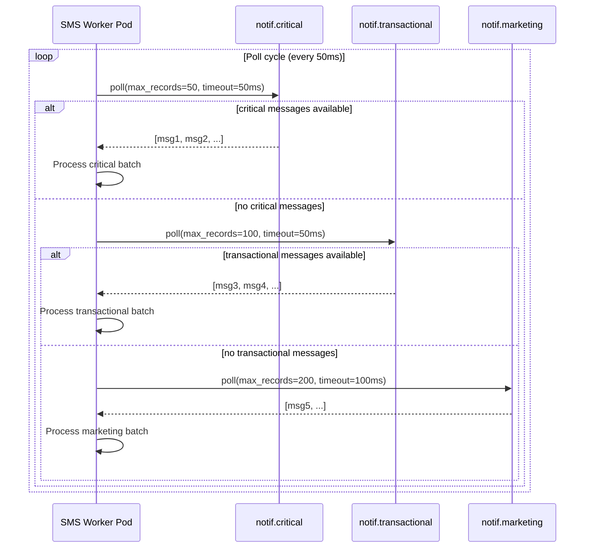
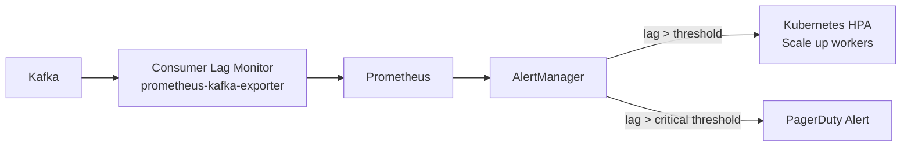
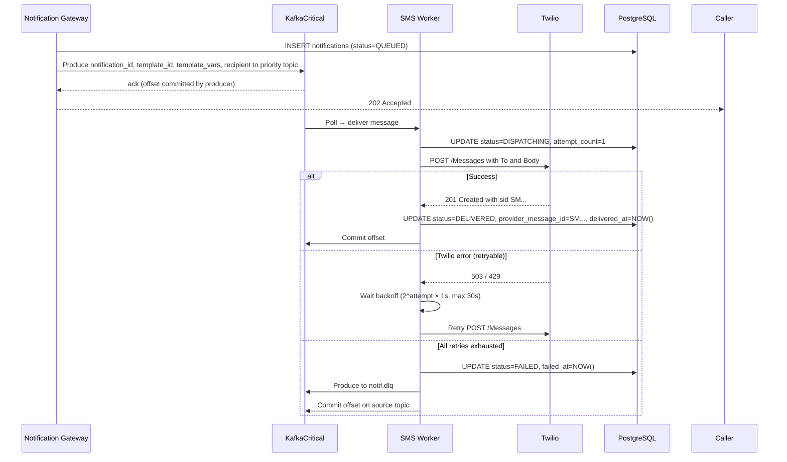

# Priority Queuing

## Overview

The notification service uses three separate Kafka topics — one per priority tier — rather than a single topic with priority tags. This provides true priority isolation: a flood of marketing messages cannot starve OTP delivery, because consumer workers always drain the critical topic first.

---

## Topic Design



### Topic Configuration

| Topic | Partitions | Partition Key | Retention | RF | Min ISR |
|-------|-----------|---------------|-----------|-----|---------|
| `notif.critical` | 60 | `user_id` | 24h | 3 | 2 |
| `notif.transactional` | 120 | `user_id` | 7 days | 3 | 2 |
| `notif.marketing` | 240 | round-robin | 3 days | 3 | 2 |
| `notif.dlq` | 12 | `notification_id` | 30 days | 3 | 2 |

**Why separate topics (not priority tags)?**
- Kafka has no native priority queue semantics; a single topic requires consumers to reorder in memory
- Separate topics allow independent consumer scaling, offset management, and lag monitoring per tier
- Critical topic stays small → poll latency is minimal; worker always finds OTP messages first

**Partition key rationale**:
- `user_id` for critical + transactional: ensures all notifications for a user go to the same partition → preserves ordering (user sees OTP before the "login success" push)
- Round-robin for marketing: pure throughput, no ordering requirement, avoids hot partitions from power users

---

## Why Kafka and Not SQS

SQS is a valid choice at moderate scale and is simpler to operate on AWS. The decision to use Kafka comes down to five specific requirements this system has that SQS cannot satisfy cleanly.

### Where SQS Falls Short

**1. Priority-aware consumer polling across queues**

The core priority model requires a single worker to poll `notif.critical` first, drain it, then fall through to transactional, then marketing. A worker with spare capacity should always help drain the highest-priority backlog regardless of which channel it normally handles.

SQS has no mechanism for a single consumer to poll multiple queues with priority awareness in a tight loop. You would need entirely separate worker fleets per queue with no shared capacity — a marketing worker pod cannot absorb critical messages during a quiet marketing period. Kafka consumers subscribing to multiple topics with explicit poll ordering enables this directly.

**2. Replay on worker failure or bug**

Kafka retains messages for the full retention window (7 days for transactional, 24h for critical) regardless of whether they have been consumed. If a worker deploys a bug and processes messages incorrectly for two hours, you reset the consumer group offset and replay. All 500M daily messages are recoverable.

SQS deletes a message the moment a consumer successfully processes it. There is no replay. A two-hour worker bug at 500M/day means ~40M notifications permanently lost with no recovery path.

**3. Throughput at this scale**

`notif.critical` alone needs to sustain ~5,800 msg/s with peaks at 58,000 msg/s on Black Friday. SQS FIFO queues — required for any ordering guarantee on OTP — cap at 3,000 msg/s per queue without batching tricks. SQS Standard has no ordering. Kafka at 60 partitions handles 58,000 msg/s comfortably with headroom.

**4. Consumer lag as a first-class metric**

The entire autoscaling model is driven by Kafka consumer lag per topic per consumer group. This is a precise, real-time metric that KEDA uses to scale worker pods before SLA breach. SQS exposes `ApproximateNumberOfMessagesVisible` — approximate, eventually consistent, and not broken down per consumer. Scaling decisions become imprecise, and the "approximate" qualifier is dangerous for OTP SLA management.

**5. Fan-out to multiple independent consumer groups**

Every Kafka topic is consumed independently by SMS workers, Email workers, Push workers, and WhatsApp workers — each maintaining their own offset. A single message in `notif.critical` is read once by each worker group that needs it.

SQS is destructive: the first consumer to read a message removes it. Fan-out requires SNS in front of multiple SQS queues — one queue per consumer type — adding an extra hop, additional operational surface, and SNS message filtering complexity.

### Where SQS Would Be the Right Choice

SQS is not the wrong tool in general — it is the wrong tool for this specific set of requirements. It would be the right choice if:

- Replay was not a requirement
- Worker capacity did not need to be shared across priority tiers
- Throughput stayed well under 3,000 msg/s sustained
- Fan-out was not needed (single consumer per message)
- Operational simplicity outweighed the above constraints (valid for early-stage or moderate-scale systems)

### Comparison

| Requirement | Kafka | SQS |
|-------------|-------|-----|
| Priority-aware consumer polling (single worker, multiple queues) | Native — poll loop across topics | Not supported — separate fixed fleets required |
| Message replay after worker bug | Full retention window (days) | Not possible — messages deleted on consume |
| 58,000 msg/s peak on critical channel | 60 partitions — handled trivially | FIFO cap at 3,000/s; Standard has no ordering |
| Precise consumer lag for autoscaling | First-class metric, per group, per topic | Approximate, eventually consistent |
| Fan-out to SMS + Email + Push + WhatsApp workers | Multiple consumer groups, same topic | Requires SNS + separate SQS queue per consumer |
| Operational complexity | Higher — cluster to manage | Lower — fully managed, serverless |
| Cost at 500M/day | ~$3,200/month (MSK) | ~$2,000/month (SQS + SNS) — marginally cheaper |

At startup scale or if any of the five requirements above did not apply, SQS would be the pragmatic default. At 500M/day with strict OTP SLAs and the priority-drain consumer model, Kafka earns its operational overhead.

## Priority Assignment Logic

The gateway assigns priority based on a two-level check:



**CRITICAL authorization**: Only allowlisted services (e.g., `auth-service`, `payment-service`) may submit CRITICAL priority. This prevents a misconfigured marketing service from bypassing queues. Enforced by a `critical_senders` set in Redis, populated from config.

---

## Consumer Group Configuration

Each channel has its own consumer group subscribed to all three topics. Workers implement **priority-aware polling**: they poll the critical topic first, drain it (up to a configurable batch), then move to transactional, then marketing.



### Consumer Group Settings

| Setting | SMS Workers | Email Workers | Push Workers |
|---------|------------|---------------|--------------|
| `group.id` | `sms-workers` | `email-workers` | `push-workers` |
| `auto.offset.reset` | `earliest` | `earliest` | `earliest` |
| `enable.auto.commit` | `false` | `false` | `false` |
| `max.poll.records` | 50 (critical), 100 (trans), 200 (mktg) | same | same |
| `session.timeout.ms` | 30000 | 30000 | 30000 |
| Commit strategy | Manual after ACK from provider | same | same |

**Manual offset commit** (no auto-commit): Workers only commit the offset after the provider confirms delivery or the message is moved to DLQ. This ensures at-least-once delivery — if the worker crashes mid-dispatch, the message is re-delivered.

---

## Kafka Message Schema

```json
{
  "notification_id": "notif_a1b2c3d4",
  "service_id": "svc-auth",
  "user_id": "usr_abc123",
  "channel": "SMS",
  "priority": "CRITICAL",
  "template_id": "otp_verification_v2",
  "template_vars": {
    "otp_code": "847291",
    "expires_in_minutes": 5
  },
  "recipient": {
    "phone_number": "+919876543210"
  },
  "metadata": {
    "order_id": null,
    "trace_id": "trace_abc"
  },
  "enqueued_at": "2026-03-23T10:00:00.045Z",
  "attempt_count": 0,
  "max_attempts": 3
}
```

**No rendered content in Kafka messages.** The gateway enqueues only `template_id + template_vars` — the actual HTML/SMS body is never stored in Kafka. Workers call the Template Service at dispatch time to render content. This keeps every Kafka message under 4KB regardless of email size, avoids Kafka broker memory pressure at 500M+/day, and ensures template updates propagate immediately (no stale pre-rendered content stuck in the queue).

Template Service rendering is fast due to a Redis cache keyed on `{template_id + user_segment}` (TTL=60s) — bulk marketing sends to millions of users reuse the same cached skeleton; only user-specific vars (name, order ID) are interpolated per message at the worker.

---

## Consumer Lag Monitoring & Scaling



### Lag Thresholds

| Topic | Scale-out trigger | Critical alert |
|-------|------------------|----------------|
| `notif.critical` | lag > 1,000 messages | lag > 5,000 messages |
| `notif.transactional` | lag > 10,000 messages | lag > 50,000 messages |
| `notif.marketing` | lag > 100,000 messages | lag > 500,000 messages |

Critical topic lag triggers immediate scale-out (OTP SLA: delivery < 2s p99). Marketing lag is expected during peak and can tolerate delay.

---

## End-to-End Sequence: Gateway Enqueue → Worker Dispatch


