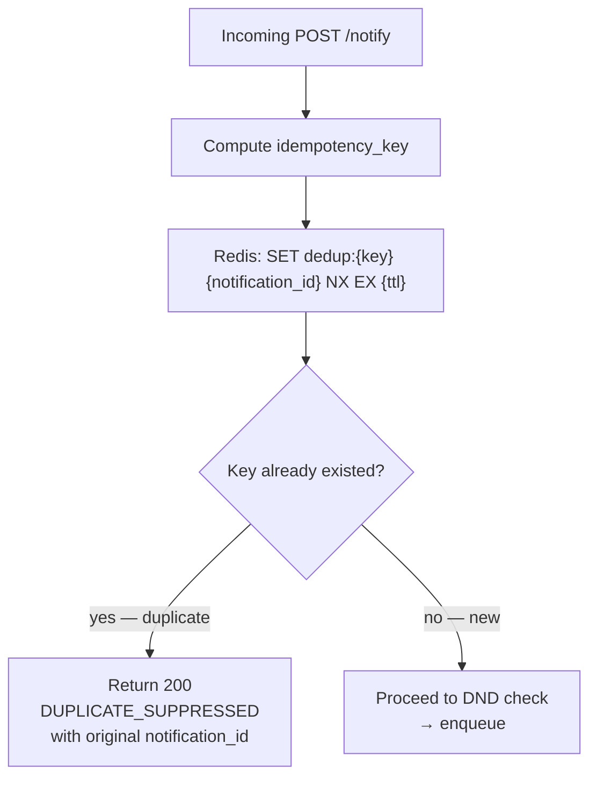
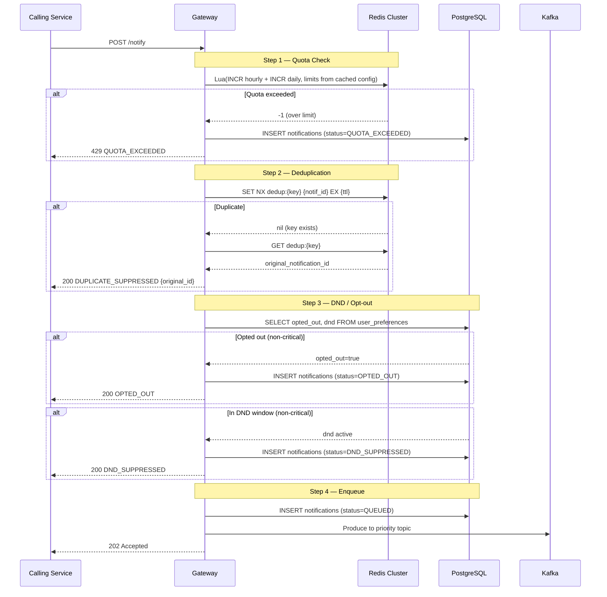

# Quota Enforcement & Deduplication

## Overview

Two independent mechanisms protect against unnecessary third-party billing:

1. **Quota Enforcement** — per-service, per-channel daily/hourly limits prevent any single internal service from over-sending (e.g., a runaway marketing job).
2. **Deduplication** — idempotency-key-based suppression prevents duplicate sends caused by retrying callers or race conditions.

Both are enforced in the **Notification Gateway** before any message is enqueued to Kafka — meaning no provider call is ever made for blocked requests.

---

## Quota Enforcement

### Design: Fixed Window with Redis INCR

```mermaid
flowchart TD
    REQ[Incoming POST /notify] --> LOAD[Load quota config\nfrom Redis cache]
    LOAD --> HOURLY[INCR quota:{svc}:{ch}:HOURLY:{bucket}]
    HOURLY --> H_CHECK{count > hourly_limit?}
    H_CHECK -->|yes| REJECT_H[Return 429\nQUOTA_EXCEEDED\nhourly]
    H_CHECK -->|no| DAILY[INCR quota:{svc}:{ch}:DAILY:{bucket}]
    DAILY --> D_CHECK{count > daily_limit?}
    D_CHECK -->|yes| ROLLBACK[DECR hourly counter\nReturn 429\nQUOTA_EXCEEDED daily]
    D_CHECK -->|no| PASS[Proceed to dedup check]
```

### Redis Operations

```
# Hourly check
INCR quota:{service_id}:{channel}:HOURLY:{floor(ts/3600)}
EXPIRE quota:{service_id}:{channel}:HOURLY:{bucket} 7200

# Daily check
INCR quota:{service_id}:{channel}:DAILY:{floor(ts/86400)}
EXPIRE quota:{service_id}:{channel}:DAILY:{bucket} 172800
```

Both operations use the Lua script below to make them atomic (no race between INCR and EXPIRE):

```lua
-- Atomic INCR + conditional EXPIRE (only set TTL on first write)
local key = KEYS[1]
local limit = tonumber(ARGV[1])
local ttl = tonumber(ARGV[2])

local count = redis.call('INCR', key)
if count == 1 then
    redis.call('EXPIRE', key, ttl)
end
if count > limit then
    redis.call('DECR', key)  -- rollback
    return -1
end
return count
```

### Why Fixed Window (not sliding)?

| | Fixed Window | Sliding Window |
|--|-------------|----------------|
| Redis cost | 1-2 ops per request | ~5 ops (sorted set) |
| Accuracy | ±100% burst at window boundary | True rate across any window |
| Throughput | Handles 500M+/day easily | 5× more Redis ops at same scale |
| Acceptable? | Yes — burst at boundary is acceptable for quota (not security) | Overkill |

Sliding window is used only for **OTP rate limiting** (1 OTP per user per 60s) where burst-at-boundary would be a security issue.

### Quota Config Cache

Quota limits (daily/hourly per service per channel) are stored in PostgreSQL but cached in Redis to avoid a DB hit on every notification:

```
quota_cfg:{service_id}:{channel}  →  HASH {daily_limit, hourly_limit}
TTL: 300s
```

On config change, the Gateway Config Service publishes a `quota_config_updated` event → gateway pods invalidate their local cache + Redis cache.

---

## Deduplication

### Design: Redis SET NX (Idempotency Keys)



### Idempotency Key Derivation

The gateway computes a deterministic key from the semantic content of the notification:

```
idempotency_key = SHA256(
  service_id
  + user_id
  + template_id
  + dedup_window_bucket
)
```

Where `dedup_window_bucket`:
```
CRITICAL  (OTP):       floor(unix_timestamp / 300)    → 5-minute window
TRANSACTIONAL:         floor(unix_timestamp / 3600)   → 1-hour window
MARKETING:             floor(unix_timestamp / 86400)  → 24-hour window
```

This means:
- If Auth Service sends OTP to user X using template `otp_v2` twice within 5 minutes → second is suppressed
- If Order Service sends "order shipped" to user X twice within 1 hour → second is suppressed
- Marketing promo to same user twice in 24 hours → second is suppressed

**Caller-supplied idempotency_key**: If the caller provides their own key in the request, it takes precedence. This is useful when the caller has their own retry logic and wants to guarantee exactly-once delivery even across process restarts.

### Redis Key Schema

```
Key:   dedup:{sha256_hex}
Value: {notification_id}   (so we can return it on duplicate)
TTL:   CRITICAL=300s, TRANSACTIONAL=3600s, MARKETING=86400s
Op:    SET NX EX {ttl}
```

If `SET NX` returns nil (key already existed), GET the value to return the original `notification_id` to the caller.

---

## Combined Gateway Cost Control Flow



---

## Cost Control Summary

| Mechanism | What It Blocks | When It Triggers |
|-----------|---------------|-----------------|
| Hourly quota | Per-service channel bursts | Hourly counter > configured limit |
| Daily quota | Per-service channel overuse | Daily counter > configured limit |
| Dedup (5m window) | OTP resend spam | Same user+template within 5 min |
| Dedup (1h window) | Transactional duplicate sends | Same user+template within 1 hour |
| Dedup (24h window) | Marketing duplicate sends | Same user+template within 24 hours |
| DND suppression | Off-hours marketing | User in DND window (non-critical) |
| Opt-out suppression | Unwanted channel sends | User has opted out of channel |
| OTP rate limit | OTP spam per user | >1 OTP per user per 60s (sliding window) |
| Marketing rate limit | Promo spam per user | >3 per user per 24h (sliding window) |

Every suppressed/rejected notification is recorded in `notifications` with the appropriate status. This creates a full audit trail for provider cost reconciliation — finance can see exactly how many notifications were blocked vs sent.
