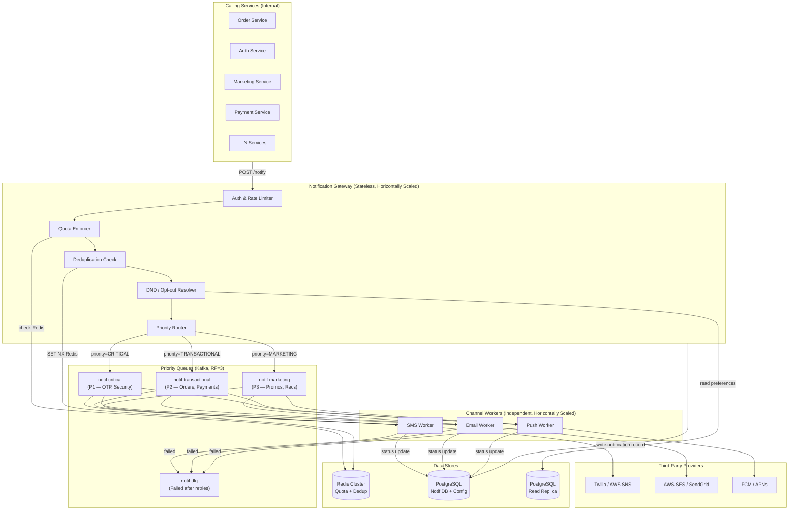
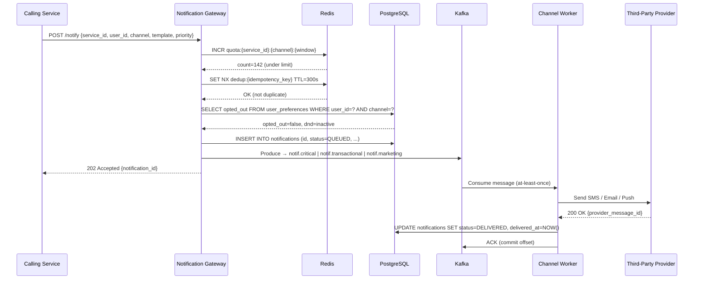
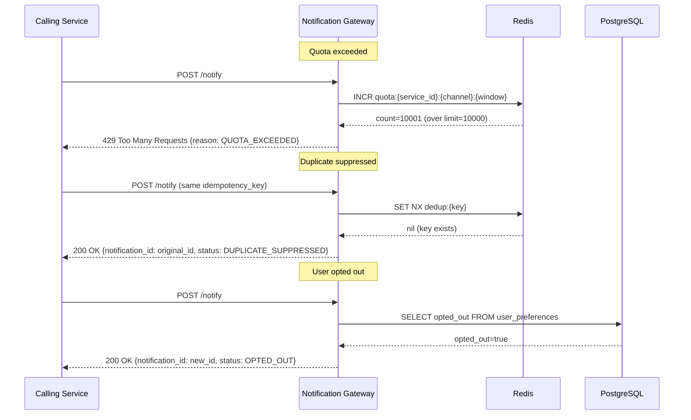
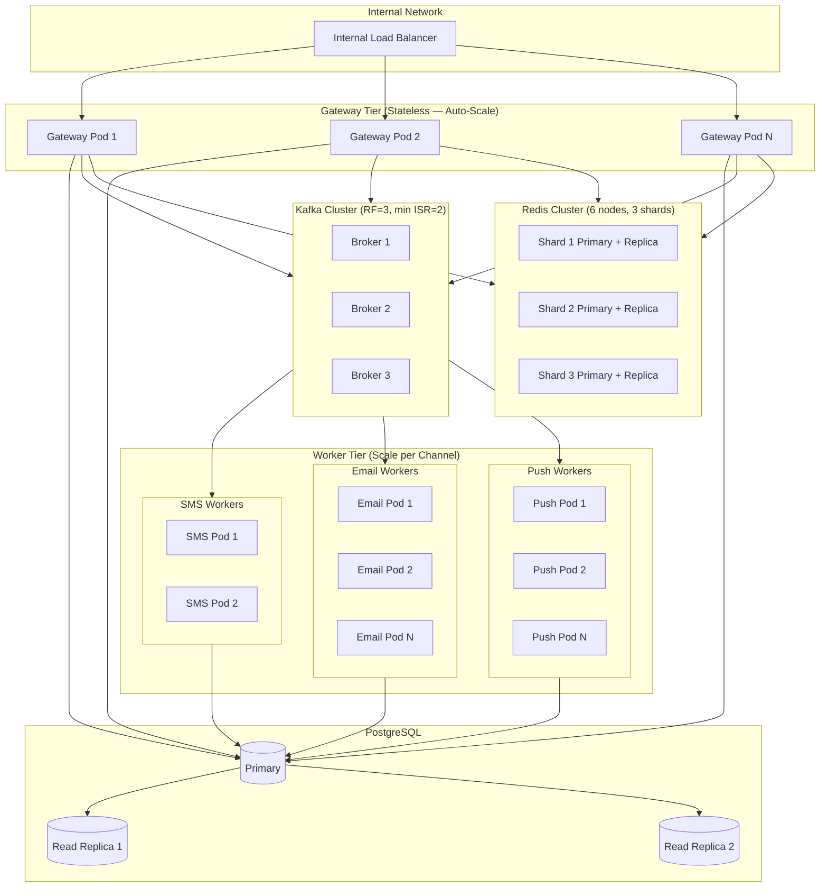

# System Architecture

## Overview

The Notification Service is a **Hub-and-Spoke** system that provides a single REST entry point for all internal e-commerce services to send SMS, Email, and Push notifications. It handles 500M+ notifications/day across three priority tiers, enforcing per-service quotas, deduplication, and user DND preferences before dispatching to third-party providers via independent per-channel workers.

---

## High-Level Component Diagram

---

## Happy Path: Data Flow Sequence

---

## Rejection Flows

---

## Deployment & Scaling

### Scaling Targets

| Component | Strategy | Scale Trigger |
|-----------|----------|---------------|
| Gateway | Stateless horizontal scale | CPU > 70% or p99 latency > 50ms |
| SMS Worker | Scale by Kafka partition count | Consumer lag > 10K messages |
| Email Worker | Scale by Kafka partition count | Consumer lag > 50K messages |
| Push Worker | Scale by Kafka partition count | Consumer lag > 100K messages |
| Kafka | Add partitions per topic | Sustained throughput > 80% capacity |
| Redis | Cluster resharding | Memory > 75% per shard |
| PostgreSQL | Add read replicas | Read IOPS > 80% capacity |

### Kafka Topic Partition Configuration

| Topic | Partitions | Key | Rationale |
|-------|-----------|-----|-----------|
| notif.critical | 60 | user_id | Ordering per user; OTP must not arrive out of order |
| notif.transactional | 120 | user_id | High volume, loose ordering acceptable |
| notif.marketing | 240 | round-robin | Pure throughput, no ordering required |
| notif.dlq | 12 | notification_id | Low volume, needs inspection |

---

## Component Responsibilities

| Component | Responsibility |
|-----------|---------------|
| **Notification Gateway** | Auth, quota check, dedup, DND resolution, priority routing, enqueue, return 202 |
| **SMS Worker** | Consume from all topics (P1 first), call Twilio/SNS, retry with backoff, update status |
| **Email Worker** | Consume from all topics, call SES/SendGrid, retry with backoff, update status |
| **Push Worker** | Consume from all topics, call FCM/APNs, retry with backoff, update status |
| **Redis Cluster** | Quota counters (INCR+TTL), dedup keys (SET NX+TTL), rate limiting |
| **PostgreSQL** | Notification records, service config, quota config, user preferences, audit log |
| **Kafka** | Priority-ordered durable message passing, replay, DLQ |
