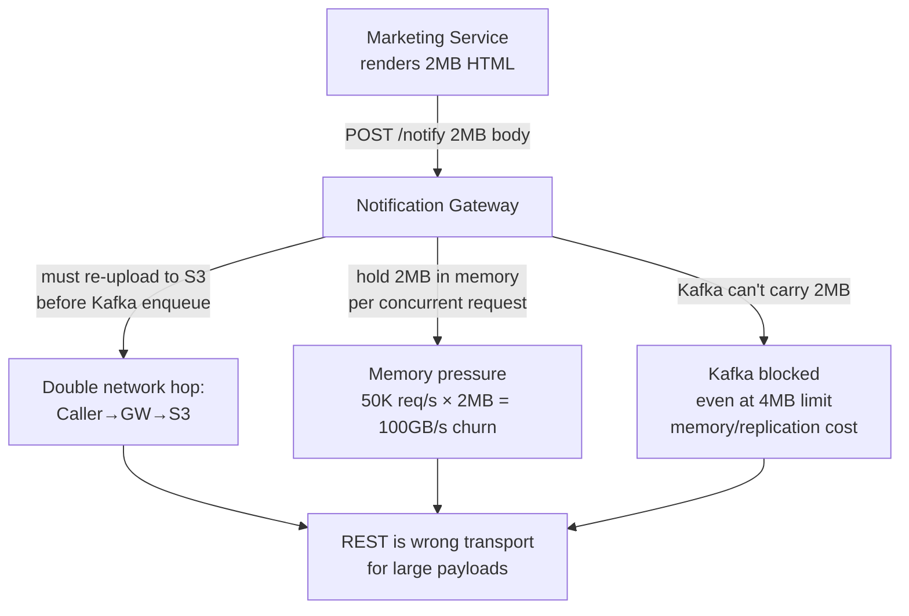
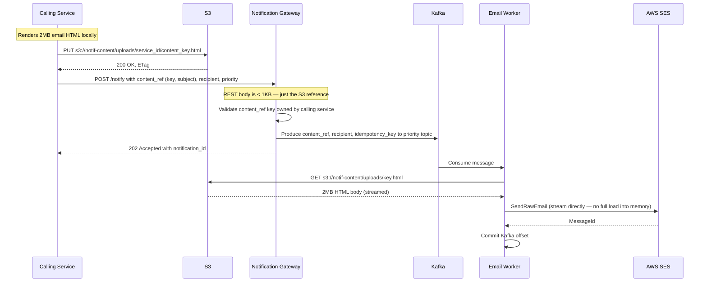
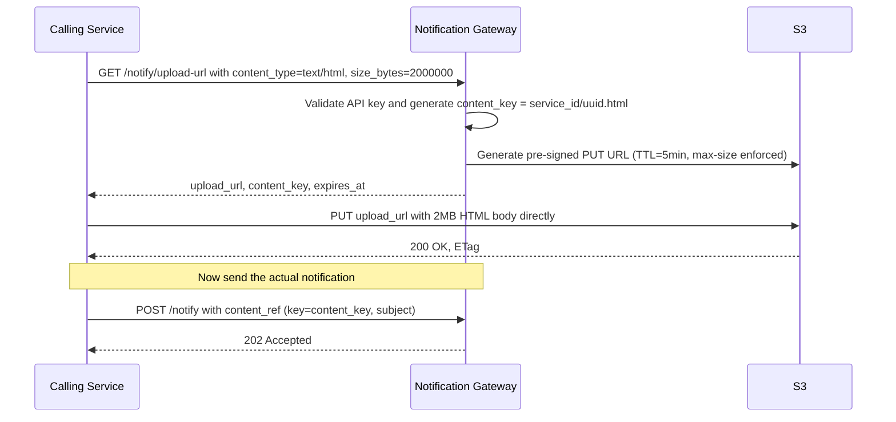
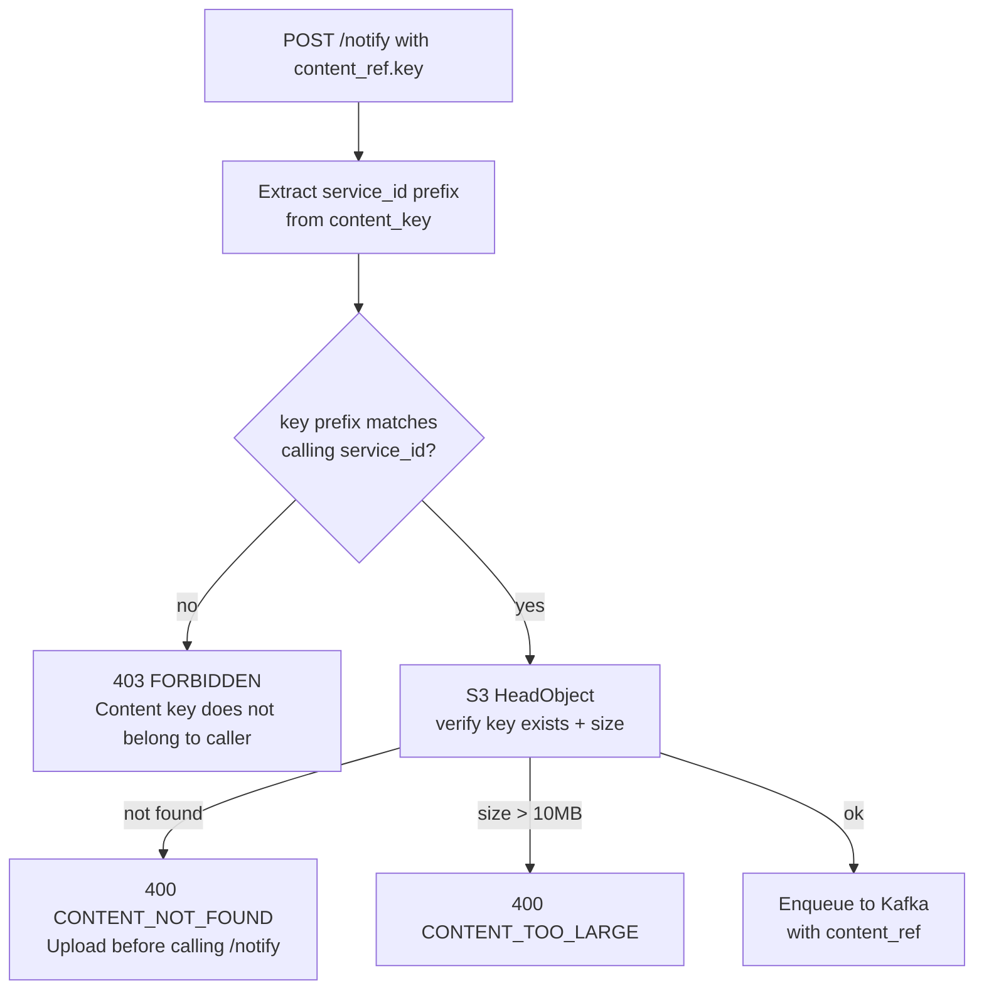
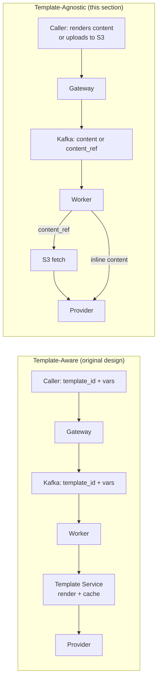

# Template-Agnostic Delivery (Alternative Approach)

## Overview

This section describes an alternative architecture where the Notification Service is a **pure delivery pipe** with zero template awareness. Calling services own content rendering entirely — they send pre-rendered content (or a reference to it) and the Notification Service handles only: auth, quota, dedup, DND, routing, and delivery.

This is a strict separation of concerns:

| Responsibility | Owner |
|---------------|-------|
| Template authoring, versioning, A/B testing | Calling service or external Template Service |
| Content rendering (Mjml → HTML, var interpolation) | Calling service |
| Large content staging (S3 upload) | Calling service |
| Auth, quota, dedup, DND, priority routing | Notification Service (Gateway) |
| Channel dispatch (Twilio, SES, FCM) | Notification Service (Workers) |

The Notification Service never touches a template ID, never calls a template service, and never renders anything.

---

## Why This Separation?

| Concern | Template-Aware Service | Template-Agnostic Service |
|---------|----------------------|--------------------------|
| Ownership boundary | Notification team owns templates + delivery | Each team owns their templates; Notification team owns delivery only |
| Deploy coupling | Template changes need Notification Service involvement | Teams deploy templates and content independently |
| Flexibility | All channels must use registered templates | Callers can send arbitrary content, dynamic HTML, PDFs, etc. |
| Notification Service complexity | Higher (render engine, Mjml, A/B logic) | Lower (pure routing + dispatch) |
| Caller complexity | Lower (just send template_id + vars) | Higher (caller must render before calling) |

**Best fit for**: platforms where multiple independent teams each own their notification content, have heterogeneous content needs (one service sends PDF attachments, another sends rich HTML, another sends plain-text OTPs), and want to move fast without coordinating template changes with the Notification team.

---

## The REST Problem for Large Emails

When callers own rendering, a marketing email with rich HTML + inline styles can easily be **500KB–5MB** rendered. Sending this via REST POST body creates compounding problems:



**The threshold**: REST with inline `content` works up to ~256KB. Beyond that, the **Claim Check pattern** is the correct solution.

---

## Claim Check Pattern

The caller uploads content directly to S3 and sends only an S3 reference (`content_ref`) in the REST call. The gateway enqueues the reference; the worker fetches from S3 at dispatch time.



**Key properties**:
- Gateway never touches the email body — REST payload stays under 1KB
- Kafka messages stay under 4KB regardless of email size
- S3 object survives retries — worker re-fetches on retry without re-upload
- S3 object is reused for bulk sends (100M recipients, same HTML, one S3 object)

---

## Two Upload Flavors

### Flavor A: Direct S3 Upload (Caller Has IAM Access)

Simplest. The calling service has IAM write permission to a scoped prefix.

```
IAM policy: s3:PutObject on s3://notif-content/uploads/{service_id}/*
```

Caller uploads independently, then references the key in `/notify`. No extra API call needed.

**Trade-off**: Requires IAM policy management per service. Callers can write to their own prefix but not others — enforced by IAM path.

---

### Flavor B: Pre-Signed Upload URL (Recommended — No IAM Sharing)

Gateway issues a time-limited pre-signed URL. Caller uploads directly to S3 using it — the bytes never pass through the gateway.



**Advantages over Flavor A**:
- Gateway never handles large bytes — pure control plane
- No IAM credentials shared with callers
- Pre-signed URL enforces max content size at S3 level (no oversized uploads)
- TTL on upload URL prevents stale uploads

**Pre-signed URL endpoint**:

```
GET /v1/notify/upload-url
  ?content_type=text/html
  &size_bytes=2000000

Response 200 OK:
{
  "upload_url": "https://s3.amazonaws.com/notif-content/...?X-Amz-Signature=...",
  "content_key": "svc-marketing/a1b2c3d4-5678.html",
  "expires_at": "2026-03-25T10:05:00Z"
}
```

S3 bucket policy enforces: max object size = 10MB, content-type must match, key prefix must match `{service_id}/`.

---

## Updated `/notify` Payload Contract

The endpoint accepts either `content` (inline, small payloads) or `content_ref` (S3 reference, large payloads). Exactly one must be present.

### Inline Content (≤ 256KB)

For OTP, transactional emails, SMS, push — anything small.

```json
{
  "user_id": "usr_abc123",
  "channel": "EMAIL",
  "priority": "TRANSACTIONAL",
  "recipient": {
    "email": "priya@example.com"
  },
  "content": {
    "subject": "Your order ORD-789 has shipped",
    "body_html": "<html><body><p>Hi Priya, your order...</p></body></html>",
    "body_text": "Hi Priya, your order ORD-789 has shipped. Track at https://..."
  },
  "idempotency_key": "order-shipped-ORD-789"
}
```

### Claim Check Content (> 256KB — Large Emails)

For rich marketing emails, newsletters, PDF attachments.

```json
{
  "user_id": "usr_abc123",
  "channel": "EMAIL",
  "priority": "MARKETING",
  "recipient": {
    "email": "priya@example.com"
  },
  "content_ref": {
    "type": "S3",
    "key": "svc-marketing/a1b2c3d4-5678.html",
    "subject": "Summer Sale — up to 60% off",
    "vars": {
      "customer_name": "Priya",
      "unsubscribe_token": "tok_xyz9"
    }
  },
  "idempotency_key": "campaign-summer-2026-usr_abc123"
}
```

`vars` in `content_ref` are lightweight per-user values the worker interpolates after fetching from S3 (name, unsubscribe token, referral code). The bulk HTML body is shared across all recipients.

### SMS / Push (Always Inline — No Large Payload Problem)

```json
{
  "user_id": "usr_abc123",
  "channel": "SMS",
  "priority": "CRITICAL",
  "recipient": {
    "phone_number": "+919876543210"
  },
  "content": {
    "body_text": "Your OTP is 847291. Expires in 5 minutes. Do not share."
  },
  "idempotency_key": "otp-usr_abc123-1711584000"
}
```

---

## Batch Endpoint for Bulk Sends

Calling REST 100M times for a marketing blast is impractical. A batch endpoint accepts a list of recipients sharing the same content:

```
POST /v1/notify/batch
```

```json
{
  "priority": "MARKETING",
  "channel": "EMAIL",
  "content_ref": {
    "type": "S3",
    "key": "svc-marketing/summer-sale-2026.html",
    "subject": "Summer Sale — up to 60% off"
  },
  "recipients": [
    {
      "user_id": "usr_001",
      "email": "a@example.com",
      "vars": { "customer_name": "Priya", "unsubscribe_token": "tok_aaa" }
    },
    {
      "user_id": "usr_002",
      "email": "b@example.com",
      "vars": { "customer_name": "Rahul", "unsubscribe_token": "tok_bbb" }
    }
  ],
  "idempotency_key": "campaign-summer-2026-batch-001"
}
```

**Response (202 Accepted)**:
```json
{
  "batch_id": "batch_x1y2z3",
  "accepted": 2,
  "rejected": 0,
  "notifications": [
    { "notification_id": "notif_aaa", "user_id": "usr_001", "status": "QUEUED" },
    { "notification_id": "notif_bbb", "user_id": "usr_002", "status": "QUEUED" }
  ]
}
```

### Batch Processing Flow

```mermaid
flowchart TD
    BATCH[POST /notify/batch\n{content_ref, recipients[]}] --> VALIDATE[Validate API key\nQuota check for entire batch atomically]
    VALIDATE -->|quota insufficient| REJECT_PARTIAL[Partial reject:\nAccept up to quota limit\nReject remainder with 429]
    VALIDATE -->|ok| FANOUT[Fan-out loop\nOne Kafka message per recipient\nAll pointing at same S3 key]
    FANOUT --> KAFKA["notif.marketing\n(one msg per user, < 1KB each)"]
    KAFKA --> WORKER[Email Worker]
    WORKER -->|first recipient| S3_FETCH[Fetch from S3 once\nCache in worker L1 memory]
    WORKER -->|subsequent recipients| L1_HIT[L1 cache hit\nInterpolate vars per user\nno S3 fetch]
    L1_HIT --> SES[Stream to SES per recipient]
```

**Recommended batch size**: 1,000–5,000 recipients per batch call. Gateway fan-out produces one Kafka message per recipient. For 100M users, the Marketing Service makes 20,000–100,000 batch calls (can be parallelised), not 100M individual calls.

---

## Worker Behavior: Inline vs Claim Check

```mermaid
flowchart TD
    CONSUME[Worker consumes Kafka message] --> CHECK{content or content_ref?}

    CHECK -->|content present\ninline payload| SIZE{body_html size?}
    SIZE -->|<= 256KB| DIRECT[Send inline to provider]
    SIZE -->|> 256KB\nshould not happen — gateway rejects| DLQ[Route to DLQ\nlog warning]

    CHECK -->|content_ref present\nS3 key| L1{Worker L1 cache\nhit for this S3 key?}
    L1 -->|hit| INTERP[Interpolate vars from message\ninto cached body]
    L1 -->|miss| S3_GET[GET s3://notif-content/{key}]
    S3_GET --> L1_STORE[Store in L1 cache\nTTL=30s, max 50MB per pod]
    L1_STORE --> INTERP
    INTERP --> SEND[Stream to SES]
```

**Worker L1 cache for S3 content**: Workers cache fetched S3 objects in-memory (LRU, 30s TTL, 50MB max per pod). A bulk send with 10 worker pods fetching the same 2MB HTML = 10 S3 GET requests total for the entire campaign — not 100M.

---

## Gateway Validation for content_ref

The gateway must verify the S3 reference belongs to the calling service before enqueuing — to prevent a service from referencing another service's content:



S3 `HeadObject` is lightweight (~1ms) — only fetches metadata, not the object body. This confirms the content exists and is within size limits without the gateway ever downloading it.

---

## S3 Bucket Design

```
Bucket: notif-content (private, no public access)

Prefixes:
  uploads/{service_id}/          ← callers write here (Flavor A direct upload)
  presigned/{service_id}/        ← pre-signed URL uploads land here (Flavor B)

Lifecycle rules:
  uploads/*/                     ← expire after 7 days (notifications delivered well before then)
  presigned/*/                   ← expire after 7 days

Bucket policy:
  - Workers: s3:GetObject on *
  - Gateway: s3:GeneratePresignedUrl, s3:HeadObject on *
  - Callers (Flavor A): s3:PutObject on uploads/{service_id}/* only
  - No s3:DeleteObject for anyone (lifecycle handles cleanup)
```

---

## Transport Decision Matrix

| Scenario | Payload Size | Recipients | Transport |
|----------|-------------|------------|-----------|
| OTP / password reset | < 1KB | 1 | REST + inline `content` |
| Order confirmation (rich HTML) | 10–256KB | 1 | REST + inline `content` |
| Invoice email (HTML + structured data) | 100–500KB | 1 | REST + `content_ref` (pre-signed upload) |
| Marketing email (rich HTML + images) | 500KB–5MB | 1 | REST + `content_ref` |
| Bulk marketing blast (same content) | 500KB–5MB | 1K–100M | Batch endpoint + single `content_ref` |
| SMS (any) | < 1KB | 1 | REST + inline `content` |
| Push notification (any) | < 4KB | 1 | REST + inline `content` |
| Push broadcast (same content, all users) | < 4KB | 1K–100M | Batch endpoint + inline `content` |

---

## Comparison: Template-Aware vs Template-Agnostic



| Dimension | Template-Aware | Template-Agnostic |
|-----------|---------------|------------------|
| Notification Service complexity | Higher (Template Service dependency) | Lower (pure routing + delivery) |
| Caller complexity | Lower (send template_id + vars) | Higher (caller renders, handles S3 upload) |
| Content flexibility | Must use registered templates | Arbitrary content, any format |
| Bulk send efficiency | Template Service caches skeleton | Worker L1 caches S3 object |
| Large email handling | Worker renders + stages to S3 | Caller pre-stages to S3 |
| A/B testing | Built into Template Service | Caller-side (caller decides which variant to render) |
| Operational surface | Notification Service + Template Service | Notification Service only |
| Best for | Teams that want simplicity on the caller side | Teams that need content flexibility and own rendering |
