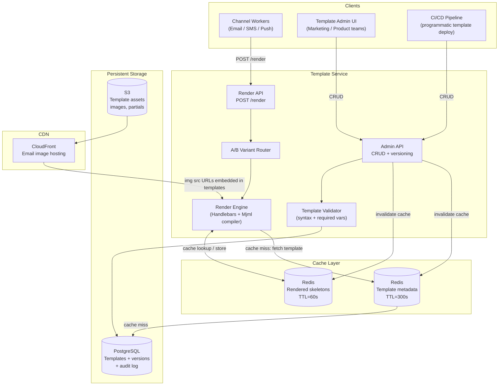
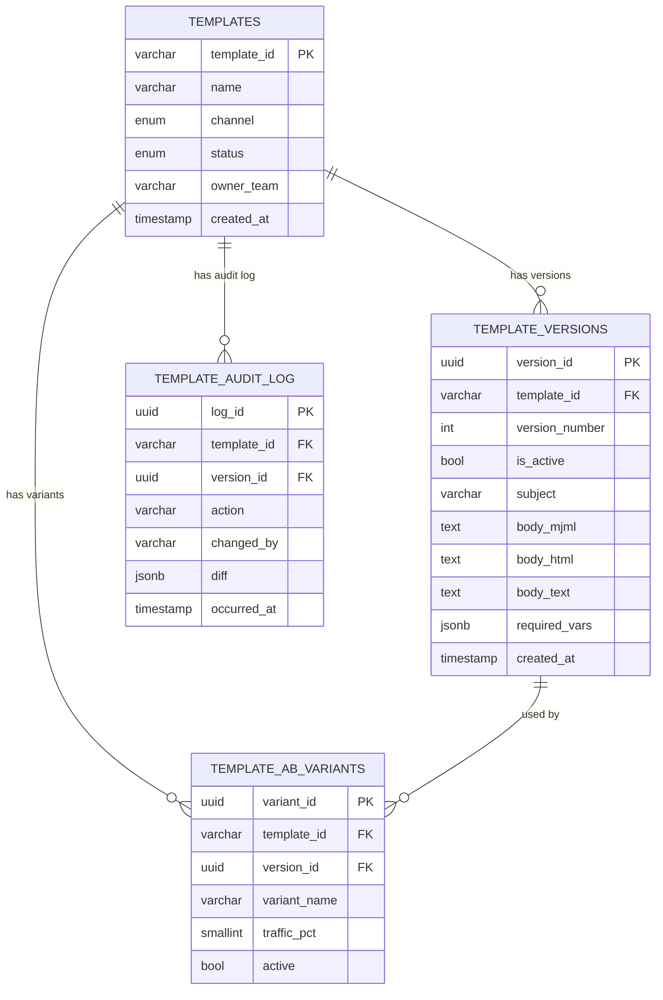
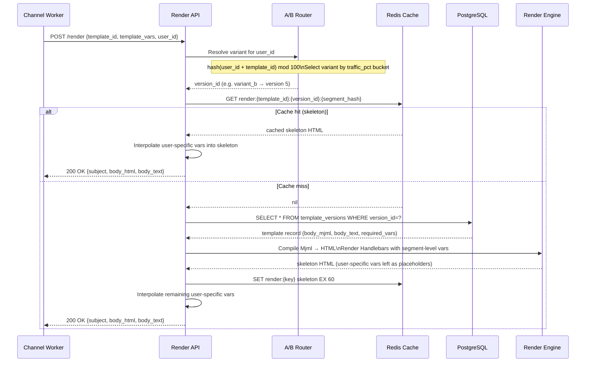
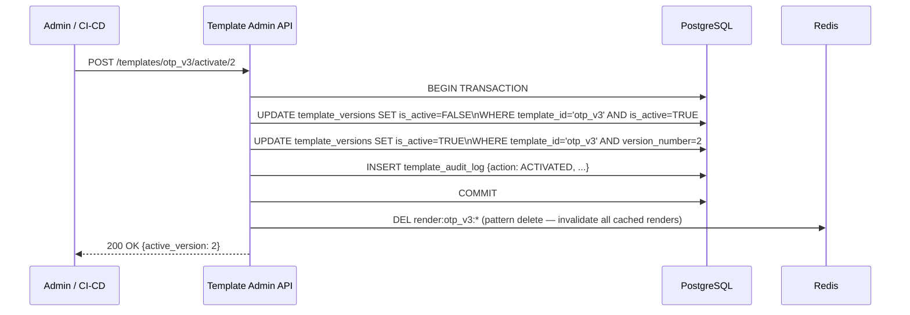
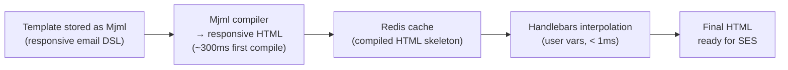
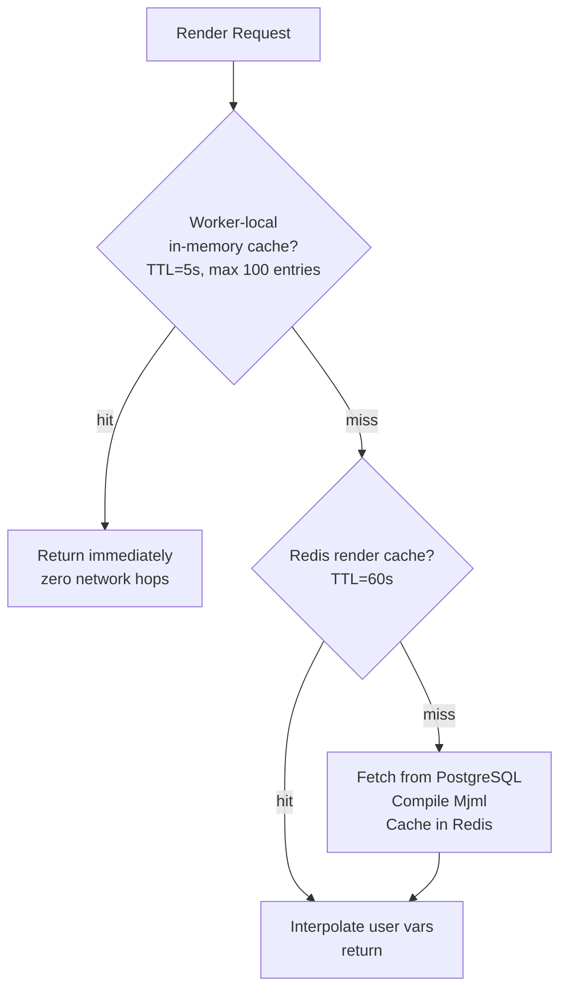
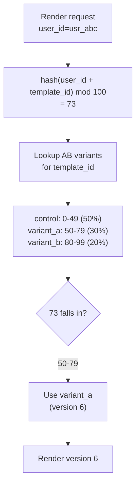
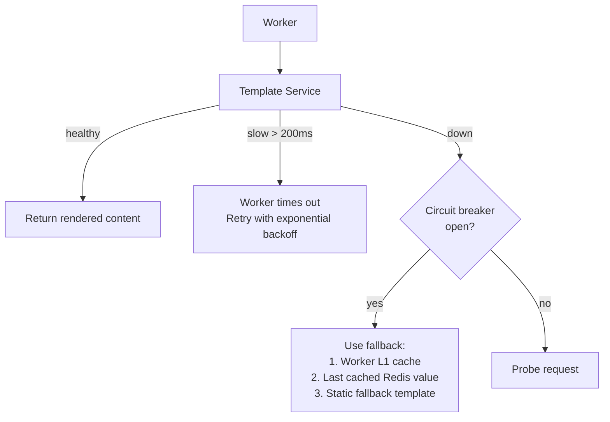
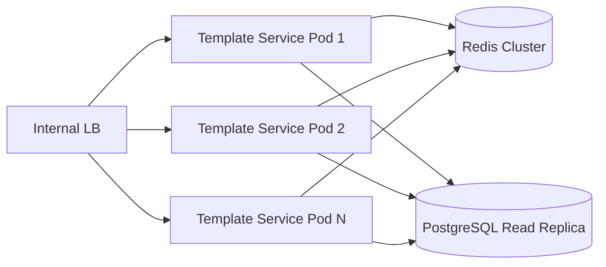

# Template Service

## Overview

The Template Service is an independent microservice responsible for storing, versioning, and rendering notification templates across all channels (SMS, Email, Push). It is the single source of truth for notification content — decoupled from delivery logic so that marketing and product teams can manage templates without touching the Notification Service.

At 500M+ notifications/day, the rendering path is heavily cached. The Template Service is read-heavy (render calls vastly outnumber writes) and horizontally scalable.

---

## Responsibilities

| Responsibility | Description |
|---------------|-------------|
| **Template CRUD** | Create, update, deactivate templates via an admin API |
| **Versioning** | Each update creates a new version; callers can pin to a version or use `latest` |
| **Rendering** | Merge `template_vars` into template body using Handlebars/Jinja; compile Mjml → HTML for emails |
| **Caching** | Cache rendered skeletons in Redis by `{template_id + version + segment}` (TTL=60s) |
| **A/B variants** | Support multiple content variants per template with traffic-split configuration |
| **Validation** | Validate template syntax on save; validate required vars at render time |
| **Audit log** | Immutable record of every template change (who changed what, when) |

---

## Architecture



---

## Data Models

### `templates` table

```sql
CREATE TYPE channel_type AS ENUM ('SMS', 'EMAIL', 'PUSH');
CREATE TYPE template_status AS ENUM ('DRAFT', 'ACTIVE', 'DEPRECATED');

CREATE TABLE templates (
    template_id     VARCHAR(128) PRIMARY KEY,   -- e.g. 'otp_verification_v2'
    name            VARCHAR(256) NOT NULL,
    channel         channel_type NOT NULL,
    description     TEXT,
    status          template_status NOT NULL DEFAULT 'DRAFT',
    owner_team      VARCHAR(100),               -- team responsible for this template
    created_by      VARCHAR(100) NOT NULL,
    created_at      TIMESTAMP NOT NULL DEFAULT NOW(),
    updated_at      TIMESTAMP NOT NULL DEFAULT NOW()
);
```

### `template_versions` table

Every save creates a new immutable version. The `is_active` flag marks which version workers use by default.

```sql
CREATE TABLE template_versions (
    version_id      UUID PRIMARY KEY DEFAULT gen_random_uuid(),
    template_id     VARCHAR(128) NOT NULL REFERENCES templates(template_id),
    version_number  INTEGER NOT NULL,
    is_active       BOOLEAN NOT NULL DEFAULT FALSE,

    -- Content (channel-specific fields nullable)
    subject         VARCHAR(512),               -- Email only
    body_mjml       TEXT,                       -- Email: source Mjml
    body_html       TEXT,                       -- Email: compiled HTML (stored for reference)
    body_text       TEXT,                       -- Email plain-text fallback / SMS body
    push_title      VARCHAR(256),               -- Push only
    push_body       VARCHAR(512),               -- Push only
    push_image_url  VARCHAR(1024),              -- Push only

    required_vars   JSONB NOT NULL DEFAULT '[]', -- ["otp_code", "expires_in_minutes"]
    metadata        JSONB,                       -- arbitrary tags

    created_by      VARCHAR(100) NOT NULL,
    created_at      TIMESTAMP NOT NULL DEFAULT NOW(),

    UNIQUE(template_id, version_number)
);

CREATE INDEX idx_tv_template_active ON template_versions(template_id, is_active)
    WHERE is_active = TRUE;
```

### `template_ab_variants` table

```sql
CREATE TABLE template_ab_variants (
    variant_id      UUID PRIMARY KEY DEFAULT gen_random_uuid(),
    template_id     VARCHAR(128) NOT NULL REFERENCES templates(template_id),
    variant_name    VARCHAR(100) NOT NULL,       -- 'control', 'variant_a', 'variant_b'
    version_id      UUID NOT NULL REFERENCES template_versions(version_id),
    traffic_pct     SMALLINT NOT NULL,           -- 0-100, must sum to 100 across variants
    active          BOOLEAN NOT NULL DEFAULT TRUE,
    created_at      TIMESTAMP NOT NULL DEFAULT NOW(),

    UNIQUE(template_id, variant_name)
);
```

### `template_audit_log` table

```sql
CREATE TABLE template_audit_log (
    log_id          UUID PRIMARY KEY DEFAULT gen_random_uuid(),
    template_id     VARCHAR(128) NOT NULL,
    version_id      UUID,
    action          VARCHAR(64) NOT NULL,        -- CREATED, UPDATED, ACTIVATED, DEPRECATED
    changed_by      VARCHAR(100) NOT NULL,
    diff            JSONB,                       -- before/after for key fields
    occurred_at     TIMESTAMP NOT NULL DEFAULT NOW()
);

REVOKE UPDATE, DELETE ON template_audit_log FROM template_service_role;
```

### Entity Relationship Diagram



---

## API Contracts

### POST /render (called by Channel Workers)

The hot path — called once per notification dispatch. Must be fast.

**Request**:
```json
{
  "template_id": "order_shipped_v3",
  "template_vars": {
    "customer_name": "Priya",
    "order_id": "ORD-789",
    "tracking_url": "https://track.example.com/ORD-789",
    "estimated_delivery": "March 27"
  },
  "user_id": "usr_abc123",
  "version": "latest"
}
```

| Field | Required | Description |
|-------|----------|-------------|
| `template_id` | yes | Template identifier |
| `template_vars` | yes | Variables to interpolate |
| `user_id` | yes | Used for A/B variant assignment (deterministic hash) |
| `version` | no | Pin to specific version number or `latest` (default) |

**Response (200 OK)**:
```json
{
  "template_id": "order_shipped_v3",
  "version_number": 4,
  "variant": "control",
  "channel": "EMAIL",
  "subject": "Your order ORD-789 is on its way!",
  "body_html": "<html>...<p>Hi Priya, your order...</p>...</html>",
  "body_text": "Hi Priya, your order ORD-789 is on its way. Track: https://...",
  "rendered_size_bytes": 48210
}
```

**Error responses**:

| Status | Error | When |
|--------|-------|------|
| 400 | `MISSING_VARS` | Required var missing from `template_vars` |
| 404 | `TEMPLATE_NOT_FOUND` | `template_id` does not exist or is DEPRECATED |
| 422 | `RENDER_ERROR` | Template syntax error during render |

### Render Sequence with Caching



**Two-phase rendering** for bulk sends:
1. **Skeleton render** (cached): Mjml compilation + segment-level vars (promo code, product name for a campaign) → cached for 60s
2. **User interpolation** (per notification): `customer_name`, `order_id`, tracking URLs → done at the service in-memory, not cached

This means a 100M-user marketing blast compiles the Mjml template once, not 100M times.

---

### GET /templates (Admin API)

List templates with filtering.

**Query params**: `channel`, `status`, `owner_team`, `page`, `page_size`

**Response (200 OK)**:
```json
{
  "templates": [
    {
      "template_id": "order_shipped_v3",
      "name": "Order Shipped Notification",
      "channel": "EMAIL",
      "status": "ACTIVE",
      "active_version": 4,
      "owner_team": "order-experience",
      "updated_at": "2026-03-20T14:00:00Z"
    }
  ],
  "total": 142,
  "page": 1
}
```

### POST /templates (Admin API)

Create a new template (starts as DRAFT).

**Request**:
```json
{
  "template_id": "otp_verification_v3",
  "name": "OTP Verification SMS",
  "channel": "SMS",
  "owner_team": "auth-platform",
  "body_text": "Your {{otp_code}} expires in {{expires_in_minutes}} min. Do not share.",
  "required_vars": ["otp_code", "expires_in_minutes"]
}
```

### PUT /templates/{template_id}/versions (Admin API)

Save a new version (does not activate — requires explicit activation).

### POST /templates/{template_id}/activate/{version_number} (Admin API)

Promote a version to active. Atomically deactivates the current active version and sets the new one. Invalidates Redis cache.



---

## Rendering Engine

### Email (Mjml → HTML)



- Templates are authored in **Mjml** (a DSL that compiles to cross-client responsive HTML)
- Mjml compilation is the slow step (~100–300ms) — it runs once per template version and is cached
- Handlebars `{{variable}}` syntax for dynamic values — fast in-memory interpolation

### SMS

- Plain text with Handlebars vars
- Enforced length check: 160 chars per segment; alert if rendered body > 3 segments (cost)
- Unicode detection: if body contains non-GSM7 chars → marked as UCS-2 (70 chars/segment)

### Push

- Title and body rendered via Handlebars
- `push_image_url` is a CDN URL stored directly in the template (not rendered — static per template version)

---

## Caching Strategy



| Layer | Location | TTL | Contents |
|-------|----------|-----|----------|
| L1 | Worker pod in-memory (LRU) | 5s | Compiled skeleton HTML, max 100 templates |
| L2 | Redis Cluster | 60s | Compiled skeleton HTML, keyed by version_id |
| L3 | PostgreSQL | Permanent | Source Mjml, compiled HTML reference |

**Cache invalidation on template activate**: Admin API deletes all Redis keys matching `render:{template_id}:*` when a new version is activated. Worker L1 caches expire naturally within 5s (acceptable propagation delay for template updates — not a security-critical path).

---

## A/B Testing



- Assignment is **deterministic**: same `user_id + template_id` always returns the same variant → consistent experience across devices and retries
- Variant assignment is **logged** in the notification audit log via the `variant` field in the render response — enables downstream click/conversion analysis per variant
- Traffic split is configured in `template_ab_variants.traffic_pct` (must sum to 100)

---

## Fault Tolerance



- **Timeout**: Worker sets 200ms timeout on Template Service calls (SLA: p99 < 50ms). On timeout → retry once, then use fallback
- **Circuit breaker**: If Template Service error rate > 30% in 30s → circuit opens → workers use cached or fallback content
- **Fallback hierarchy**:
  1. Worker L1 in-memory cache (5s TTL, still warm)
  2. Redis cache (60s TTL, may still have previous render)
  3. Static plain-text fallback defined per template (e.g. "Your OTP is {{otp_code}}") — stored in template record
- **Template Service outage** does NOT cause notification delivery to stop for CRITICAL channel — OTP templates are simple enough that the static fallback is identical to the rendered output

---

## Scalability



- **Stateless pods** — all state in Redis + PostgreSQL
- **Read-heavy** — render calls vastly outnumber writes; all reads go to PostgreSQL read replicas
- **Cache offloads**: At 500M notifications/day and 60s TTL, each popular template is fetched from PostgreSQL once per minute. Even with 1000 active templates → 1000 DB reads/min, negligible
- **Render CPU**: Mjml compilation is the only CPU-heavy step. Cached after first compile per version. New version activations trigger one compilation per pod (L1 warm-up), not per request

### Scaling Targets

| Metric | Target |
|--------|--------|
| Render API p99 latency (cache hit) | < 5ms |
| Render API p99 latency (cache miss) | < 100ms |
| Render API p99 latency (Mjml compile) | < 500ms (one-time per version) |
| Throughput | 100K render req/s horizontally scalable |
| Min / Max replicas | 3 / 50 (scale on CPU > 60%) |
