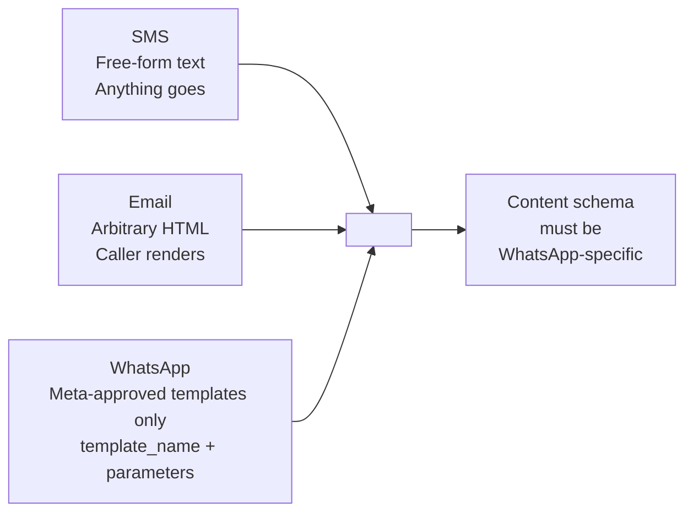
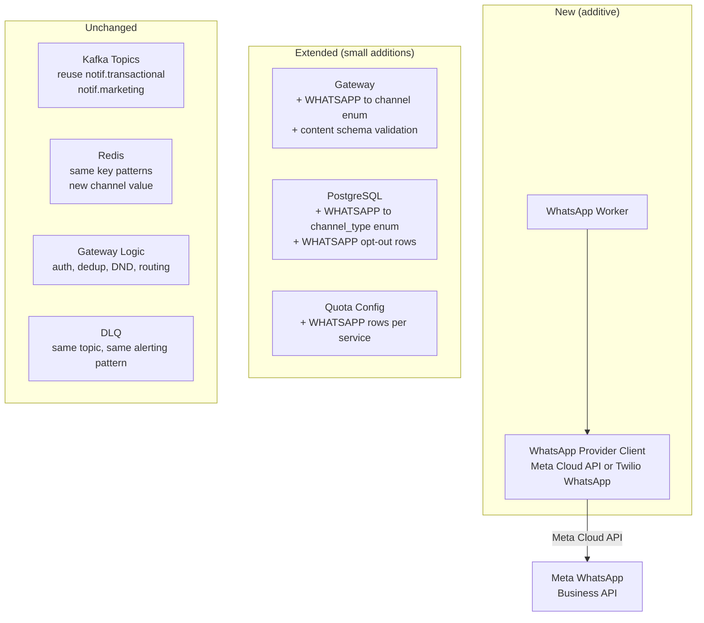
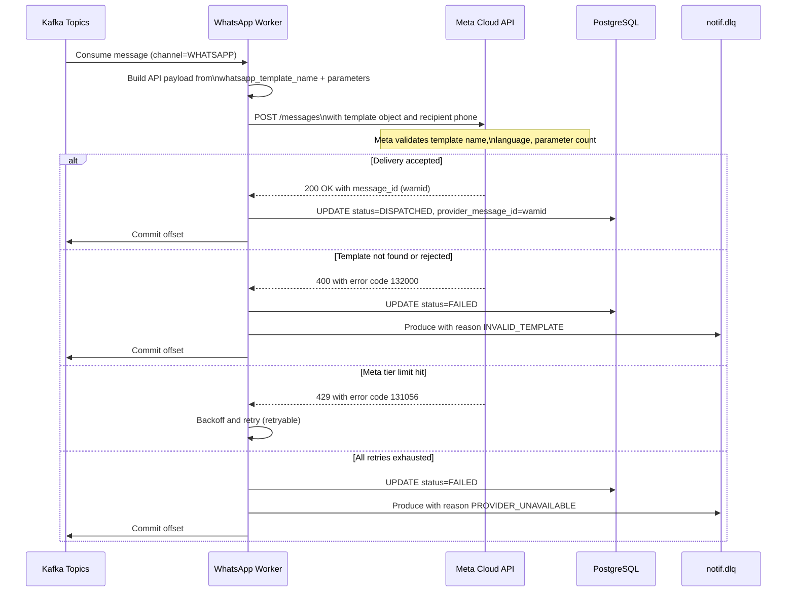
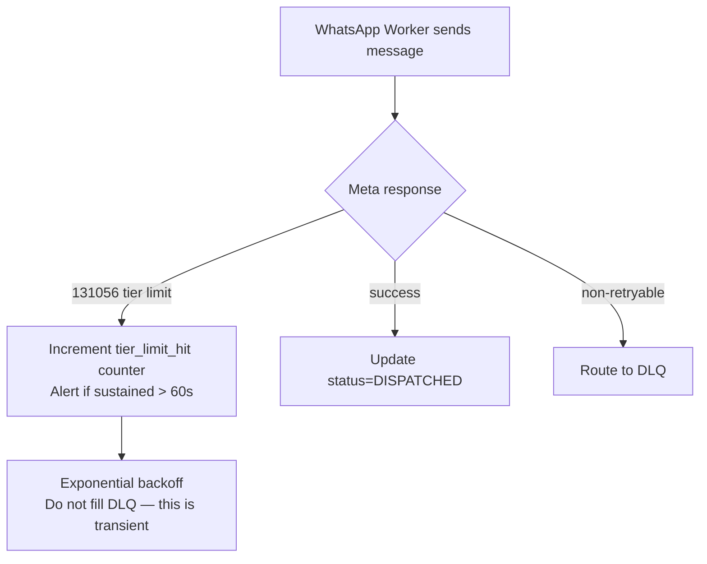
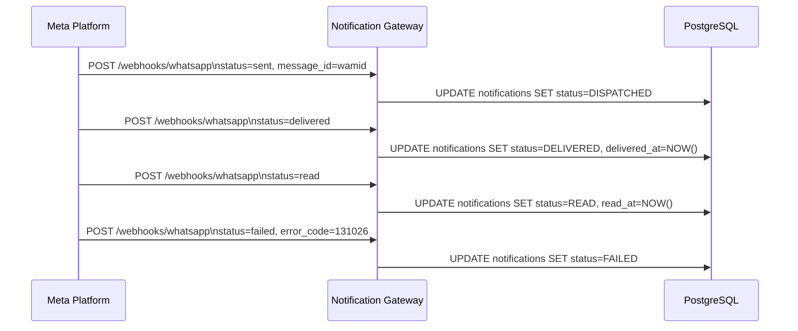
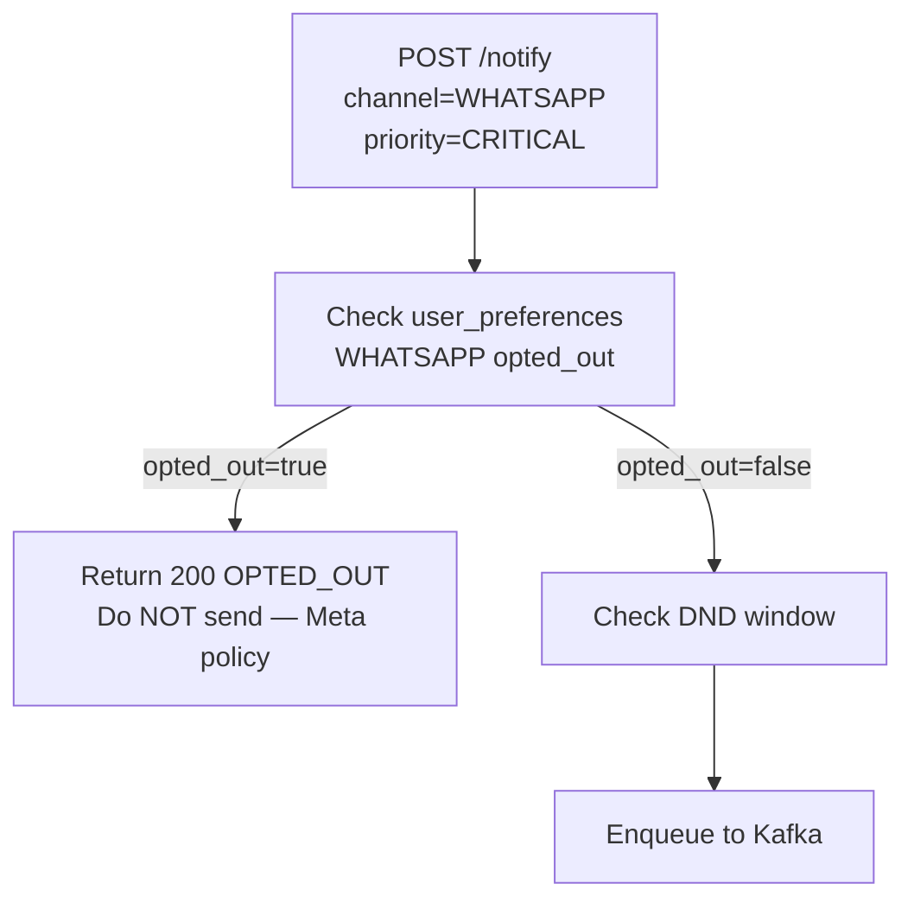

# WhatsApp Channel Addition

## Overview

This document covers adding WhatsApp as a fourth channel to the Notification Service alongside the existing SMS, Email, and Push channels. The addition is designed for **minimal invasion** — the gateway, Kafka, Redis, and PostgreSQL core infrastructure are unchanged. The primary work is a new worker, a new provider client, and a content schema extension.

The design operates in **template-agnostic mode**: the Notification Service never interprets message content. The caller owns WhatsApp template parameter values; the worker forwards them to Meta's API verbatim.

---

## The Fundamental WhatsApp Constraint

Unlike SMS (free-form text) or Email (arbitrary HTML), the WhatsApp Business API mandates **Meta-pre-approved message templates** for all business-initiated outbound messages. You cannot send arbitrary rendered content.



**What this means for template-agnostic mode:**
- The caller provides `whatsapp_template_name` (their Meta-approved template) + `parameters[]` (the variable values)
- The notification service passes these through to Meta's API — it never reads or interprets the content
- The service remains agnostic: it does not know what the template says, only what parameters to inject
- The caller is responsible for registering and managing their WhatsApp templates with Meta

This is still "template-agnostic" from the notification service's perspective. The caller owns the template lifecycle; the service owns delivery.

---

## Content Schema

### WhatsApp Request to POST /notify

```json
{
  "user_id": "usr_abc123",
  "channel": "WHATSAPP",
  "priority": "TRANSACTIONAL",
  "recipient": {
    "phone_number": "+919876543210"
  },
  "content": {
    "whatsapp_template_name": "order_shipped",
    "whatsapp_language_code": "en_US",
    "parameters": [
      { "type": "text", "text": "Priya" },
      { "type": "text", "text": "ORD-789" },
      { "type": "text", "text": "March 30" }
    ],
    "header_parameters": [
      { "type": "image", "image": { "link": "https://cdn.example.com/shipped.png" } }
    ]
  },
  "idempotency_key": "order-shipped-ORD-789"
}
```

| Field | Required | Description |
|-------|----------|-------------|
| `whatsapp_template_name` | yes | Meta-approved template name (caller-managed) |
| `whatsapp_language_code` | yes | BCP-47 language code matching the approved template |
| `parameters` | yes | Body variable substitutions in order (`{{1}}`, `{{2}}`, ...) |
| `header_parameters` | no | Header variable substitutions (image, video, document, or text) |
| `button_parameters` | no | Dynamic URL suffix or OTP code for button components |

### Comparison: Content Shape per Channel

| Channel | Content Fields | Format |
|---------|---------------|--------|
| SMS | `body_text` | Free-form string, max 160 chars/segment |
| Email | `body_html`, `body_text`, `subject` | HTML + plain-text |
| Push | `title`, `body`, `image_url` | Short strings |
| WhatsApp | `whatsapp_template_name`, `whatsapp_language_code`, `parameters[]` | Template reference + variable values |

The gateway validates that WhatsApp requests have `whatsapp_template_name` and at least one parameter. It does not validate the template itself — that is Meta's responsibility at send time.

---

## Architecture Changes

### What Changes



### What Does Not Change

- Gateway auth, quota enforcement, dedup, DND resolver — zero changes
- Kafka topics — WhatsApp reuses `notif.transactional` and `notif.marketing`; no new topics
- Redis key schema — same `quota:svc:WHATSAPP:HOURLY:bucket` pattern
- PostgreSQL core schema — only the `channel_type` enum gains `WHATSAPP`
- Retry and circuit breaker logic — WhatsApp Worker inherits the identical pattern
- S3 large-payload path — not applicable (WhatsApp has no large HTML concept)
- DLQ — reuses `notif.dlq` with the same schema

---

## WhatsApp Worker

The WhatsApp Worker follows the identical pattern as the SMS Worker: consume from all priority topics, call the provider client, retry with backoff, update status, route failures to DLQ.



### Provider Client Interface

WhatsApp Worker implements the same `ProviderClient` interface used by SMS/Email/Push workers:

```
interface ProviderClient {
  send(notification: Notification): Result<provider_message_id, ProviderError>
}
```

The `WhatsAppProviderClient` maps the `content.parameters[]` array to Meta's message object format:

```json
{
  "messaging_product": "whatsapp",
  "to": "+919876543210",
  "type": "template",
  "template": {
    "name": "order_shipped",
    "language": { "code": "en_US" },
    "components": [
      {
        "type": "header",
        "parameters": [{ "type": "image", "image": { "link": "..." } }]
      },
      {
        "type": "body",
        "parameters": [
          { "type": "text", "text": "Priya" },
          { "type": "text", "text": "ORD-789" },
          { "type": "text", "text": "March 30" }
        ]
      }
    ]
  }
}
```

---

## Meta-Specific Error Codes

Meta uses numeric error codes. The worker maps these to retryable vs non-retryable:

| Meta Error Code | Meaning | Action |
|----------------|---------|--------|
| `131056` | Tier limit reached (per phone number) | Retryable — backoff |
| `131042` | Business not subscribed to number | Non-retryable — DLQ + alert |
| `132000` | Template name not found | Non-retryable — DLQ |
| `132001` | Template not approved | Non-retryable — DLQ |
| `132007` | Template parameter count mismatch | Non-retryable — DLQ |
| `130429` | Rate limit hit (account-level) | Retryable — backoff |
| `131026` | Recipient phone not on WhatsApp | Non-retryable — DLQ, mark invalid |

---

## Meta Sending Tier Limits

Meta enforces per-business-phone-number daily limits in tiers, independent of your internal quotas:

| Tier | Daily Unique Recipients | How to Upgrade |
|------|------------------------|----------------|
| 1 | 1,000 | Send quality messages, avoid blocks |
| 2 | 10,000 | Automatic after quality threshold met |
| 3 | 100,000 | Automatic after quality threshold met |
| 4 | Unlimited | Automatic |

**Implication**: Your internal quota config for WhatsApp must be set at or below the Meta tier limit. If `131056` errors start appearing, it signals the Meta tier is the bottleneck — not the notification service's quota. Alert on this separately.



---

## 24-Hour Session Window

WhatsApp distinguishes two message types:

| Type | When | Template Required? |
|------|------|--------------------|
| Template message | Business-initiated (any time) | Yes — must use pre-approved template |
| Session message | Within 24h of user's last message | No — free-form text allowed |

**Design decision: always use templates.** Tracking the 24-hour session state per user adds complexity (Redis key per user, webhook to update on incoming message). For a notification service, business-initiated sends are the dominant case. Free-form session replies belong to a conversational messaging system, not a notification service. The WhatsApp Worker always calls the template API path.

---

## Delivery Receipts (Read Status)

WhatsApp provides more granular delivery webhooks than SMS:



**New status values added to `notification_status` enum**:
- `READ` — user opened and read the message (WhatsApp only)

`DELIVERED` already exists. `READ` is additive and only populated for WhatsApp.

### Webhook Endpoint

```
POST /v1/webhooks/whatsapp
X-Hub-Signature-256: sha256=...   (Meta HMAC signature — must verify)
```

The gateway verifies the HMAC signature using the app secret before processing. Unverified webhooks return 403 immediately.

---

## Opt-In Requirements

WhatsApp has stricter opt-in requirements than SMS. Users must explicitly consent to receive WhatsApp messages from the business.

**Schema change**: none. The existing `user_preferences` table handles this:

```sql
INSERT INTO user_preferences (user_id, channel, opted_out, updated_at)
VALUES ('usr_abc', 'WHATSAPP', false, NOW())
ON CONFLICT (user_id, channel) DO UPDATE SET opted_out = EXCLUDED.opted_out;
```

**CRITICAL priority bypass does NOT apply to WhatsApp.** Unlike SMS OTP (which carriers allow), Meta can penalise or ban business accounts that send unsolicited messages, even to users who haven't opted in. CRITICAL WhatsApp sends must still check opt-in status.



This differs from SMS/Push where CRITICAL bypasses opt-out. Document this exception clearly for callers.

---

## PostgreSQL Changes

```sql
-- 1. Extend channel enum
ALTER TYPE channel_type ADD VALUE 'WHATSAPP';

-- 2. Extend notification_status enum (for read receipts)
ALTER TYPE notification_status ADD VALUE 'READ';

-- 3. Add read_at column (nullable — WhatsApp only)
ALTER TABLE notifications ADD COLUMN read_at TIMESTAMP;

-- 4. Add quota config rows for WhatsApp per service
INSERT INTO service_quotas (service_id, channel, daily_limit, hourly_limit)
VALUES
  ('svc-order',    'WHATSAPP', 1000000, 50000),
  ('svc-marketing','WHATSAPP',  500000, 25000);
```

No other schema changes. The `notifications` table, `user_preferences` table, and all indexes are untouched except the enum extensions.

---

## Quota Configuration

WhatsApp quotas must account for both internal limits and Meta tier limits. Set internal daily quotas conservatively below the Meta tier ceiling:

| Service | WhatsApp Daily | WhatsApp Hourly | Notes |
|---------|---------------|-----------------|-------|
| Auth Service | 500K | 25K | OTP-style alerts |
| Order Service | 1M | 50K | Transactional confirmations |
| Marketing Service | 500K | 25K | Below Meta Tier 3 ceiling |
| Payment Service | 200K | 10K | Payment confirmations |

If Meta upgrades the business phone to Tier 4 (unlimited), internal quotas remain the control — Meta's limit is no longer the binding constraint.

---

## Worker Scaling

WhatsApp Worker uses the same Kafka consumer lag-based HPA as other workers:

| Metric | Value |
|--------|-------|
| Consumer group | `whatsapp-workers` |
| Topics subscribed | `notif.transactional`, `notif.marketing` |
| Min replicas | 5 |
| Max replicas | 100 |
| Scale trigger | `notif.transactional` lag > 10K OR `notif.marketing` lag > 100K |
| Commit strategy | Manual — after Meta API returns `wamid` or message is DLQ'd |

---

## DLQ Alerting Thresholds

Add WhatsApp to the existing DLQ alerting config:

| Channel | Alert Threshold | Severity | Notes |
|---------|----------------|----------|-------|
| WhatsApp (TRANSACTIONAL) | >50 DLQ in 15min | P2 | Likely template rejection or tier limit |
| WhatsApp (MARKETING) | >500 DLQ in 30min | P3 | Expected during campaigns |
| WhatsApp `131026` errors | >100 in 1h | P3 | Invalid phone numbers — caller data quality |
| WhatsApp `131042` | Any | P1 | Business phone unsubscribed — immediate action |

---

## Summary: Change Surface

| Area | Change | Effort |
|------|--------|--------|
| Channel enum | Add `WHATSAPP` | Trivial |
| `POST /notify` validation | Accept WhatsApp content shape | Small |
| PostgreSQL schema | Enum extensions, `read_at` column | Small |
| WhatsApp Worker | New service — copy SMS Worker pattern | Medium |
| WhatsApp Provider Client | Meta Cloud API implementation | Medium |
| Webhook endpoint | `POST /webhooks/whatsapp` + HMAC verification | Small |
| Quota config | Add WHATSAPP rows per service | Trivial |
| User preferences | WHATSAPP opt-in rows, no CRITICAL bypass | Trivial |
| DLQ alerting | Add WHATSAPP thresholds | Trivial |
| Kafka | No change | Zero |
| Redis | No change | Zero |
| Gateway routing logic | No change | Zero |
| Retry/circuit breaker | No change — inherited by worker | Zero |

The total change is two new services (worker + provider client), minor schema extensions, and a webhook endpoint. Everything else is configuration and enum additions.
