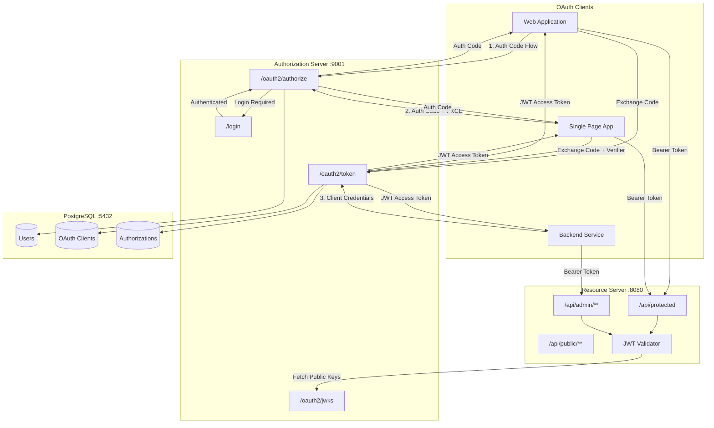
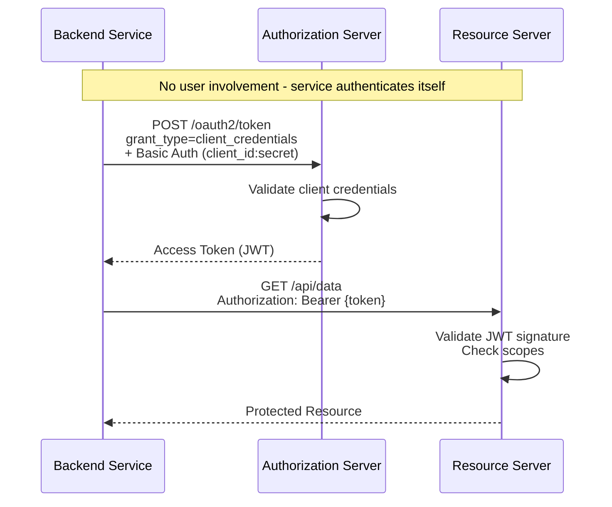
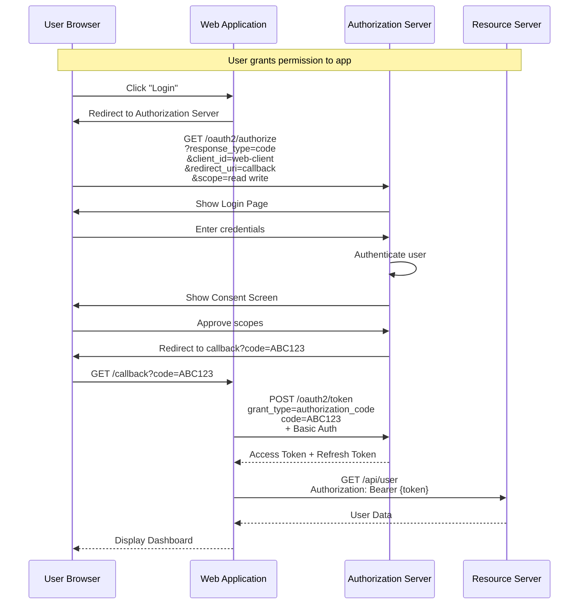
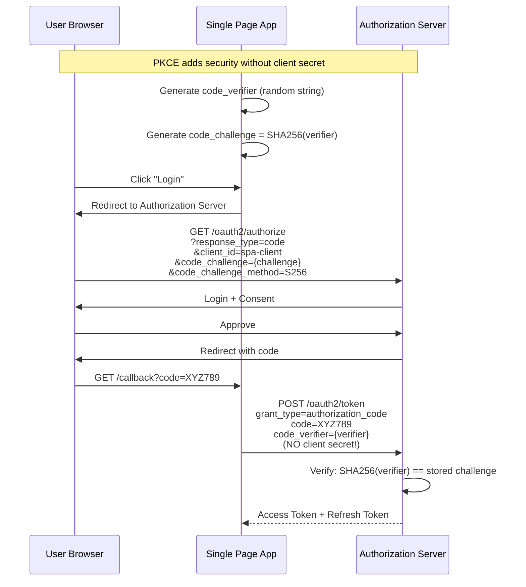
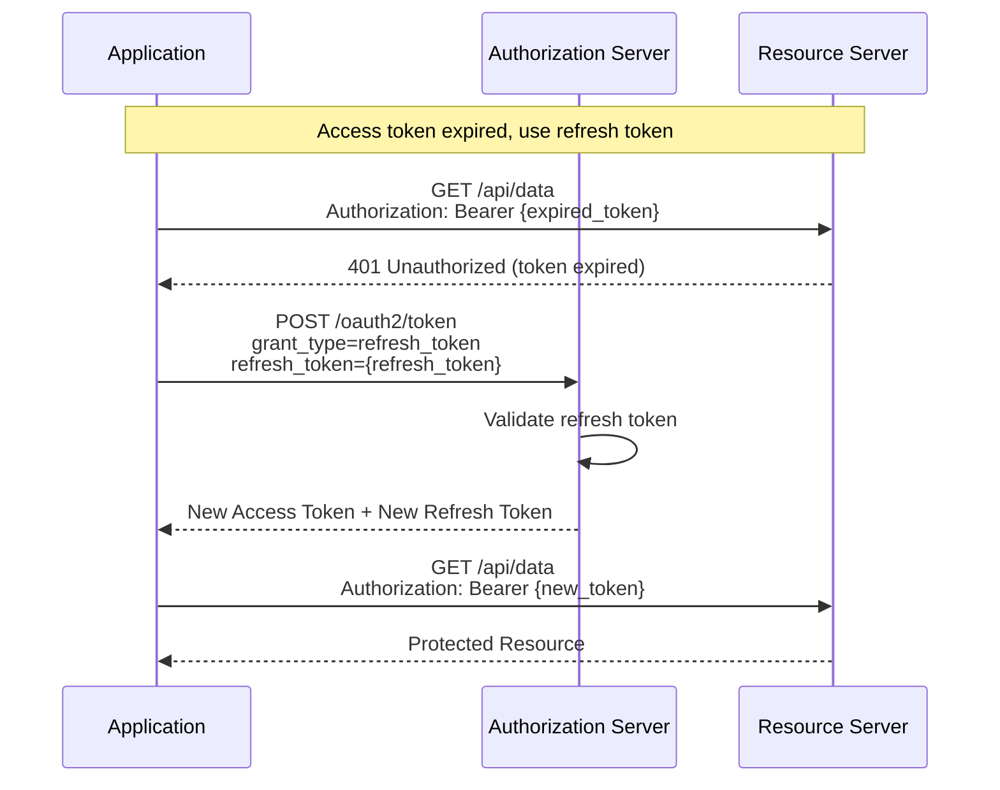
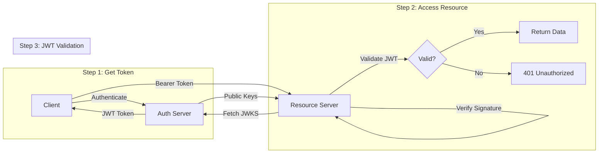

# OAuth 2.0 Demo - Spring Boot Implementation

A complete OAuth 2.0 implementation featuring a **Spring Authorization Server** and a **Resource Server**, supporting multiple grant types with PostgreSQL persistence.

## System Architecture



## OAuth 2.0 Grant Types Explained

### 1. Client Credentials Flow

Best for: **Machine-to-machine** communication (backend services, scheduled jobs, microservices).



### 2. Authorization Code Flow

Best for: **Web applications** with a server-side backend that can securely store client secrets.



### 3. Authorization Code + PKCE Flow

Best for: **Public clients** (SPAs, mobile apps) that cannot securely store client secrets.



### 4. Refresh Token Flow

Best for: **Renewing expired access tokens** without user re-authentication.



## End-to-End Flow Example



## Features

- **Authorization Code Grant** - For web applications with server-side backend
- **Authorization Code + PKCE** - For SPAs and mobile apps (public clients)
- **Client Credentials Grant** - For machine-to-machine communication
- **Refresh Token Grant** - For token renewal
- **JWT Access Tokens** - With custom claims (authorities, username)
- **PostgreSQL Persistence** - Users, OAuth clients, and authorizations
- **Role-Based Access Control** - USER and ADMIN roles
- **Fully Dockerized** - One command to run everything

## Prerequisites

- Docker & Docker Compose

## Quick Start

Run everything with a single command:

```bash
./run.sh
```

This will:
1. Build both Spring Boot applications
2. Start PostgreSQL, Authorization Server, and Resource Server
3. Wait for all services to be healthy
4. Display connection info and test commands

### Available Commands

| Command | Description |
|---------|-------------|
| `./run.sh start` | Start all services (default) |
| `./run.sh stop` | Stop all services |
| `./run.sh restart` | Restart all services |
| `./run.sh logs` | View service logs |
| `./run.sh status` | Show service status |
| `./run.sh clean` | Stop and remove volumes |
| `./run.sh test` | Run OAuth flow tests |

## Demo Credentials

### Users

| Username | Password | Roles |
|----------|----------|-------|
| user     | password | USER  |
| admin    | password | USER, ADMIN |

### OAuth Clients

| Client ID | Client Secret | Grant Types | Use Case |
|-----------|---------------|-------------|----------|
| web-client | secret | Authorization Code, Refresh Token | Web apps with backend |
| spa-client | (none - public) | Authorization Code + PKCE, Refresh Token | SPAs, Mobile apps |
| service-client | service-secret | Client Credentials | Service-to-service |

## Postman Collection

Import the Postman collection for easy API testing:

```
postman/OAuth2-Demo.postman_collection.json
```

The collection includes:
1. **Health Checks** - Verify services are running
2. **Client Credentials Flow** - Get token for service-to-service
3. **Authorization Code Flow** - Web app authentication
4. **Authorization Code + PKCE** - SPA/Mobile authentication
5. **Refresh Token Flow** - Renew expired tokens
6. **Protected Resources** - Access APIs with tokens
7. **Token Management** - Introspect and revoke tokens

## Testing the OAuth Flows

### 1. Client Credentials Flow

```bash
curl -X POST http://localhost:9001/oauth2/token \
  -H "Content-Type: application/x-www-form-urlencoded" \
  -u "service-client:service-secret" \
  -d "grant_type=client_credentials&scope=read write admin"
```

### 2. Authorization Code Flow

**Step 1:** Open in browser:
```
http://localhost:9001/oauth2/authorize?response_type=code&client_id=web-client&redirect_uri=http://localhost:3000/callback&scope=openid profile read write
```

**Step 2:** Exchange code for token:
```bash
curl -X POST http://localhost:9001/oauth2/token \
  -H "Content-Type: application/x-www-form-urlencoded" \
  -u "web-client:secret" \
  -d "grant_type=authorization_code&code=CODE_HERE&redirect_uri=http://localhost:3000/callback"
```

### 3. Access Protected Resources

```bash
TOKEN="your_access_token_here"

# Protected endpoint
curl http://localhost:8080/api/protected \
  -H "Authorization: Bearer $TOKEN"

# User info from JWT
curl http://localhost:8080/api/user \
  -H "Authorization: Bearer $TOKEN"
```

## API Endpoints

### Authorization Server (Port 9001)

| Endpoint | Description |
|----------|-------------|
| `GET /oauth2/authorize` | Authorization endpoint (user login) |
| `POST /oauth2/token` | Token endpoint (get/refresh tokens) |
| `GET /oauth2/jwks` | JSON Web Key Set for JWT validation |
| `POST /oauth2/revoke` | Revoke tokens |
| `POST /oauth2/introspect` | Token introspection |
| `GET /userinfo` | OpenID Connect user info |
| `GET /.well-known/openid-configuration` | OIDC discovery |
| `GET /login` | Login page |

### Resource Server (Port 8080)

| Endpoint | Auth Required | Scope/Role |
|----------|---------------|------------|
| `GET /api/public/health` | No | - |
| `GET /api/public/info` | No | - |
| `GET /api/protected` | Yes | Any valid token |
| `GET /api/user` | Yes | Any valid token |
| `GET /api/data` | Yes | `read` scope |
| `GET /api/data/write-check` | Yes | `write` scope |
| `GET /api/admin/dashboard` | Yes | `ADMIN` role |
| `GET /api/admin/settings` | Yes | `ADMIN` role + `admin` scope |

## Project Structure

```
oauth2-demo/
├── docker-compose.yml              # Docker services configuration
├── run.sh                          # One-command startup script
├── pom.xml                         # Parent Maven POM
├── postman/                        # Postman collection
│   └── OAuth2-Demo.postman_collection.json
├── init-scripts/                   # Database initialization
│   └── 01-init.sql
├── authorization-server/           # OAuth 2.0 Authorization Server
│   ├── Dockerfile
│   ├── pom.xml
│   └── src/main/
│       ├── java/com/oauth/authserver/
│       │   ├── config/             # Security & OAuth config
│       │   ├── entity/             # JPA entities
│       │   ├── repository/         # Data access
│       │   └── service/            # Business logic
│       └── resources/
│           ├── application.yml
│           ├── schema.sql
│           └── templates/login.html
└── resource-server/                # OAuth 2.0 Resource Server
    ├── Dockerfile
    ├── pom.xml
    └── src/main/
        ├── java/com/oauth/resourceserver/
        │   ├── config/             # JWT validation config
        │   └── controller/         # Protected APIs
        └── resources/
            └── application.yml
```

## JWT Token Structure

Access tokens are JWTs with the following claims:

```json
{
  "sub": "user",
  "aud": "web-client",
  "scope": ["openid", "profile", "read"],
  "iss": "http://localhost:9001",
  "exp": 1768563600,
  "iat": 1768559789,
  "authorities": ["ROLE_USER"],
  "username": "user"
}
```

## Troubleshooting

### Services Not Starting
```bash
./run.sh clean
./run.sh start
```

### Token Validation Errors
- Ensure Authorization Server is running before Resource Server
- Check that issuer-uri matches: `http://localhost:9001`
- Verify token hasn't expired

### View Logs
```bash
./run.sh logs
# Or specific service:
docker logs oauth2-auth-server
docker logs oauth2-resource-server
```

## License

MIT License
