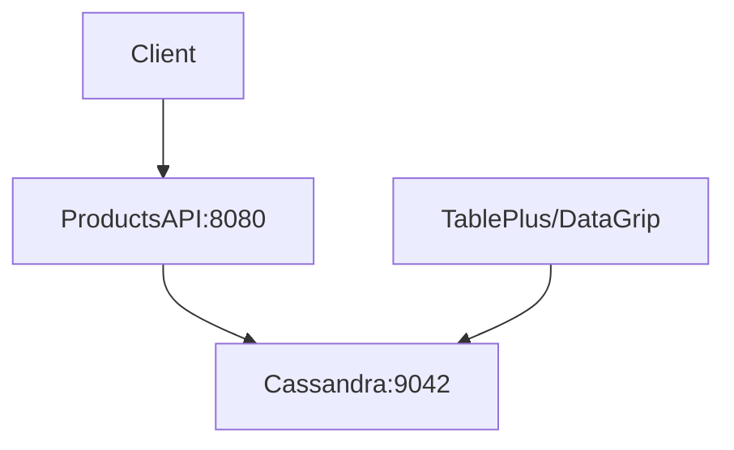

# Cassandra/ScyllaDB Quickstart for Products API

## How to run locally
- From this folder: `cd products-api && docker compose up -d --build`
- Wait ~60 seconds for Cassandra to fully initialize
- Services:
  - REST API: http://localhost:8080
  - Cassandra CQL: localhost:9042

> **Note:** This uses Apache Cassandra 4.1 which is CQL-compatible with ScyllaDB and works reliably on all platforms including Apple Silicon.

## Schema & seed
- Keyspace: `products`
- Table: `products(id uuid PRIMARY KEY, name text, description text, price decimal, stock int, created_at timestamp)`
- Seed data is loaded from `../cql/init.cql` via the `scylla-init` job at startup.
- The init container waits for Cassandra to be ready before running the script.

## GUI Database Tools (Recommended)

For a visual database management experience, use one of these desktop tools:

### TablePlus (Recommended)
1. Download from https://tableplus.com/
2. Create new connection → Choose "Cassandra"
3. Settings:
   - Host: `localhost`
   - Port: `9042`
   - Keyspace: `products`
4. Click "Connect"

### DataGrip (JetBrains)
1. New Data Source → Apache Cassandra
2. Host: `localhost`, Port: `9042`
3. Set keyspace to `products`

### DBeaver (Free)
1. Download from https://dbeaver.io/
2. New Connection → Apache Cassandra
3. Host: `localhost`, Port: `9042`

## cqlsh (Command Line)

```bash
# open cqlsh shell inside container
docker compose exec scylla cqlsh

# list keyspaces
DESCRIBE KEYSPACES;

# use keyspace
USE products;

# inspect table
DESCRIBE TABLE products;

# query data
SELECT * FROM products LIMIT 20;

# insert a row
INSERT INTO products (id, name, description, price, stock, created_at)
VALUES (uuid(), 'Keyboard', 'Mechanical keyboard', 89.99, 50, toTimestamp(now()));
```

## API smoke tests

```bash
# list products
curl -s http://localhost:8080/api/products | jq

# create product
curl -s -X POST http://localhost:8080/api/products \
  -H 'Content-Type: application/json' \
  -d '{"name":"Headphones","description":"ANC","price":149.99,"stock":25}' | jq

# get single product (replace UUID)
curl -s http://localhost:8080/api/products/{id} | jq

# update product
curl -s -X PUT http://localhost:8080/api/products/{id} \
  -H 'Content-Type: application/json' \
  -d '{"name":"Headphones Pro","description":"Premium ANC","price":199.99,"stock":15}' | jq

# delete product
curl -s -X DELETE http://localhost:8080/api/products/{id}
```

## Architecture


