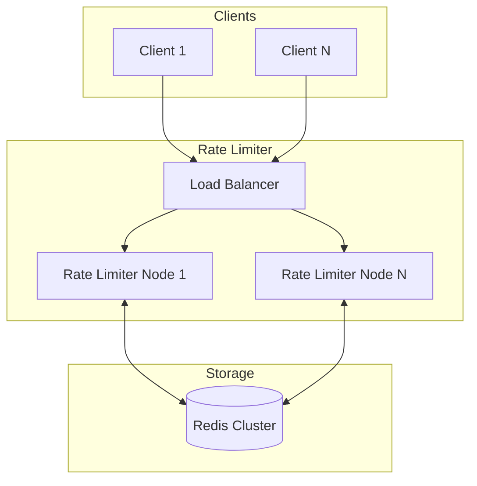

# Distributed Rate Limiter

A high-performance distributed rate limiter designed for API Gateway scenarios, supporting 100K-1M requests per second with composite rate limiting keys, best-effort consistency, and configurable failure behavior.

## Features

- **High Throughput**: Designed for 100K-1M RPS with local caching
- **Multiple Algorithms**: Sliding Window Counter (recommended), Token Bucket, Fixed Window
- **Composite Rate Limiting**: Support for user, endpoint, and user+endpoint combinations
- **Best-Effort Consistency**: Local cache with async sync to Redis
- **Configurable Failure Modes**: Fail-open or fail-closed when Redis is unavailable
- **Circuit Breaker**: Resilience4j integration for graceful degradation
- **Observability**: Prometheus metrics and health checks

## Architecture



## Quick Start

### Prerequisites

- Java 21+
- Maven 3.8+
- Docker & Docker Compose

### Local Development

1. Start Redis:
```bash
docker-compose up -d redis
```

2. Run the application:
```bash
./mvnw spring-boot:run
```

3. Test rate limiting:
```bash
# Check rate limit
curl -X POST http://localhost:8080/ratelimit/check \
  -H "Content-Type: application/json" \
  -d '{"userId": "user123", "endpoint": "/api/orders"}'

# Health check
curl http://localhost:8080/health
```

## Configuration

### Rate Limit Rules

Configure rules in `application.yml`:

```yaml
rate-limiter:
  enabled: true
  algorithm: SLIDING_WINDOW_COUNTER
  failure-mode: FAIL_OPEN

  default-rules:
    - id: per-user-limit
      scope: USER
      max-requests: 1000
      window-size-seconds: 60
      priority: 10
      enabled: true
```

### Failure Modes

| Mode | Behavior |
|------|----------|
| `FAIL_OPEN` | Allow requests when Redis is unavailable |
| `FAIL_CLOSED` | Reject requests when Redis is unavailable |

## API Reference

### Check Rate Limit

```http
POST /ratelimit/check
Content-Type: application/json

{
  "userId": "user123",
  "endpoint": "/api/orders",
  "ipAddress": "192.168.1.1"
}
```

Response:
```json
{
  "allowed": true,
  "currentCount": 45,
  "limit": 100,
  "remainingRequests": 55,
  "windowResetTime": "2024-01-15T10:00:00Z"
}
```

### Manage Rules

```http
GET /ratelimit/rules
POST /ratelimit/rules
PUT /ratelimit/rules/{id}
DELETE /ratelimit/rules/{id}
```

## Metrics

Prometheus metrics available at `/actuator/prometheus`:

| Metric | Type | Description |
|--------|------|-------------|
| `ratelimit_requests_total` | Counter | Total requests processed |
| `ratelimit_requests_allowed` | Counter | Requests allowed |
| `ratelimit_requests_rejected` | Counter | Requests rejected (429) |
| `ratelimit_check_latency_seconds` | Histogram | Rate limit check duration |
| `ratelimit_cache_hits_total` | Counter | Local cache hits |
| `ratelimit_redis_errors_total` | Counter | Redis operation failures |

## Performance

### Benchmarks

| Scenario | RPS | p50 Latency | p99 Latency |
|----------|-----|-------------|-------------|
| Cache Hit | 100,000 | 0.1ms | 0.5ms |
| Cache Miss | 50,000 | 1ms | 5ms |
| Redis Unavailable (Fail Open) | 80,000 | 0.1ms | 0.3ms |

### Tuning

1. **Local Cache Size**: Increase for higher hit rates
2. **Sync Interval**: Lower for better consistency, higher for performance
3. **Redis Connection Pool**: Size based on expected throughput

## Documentation

- [Architecture](docs/architecture.md)
- [Algorithms](docs/algorithms.md)

## License

MIT License
