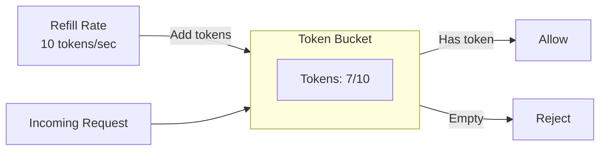
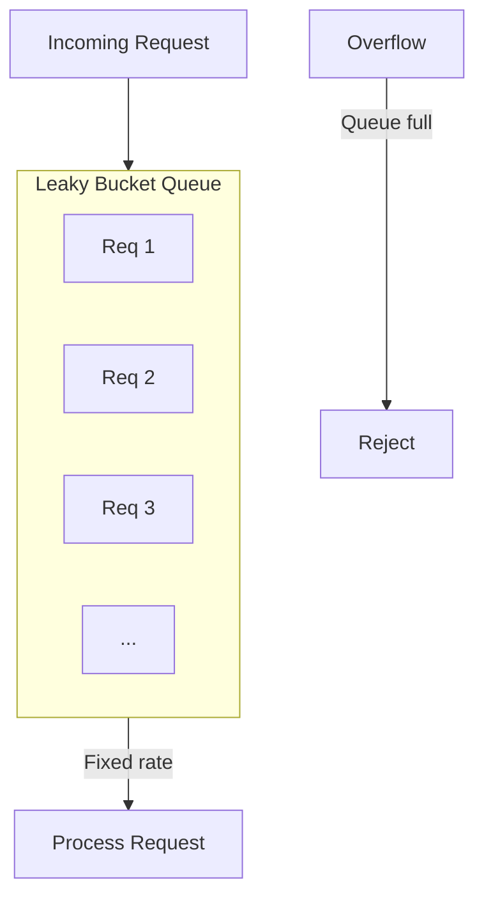
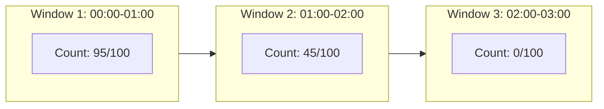
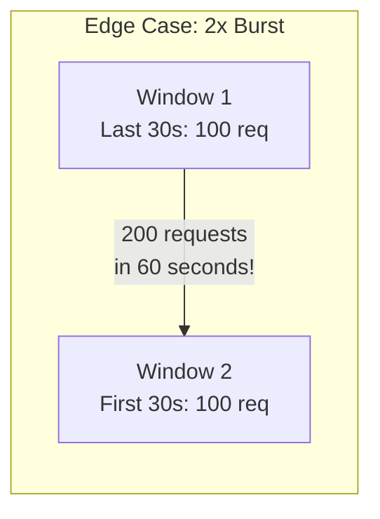
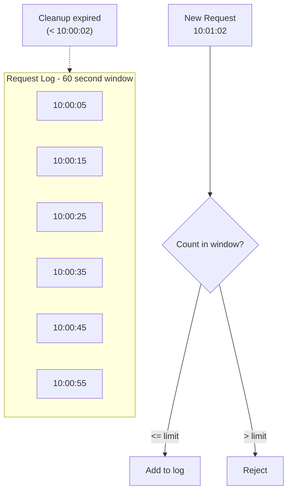
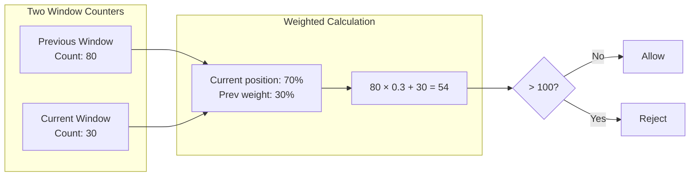
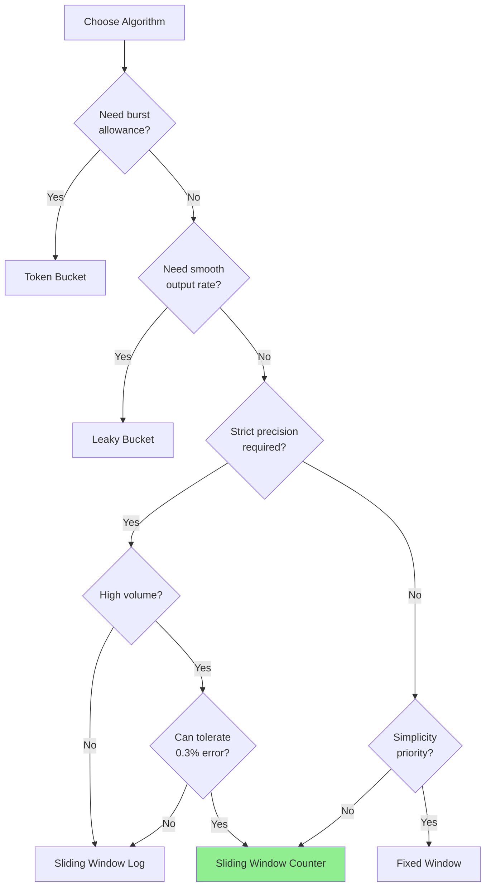

# Rate Limiting Algorithms

This document provides a comprehensive analysis of rate limiting algorithms, comparing their characteristics, use cases, and implementation considerations.

## Algorithm Comparison

| Algorithm | Accuracy | Memory | Latency | Burst Handling | Implementation Complexity |
|-----------|----------|--------|---------|----------------|--------------------------|
| Token Bucket | Medium | O(1) | O(1) | Allows bursts | Low |
| Leaky Bucket | High | O(1) | O(1) | Smooths traffic | Low |
| Fixed Window | Low | O(1) | O(1) | Edge case issues | Very Low |
| Sliding Window Log | Very High | O(n) | O(n) | Precise | Medium |
| **Sliding Window Counter** | **High** | **O(1)** | **O(1)** | **Good balance** | **Low** |

## 1. Token Bucket

### Concept

Tokens are added to a bucket at a fixed rate. Each request consumes one token. Requests are rejected when the bucket is empty.



### Algorithm

```
function allowRequest(bucket):
    refillTokens(bucket)
    if bucket.tokens >= 1:
        bucket.tokens -= 1
        return ALLOW
    return REJECT

function refillTokens(bucket):
    now = currentTime()
    elapsed = now - bucket.lastRefill
    tokensToAdd = elapsed * refillRate
    bucket.tokens = min(bucket.tokens + tokensToAdd, maxTokens)
    bucket.lastRefill = now
```

### Pros
- Simple implementation
- Memory efficient (O(1))
- Allows controlled bursts up to bucket capacity
- Smooth average rate limiting

### Cons
- Burst at the start of each period
- Not precise for short time windows
- Requires careful tuning of bucket size

### Best For
- APIs that allow burst traffic
- Scenarios where average rate matters more than instant precision
- Simple rate limiting needs

---

## 2. Leaky Bucket

### Concept

Requests enter a queue (bucket) and are processed at a fixed rate. The bucket has a maximum size; excess requests overflow and are rejected.



### Algorithm

```
function allowRequest(bucket, request):
    if bucket.queue.size >= maxQueueSize:
        return REJECT
    bucket.queue.add(request)
    return QUEUED

// Separate processor
function processQueue(bucket):
    while true:
        sleep(1 / processingRate)
        if bucket.queue.notEmpty:
            request = bucket.queue.poll()
            process(request)
```

### Pros
- Produces smooth, consistent output rate
- Prevents traffic spikes to backend
- Predictable resource consumption

### Cons
- Adds latency (requests wait in queue)
- May drop requests during sustained high load
- Not suitable for real-time responses

### Best For
- Traffic shaping
- Network packet processing
- Scenarios requiring constant output rate

---

## 3. Fixed Window Counter

### Concept

Count requests in fixed time windows (e.g., 1-minute intervals). Reset counter at window boundaries.



### Algorithm

```
function allowRequest(key, limit, windowSize):
    window = floor(currentTime() / windowSize)
    counterKey = key + ":" + window
    count = increment(counterKey)
    setExpiry(counterKey, windowSize * 2)
    return count <= limit
```

### Edge Case Problem



A user can send 100 requests at the end of window 1 and 100 at the start of window 2, effectively doubling the rate limit within a 60-second sliding period.

### Pros
- Extremely simple implementation
- Very low memory footprint
- Fast O(1) operations

### Cons
- **Edge case burst problem** (up to 2x rate limit at window boundaries)
- Unfair to requests near window boundaries
- Not suitable for strict rate limiting

### Best For
- Approximate rate limiting where simplicity matters
- Non-critical traffic management
- As a baseline for more complex algorithms

---

## 4. Sliding Window Log

### Concept

Store timestamps of all requests in the current window. Count entries to determine if limit is exceeded. Remove expired entries.



### Algorithm

```
function allowRequest(key, limit, windowSize):
    now = currentTime()
    windowStart = now - windowSize

    // Remove expired entries
    removeRange(key, 0, windowStart)

    // Count current entries
    count = countRange(key, windowStart, now)

    if count < limit:
        add(key, now, now)  // Add with score = timestamp
        return ALLOW
    return REJECT
```

### Pros
- **Most accurate** - precise sliding window
- No edge case burst problems
- Fair to all requests

### Cons
- **High memory usage** - O(n) where n = requests in window
- Higher latency for cleanup operations
- Not suitable for high-volume endpoints

### Best For
- Low-volume, high-value operations (e.g., password attempts)
- Strict rate limiting requirements
- Audit trails where you need request history

---

## 5. Sliding Window Counter (Recommended)

### Concept

Hybrid approach combining fixed window counters with weighted averaging to approximate a sliding window. Uses the previous window's count weighted by the overlap percentage.



### Algorithm

```
function allowRequest(key, limit, windowSize):
    now = currentTime()
    currentWindow = floor(now / windowSize)
    previousWindow = currentWindow - 1

    // Get counts
    currentCount = getCounter(key + ":" + currentWindow)
    previousCount = getCounter(key + ":" + previousWindow)

    // Calculate weight (how far into current window)
    windowStart = currentWindow * windowSize
    weight = (windowSize - (now - windowStart)) / windowSize

    // Weighted count approximates sliding window
    weightedCount = floor(previousCount * weight) + currentCount

    if weightedCount < limit:
        increment(key + ":" + currentWindow)
        return ALLOW
    return REJECT
```

### Mathematical Accuracy

The sliding window counter provides approximately **99.7% accuracy** compared to the precise sliding window log, with the following properties:

- Maximum error: ~0.3% of actual count
- Error only occurs at window boundaries
- Error is proportional to traffic variance

### Pros
- **High accuracy** (~99.7%)
- **O(1) memory** - only 2 counters per key
- **O(1) time** - simple arithmetic
- No edge case burst problems (unlike fixed window)
- Atomically implementable with Redis Lua

### Cons
- Slight approximation (not 100% precise)
- Requires atomic read-modify-write for consistency
- Two keys per rate limit (current + previous window)

### Best For
- **API rate limiting** (our use case)
- High-volume scenarios (100K+ RPS)
- Best-effort consistency requirements
- Balance of accuracy and performance

---

## Implementation: Sliding Window Counter with Redis

### Lua Script for Atomicity

```lua
-- KEYS[1] = current window key
-- KEYS[2] = previous window key
-- ARGV[1] = window size in seconds
-- ARGV[2] = current timestamp
-- ARGV[3] = max requests

local curr_key = KEYS[1]
local prev_key = KEYS[2]
local window_size = tonumber(ARGV[1])
local now = tonumber(ARGV[2])
local limit = tonumber(ARGV[3])

-- Get current counts
local curr_count = tonumber(redis.call('GET', curr_key) or '0')
local prev_count = tonumber(redis.call('GET', prev_key) or '0')

-- Calculate weighted count
local window_start = math.floor(now / window_size) * window_size
local weight = (window_size - (now - window_start)) / window_size
local weighted_count = math.floor(prev_count * weight) + curr_count

-- Check limit
if weighted_count >= limit then
    return {0, weighted_count, limit, window_start + window_size}
end

-- Increment and set expiry
local new_count = redis.call('INCR', curr_key)
redis.call('EXPIRE', curr_key, window_size * 2)

return {1, weighted_count + 1, limit, window_start + window_size}
```

### Response Format

```
[allowed, current_count, limit, reset_time]

Examples:
[1, 54, 100, 1704067260]  -- Allowed, 54 of 100 used, resets at timestamp
[0, 100, 100, 1704067260] -- Rejected, limit reached
```

---

## Algorithm Selection Guide



---

## Summary

For our distributed rate limiter designed for API Gateway scenarios with:
- 100K-1M RPS throughput
- Best-effort consistency
- Combination rate limiting (user + endpoint)

**The Sliding Window Counter is the optimal choice** because it provides:
1. High accuracy (99.7%) without edge case bursts
2. Constant memory and time complexity
3. Atomic implementation with Redis Lua scripts
4. Excellent performance characteristics for distributed systems
