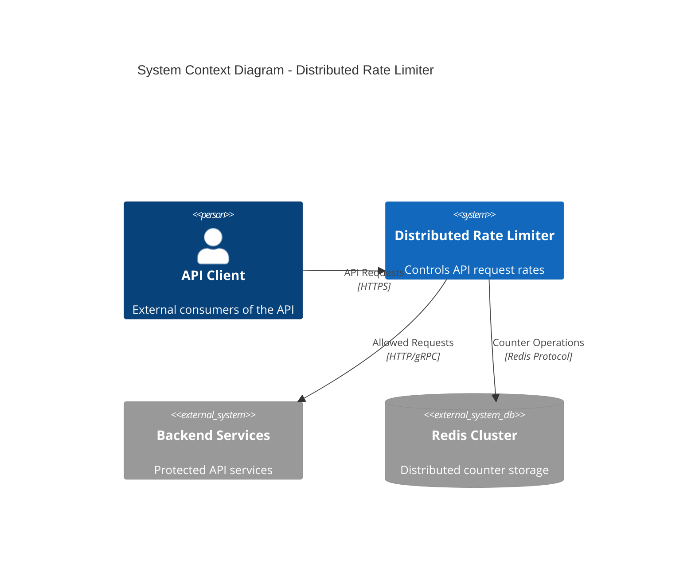
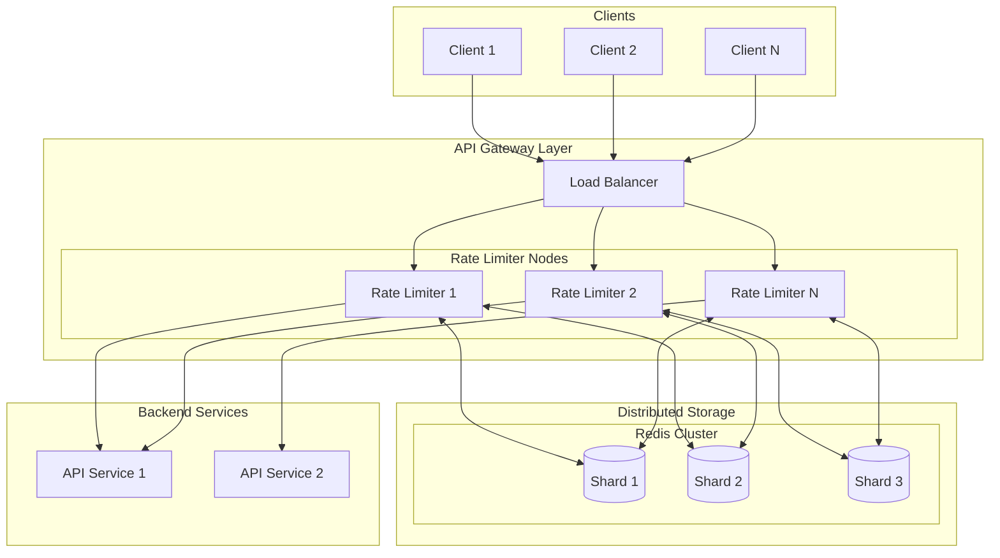
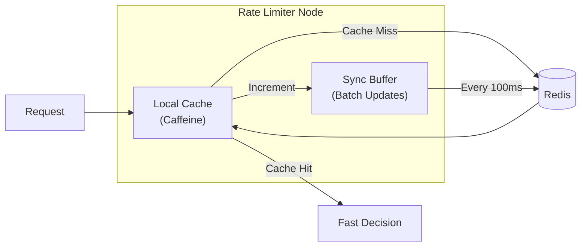
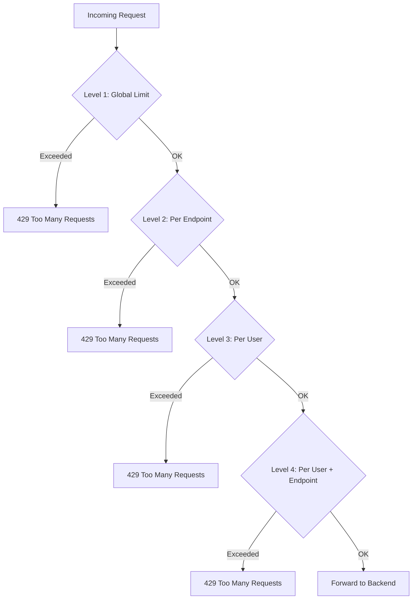
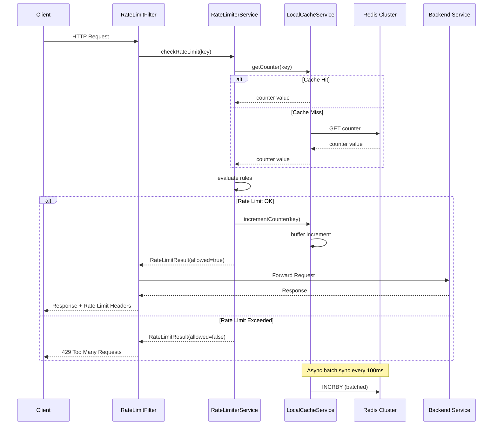
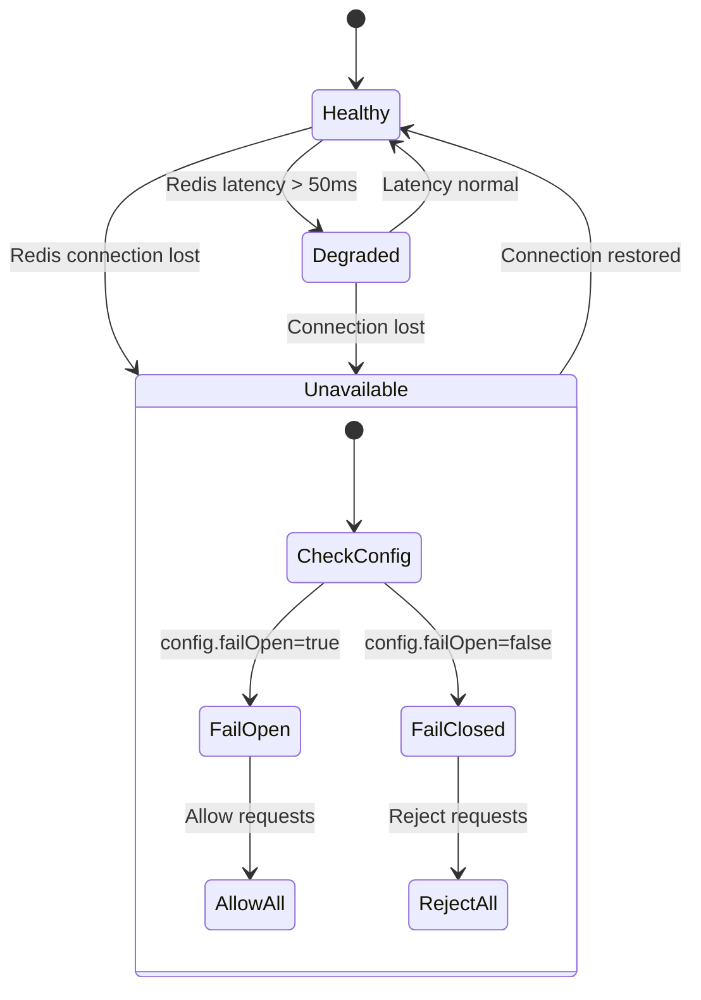
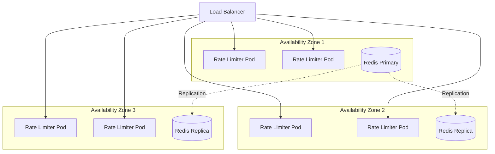

# Distributed Rate Limiter - Architecture

## Overview

This document describes the architecture of a high-performance distributed rate limiter designed for API Gateway scenarios. The system supports 100K-1M requests per second with composite rate limiting keys (user + endpoint), best-effort consistency, and configurable failure behavior.

## System Context



## High-Level Architecture



## Core Components

### 1. Rate Limiter Node

Stateless application instances that process incoming requests and enforce rate limits.

**Responsibilities:**
- Extract rate limit key from request (user ID, API key, IP, endpoint)
- Check rate limit against configured rules
- Return appropriate response headers (X-RateLimit-*)
- Forward allowed requests to backend services

**Key Classes:**
- `RateLimitFilter` - Spring filter that intercepts all requests
- `RateLimiterService` - Orchestrates multi-level rate limiting
- `RuleMatcherService` - Matches requests to applicable rules

### 2. Local Cache Layer (Caffeine)

In-memory cache that reduces Redis round-trips for high-throughput scenarios.



**Configuration:**
- Max entries: 100,000
- TTL: Window size (typically 60 seconds)
- Sync interval: 100ms

### 3. Redis Cluster

Distributed storage for rate limit counters with automatic sharding.

**Key Features:**
- Horizontal scalability via sharding
- High availability with replicas
- Atomic operations via Lua scripts
- Automatic key distribution by consistent hashing

**Key Pattern:**
```
rl:{user_id}:{endpoint}:{window_start}
```

### 4. Rate Limit Rules Engine

Dynamic rule configuration supporting multiple scopes and priorities.



## Request Flow



## Failure Handling

### State Machine



### Circuit Breaker Configuration

| Parameter | Value | Description |
|-----------|-------|-------------|
| Failure threshold | 50% | Open circuit after 50% failures |
| Wait duration | 30s | Time before attempting recovery |
| Permitted calls | 10 | Test calls in half-open state |
| Sliding window | 100 calls | Sample size for failure rate |

## Scalability

### Horizontal Scaling

- **Rate Limiter Nodes**: Stateless, scale based on CPU/memory
- **Redis Cluster**: Add shards for more capacity
- **Local Cache**: Reduces Redis load proportionally

### Capacity Planning

| Component | Metric | Target |
|-----------|--------|--------|
| Rate Limiter Node | RPS | 50,000 per instance |
| Redis Shard | Operations/sec | 100,000 per shard |
| Local Cache | Hit Rate | > 90% |
| Network | Latency to Redis | < 5ms p99 |

### Scaling Formula

```
Required Nodes = Peak RPS / 50,000
Required Redis Shards = (Peak RPS × Miss Rate) / 100,000
```

## Deployment Architecture



## Monitoring

### Key Metrics

| Metric | Type | Description |
|--------|------|-------------|
| `ratelimit.requests.total` | Counter | Total requests processed |
| `ratelimit.requests.allowed` | Counter | Requests that passed rate limit |
| `ratelimit.requests.rejected` | Counter | Requests rejected (429) |
| `ratelimit.check.latency` | Histogram | Rate limit check duration |
| `ratelimit.cache.hits` | Counter | Local cache hits |
| `ratelimit.cache.misses` | Counter | Local cache misses |
| `ratelimit.redis.errors` | Counter | Redis operation failures |

### Alerting Rules

1. **High Rejection Rate**: > 10% requests rejected in 5 minutes
2. **Redis Latency**: p99 > 50ms for 2 minutes
3. **Circuit Open**: Any circuit breaker opens
4. **Cache Hit Rate Low**: < 80% hit rate for 5 minutes

## Security Considerations

1. **Key Extraction**: Validate user identity before rate limiting
2. **IP Spoofing**: Use trusted proxy headers only
3. **Redis Access**: Network isolation, authentication enabled
4. **DoS Protection**: Global rate limits protect the rate limiter itself
