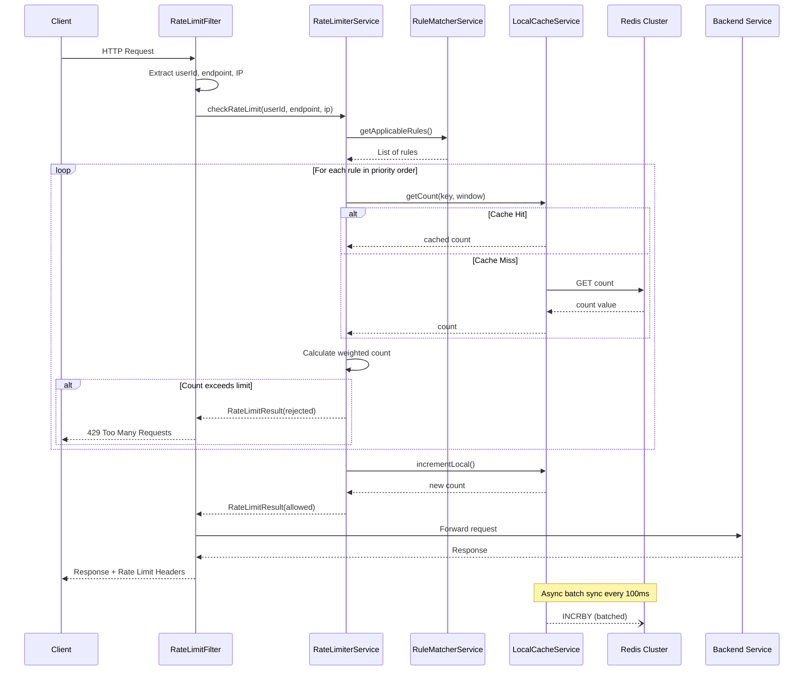
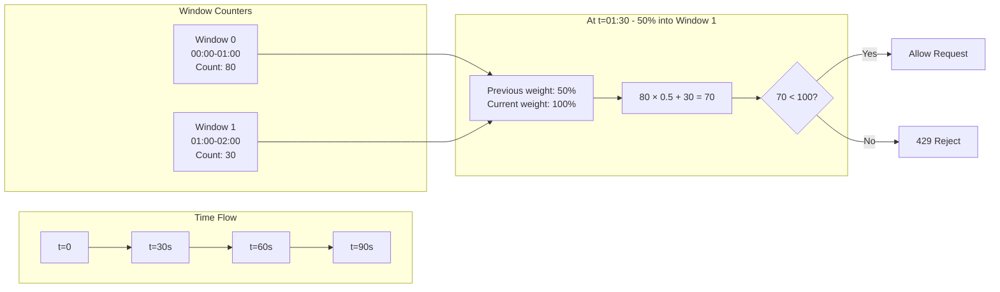
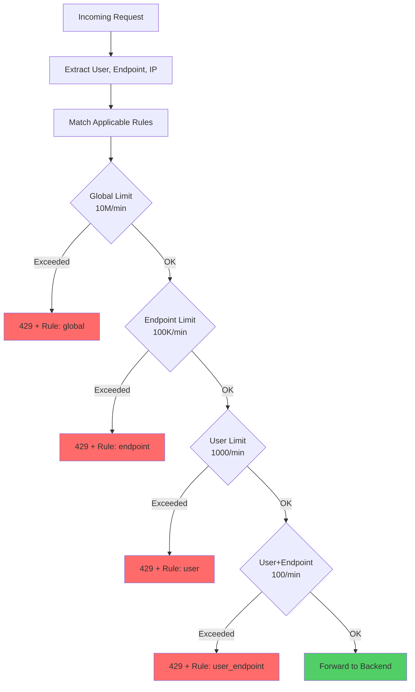
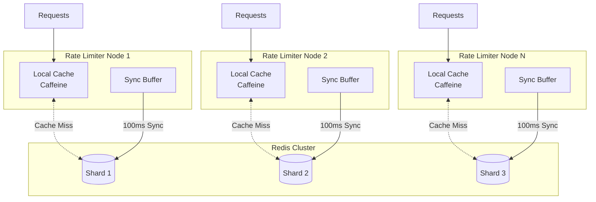
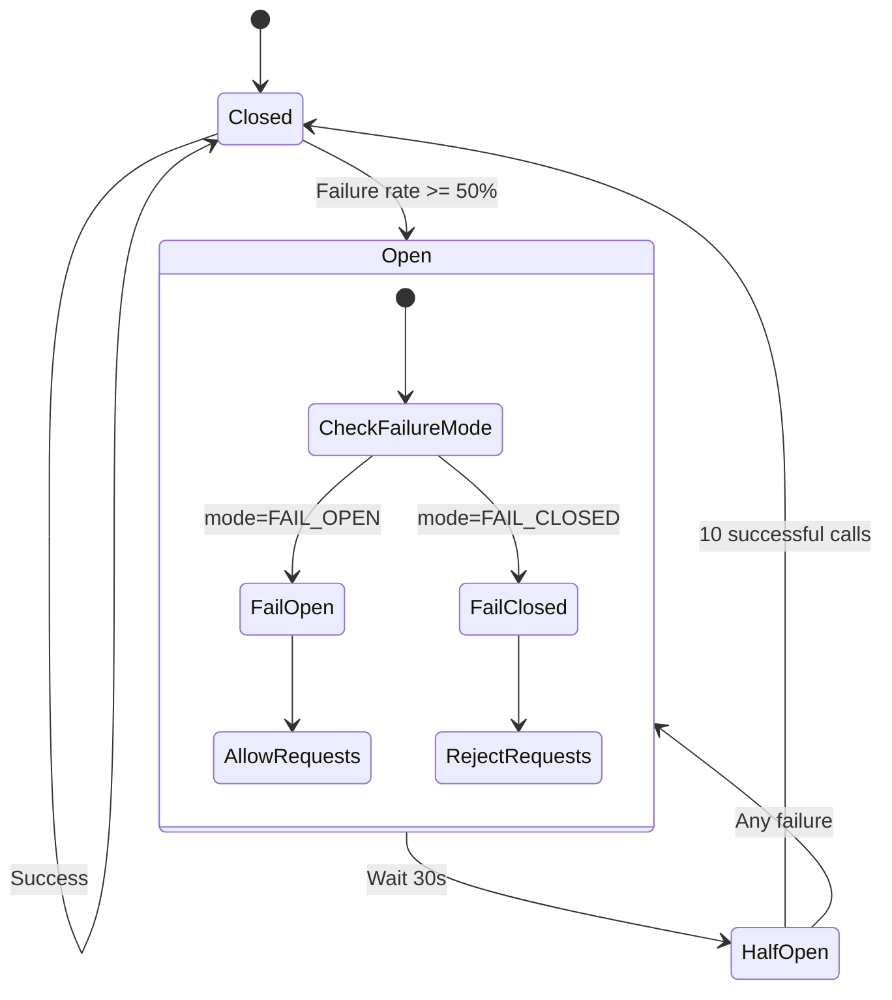
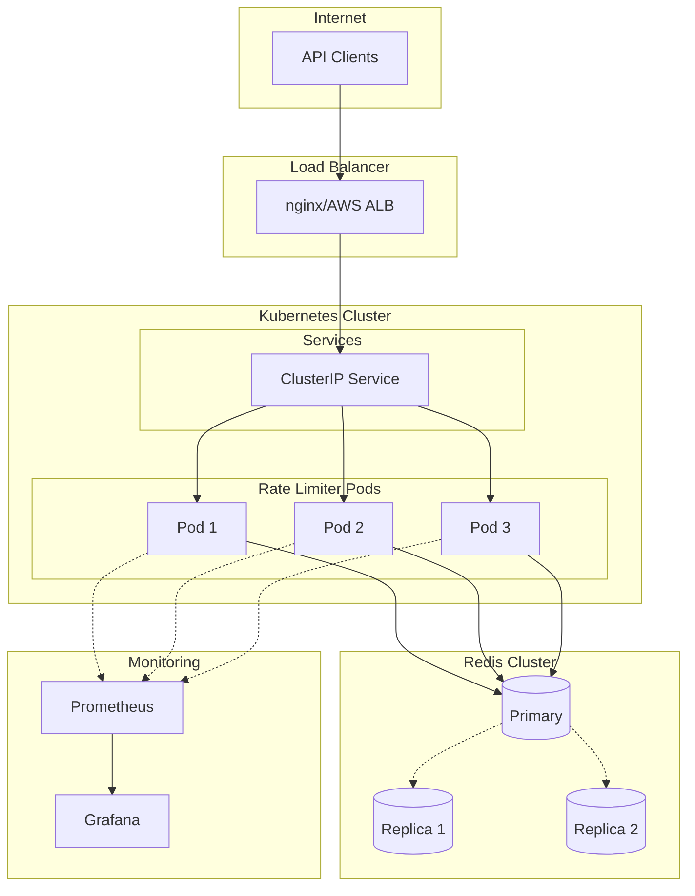
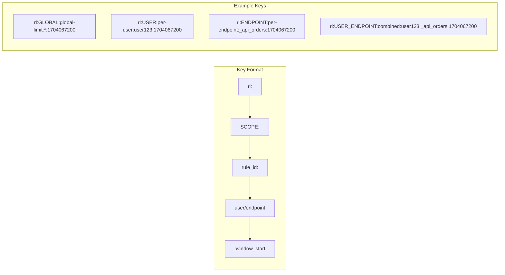
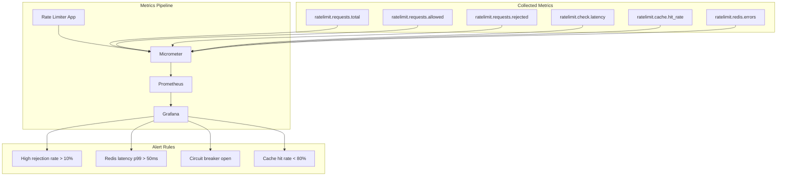
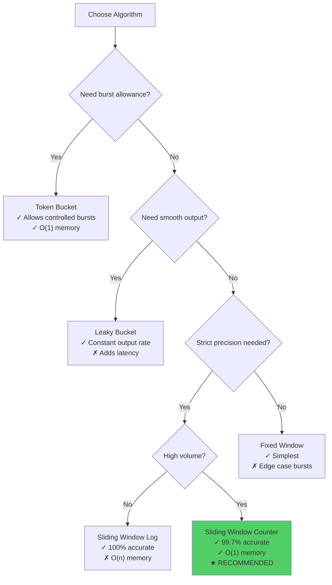

# Distributed Rate Limiter - Diagrams

This document contains all Mermaid diagrams for the distributed rate limiter system.

## Request Flow Sequence

## Sliding Window Counter Algorithm

## Multi-Level Rate Limiting

## Local Cache + Redis Architecture

## Circuit Breaker State Machine

## Deployment Architecture

## Rate Limit Key Structure

## Metrics Dashboard Overview

## Algorithm Comparison

