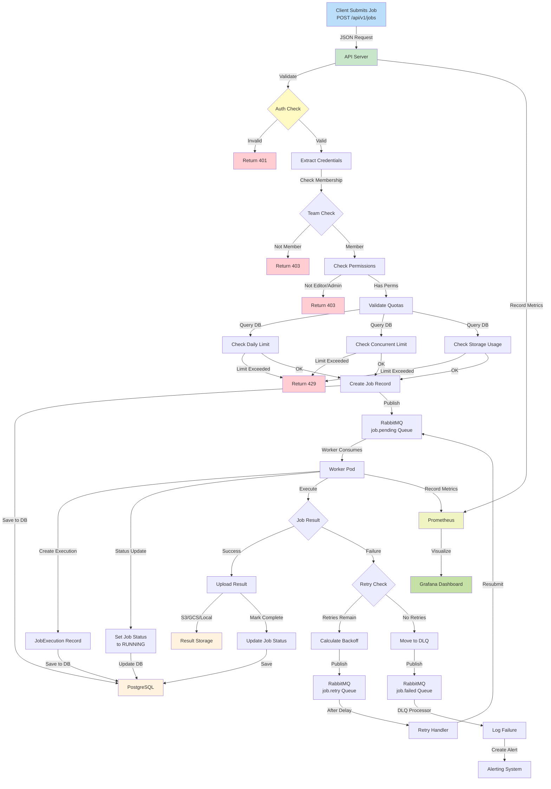
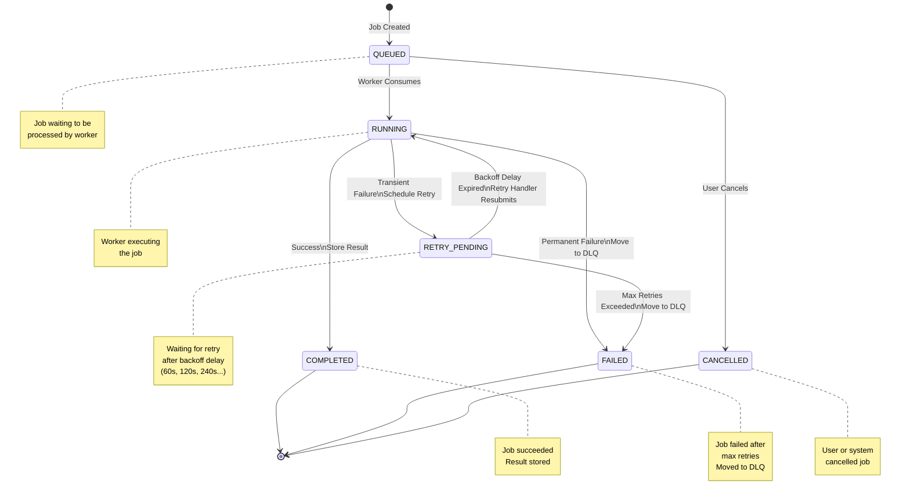
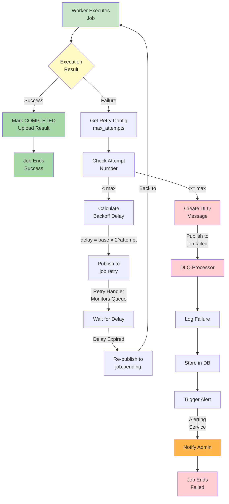
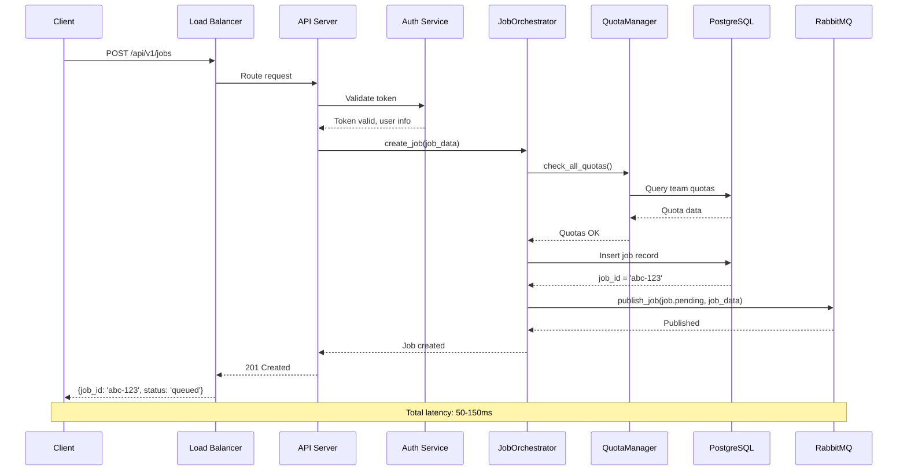
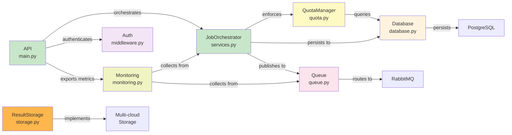
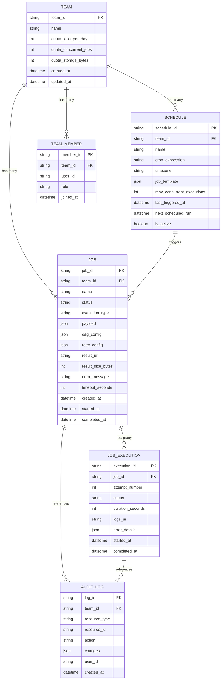

# System Design Architecture Diagram

Complete architecture documentation for the Scheduler Platform with all system components, data flows, and interactions.

---

## 1. High-Level System Architecture

```mermaid
graph TB
    subgraph "Client Layer"
        CLI["CLI/SDK Clients"]
        WEB["Web Applications"]
        SYS["Internal Systems"]
    end

    subgraph "API Layer"
        LB["Load Balancer"]
        API1["API Pod 1"]
        API2["API Pod 2"]
        API3["API Pod 3"]
    end

    subgraph "Service Layer"
        ORK["Job Orchestrator"]
        SCH["Cron Scheduler"]
        QM["Quota Manager"]
        MN["Monitoring Service"]
    end

    subgraph "Data Layer"
        PG["PostgreSQL"]
        RD["Redis Cache"]
    end

    subgraph "Message Queue"
        RMQ["RabbitMQ"]
        PEND["job.pending"]
        RET["job.retry"]
        SCHED["job.scheduled"]
        COMP["job.completed"]
        FAIL["job.failed"]
    end

    subgraph "Execution Layer"
        W1["Worker 1"]
        W2["Worker 2"]
        WN["Worker N"]
        SCHED_SVC["Scheduler Service"]
    end

    subgraph "Error Recovery"
        RH["Retry Handler"]
        DLQ["DLQ Processor"]
    end

    subgraph "Storage & Monitoring"
        S3["Result Storage<br/>S3/GCS/Local"]
        PROM["Prometheus"]
        GRAF["Grafana"]
    end

    CLI --> LB
    WEB --> LB
    SYS --> LB

    LB --> API1
    LB --> API2
    LB --> API3

    API1 --> ORK
    API2 --> ORK
    API3 --> ORK

    ORK --> PG
    ORK --> RD
    ORK --> RMQ

    API1 --> QM
    API2 --> QM
    API3 --> QM

    QM --> PG

    RMQ --> PEND
    RMQ --> RET
    RMQ --> SCHED
    RMQ --> COMP
    RMQ --> FAIL

    PEND --> W1
    PEND --> W2
    PEND --> WN

    W1 --> S3
    W2 --> S3
    WN --> S3

    W1 --> COMP
    W2 --> COMP
    WN --> COMP

    W1 --> FAIL
    W2 --> FAIL
    WN --> FAIL

    RET --> RH
    RH --> PEND

    FAIL --> DLQ

    W1 --> PROM
    W2 --> PROM
    WN --> PROM
    API1 --> PROM

    SCHED --> SCHED_SVC
    SCHED_SVC --> SCHED

    PROM --> GRAF

    MN --> PROM

    style "Client Layer" fill:#e1f5ff
    style "API Layer" fill:#f3e5f5
    style "Service Layer" fill:#e8f5e9
    style "Data Layer" fill:#fff3e0
    style "Message Queue" fill:#fce4ec
    style "Execution Layer" fill:#f1f8e9
    style "Error Recovery" fill:#ffebee
    style "Storage & Monitoring" fill:#ede7f6
```

---

## 2. Component Architecture

```mermaid
graph LR
    subgraph "External Clients"
        CLIENT["Client Applications"]
    end

    subgraph "API Gateway & Auth"
        GW["API Gateway<br/>Port 8000"]
        AUTH["JWT Auth<br/>RBAC"]
        CORS["CORS<br/>Middleware"]
    end

    subgraph "REST Endpoints"
        EP1["POST /jobs<br/>Create Job"]
        EP2["GET /jobs<br/>List Jobs"]
        EP3["GET /jobs/:id<br/>Get Job"]
        EP4["POST /jobs/:id/cancel<br/>Cancel Job"]
        EP5["POST /schedules<br/>Create Schedule"]
        EP6["GET /schedules<br/>List Schedules"]
        EP7["GET /metrics<br/>Prometheus Metrics"]
    end

    subgraph "Business Logic"
        ORK["JobOrchestrator<br/>State Management"]
        QM["QuotaManager<br/>Resource Control"]
        RS["RetryScheduler<br/>Backoff Logic"]
        MN["Monitoring<br/>Metrics Collection"]
    end

    subgraph "Data Persistence"
        PG["PostgreSQL<br/>Primary Database"]
        CACHE["Redis<br/>Session/Cache"]
    end

    subgraph "Message Queue System"
        RMQ["RabbitMQ<br/>Message Broker"]
        QUEUES["5 Named Queues"]
    end

    subgraph "Execution & Recovery"
        WORKERS["Worker Pool<br/>5-20 Pods"]
        RH["Retry Handler<br/>Error Recovery"]
        DLQ["DLQ Processor<br/>Failure Tracking"]
    end

    subgraph "Storage & Output"
        STOR["Result Storage<br/>Multi-cloud"]
        LOGS["Execution Logs<br/>Storage"]
    end

    CLIENT --> GW
    GW --> AUTH
    GW --> CORS
    AUTH --> EP1
    AUTH --> EP2
    AUTH --> EP3
    AUTH --> EP4
    AUTH --> EP5
    AUTH --> EP6
    AUTH --> EP7

    EP1 --> QM
    EP1 --> ORK
    EP2 --> ORK
    EP3 --> ORK
    EP4 --> ORK

    QM --> PG
    ORK --> PG
    ORK --> CACHE
    ORK --> RMQ

    RS --> RMQ
    MN --> PROM["Prometheus"]

    RMQ --> QUEUES
    QUEUES --> WORKERS
    QUEUES --> RH
    QUEUES --> DLQ

    WORKERS --> STOR
    WORKERS --> LOGS
    WORKERS --> RMQ

    RH --> WORKERS
    DLQ --> PG

    style "External Clients" fill:#e3f2fd
    style "API Gateway & Auth" fill:#f3e5f5
    style "REST Endpoints" fill:#ede7f6
    style "Business Logic" fill:#e8f5e9
    style "Data Persistence" fill:#fff3e0
    style "Message Queue System" fill:#fce4ec
    style "Execution & Recovery" fill:#ffebee
    style "Storage & Output" fill:#e0f2f1
```

---

## 3. Data Flow Diagram



---

## 4. Job Lifecycle State Machine



---

## 5. Message Queue Architecture

```mermaid
graph TB
    subgraph "Queue Topics"
        Q1["job.pending<br/>New/Retry Jobs"]
        Q2["job.retry<br/>Backoff Pending"]
        Q3["job.scheduled<br/>Cron Triggered"]
        Q4["job.completed<br/>Success Events"]
        Q5["job.failed<br/>DLQ Queue"]
    end

    subgraph "Producers"
        API["API Server<br/>Job Submission"]
        SCH["Scheduler<br/>Cron Triggers"]
        RH["Retry Handler<br/>Backoff Completed"]
        W["Workers<br/>Execution Results"]
    end

    subgraph "Consumers"
        WORKERS["Worker Pool<br/>5-20 Pods"]
        RH_C["Retry Handler<br/>Singleton"]
        DLQ["DLQ Processor<br/>Singleton"]
        MON["Monitoring<br/>Event Tracker"]
    end

    API -->|publish_job| Q1
    SCH -->|publish_job| Q3
    RH -->|re-publish| Q1

    W -->|publish_event| Q4
    W -->|publish_event| Q5

    Q1 --> WORKERS
    Q3 --> WORKERS
    Q2 --> RH_C
    Q5 --> DLQ
    Q4 --> MON
    Q5 --> MON

    WORKERS -->|Transient Fail| Q2
    WORKERS -->|Permanent Fail| Q5
    WORKERS -->|Success| Q4

    RH_C -->|After Delay| Q1
    DLQ -->|Log Failure| PG["PostgreSQL<br/>Audit Log"]

    style "Queue Topics" fill:#fce4ec
    style "Producers" fill:#c8e6c9
    style "Consumers" fill:#bbdefb
    style PG fill:#fff3e0
```

---

## 6. Team Quota Enforcement Flow

```mermaid
graph LR
    A["Job Creation<br/>Request"] --> B["Quota Manager<br/>check_all_quotas"]

    B --> C{"Daily Limit<br/>Check"}
    C -->|Count jobs<br/>created today| D["Query DB<br/>Created since 00:00"]
    D -->|jobs_today| E{< limit?}
    E -->|NO| F["Return 429<br/>Daily Quota Exceeded"]
    E -->|YES| G["Continue"]

    G --> H{"Concurrent Limit<br/>Check"}
    H -->|Count running<br/>jobs| I["Query DB<br/>Status IN<br/>RUNNING/QUEUED"]
    I -->|concurrent_jobs| J{< limit?}
    J -->|NO| F
    J -->|YES| K["Continue"]

    K --> L{"Storage Limit<br/>Check"}
    L -->|Sum storage<br/>bytes| M["Query DB<br/>Sum result_size_bytes"]
    M -->|total_bytes| N{< limit?}
    N -->|NO| F
    N -->|YES| O["Allow Job"]

    O --> P["Create Job<br/>Insert DB"]
    P --> Q["Return 201<br/>Job Created"]

    B -.->|Metrics| R["quota_usage_percent<br/>Prometheus"]

    style A fill:#c8e6c9
    style B fill:#fff9c4
    style F fill:#ffcdd2
    style O fill:#a5d6a7
    style Q fill:#a5d6a7
    style R fill:#f0f4c3
```



---

## 7. Retry and DLQ Processing



---

## 8. Multi-Cloud Result Storage

```mermaid
graph TB
    subgraph "Storage Abstraction"
        RS["ResultStorage ABC<br/>upload/download/delete"]
    end

    subgraph "Implementations"
        LOCAL["LocalStorage<br/>Filesystem"]
        S3["S3Storage<br/>AWS S3"]
        GCS["GCSStorage<br/>Google Cloud"]
    end

    subgraph "Configuration"
        ENV["RESULT_STORAGE_TYPE<br/>Environment Variable"]
    end

    subgraph "Result Path Examples"
        LP["local:///tmp/jobs/job-123.json"]
        SP["s3://bucket/results/job-123.json"]
        GP["gs://bucket/results/job-123.json"]
    end

    subgraph "Worker Flow"
        W["Worker Executes<br/>Job"]
        STOR["get_storage()"]
        UPLOAD["storage.upload<br/>job_id, content"]
        STORE["Store result_url<br/>in Job record"]
    end

    ENV --> RS
    RS --> LOCAL
    RS --> S3
    RS --> GCS

    LOCAL --> LP
    S3 --> SP
    GCS --> GP

    W --> STOR
    STOR --> UPLOAD
    UPLOAD --> STORE

    UPLOAD -->|upload()| LOCAL
    UPLOAD -->|upload()| S3
    UPLOAD -->|upload()| GCS

    style RS fill:#c8e6c9
    style LOCAL fill:#fff3e0
    style S3 fill:#ffb74d
    style GCS fill:#ffb74d
    style W fill:#bbdefb
```

---

## 9. Monitoring & Observability

```mermaid
graph TB
    subgraph "Metric Sources"
        API["API Server<br/>request_count<br/>response_time"]
        W["Workers<br/>job_duration<br/>success_rate"]
        Q["Queues<br/>queue_depth<br/>message_count"]
    end

    subgraph "Metric Types"
        COUNTER["Counters<br/>job_submissions<br/>job_completions"]
        HISTOGRAM["Histograms<br/>job_duration"]
        GAUGE["Gauges<br/>queue_depth<br/>quota_usage"]
    end

    subgraph "Collection"
        PROM["Prometheus<br/>Scrape /metrics<br/>Every 15s"]
    end

    subgraph "Storage"
        TSDB["Time Series<br/>Database<br/>30 days retention"]
    end

    subgraph "Visualization"
        GRAF["Grafana<br/>Dashboards"]
        ALERTS["Alert Manager<br/>Notifications"]
    end

    subgraph "Alert Conditions"
        A1["Failure Rate > 5%"]
        A2["Queue Depth > 10k"]
        A3["Quota Usage > 80%"]
        A4["API p99 > 500ms"]
    end

    API --> COUNTER
    API --> HISTOGRAM
    W --> COUNTER
    W --> HISTOGRAM
    W --> GAUGE
    Q --> GAUGE

    COUNTER --> PROM
    HISTOGRAM --> PROM
    GAUGE --> PROM

    PROM --> TSDB

    TSDB --> GRAF
    TSDB --> ALERTS

    ALERTS --> A1
    ALERTS --> A2
    ALERTS --> A3
    ALERTS --> A4

    A1 -->|Triggered| NOTIF["Send Notification<br/>Slack/Email/PagerDuty"]
    A2 -->|Triggered| NOTIF
    A3 -->|Triggered| NOTIF
    A4 -->|Triggered| NOTIF

    style "Metric Sources" fill:#c8e6c9
    style "Metric Types" fill:#fff9c4
    style "Collection" fill:#bbdefb
    style "Storage" fill:#fff3e0
    style "Visualization" fill:#c5e1a5
    style "Alert Conditions" fill:#ffcdd2
```

---

## 10. Kubernetes Deployment Architecture

```mermaid
graph TB
    subgraph "Kubernetes Cluster"
        subgraph "scheduler namespace"
            subgraph "API Layer"
                API1["api-pod-1"]
                API2["api-pod-2"]
                API3["api-pod-3"]
                HPA_API["HPA 3-10 pods"]
            end

            subgraph "Worker Layer"
                W1["worker-pod-1"]
                W2["worker-pod-2"]
                W3["worker-pod-3"]
                WN["worker-pod-N"]
                HPA_W["HPA 5-20 pods"]
            end

            subgraph "Supporting Services"
                CRON["cron-scheduler<br/>1 replica"]
                RH["error-handler-retry<br/>1 replica"]
                DLQ["error-handler-dlq<br/>1 replica"]
            end

            subgraph "Storage"
                CONFIG["ConfigMap<br/>scheduler-config"]
                SECRET["Secret<br/>scheduler-secrets"]
            end

            subgraph "HA Features"
                PDB1["PodDisruptionBudget<br/>API: min 2"]
                PDB2["PodDisruptionBudget<br/>Worker: min 3"]
                AFFINITY["Pod Anti-Affinity<br/>Spread across nodes"]
            end
        end
    end

    subgraph "External Services"
        DB["PostgreSQL<br/>External"]
        RMQ["RabbitMQ<br/>External"]
        REDIS["Redis<br/>External"]
        S3["S3 Bucket<br/>AWS"]
    end

    subgraph "Ingress"
        INGRESS["Ingress Controller<br/>api.scheduler.local"]
    end

    INGRESS -->|Route| API1
    INGRESS -->|Route| API2
    INGRESS -->|Route| API3

    HPA_API -->|Auto-scale| API1
    HPA_API -->|Auto-scale| API2
    HPA_API -->|Auto-scale| API3

    HPA_W -->|Auto-scale| W1
    HPA_W -->|Auto-scale| W2
    HPA_W -->|Auto-scale| W3
    HPA_W -->|Auto-scale| WN

    API1 -->|Connect| DB
    W1 -->|Connect| DB
    CRON -->|Connect| DB

    API1 -->|Publish| RMQ
    W1 -->|Consume| RMQ
    RH -->|Consume| RMQ
    DLQ -->|Consume| RMQ

    API1 -->|Cache| REDIS
    W1 -->|Upload| S3

    CONFIG -->|Mount| API1
    CONFIG -->|Mount| W1
    SECRET -->|Mount| API1
    SECRET -->|Mount| W1

    PDB1 -.->|Protect| API1
    PDB2 -.->|Protect| W1
    AFFINITY -.->|Spread| API1
    AFFINITY -.->|Spread| W1

    style "Kubernetes Cluster" fill:#e1f5ff,stroke:#01579b
    style "API Layer" fill:#c8e6c9
    style "Worker Layer" fill:#c8e6c9
    style "Supporting Services" fill:#fff9c4
    style "External Services" fill:#f0f4c3
    style "HA Features" fill:#b2dfdb
```

---

## 11. API Request-Response Flow



---

## 12. System Component Dependencies



---

## 13. Horizontal Scaling Architecture

```mermaid
graph TB
    subgraph "Scaling Mechanism"
        HPA["HorizontalPodAutoscaler"]
        METRICS["Metrics Server"]
        CPU["CPU Utilization"]
        MEM["Memory Utilization"]
    end

    subgraph "API Layer Scaling"
        API_CURRENT["Current: 3 pods<br/>Min: 3, Max: 10"]
        API_METRIC["Target: 75% CPU"]
        API_RULE["If avg CPU > 75%<br/>Add 1 pod"]
    end

    subgraph "Worker Layer Scaling"
        W_CURRENT["Current: 5 pods<br/>Min: 5, Max: 20"]
        W_METRIC["Target: 70% CPU<br/>80% Memory"]
        W_RULE["If metrics high<br/>Add N pods"]
    end

    HPA -->|monitors| METRICS
    METRICS -->|collects| CPU
    METRICS -->|collects| MEM

    CPU -->|feeds to| API_METRIC
    MEM -->|feeds to| W_METRIC

    API_METRIC -->|triggers| API_RULE
    W_METRIC -->|triggers| W_RULE

    API_RULE -->|scale to| API_CURRENT
    W_RULE -->|scale to| W_CURRENT

    subgraph "Example Scenario"
        Q1["Queue depth: 5000"]
        L1["Worker CPU: 90%"]
        Q1 -->|detected by| L1
        L1 -->|triggers scale| Q2["Add 5 workers<br/>5 → 10 pods"]
        Q2 -->|after 30s| Q3["New workers start<br/>consuming queue"]
        Q3 -->|queue depth| Q4["Drops to 2000"]
        Q4 -->|worker CPU| Q5["Drops to 60%"]
    end

    style "Scaling Mechanism" fill:#c8e6c9
    style "Example Scenario" fill:#fff9c4
```

---

## 14. Data Model Relationships



---

## 15. Complete System Integration Diagram

```mermaid
graph TB
    subgraph "External Systems"
        USERS["Users &<br/>Applications"]
        MONITORING["External Monitoring<br/>Datadog/New Relic"]
        ALERTS["Alert Systems<br/>Slack/PagerDuty"]
    end

    subgraph "Scheduler Platform"
        subgraph "Ingress & Load Balancing"
            IGW["Ingress<br/>Port 443/8000"]
        end

        subgraph "API Services"
            API["API Server<br/>FastAPI<br/>3 pods"]
        end

        subgraph "Core Services"
            ORK["Job Orchestrator"]
            SCH["Cron Scheduler"]
        end

        subgraph "Resource Management"
            QM["Quota Manager"]
            MN["Monitoring Service"]
        end

        subgraph "Execution & Recovery"
            WORKERS["Worker Pool<br/>5-20 pods"]
            RH["Retry Handler"]
            DLQ["DLQ Processor"]
        end

        subgraph "Infrastructure"
            RMQ["RabbitMQ"]
            DB["PostgreSQL"]
            REDIS["Redis"]
        end

        subgraph "Storage"
            LOCAL["Local FS"]
            S3["AWS S3"]
            GCS["GCS"]
        end

        subgraph "Observability"
            PROM["Prometheus"]
            GRAF["Grafana"]
        end
    end

    USERS -->|REST API| IGW
    IGW -->|Routes| API

    API -->|Manages| ORK
    API -->|Checks| QM

    ORK -->|Orchestrates| WORKERS
    ORK -->|Triggers| SCH
    ORK -->|Publishes| RMQ
    ORK -->|Persists| DB

    WORKERS -->|Processes| RMQ
    WORKERS -->|Stores Results| LOCAL
    WORKERS -->|Stores Results| S3
    WORKERS -->|Stores Results| GCS

    RH -->|Retries| RMQ
    DLQ -->|Processes| DB

    MN -->|Scrapes| PROM
    PROM -->|Visualizes| GRAF
    PROM -->|Exports| MONITORING

    MN -->|Sends| ALERTS
    QM -->|Reports to| PROM

    API -->|Caches| REDIS
    WORKERS -->|Uses| REDIS

    style "External Systems" fill:#e3f2fd
    style "Ingress & Load Balancing" fill:#f3e5f5
    style "API Services" fill:#c8e6c9
    style "Core Services" fill:#c8e6c9
    style "Resource Management" fill:#fff9c4
    style "Execution & Recovery" fill:#ffebee
    style "Infrastructure" fill:#fff3e0
    style "Storage" fill:#ffb74d
    style "Observability" fill:#f0f4c3
```

---

## Architecture Decision Records

### 1. **Asynchronous Job Processing**
- **Decision**: Use message queue (RabbitMQ) for job distribution
- **Rationale**: Decouples API from execution, enables horizontal scaling
- **Trade-off**: Slight latency increase, but prevents API overload

### 2. **PostgreSQL as Primary Store**
- **Decision**: Relational database with schema validation
- **Rationale**: ACID compliance, strong consistency, audit requirements
- **Alternative**: Could use DynamoDB for serverless, but lose transactional benefits

### 3. **Redis for Caching**
- **Decision**: In-memory cache for session and query results
- **Rationale**: Reduces DB load, improves response times
- **TTL Strategy**: Session: 24h, Cache: configurable per data type

### 4. **Result Storage Abstraction**
- **Decision**: Pluggable interface supporting Local/S3/GCS
- **Rationale**: Vendor independence, cost optimization, data residency
- **Future**: Consider adding Azure Blob Storage

### 5. **Exponential Backoff for Retries**
- **Decision**: `delay = base × 2^attempt` with jitter
- **Rationale**: Prevents thundering herd, increases success rate over time
- **Configuration**: base=60s, multiplier=2.0, max_attempts=3

### 6. **Team-Based Multi-Tenancy**
- **Decision**: Teams are fundamental isolation unit
- **Rationale**: Quotas, RBAC, audit trails per team
- **Limitation**: No cross-team job dependencies (Phase 3)

### 7. **Kubernetes for Orchestration**
- **Decision**: Deploy on K8s with StatefulSets/Deployments
- **Rationale**: Auto-scaling, self-healing, standard operations
- **Local Dev**: Docker Compose for development/testing

---

## Summary Table

| Layer | Technology | Purpose |
|-------|-----------|---------|
| **API** | FastAPI 0.104.1 | REST endpoints, request validation |
| **Auth** | JWT + PyJWT | Bearer token authentication |
| **Cache** | Redis 7 | Session & query result caching |
| **Database** | PostgreSQL 16 | Persistent data store with ACID |
| **Queue** | RabbitMQ 3.12 | Async job distribution |
| **Execution** | Python Workers | Job processing (mock or real) |
| **Scheduling** | croniter 2.0.1 | Cron expression evaluation |
| **Storage** | S3/GCS/Local | Result storage (pluggable) |
| **Monitoring** | Prometheus 2.x | Metrics collection |
| **Visualization** | Grafana | Dashboard & alerting |
| **Orchestration** | Kubernetes | Production deployment |
| **Local Dev** | Docker Compose | Development environment |

---
