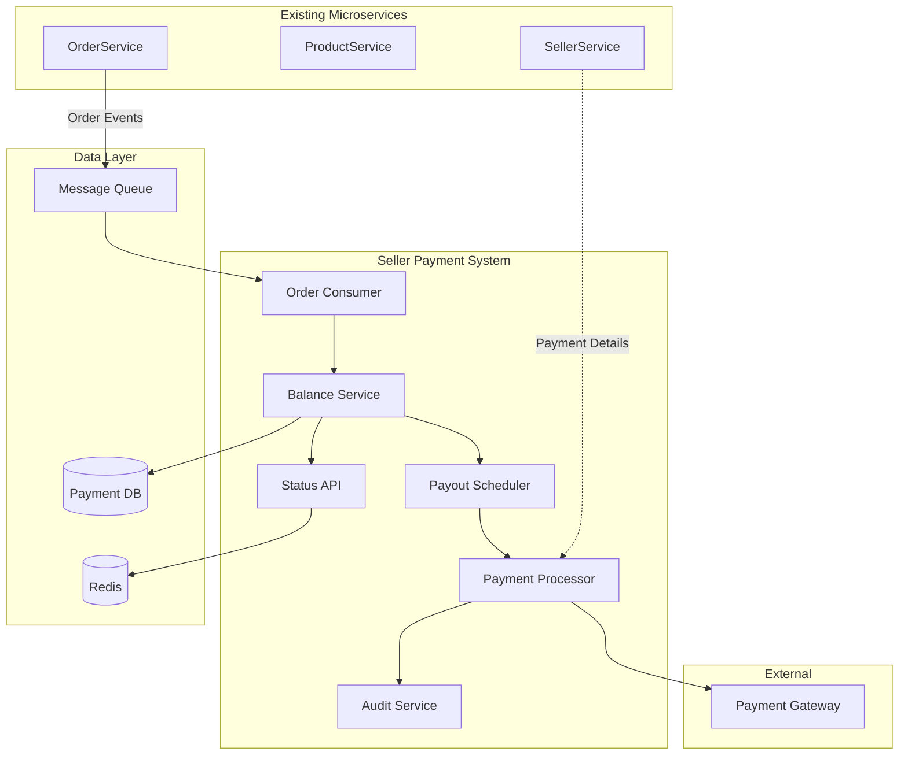
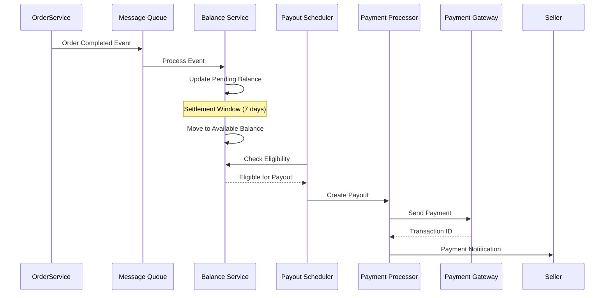
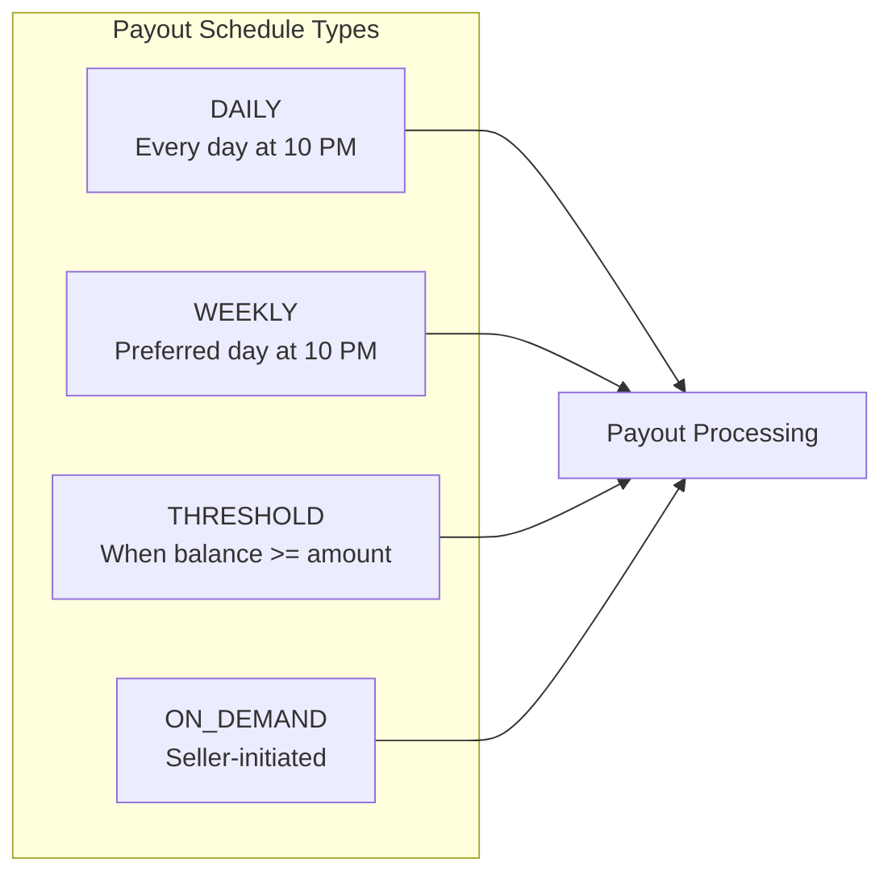
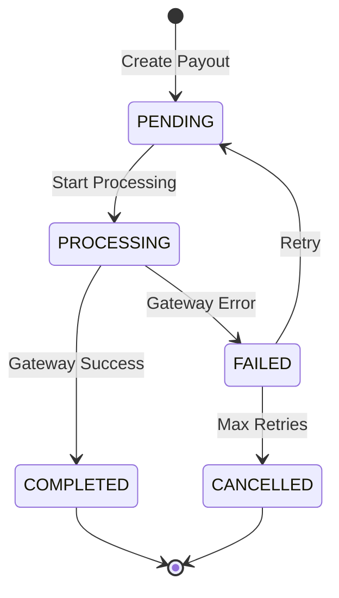
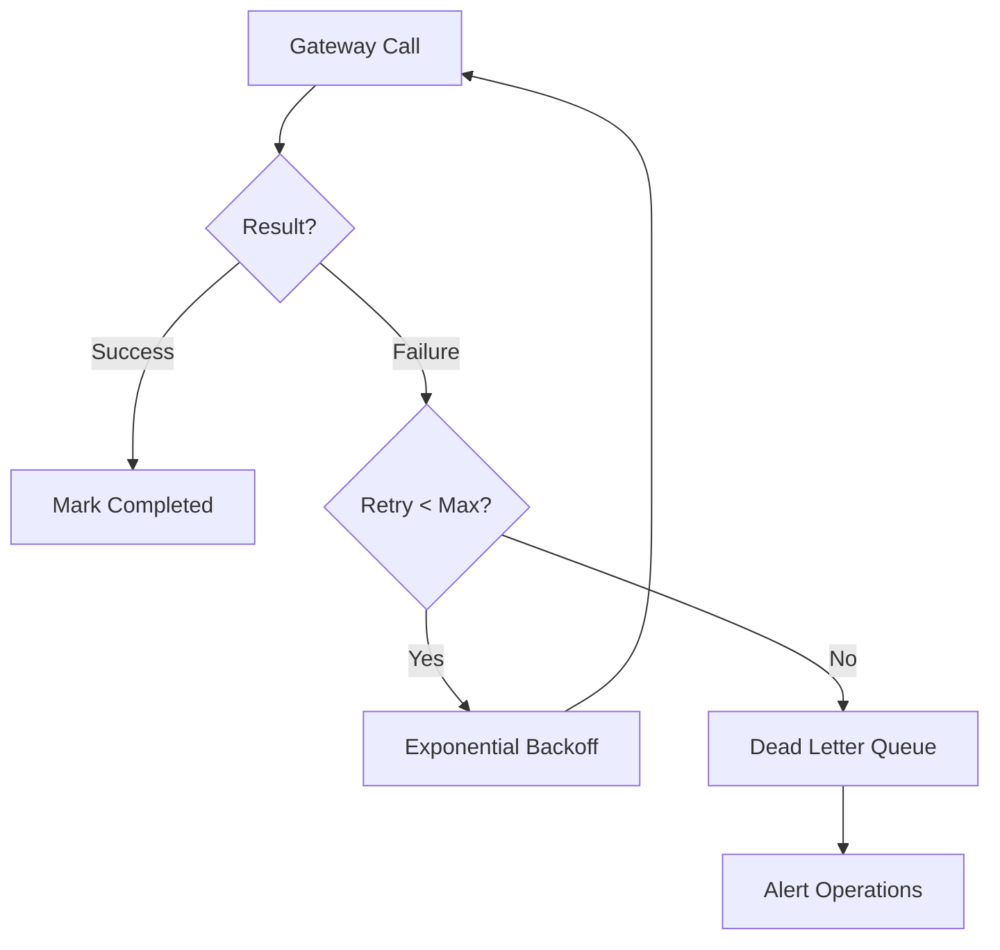

# Seller-Side Payment System

A robust payment system for paying out sellers on an e-commerce platform with configurable payout schedules, minimized gateway fees, comprehensive audit trails, and resilient failure handling.

## Problem Statement

Design a seller-side payment system for a large e-commerce company with three existing microservices:

- **SellerService**: Manages seller information and payment preferences (check/wire)
- **ProductService**: Manages product catalog with seller pricing
- **OrderService**: Manages orders and buyer transactions

The buyer-side payment system already exists. This system focuses exclusively on paying out sellers.

## Key Requirements

| Requirement                                | Solution                                           |
| ------------------------------------------ | -------------------------------------------------- |
| Payment gateway takes ~1 minute to process | Async processing with status tracking              |
| Fixed fee per transfer                     | Aggregate payments per seller per cycle            |
| Audit log of all payments                  | Immutable audit log with full state history        |
| Seller-preferred payment method            | Support CHECK and WIRE based on seller preference  |
| Status visibility for sellers              | REST API for real-time status and issue resolution |
| Minimize gateway fees                      | Batch payments per seller per payout cycle         |
| No dropped payments                        | Persistent queue + retry mechanism                 |
| No duplicate payments                      | Idempotency keys + state machine                   |

## Architecture Overview



### System Flow



## Payout Schedule Options

Sellers can configure their preferred payout schedule:

| Schedule      | Description                           | Use Case                              |
| ------------- | ------------------------------------- | ------------------------------------- |
| **DAILY**     | Payout every day at EOD               | High-volume sellers needing cash flow |
| **WEEKLY**    | Payout on preferred day of week       | Standard sellers                      |
| **THRESHOLD** | Payout when balance exceeds threshold | Low-volume sellers                    |
| **ON_DEMAND** | Seller-initiated payout               | Sellers wanting full control          |



## Documentation Structure

```
seller-side-payment-system/
├── README.md                           # This file
├── design/
│   ├── system-architecture.md          # Component details and interactions
│   ├── data-models.md                  # Database schema design
│   ├── api-contracts.md                # REST API specifications
│   ├── payment-flow.md                 # Payment processing workflows
│   └── failure-handling.md             # Failure scenarios and recovery
├── diagrams/
│   └── architecture-diagrams.md        # Visual system diagrams
└── operations/
    └── runbook.md                      # Operational procedures
```

## Quick Links

- [System Architecture](design/system-architecture.md) - Component breakdown and responsibilities
- [Data Models](design/data-models.md) - Database schema and relationships
- [API Contracts](design/api-contracts.md) - REST API specifications
- [Payment Flow](design/payment-flow.md) - End-to-end payment processing
- [Failure Handling](design/failure-handling.md) - Error recovery strategies
- [Architecture Diagrams](diagrams/architecture-diagrams.md) - Visual representations
- [Operations Runbook](operations/runbook.md) - Operational procedures

## Key Design Principles

### 1. Fee Optimization

Aggregate all order earnings for a seller into a single payout per cycle, reducing gateway fees from O(orders) to O(sellers × cycles).

### 2. Exactly-Once Semantics

- Idempotency keys prevent duplicate payments
- State machine ensures each payment progresses correctly
- Reconciliation catches edge cases

### 3. Resilience

- Circuit breaker for gateway failures
- Exponential backoff retry
- Dead letter queue for manual intervention
- Automatic rollover of failed payments

### 4. Auditability

- Immutable audit log of all state changes
- Full traceability from order to payout
- Compliance-ready reporting

### Payout State Machine



### Failure Handling Flow



## Third Party Gateway Interface

```java
interface ThirdPartyPaymentGateway {
    function sendCheck(checkDetails, amount) returns transactionId or error;
    function sendWire(wireDetails, amount) returns transactionId or error;
}
```

## Technology Considerations

| Component     | Recommended Technology | Rationale                        |
| ------------- | ---------------------- | -------------------------------- |
| Message Queue | Kafka / RabbitMQ       | Durability, ordering, replay     |
| Payment DB    | PostgreSQL             | ACID, JSON support, reliability  |
| Audit Log     | Append-only table / S3 | Immutability, compliance         |
| Scheduler     | Temporal / Airflow     | Reliability, visibility, retries |
| Cache         | Redis                  | Balance lookups, status queries  |

## Contact

For questions about this design, refer to the detailed documentation in the `/design` folder.
