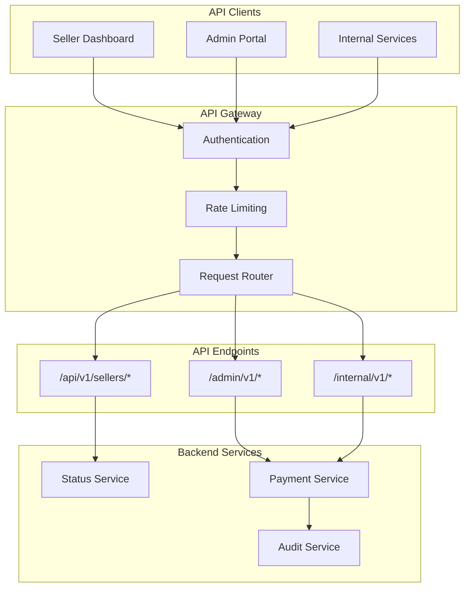
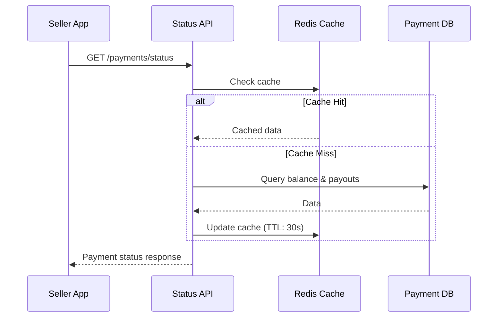
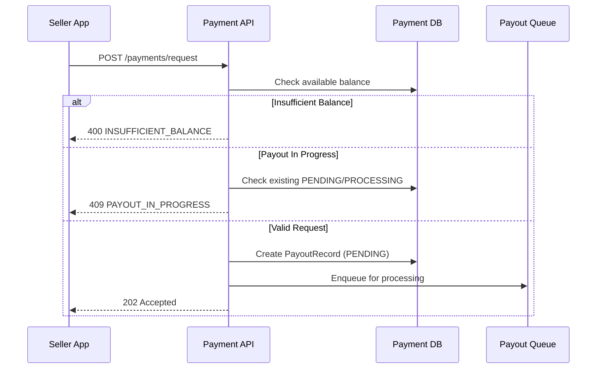
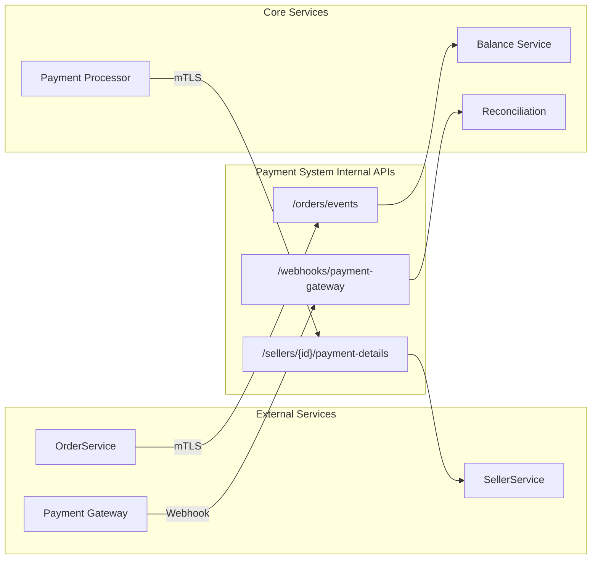
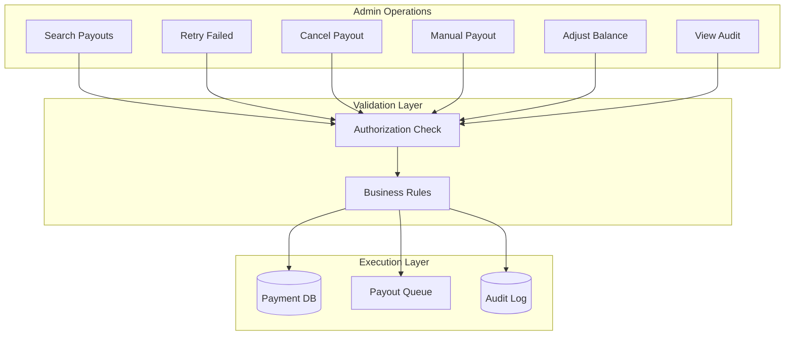

# API Contracts

This document defines the REST API specifications for the Seller-Side Payment System, including endpoints for sellers, internal services, and administrative operations.

## API Overview



| API Group    | Base Path         | Purpose                          |
| ------------ | ----------------- | -------------------------------- |
| Seller API   | `/api/v1/sellers` | Seller-facing endpoints          |
| Internal API | `/internal/v1`    | Service-to-service communication |
| Admin API    | `/admin/v1`       | Administrative operations        |

## Authentication & Authorization

### Seller API

- **Authentication**: OAuth 2.0 Bearer Token
- **Authorization**: Sellers can only access their own data
- **Rate Limiting**: 100 requests/minute per seller

### Internal API

- **Authentication**: mTLS (mutual TLS)
- **Authorization**: Service identity validation
- **Rate Limiting**: None (trusted services)

### Admin API

- **Authentication**: OAuth 2.0 with admin scopes
- **Authorization**: Role-based (SUPPORT, FINANCE, ADMIN)
- **Rate Limiting**: 1000 requests/minute per user

---

## Seller API Endpoints

### API Flow Overview



### 1. Get Payment Status

Get current balance and recent payout information for a seller.

```
GET /api/v1/sellers/{sellerId}/payments/status
```

**Path Parameters**:
| Parameter | Type | Required | Description |
|-----------|------|----------|-------------|
| sellerId | string | Yes | Seller identifier |

**Response**: `200 OK`

```json
{
  "sellerId": "S001",
  "currentBalance": {
    "available": 1250.0,
    "pending": 340.0,
    "held": 0.0,
    "currency": "USD"
  },
  "payoutPreference": {
    "schedule": "WEEKLY",
    "preferredDay": "FRIDAY",
    "paymentMethod": "WIRE",
    "thresholdAmount": null
  },
  "nextPayoutDate": "2026-01-10T22:00:00Z",
  "estimatedNextPayout": 1590.0,
  "recentPayouts": [
    {
      "payoutId": "PO-2026-01-03-S001",
      "amount": 2100.0,
      "status": "COMPLETED",
      "paymentMethod": "WIRE",
      "completedAt": "2026-01-03T22:45:00Z"
    },
    {
      "payoutId": "PO-2025-12-27-S001",
      "amount": 1850.0,
      "status": "COMPLETED",
      "paymentMethod": "WIRE",
      "completedAt": "2025-12-27T22:30:00Z"
    }
  ],
  "pendingIssues": [],
  "lastUpdated": "2026-01-06T14:30:00Z"
}
```

**Error Responses**:
| Status | Code | Description |
|--------|------|-------------|
| 401 | UNAUTHORIZED | Invalid or missing token |
| 403 | FORBIDDEN | Seller ID doesn't match token |
| 404 | SELLER_NOT_FOUND | Seller does not exist |

---

### 2. Get Payout Details

Get detailed information about a specific payout.

```
GET /api/v1/sellers/{sellerId}/payments/{payoutId}
```

**Path Parameters**:
| Parameter | Type | Required | Description |
|-----------|------|----------|-------------|
| sellerId | string | Yes | Seller identifier |
| payoutId | string | Yes | Payout identifier |

**Response**: `200 OK`

```json
{
  "payoutId": "PO-2026-01-03-S001",
  "sellerId": "S001",
  "amount": 2100.0,
  "currency": "USD",
  "paymentMethod": "WIRE",
  "status": "COMPLETED",
  "gatewayTransactionId": "GW-TXN-789456",
  "periodStart": "2025-12-27T22:00:00Z",
  "periodEnd": "2026-01-03T22:00:00Z",
  "orderCount": 47,
  "orders": [
    {
      "orderId": "ORD-001",
      "amount": 45.0,
      "orderDate": "2025-12-28T10:30:00Z"
    },
    {
      "orderId": "ORD-002",
      "amount": 89.0,
      "orderDate": "2025-12-29T14:15:00Z"
    }
  ],
  "timeline": [
    {
      "event": "CREATED",
      "timestamp": "2026-01-03T22:00:00Z",
      "description": "Payout initiated"
    },
    {
      "event": "PROCESSING",
      "timestamp": "2026-01-03T22:00:05Z",
      "description": "Sent to payment gateway"
    },
    {
      "event": "COMPLETED",
      "timestamp": "2026-01-03T22:45:00Z",
      "description": "Payment confirmed"
    }
  ],
  "createdAt": "2026-01-03T22:00:00Z",
  "completedAt": "2026-01-03T22:45:00Z"
}
```

**Failed Payout Response** (status = FAILED):

```json
{
  "payoutId": "PO-2026-01-06-S002",
  "sellerId": "S002",
  "amount": 500.0,
  "currency": "USD",
  "paymentMethod": "WIRE",
  "status": "FAILED",
  "errorCode": "INVALID_ACCOUNT",
  "errorMessage": "The bank account number provided is invalid",
  "requiredAction": {
    "type": "UPDATE_PAYMENT_DETAILS",
    "message": "Please update your bank account details in Settings",
    "actionUrl": "/settings/payment-details"
  },
  "retryCount": 2,
  "nextRetryAt": null,
  "timeline": [
    {
      "event": "CREATED",
      "timestamp": "2026-01-06T22:00:00Z"
    },
    {
      "event": "PROCESSING",
      "timestamp": "2026-01-06T22:00:05Z"
    },
    {
      "event": "FAILED",
      "timestamp": "2026-01-06T22:01:05Z",
      "description": "Invalid bank account"
    },
    {
      "event": "RETRY",
      "timestamp": "2026-01-06T22:05:00Z"
    },
    {
      "event": "FAILED",
      "timestamp": "2026-01-06T22:06:00Z",
      "description": "Invalid bank account (retry 1)"
    }
  ]
}
```

---

### 3. Get Payout History

Get paginated payout history for a seller.

```
GET /api/v1/sellers/{sellerId}/payments/history
```

**Query Parameters**:
| Parameter | Type | Required | Default | Description |
|-----------|------|----------|---------|-------------|
| page | integer | No | 0 | Page number (0-indexed) |
| size | integer | No | 20 | Page size (max 100) |
| status | string | No | all | Filter by status |
| from | ISO8601 | No | - | Start date filter |
| to | ISO8601 | No | - | End date filter |

**Response**: `200 OK`

```json
{
  "sellerId": "S001",
  "payouts": [
    {
      "payoutId": "PO-2026-01-03-S001",
      "amount": 2100.0,
      "status": "COMPLETED",
      "paymentMethod": "WIRE",
      "createdAt": "2026-01-03T22:00:00Z",
      "completedAt": "2026-01-03T22:45:00Z"
    }
  ],
  "pagination": {
    "page": 0,
    "size": 20,
    "totalElements": 52,
    "totalPages": 3,
    "hasNext": true,
    "hasPrevious": false
  },
  "summary": {
    "totalPaid": 45600.0,
    "totalPayouts": 52,
    "averagePayoutAmount": 876.92
  }
}
```

---

### 4. Request On-Demand Payout

Request an immediate payout (for sellers with ON_DEMAND schedule or any seller with available balance).



```
POST /api/v1/sellers/{sellerId}/payments/request
```

**Request Body**:

```json
{
  "amount": 500.0,
  "note": "Urgent cash flow need"
}
```

| Field  | Type    | Required | Description                                          |
| ------ | ------- | -------- | ---------------------------------------------------- |
| amount | decimal | No       | Specific amount (defaults to full available balance) |
| note   | string  | No       | Optional note for records                            |

**Response**: `202 Accepted`

```json
{
  "payoutId": "PO-2026-01-06-S001-OD",
  "sellerId": "S001",
  "amount": 500.0,
  "status": "PENDING",
  "estimatedCompletionTime": "2026-01-06T15:30:00Z",
  "message": "Your payout request has been submitted and will be processed shortly."
}
```

**Error Responses**:
| Status | Code | Description |
|--------|------|-------------|
| 400 | INSUFFICIENT_BALANCE | Requested amount exceeds available balance |
| 400 | MINIMUM_NOT_MET | Amount below minimum payout threshold ($10) |
| 409 | PAYOUT_IN_PROGRESS | Another payout is currently being processed |
| 429 | TOO_MANY_REQUESTS | Rate limit exceeded |

---

### 5. Get Payout Preferences

Get current payout preferences for a seller.

```
GET /api/v1/sellers/{sellerId}/payments/preferences
```

**Response**: `200 OK`

```json
{
  "sellerId": "S001",
  "schedule": "WEEKLY",
  "preferredDay": "FRIDAY",
  "thresholdAmount": null,
  "paymentMethod": "WIRE",
  "minimumPayout": 10.0,
  "paymentDetails": {
    "type": "WIRE",
    "bankName": "Chase Bank",
    "accountNumberLast4": "1234",
    "routingNumber": "021000021",
    "accountHolderName": "Acme Corp LLC"
  },
  "updatedAt": "2025-11-15T10:00:00Z"
}
```

---

### 6. Update Payout Preferences

Update payout schedule and preferences.

```
PUT /api/v1/sellers/{sellerId}/payments/preferences
```

**Request Body**:

```json
{
  "schedule": "THRESHOLD",
  "thresholdAmount": 500.0,
  "paymentMethod": "WIRE"
}
```

| Field           | Type    | Required | Description                         |
| --------------- | ------- | -------- | ----------------------------------- |
| schedule        | enum    | No       | DAILY, WEEKLY, THRESHOLD, ON_DEMAND |
| preferredDay    | string  | No       | Day for WEEKLY (MONDAY-SUNDAY)      |
| thresholdAmount | decimal | No       | Amount for THRESHOLD schedule       |
| paymentMethod   | enum    | No       | CHECK or WIRE                       |

**Response**: `200 OK`

```json
{
  "sellerId": "S001",
  "schedule": "THRESHOLD",
  "thresholdAmount": 500.0,
  "paymentMethod": "WIRE",
  "message": "Preferences updated successfully",
  "effectiveFrom": "2026-01-07T00:00:00Z"
}
```

---

### 7. Get Order Earnings

Get earnings breakdown by order.

```
GET /api/v1/sellers/{sellerId}/earnings
```

**Query Parameters**:
| Parameter | Type | Required | Default | Description |
|-----------|------|----------|---------|-------------|
| page | integer | No | 0 | Page number |
| size | integer | No | 20 | Page size |
| status | string | No | all | PENDING, SETTLED, PAID, CANCELLED |
| from | ISO8601 | No | - | Start date |
| to | ISO8601 | No | - | End date |

**Response**: `200 OK`

```json
{
  "sellerId": "S001",
  "earnings": [
    {
      "orderId": "ORD-123",
      "amount": 45.0,
      "status": "SETTLED",
      "orderDate": "2026-01-05T10:30:00Z",
      "settlementDate": "2026-01-12T00:00:00Z",
      "payoutId": null
    },
    {
      "orderId": "ORD-122",
      "amount": 89.0,
      "status": "PAID",
      "orderDate": "2025-12-28T14:15:00Z",
      "payoutId": "PO-2026-01-03-S001"
    }
  ],
  "pagination": {
    "page": 0,
    "size": 20,
    "totalElements": 150,
    "totalPages": 8
  },
  "totals": {
    "pending": 340.0,
    "settled": 1250.0,
    "paid": 45600.0,
    "cancelled": 150.0
  }
}
```

---

## Internal API Endpoints

### Internal Service Communication Flow



### 1. Process Order Event

Called by Order Service when an order is completed or cancelled.

```
POST /internal/v1/orders/events
```

**Request Body**:

```json
{
  "eventId": "EVT-20260106-001",
  "eventType": "ORDER_COMPLETED",
  "orderId": "ORD-123",
  "buyerId": "B456",
  "orderTimestamp": "2026-01-06T10:30:00Z",
  "products": [
    {
      "productId": "P789",
      "sellerId": "S001",
      "sellerPrice": 45.0,
      "quantity": 2
    },
    {
      "productId": "P790",
      "sellerId": "S002",
      "sellerPrice": 30.0,
      "quantity": 1
    }
  ]
}
```

**Response**: `202 Accepted`

```json
{
  "eventId": "EVT-20260106-001",
  "status": "ACCEPTED",
  "processedSellers": ["S001", "S002"]
}
```

**Idempotency**: Duplicate eventId submissions return `200 OK` with original response.

---

### 2. Get Seller Payment Details

Called by Payment Processor to get payment details from SellerService.

```
GET /internal/v1/sellers/{sellerId}/payment-details
```

**Response**: `200 OK`

```json
{
  "sellerId": "S001",
  "sellerName": "Acme Corp",
  "paymentMethod": "WIRE",
  "wireDetails": {
    "bankName": "Chase Bank",
    "accountNumber": "123456789",
    "routingNumber": "021000021",
    "accountHolderName": "Acme Corp LLC",
    "swiftCode": "CHASUS33"
  },
  "checkDetails": null,
  "address": {
    "line1": "123 Business Ave",
    "line2": "Suite 100",
    "city": "New York",
    "state": "NY",
    "zipCode": "10001",
    "country": "US"
  }
}
```

---

### 3. Reconciliation Webhook

Called by Payment Gateway to notify of payment status updates.

```
POST /internal/v1/webhooks/payment-gateway
```

**Request Body**:

```json
{
  "webhookId": "WH-789",
  "transactionId": "GW-TXN-789456",
  "status": "COMPLETED",
  "timestamp": "2026-01-06T22:45:00Z",
  "metadata": {
    "processingTimeMs": 58000
  }
}
```

**Response**: `200 OK`

```json
{
  "webhookId": "WH-789",
  "acknowledged": true
}
```

---

## Admin API Endpoints

### Admin Operations Flow



### 1. Search Payouts

Search and filter payouts across all sellers.

```
GET /admin/v1/payouts
```

**Query Parameters**:
| Parameter | Type | Description |
|-----------|------|-------------|
| sellerId | string | Filter by seller |
| status | string | Filter by status |
| paymentMethod | string | CHECK or WIRE |
| minAmount | decimal | Minimum amount |
| maxAmount | decimal | Maximum amount |
| from | ISO8601 | Start date |
| to | ISO8601 | End date |
| page | integer | Page number |
| size | integer | Page size |

**Response**: `200 OK`

```json
{
  "payouts": [...],
  "pagination": {...},
  "aggregates": {
    "totalAmount": 1250000.00,
    "totalCount": 1500,
    "byStatus": {
      "COMPLETED": 1450,
      "FAILED": 30,
      "PROCESSING": 20
    }
  }
}
```

---

### 2. Retry Failed Payout

Manually retry a failed payout.

```
POST /admin/v1/payouts/{payoutId}/retry
```

**Request Body**:

```json
{
  "reason": "Bank details updated by seller",
  "adminId": "admin@company.com"
}
```

**Response**: `202 Accepted`

```json
{
  "payoutId": "PO-2026-01-06-S002",
  "newStatus": "PENDING",
  "message": "Retry scheduled",
  "estimatedProcessingTime": "2026-01-06T16:00:00Z"
}
```

---

### 3. Cancel Payout

Cancel a pending or failed payout.

```
POST /admin/v1/payouts/{payoutId}/cancel
```

**Request Body**:

```json
{
  "reason": "Seller account suspended",
  "adminId": "admin@company.com",
  "returnToBalance": true
}
```

**Response**: `200 OK`

```json
{
  "payoutId": "PO-2026-01-06-S002",
  "newStatus": "CANCELLED",
  "balanceRestored": true,
  "message": "Payout cancelled and balance restored"
}
```

---

### 4. Manual Payout

Create a manual payout (for adjustments, compensation, etc.).

```
POST /admin/v1/payouts/manual
```

**Request Body**:

```json
{
  "sellerId": "S001",
  "amount": 100.0,
  "reason": "Compensation for delayed payment",
  "adminId": "admin@company.com",
  "skipBalanceCheck": true
}
```

**Response**: `201 Created`

```json
{
  "payoutId": "PO-2026-01-06-S001-MANUAL",
  "status": "PENDING",
  "message": "Manual payout created"
}
```

---

### 5. Adjust Seller Balance

Make manual balance adjustments.

```
POST /admin/v1/sellers/{sellerId}/balance/adjust
```

**Request Body**:

```json
{
  "adjustmentType": "CREDIT",
  "amount": 50.0,
  "balanceType": "available",
  "reason": "Goodwill credit for service issue",
  "adminId": "admin@company.com",
  "referenceId": "TICKET-12345"
}
```

**Response**: `200 OK`

```json
{
  "sellerId": "S001",
  "adjustment": {
    "type": "CREDIT",
    "amount": 50.0,
    "balanceType": "available"
  },
  "newBalance": {
    "available": 1300.0,
    "pending": 340.0,
    "held": 0.0
  },
  "auditId": "AUD-20260106-099"
}
```

---

### 6. Get Audit Trail

Retrieve audit trail for a payout or seller.

```
GET /admin/v1/audit
```

**Query Parameters**:
| Parameter | Type | Description |
|-----------|------|-------------|
| payoutId | string | Filter by payout |
| sellerId | string | Filter by seller |
| eventType | string | Filter by event type |
| from | ISO8601 | Start time |
| to | ISO8601 | End time |
| actor | string | Filter by actor |

**Response**: `200 OK`

```json
{
  "auditRecords": [
    {
      "auditId": "AUD-20260106-001",
      "timestamp": "2026-01-06T22:00:00Z",
      "eventType": "PAYOUT_CREATED",
      "payoutId": "PO-2026-01-06-S001",
      "sellerId": "S001",
      "actor": "SYSTEM:PayoutScheduler",
      "previousState": null,
      "newState": {
        "status": "PENDING",
        "amount": 1250.00
      },
      "metadata": {
        "trigger": "WEEKLY_SCHEDULE"
      }
    }
  ],
  "pagination": {...}
}
```

---

## Error Response Format

All error responses follow a consistent format:

```json
{
  "error": {
    "code": "INSUFFICIENT_BALANCE",
    "message": "Requested amount exceeds available balance",
    "details": {
      "requestedAmount": 500.0,
      "availableBalance": 250.0
    },
    "timestamp": "2026-01-06T14:30:00Z",
    "traceId": "abc123def456"
  }
}
```

## Common Error Codes

| Code                      | HTTP Status | Description                       |
| ------------------------- | ----------- | --------------------------------- |
| UNAUTHORIZED              | 401         | Invalid or missing authentication |
| FORBIDDEN                 | 403         | Insufficient permissions          |
| SELLER_NOT_FOUND          | 404         | Seller does not exist             |
| PAYOUT_NOT_FOUND          | 404         | Payout does not exist             |
| INSUFFICIENT_BALANCE      | 400         | Not enough balance                |
| MINIMUM_NOT_MET           | 400         | Below minimum payout amount       |
| PAYOUT_IN_PROGRESS        | 409         | Concurrent payout conflict        |
| INVALID_STATUS_TRANSITION | 409         | Invalid state change              |
| TOO_MANY_REQUESTS         | 429         | Rate limit exceeded               |
| GATEWAY_UNAVAILABLE       | 503         | Payment gateway down              |
| INTERNAL_ERROR            | 500         | Unexpected server error           |

## Rate Limits

| API              | Limit         | Window   |
| ---------------- | ------------- | -------- |
| Seller API       | 100 requests  | 1 minute |
| On-demand Payout | 5 requests    | 1 hour   |
| Admin API        | 1000 requests | 1 minute |
| Internal API     | Unlimited     | -        |

## Versioning

- API version is included in the URL path (`/api/v1/`, `/api/v2/`)
- Breaking changes require new major version
- Deprecated endpoints include `Sunset` header with deprecation date
- Minimum 6-month deprecation notice before removal
