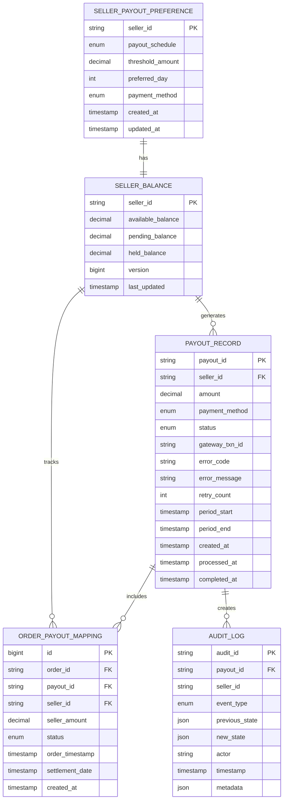
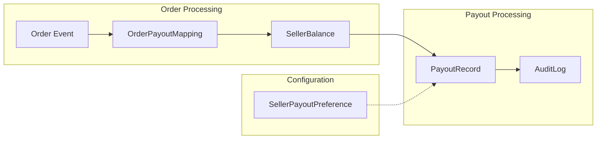
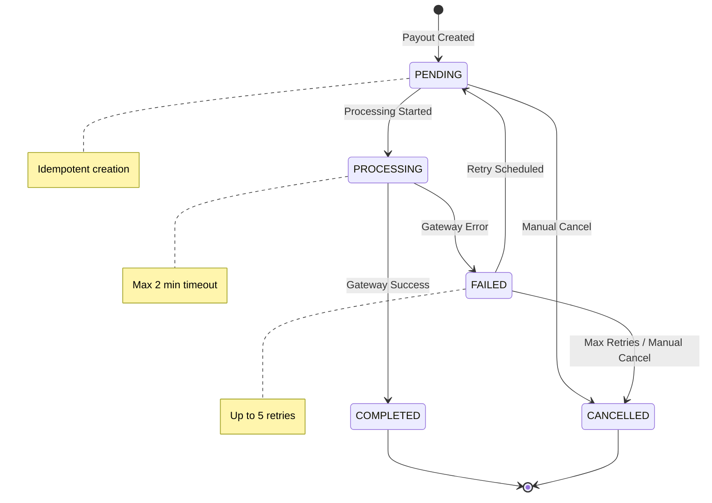
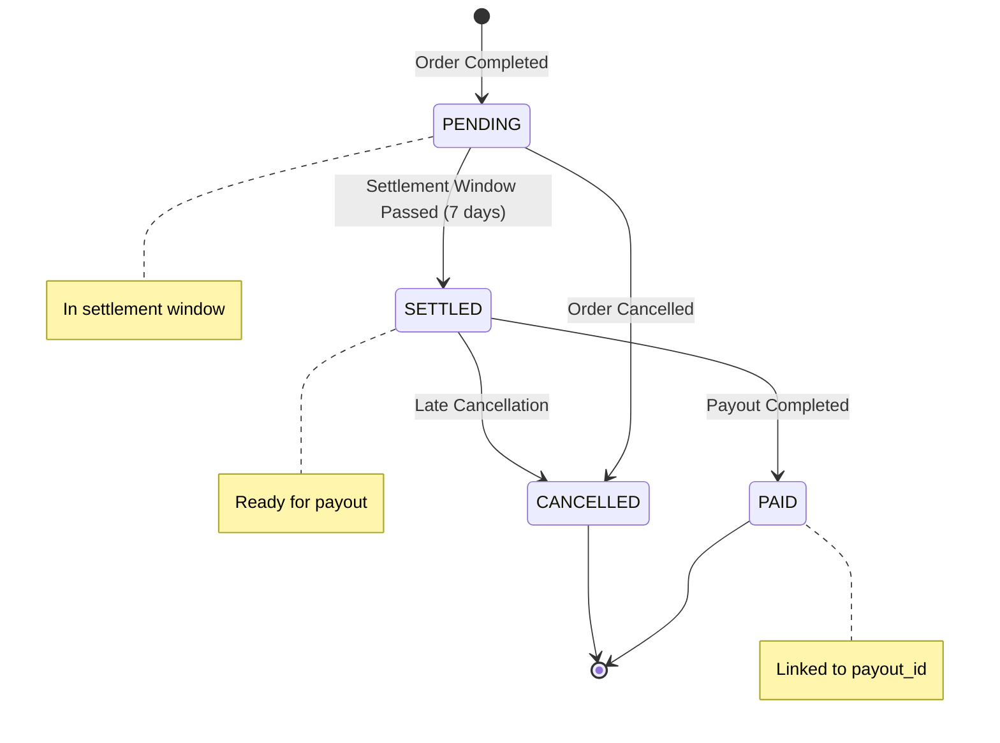
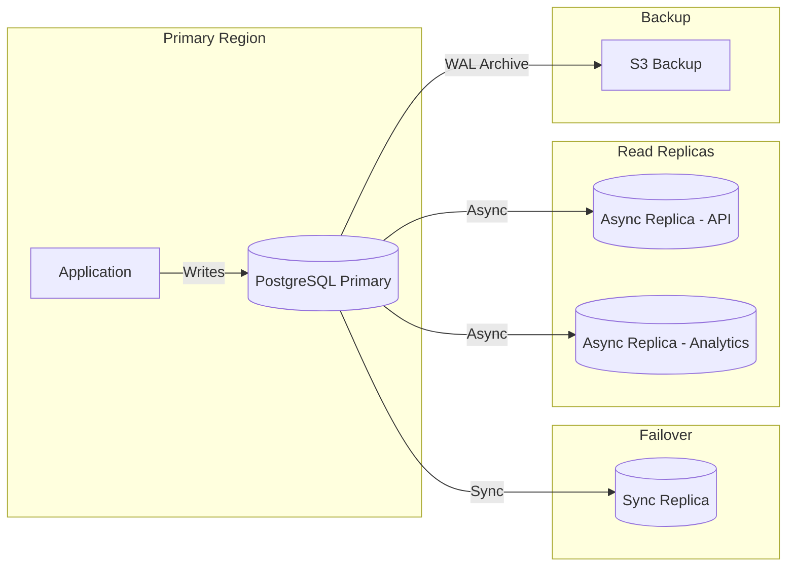

# Data Models

This document defines the database schema for the Seller-Side Payment System, including table definitions, relationships, constraints, and indexing strategies.

## Entity Relationship Diagram



### Data Flow Between Tables



## Table Definitions

### 1. seller_payout_preference

Stores seller's payout configuration. One record per seller.

```sql
CREATE TABLE seller_payout_preference (
    seller_id           VARCHAR(50) PRIMARY KEY,
    payout_schedule     VARCHAR(20) NOT NULL DEFAULT 'WEEKLY',
    threshold_amount    DECIMAL(15, 2) DEFAULT 100.00,
    preferred_day       SMALLINT DEFAULT 5,  -- Friday (0=Sunday, 6=Saturday)
    payment_method      VARCHAR(10) NOT NULL DEFAULT 'WIRE',
    created_at          TIMESTAMP NOT NULL DEFAULT CURRENT_TIMESTAMP,
    updated_at          TIMESTAMP NOT NULL DEFAULT CURRENT_TIMESTAMP,

    CONSTRAINT chk_payout_schedule CHECK (
        payout_schedule IN ('DAILY', 'WEEKLY', 'THRESHOLD', 'ON_DEMAND')
    ),
    CONSTRAINT chk_payment_method CHECK (
        payment_method IN ('CHECK', 'WIRE')
    ),
    CONSTRAINT chk_preferred_day CHECK (
        preferred_day BETWEEN 0 AND 6
    ),
    CONSTRAINT chk_threshold_positive CHECK (
        threshold_amount >= 0
    )
);

-- Index for scheduler queries by schedule type
CREATE INDEX idx_preference_schedule ON seller_payout_preference(payout_schedule);
```

**Field Descriptions**:
| Field | Type | Description |
|-------|------|-------------|
| seller_id | VARCHAR(50) | Foreign key to SellerService |
| payout_schedule | ENUM | DAILY, WEEKLY, THRESHOLD, or ON_DEMAND |
| threshold_amount | DECIMAL(15,2) | Minimum balance for THRESHOLD payouts |
| preferred_day | SMALLINT | Day of week for WEEKLY payouts (0-6) |
| payment_method | ENUM | CHECK or WIRE |
| created_at | TIMESTAMP | Record creation time |
| updated_at | TIMESTAMP | Last modification time |

### 2. seller_balance

Maintains current balance state for each seller with three-tier accounting.

```sql
CREATE TABLE seller_balance (
    seller_id           VARCHAR(50) PRIMARY KEY,
    available_balance   DECIMAL(15, 2) NOT NULL DEFAULT 0.00,
    pending_balance     DECIMAL(15, 2) NOT NULL DEFAULT 0.00,
    held_balance        DECIMAL(15, 2) NOT NULL DEFAULT 0.00,
    version             BIGINT NOT NULL DEFAULT 0,
    last_updated        TIMESTAMP NOT NULL DEFAULT CURRENT_TIMESTAMP,

    CONSTRAINT chk_available_non_negative CHECK (available_balance >= 0),
    CONSTRAINT chk_pending_non_negative CHECK (pending_balance >= 0),
    CONSTRAINT chk_held_non_negative CHECK (held_balance >= 0)
);

-- Index for finding sellers with available balance (for payout eligibility)
CREATE INDEX idx_balance_available ON seller_balance(available_balance)
    WHERE available_balance > 0;

-- Index for threshold-based payout queries
CREATE INDEX idx_balance_threshold ON seller_balance(seller_id, available_balance);
```

**Field Descriptions**:
| Field | Type | Description |
|-------|------|-------------|
| seller_id | VARCHAR(50) | Foreign key to SellerService |
| available_balance | DECIMAL(15,2) | Ready for payout (settlement complete) |
| pending_balance | DECIMAL(15,2) | In settlement window (can be cancelled) |
| held_balance | DECIMAL(15,2) | Held for disputes/chargebacks |
| version | BIGINT | Optimistic locking version |
| last_updated | TIMESTAMP | Last modification time |

**Balance Transitions**:

```
ORDER_COMPLETED:  pending_balance += seller_amount
SETTLEMENT_COMPLETE: available_balance += amount, pending_balance -= amount
ORDER_CANCELLED (within window): pending_balance -= seller_amount
DISPUTE_OPENED: held_balance += amount, available_balance -= amount
DISPUTE_RESOLVED_FOR_SELLER: available_balance += amount, held_balance -= amount
DISPUTE_RESOLVED_FOR_BUYER: held_balance -= amount (refunded)
PAYOUT_COMPLETED: available_balance -= payout_amount
```

### 3. payout_record

Tracks each payout through its lifecycle with full state information.

```sql
CREATE TABLE payout_record (
    payout_id           VARCHAR(100) PRIMARY KEY,
    seller_id           VARCHAR(50) NOT NULL,
    amount              DECIMAL(15, 2) NOT NULL,
    payment_method      VARCHAR(10) NOT NULL,
    status              VARCHAR(20) NOT NULL DEFAULT 'PENDING',
    gateway_txn_id      VARCHAR(100),
    error_code          VARCHAR(50),
    error_message       VARCHAR(500),
    retry_count         SMALLINT NOT NULL DEFAULT 0,
    period_start        TIMESTAMP NOT NULL,
    period_end          TIMESTAMP NOT NULL,
    created_at          TIMESTAMP NOT NULL DEFAULT CURRENT_TIMESTAMP,
    processed_at        TIMESTAMP,
    completed_at        TIMESTAMP,

    CONSTRAINT chk_payout_status CHECK (
        status IN ('PENDING', 'PROCESSING', 'COMPLETED', 'FAILED', 'CANCELLED')
    ),
    CONSTRAINT chk_payout_method CHECK (
        payment_method IN ('CHECK', 'WIRE')
    ),
    CONSTRAINT chk_amount_positive CHECK (amount > 0),
    CONSTRAINT chk_period_valid CHECK (period_end >= period_start)
);

-- Index for finding payouts by seller
CREATE INDEX idx_payout_seller ON payout_record(seller_id, created_at DESC);

-- Index for status-based queries (scheduler, reconciliation)
CREATE INDEX idx_payout_status ON payout_record(status);

-- Index for finding stuck processing records
CREATE INDEX idx_payout_processing ON payout_record(processed_at)
    WHERE status = 'PROCESSING';

-- Index for duplicate prevention (idempotency check)
CREATE UNIQUE INDEX idx_payout_idempotency ON payout_record(seller_id, period_start, period_end)
    WHERE status NOT IN ('CANCELLED', 'FAILED');

-- Index for gateway transaction lookup
CREATE INDEX idx_payout_gateway_txn ON payout_record(gateway_txn_id)
    WHERE gateway_txn_id IS NOT NULL;
```

**Field Descriptions**:
| Field | Type | Description |
|-------|------|-------------|
| payout_id | VARCHAR(100) | Unique identifier (format: PO-{date}-{sellerId}-{hash}) |
| seller_id | VARCHAR(50) | Seller receiving the payout |
| amount | DECIMAL(15,2) | Payout amount in currency units |
| payment_method | ENUM | CHECK or WIRE |
| status | ENUM | Current state in lifecycle |
| gateway_txn_id | VARCHAR(100) | Transaction ID from payment gateway |
| error_code | VARCHAR(50) | Error code if failed |
| error_message | VARCHAR(500) | Human-readable error description |
| retry_count | SMALLINT | Number of retry attempts |
| period_start | TIMESTAMP | Start of earning period covered |
| period_end | TIMESTAMP | End of earning period covered |
| created_at | TIMESTAMP | When payout was created |
| processed_at | TIMESTAMP | When sent to gateway |
| completed_at | TIMESTAMP | When confirmed complete |

**Status State Machine**:



### 4. order_payout_mapping

Links orders to payouts for traceability and audit purposes.

```sql
CREATE TABLE order_payout_mapping (
    id                  BIGSERIAL PRIMARY KEY,
    order_id            VARCHAR(50) NOT NULL,
    payout_id           VARCHAR(100),
    seller_id           VARCHAR(50) NOT NULL,
    seller_amount       DECIMAL(15, 2) NOT NULL,
    status              VARCHAR(20) NOT NULL DEFAULT 'PENDING',
    order_timestamp     TIMESTAMP NOT NULL,
    settlement_date     TIMESTAMP,
    created_at          TIMESTAMP NOT NULL DEFAULT CURRENT_TIMESTAMP,

    CONSTRAINT chk_mapping_status CHECK (
        status IN ('PENDING', 'SETTLED', 'CANCELLED', 'PAID')
    ),
    CONSTRAINT chk_seller_amount_positive CHECK (seller_amount > 0)
);

-- Unique constraint to prevent duplicate order processing
CREATE UNIQUE INDEX idx_mapping_order_seller ON order_payout_mapping(order_id, seller_id);

-- Index for finding orders ready for settlement
CREATE INDEX idx_mapping_settlement ON order_payout_mapping(status, order_timestamp)
    WHERE status = 'PENDING';

-- Index for finding orders by payout
CREATE INDEX idx_mapping_payout ON order_payout_mapping(payout_id)
    WHERE payout_id IS NOT NULL;

-- Index for seller order history
CREATE INDEX idx_mapping_seller ON order_payout_mapping(seller_id, created_at DESC);
```

**Field Descriptions**:
| Field | Type | Description |
|-------|------|-------------|
| id | BIGSERIAL | Auto-increment primary key |
| order_id | VARCHAR(50) | Foreign key to OrderService |
| payout_id | VARCHAR(100) | Foreign key to payout_record (null until paid) |
| seller_id | VARCHAR(50) | Seller who earned from this order |
| seller_amount | DECIMAL(15,2) | Seller's earnings from this order |
| status | ENUM | PENDING, SETTLED, CANCELLED, or PAID |
| order_timestamp | TIMESTAMP | When the order was placed |
| settlement_date | TIMESTAMP | When order became eligible for payout |
| created_at | TIMESTAMP | When record was created |

**Mapping Status Transitions**:



### 5. audit_log

Immutable event log for compliance and troubleshooting.

```sql
CREATE TABLE audit_log (
    audit_id            VARCHAR(100) PRIMARY KEY,
    payout_id           VARCHAR(100),
    seller_id           VARCHAR(50) NOT NULL,
    event_type          VARCHAR(30) NOT NULL,
    previous_state      JSONB,
    new_state           JSONB,
    actor               VARCHAR(100) NOT NULL,
    timestamp           TIMESTAMP NOT NULL DEFAULT CURRENT_TIMESTAMP,
    metadata            JSONB,

    CONSTRAINT chk_event_type CHECK (
        event_type IN (
            'PAYOUT_CREATED', 'PAYOUT_SUBMITTED', 'PAYOUT_COMPLETED',
            'PAYOUT_FAILED', 'PAYOUT_RETRY', 'PAYOUT_CANCELLED',
            'BALANCE_CREDITED', 'BALANCE_DEBITED', 'BALANCE_HELD',
            'BALANCE_RELEASED', 'PREFERENCE_UPDATED', 'MANUAL_ADJUSTMENT'
        )
    )
);

-- Index for querying by payout
CREATE INDEX idx_audit_payout ON audit_log(payout_id) WHERE payout_id IS NOT NULL;

-- Index for querying by seller
CREATE INDEX idx_audit_seller ON audit_log(seller_id, timestamp DESC);

-- Index for querying by event type (for analytics)
CREATE INDEX idx_audit_event_type ON audit_log(event_type, timestamp DESC);

-- Index for time-based queries
CREATE INDEX idx_audit_timestamp ON audit_log(timestamp DESC);

-- Prevent any modifications (trigger-based enforcement)
CREATE OR REPLACE FUNCTION prevent_audit_modification()
RETURNS TRIGGER AS $$
BEGIN
    RAISE EXCEPTION 'Audit log records cannot be modified or deleted';
END;
$$ LANGUAGE plpgsql;

CREATE TRIGGER audit_log_immutable
    BEFORE UPDATE OR DELETE ON audit_log
    FOR EACH ROW
    EXECUTE FUNCTION prevent_audit_modification();
```

**Field Descriptions**:
| Field | Type | Description |
|-------|------|-------------|
| audit_id | VARCHAR(100) | Unique audit entry ID |
| payout_id | VARCHAR(100) | Related payout (if applicable) |
| seller_id | VARCHAR(50) | Affected seller |
| event_type | ENUM | Type of event |
| previous_state | JSONB | State before the change |
| new_state | JSONB | State after the change |
| actor | VARCHAR(100) | Who/what triggered the event |
| timestamp | TIMESTAMP | When event occurred |
| metadata | JSONB | Additional context |

**Example Audit Records**:

```json
// PAYOUT_CREATED
{
  "audit_id": "AUD-20260106-001",
  "payout_id": "PO-2026-01-06-S001",
  "seller_id": "S001",
  "event_type": "PAYOUT_CREATED",
  "previous_state": null,
  "new_state": {
    "status": "PENDING",
    "amount": 1250.00,
    "payment_method": "WIRE"
  },
  "actor": "SYSTEM:PayoutScheduler",
  "timestamp": "2026-01-06T22:00:00Z",
  "metadata": {
    "trigger": "WEEKLY_SCHEDULE",
    "orders_count": 47
  }
}

// BALANCE_CREDITED
{
  "audit_id": "AUD-20260106-002",
  "payout_id": null,
  "seller_id": "S001",
  "event_type": "BALANCE_CREDITED",
  "previous_state": {
    "pending_balance": 1000.00
  },
  "new_state": {
    "pending_balance": 1045.00
  },
  "actor": "SYSTEM:OrderEventConsumer",
  "timestamp": "2026-01-06T14:30:00Z",
  "metadata": {
    "order_id": "ORD-789",
    "amount": 45.00
  }
}
```

## Database Configuration

### Connection Pool Settings

```yaml
datasource:
  hikari:
    maximum-pool-size: 20
    minimum-idle: 5
    idle-timeout: 300000
    connection-timeout: 20000
    max-lifetime: 1200000
```

### Partitioning Strategy (for high volume)

For tables that grow large, consider time-based partitioning:

```sql
-- Partition audit_log by month
CREATE TABLE audit_log (
    audit_id            VARCHAR(100) NOT NULL,
    -- ... other columns ...
    timestamp           TIMESTAMP NOT NULL DEFAULT CURRENT_TIMESTAMP
) PARTITION BY RANGE (timestamp);

-- Create monthly partitions
CREATE TABLE audit_log_2026_01 PARTITION OF audit_log
    FOR VALUES FROM ('2026-01-01') TO ('2026-02-01');
CREATE TABLE audit_log_2026_02 PARTITION OF audit_log
    FOR VALUES FROM ('2026-02-01') TO ('2026-03-01');
-- ... continue for future months

-- Partition payout_record by month
CREATE TABLE payout_record (
    payout_id           VARCHAR(100) NOT NULL,
    -- ... other columns ...
    created_at          TIMESTAMP NOT NULL DEFAULT CURRENT_TIMESTAMP
) PARTITION BY RANGE (created_at);
```

### Replication Setup



## Data Retention Policy

| Table                    | Retention  | Archive Strategy                   |
| ------------------------ | ---------- | ---------------------------------- |
| seller_payout_preference | Indefinite | N/A                                |
| seller_balance           | Indefinite | N/A                                |
| payout_record            | 7 years    | Move to cold storage after 2 years |
| order_payout_mapping     | 7 years    | Move to cold storage after 2 years |
| audit_log                | 7 years    | Archive to S3 after 1 year         |

## Migration Scripts

### Initial Schema Creation

```sql
-- Run in order:
-- 1. Create ENUM types (if using PostgreSQL enums)
-- 2. Create tables in dependency order:
--    - seller_payout_preference
--    - seller_balance
--    - payout_record
--    - order_payout_mapping
--    - audit_log
-- 3. Create indexes
-- 4. Create triggers
```

### Rollback Strategy

Each migration should have a corresponding rollback script. Example:

```sql
-- V1__create_seller_balance.sql
CREATE TABLE seller_balance (...);

-- V1__create_seller_balance_rollback.sql
DROP TABLE IF EXISTS seller_balance;
```
