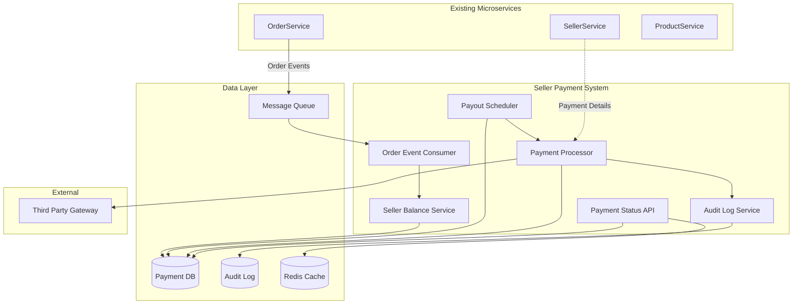
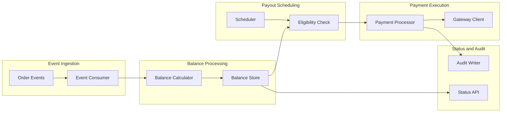
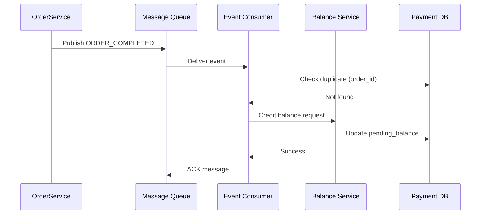
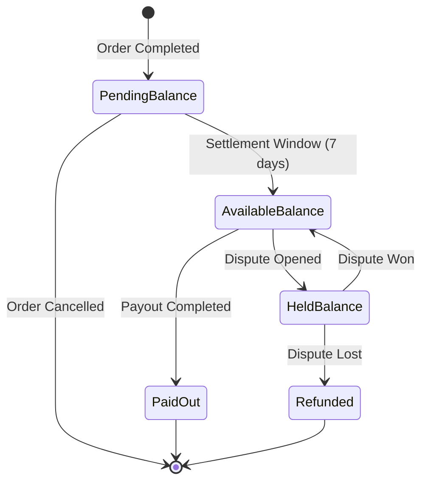
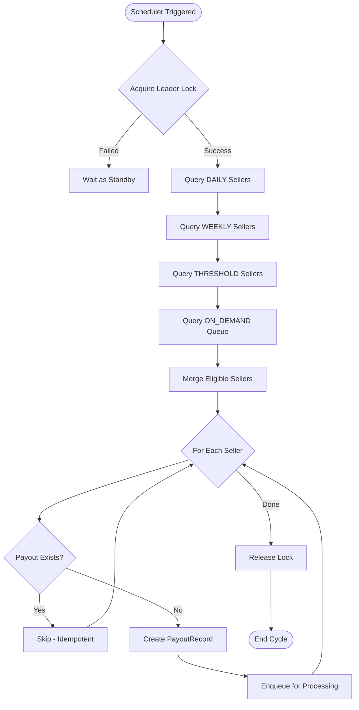
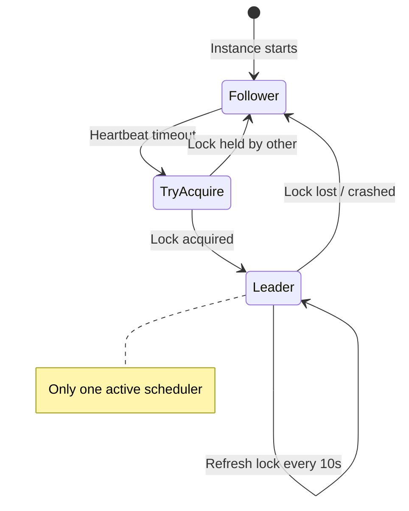
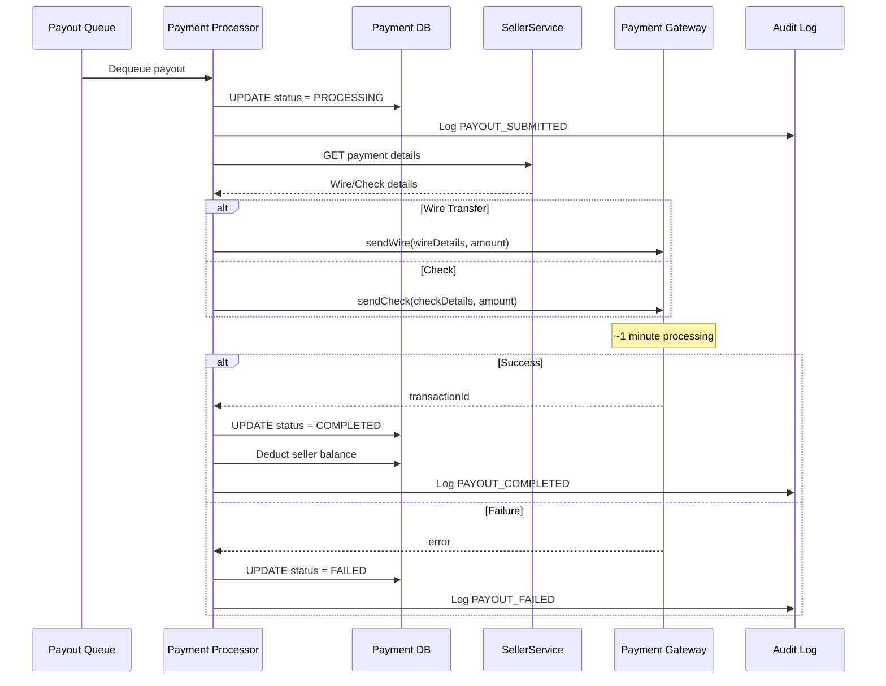
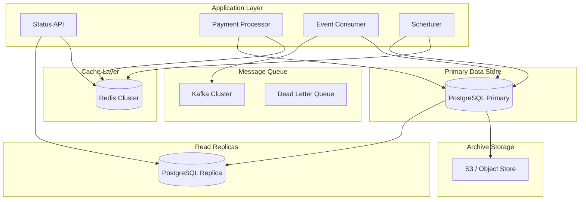
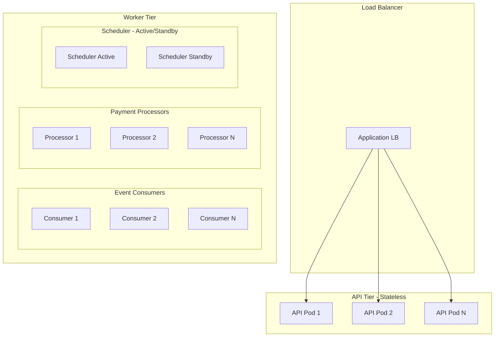

# System Architecture

This document details the components, interactions, and design rationale for the Seller-Side Payment System.

## Component Overview

The system consists of six core components that work together to process seller payouts reliably and efficiently.



### Component Interaction Flow



## Component Details

### 1. Order Event Consumer

**Responsibility**: Consume order completion events and update seller balances.

**Input**: Order completion events from OrderService via message queue

**Output**: Balance updates to Seller Balance Service



**Key Operations**:

- Subscribe to order completion topic
- Extract seller earnings from order data
- Calculate seller amount (sellerPrice × quantity for each product)
- Call Seller Balance Service to credit pending balance
- Handle order cancellation events to reverse credits

**Design Considerations**:

- At-least-once delivery with idempotent processing
- Use orderID as deduplication key
- Batch processing for high throughput
- Dead letter queue for poison messages

```json
// Order Event Structure
{
  "eventType": "ORDER_COMPLETED",
  "orderId": "ORD-123",
  "buyerId": "B456",
  "products": [
    {
      "productId": "P789",
      "sellerId": "S001",
      "sellerPrice": 45.0,
      "buyerPrice": 59.99,
      "quantity": 2
    }
  ],
  "orderTimestamp": "2026-01-06T10:30:00Z"
}
```

### 2. Seller Balance Service

**Responsibility**: Maintain accurate seller balances with three-tier accounting.

**Balance Types**:
| Type | Description | Transition |
|------|-------------|------------|
| `pendingBalance` | Orders completed but in settlement window | Order completed → +amount |
| `availableBalance` | Ready for payout | Settlement window passed → move from pending |
| `heldBalance` | Held for disputes/chargebacks | Dispute opened → move from available |



**Key Operations**:

- Credit pending balance on order completion
- Move pending to available after settlement window (e.g., 7 days)
- Deduct from available on successful payout
- Handle holds for disputes
- Reverse pending balance on order cancellation

**Concurrency Control**:

- Optimistic locking with version field
- Atomic balance updates using database transactions
- Prevent negative balances with CHECK constraints

```sql
-- Example balance update with optimistic locking
UPDATE seller_balance
SET available_balance = available_balance - :amount,
    version = version + 1,
    last_updated = NOW()
WHERE seller_id = :sellerId
  AND version = :currentVersion
  AND available_balance >= :amount;
```

### 3. Payout Scheduler

**Responsibility**: Determine which sellers are eligible for payout and initiate processing.



**Scheduling Logic**:

```
For each payout cycle run:
  1. Query sellers with DAILY schedule → if current time is EOD
  2. Query sellers with WEEKLY schedule → if today matches preferred day
  3. Query sellers with THRESHOLD schedule → if available_balance >= threshold
  4. Process ON_DEMAND payouts → from manual request queue

  For each eligible seller:
    - Check if payout already exists for this period (idempotency)
    - Create PayoutRecord with PENDING status
    - Dispatch to Payment Processor
```

**Scheduling Intervals**:
| Schedule Type | Trigger |
|---------------|---------|
| DAILY | Cron: `0 0 22 * * *` (10 PM daily) |
| WEEKLY | Cron: `0 0 22 * * {preferredDay}` |
| THRESHOLD | Continuous check every 15 minutes |
| ON_DEMAND | Event-driven from API request |

**Leader Election**:



- Only one scheduler instance should be active
- Use distributed lock (Redis/ZooKeeper) for leader election
- Heartbeat every 10 seconds to maintain leadership
- Automatic failover to standby on leader failure

### 4. Payment Processor

**Responsibility**: Execute payments through the third-party gateway.



**Processing Flow**:

```
1. Receive payout request (payoutId, sellerId, amount, method)
2. Update PayoutRecord status to PROCESSING
3. Fetch seller payment details from SellerService
4. Call appropriate gateway method:
   - CHECK → gateway.sendCheck(checkDetails, amount)
   - WIRE → gateway.sendWire(wireDetails, amount)
5. Wait for response (~1 minute)
6. On success:
   - Update status to COMPLETED
   - Store gatewayTxnId
   - Deduct from seller available balance
7. On failure:
   - Update status to FAILED
   - Store error details
   - Trigger retry or escalation
```

**Concurrency**:

- Process multiple sellers in parallel (configurable pool size)
- One payout per seller at a time (distributed lock per seller)
- Timeout handling for gateway calls (2 minutes max)

**Idempotency**:

- Use payoutId as idempotency key with gateway
- Check for existing COMPLETED payout before processing
- Store gateway transaction ID for reconciliation

### 5. Payment Status API

**Responsibility**: Provide sellers with real-time visibility into their payments.

**Endpoints**:
| Endpoint | Purpose |
|----------|---------|
| `GET /sellers/{id}/payments/status` | Current balance and recent payouts |
| `GET /sellers/{id}/payments/{payoutId}` | Detailed payout status |
| `GET /sellers/{id}/payments/history` | Payout history with pagination |
| `POST /sellers/{id}/payments/request` | Request on-demand payout |
| `PUT /sellers/{id}/payments/preferences` | Update payout preferences |

**Status Resolution**:
For failed payments, provide actionable guidance:

| Error Code          | Message                  | Required Action           |
| ------------------- | ------------------------ | ------------------------- |
| `INVALID_ACCOUNT`   | Bank account invalid     | Update bank details       |
| `INSUFFICIENT_INFO` | Missing payment info     | Complete profile          |
| `ACCOUNT_CLOSED`    | Account no longer active | Provide new account       |
| `GATEWAY_ERROR`     | Temporary gateway issue  | Automatic retry scheduled |

### 6. Audit Log Service

**Responsibility**: Maintain immutable record of all payment-related events.

**Event Types**:

- `PAYOUT_CREATED` - New payout record created
- `PAYOUT_SUBMITTED` - Sent to payment gateway
- `PAYOUT_COMPLETED` - Successfully processed
- `PAYOUT_FAILED` - Gateway returned error
- `PAYOUT_RETRY` - Retry attempt initiated
- `PAYOUT_CANCELLED` - Manually cancelled
- `BALANCE_CREDITED` - Balance increased (order completed)
- `BALANCE_DEBITED` - Balance decreased (payout made)
- `BALANCE_HELD` - Balance put on hold
- `BALANCE_RELEASED` - Hold released

**Audit Record Structure**:

```json
{
  "auditId": "AUD-20260106-001",
  "timestamp": "2026-01-06T14:30:00Z",
  "eventType": "PAYOUT_COMPLETED",
  "payoutId": "PO-2026-01-06-S001",
  "sellerId": "S001",
  "actor": "SYSTEM:PaymentProcessor",
  "previousState": {
    "status": "PROCESSING",
    "gatewayTxnId": null
  },
  "newState": {
    "status": "COMPLETED",
    "gatewayTxnId": "GW-TXN-789"
  },
  "metadata": {
    "processingTimeMs": 58000,
    "gatewayLatencyMs": 57500
  }
}
```

**Storage**:

- Append-only table in PostgreSQL with no UPDATE/DELETE permissions
- Optionally replicate to S3 for long-term retention
- Retention: 7 years for financial compliance

## Data Store Architecture



### Primary Database (PostgreSQL)

**Tables**:

- `seller_payout_preference` - Payout configuration per seller
- `seller_balance` - Current balance state
- `payout_record` - Payment records with full lifecycle
- `order_payout_mapping` - Links orders to payouts
- `audit_log` - Immutable event log

**Indexes**:

```sql
-- For scheduler queries
CREATE INDEX idx_balance_available ON seller_balance(available_balance)
  WHERE available_balance > 0;

-- For payout lookups
CREATE INDEX idx_payout_seller_status ON payout_record(seller_id, status);
CREATE INDEX idx_payout_created ON payout_record(created_at);

-- For reconciliation
CREATE INDEX idx_payout_processing ON payout_record(status, processed_at)
  WHERE status = 'PROCESSING';
```

### Message Queue (Kafka)

**Topics**:
| Topic | Purpose | Partitions |
|-------|---------|------------|
| `order-events` | Order completion/cancellation events | By sellerId |
| `payout-requests` | Internal payout processing queue | By sellerId |
| `payout-dlq` | Dead letter queue for failed processing | 1 |

### Cache (Redis)

**Use Cases**:

- Seller balance cache for status API (TTL: 30 seconds)
- Distributed locks for scheduler and per-seller processing
- Rate limiting for API endpoints

## Integration Points

### With SellerService

```
GET /internal/sellers/{sellerId}/payment-details
Response:
{
  "sellerId": "S001",
  "paymentMethod": "WIRE",
  "wireDetails": {
    "bankName": "Chase",
    "accountNumber": "****1234",
    "routingNumber": "021000021",
    "accountHolderName": "Acme Corp"
  }
}
```

### With OrderService

**Event Subscription**:

- Topic: `order-events`
- Consumer Group: `seller-payment-system`
- Events: `ORDER_COMPLETED`, `ORDER_CANCELLED`

### With Third Party Payment Gateway

```java
interface ThirdPartyPaymentGateway {
    /**
     * Send payment via check
     * @param checkDetails Payee name, address, memo
     * @param amount Payment amount in cents
     * @return transactionId on success, error on failure
     */
    function sendCheck(checkDetails, amount) returns transactionId or error;

    /**
     * Send payment via wire transfer
     * @param wireDetails Bank account, routing, SWIFT/BIC
     * @param amount Payment amount in cents
     * @return transactionId on success, error on failure
     */
    function sendWire(wireDetails, amount) returns transactionId or error;
}
```

## Scalability Considerations

### Horizontal Scaling



| Component              | Scaling Strategy                             |
| ---------------------- | -------------------------------------------- |
| Order Event Consumer   | Scale by Kafka partitions (by sellerId)      |
| Seller Balance Service | Stateless, scale horizontally                |
| Payout Scheduler       | Single active with standby (leader election) |
| Payment Processor      | Thread pool per instance, multiple instances |
| Status API             | Stateless, scale horizontally behind LB      |
| Audit Service          | Async writes, batch inserts                  |

### Performance Targets

| Metric                        | Target      |
| ----------------------------- | ----------- |
| Order event processing        | < 100ms p99 |
| Payout creation to submission | < 5 seconds |
| Gateway call timeout          | 2 minutes   |
| Status API response           | < 50ms p99  |
| Daily payout capacity         | 1M+ sellers |

## Security

### Authentication & Authorization

- Internal services: mTLS with certificate validation
- Status API: OAuth 2.0 with seller-specific scopes
- Audit log: Read-only access for compliance team

### Data Protection

- PII encryption at rest (bank details, addresses)
- TLS 1.3 for all network communication
- Secrets in HashiCorp Vault or AWS Secrets Manager

### Access Control

| Role    | Permissions                            |
| ------- | -------------------------------------- |
| Seller  | View own balance, payouts, preferences |
| Support | View any seller, cannot modify         |
| Finance | View all, trigger manual payouts       |
| Admin   | Full access including config changes   |
