# Architecture Diagrams

This document contains visual representations of the Seller-Side Payment System architecture using Mermaid diagrams.

## System Overview

### High-Level Architecture

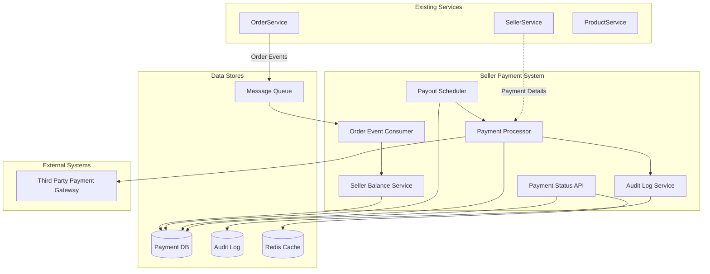

### Component Interaction

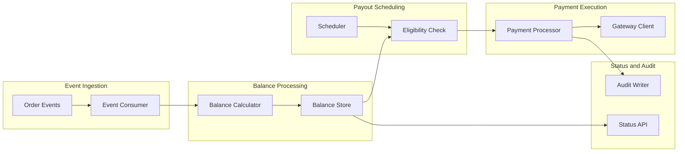

---

## Data Flow Diagrams

### Order to Balance Flow

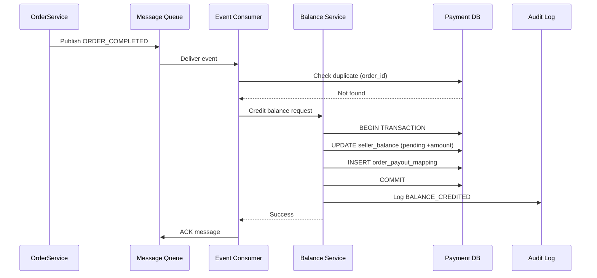

### Payout Scheduling Flow

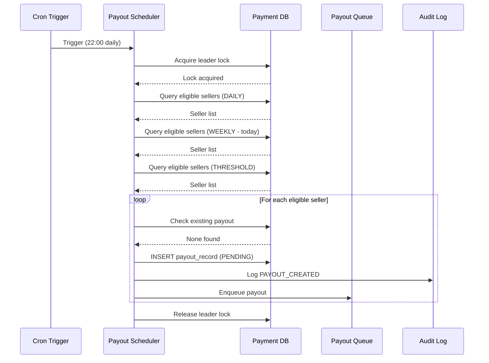

### Payment Processing Flow

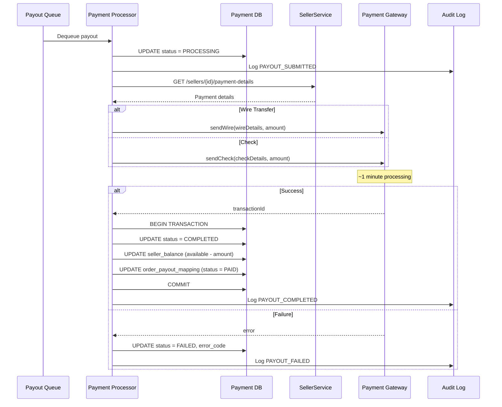

---

## State Diagrams

### Payout Status State Machine

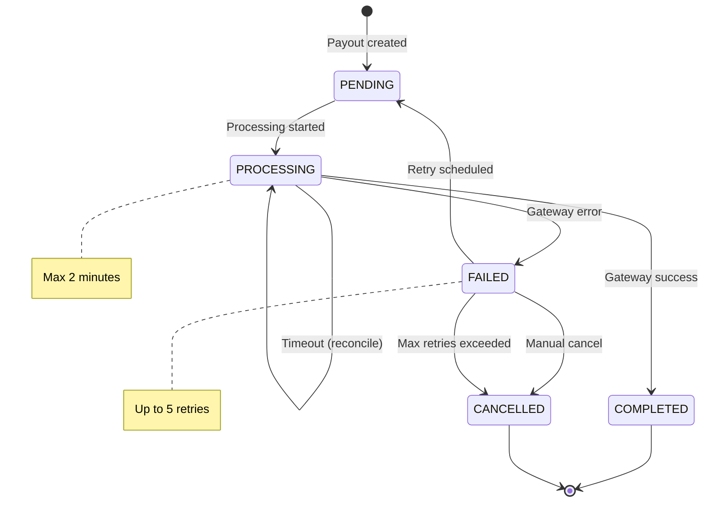

### Order Payout Mapping State Machine

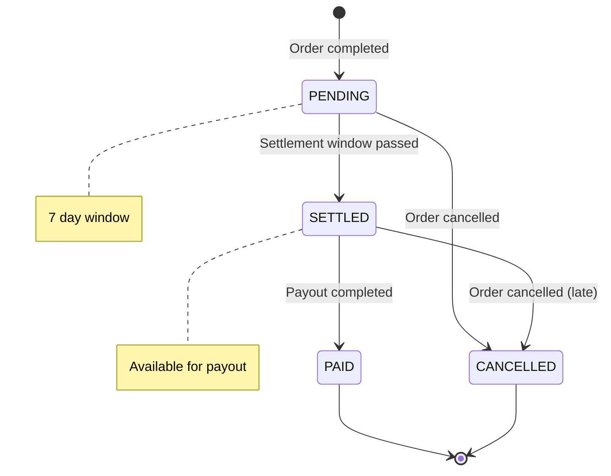

### Circuit Breaker State Machine

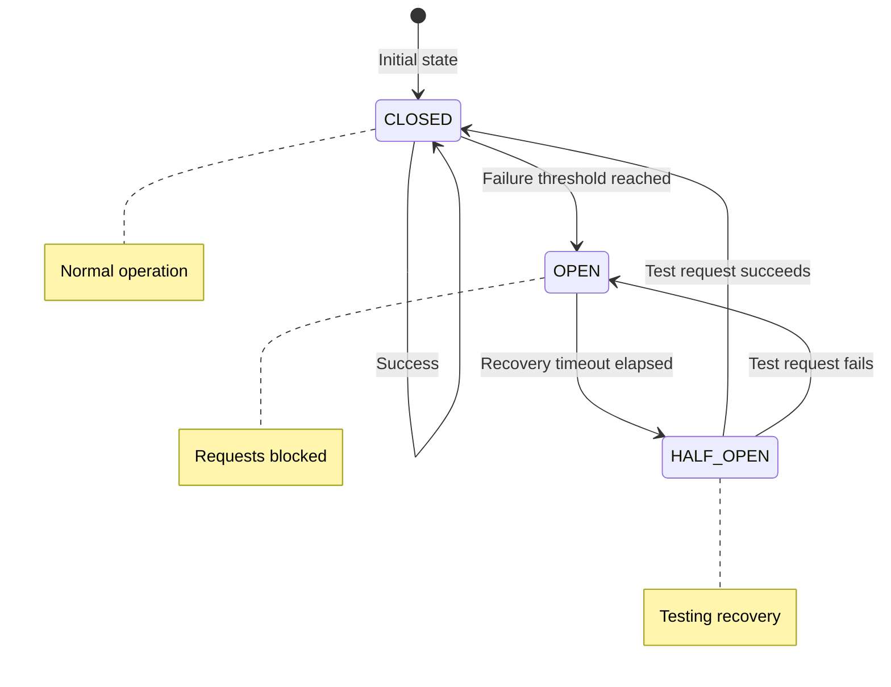

---

## Infrastructure Diagrams

### Deployment Architecture

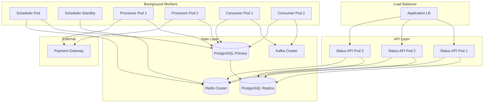

### Database Replication

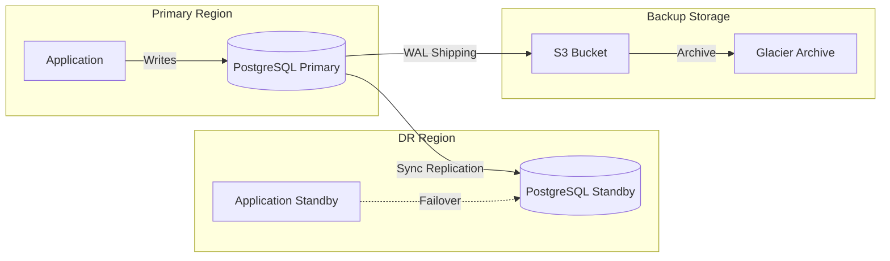

---

## Process Flow Diagrams

### Order Cancellation Flow

```mermaid
flowchart TD
    Start([Order Cancellation Event]) --> GetMapping[Get Order Mapping]

    GetMapping --> CheckStatus{Check Status}

    CheckStatus -->|PENDING| DeductPending[Deduct from pending_balance]
    CheckStatus -->|SETTLED| DeductAvailable[Deduct from available_balance]
    CheckStatus -->|PAID| CreateClawback[Create clawback record]
    CheckStatus -->|CANCELLED| AlreadyCancelled[Already cancelled - skip]

    DeductPending --> UpdateMapping[Update mapping status = CANCELLED]
    DeductAvailable --> UpdateMapping
    CreateClawback --> UpdateMapping

    UpdateMapping --> LogAudit[Log to audit]
    AlreadyCancelled --> End
    LogAudit --> End([End])
```

### Reconciliation Flow

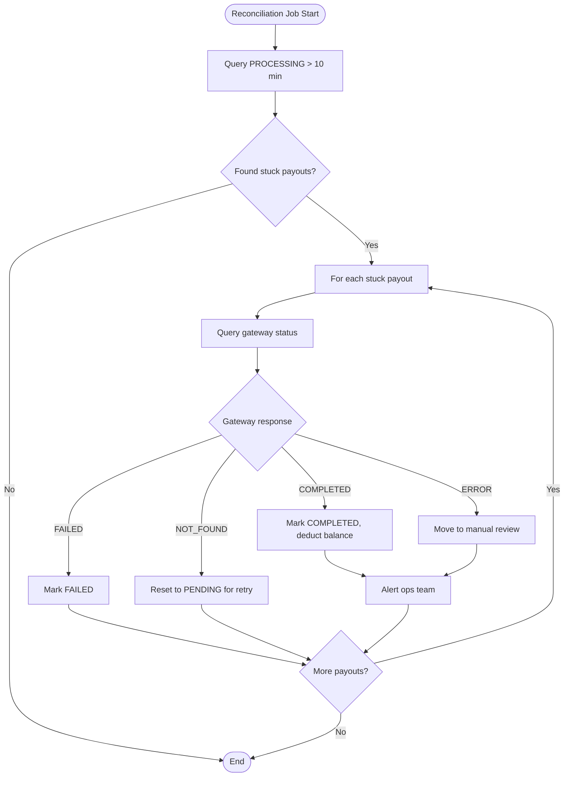

### Retry Flow

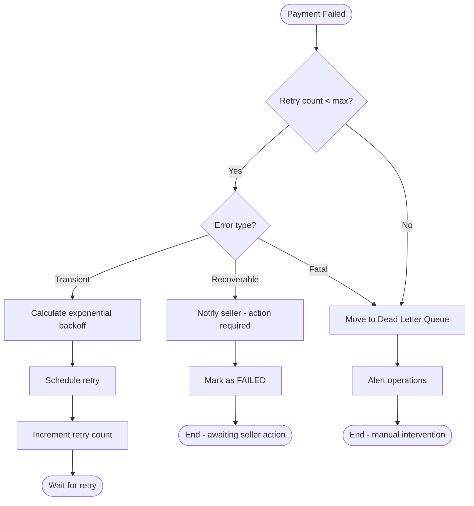

---

## Entity Relationship Diagram

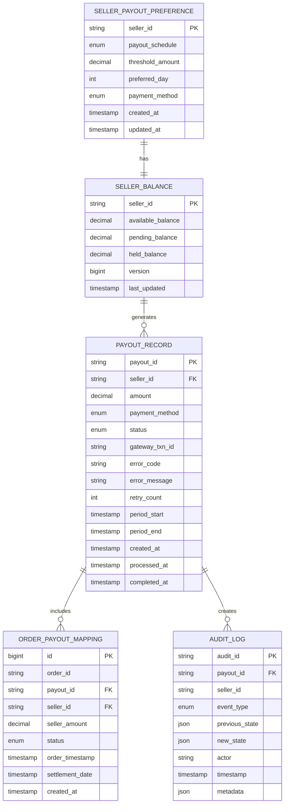

---

## Monitoring Dashboard Layout

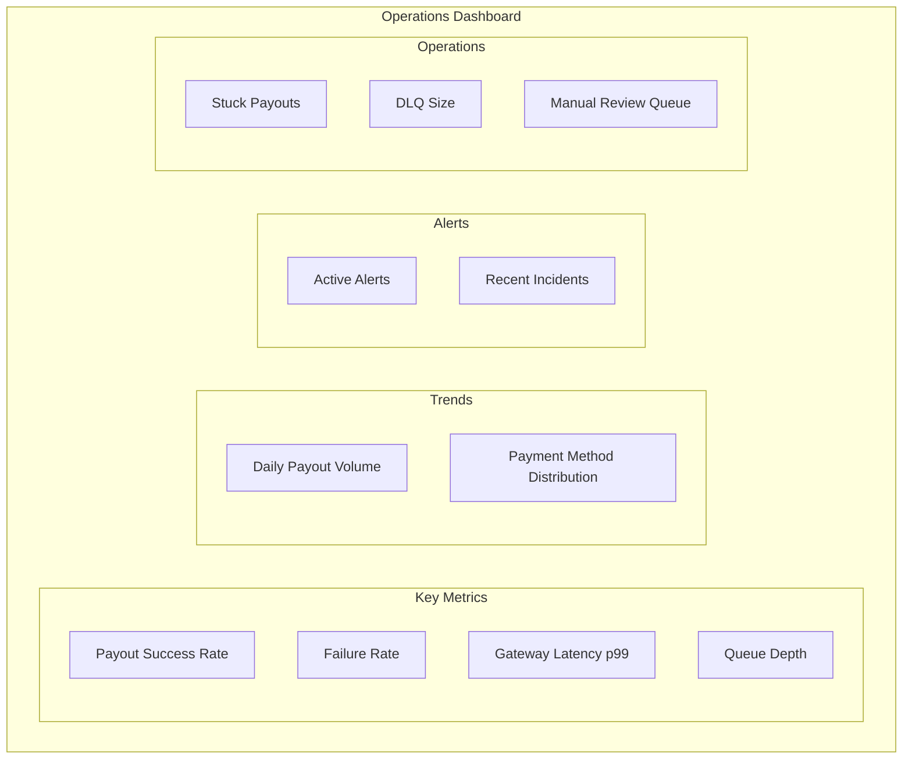

---

## Scaling Architecture

### Horizontal Scaling

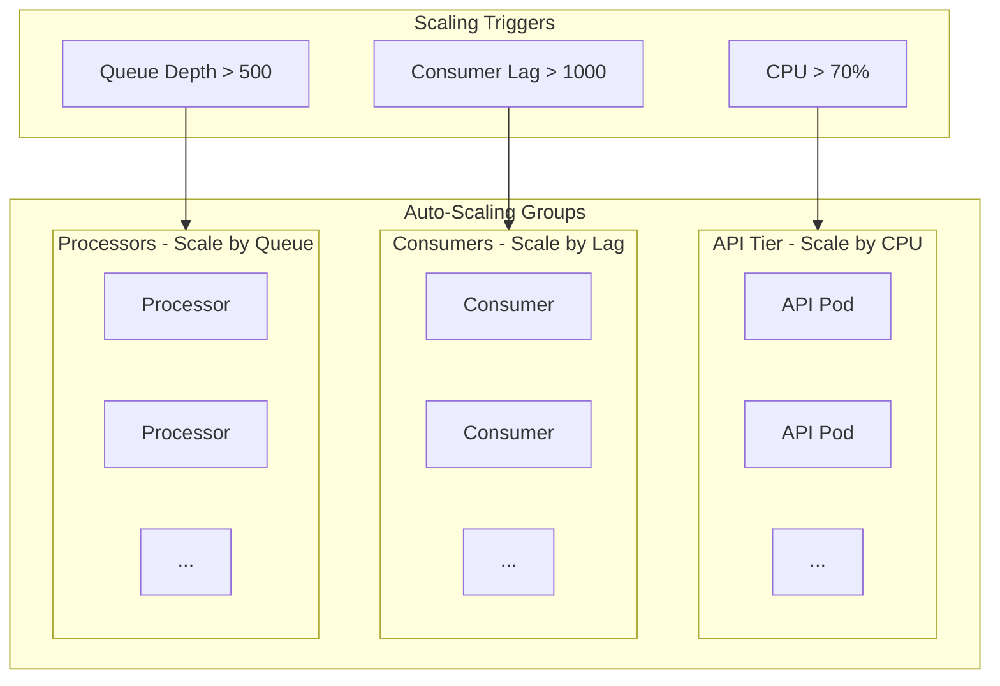

