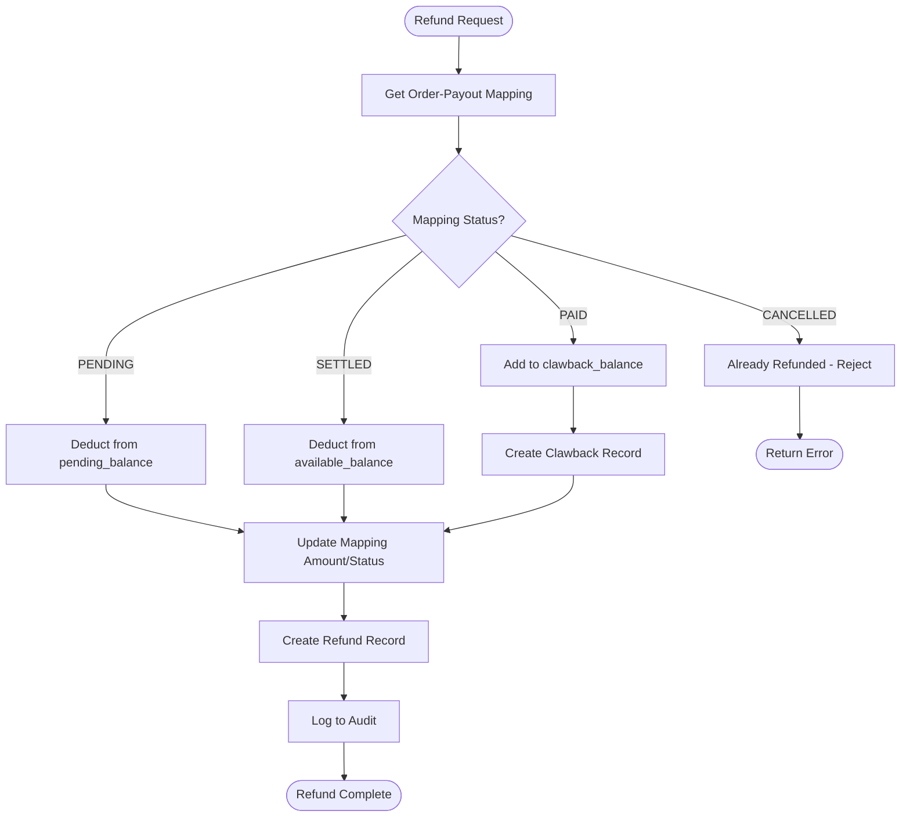
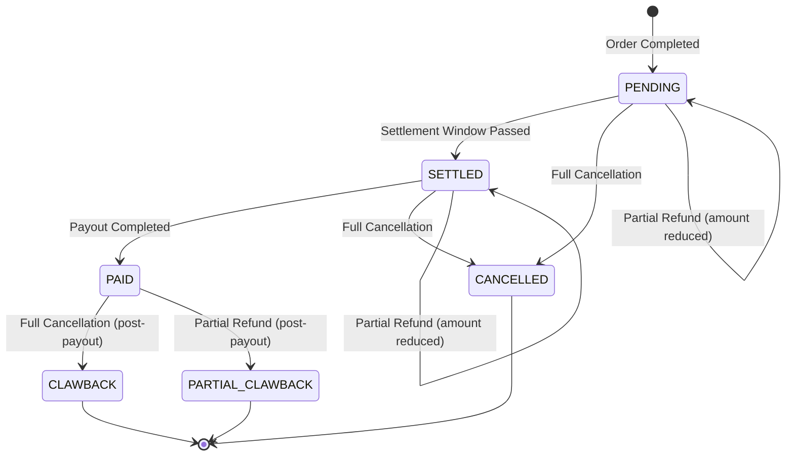
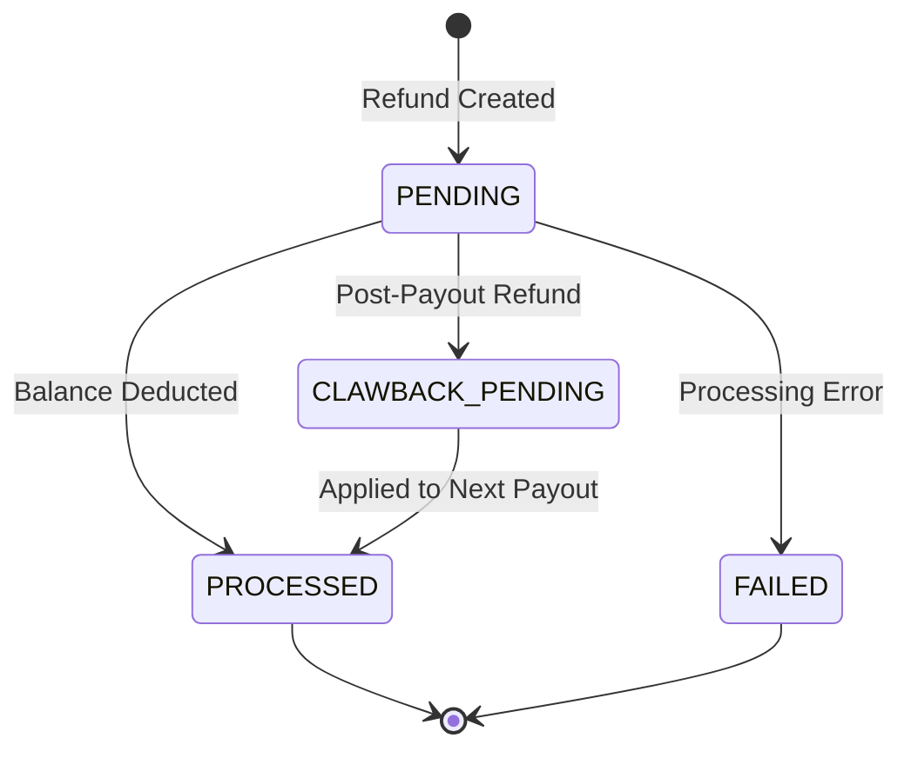

# Order Cancellations and Partial Refunds

## Overview

This document extends the seller payment system design to support:
1. **Full Order Cancellations** - Entire order is cancelled
2. **Partial Refunds** - Specific items or amounts refunded

---

## Cancellation/Refund Scenarios

| Scenario | Example | Complexity |
|----------|---------|------------|
| Full order cancellation | Buyer cancels entire order | Low |
| Item-level refund | Return 1 of 3 items | Medium |
| Quantity-level refund | Ordered 5, return 2 | Medium |
| Partial amount refund | 20% discount as compensation | Medium |
| Post-payout refund | Refund after seller was paid | High |

---

## Data Model Extensions

### 1. New Table: `refund_record`

```sql
CREATE TABLE refund_record (
    refund_id           VARCHAR(100) PRIMARY KEY,
    order_id            VARCHAR(50) NOT NULL,
    seller_id           VARCHAR(50) NOT NULL,
    refund_type         VARCHAR(20) NOT NULL,  -- FULL_CANCELLATION, ITEM_RETURN, PARTIAL_AMOUNT
    refund_amount       DECIMAL(15, 2) NOT NULL,
    original_amount     DECIMAL(15, 2) NOT NULL,
    reason              VARCHAR(500),
    status              VARCHAR(20) NOT NULL DEFAULT 'PENDING',  -- PENDING, PROCESSED, FAILED
    source_balance      VARCHAR(20) NOT NULL,  -- PENDING, AVAILABLE, CLAWBACK
    clawback_payout_id  VARCHAR(100),  -- If deducted from future payout
    created_at          TIMESTAMP NOT NULL DEFAULT CURRENT_TIMESTAMP,
    processed_at        TIMESTAMP,

    CONSTRAINT chk_refund_type CHECK (
        refund_type IN ('FULL_CANCELLATION', 'ITEM_RETURN', 'QUANTITY_RETURN', 'PARTIAL_AMOUNT', 'GOODWILL')
    ),
    CONSTRAINT chk_refund_status CHECK (
        status IN ('PENDING', 'PROCESSED', 'FAILED', 'CLAWBACK_PENDING')
    )
);

CREATE INDEX idx_refund_seller ON refund_record(seller_id, created_at DESC);
CREATE INDEX idx_refund_order ON refund_record(order_id);
CREATE INDEX idx_refund_clawback ON refund_record(seller_id, status)
    WHERE status = 'CLAWBACK_PENDING';
```

### 2. Extended `seller_balance` Table

```sql
ALTER TABLE seller_balance ADD COLUMN clawback_balance DECIMAL(15, 2) DEFAULT 0.00;

-- clawback_balance: Amount to be deducted from future payouts
-- (for refunds on already-paid orders)
```

### 3. Updated Balance Structure

```
┌─────────────────────────────────────────────────────────────┐
│                     SELLER BALANCE                          │
├─────────────────────────────────────────────────────────────┤
│  pending_balance    │ Orders in settlement window           │
│  available_balance  │ Ready for payout                      │
│  held_balance       │ Held for disputes                     │
│  clawback_balance   │ To deduct from next payout (NEW)      │
└─────────────────────────────────────────────────────────────┘

Effective Payout Amount = available_balance - clawback_balance
```

---

## Refund Processing Logic

### Decision Flow



### Scenario 1: Refund During PENDING State (Within Settlement Window)

**Timeline**: Order placed → Refund requested (within 7 days)

```
Before Refund:
  pending_balance: $500
  order_payout_mapping: ORD-123, $100, PENDING

After Full Refund:
  pending_balance: $400 (-$100)
  order_payout_mapping: ORD-123, $100, CANCELLED
  refund_record: FULL_CANCELLATION, $100, source=PENDING

After Partial Refund ($30):
  pending_balance: $470 (-$30)
  order_payout_mapping: ORD-123, $70 (updated), PENDING
  refund_record: PARTIAL_AMOUNT, $30, source=PENDING
```

### Scenario 2: Refund During SETTLED State (After Settlement, Before Payout)

**Timeline**: Order placed → 7 days pass → Refund requested → Payout not yet made

```
Before Refund:
  available_balance: $500
  order_payout_mapping: ORD-123, $100, SETTLED

After Full Refund:
  available_balance: $400 (-$100)
  order_payout_mapping: ORD-123, $100, CANCELLED
  refund_record: FULL_CANCELLATION, $100, source=AVAILABLE
```

### Scenario 3: Refund After PAID State (Post-Payout Clawback)

**Timeline**: Order placed → Settled → Payout completed → Refund requested

This is the complex case - seller already received the money.

```
Before Refund:
  available_balance: $200 (from new orders)
  order_payout_mapping: ORD-123, $100, PAID, payout_id=PO-001

After Refund (Clawback):
  available_balance: $200 (unchanged)
  clawback_balance: $100 (NEW - to deduct from next payout)
  order_payout_mapping: ORD-123, $100, CANCELLED
  refund_record: FULL_CANCELLATION, $100, source=CLAWBACK, status=CLAWBACK_PENDING
```

**Next Payout Calculation**:
```
Payout Amount = available_balance - clawback_balance
             = $200 - $100
             = $100
```

---

## Partial Refund Scenarios

### Item-Level Return

Order has multiple items, one is returned:

```
Original Order ORD-123:
  - Item A: $50 (Seller S001)
  - Item B: $30 (Seller S001)
  - Item C: $40 (Seller S002)

Total for S001: $80
Total for S002: $40

Return Item B ($30):

order_payout_mapping updates:
  - ORD-123, S001: $80 → $50

refund_record:
  - refund_id: REF-001
  - order_id: ORD-123
  - seller_id: S001
  - refund_type: ITEM_RETURN
  - refund_amount: $30
  - original_amount: $80
```

### Quantity-Level Return

```
Original: 5 units × $20 = $100
Return: 2 units × $20 = $40

order_payout_mapping updates:
  - seller_amount: $100 → $60

refund_record:
  - refund_type: QUANTITY_RETURN
  - refund_amount: $40
  - metadata: { "original_qty": 5, "returned_qty": 2 }
```

### Partial Amount (Compensation/Discount)

```
Original Order: $100
Compensation: 15% discount = $15

order_payout_mapping updates:
  - seller_amount: $100 → $85

refund_record:
  - refund_type: PARTIAL_AMOUNT
  - refund_amount: $15
  - reason: "Compensation for delayed delivery"
```

---

## API Extensions

### 1. Refund Event from OrderService

```json
POST /internal/v1/orders/refund

{
  "eventId": "EVT-REF-001",
  "eventType": "ORDER_REFUND",
  "orderId": "ORD-123",
  "refundType": "ITEM_RETURN",
  "refundedItems": [
    {
      "productId": "P789",
      "sellerId": "S001",
      "refundAmount": 30.00,
      "quantity": 1,
      "reason": "Damaged item"
    }
  ],
  "timestamp": "2026-01-10T14:30:00Z"
}
```

### 2. Admin Refund Endpoint

```json
POST /admin/v1/orders/{orderId}/refund

{
  "sellerId": "S001",
  "refundType": "PARTIAL_AMOUNT",
  "amount": 15.00,
  "reason": "Goodwill compensation",
  "adminId": "admin@company.com"
}
```

### 3. Seller View Refunds

```json
GET /api/v1/sellers/{sellerId}/refunds

Response:
{
  "refunds": [
    {
      "refundId": "REF-001",
      "orderId": "ORD-123",
      "refundType": "ITEM_RETURN",
      "refundAmount": 30.00,
      "status": "PROCESSED",
      "sourceBalance": "PENDING",
      "createdAt": "2026-01-10T14:30:00Z"
    }
  ],
  "summary": {
    "totalRefunds": 150.00,
    "pendingClawbacks": 50.00
  }
}
```

---

## Service Layer Changes

### RefundService Interface

```java
public interface RefundService {

    RefundRecord processFullCancellation(String orderId, String sellerId, String reason);

    RefundRecord processItemReturn(String orderId, String sellerId,
                                   BigDecimal amount, String productId, String reason);

    RefundRecord processPartialRefund(String orderId, String sellerId,
                                      BigDecimal amount, String reason);

    void applyClawbackToPayout(String sellerId, PayoutRecord payout);

    BigDecimal getPendingClawback(String sellerId);

    List<RefundRecord> getRefundHistory(String sellerId, Pageable pageable);
}
```

### Updated PaymentProcessorService

```java
// When creating payout, account for clawbacks
public PayoutRecord createPayoutRecord(String sellerId, PaymentMethod method) {
    SellerBalance balance = balanceRepository.findBySellerId(sellerId);

    BigDecimal availableAmount = balance.getAvailableBalance();
    BigDecimal clawbackAmount = balance.getClawbackBalance();
    BigDecimal payoutAmount = availableAmount.subtract(clawbackAmount);

    if (payoutAmount.compareTo(MINIMUM_PAYOUT) < 0) {
        throw new InsufficientBalanceException("Balance after clawback is below minimum");
    }

    // Create payout for net amount
    PayoutRecord payout = PayoutRecord.builder()
        .payoutId(generatePayoutId(sellerId))
        .sellerId(sellerId)
        .amount(payoutAmount)
        // ... other fields
        .build();

    // Apply clawback
    if (clawbackAmount.compareTo(BigDecimal.ZERO) > 0) {
        refundService.applyClawbackToPayout(sellerId, payout);
    }

    return payoutRepository.save(payout);
}
```

---

## State Transitions

### Order-Payout Mapping States (Extended)



### Refund Record States



---

## Edge Cases

### 1. Clawback Exceeds Available Balance

```
Scenario:
  available_balance: $50
  clawback_balance: $100 (from past refunds)

Solution:
  - Next payout: $0 (skip this cycle)
  - Remaining clawback: $50 (carry forward)
  - Continue deducting until clawback_balance = 0
```

### 2. Multiple Partial Refunds on Same Order

```
Order: $100 for Seller S001

Refund 1: $20 (Item return)
Refund 2: $15 (Compensation)
Refund 3: $10 (Partial damage)

order_payout_mapping: $100 → $80 → $65 → $55
refund_records: 3 separate records linked to same order
```

### 3. Refund After Order Already Partially Refunded

```
Order: $100, already refunded $30 (remaining: $70)

New refund request: $50

Validation: $50 <= $70 ✓ (allowed)
Result: remaining amount = $20
```

### 4. Seller Has Negative Effective Balance

```
available_balance: $100
clawback_balance: $150

Effective balance: -$50

Actions:
  - Block new payouts until clawback cleared
  - Continue accumulating earnings
  - Alert seller about outstanding clawback
```

---

## Audit Events (Extended)

```java
public enum AuditEventType {
    // ... existing events ...

    // New refund events
    REFUND_INITIATED,
    REFUND_PROCESSED,
    REFUND_FAILED,
    CLAWBACK_CREATED,
    CLAWBACK_APPLIED,
    CLAWBACK_PARTIAL_APPLIED
}
```

---

## Monitoring & Alerts

| Metric | Alert Threshold | Action |
|--------|-----------------|--------|
| High refund rate per seller | > 10% of orders | Flag for review |
| Large clawback pending | > $1000 | Notify finance |
| Negative effective balance | Any | Block payouts, notify seller |
| Refund processing failures | > 1% | Alert engineering |

---

## Summary

| Refund Timing | Source Balance | Action |
|---------------|----------------|--------|
| Within settlement (PENDING) | pending_balance | Direct deduction |
| After settlement (SETTLED) | available_balance | Direct deduction |
| After payout (PAID) | clawback_balance | Deduct from future payouts |

**Key Design Decisions**:
1. **Clawback mechanism** for post-payout refunds
2. **Separate refund_record table** for audit trail
3. **Net payout calculation**: `available - clawback`
4. **Carry forward** clawbacks if balance insufficient

