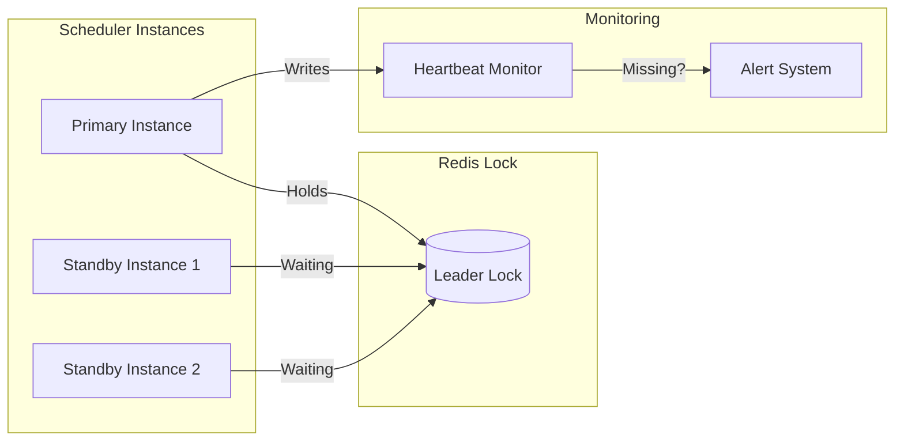
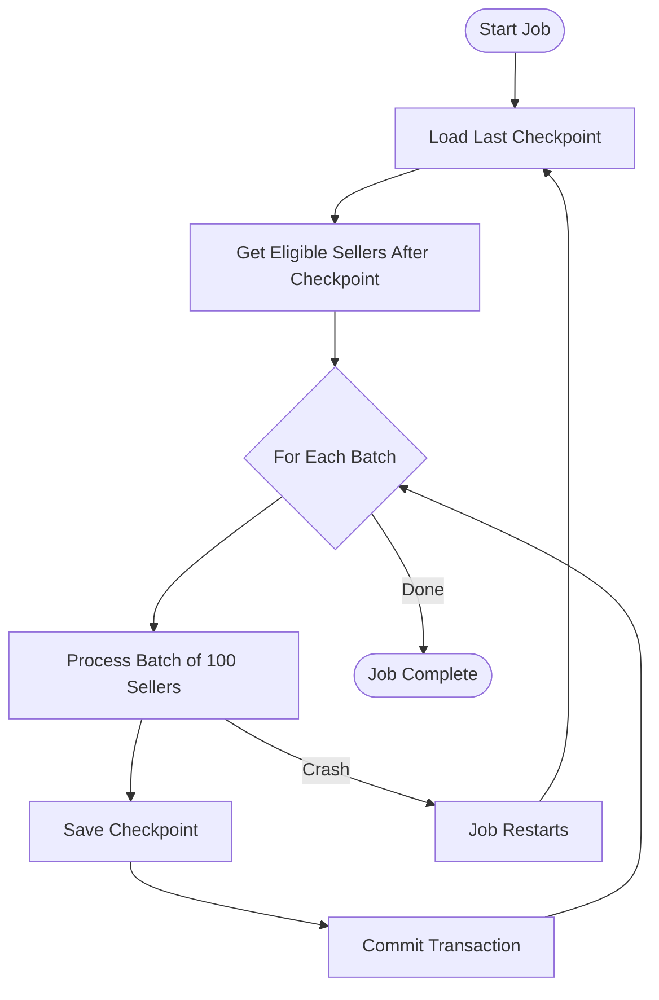
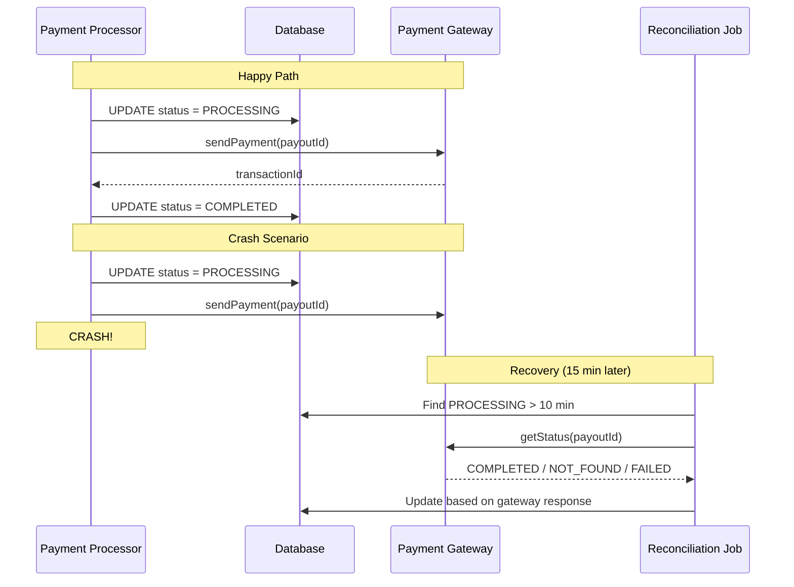

# Scheduled Job Failure Handling

## Overview

This document addresses three critical failure scenarios for the payout scheduler job:

1. **Job fails to start** - Cron trigger doesn't fire
2. **Job fails after processing some records** - Partial completion
3. **Job fails mid-record** - Crash during gateway call

---

## Failure Scenarios Summary

```mermaid
flowchart TD
    subgraph Scenario1 [Scenario 1: Job Fails to Start]
        A1[Cron Trigger] -->|Fails| B1[No Payouts Created]
        B1 --> C1[Sellers Not Paid]
    end

    subgraph Scenario2 [Scenario 2: Partial Failure]
        A2[Process 1000 Sellers] -->|Crash at 500| B2[500 Processed]
        B2 --> C2[500 Not Processed]
    end

    subgraph Scenario3 [Scenario 3: Mid-Record Failure]
        A3[Call Gateway] -->|Crash| B3[Status = PROCESSING]
        B3 --> C3[Unknown Payment State]
    end
```



---

## Scenario 1: Job Fails to Start

### Causes
- Scheduler pod crashed/not running
- Leader election failed
- Cron misconfiguration
- Resource exhaustion (OOM, CPU)

### Solution: Multi-Instance Leader Election + Heartbeat Monitoring



### Implementation

```java
@Component
@Slf4j
public class PayoutSchedulerJob {

    private static final String LEADER_LOCK = "payout:scheduler:leader";
    private static final String HEARTBEAT_KEY = "payout:scheduler:heartbeat";
    private static final Duration LOCK_TTL = Duration.ofMinutes(5);
    private static final Duration HEARTBEAT_INTERVAL = Duration.ofSeconds(30);

    private final RedissonClient redisson;
    private final ScheduledExecutorService heartbeatExecutor;

    @Scheduled(cron = "0 0 22 * * *")  // 10 PM daily
    public void runDailyPayouts() {
        RLock lock = redisson.getLock(LEADER_LOCK);

        try {
            // Try to acquire leadership
            boolean acquired = lock.tryLock(0, LOCK_TTL.toMillis(), TimeUnit.MILLISECONDS);

            if (!acquired) {
                log.info("Another instance is leader, standing by");
                return;
            }

            log.info("Acquired leader lock, starting payout processing");

            // Start heartbeat
            startHeartbeat();

            // Process payouts
            processPayouts();

        } catch (InterruptedException e) {
            Thread.currentThread().interrupt();
            log.error("Scheduler interrupted", e);
        } finally {
            stopHeartbeat();
            if (lock.isHeldByCurrentThread()) {
                lock.unlock();
            }
        }
    }

    private void startHeartbeat() {
        heartbeatExecutor.scheduleAtFixedRate(() -> {
            redisson.getBucket(HEARTBEAT_KEY).set(
                Instant.now().toString(),
                HEARTBEAT_INTERVAL.multipliedBy(3).toSeconds(),
                TimeUnit.SECONDS
            );
        }, 0, HEARTBEAT_INTERVAL.toSeconds(), TimeUnit.SECONDS);
    }
}
```

### External Heartbeat Monitor

```java
@Component
@Slf4j
public class SchedulerHealthMonitor {

    private static final String HEARTBEAT_KEY = "payout:scheduler:heartbeat";
    private static final Duration MAX_HEARTBEAT_AGE = Duration.ofMinutes(2);

    @Scheduled(fixedRate = 60000)  // Every minute
    public void checkSchedulerHealth() {
        String lastHeartbeat = redisson.getBucket(HEARTBEAT_KEY).get();

        if (lastHeartbeat == null) {
            // No heartbeat ever recorded
            alertOps("Payout scheduler has never sent a heartbeat!");
            return;
        }

        Instant heartbeatTime = Instant.parse(lastHeartbeat);
        Duration age = Duration.between(heartbeatTime, Instant.now());

        if (age.compareTo(MAX_HEARTBEAT_AGE) > 0) {
            alertOps("Payout scheduler heartbeat is stale: " + age.toMinutes() + " minutes old");
        }
    }

    // Also check if expected payouts were created
    @Scheduled(cron = "0 30 22 * * *")  // 10:30 PM - 30 min after expected run
    public void verifyPayoutsCreated() {
        LocalDate today = LocalDate.now();
        Instant startOfWindow = today.atTime(22, 0).toInstant(ZoneOffset.UTC);

        long payoutsCreated = payoutRepository.countByCreatedAtAfter(startOfWindow);

        if (payoutsCreated == 0) {
            alertOps("CRITICAL: No payouts created in today's 10 PM window!");
        }
    }
}
```

### Recovery Steps

```
1. Alert fires: "Scheduler heartbeat missing"

2. Auto-recovery (if standby available):
   - Standby instance detects stale lock
   - Acquires leadership
   - Continues processing

3. Manual recovery (if no standby):
   a. Check scheduler pod status
   b. Force release stale lock:
      redis-cli DEL payout:scheduler:leader
   c. Restart scheduler pod
   d. Verify heartbeat resumes
   e. Trigger manual payout run if window missed
```

---

## Scenario 2: Job Fails After Processing Some Records

### Causes
- Database connection lost mid-batch
- Memory exhaustion
- Pod eviction
- Unhandled exception for one seller

### Solution: Checkpointing + Idempotent Processing



### Implementation

```java
@Service
@Slf4j
public class PayoutSchedulerServiceImpl implements PayoutSchedulerService {

    private static final String CHECKPOINT_KEY = "payout:scheduler:checkpoint";
    private static final int BATCH_SIZE = 100;

    @Override
    public void processPayouts() {
        String runId = generateRunId();  // e.g., "2026-01-06-22:00"

        // Load checkpoint (if resuming from failure)
        SchedulerCheckpoint checkpoint = loadCheckpoint(runId);

        List<String> eligibleSellers = getEligibleSellers();

        // Skip already processed sellers (from checkpoint)
        int startIndex = checkpoint != null ? checkpoint.getLastProcessedIndex() : 0;

        log.info("Starting payout processing from index {} of {} sellers",
                 startIndex, eligibleSellers.size());

        for (int i = startIndex; i < eligibleSellers.size(); i += BATCH_SIZE) {
            List<String> batch = eligibleSellers.subList(
                i, Math.min(i + BATCH_SIZE, eligibleSellers.size())
            );

            processBatchWithCheckpoint(batch, runId, i + batch.size());
        }

        // Clear checkpoint on successful completion
        clearCheckpoint(runId);
        log.info("Payout processing completed successfully");
    }

    @Transactional
    protected void processBatchWithCheckpoint(List<String> sellerIds,
                                               String runId,
                                               int processedCount) {
        for (String sellerId : sellerIds) {
            try {
                // Idempotency check - skip if payout already exists
                if (payoutExistsForCurrentPeriod(sellerId)) {
                    log.debug("Payout already exists for seller {}, skipping", sellerId);
                    continue;
                }

                createPayoutRecord(sellerId);

            } catch (Exception e) {
                log.error("Failed to process seller {}: {}", sellerId, e.getMessage());
                // Continue with next seller, don't fail entire batch
                recordFailedSeller(runId, sellerId, e.getMessage());
            }
        }

        // Save checkpoint AFTER batch is committed
        saveCheckpoint(runId, processedCount);
    }

    private boolean payoutExistsForCurrentPeriod(String sellerId) {
        Instant periodStart = getPeriodStart();
        Instant periodEnd = getPeriodEnd();

        return payoutRepository.findExistingPayout(sellerId, periodStart, periodEnd)
            .isPresent();
    }

    private void saveCheckpoint(String runId, int processedCount) {
        SchedulerCheckpoint checkpoint = SchedulerCheckpoint.builder()
            .runId(runId)
            .lastProcessedIndex(processedCount)
            .timestamp(Instant.now())
            .build();

        redisson.getBucket(CHECKPOINT_KEY + ":" + runId)
            .set(checkpoint, 24, TimeUnit.HOURS);
    }
}
```

### Checkpoint Data Structure

```java
@Data
@Builder
public class SchedulerCheckpoint {
    private String runId;           // "2026-01-06-22:00"
    private int lastProcessedIndex; // Last successfully processed index
    private Instant timestamp;      // When checkpoint was saved
    private List<String> failedSellers;  // Sellers that failed processing
}
```

### Idempotency Guarantee

```sql
-- Unique constraint prevents duplicate payouts
CREATE UNIQUE INDEX idx_payout_idempotency
ON payout_record(seller_id, period_start, period_end)
WHERE status NOT IN ('CANCELLED', 'FAILED');
```

```java
// Before creating payout, always check
private void createPayoutRecord(String sellerId) {
    // This INSERT will fail if payout already exists (unique constraint)
    // Or use INSERT ... ON CONFLICT DO NOTHING

    String payoutId = generatePayoutId(sellerId);

    try {
        payoutRepository.insertIfNotExists(
            payoutId, sellerId, amount, periodStart, periodEnd
        );
    } catch (DataIntegrityViolationException e) {
        log.info("Payout already exists for seller {}, skipping", sellerId);
    }
}
```

---

## Scenario 3: Job Fails Mid-Record Processing

### The Problem

```
Timeline:
1. Create payout record (status = PENDING)    ✓
2. Update status to PROCESSING               ✓
3. Call payment gateway                      ... CRASH HERE
4. Gateway processes payment                 ???
5. Update status to COMPLETED                ✗ Never happens

Result:
- Our DB shows: PROCESSING
- Gateway might have: COMPLETED or NEVER_RECEIVED
```

### Solution: Two-Phase Processing + Reconciliation



### Implementation

```java
@Service
@Slf4j
public class PaymentProcessorServiceImpl implements PaymentProcessorService {

    private static final Duration GATEWAY_TIMEOUT = Duration.ofMinutes(2);

    @Override
    @Transactional
    public void processPayout(PayoutRecord payout) {
        // Phase 1: Mark as PROCESSING (with timestamp for reconciliation)
        payout.setStatus(PayoutStatus.PROCESSING);
        payout.setProcessedAt(Instant.now());
        payoutRepository.save(payout);

        // Flush to ensure PROCESSING status is persisted before gateway call
        entityManager.flush();

        try {
            // Phase 2: Call gateway (this is the dangerous zone)
            PaymentGatewayResponse response = callGatewayWithTimeout(payout);

            // Phase 3: Update final status
            if (response.isSuccess()) {
                markCompleted(payout, response.getTransactionId());
            } else {
                markFailed(payout, response.getErrorCode(), response.getErrorMessage());
            }

        } catch (TimeoutException e) {
            // Gateway didn't respond in time - leave as PROCESSING
            // Reconciliation job will check actual status later
            log.warn("Gateway timeout for payout {}, will reconcile later", payout.getPayoutId());

        } catch (Exception e) {
            // Unexpected error - mark as failed for retry
            log.error("Unexpected error processing payout {}", payout.getPayoutId(), e);
            markFailed(payout, "PROCESSING_ERROR", e.getMessage());
        }
    }

    private PaymentGatewayResponse callGatewayWithTimeout(PayoutRecord payout)
            throws TimeoutException {

        CompletableFuture<PaymentGatewayResponse> future = CompletableFuture.supplyAsync(() -> {
            // Use payoutId as reference for idempotency at gateway
            if (payout.getPaymentMethod() == PaymentMethod.WIRE) {
                return gateway.sendWire(wireDetails, payout.getAmount(), payout.getPayoutId());
            } else {
                return gateway.sendCheck(checkDetails, payout.getAmount(), payout.getPayoutId());
            }
        });

        try {
            return future.get(GATEWAY_TIMEOUT.toMillis(), TimeUnit.MILLISECONDS);
        } catch (java.util.concurrent.TimeoutException e) {
            throw new TimeoutException("Gateway call timed out");
        }
    }
}
```

### Reconciliation Job

```java
@Component
@Slf4j
public class ReconciliationJob {

    private static final Duration STUCK_THRESHOLD = Duration.ofMinutes(10);

    @Scheduled(fixedRate = 900000)  // Every 15 minutes
    public void reconcileStuckPayouts() {
        Instant cutoff = Instant.now().minus(STUCK_THRESHOLD);

        List<PayoutRecord> stuckPayouts = payoutRepository.findByStatusAndProcessedAtBefore(
            PayoutStatus.PROCESSING, cutoff
        );

        log.info("Found {} stuck payouts to reconcile", stuckPayouts.size());

        for (PayoutRecord payout : stuckPayouts) {
            reconcilePayout(payout);
        }
    }

    @Transactional
    public void reconcilePayout(PayoutRecord payout) {
        log.info("Reconciling stuck payout: {}", payout.getPayoutId());

        try {
            // Query gateway for actual status
            PaymentGatewayResponse status = gateway.getTransactionStatus(payout.getPayoutId());

            if (status.isSuccess() && status.getTransactionId() != null) {
                // Payment went through! Update our records
                payout.setStatus(PayoutStatus.COMPLETED);
                payout.setGatewayTxnId(status.getTransactionId());
                payout.setCompletedAt(Instant.now());
                payoutRepository.save(payout);

                // Deduct balance (idempotent - check if already deducted)
                balanceService.deductForPayoutIfNotAlready(payout);

                auditService.logPayoutCompleted(payout, "RECONCILED");
                log.warn("Reconciled payout {} as COMPLETED (was stuck)", payout.getPayoutId());

            } else if ("NOT_FOUND".equals(status.getErrorCode())) {
                // Gateway never received the payment - safe to retry
                payout.setStatus(PayoutStatus.PENDING);
                payout.setProcessedAt(null);
                payout.setRetryCount(payout.getRetryCount() + 1);
                payoutRepository.save(payout);

                log.info("Reset payout {} to PENDING for retry", payout.getPayoutId());

            } else if (status.getErrorCode() != null) {
                // Gateway explicitly failed
                payout.setStatus(PayoutStatus.FAILED);
                payout.setErrorCode(status.getErrorCode());
                payout.setErrorMessage(status.getErrorMessage());
                payoutRepository.save(payout);

                log.error("Payout {} failed at gateway: {}", payout.getPayoutId(), status.getErrorCode());

            } else {
                // Ambiguous state - needs manual review
                log.error("Cannot determine status for payout {}, flagging for manual review",
                         payout.getPayoutId());
                flagForManualReview(payout);
            }

        } catch (Exception e) {
            log.error("Failed to reconcile payout {}: {}", payout.getPayoutId(), e.getMessage());
            // Will retry in next reconciliation cycle
        }
    }
}
```

### Gateway Idempotency Contract

```java
public interface PaymentGateway {

    /**
     * Send wire payment.
     * Gateway MUST be idempotent on referenceId - if called twice with same
     * referenceId, should return the existing transaction, not create a new one.
     */
    PaymentGatewayResponse sendWire(WireDetails details, BigDecimal amount, String referenceId);

    /**
     * Get status of a transaction by reference ID.
     * Returns:
     * - success=true, transactionId=xxx if payment completed
     * - success=false, errorCode=NOT_FOUND if payment was never received
     * - success=false, errorCode=xxx if payment failed
     */
    PaymentGatewayResponse getTransactionStatus(String referenceId);
}
```

---

## Complete Failure Handling Matrix

| Scenario | Detection | Auto-Recovery | Manual Recovery |
|----------|-----------|---------------|-----------------|
| Job didn't start | Missing heartbeat | Standby takes over | Restart pod, trigger manual run |
| Job crashed mid-batch | Checkpoint exists | Resume from checkpoint | Check checkpoint, restart |
| Single seller failed | Error logged | Skip, continue batch | Review failed sellers list |
| Gateway call crashed | PROCESSING > 10 min | Reconciliation job | Query gateway manually |
| Gateway timeout | PROCESSING status | Reconciliation job | Query gateway manually |
| DB unavailable | Connection errors | Pause + auto-retry | Wait for DB recovery |

---

## Monitoring Dashboard

```
┌─────────────────────────────────────────────────────────────┐
│                PAYOUT SCHEDULER HEALTH                       │
├─────────────────────────────────────────────────────────────┤
│                                                             │
│  Last Heartbeat: 30 seconds ago  ✓                         │
│  Leader Instance: scheduler-pod-1                           │
│  Last Successful Run: 2026-01-05 22:00:00                  │
│                                                             │
│  ┌─────────────────────────────────────────────────────┐   │
│  │ Today's Run Status                                   │   │
│  │ ─────────────────────────────────────────────────── │   │
│  │ Total Eligible:     1,234 sellers                   │   │
│  │ Processed:          1,230 sellers                   │   │
│  │ Failed:                 4 sellers                   │   │
│  │ Progress:              99.7%                        │   │
│  └─────────────────────────────────────────────────────┘   │
│                                                             │
│  ┌─────────────────────────────────────────────────────┐   │
│  │ Stuck Payouts (PROCESSING > 10 min)                 │   │
│  │ ─────────────────────────────────────────────────── │   │
│  │ Count: 2                                            │   │
│  │ PO-2026-01-06-S001: 12 minutes (reconciling...)    │   │
│  │ PO-2026-01-06-S002: 11 minutes (reconciling...)    │   │
│  └─────────────────────────────────────────────────────┘   │
│                                                             │
└─────────────────────────────────────────────────────────────┘
```

---

## Summary

| Failure Type | Solution | Key Mechanism |
|--------------|----------|---------------|
| Job fails to start | Leader election + heartbeat | Standby instances take over |
| Partial batch failure | Checkpointing + idempotency | Resume from last checkpoint |
| Mid-record crash | Reconciliation job | Query gateway for actual status |

**Key Principles**:
1. **Idempotent operations** - Safe to retry
2. **Checkpoints** - Track progress for resume
3. **Reconciliation** - Detect and fix inconsistencies
4. **Gateway idempotency** - Reference ID prevents duplicates
5. **Monitoring** - Detect failures quickly

