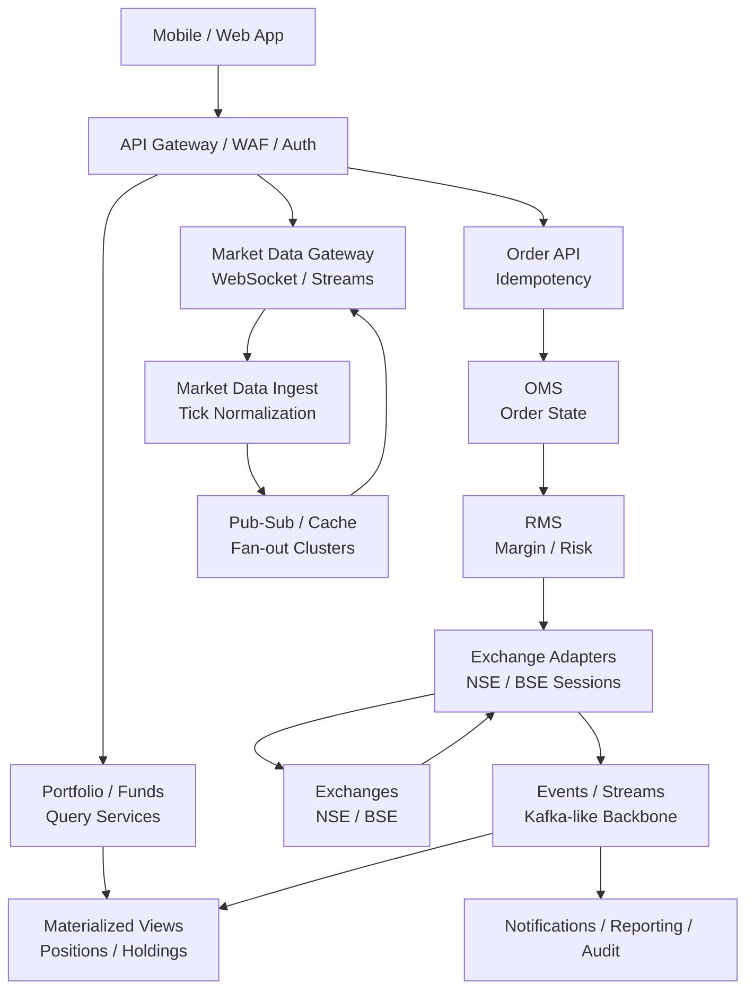
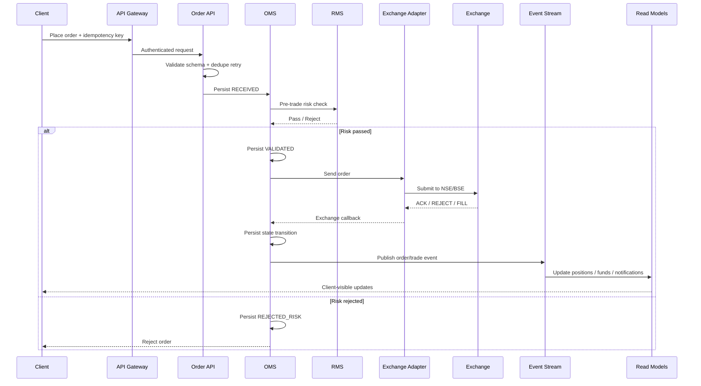
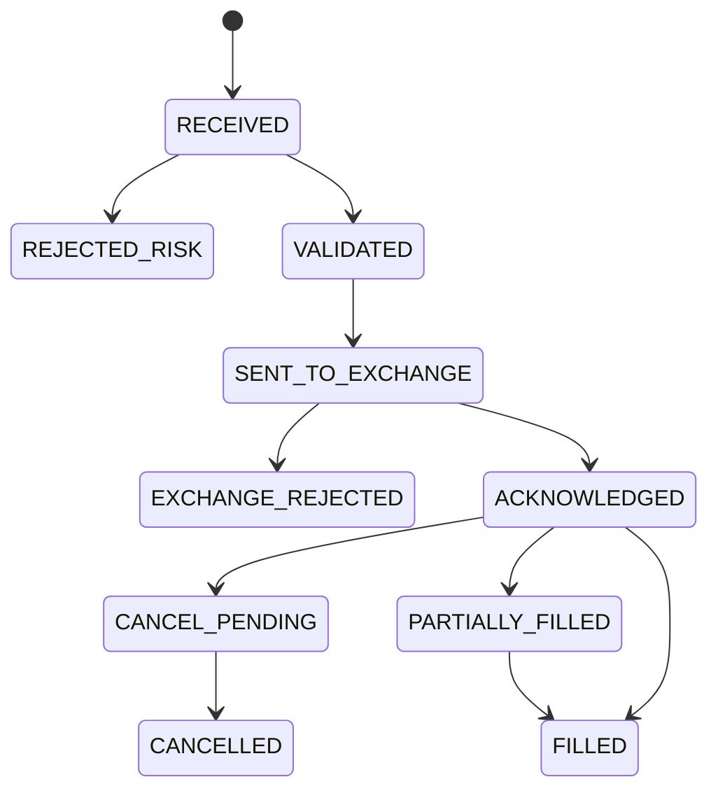
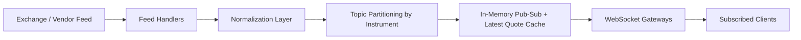
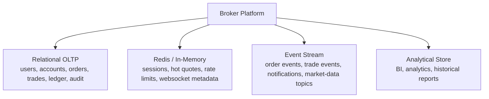

# Architecture: Stock Broking App for Indian Equity Markets

This document is a cleaner, diagram-first architecture view of the stock broking platform described in the main [README](/home/bharat/code/personal/system-design/stock-broking-app/README.md).

It is optimized for:

- whiteboard discussion
- architecture review
- interview deep dives
- fast understanding of data and control flow

## 1. System Goal

Build a broker platform for Indian equity markets that supports millions of users, real-time market data, and low-latency order execution with strong correctness guarantees.

The system must:

- absorb market-open traffic spikes
- keep order placement isolated from quote fan-out load
- preserve auditability for every order and trade
- recover cleanly from partial failures

## 2. Design Principles

1. Separate order path from market data path
2. Keep money-sensitive workflows strongly consistent
3. Use asynchronous propagation for non-critical side effects
4. Design for burst traffic, not average traffic
5. Treat replay and reconciliation as first-class features

## 3. High-Level View



## 4. Major Planes

### Order and Risk Plane

This is the most critical path in the system.

It includes:

- Order API
- OMS
- RMS
- Exchange adapters
- durable event emission

Properties:

- correctness-first
- low latency
- strict audit trail
- fail closed on uncertainty

### Market Data Plane

This is the highest fan-out path.

It includes:

- external feed ingestion
- tick normalization
- quote caching
- websocket subscription management
- real-time fan-out

Properties:

- throughput-first
- horizontally scalable
- tolerant of brief lag
- isolated from order path

### Backoffice and Reporting Plane

This handles slow and heavy workflows.

It includes:

- contract notes
- statements
- reconciliations
- compliance jobs
- support tooling

Properties:

- async
- replayable
- operationally auditable

## 5. Order Placement Sequence



## 6. Order Lifecycle State Machine



Rules:

- every transition is persisted
- every external callback is idempotently processed
- user-visible status comes from OMS, not from transient memory

## 7. Market Data Flow



Design note:
Market data traffic is dominated by read fan-out. The winning architecture is usually in-memory distribution plus lightweight per-connection subscription state.

## 8. Data Ownership

### OMS Owns

- order record
- order timeline
- exchange reference mapping

### RMS Owns

- risk rules
- margin decision inputs
- pre-trade validation outcome

### Funds Service Owns

- user cash balance
- blocked funds
- payout state

### Portfolio Service Owns

- positions read model
- holdings read model
- P&L projections

### Backoffice Owns

- statements
- reconciliation artifacts
- compliance exports

Clear ownership reduces ambiguous writes and broken invariants.

## 9. Storage Layout



## 10. Scaling Strategy

### Scaling Orders

- stateless API and OMS workers
- partitioned persistence
- append-heavy write model
- async downstream consumers

### Scaling Quotes

- sharded websocket gateways
- sticky client sessions when useful
- instrument-topic partitioning
- latest-quote cache

### Scaling Reads

- materialized views for holdings and positions
- cache-first quote reads
- replicas for non-critical queries

## 11. Reliability Strategy

### Multi-AZ

All critical components run across multiple availability zones.

### Durable Recovery

- orders are durably persisted before critical transitions
- event streams allow replay
- read models can be rebuilt
- exchange callback consumers are idempotent

### Reconciliation

Reconciliation is mandatory for:

- exchange executions vs internal trade book
- margin blocks vs ledger
- holdings vs depository truth

## 12. Operational Risk Areas

### Market Open Surge

Risk:
Large spike in concurrent sessions, quote subscriptions, and order requests.

Mitigation:

- pre-scale before 9:00 AM
- warm caches and websocket nodes
- precompute hot margin state
- preserve priority for order traffic

### Duplicate Order Submission

Risk:
Client retries and network ambiguity can create double orders.

Mitigation:

- required idempotency key
- duplicate detection on client order ID
- clear timeline state in UI

### Exchange Connectivity Instability

Risk:
Delayed ACKs, dropped sessions, duplicate callbacks.

Mitigation:

- adapter-level replay logic
- durable outbound order log
- callback deduplication
- state reconciliation before resend

## 13. Security View

```text
User Auth
  -> MFA / device trust

Sensitive APIs
  -> step-up auth

Internal Access
  -> RBAC + audit logs

PII
  -> encrypted and segregated

Secrets
  -> centralized secret manager / KMS
```

## 14. Suggested Whiteboard Structure

In an interview, draw in this order:

1. clients, gateway, and three planes
2. OMS, RMS, exchange adapters
3. market data ingest and websocket fan-out
4. storage layers: OLTP, cache, event bus
5. order lifecycle state machine
6. failure handling and reconciliation

That sequence keeps the discussion structured and avoids premature detail.

## 15. Final Architecture Summary

The architecture works because it isolates correctness-critical trading flows from high-volume market data distribution. OMS and RMS protect the synchronous order path, while event-driven consumers build derived views and notifications asynchronously. The system is intentionally designed around market-open bursts, replayable state transitions, and reconciliation of all important financial outcomes.

## 16. Mermaid Rendering Notes

- Use GitHub, GitLab, Obsidian, or Mermaid Live Editor to render these diagrams directly.
- If an interviewer wants a whiteboard version, use the same four diagrams: high-level topology, order sequence, order state machine, and market data flow.
- Keep labels short in Mermaid blocks; add explanation in surrounding text rather than overloading the nodes.
